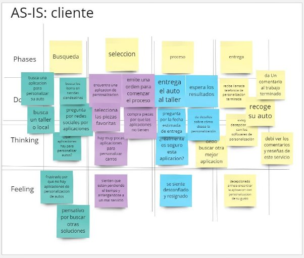
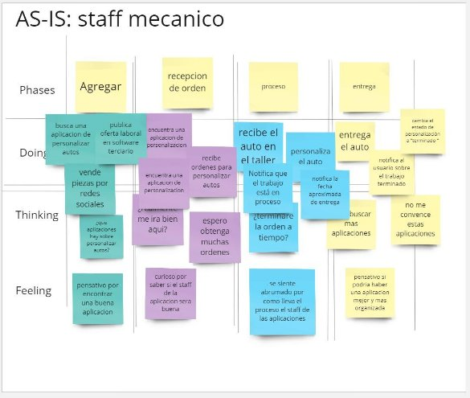

1. **CAPÍTULO II: REQUIREMENTS ELICITATION & ANALYSIS**
   1. **Competidores**
1. **Vorsteiner:** plataforma que mejora cualquier parte de los exteriores de un carro.
1. **Vossen Wheels:** plataforma que permite a los usuarios poder customizar llantas de sus vehículos.
1. **Forgiato:** empresa especializada en la personalización de rines.

**Análisis FODA:**

|
**Fortalezas:**

- Ofrecemos una solución menos costosa en comparación con nuestros competidores.

- Contamos con un equipo comprometido para llevar a cabo la solución.

- Nuestra solución es fácil e intuitiva de usar.

&emsp;
|
**Debilidades:**

- Por el momento tenemos un conocimiento limitado del mercado.

- Tenemos nulo reconocimiento por parte de nuestra posible clientela.

- Nos enfrentamos a costes ajustados en la implementación de la solución.
|
| :- | :- |
|
**Oportunidades:**

- Existe una demanda en el mercado por precios más accesibles.

- Podemos mejorar el diseño de la experiencia del usuario para destacarnos frente a la competencia.

- Existe una falta de presencia de la competencia en redes sociales, lo que nos brinda la oportunidad de destacarnos.
|
**Amenazas:**

- Competidores con algo de renombre en el rubro representan una amenaza para nuestro negocio.

- La aparición constante de nuevos competidores cada año puede afectar nuestra participación en el mercado.
|

1. **Análisis competitivo**

<table><tr><th colspan="6" valign="top"><b>Competitive Analysis Landscape</b></th></tr>
<tr><td rowspan="2" valign="top"><b>¿Por qué llevar a cabo este análisis?</b></td><td colspan="5" valign="top">¿De qué manera podríamos ser una opción preferencial para nuestro público objetivo en comparación a los competidores?</td></tr>
<tr><td colspan="5" valign="top">Para comparar las características tanto internas como externas de los productos que compiten con nosotros.</td></tr>
<tr><td colspan="2"></td><td valign="top">Cartunn</td><td valign="top">Vorsteiner</td><td valign="top">Vossen Wheels</td><td valign="top">Forgiato</td></tr>
<tr><td rowspan="2"><b>Perfil</b></td><td><b>Overview</b></td><td valign="top">Cartunn ofrece servicios de diseño y personalización de interiores y exteriores de vehículos, adaptados a los gustos individuales de cada cliente.</td><td valign="top">Se destaca como una plataforma especializada en la mejora de los aspectos exteriores de los automóviles, elevando su estética y rendimiento</td><td valign="top">Ofrece a los usuarios la oportunidad de personalizar las llantas de sus vehículos con una amplia variedad de opciones de diseño y acabados</td><td valign="top">Con su enfoque especializado en la personalización de rines, proporciona a los clientes una selección diversa de diseños y materiales de alta calidad</td></tr>
<tr><td><b>Ventaja competitiva ¿Qué valor ofrece a los clientes?</b></td><td valign="top">Plataforma intuitiva y fácil de usar, diseñada para satisfacer las necesidades de una amplia gama de usuarios, con precios sorprendentemente accesibles que hacen que la personalización de tu vehículo sea aún más atractiva y accesible para todos los entusiastas del automóvil.</td><td valign="top">La plataforma ofrece una amplia gama de opciones que permiten a los usuarios customizar virtualmente su automóvil de manera completa y detallada, desde el diseño exterior hasta los detalles más íntimos del interior, brindando una experiencia de personalización sin límites y totalmente única.</td><td colspan="2" valign="top">

Dirigidas a un público altamente específico compuesto por verdaderos amantes de los rines y su personalización, estas dos plataformas emergen como los puntos de referencia en el mundo del rin custom y la mejora vehicular. Con un enfoque meticuloso en cada detalle y una comprensión profunda de las aspiraciones de sus usuarios, estas plataformas están meticulosamente diseñadas para satisfacer las demandas más exigentes y los gustos más refinados de aquellos que buscan no solo un automóvil, sino una expresión auténtica de su estilo y personalidad.

</td></tr>
<tr><td rowspan="2">
<b>Perfil</b>

` `<b>de Marketing</b>
</td><td><b>Mercado objetivo</b></td><td colspan="4" valign="top">Amantes de los automóviles que están dispuestos a querer mejorar estéticamente sus vehículos.</td></tr>
<tr><td><b>Estrategias de marketing</b></td><td valign="top">Crecimiento por recomendación, campañas de ads y sponsorización de eventos como coffe&cars</td><td colspan="3" valign="top">La recomendación de anteriores clientes con buenas reseñas del producto/servicio es un testimonio valioso que respalda la calidad y la satisfacción que otros han experimentado. Estas reseñas positivas no solo son un reflejo del compromiso de la empresa con la excelencia y el servicio al cliente, sino que también brindan una tranquilidad adicional a los nuevos clientes que están considerando utilizar el producto o servicio.</td></tr>
<tr><td rowspan="3"><b>Perfil de Producto</b></td><td><b>Productos & Servicios</b></td><td valign="top">
Customización de autopartes,

Reparación de autopartes únicamente customizadas

</td><td valign="top">
Venta de autopartes, Customización de autopartes

</td><td valign="top">
Venta de rines,

Personalización de rines,.

Reparación de rines.
</td><td valign="top">
Venta de rines,

Personalización de rines,.

Reparación de rines.
</td></tr>
<tr><td><b>Precios & Costos</b></td><td valign="top">La elección puede variar considerablemente según una serie de factores que incluyen el estilo personal, las necesidades específicas del vehículo y las preferencias individuales del cliente.</td><td valign="top">Los precios pueden fluctuar dentro de un rango amplio, generalmente entre $1,000 y $4,000, dependiendo de la marca, el diseño y los materiales seleccionados.</td><td valign="top">La decisión final sobre el costo estará influenciada por el modelo del vehículo, así como por el tipo de rin deseado, ya sea deportivo, clásico o de alto rendimiento</td><td valign="top">La decisión final sobre el costo estará influenciada por el modelo del vehículo, así como por el tipo de rin deseado, ya sea deportivo, clásico o de alto rendimiento</td></tr>
<tr><td><b>Canales de distribución (Web y/o Móvil)</b></td><td colspan="4" valign="top">En la actualidad, estas plataformas se enfocan exclusivamente en ofrecer una experiencia a través de su aplicación web, proporcionando a los usuarios un acceso fácil y conveniente desde sus dispositivos de escritorio o portátiles.</td></tr>
<tr><td rowspan="4"><b>Análisis SWOT</b></td><td><b>Fortalezas</b> </td><td valign="top">Producto de alta calidad que cuenta con precios accesibles</td><td valign="top">Uso de fibra de carbono para la creación de las autopartes customizadas</td><td valign="top">

Interfaz visualmente atractiva

</td><td valign="top">Interfaz visualmente atractiva</td></tr>
<tr><td><b>Debilidades</b> </td><td valign="top">Limitado conocimiento del mercado</td><td colspan="3" valign="top">Sus plataformas web tienen un tiempo considerable de carga por la falta de optimización de la misma</td></tr>
<tr><td><b>Oportunidades</b> </td><td valign="top">Demanda en el mercado por precios más accesibles.</td><td colspan="3" valign="top">

Al ser los competidores con más experiencia, podrían aprovechar la misma para ganar más clientela.
</td></tr>
<tr><td><b>Amenazas</b></td><td colspan="4" valign="top">La aparición constante de nuevos competidores cada año puede afectar nuestra participación en el mercado.</td></tr>
</table>

1. **Estrategias y tácticas frente a competidores** 
- **Precios y Modelo de Negocio:** Proponemos un modelo de negocio con tarifas accesibles para nuestros potenciales clientes, lo que nos permitirá destacar entre la competencia.
- **Experiencia del Usuario:** Conscientes de la competencia, buscamos diseñar un sistema intuitivo que pueda ser utilizado por cualquier persona, manteniendo al mismo tiempo un alto nivel de funcionalidad.
- **Estrategia de Marketing y Difusión:** Planeamos lanzar campañas publicitarias en las redes sociales donde se encuentran presentes tanto negocios tradicionales como digitales.
- **Soporte al Cliente:** Nuestro enfoque de soporte al cliente se basará en un chatbot programado para resolver la mayoría de las consultas, con la opción de contactar con personal humano en caso de necesidad.
- **Colaboraciones y Asociaciones:** Nos proponemos establecer colaboraciones y patrocinios en eventos dirigidos a emprendedores, con el fin de generar interés en nuestro sistema.
  1. **Entrevistas**
     1. **Diseño de entrevistas**

        Para realizar los componentes elaboramos las preguntas para obtener información de nuestros segmentos objetivos mediante las entrevistas.

1. ***Preguntas generales:***
   1. ¿Cómo te llamas?
   1. ¿Qué edad tienes?
   1. ¿Dónde vives?
   1. ¿Cuál es tu profesión?

1. ***Preguntas específicas:***

**Segmento objetivo:** Personas que buscan customizar sus autos

1. ¿Has tenido la oportunidad de personalizar tu carro anteriormente? Coméntanos sobre tu experiencia
1. ¿Qué te motiva a personalizar tu auto?
1. ¿Qué dispositivos prefieres utilizar para buscar información sobre la personalización de automóviles?
1. ¿Qué canales digitales usualmente utilizas para obtener ideas para mejorar tu carro?
1. ¿Has presentado alguna mala experiencia al personalizar tu auto en el pasado?
1. ¿Qué es lo que te gustaría que una plataforma de personalización de automóviles solucionara?
1. ¿Qué marcas de vehículos son de tu preferencia?

**Segmento objetivo:** Staff mecánico

1. ¿Qué productos brindas para la personalización de autos?
1. ¿Cuál ha sido tu experiencia trabajando con clientes que buscan personalizar sus autos?
1. ¿Qué canales utilizas para promocionar tus productos?
1. ¿Cómo prefieres interactuar con los clientes interesados en los productos?
1. ¿Has trabajado anteriormente con plataformas de personalización de automóviles?
1. ¿Qué buscas en una aplicación de personalización de carros?
1. ¿Cuáles son las marcas de automóviles con las que tienes mayor experiencia?

1. **Registro de entrevistas**

**Segmento objetivo: Clientes que buscan customizar sus autos**

**Entrevista 1:**

**Entrevistador:** Abraham Israel Ayquipa

**Entrevistado:** Luis Jean Piere Espejo** 

**Duración:** 03:00

**Link: [entrevista.mp4**](https://upcedupe-my.sharepoint.com/:v:/g/personal/u202218475_upc_edu_pe/EZp1DzZM6DZOr8j0VWxJ1cgB8xB14s-o7sRNNm-0kVtLmQ?e=JERfdg&nav=eyJyZWZlcnJhbEluZm8iOnsicmVmZXJyYWxBcHAiOiJTdHJlYW1XZWJBcHAiLCJyZWZlcnJhbFZpZXciOiJTaGFyZURpYWxvZy1MaW5rIiwicmVmZXJyYWxBcHBQbGF0Zm9ybSI6IldlYiIsInJlZmVycmFsTW9kZSI6InZpZXcifX0%3D)**

**Entrevista 2:**

**Entrevistador:** Mariana Alexandra Chambi Mendoza

**Entrevistado:** Sebastian Escobar 

**Duración:** 4:15

**Link: [entrevista**](https://upcedupe-my.sharepoint.com/:v:/g/personal/u202217389_upc_edu_pe/ESfS-tEn1itPtPKBoOREscYBFqkD7V0P7QnoYYEYew7_cA?nav=eyJyZWZlcnJhbEluZm8iOnsicmVmZXJyYWxBcHAiOiJTdHJlYW1XZWJBcHAiLCJyZWZlcnJhbFZpZXciOiJTaGFyZURpYWxvZy1MaW5rIiwicmVmZXJyYWxBcHBQbGF0Zm9ybSI6IldlYiIsInJlZmVycmFsTW9kZSI6InZpZXcifX0%3D&e=Sz2OjQ)**

**Entrevista 3:**

**Entrevistador:** Alexandra Belen Ramos Argüelles

**Entrevistado:** Melany Ramos Argüelles

**Duración:** 04:38

**Link: <https://youtu.be/LxC_n2O_fNA>** 

**Segmento objetivo: Staff mecánico**

**Entrevista 1:**

**Entrevistador:  Franky Mallma Espiritu**

**Entrevistado: Alex Martinez**

**Duración:** 3:09

**Link: <https://youtu.be/BGKFJ98RtPE>** 

**Entrevista 2:**

**Entrevistador:** Natanael David Soto Salis

**Entrevistado:** Eduardo Escalante

**Duración:** 5:28

**Link: [Entrevista - Eduardo Escalante - segmento 2**](https://upcedupe-my.sharepoint.com/:v:/g/personal/u20201c607_upc_edu_pe/ETUukYhBm0RFggzWS9SpNroBNNuvJ4E0MvytyLczJxHYzA?e=XAaWrh&nav=eyJyZWZlcnJhbEluZm8iOnsicmVmZXJyYWxBcHAiOiJTdHJlYW1XZWJBcHAiLCJyZWZlcnJhbFZpZXciOiJTaGFyZURpYWxvZy1MaW5rIiwicmVmZXJyYWxBcHBQbGF0Zm9ybSI6IldlYiIsInJlZmVycmFsTW9kZSI6InZpZXcifX0%3D)**

**Entrevista 3:**

**Entrevistador:** Natanael David Soto Salis

**Entrevistado:** Diego Rafael Cisneros

**Duración:** 3:41

**Link: [Entrevista - Diego Cisneros - Segmento 2](https://upcedupe-my.sharepoint.com/:v:/g/personal/u20201c607_upc_edu_pe/Ee922foWWb5HrnfCZN7R6o8BGmKg_zMlYrQyYo1OUST4Gg?e=rwZKCo)** 

1. ` `**Análisis de entrevistas**

**Segmento #1 clientes:**

**Nombre: Luis Espejo**

**Edad: 19 años**

**Residencia: Surco**

**Educación: Estudiante de derecho en la universidad UPC**

Luis ha personalizado su vehículo anteriormente, haciendo cambios específicos como la suspensión, el color y los rines. Su motivación para personalizar su vehículo parece centrarse en el uso personal y la comodidad, además de reflejar sus gustos y preferencias actuales.

**Preferencias y Herramientas Digitales**

Dispositivos Utilizados: Luis utiliza principalmente su smartphone y computadora para buscar información sobre personalización de vehículos.

Canales Digitales: Usa internet y menciona específicamente a Facebook y el Marketplace como medios para obtener ideas y realizar modificaciones en su vehículo.

**Desafíos y Problemas Encarados**

Luis ha enfrentado problemas con la calidad de los materiales y servicios recibidos, mencionando una experiencia negativa con la suspensión, el color y los rines que no cumplían sus expectativas.

Además, señala problemas con una aplicación de personalización de vehículos que se trabaja frecuentemente y no le brinda la confianza deseada.

**Expectativas y Sugerencias**

Luis espera que las plataformas de personalización de vehículos sean más fluidas, sin trabas, y que ofrezcan una variedad de accesorios claramente categorizados.

**Reflexión**

Luis es un joven estudiante interesado en la personalización de vehículos como una forma de expresión personal y mejora de la comodidad. Sus experiencias anteriores le han enseñado la importancia de la calidad y la confiabilidad, tanto en los productos como en las plataformas utilizadas para la personalización. Él resalta la necesidad de plataformas intuitivas y eficientes que puedan manejar información y transacciones sin errores.

.

**Perfil del Entrevistado**

**Nombre: Sebastián Escobar**

**Edad: 19 años**

**Residencia: Lima, en ATE**

**Educación: Estudiante de ingeniería de software**

**Experiencia con la Personalización de Automóviles**

Sebastián describe su experiencia de personalización de automóviles como emocionante y divertida, destacando que realizó modificaciones estéticas y añadió accesorios que mejoran tanto la apariencia como el rendimiento de su vehículo.

M**otivaciones para la Personalización**

La motivación principal de Sebastián para personalizar su auto es hacerlo único y reflejar su personalidad. Además, busca mejorar el rendimiento y la funcionalidad del vehículo para adaptarlo a sus gustos personales.

**Herramientas y Canales Digitales Utilizados**

Sebastián utiliza principalmente su ordenador y, en ocasiones, su teléfono móvil.

Fuentes de información: Consulta revistas, periódicos y participa en foros en línea con especialistas y la comunidad que comparten ideas sobre personalización.También utiliza YouTube para encontrar tutoriales detallados y videos sobre personalización de automóviles, y sigue cuentas en redes sociales como Instagram para inspiración y nuevas ideas.

**Experiencias Negativas y Desafíos**

Aunque Sebastián no ha tenido experiencias negativas personales significativas en la personalización de su auto, es consciente de los problemas que otros han enfrentado, como piezas de baja calidad o instalaciones deficientes. Esto lo motiva a investigar y seleccionar cuidadosamente los productos y servicios.

Expectativas de una Plataforma de Personalización

Sebastián desea que una plataforma de personalización de automóviles ofrezca una amplia gama de productos de calidad y servicios confiables. Valora la idea de una comunidad activa donde los usuarios puedan compartir experiencias y consejos, así como herramientas interactivas para visualizar posibles modificaciones en el vehículo antes de realizarlas.

**Preferencias de Marcas**

Prefiere marcas como Toyota, destacando la calidad de rendimiento y las opciones de prevención que ofrecen.

**Reflexión**

La entrevista revela que Sebastián es un joven apasionado por la personalización de automóviles, enfocado en la calidad y la individualización. Sus comentarios proporcionan insights valiosos para el proyecto, subrayando la importancia de la calidad, la personalización y el soporte.

**Perfil del Entrevistado**

**Nombre: Melanie Ramos**

**Edad: 27 años**

**Residencia: Villa María del Triunfo**

**Profesión: Ingeniera de software**

**Experiencia y Motivación para la Personalización**

Aunque Melanie aún no ha personalizado su automóvil, muestra un fuerte interés en hacer modificaciones visuales, como cambiar el color y agregar imágenes, así como mejoras internas.

Su motivación para personalizar el auto proviene de un deseo de que el vehículo refleje su personalidad y gustos personales. 

**Herramientas y Canales Digitales Utilizados**

Dispositivos: Melanie utiliza principalmente su celular, computadora y, raramente, su iPad para buscar información sobre personalización.

Fuentes de información: Usa Google y TikTok para obtener ideas y también consulta con su mecánico para obtener asesoramiento técnico.

**Experiencias y Desafíos**

Melanie menciona no haber personalizado su auto todavía pero ha tenido problemas con la reparación del vehículo debido a la falta de un mecánico de confianza en el pasado. Esto subraya la importancia de la fiabilidad y la confianza en los servicios relacionados con su vehículo.

Expectativas de una Plataforma de Personalización

Espera que una plataforma de personalización de automóviles le ofrezca sugerencias personalizadas, como mostrar una variedad de colores y cómo estos podrían lucir en su vehículo. También le gustaría ver comparativas sobre mejoras internas y sugerencias sobre qué podría añadir o mejorar en su auto.

**Preferencias de Marcas de Vehículos**

Posee un Suzuki y expresa preferencia por marcas como Toyota y Hyundai, valorando la disponibilidad y facilidad de encontrar repuestos. También menciona a Nissan como una marca de interés.

**Reflexión**

Melanie busca una experiencia de personalización que combine la estética con mejoras funcionales, reflejando su enfoque práctico como ingeniera de software. Su enfoque en la fiabilidad y el soporte técnico destaca la necesidad de una plataforma que ofrezca no solo opciones de personalización, sino también información confiable y accesible sobre el mantenimiento y la mejora de vehículos.

**Segmento #2 Staf mecanico:**

**Perfil del Entrevistado**

**Nombre: Alex Martinez**

**Edad: 20 años**

**Residencia: Santa Anita**

**Profesión: Técnico especialista en Automotriz**

Servicios Ofrecidos

El técnico ofrece personalización de autos, incluyendo kits de carrocería, sistemas de escape de alto rendimiento, y alerones. Se enfoca en mejorar tanto la estética como el rendimiento del motor de los vehículos.

Experiencia con Clientes

La experiencia del técnico con los clientes ha sido positiva, trabajando en proyectos que varían desde modificaciones menores hasta transformaciones completas de vehículos. Esto implica cambios significativos en la apariencia y el rendimiento del automóvil.

Canales de Promoción y Comunicación

Promoción: Utiliza principalmente redes sociales como Facebook y WhatsApp para promocionar sus productos y servicios.

Interacción con Clientes: Prefiere interactuar directamente con los clientes, ya sea en persona, por teléfono o mediante mensajes directos a través de las redes sociales.

Experiencia con Plataformas de Personalización

A pesar de su experiencia en personalización, no ha utilizado plataformas de personalización de autos en línea; siempre ha trabajado en locales y talleres físicos.

Expectativas de una Plataforma de Personalización de Autos

El técnico estaría interesado en una aplicación que permita a los usuarios explorar diferentes modificaciones y acceder a una comunidad de profesionales y entusiastas del automovilismo para intercambiar ideas y conocimientos.

Marcas de Automóviles con Mayor Experiencia

Ha trabajado principalmente con marcas como Nissan, Toyota y Kia, personalizando modelos como sedanes y corolas.

Reflexión

Este técnico especialista representa una perspectiva práctica y directa en el campo de la personalización de automóviles. Su enfoque en la interacción personal y el uso limitado de plataformas digitales sugiere una preferencia por métodos tradicionales de trabajo, aunque muestra interés en las posibilidades que una plataforma digital podría ofrecer para la colaboración y el intercambio de ideas. Esto indica una posible área de oportunidad para desarrollar herramientas que faciliten la conexión entre profesionales del sector automotriz y entusiastas de la personalización de vehículos.

**Perfil del Entrevistado**

**Nombre: Eduardo Guimarães**

**Edad: 23 años**

**Residencia: Lima, en el distrito de Surco**

**Profesión: Mecánico automotriz**

**Servicios de Personalización**

Eduardo menciona que la personalización más popular entre sus clientes es la variedad de colores para los autos, que es el producto más vendido. Además, ofrece servicios para cambiar repuestos según las necesidades específicas de cada vehículo.

**Herramientas y Canales de Comunicación**

Dispositivos Utilizados: Utiliza principalmente su teléfono Android para comunicarse con sus clientes.

Navegador de Preferencia: Prefiere usar Google Chrome por su confiabilidad y popularidad.

Comunicación con Clientes: Utiliza WhatsApp y redes sociales, destacando que maneja un catálogo en WhatsApp y promociona sus servicios en Facebook.

**Experiencia con Clientes**

Eduardo describe que ha tenido experiencias variadas con los clientes, con algunos que aprecian su trabajo y otros que no quedan completamente satisfechos. Sin embargo, indica que generalmente logra que los clientes estén contentos con el resultado final.

**Promoción y Interacción con Clientes**

Promueve sus productos y servicios a través de WhatsApp y Facebook, y está abierto a explorar otras soluciones tecnológicas que puedan mejorar la interacción con los clientes y acortar los tiempos de respuesta.

**Plataformas de Personalización**

Hasta ahora, Eduardo no ha utilizado plataformas específicas de personalización de automóviles más allá de WhatsApp para la comunicación. Muestra interés en una aplicación que permita a los clientes seguir el estado de la personalización de sus vehículos, lo que podría aumentar la satisfacción del cliente al reducir la incertidumbre y mejorar la experiencia general.

**Preferencias y Expectativas Futuras**

Eduardo busca una aplicación que ofrezca seguimiento en tiempo real del estado de la personalización, lo que sugiere que valora la transparencia y la eficiencia en el servicio al cliente. Esto indica una oportunidad para el desarrollo de herramientas digitales que mejoren la gestión y el seguimiento de los proyectos de personalización.

En resumen, Eduardo es un mecánico que combina técnicas tradicionales con el uso de herramientas digitales modernas para comunicarse y gestionar sus servicios de personalización de automóviles. Está interesado en adoptar nuevas tecnologías que mejoren la interacción con los clientes y la gestión de sus proyectos.

**Perfil del Entrevistado**

**Nombre: Diego Rafael**

**Edad: 25 años**

**Residencia: Chorrillos**

**Profesión: Mecánica automotriz**

**Herramientas y Dispositivos Utilizados**

Diego utiliza un dispositivo especializado para diagnosticar el estado de los automóviles, lo cual le permite detectar problemas mecánicos de forma precisa.

También usa su celular para la gestión de clientes y comunicación.

**Navegador de Preferencia**

Prefiere utilizar Microsoft Edge para sus necesidades de navegación en internet.

**Servicios de Personalización**

Ofrece una variedad de productos para personalizar autos, incluyendo partes de carrocería y neumáticos. También trabaja con motores, aunque indica que estos son pedidos más complejos.

**Experiencia con Clientes**

La mayoría de sus experiencias con clientes han sido positivas, especialmente porque estos clientes suelen estar entusiasmados con la personalización de sus autos y tienen ideas claras de lo que quieren.

**Canales de Promoción**

Diego promociona sus productos y servicios principalmente a través de anuncios en Facebook e Instagram, y ocasionalmente usa WhatsApp para contactar clientes activos.

Interacción con Clientes

Prefiere interactuar con los clientes a través de llamadas de voz o mensajes de WhatsApp, destacando la rapidez y eficiencia de este último.

**Plataformas de Personalización**

Hasta ahora, Diego no ha trabajado con plataformas digitales específicas de personalización de automóviles.

**Expectativas de una Aplicación de Personalización**

Está interesado en una aplicación que ofrezca una amplia selección de partes que puedan ser filtradas por tipo de auto, modelo y tipo de partes, facilitando así la personalización según las especificaciones del cliente.

**Marcas de Automóviles con Mayor Experiencia**

Ha trabajado con muchas marcas, pero menciona específicamente que algunas, como Subaru y Honda , son más fáciles de manipular.

**Reflexión**

Diego Rafael es un profesional apasionado por la mecánica y personalización de automóviles, que utiliza tanto herramientas modernas de diagnóstico como métodos de comunicación avanzados para mejorar la interacción con sus clientes y eficientizar su trabajo. La entrevista destaca su adaptabilidad y su enfoque en proporcionar servicios personalizados que cumplan con las expectativas claras y entusiastas de sus clientes.

**Tabla de porcentajes con los 2 segmentos objetivos:**

1. **Needfinding**

Con el propósito de desarrollar una app que satisfaga las necesidades particulares de los usuarios, CarTunn llevará a cabo la identificación del User persona, User Task Matrix, User Journey Maps y Empathy Mapping.

1. **User Personas**

   Para esta sección se presentan personajes ficticios, uno de acuerdo a cada segmento objetivo. La información que se ha utilizado para elaborar los User personas se obtuvo de las entrevistas realizadas previamente a cada segmento objetivo. La intención de las entrevistas era conocer un poco más a las personas a las que la aplicación está dirigida. Entre la información de las entrevistas que fue utilizada tenemos demografía, metas, motivaciones, frustraciones, marcas relacionadas con el tema que envuelve a la aplicación, canales digitales que más utiliza, etc. Para la creación de esta sección se utilizó la plataforma UXPressia.

   **Segmento objetivo: Clientes que buscan customizar sus autos**

   [**https://uxpressia.com/w/DeRZM/p/7vFyy](https://uxpressia.com/w/DeRZM/p/7vFyy)** 

**Segmento objetivo: Staff mecánico**

[**https://uxpressia.com/w/DeRZM/p/h3zhF](https://uxpressia.com/w/DeRZM/p/h3zhF)** 

1. **User Task Matrix**

"En esta sección se presenta el user task matrix, herramienta centrada en los segmentos objetivos (cliente y staff mecánico), que nos permitirá identificar las tareas y objetivos claves de los usuarios. Además, nos permitirá priorizar características y funcionalidades al momento de realizar el product backlog. Para la frecuencia se han considerado cinco opciones:nunca ,casi nunca, a veces, a menudo ,siempre; y para la importancia tres opciones: bajo, medio, alto"

<table><tr><th rowspan="2" valign="top"><b><i>User task Matrix</i></b></th><th colspan="2" valign="top"><b><i>Juan Velasquez</i></b></th><th colspan="2" valign="top"><b><i>Esteban Dominguez</i></b></th></tr>
<tr><td valign="top"><b><i>Frecuencia</i></b></td><td valign="top"><b><i>Importancia</i></b></td><td valign="top"><b><i>Frecuencia</i></b> </td><td valign="top"><b><i>Importancia</i></b></td></tr>
<tr><td>Buscar un web site de taller de personalización de autos</td><td><b><i>A menudo</i></b></td><td><b><i>Alta</i></b></td><td><b><i>Casi nunca</i></b></td><td><b><i>Baja</i></b></td></tr>
<tr><td>Elegir y comprar las piezas a desear para la personalización de autos</td><td><b><i>Siempre</i></b></td><td><b><i>Alta</i></b></td><td><b><i>Nunca</i></b></td><td><b><i>Baja</i></b></td></tr>
<tr><td>Marcar como favorito las piezas deseadas</td><td><b><i>A veces</i></b></td><td><b><i>Baja</i></b></td><td><b><i>Nunca</i></b></td><td>` `<b><i>Baja</i></b></td></tr>
<tr><td>Realizar una orden para cambiar la pieza elegida</td><td><b><i>Siempre</i></b></td><td><b><i>Alta</i></b></td><td><b><i>Nunca</i></b></td><td><b><i>Baja</i></b></td></tr>
<tr><td>Enviar notificacion de estado de personalizacion</td><td><b><i>Nunca</i></b></td><td><b><i>Baja</i></b></td><td><b><i>Siempre</i></b></td><td><b><i>Alta</i></b></td></tr>
<tr><td>Ver la lista de autos y el estado de la personalización</td><td><b><i>Nunca</i></b></td><td><b><i>Baja</i></b></td><td><b><i>Siempre</i></b></td><td><b><i>Alta</i></b></td></tr>
<tr><td>Escribir una observación en cada servicio de tunning</td><td><b><i>Nunca</i></b></td><td><b><i>Baja</i></b></td><td><b><i>A veces</i></b></td><td><b><i>Baja</i></b></td></tr>
<tr><td>Cambiar estado (fecha de entrega) si hay inconvenientes al personalizar el auto</td><td><b><i>Nunca</i></b></td><td><b><i>Baja</i></b></td><td><b><i>Casi nunca</i></b></td><td><b><i>Baja</i></b></td></tr>
<tr><td>Insertar una nueva pieza de personalización a la aplicación</td><td><b><i>Nunca</i></b></td><td><b><i>Baja</i></b></td><td><b><i>Siempre</i></b></td><td><b><i>Alta</i></b></td></tr>
</table>

Las tareas brindan una visión clara sobre las prioridades y comportamientos de dos segmentos objetivos distintos dentro del contexto de un taller de personalización de autos: Juan Velásquez, representando al cliente, y Esteban Domínguez, representando al staff mecánico. Al analizar las tareas con mayor frecuencia y mayor importancia, es posible identificar puntos clave que pueden ayudar a dirigir el desarrollo del producto y la estrategia de servicio.

Esto sugiere que el proceso de selección y compra de piezas es fundamental para su experiencia como usuario. En contraste, para Esteban, las tareas con alta frecuencia y alta importancia son "Enviar notificación de estado de personalización" y "Ver la lista de autos y el estado de la personalización", además de "Insertar una nueva pieza de personalización a la aplicación". Esto indica un enfoque en la gestión y comunicación del progreso de la personalización, así como en la actualización del inventario de piezas disponibles.

Una coincidencia notable entre ambos usuarios es la alta valoración de tareas específicas, aunque para diferentes propósitos. Mientras Juan se concentra en el aspecto de selección y adquisición, Estebanse enfoca en la gestión interna y la comunicación con el cliente.

1. **User Journey Mapping**

En esta sección se presentarán los user journey mapping para cada user persona). El journey comienza en el momento en que el cliente busca una aplicación de personalización de autos, lo que lo lleva a través de este software a disposición. De esta manera, el cliente elige y compra la pieza a personalizar. Luego, realiza una orden de personalización y el staff le notifica  la fecha estimada del trabajo terminado. Por ende, el cliente lleva su auto al taller. Este journey finaliza cuando el staff mecánico notifica al cliente que el trabajo está terminado. Finalmente, el cliente recibe su auto con la personalización deseada y da una reseña y comentario al staff.

**User Journey Mapping: Cliente**

**User Journey Mapping: Staff**

1. **Empathy Mapping**

   En esta sección se presentarán los empathy mapping de acuerdo a los user persona que se realizaron, teniendo en cuenta los dos segmentos objetivos. El empathy mapping será de utilidad debido a que podemos conocer a mayor detalle a nuestros clientes, lo que nos permite mejorar algunos aspectos de la aplicación.

   **Segmento objetivo: Clientes que buscan customizar sus autos**

[**https://uxpressia.com/w/DeRZM/p/6tcWn](https://uxpressia.com/w/DeRZM/p/6tcWn)** 

**Segmento objetivo: Staff mecánico**

[**https://uxpressia.com/w/DeRZM/p/G0tpM](https://uxpressia.com/w/DeRZM/p/G0tpM)** 

1. **As-is Scenario Mapping**

En esta sección se presenta el As-Is Scenario Mapping para el segmento objetivo donde se identifican y comprenden los puntos de contacto del usuario. Para la elaboración se usó Miro.

**As-is scenario Mapping : Cliente**

[**https://miro.com/welcomeonboard/NDFUcUtZQU9SWkZ4SDhKUnNoR0RFVjhWTWZnTFNGd245YVBzZU1UQkxsR3E2WjFaMURtZXY3QjRDeG1DYW53cXwzNDU4NzY0NTUxNzYxNjYxMjg2fDI=?share_link_id=418419123921](https://miro.com/welcomeonboard/NDFUcUtZQU9SWkZ4SDhKUnNoR0RFVjhWTWZnTFNGd245YVBzZU1UQkxsR3E2WjFaMURtZXY3QjRDeG1DYW53cXwzNDU4NzY0NTUxNzYxNjYxMjg2fDI=?share_link_id=418419123921)** 
**

Áreas Positivas:

Anhela encontrar la aplicación con personalización de su gusto

Busca una aplicación para personalizar su auto.

Áreas Negativas:

Frustrado porque no hay aplicaciones de personalización de autos.

Se siente desconfiado y resignado.

Siente que está perdiendo el tiempo y arriesgándose a un mal servicio.

Blank Areas (Áreas que requieren aprender más):

es necesario ver porque los personalizadores ofrecen un servicio a medias.

**As-is scenario mapping : Staff mecanico**

[**https://miro.com/welcomeonboard/NDFUcUtZQU9SWkZ4SDhKUnNoR0RFVjhWTWZnTFNGd245YVBzZU1UQkxsR3E2WjFaMURtZXY3QjRDeG1DYW53cXwzNDU4NzY0NTUxNzYxNjYxMjg2fDI=?share_link_id=418419123921](https://miro.com/welcomeonboard/NDFUcUtZQU9SWkZ4SDhKUnNoR0RFVjhWTWZnTFNGd245YVBzZU1UQkxsR3E2WjFaMURtZXY3QjRDeG1DYW53cXwzNDU4NzY0NTUxNzYxNjYxMjg2fDI=?share_link_id=418419123921)** 

Áreas Positivas:

Anhela encontrar una aplicación para personalización de autos

Áreas Negativas:

abrumado por ver como los staff de las aplicaciones llevan el proceso de personalización de autos.

Blank Areas (Áreas que requieren aprender más):

Es necesario ver porque los personalizadores ofrecen un servicio con malos procesos.

**2.4. Ubiquitous Language**

En esta sección, nos enfocaremos en definir los términos que serán utilizados a lo largo del proyecto. El propósito es asegurar que todos los miembros del equipo y las partes interesadas comprendan de manera uniforme estos términos.

- Automotive customization (Personalización automotriz): El proceso de modificar, mejorar o cambiar aspectos de un vehículo para adaptarlo a las preferencias y necesidades del propietario.
- Accessories (Accesorios): Componentes adicionales que se pueden instalar en un vehículo para mejorar su aspecto, rendimiento o funcionalidad.
- Customization services (Servicios de personalización): Actividades realizadas por staffs mecánicos para modificar o mejorar aspectos específicos de un vehículo según las preferencias del cliente.
- Mechanical staff (Staff mecánico): Profesionales especializados en la personalización automotriz, que ofrecen sus servicios a través de la plataforma.
- Expert advice (Asesoramiento experto): Orientación proporcionada por profesionales de la personalización automotriz dentro de la plataforma, para ayudar a los usuarios a tomar decisiones informadas sobre sus opciones de personalización.
- Notify suppliers (Informar a los proveedores): El proceso de comunicar a los proveedores sobre las necesidades de productos o servicios para la personalización de vehículos dentro de la plataforma CarTunn.
- Report (Reporte): Documento que proporciona información detallada sobre transacciones, actividades o problemas dentro de la plataforma CarTunn, utilizado para análisis y toma de decisiones.
- Orders (Órdenes): Solicitudes realizadas por los usuarios dentro de la plataforma CarTunn para adquirir productos o servicios de personalización automotriz.
- Tuning (Ajuste): Proceso de mejorar el rendimiento, la apariencia o las características de un vehículo mediante modificaciones dentro de la plataforma.
- Mechanical workshop (Taller mecánico): Establecimiento donde se realizan actividades de personalización y mantenimiento automotriz, asociado a la plataforma para ofrecer servicios a los usuarios.
- Customization (Customización): Proceso de cambiar aspectos específicos de un vehículo para adaptarlo a las preferencias del propietario, realizado a través de la plataforma.
- Car (Carro): Medio de transporte terrestre que puede ser modificado o personalizado mediante la plataforma CarTunn para satisfacer las necesidades y preferencias del propietario.

