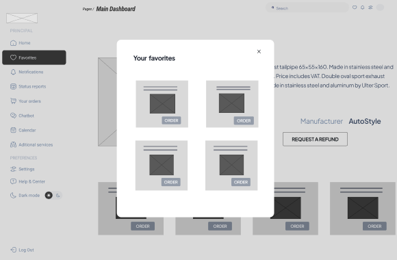
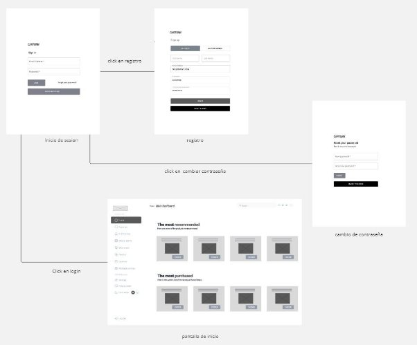
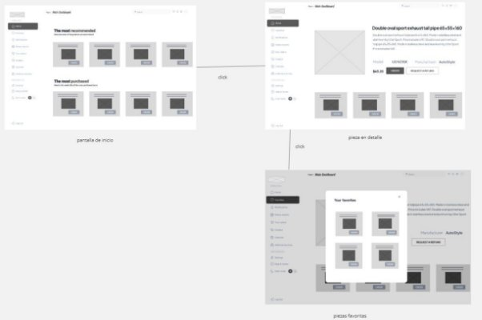
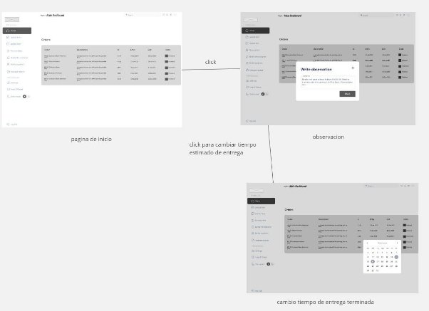
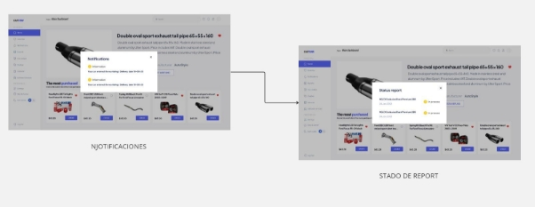
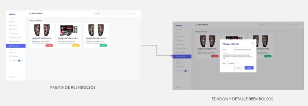
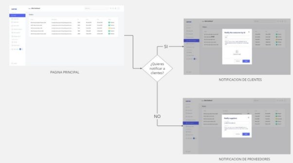



**Universidad Peruana de Ciencias Aplicadas**

Ingeniería de software

Desarrollo de Aplicaciones Open Source

SW51

**Informe del Trabajo Final**

Angel Augusto Velasquez Nuñez

The coders*  

*“CarTunn”*

|**Integrantes**|**Código**|
| :-: | :-: |
|Ayquipa Ubaldo, Abraham Israel|U202218475|
|Chambi Mendoza, Mariana Alexandra|U202217389|
|Soto Salis, Natanael David|U20201C607|
|Ramos Argüelles, Alexandra Belen|U202215164|
|Mallma Espiritu, Franky Oswald|U20211C250|

Marzo de 2024-01

**Registro de Versiones del Informe**
**

|**Versión**|**Fecha**|**Autor**|**Descripción de modificación**|
| :-: | :-: | :-: | :-: |
|#01|08/04/2024|Todos los participantes|Elaboración del capítulo 1: Introducción|

# **Índice**	

1. Capítulo I: Introducción
   1. Startup Profile 
      1. Descripción de la Startup 
      2. Perfiles de integrantes del equipo
   2. Solution Profile
      1. Antecedentes y problemática
      2. Lean UX Process
         1. Lean UX Problem Statements
         2. Lean UX Assumptions
         3. Lean UX Hypothesis Statements
         4. Lean UX Canvas
   3. Segmentos objetivo
2. Capítulo II: Requirements Elicitation & Analysis
   1. Competidores
      1. Análisis competitivo
      2. Estrategias y tácticas frente a competidores 
   2. Entrevistas
      1. Diseño de entrevistas
      2. Registro de entrevistas
      3. Análisis de entrevistas
   3. Needfinding
      1. User Personas
      2. User Task Matrix
      3. User Journey Mapping
      4. Empathy Mapping
      5. As-is Scenario Mapping
3. Capítulo III: Requirements Specification 
   1. To-Be Scenario Mapping. 
   2. User Stories. 
   3. Impact Mapping. 
   4. Product Backlog.
4. Capítulo IV: Product UX/UI Design 
   1. Style Guidelines. 
      1. General Style Guidelines. 
      2. Web Style Guidelines.
      3. Mobile Style Guidelines. 
         1. iOS Mobile Style Guidelines. 
         2. Android Mobile Style Guidelines. 
   2. Information Architecture.
      1. Organization Systems. 
      2. Labeling Systems. 
      3. SEO Tags and Meta Tags. 
      4. Searching Systems.
      5. Navigation Systems 
   3. Landing Page UI Design. 
      1. Landing Page Wireframe. 
      2. Landing Page Mock-up. 
   4. Web Applications UX/UI Design.
      1. Web Applications Wireframes.
      2. Web Applications Wireflow Diagrams. 
      3. Web Applications Mock-ups.
      4. Web Applications User Flow Diagrams.
   5. Web Applications Prototyping.
   6. Domain-Driven Software Architecture.
      1. Software Architecture Context Diagram.
      2. Software Architecture Container Diagrams
      3. Software Architecture Components Diagrams.
   7. Software Object-Oriented Design.
      1. Class Diagrams
      2. Class Dictionary
   8. Database Design.
      1. Database Diagram
5. Capítulo V: Product Implementation, Validation & Deployment
   1. Software Configuration Management. 
      1. Software Development Environment Configuration.
      2. Source Code Management.
      3. Source Code Style Guide & Conventions.
      4. Software Deployment Configuration. 
   2. Landing Page, Services & Applications Implementation.
      1. Sprint
         1. Sprint Planning 1.
         2. Sprint Backlog 1.
         3. Development Evidence for Sprint Review.
         4. Testing Suite Evidence for Sprint Review.
         5. Execution Evidence for Sprint Review.
         6. Services Documentation Evidence for Sprint Review.
         7. Software Deployment Evidence for Sprint Review.
         8. Team Collaboration Insights during Sprint.
6. Conclusiones, Bibliografía, anexos

**Student Outcome**

|**Criterio Específico**|**Acciones Realizadas**|**Conclusiones**|
| :- | :- | :- |
|La capacidad de identificar, formular y resolver problemas complejos de ingeniería aplicando los principios de ingeniería, ciencia y matemática.|
**Ayquipa Ubaldo Abraham**

**TB1**

** Durante nuestro proyecto, mi contribución al equipo fue bajo el enfoque de establecer una base sólida y coherente. Mi participación en la descripción de la Startup sentó las bases para comprender nuestra misión y objetivos. A través del análisis de competidores, proporcioné valiosa información sobre el panorama del mercado, permitiendo que tomáramos decisiones informadas. Además, lideré las entrevistas con usuarios, lo que nos brindó una comprensión profunda de sus necesidades y preferencias. Mis esfuerzos en la creación de style guidelines garantizaron una experiencia de usuario consistente y atractiva. Asimismo, desarrollé el mockup de la landing page para visualizar nuestra propuesta de manera efectiva. Además, mi trabajo en el diagrama de la base de datos y la gestión de la configuración del software aseguraron una estructura eficiente y colaborativa para el proyecto. En conjunto, mi aporte ayudó a unificar nuestros esfuerzos y llevar el proyecto hacia el éxito.

**Chambi Mendoza Mariana**

**TB1**

Para esta primera entrega, comencé aplicando el Lean UX Canvas y llevando a cabo entrevistas con nuestros usuarios y stakeholders clave. A partir de estos insights, comuniqué estrategias y ajustes fundamentales para asegurar una alineación efectiva y la adaptabilidad de nuestro proyecto de ingeniería. Esto implicó realizar un análisis exhaustivo de antecedentes y problemas, así como desarrollar todo el proceso de Lean UX para guiar nuestras acciones. Además, contribuí al diseño del Information Architecture, trabajando en los sistemas de organización, etiquetado, SEO, búsqueda y navegación, y elaboré wireframes para las páginas de destino. También desempeñé un papel clave en la creación del diagrama de clases, el diccionario de clases y la estructura de la base de datos, sentando las bases para una ejecución cohesiva y orientada al usuario de nuestro proyecto.

**Soto Salis Natanael David**

**TB1**

Para esta entrega, tuvo la responsabilidad de entrevistar a los usuarios del segundo segmento. De acuerdo a esta entrevista recopile datos que son importantes para el diseño de la aplicación, identificar las funcionalidad que necesita el usuario. También realice los sprints backlog. Con esto, se evidencia la colaboración del equipo en el desarrollo de landing page y todo lo que conlleva a su interfaz que también fue diseñada con el fin de informar y atraer a los usuarios a usar nuestra aplicación.

 **Ramos Argüelles Alexandra**

**TB1**

Como parte integral de nuestro proceso de desarrollo, hemos abordado cada etapa de la TB1 exhaustivamente. En lo que respecta a mi persona, he brindado ayuda en la sección de Lean UX Canvas tomando toda la información que brindó mi equipo. Realicé el diseño de las entrevistas en lo que respecta a las preguntas y el vídeo de entrevista para poder recolectar información de nuestros segmentos objetivos. A partir de esta recolección de datos y todos los análisis correspondientes pude realizar la creación de los empathy maps, creamos los perfiles detallados de usuarios para informar nuestro diseño. Con estos insights, desarrollamos las historias de usuario, los impact maps y el product backlog para guiar nuestra estrategia de desarrollo.  Con respecto al diseño, también se trabajó de manera colaborativa para el diseño de la Landing Page. 

**Mallma Espiritu Franky**

**TB1**

En el transcurso de nuestro proyecto, mi aporte al equipo fue de soporte y ayuda en documentación de los compañeros de trabajo. Mi involucración en el proyecto fue agilizar el tiempo de termino de la Tb1.Al realizar los journey mapping facilito el desarrollo de los siguientes puntos del informe.También hice los As-is y To-be para ayudar a identificar las necesidades y soluciones de cada segmento.. Igualmente,diseñe los diagram flow de los mockup para proveer una visualización del paso a paso de como funciona la aplicación. Mi labor en el modelo C4 propició una infraestructura eficaz y colaborativa para nuestro proyecto. Globalmente, mi contribución fue clave para integrar nuestros esfuerzos y apoyar al proyecto de forma satisfactoria.

|Se identificó un problema y se trabaja en su solución.|
|Elaborar una propuesta de solución a una problemática o lograr mejora de una solución ya existente a través de la innovación.** |
**Ayquipa Ubaldo Abraham**

**TB1**

** Demostré mi capacidad para abordar problemas complejos de ingeniería mediante la aplicación de principios científicos y matemáticos, fusionando tareas clave en mi proyecto actual. Al crear un análisis de competidores, fortalecí la dirección y cohesión del proyecto con una visión clara y un enfoque competitivo. Integré la descripción de la startup, entrevistas, style guidelines, mockups de la landing page, diagrama de base de datos y gestión de software para lograr un desarrollo efectivo. Mi habilidad para gestionar múltiples aspectos del proyecto destaca mi capacidad para enfrentar desafíos en entornos dinámicos.

**Chambi Mendoza Mariana**

**TB1**

Identifiqué un desafío considerable en cuanto al rendimiento y escalabilidad de nuestro sistema, y formulé una solución innovadora mediante la optimización de nuestra arquitectura de backend y la implementación de microservicios. Esta iniciativa resultó en una mejora significativa en la capacidad de respuesta y escalabilidad del sistema, siendo fundamental para gestionar un aumento en el volumen de usuarios simultáneos sin afectar la experiencia del usuario.

**Soto Salis Natanael**

**TB1**

En esta entrega, desarrollamos una solución que ayuda a los usuarios a mejorar la personalización de autos. En este proyecto se busca innovar este proceso con el desarrollo de una aplicación web. En este proyecto usamos técnicas de diseño para la interfaz que debe ser fácil de usar por el usuario.

**Ramos Argüelles Alexandra**

**TB1**

En el proceso de desarrollo, lideré la sección de Lean UX Canvas y diseñé las entrevistas para obtener información valiosa de nuestros usuarios. Utilicé estos datos para crear empathy maps y perfiles de usuarios detallados, que guiaron nuestro enfoque de diseño. Además, contribuí en la elaboración de historias de usuario, impact maps y el product backlog. Colaboré en el diseño de la Landing Page para asegurar su alineación con las necesidades de los usuarios. Mi participación fue fundamental para proponer soluciones innovadoras y mejorar nuestro proyecto de manera efectiva.

**Mallma Espiritu Franky**

**TB1**

Evidencié mi habilidad para resolver problemas avanzados de ingeniería aplicando principios matemáticos y científicos, integrando funciones esenciales en mi proyecto vigente. Al elaborar un análisis de la competencia, reforcé la orientación y unidad del proyecto mediante una estrategia clara y competitiva. Desarrolle los análisis de las entrevistas, los As-Is y To-Be de cada segmento, los journey mapping, los diagram flow ,las conclusiones y el anexo. Mi competencia para manejar diversos componentes del proyecto subraya mi capacidad para superar obstáculos en ambientes cambiantes.

|Cuando llegue el momento, estaremos listos para programar y darle un correcto funcionamiento.|

# 4. Capítulo IV: Product UX/UI Design

## 4.1. Style Guidelines

### 4.1.2 General Style Guidelines

**Branding:**

Aunque en un principio optamos por la creación de un imagotipo, sentimos que saturaba la esencia de la aplicación, por lo que la final optamos por un diseño minimalista y moderno en representado en un logotipo con los colores representativos de nuestra marca.

**Tipografías:**

Para las tipografías optamos por usar 3 variaciones de roboto(regular, italic semibold, black) y 2 variaciones de Plus Jakarta Sans(light, regular).

**Colores:**

En cuanto a nuestra paleta de colores, esta consta únicamente de 2, los cuales son un azul(#5766F5) y un negro con un matiz claro(#595959).

**Margin:**

Se optó por hacer uso de margin de elementos pequeños: verticalmente: 24px, horizontalmente 32px y para elementos grandes: verticalmente: 24px, horizontalmente 48px.

1. **Web Style Guidelines.**

**Enlace del figma: <https://www.figma.com/file/3puKCQI9HpY36ICGlYihgc/CarTunn-vFinal?type=design&node-id=224%3A2416&mode=design&t=w8OvXgMIblMERzsm-1>**

Como se mencionó anteriormente se buscó que la landing fuese mucho más limpia por lo que el navbar no tiene iconos y el margin de 40px entre elementos ul y li mejora la UI.

Se tiene a su vez un section con algunas marcas de vehículos que ya hemos personalizado anteriormente, así como un article con algunas características acerca de nuestro producto.

En la sección de Costumers presentamos un article con las opiniones de algunos de nuestros clientes con los que ya hayamos trabajado.

Y finalmente se puede ver un article en la sección de pricing pues al trabajar dependiendo el vehículo, no existe un costo fijo pero se puede realizar una cotización. Sin olvidar otro article con información acerca de donde nos encontramos e información de contacto y el footer.

Importante: la web está diseñada a su vez para ser responsive, con plena compatibilidad con Android y IOS.

1. **Information Architecture.**
   1. **Organization Systems.**

En lo que concierne a la organización visual del contenido de nuestro proyecto, se aplicará el patrón visual hierarchy para organizar la información en las distintas secciones de la aplicación. Esto significa que la relevancia de las oraciones será determinada por el tamaño de la fuente, donde aquellas de mayor importancia se mostrarán con un tamaño de fuente de 48px (equivalente a 3rem), mientras que otras se presentarán con tamaños de fuente más pequeños. Además, se utilizará un formato de organización matricial ordenada para exhibir las características del producto, asegurando una presentación estructurada y fácil de seguir.

En cuanto a los métodos de categorización del contenido, se empleará la categorización basada en la audiencia, dado que nuestro proyecto tiene dos segmentos objetivos: clientes interesados en personalizar sus autos y staff mecánico. Cada segmento contará con secciones específicas y funciones adaptadas a sus necesidades particulares. Adicionalmente, se utilizará la categorización cronológica para el registro de entradas, especialmente cuando los usuarios accedan a bases de datos con información temporal. En este caso, las entradas más recientes tendrán prioridad y se mostrarán al principio para facilitar la visualización del contenido en orden temporal.

1. **Labeling Systems.**

En el landing page, hemos optado por reducir el uso de iconos representativos en los enlaces y, en su lugar, dar prioridad al texto con botones destacados. Esto nos permite mantener la estética minimalista del landing page. Además, hemos incluido iconos de colores para identificar nuestras redes sociales y otros elementos.

En relación con nuestra aplicación, también hemos implementado botones de acceso rápido uno de muchos como a modo de call-to-action, para que los usuarios puedan ordenar accesorios de manera directa y sencilla.

1. **SEO Tags and Meta Tags.**

   **Landing Page:**

   <meta charset= UTF-8 >

   <meta http-equiv="X-UA-Compatible" content="IE=edge">

   <meta name= "viewport" content="width=device-width, initial-scale=1.0">

   <meta name="agriculture" content="index, follow">

   <link rel="shortcut icon" href="\*./images/favicon.png" type="image/x-icon"/>

   <title>CarTunn</title>

   <meta name="keywords" content="cartunn, tunning, mechanical staff, report, Customization, orders, automotive customization , software, accessories, customization services">

   <meta name="description" content="Start now customizing your car now, There are already dozens of car lovers who have trusted us, you be one more">

   **Web Application:**

   <meta charset= UTF-8 >

   <meta http-equiv="X-UA-Compatible" content="IE=edge">

   <meta name= "viewport" content="width=device-width, initial-scale=1.0">

   <meta name="customization" content="index, follow">

   <link rel="shortcut icon" href="\*./images/favicon.png" type="image/x-icon"/>

   <title>CarTunn</title>

   <meta name="keywords" content="CarTunn,CarTunn Log In, CarTunn Sing Up, CarTunn app, CarTunn register, customization software,">

   <meta name="description" content="CarTunn Log In.Start now customizing your car now.Collaborative platform between mechanical staff and clients who want to customize their cars.">

1. **Searching Systems.**

En lo que respecta a los sistemas de búsqueda en nuestra aplicación, se implementará un sistema de filtros en los registros de entradas por fecha, lo que permitirá a los usuarios buscar y visualizar información según fechas específicas.

Además, se utilizarán filtros por pestañas en las siguientes ocasiones:

- Cuando el cliente, interesado en personalizar su automóvil, desee buscar sus procesos de personalización según su estado, como "en proceso" y "finalizado". Esto permitirá a los usuarios visualizar rápidamente el estado de sus solicitudes de personalización y realizar un seguimiento de su progreso.
- Cuando el staff mecánico revise, dentro de un proceso de personalización de vehículos, el estado de los vehículos en cada etapa, como "en revisión", "en proceso de instalación", "completado", entre otros según sea necesario. Esta función proporcionará una visión clara del progreso de cada proyecto de personalización y ayudará al personal mecánico a gestionar eficientemente las tareas pendientes.

1. **Navigation Systems.**

La estructura de navegación de nuestra aplicación se fundamentará en un componente de interfaz de usuario ampliamente utilizado: el sidebar. Este sidebar contendrá todas las opciones disponibles en la aplicación, organizadas de manera jerárquica. Es importante destacar que el contenido del sidebar variará según el tipo de usuario que acceda a la aplicación.

1. **Landing Page UI Design.**
   1. **Landing Page Wireframe.**

**Enlace del figma web:**

[\*\*https://www.figma.com/file/mTtYszxtJt7r9ctlNzccEK/Wireframe-Landingpage?type=design&node-id=0%3A1&mode=design&t=SDb42Y1oTtVkd5Go-1](https://www.figma.com/file/mTtYszxtJt7r9ctlNzccEK/Wireframe-Landingpage?type=design&node-id=0%3A1&mode=design&t=SDb42Y1oTtVkd5Go-1)\*\*

![ref1]

![ref2]

**Enlace del figma móvil:**

[\*\*https://www.figma.com/file/Ra8FhHb46JMhkNThyLmwbU/Mobile-wireframe?type=design&node-id=0%3A1&mode=design&t=4IPCw13uV4ZLjkE0-1](https://www.figma.com/file/Ra8FhHb46JMhkNThyLmwbU/Mobile-wireframe?type=design&node-id=0%3A1&mode=design&t=4IPCw13uV4ZLjkE0-1)\*\*

![ref3]

![ref4]

1. **Landing Page Mock-up.**

**Enlace del figma: <https://www.figma.com/file/3puKCQI9HpY36ICGlYihgc/CarTunn-vFinal?type=design&node-id=224%3A2416&mode=design&t=wOoV1LZs3RIcch1q-1>**

1. **Web Applications UX/UI Design.**

   1. **Web Applications Wireframes.**
      User goal: El usuario se registra, restablece su contraseña o inicia sesión en la aplicación

      Inicio de sesión

      

Registro de nueva cuenta

Reestablecer la contraseña

Aplicación para clientes

User goal: Presentación del home de la aplicación

Descripción detallada del elemento automovilístico a ordenar para poder ser reemplazado por el antiguo

Modal que muestra los elementos guardados como favoritos por el cliente

User goal: Status report del vehículo(muestra el estado de tuning en el que se encuentra el vehículo)

- In process: En proceso de tuning
- Finished: Modificación terminada

![ref5]

User goal: Notificaciones que llegarán al usuario inmediatamente al haber ordenado sus modificaciones indicando la fecha de entrega del vehículo

![ref6]

User goal: Pasarela de pagos

![ref7]

User goal: Settings del perfil del usuario

![ref8]

User goal: apartado con las preguntas frecuentes

![ref9]

User goal: Aplicación para miembros de staff:

Modal para escribir una observación en caso de haberla por cada servicio de tuning.

En caso de haber problemas en la modificación del vehículo, el staff manualmente puede cambiar la fecha de entrega del vehículo al cliente y este será notificado.

Toogle manual que el staff puede modificar para indicar el estado en el que se encuentra el vehículo

In process: En proceso de tuning

Finished: Modificación terminada

Manejo de reembolsos

![ref10]

Subir nuevo item a la aplicación

![ref11]

Actualizar nuevo item a la aplicación

![ref12]

Notificar al cliente

![ref13]

Notificar a los proveedores

![ref14]

**Enlace de figma:**

[\*\*https://www.figma.com/file/Ra8FhHb46JMhkNThyLmwbU/Mobile-wireframe?type=design&node-id=10%3A2763&mode=design&t=uEXRlWCPVG53IytA-1](https://www.figma.com/file/Ra8FhHb46JMhkNThyLmwbU/Mobile-wireframe?type=design&node-id=10%3A2763&mode=design&t=uEXRlWCPVG53IytA-1)\*\*

1. **Web Applications Wireflow Diagrams.**

**User goal: usuario se registra ,cambia contraseña o inicia sesión en la aplicación con credenciales**

"Descripción:

Al iniciar la aplicación, el usuario se encuentra en el formulario de inicio de sesión, donde tiene tres opciones: iniciar sesión con credenciales correctas, registrarse al darle click al apartado de registros o cambiar contraseña. Una vez que el usuario ingresa con sus credenciales correctas en el inicio de sesión, podrá visualizar su dashboard correspondiente si es un cliente o del staff"

**User goal: Presentación del home de la aplicación**

Se dirige a la pantalla de inicio y selecciona clic en un item, por lo cual le da una descripción detallada del elemento automovilístico a ordenar para poder ser reemplazado por el antiguo y se abre con un clic la sección de los elementos guardados como favoritos por el cliente.

**User goal: Status report del vehículo(muestra el estado de tuning en el que se encuentra el vehículo)**

- In process: En proceso de tuning
- Finished: Modificación terminada

![ref6]**User goal: Notificaciones que llegarán al usuario inmediatamente al haber ordenado sus modificaciones indicando la fecha de entrega del vehículo**

![ref5]

\*\*

**User goal: Pasarela de pagos**

![ref7]

User goal: Settings del perfil del usuario

![ref8]

**User goal: apartado con las preguntas frecuentes**

![ref9]

**User goal: Aplicación para miembros de staff:**

U**ser goal: Reembolsos**

![ref10]

**user goal: subir piezas**

![ref11]

**user goal: remover item**

![ref12]

**user goal: solicitar piezas a proveedores**

![ref14]

**user goal: notificar piezas a clientes**

![ref13]

1. **Web Applications Mock Ups**

User goal: El usuario se registra, restablece su contraseña o inicia sesión en la aplicación

Inicio de sesión

Registro de nueva cuenta

Reestablecer la contraseña

Aplicación para clientes

User goal: Presentación del home de la aplicación

Descripción detallada del elemento automovilístico a ordenar para poder ser reemplazado por el antiguo

Modal que muestra los elementos guardados como favoritos por el cliente

User goal: Status report del vehículo(muestra el estado de tuning en el que se encuentra el vehículo)

- In process: En proceso de tuning
- Finished: Modificación terminada

User goal: Notificaciones que llegarán al usuario inmediatamente al haber ordenado sus modificaciones indicando la fecha de entrega del vehículo

User goal: Pasarela de pagos

![ref15]

User goal: Settings del perfil del usuario

![ref16]

User goal: apartado con las preguntas frecuentes

![ref17]

User goal: Aplicación para miembros de staff:

Modal para escribir una observación en caso de haberla por cada servicio de tuning.

En caso de haber problemas en la modificación del vehículo, el staff manualmente puede cambiar la fecha de entrega del vehículo al cliente y este será notificado.

Toogle manual que el staff puede modificar para indicar el estado en el que se encuentra el vehículo

- In process: En proceso de tuning
- Finished: Modificación terminada

Manejo de reembolsos

Subir nuevo item a la aplicación

![ref18]

Actualizar nuevo item a la aplicación

![ref19]

Eliminar nuevo item a la aplicación

![ref20]

Notificar al cliente

Notificar a los proveedores

1. **Web Applications User Flow Diagrams**

` `**User goal: El usuario se registra, restablece su contraseña o inicia sesión en la aplicación**

Al iniciar la aplicación, el usuario se encuentra en el formulario de inicio de sesión, donde tiene tres opciones: iniciar sesión con credenciales correctas, registrarse al darle click al apartado de registros o cambiar contraseña. Una vez que el usuario ingresa con sus credenciales correctas en el inicio de sesión, podrá visualizar su dashboard correspondiente si es un cliente o del staff".

**User goal: Presentación del home de la aplicación para clientes:**

**Descripción:** el cliente entra al menu principal y puede seleccionar un ítem y se le muestra la descripción y detalle de lo elegido y también podrá marcarlo como favorito

**User goal: Status report del vehículo(muestra el estado de tuning en el que se encuentra el vehículo)**

**User goal: Notificaciones que llegarán al usuario**

Descripción: El cliente recibirá una notificación y el reporte del estado de personalización de su vehículo y la fecha de entrega.

**User goal: Pasarela de pagos**

![ref15]

**User goal: Settings del perfil del usuario:**

![ref16]

Descripción: el cliente puede configurar sus datos y contraseña

**User goal: apartado con las preguntas frecuentes:**

![ref17]

**User goal: Aplicación para miembros de staff:**

**Descripción:** Como miembro de staff ingresa a la página principal y puede visualizar las órdenes de los clientes y dar sus observaciones y programar una fecha de entrega

User goal: Reembolsos

**Descripción**: el miembro del staff accede a la página de reembolsos y selecciona el ítem a reembolsar y escribe el detalle del reembolso y el estado del objeto.

**user goal: subir item a la aplicación**

**user goal: actualizar ítem de la aplicación**

**user goal: remover item de la aplicación**

**user goal: solicitar piezas a proveedores**

![ref18]

![ref19]

![ref20]

**user goal: notificar**

**Descripción:** el miembro del staff ingresa desde la página principal a la sección de notificación y notificará al cliente y también al apartado de proveedores.

1. **Web Applications Prototyping**

**Link: [web-applications-prototyping-video.mp4**](https://upcedupe-my.sharepoint.com/:v:/g/personal/u202218475_upc_edu_pe/EYGlhhSe3SRMpcAYXnC-JjMB_sHeALjhl19QUBri7tNWkQ?e=Zolbor&nav=eyJyZWZlcnJhbEluZm8iOnsicmVmZXJyYWxBcHAiOiJTdHJlYW1XZWJBcHAiLCJyZWZlcnJhbFZpZXciOiJTaGFyZURpYWxvZy1MaW5rIiwicmVmZXJyYWxBcHBQbGF0Zm9ybSI6IldlYiIsInJlZmVycmFsTW9kZSI6InZpZXcifX0%3D)\*\*

1. **Domain-Driven Software Architecture.**
   1. **Software Architecture Context Diagram.**

1. **Software Architecture Container Diagrams.**

1. **Software Architecture Components Diagrams.**

**Componentes de Staff context:**

**Componentes de User Profile context:**

**Componentes de Payment context:**

**Componentes de User Order context:**

1. **Software Object-Oriented Design**
   1. **Class Diagrams.**

[\*\*https://lucid.app/lucidchart/55f20bcf-91d1-4928-801a-d53797c9fc39/edit?viewport_loc=-4412%2C-608%2C4258%2C1591%2C0_0&invitationId=inv_a31265b7-905c-470d-885d-17abae1c4fcc](https://lucid.app/lucidchart/55f20bcf-91d1-4928-801a-d53797c9fc39/edit?viewport_loc=-4412%2C-608%2C4258%2C1591%2C0_0&invitationId=inv_a31265b7-905c-470d-885d-17abae1c4fcc)\*\*

1. **Class Dictionary**

A continuación, se detallan exhaustivamente las clases más relevantes junto con sus atributos y métodos correspondientes en el contexto del sistema de gestión agrícola. Estas clases forman la estructura fundamental del sistema, permitiendo un seguimiento integral de los procesos agrícolas y la gestión de los recursos agrícolas.

| **User**                                                                                   |                                                                             |
| :----------------------------------------------------------------------------------------- | :-------------------------------------------------------------------------- |
| La clase User es la clase fundamental que representa a un usuario dentro de la plataforma. |                                                                             |
| **Atributo**                                                                               | **Descripción**                                                             |
| string name                                                                                | Almacena el nombre del usuario.                                             |
| string last_name                                                                           | Almacena el apellido del usuario.                                           |
| int age                                                                                    | Almacena la edad del usuario.                                               |
| char sex                                                                                   | ` `Almacena el género del usuario                                           |
| **Método**                                                                                 | **Descripción**                                                             |
| Created_Accountt(): void                                                                   | Este método registra la creación de la cuenta del usuario en la plataforma. |

| **Account**                                                                         |                                                                                           |
| :---------------------------------------------------------------------------------- | :---------------------------------------------------------------------------------------- |
| La clase Account amplía los detalles proporcionados por el usuario en la plataforma |                                                                                           |
| **Atributo**                                                                        | **Descripción**                                                                           |
| string email                                                                        | Almacena la dirección de correo electrónico asociada a la cuenta del usuario.             |
| string password                                                                     | Almacena la contraseña de la cuenta del usuario.                                          |
| string contacct_numbet                                                              | Almacena el número de contacto o teléfono asociado a la cuenta del usuario.               |
| bool active                                                                         | Indica si la cuenta del usuario está activa o no (true para activa, false para inactiva). |
| **Método**                                                                          | **Descripción**                                                                           |
| EditAccount(): void                                                                 | ` `Método para editar los detalles de la cuenta del usuario                               |
| OpenAccount(): void                                                                 | Método para abrir la cuenta del usuario.                                                  |
| CloseAccount(): void                                                                | Método para cerrar la cuenta del usuario.                                                 |
| IsActive(): void                                                                    | Método para verificar si la cuenta del usuario está activa o inactiva.                    |

| **Subscription**                                                           |                                                                    |
| :------------------------------------------------------------------------- | :----------------------------------------------------------------- |
| La clase Subscription encapsula los detalles esenciales de una suscripción |                                                                    |
| **Atributo**                                                               | **Descripción**                                                    |
| string start_date                                                          | Representa la fecha y hora en que comenzó la suscripción           |
| string end_date                                                            | Representa la fecha y hora en que finaliza la suscripción          |
| bool active                                                                | Indica si la suscripción está activa o no                          |
| **Método**                                                                 | **Descripción**                                                    |
| set_start_date(): void                                                     | Método para establecer la fecha de inicio de la suscripción.       |
| set_end_date(): void                                                       | Método para establecer la fecha de finalización de la suscripción. |
| get_end_date(): void                                                       | Método para obtener la fecha de finalización de la suscripción.    |
| IsActive(): void                                                           | Método para verificar si la suscripción está activa o inactiva.    |

| **Plan**                                                                                                                                       |                                                                                                             |
| :--------------------------------------------------------------------------------------------------------------------------------------------- | :---------------------------------------------------------------------------------------------------------- |
| La clase Plan será una clase padre que puede ser extendida para crear suscripciones más específicas, como PlanBásic, PlanPremium y PlanExpert. |                                                                                                             |
| **Atributo**                                                                                                                                   | **Descripción**                                                                                             |
| getItem                                                                                                                                        | Este atributo almacena una cadena de texto que describe los beneficios y características de la suscripción. |
| **Método**                                                                                                                                     | **Descripción**                                                                                             |
|                                                                                                                                                | Este método devuelve una descripción detallada del plan de suscripción.                                     |

| **CustomerOperation**                                                                                             |                                                                                              |
| :---------------------------------------------------------------------------------------------------------------- | :------------------------------------------------------------------------------------------- |
| La clase CustomerOperation actúa como una controladora que gestiona las operaciones relacionadas con los clientes |                                                                                              |
| **Atributo**                                                                                                      | **Descripción**                                                                              |
| Account account()                                                                                                 | Este atributo representa la cuenta del usuario                                               |
| **Método**                                                                                                        | **Descripción**                                                                              |
| createFunction(): void                                                                                            | Este método es responsable de proporcionar una descripción detallada del plan de suscripción |

| **StaffOperations**                                                                                                                                                                                          |                                                                                              |
| :----------------------------------------------------------------------------------------------------------------------------------------------------------------------------------------------------------- | :------------------------------------------------------------------------------------------- |
| La clase StaffOperation proporciona un entorno seguro y restringido para que el personal del staff pueda realizar tareas administrativas y operativas sin comprometer la seguridad de los datos del sistema. |                                                                                              |
| **Atributo**                                                                                                                                                                                                 | **Descripción**                                                                              |
| 
Account account()

createFuntcion()
                                                                                                                                                              | Este atributo representa la cuenta del usuario                                               |
| **Método**                                                                                                                                                                                                   | **Descripción**                                                                              |
| 
void upload_item(): void

void remove_item(): void
                                                                                                                                               | Este método es responsable de proporcionar una descripción detallada del plan de suscripción |

| **ClienteOperations**                                                                                                                    |                                                                                              |
| :--------------------------------------------------------------------------------------------------------------------------------------- | :------------------------------------------------------------------------------------------- |
| Proporciona una interfaz para que los usuarios realicen operaciones específicas relacionadas con los elementos o artículos en su cuenta. |                                                                                              |
| **Atributo**                                                                                                                             | **Descripción**                                                                              |
| getItem()                                                                                                                                | Este atributo representa la cuenta del usuario                                               |
| **Método**                                                                                                                               | **Descripción**                                                                              |
| 
void upload_item(): void

void remove_item(): void
                                                                           | Este método es responsable de proporcionar una descripción detallada del plan de suscripción |

| **Validations**                                                                                                                    |                                                                                                                         |
| :--------------------------------------------------------------------------------------------------------------------------------- | :---------------------------------------------------------------------------------------------------------------------- |
| La clase Validations proporciona un conjunto de métodos para verificar y validar datos, condiciones o estados dentro de un sistema |                                                                                                                         |
| **Método**                                                                                                                         | **Descripción**                                                                                                         |
| 
bool find_Problem(): void

                                                                                            | este método realiza una búsqueda de posibles problemas o inconsistencias en los datos o en el estado actual del sistema |

1. **Database Design.**

   **4.8.1. Database Diagram.**

[\*\*https://lucid.app/lucidchart/55f20bcf-91d1-4928-801a-d53797c9fc39/edit?viewport_loc=-4412%2C-608%2C4258%2C1591%2C0_0&invitationId=inv_a31265b7-905c-470d-885d-17abae1c4fcc](https://lucid.app/lucidchart/55f20bcf-91d1-4928-801a-d53797c9fc39/edit?viewport_loc=-4412%2C-608%2C4258%2C1591%2C0_0&invitationId=inv_a31265b7-905c-470d-885d-17abae1c4fcc)\*\*

[ref1]: Aspose.Words.bc49e38c-b8cf-4c1f-949d-4c6129dfe005.018.png
[ref2]: Aspose.Words.bc49e38c-b8cf-4c1f-949d-4c6129dfe005.019.png
[ref3]: Aspose.Words.bc49e38c-b8cf-4c1f-949d-4c6129dfe005.020.png
[ref4]: Aspose.Words.bc49e38c-b8cf-4c1f-949d-4c6129dfe005.021.png
[ref5]: Aspose.Words.bc49e38c-b8cf-4c1f-949d-4c6129dfe005.030.png
[ref6]: Aspose.Words.bc49e38c-b8cf-4c1f-949d-4c6129dfe005.031.png
[ref7]: Aspose.Words.bc49e38c-b8cf-4c1f-949d-4c6129dfe005.032.png
[ref8]: Aspose.Words.bc49e38c-b8cf-4c1f-949d-4c6129dfe005.033.png
[ref9]: Aspose.Words.bc49e38c-b8cf-4c1f-949d-4c6129dfe005.034.png
[ref10]: Aspose.Words.bc49e38c-b8cf-4c1f-949d-4c6129dfe005.039.png
[ref11]: Aspose.Words.bc49e38c-b8cf-4c1f-949d-4c6129dfe005.040.png
[ref12]: Aspose.Words.bc49e38c-b8cf-4c1f-949d-4c6129dfe005.042.png
[ref13]: Aspose.Words.bc49e38c-b8cf-4c1f-949d-4c6129dfe005.043.png
[ref14]: Aspose.Words.bc49e38c-b8cf-4c1f-949d-4c6129dfe005.044.png
[ref15]: Aspose.Words.bc49e38c-b8cf-4c1f-949d-4c6129dfe005.056.png
[ref16]: Aspose.Words.bc49e38c-b8cf-4c1f-949d-4c6129dfe005.057.png
[ref17]: Aspose.Words.bc49e38c-b8cf-4c1f-949d-4c6129dfe005.058.png
[ref18]: Aspose.Words.bc49e38c-b8cf-4c1f-949d-4c6129dfe005.064.png
[ref19]: Aspose.Words.bc49e38c-b8cf-4c1f-949d-4c6129dfe005.065.png
[ref20]: Aspose.Words.bc49e38c-b8cf-4c1f-949d-4c6129dfe005.066.png
