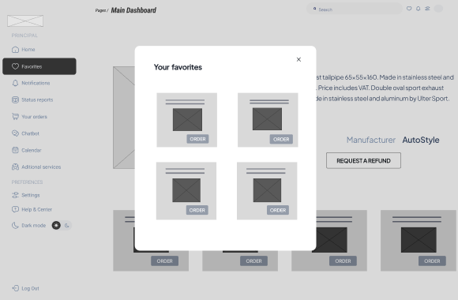
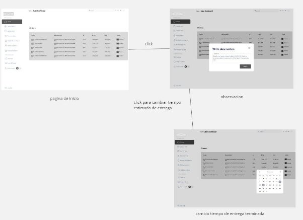
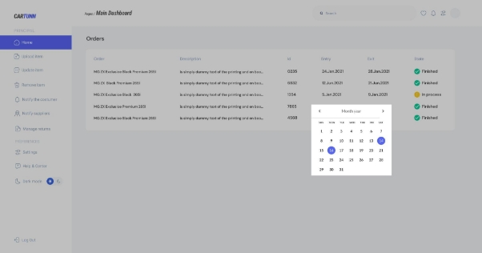
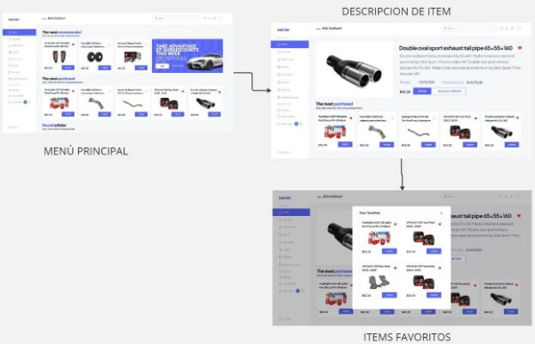
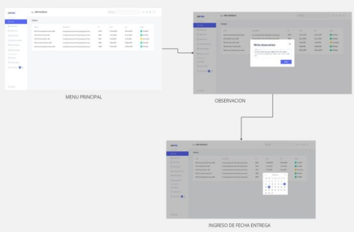
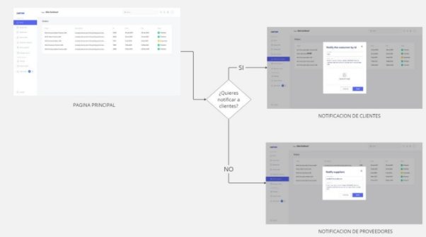
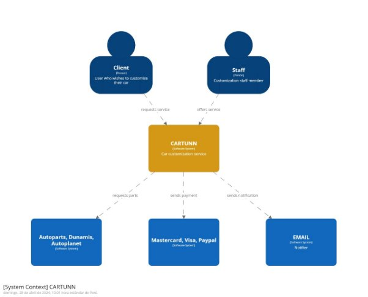
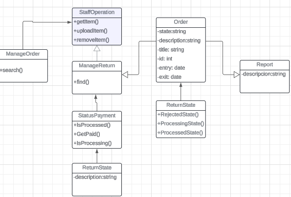
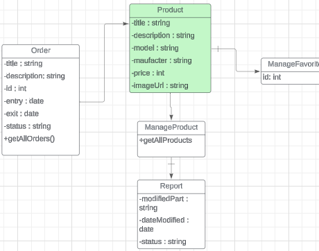
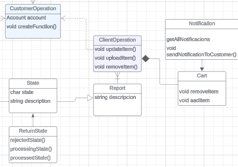

# COURSE PROJECT

    <strong>Universidad Peruana de Ciencias Aplicadas</strong> 
    </img> 
    <strong>Ingeniería de Software</strong> 
    <strong>Desarrollo de Aplicaciones Open Source - SW51</strong> 
    <strong>Profesor: Angel Augusto Velasquez Nuñez</strong> 
     INFORME

    <strong>Startup: The coders </strong> 
    <strong>Producto: CarTunn </strong>

    <h3 align="center">Team Members:</h3>
    

     <table align="center">
        <tr>
            <th style="text-align:center;">Member</th>
            <th style="text-align:center;">Code</th>
        </tr>
        <tr>
            <td>Ayquipa Ubaldo, Abraham Israel</td>
            <td>U202218475</td>
        </tr>
        <tr>
            <td>Chambi Mendoza, Mariana Alexandra</td>
            <td> U202217389</td>
        </tr>
        <tr>
            <td>Soto Salis, Natanael David</td>
            <td>U20201C607</td>
        </tr>
        <tr>
            <td>Ramos Argüelles, Alexandra Belen</td>
            <td>U202215164</td>
        </tr>
         <tr>
            <td>Mallma Espiritu, Franky Oswald</td>
            <td>U20211C250</td>
        </tr>
    </table>

    <strong>Marzo 2024</strong>

 

**Registro de Versiones del Informe**

<table><tr><th valign="top"><b>Versión</b></th><th valign="top"><b>Fecha</b></th><th valign="top"><b>Autor</b></th><th valign="top"><b>Descripción</b></th></tr>
<tr><td rowspan="5" valign="top">#01 - TB1</td><td valign="top">12/04/24</td><td valign="top">
Ayquipa Ubaldo, Abraham Israel

</td><td valign="top">
- Competidores

- Análisis competitivo

- Estrategias frente a competidores

- Product backlog

- Style guidelines

- Web style guidelines

- Information architecture

- Landing page ui design

- Landing page mockup

- Web applications mockup

- Database diagram

- Software deployment configuration

- Development Evidence for Sprint Review

- Execution Evidence for Sprint Review

- Services Documentation Evidence for Sprint Review

- Software Deployment Evidence for Sprint Review
</td></tr>
<tr><td valign="top">12/04/24</td><td valign="top">
Chambi Mendoza,

Mariana Alexandra
</td><td valign="top">
- Startup Profile 

- Descripción de la startup

- Antecedentes y problemática

- Lean UX Problem Statements

- Lean UX Assumptions

- Segmentos objetivo

- Organization Systems. 

- Labeling Systems. 

- SEO Tags and Meta Tags. 

- Searching Systems.

- Navigation Systems 

- Landing Page Wireframe. 

- Web Applications Wireframes.

- Class Diagrams

- Class Dictionary
</td></tr>
<tr><td valign="top">12/04/24</td><td valign="top">
Soto Salis, 

Natanael David
</td><td valign="top">
- Registro de entrevistas

- Software deployment configuration

- Development Evidence for Sprint Review

- Execution Evidence for Sprint Review

- Services Documentation Evidence for Sprint Review

- Software Deployment Evidence for Sprint Review
</td></tr>
<tr><td valign="top">12/04/24</td><td valign="top">Ramos Argüelles, Alexandra Belen</td><td valign="top">
- Lean UX Hypothesis Statements

- Lean UX Canvas

- Diseño de entrevistas

- User Personas

- Empathy Mapping

- Impact Mapping

- Domain-Driven Software Architecture

- Software Development Environment Configuration

- Source Code Management

- Source Code Style Guide & Conventions
</td></tr>
<tr><td valign="top">12/04/24</td><td valign="top">Mallma Espiritu, Franky Oswald</td><td valign="top">
- User Task matrix

- Journey map

- as-is scenario map

- to-be scenario map

- parte de user stories

- parte de diseño de entrevistas

- Software Architecture Context Diagram.

- Software Architecture Container Diagrams

- Software Architecture Components Diagrams.
</td></tr>
<tr><td rowspan="5" valign="top">#02 - TP1</td><td valign="top">02/05/24</td><td valign="top">
Ayquipa Ubaldo, Abraham Israel

</td><td valign="top">
- Mejora continua de user stories

- Mejora continua del product backlog

- Mejora continua de Software deployment configuration

- Mejora continua de Development Evidence for Sprint Review

- Mejora continua de Execution Evidence for Sprint Review

- Mejora continua Services Documentation Evidence for Sprint Review

- Mejora continua Software Deployment Evidence for Sprint Review
</td></tr>
<tr><td valign="top">02/05/24</td><td valign="top">
Chambi Mendoza,

Mariana Alexandra
</td><td valign="top">

- Mejora continua del Problem Statement

- -Mejora continua del Diagrama de Clases por bounded context

- Mejora continua de user stories

- Mejora continua de Class Dictionary
</td></tr>
<tr><td valign="top">02/05/24</td><td valign="top">
Soto Salis, 

Natanael David
</td><td valign="top">
- Mejora continua de user stories

- Mejora continua del análisis de entrevistas

- Mejora del Software deployment configuration

- Mejora del Development Evidence for Sprint Review

- Mejora del Execution Evidence for Sprint Review

- Mejora del Services Documentation Evidence for Sprint Review

- Mejora del Software Deployment Evidence for Sprint Review
</td></tr>
<tr><td valign="top">02/05/24</td><td valign="top">Ramos Argüelles, Alexandra Belen</td><td valign="top">
- Mejora continua de Lean UX Hypotheses Statement

- Mejora continua de user stories

- Mejora continua de empathy map

- Mejora continua Software Architecture Context Diagram.

- Mejora continua Software Architecture Container Diagrams

- Mejora continua Software Architecture Components Diagrams.

- Mejora continua de Software Configuration Management
</td></tr>
<tr><td valign="top">02/05/24</td><td valign="top">Mallma Espiritu, Franky Oswald</td><td valign="top">
- Mejora continua de user stories

- Mejora continua user task matrix

- Mejora continua as-is

- Mejora continua to-be

- Mejora continua Software Architecture Context Diagram.

- Mejora continua Software Architecture Container Diagrams

- Mejora continua Software Architecture Components Diagrams.

&emsp;
</td></tr>
<tr><td rowspan="5" valign="top">#03 - TB2</td><td valign="top">06/06/2024</td><td valign="top">Ayquipa Ubaldo, Abraham Israel</td><td valign="top">
- Sprint Planning 3

- Development Evidence for Sprint Review

- Testing Suite Evidence for Sprint Review

- Execution Evidence for Sprint Review

- Services Documentation Evidence  for Sprint Review

- Software Deployment Evidence for Sprint Review

- Team Collaboration Insights during Sprint
</td></tr>
<tr><td valign="top">06/06/2024</td><td valign="top">
Chambi Mendoza,

Mariana Alexandra
</td><td valign="top">
- Sprint 3

- Development Evidence for Sprint Review

- Validation Interviews

&emsp;
</td></tr>
<tr><td valign="top">06/06/2024</td><td valign="top">Soto Salis, Natanael David</td><td valign="top">
- Sprint 3

- Validation Interviews

- Development Evidence for Sprint Review
</td></tr>
<tr><td valign="top">06/06/2024</td><td valign="top">Mallma Espiritu,Franky Oswald</td><td valign="top">
-Sprint 3

-Diseño de entrevistas

-Heurísticas
</td></tr>
<tr><td valign="top">06/06/2024</td><td valign="top">Ramos Argüelles, Alexandra Belen</td><td valign="top">
- Sprint 3 

- Validation Interviews

- Video About-the-product
</td></tr>
<tr><td rowspan="5" valign="top">#4 - TF1</td><td valign="top"></td><td valign="top">Ayquipa Ubaldo, Abraham Israel</td><td valign="top">
- Sprint planning 4, Deployment  

- Evidence for Sprint Review  

- Testing Suite Evidence for Sprint 

- Review, Software Deployment 

- Evidence for Sprint Review, Team

- Collaboration Insights during Sprint
</td></tr>
<tr><td valign="top"></td><td valign="top">
Chambi Mendoza,

Mariana Alexandra
</td><td valign="top">
- Mejoras en Database Diagram

- Mejoras en User Stories

- Sprint Backlog 4

- Services Documentation Evidence for Sprint Review.

- Team Collaboration Insights during Sprint.

- Video About the Team

&emsp;

&emsp;

&emsp;

&emsp;
</td></tr>
<tr><td valign="top"></td><td valign="top">Soto Salis, Natanael David</td><td valign="top">
- Mejoras en User Stories

- Sprint Backlog 4

- Services Documentation Evidence for Sprint Review.

- Team Collaboration Insights during Sprint.
</td></tr>
<tr><td valign="top"></td><td valign="top">Mallma Espiritu,Franky Oswald</td><td valign="top">
-Mejoras en DDD architecture

-Sprint Backlog 4 

-Testing Suite Evidence for sprint review

-Video about the team

-Mejora continua en US

</td></tr>
<tr><td valign="top"></td><td valign="top">Ramos Argüelles, Alexandra Belen</td><td valign="top">
- Mejoras en User Stories 

- Sprint Backlog 4

- Team Collaboration Insights during Sprint

- Mejora continua Software Architecture Context Diagram.

- Mejora continua Software, Architecture Container Diagrams y Software Architecture Components 
</td></tr>
</table>

**Project Report Collaboration Insights**

**TB1:** La entrega TB1 finalizó con éxito y están documentadas en el siguiente repositorio de Github perteneciente a la organización del equipo: <https://github.com/upc-pre-202401-si729-sw51-the-coders/cartunn-report> 

Durante el desarrollo del informe se tuvieron en cuenta los siguientes aspectos: 

- Se redactaron y estructuraron los contenidos asignados a cada miembro utilizando el formato Markdown. Luego, se realizaron commits para garantizar el avance en el repositorio.
- Se crearon los artefactos necesarios utilizando las herramientas recomendadas.
- Se organizaron reuniones para coordinar el progreso de los elementos del informe y para comunicar los avances del Sprint 1, que se enfoca en la Landing Page.

![ref1]

**TP1:** Se han cumplido las tareas designadas para la entrega del TP1, las cuales han sido debidamente documentadas en el repositorio de GitHub de la organización del equipo**: <https://github.com/upc-pre-202401-si729-sw51-the-coders/cartunn-report>**  

Durante el desarrollo del informe se tuvieron en cuenta los siguientes aspectos: 

Se redactaron y estructuraron los contenidos asignados a cada miembro utilizando el formato Markdown. Luego, se realizaron commits para garantizar el avance en el repositorio.

Se crearon los artefactos necesarios utilizando las herramientas recomendadas.

Se organizaron reuniones para coordinar el progreso de los elementos del informe y para comunicar los avances del Sprint 2, que se enfoca en el desarrollo del Web App.

![ref1]

![ref2]

**TB2:** Se han cumplido las tareas designadas para la entrega del TB1 y TP1, las cuales han sido debidamente documentadas en el repositorio de GitHub de la organización del equipo: 

<https://github.com/upc-pre-202401-si729-sw51-the-coders/cartunn-report>  

Se redactaron y diagramaron los contenidos asignados a cada integrante en formato Markdown, seguido de commits para asegurar el seguimiento del progreso en el repositorio.

Se generaron los artefactos necesarios utilizando las herramientas recomendadas.

Se llevaron a cabo reuniones para coordinar el avance de los elementos del informe y comunicar los progresos del Sprint 3, centrado en el desarrollo del Web Services (API).

![ref2]

**TF1:** Se han cumplido las tareas designadas para las entregas del TB1,TP1 y TB2, las cuales han sido debidamente documentadas en el repositorio de GitHub de la organización del equipo: 

<https://github.com/upc-pre-202401-si729-sw51-the-coders/cartunn-report>   

Se redactaron y diagramaron los contenidos asignados a cada integrante en formato Markdown, seguido de commits para asegurar el seguimiento del progreso en el repositorio.

Se generaron los artefactos necesarios utilizando las herramientas recomendadas.

Se llevaron a cabo reuniones para coordinar el avance de los elementos del informe y comunicar los progresos del Sprint 4. Finalmente, se completó el desarrollo del Web Services (API) y, como último proceso en grupo, se integraron el Web APP (frontend) y el Web Services (backend).

![ref2]
# **Índice**	

1. ` `Capítulo I: Introducción
   1. Startup Profile 
      1. Descripción de la Startup 
      1. Perfiles de integrantes del equipo
   1. Solution Profile
      1. Antecedentes y problemática
      1. Lean UX Process
         1. Lean UX Problem Statements
         1. Lean UX Assumptions
         1. Lean UX Hypothesis Statements
         1. Lean UX Canvas
   1. Segmentos objetivo
1. Capítulo II: Requirements Elicitation & Analysis
   1. Competidores
      1. Análisis competitivo
      1. Estrategias y tácticas frente a competidores 
   1. Entrevistas
      1. ` `Diseño de entrevistas
      1. Registro de entrevistas
      1. ` `Análisis de entrevistas
   1. Needfinding
      1. User Personas
      1. User Task Matrix
      1. User Journey Mapping
      1. Empathy Mapping
      1. As-is Scenario Mapping
1. Capítulo III: Requirements Specification 
   1. To-Be Scenario Mapping. 
   1. User Stories. 
   1. Impact Mapping. 
   1. Product Backlog.
1. Capítulo IV: Product UX/UI Design 
   1. Style Guidelines. 
      1. General Style Guidelines. 
      1. Web Style Guidelines.
      1. Mobile Style Guidelines. 
         1. iOS Mobile Style Guidelines. 
         1. Android Mobile Style Guidelines. 
   1. Information Architecture.
      1. Organization Systems. 
      1. Labeling Systems. 
      1. SEO Tags and Meta Tags. 
      1. Searching Systems.
      1. Navigation Systems 
   1. Landing Page UI Design. 
      1. Landing Page Wireframe. 
      1. Landing Page Mock-up. 
   1. Web Applications UX/UI Design.
      1. Web Applications Wireframes.
      1. Web Applications Wireflow Diagrams. 
      1. Web Applications Mock-ups.
      1. Web Applications User Flow Diagrams.
   1. Web Applications Prototyping.
   1. Domain-Driven Software Architecture.
      1. Software Architecture Context Diagram.
      1. Software Architecture Container Diagrams
      1. Software Architecture Components Diagrams.
   1. Software Object-Oriented Design.
      1. Class Diagrams
      1. Class Dictionary
   1. Database Design.
      1. Database Diagram
1. Capítulo V: Product Implementation, Validation & Deployment
   1. Software Configuration Management. 
      1. Software Development Environment Configuration.
      1. Source Code Management.
      1. Source Code Style Guide & Conventions.
      1. Software Deployment Configuration. 
   1. Landing Page, Services & Applications Implementation.
      1. Sprint 1
         1. Sprint Planning 1.
         1. Sprint Backlog 1.
         1. Development Evidence for Sprint Review.
         1. Testing Suite Evidence for Sprint Review.
         1. Execution Evidence for Sprint Review.
         1. Services Documentation Evidence for Sprint Review.
         1. Software Deployment Evidence for Sprint Review.
         1. Team Collaboration Insights during Sprint.
      1. Sprint 2
         1. Sprint Planning 2.
         1. Sprint Backlog 2.
         1. Development Evidence for Sprint Review.
         1. Testing Suite Evidence for Sprint Review.
         1. Execution Evidence for Sprint Review.
         1. Services Documentation Evidence for Sprint Review.
         1. Software Deployment Evidence for Sprint Review.
         1. Team Collaboration Insights during Sprint.
      1. Sprint 3
         1. Sprint Planning 3.
         1. Sprint Backlog 3.
         1. Development Evidence for Sprint Review.
         1. Testing Suite Evidence for Sprint Review.
         1. Execution Evidence for Sprint Review.
         1. Services Documentation Evidence for Sprint Review.
         1. Software Deployment Evidence for Sprint Review.
         1. Team Collaboration Insights during Sprint.
      1. Sprint 4
         1. Sprint Planning 4.
         1. Sprint Backlog 4.
         1. Development Evidence for Sprint Review.
         1. Testing Suite Evidence for Sprint Review.
         1. Execution Evidence for Sprint Review.
         1. Services Documentation Evidence for Sprint Review.
         1. Software Deployment Evidence for Sprint Review.
         1. Team Collaboration Insights during Sprint.
   1. Validation Interviews.
      1. Diseño de Entrevistas.
      1. Registro de Entrevistas
      1. Evaluaciones según heurísticas.
   1. Video About the Product
   1. Video About the Team
1. Conclusiones, Bibliografía, anexos

**Student Outcome**

|Criterio Específico|Acciones realizadas|Conclusiones|
| :- | :- | :- |
|Comunica oralmente sus ideas y/o resultados con objetividad a público de diferentes especialidades y niveles jerárquicos, en el marco del desarrollo de un proyecto en ingeniería.|
**Ayquipa Ubaldo Abraham**

**TB1**

A lo largo de la realización de este proyecto, fue mi prioridad transmitir mis pensamientos y los hallazgos de forma directa y sin ambigüedades. Procuré ser claro y preciso al informar sobre el progreso, los obstáculos que surgieron y las estrategias sugeridas. Este intercambio de información constructivo aseguró que todos los participantes estuvieran al tanto, lo que contribuyó a una cooperación efectiva y al avance ágil del proyecto

**TP**

En la fase de creación del interfaz de usuario de nuestro producto de software, puse especial énfasis en la comunicación transparente y precisa del desarrollo y los retos encontrados a un público diverso en experiencia y rango. A través de informes periódicos, revelé los avances en la arquitectura y ejecución, subrayando los puntos clave y sus consecuencias técnicas. Este flujo de información clara fomentó un entendimiento común sobre la situación actual del proyecto y estimuló un trabajo conjunto productivo entre los miembros del equipo.

**TB2**

A lo largo de la TB2 tuve como prioridad mejorar la comunicación con el resto de integrantes del equipo, ya que, por mucho, el desarrollo del backend fue mucho más complejo y era necesario estar constantemente comunicando acerca de mis avances y cambios en el repositorio y así garantizar el orden al hacer nuestros commits. Igualmente sucedió para la documentación de la API en el informe, más que todo para confirmar que no registré erróneamente los endpoints, ya que esa parte me tocó.

**TF**

Para la entrega de este TF al igual que en el sprint anterior tuvimos que trabajar bastante en la comunicación interna del equipo para poder coordinar a quien le tocaba que partes conectar entre el frontend y el backend. También sería lo mismo en el documento y llegar al objetivo de presentar un buen trabajo.

**Chambi Mendoza Mariana**

**TB1**

Durante el desarrollo del proyecto de ingeniería, me aseguré de comunicar de manera objetiva y clara tanto mis ideas como los resultados obtenidos a audiencias de diversas especialidades y niveles jerárquicos. Mantuve un enfoque transparente y conciso al compartir el progreso del proyecto, los desafíos enfrentados y las soluciones propuestas. Esta comunicación efectiva garantizó una comprensión común entre todos los involucrados, facilitando así la colaboración y el avance del proyecto de manera eficiente.

**TP**

Durante la ejecución del frontend de la aplicación, me esforcé por comunicar de manera objetiva y clara el progreso y los desafíos a audiencias de diversas especialidades y niveles jerárquicos. A través de actualizaciones periódicas, compartí los avances en el diseño y la implementación, resaltando las decisiones clave y las implicaciones técnicas. Esta comunicación transparente facilitó una comprensión común del estado del proyecto y promovió una colaboración efectiva entre todos los interesados.

**TB2**

Mi contribución durante la TB2 fue fundamental en la comunicación y desarrollo del proyecto. Actué como un enlace clave entre los diferentes miembros del equipo, asegurando que todos los cambios y actualizaciones fueran comprendidos por todos, independientemente de su especialidad o nivel jerárquico. Realicé presentaciones regulares para explicar las modificaciones y mejoras implementadas en el backend de la aplicación, incluyendo la creación y optimización de los métodos CRUD. Mi enfoque en una comunicación clara y objetiva facilitó la integración de estos cambios en el proyecto, mejorando la colaboración y eficiencia del equipo.

**TF**

En la última fase del proyecto, desempeñé un papel clave en la finalización del informe y la culminación del Sprint 4. En el ámbito del backend, me encargué de desarrollar algunos endpoints necesarios para completar nuestra aplicación web, asegurando así un producto final de alta calidad. Mi labor incluyó la implementación y prueba de estos endpoints, garantizando que cumplieran con los requisitos funcionales y de seguridad establecidos. Esta contribución fue esencial para entregar un trabajo bien realizado y funcional dentro del plazo estipulado.

**Soto Salis Natanael David**

**TB1**

Para esta entrega, tuve la responsabilidad de entrevistar a los usuarios del segundo segmento. De acuerdo a esta entrevista, recopile datos que son importantes para el diseño de la aplicación, identificar las funcionalidades que necesita el usuario. También realicé los sprints backlog. Con esto, se evidencia la colaboración del equipo en el desarrollo de landing page y todo lo que conlleva su interfaz que también fue diseñada con el fin de informar y atraer a los usuarios a usar nuestra aplicación. Luego de esto que desarrolle tuve que exponerlo en video para que el publico puedo entender y ver como he desarrollado; planeado y aportado al desarrollo de esta solucion tecnologica.

**TP**

Para esta enttega, me ocupe de mejorar las secciones de entrevistas , Sprint backlog 2 y documentacion del proyecto a la par que el desarrollo de las secciones que se me asignaron a desarrollar en el front. Todas estas mejoras las explicare oralmente en video con el fin de que la audiencia pueda comprender y apreciar como implementamos las correcciones y mejores que ha sufrido el informe con tal desarrollar una buena aplicacion.

**TB2**

Para la TB2, me comunique con el equipo acerca de cómo íbamos a realizar los bounded para el backend de la aplicación y tambien las dudas que tenia en el momento del desarrollo del bounded. Tambien coordinamos los flujos en el repositorio para que todo este bien ordenado. Tambien me propuse y comunique a intentar deployar el backend lo cual se logro.

**TF**

Para este ultimo entregable, me encargue de la parte de authentication para que los usuarios puedan crear un cuenta y asi acceder a nuestra aplicacion ademas esta entrega al ser la ultima he tratado de poder apoyar al equipo lo mas  que pude y asi lograr un buen entregable. La comunicaion en el equipo fue fluida y asi pudimos lograr realizar este trabajo.

**Ramos Argüelles Alexandra**

**TB1**

Durante el primer entregable del proyecto de desarrollo, me dediqué a comunicar de manera objetiva nuestras ideas y resultados a diversos públicos especializados. Informé de manera clara y precisa el progreso del proyecto, los obstáculos y las medidas de solución. Presenté nuestros hallazgos y avances de forma clara y precisa, garantizando una comunicación efectiva en todas las etapas del proyecto.

**TP**

A lo largo de la creación de la interfaz del usuario de nuestro producto de software, me enfoqué en compartir de manera clara y detallada el progreso y resultados obtenidos durante el desarrollo del proyecto. Mediante las actualizaciones regulares, di a conocer los avances en el diseño y la implementación de los componentes, destacando los puntos clave e implicaciones técnicas. Esta comunicación inequívoca fue útil para la comprensión común sobre la  situación actual del proyecto e impulsó el trabajo en equipo de manera equitativa. 

**TB2**

Durante el desarrollo de la TB2, como papel importante, pude comunicarme de manera clara y concisa con todos los participantes de mi equipo de trabajo. Con respecto al backend, he comunicado mis avances constantemente. Además, al momento de subir mis avances al repositorio di aviso a todos los integrantes de mi equipo para que actualicen y no haya ningún problema al momento de subir los cambios que faltaban. Por último, realicé el video de About-the-Product, en el cual pude transmitir y comunicar todas las funcionalidades y beneficios de nuestro producto para el público.

**TF**

A lo largo del desarrollo del TF, hubo mayor comunicación dentro del equipo, trabajamos de manera activa buscando un resultado óptimo. Para este entregable, nos encargamos de realizar las correcciones respectivas dentro del informe, me encargué de apoyar en el sprint 4. En lo que el backend respecta, desarrollé más a fondo el bounded context de payment, añadiendo un aggregate cart y conectado con las tablas correspondientes para cada caso. 

**Mallma Espiritu Franky**

**TB1**

Durante el primer entregable y el desarrollo del proyecto, logre comunicarme de forma objetiva compartiendo mis ideas de solución con mis compañeros de trabajo y recibiendo comentarios constructivos de parte del equipo con el fin de encaminar con éxito el producto 

**TP**

Durante la fase de creación de del frontend del proyecto, procuré comunicarme de forma clara y detallada con los miembros del proyecto e intercambiar ideas de mejora en los diferentes aspectos del producto. Ayude a identificar los componentes  que se usarán en el proyecto. Contribui en las reuniones de conversación sobre algunos desaciertos y actividades , promoviendo a llevar el proyecto en un buen rumbo.

**TB2**

A lo largo de la TB2 tuve como prioridad la comunicación con el resto de integrantes del equipo, el desarrollo del backend demandaba más esfuerzo en equipo y era necesario estar  comunicando acerca de la solución de algunos bugs y cambios en el proyecto y así garantizar el correcto rumbo. Igualmente, sucedió para la documentación del informe.

**TF**

Para el desarrollo del TF, contribui en la finalización y mejora continua  del informe y Sprint 4. En la parte de backend, me encargué de realizar endpoints para completar nuestra aplicación web Mi contribución incluyó la implementación y testing de endpoints, logrando que cumplieran con los requisitos necesarios. Esta adición fue clave para entregar un trabajo integral  y funcional.

|
La comunicación transparente y precisa promovida durante el desarrollo de los proyectos fue fundamental para el éxito, contribuyendo a una colaboración efectiva y al logro de los objetivos establecidos.

Las entrevistas son elementos fundamentales para el éxito en el desarrollo de proyectos de ingeniería. Al centrarse en comprender las necesidades del usuario, comunicar de manera clara y transparente, y fomentar la colaboración entre equipos, se crea un ambiente propicio para el avance eficiente y la entrega de productos que satisfagan las expectativas del cliente.

Las presentaciones regulares y los informes orales permitieron una comprensión común del estado del proyecto, facilitando la toma de decisiones y la resolución de problemas de manera oportuna. Esta dinámica de comunicación fomentó un ambiente de trabajo colaborativo, donde cada integrante del equipo contribuyó con sus conocimientos y habilidades, asegurando que el proyecto avanzara de manera eficiente y cumpliendo con los objetivos establecidos.

En resumen, la capacidad de comunicar oralmente de manera objetiva y profesional ha sido esencial para coordinar esfuerzos, resolver desafíos y lograr una ejecución exitosa del proyecto, beneficiando a todos los involucrados, desde los desarrolladores hasta los stakeholders.

|
|Comunica en forma escrita ideas y/o resultados con objetividad a público de diferentes especialidades y niveles jerárquicos, en el marco del desarrollo de un proyecto en ingeniería.|
**Ayquipa Ubaldo Abraham**

**TB1**

En las etapas iniciales del proyecto, llevé a cabo un análisis competitivo exhaustivo para identificar las fortalezas y debilidades de nuestros competidores, lo que permitió desarrollar estrategias efectivas para diferenciarnos en el mercado. Contribuir significativamente al product backlog, asegurando que todas las funcionalidades y requisitos estuvieran bien documentados y priorizados. Además, establecí los style guidelines y web style guidelines, proporcionando un marco coherente para el diseño visual y la experiencia del usuario en nuestra aplicación. Mi trabajo en la arquitectura de información garantizó una navegación intuitiva y accesible, mientras que el diseño de la landing page y los mockups de la aplicación web facilitaron la visualización del producto final. Estas contribuciones fueron comunicadas de manera objetiva y clara a colegas de diversas especialidades y niveles jerárquicos, promoviendo una comprensión uniforme y una colaboración efectiva.

**TP**

Durante la fase de desarrollo, me centré en la programación de algunos screens de los mockups detallados para la aplicación, lo que proporcionó una representación visual clara del producto. La definición de los style guidelines y la implementación de la arquitectura de información en la landing page y las aplicaciones web aseguraron una experiencia de usuario coherente y atractiva. Mi enfoque en la comunicación objetiva y la presentación de resultados a lo largo del proyecto permitió que los miembros del equipo de diferentes especialidades y niveles jerárquicos comprendieran y apoyaran la dirección y los objetivos del proyecto.

**TB2**

Para la TB2 me encargué en el informe de redactar y documentar el punto 5.1 y 5.2(desde el registro del Sprint Planning hasta la documentación de los services en Swagger) a excepción del punto 5.2.3.2 que era acerca del registro del Sprint Backlog 3. Para la fase de desarrollo me encargué de crear la estructura base de todo el backend sobre el que se iba a estar construyendo todos los endpoints de la API.

**TF**

Para este último sprint me encargué de conectar el frontend y el backend de los bounded dashboard-and analytics, notifications, y orders a su vez de monitorear el correcto funcionamiento de los anteriores haciendo test directos en la api. En el documento me encargué de rellenar algunos puntos del capítulo 5 como el de software deployment por ejemplo.

**Chambi Mendoza Mariana**

**TB1**

En la fase inicial del proyecto, utilicé el Lean UX Canvas y realicé entrevistas con usuarios y stakeholders clave para obtener insights importantes. Estos datos impulsaron ajustes estratégicos para garantizar la alineación y adaptabilidad del proyecto. También contribuí al diseño del Information Architecture, abordando sistemas de organización, etiquetado, SEO, búsqueda y navegación. Además, desempeñé un papel esencial en la creación del Ubiquitous Language y en la estructura de la base de datos. Estas acciones sentaron las bases para una ejecución cohesiva y centrada en el usuario del proyecto, facilitando la comunicación efectiva con audiencias de diversas especialidades y niveles jerárquicos.

**TP**

En esta fase del proyecto, me enfoqué en dos aspectos clave: el sprint planning y el desarrollo parcial del frontend del sitio web. Durante el sprint planning, colaboré en la definición de objetivos y asignación de tareas. Respecto al frontend, realicé algunas partes del desarrollo, asegurándome de mantener una comunicación objetiva con todas las partes interesadas, independientemente de su especialidad o nivel jerárquico.

**TB2**

Durante la TB2, fui responsable del sprint 3, que incluyó varias tareas esenciales para el avance del proyecto. Adicionalmente, realicé una entrevista como parte de las validation interviews, asegurando que las opiniones y requerimientos de los usuarios fueran incorporados en el desarrollo del proyecto. En el desarrollo del backend, diseñé e implementé dos bounded contexts utilizando los principios de Domain-Driven Design. Mi enfoque se centró en documentar cada paso del proceso de manera clara y objetiva, garantizando que todos los miembros del equipo, sin importar su especialidad o nivel jerárquico, comprendieran y aplicaran los cambios propuestos. Esta documentación detallada abarcó los objetivos del sprint, los resultados de las entrevistas y los principios de diseño aplicados, facilitando así una comunicación efectiva y una integración eficiente de las mejoras en el proyecto.

**TF**

En la última entrega del proyecto, abordé varios aspectos clave del Sprint 4. Mi labor incluyó la mejora del diagrama de la base de datos y la optimización de las historias de usuario, así como la elaboración del Sprint Backlog 4. Además, documenté los servicios desarrollados y preparé la evidencia necesaria para la revisión del sprint. También aporté valiosas perspectivas sobre la colaboración del equipo durante el sprint y contribuí a la creación de un video que destaca el trabajo del equipo. Estas tareas fueron realizadas con el objetivo de comunicar de manera objetiva y profesional los avances y resultados a audiencias de diversas especialidades y niveles jerárquicos.

**Soto Salis Natanael David**

**TB1**

Para esta entrega, tuve la responsabilidad de entrevistar a los usuarios del segundo segmento. De acuerdo a esta entrevista, recopile datos que son importantes para el diseño de la aplicación, identificar las funcionalidades que necesita el usuario. También realicé los sprints backlog. Con esto, se evidencia la colaboración del equipo en el desarrollo de landing page y todo lo que conlleva su interfaz que también fue diseñada con el fin de informar y atraer a los usuarios a usar nuestra aplicación. 

**TP**

Para esta enttega, me ocupe de mejorar las secciones de entrevistas , Sprint backlog 2 y documentacion del proyecto a la par que el desarrollo de las secciones que se me asignaron a desarrollar en el front. Todo esto lo documente con tal de que los que lean este informe comprendan el alcance del proyecto ademas de que entiendan el proceso de la implementacion de la aplicacion web.

**TB2**

Para la TB2, contribuí en realizar las entrevistas de validación. Para la fase de desarrolló me encargué de mi el bounded que se me asignó e integrarlo en el backend sobre el que se iba a estar construyendo todos los endpoints de la API. Y por último, me encargué de deployar la API en Railway.

**TF** Para esta entrega me encargue del bounded de autenticación para que los usuarios de la aplicación puedan crear una cuenta y asi poder ingresar a nuestra aplicación, Desarrolle este bounded tanto en fronted y en backend. Ademas, me encargue del deploy de nuestro fronted, backend y base de datos,

**Ramos Argüelles Alexandra**

**TB1**

Como parte integral del proceso de desarrollo, he abordado temas específicos en diversas etapas de la TB1. En la sección de Lean UX Process aporté elaborando los Hypothesis Staments y el desarrollo del Lean UX Canvas. En la sección de  diseño de las entrevistas elaboré las preguntas y el vídeo de entrevista de uno de los segmentos objetivo para poder recolectar información. A partir de esta recolección de datos y todos los análisis correspondientes pude realizar la creación de los user personas y empathy maps. Con estos insights, desarrollé parte de las historias de usuario y los impact maps. Por último, realicé el modelo C4 enfocado en nuestro proyecto y completé la sección de software configuration management.

**TP**

En esta fase del proyecto, me enfoqué en realizar en la sección de Sprint Backlog 2, el desarrollo parcial del frontend del sitio web y realicé las correcciones respectivas a lo que había desarrollado en la entrega de la TB1. Durante el spring backlog ordené las historias de usuario según la prioridad que se le había dado en el product backlog y realicé la estimación de horas para el desarrollo de cada una de ellas.

**TB2**

Durante el desarrollo de la TB2, me encargué del Sprint 3, el cual incluye diversas tareas que influyeron en el avance del proyecto. Además, realice una entreviste por cada segmento objetivo para las validation interviews. En lo que el backend respecta, diseñé e implementé un bounded context en el cual apliqué los principios de Domain-Driven Design.

**TF**

En este último entregable, pude contribuir en diversos aspectos que involucraban el Sprint 4, actualizando el informe. Dentro de las mejoras que realicé se encuentran, mejorar los diagramas de modelo C4 (diagrama de contexto, diagrama de componentes y diagrama de contenedores), corregí y añadí historias de usuario para este sprint. Todo esto fue realizado para presentar y desarrollar un mejor producto.

**Mallma Espiritu Franky**

**TB1**

En el transcurso de nuestro proyecto, mi aporte al equipo fue de soporte y ayuda en documentación de los compañeros de trabajo. Mi involucración en el proyecto fue agilizar el tiempo de termino de la Tb1. Al realizar los journey mapping facilito el desarrollo de los siguientes puntos del informe. También hice los As-is y To-be para ayudar a identificar las necesidades y soluciones de cada segmento. Igualmente, diseñe los diagram flow de los mockup para proveer una visualización del paso a paso de como funciona la aplicación. Mi labor en el modelo C4 propició una infraestructura eficaz y colaborativa para nuestro proyecto. Globalmente, mi contribución fue clave para integrar nuestros esfuerzos y apoyar al proyecto de forma satisfactoria.

**TP**

Durante la fase de desarrollo del proyecto , me centré en la corrección de varios índices del proyecto, así como la programación de algunos screens de los mockups propuestos. La definición de la descripción de los componentes del frontend de la aplicación conllevo a cierta agilidad al proyecto. Mi aporte en la comunicación objetiva y la presentación de soluciones emergentes causó una mejor comprensión del proyecto.

**TB2**

Para la TB2 contribuí en el informe de redactar y documentar  (el diseño de las entrevistas y las heurísticas) Para la fase de desarrolló me encargué de crear el bounded de perfiles e integrarlo en el backend sobre el que se iba a estar construyendo todos los endpoints de la API.

**TF**

En el desarrollo del TF, aporte en varios puntos primordiales del Sprint 4. Mi trabajo incluyó la mejora del diagrama de DDD architecture ,Mejora continua en US y Testing Suite, además la elaboración del Sprint Backlog 4. También aporté mis puntos a mejorar con el equipo y contribuir en mejoras continuas de todo el informe.Estas mejoras y adiciones fueron realizadas con el propósito de comunicar de manera objetiva los avances y resultados..

|
A lo largo del desarrollo de este proyecto en ingeniería, cada miembro del equipo ha demostrado una habilidad destacada para comunicar de forma escrita ideas y resultados con objetividad, asegurando que la información sea clara y comprensible para audiencias de diferentes especialidades y niveles jerárquicos. Desde las etapas iniciales hasta la fase final, se han llevado a cabo análisis competitivos, mejoras en diagramas de base de datos, optimización de historias de usuario, y elaboración de backlogs y documentaciones técnicas.

La implementación de style guidelines y la arquitectura de información han garantizado una experiencia de usuario coherente y accesible, mientras que la programación de pantallas y la conexión entre el frontend y el backend han facilitado la visualización y funcionalidad del producto final. Además, las entrevistas con usuarios y stakeholders han proporcionado insights valiosos que se han integrado en el desarrollo del proyecto, mejorando la alineación estratégica y la adaptabilidad.

La documentación detallada de cada sprint, desde la planificación hasta la revisión y validación de servicios, ha asegurado una comunicación efectiva y la comprensión uniforme de los objetivos y resultados del proyecto. La creación de materiales audiovisuales y la presentación de resultados han permitido que todos los miembros del equipo, independientemente de su especialidad o nivel jerárquico, comprendan y apoyen la dirección del proyecto.

En resumen, el equipo ha logrado mantener una comunicación escrita objetiva y profesional a lo largo de todo el proyecto, facilitando la colaboración efectiva y asegurando el éxito en cada fase del desarrollo.

|
1. ` `**CAPÍTULO I: INTRODUCCIÓN**
   1. **Startup Profile** 
      1. **Descripción de la Startup** 

TheCoders es una startup fundada por un grupo de estudiantes de la Facultad de Ingeniería de la Universidad Peruana de Ciencias Aplicadas (UPC), con el firme propósito de abordar las preocupaciones y desafíos que enfrentan los apasionados de los automóviles en el proceso de personalización de vehículos. A través de nuestra innovadora plataforma, CarTunn, buscamos ofrecer precios justos y transparentes, así como resolver la falta de accesibilidad, variedad, orientación y asequibilidad en la industria de la personalización automotriz. Con un equipo comprometido con la excelencia técnica y la pasión por la innovación, estamos dedicados a proporcionar a nuestros usuarios una experiencia de personalización de vehículos emocionante, satisfactoria y accesible.

- **Misión**: Nuestra misión es facilitar la personalización de vehículos, a través de una plataforma accesible y transparente que atienda sus necesidades individuales con precios equitativos y orientación especializada.

- **Visión**: Nos proponemos ser líderes globales en el ámbito de la personalización automotriz, reconocidos por nuestra integridad, excelencia y dedicación a la satisfacción del cliente, ofreciendo una experiencia incomparable y estimulante para cada usuario.

1. **Perfiles de integrantes del equipo**

***Ayquipa Ubaldo Abraham Israel - U202218475***

Soy estudiante de la carrera de ingeniería de software, actualmente cursando el 5to ciclo de carrera. Aunque soy fullstack developer, tengo más inclinación por el desarrollo frontend. Mi stack arranca con Next.js(Framework de React) + Typescript para el front y Node.js + Express.js + MongoDB para el back. Como todo buen programador, me considero un eterno estudiante, por lo que me encuentro en este momento estudiando Docker y Redis.

`  	`***Chambi Mendoza, Mariana Alexandra - U202217389***

Mi nombre es Mariana, tengo 19 años y estudio Ingeniería de Software. Me caracterizo por ser una persona empática, alegre, responsable y puntual, cualidades que reflejo en mi desempeño tanto académico como profesional. Poseo habilidades en programación en lenguajes como C++, Python, Html, CSS y Java, además de     conocimientos básicos en Angular. Busco demostrar el máximo de mis capacidades en todos los proyectos en los que participo.

***Soto Salis, Natanael David - U20201C607***

Soy estudiante de Ingeniería de Software. He colaborado con trabajos que usan frameworks como React y NextJS. He realizado trabajos con HTML y CSS y con estos conocimientos colaborare con el desarrollo de este trabajo además que ayudaré al equipo en lo que se requiera.

***Ramos Argüelles, Alexandra Alexandra - U202215164***

Estoy estudiando la carrera de Ingeniería de Software, me encuentro cursando el 5to ciclo de la carrera. Me considero una persona responsable, creativa, perseverante y me adapto muy bien a los trabajos grupales. Con respecto a mis conocimientos en programación puedo mencionar al lenguaje C++, C#, Python y HTML. Siempre doy lo mejor de mí y me gusta aprender constantemente, por lo que espero poder demostrarlo en este trabajo grupal.

***Mallma Espiritu, Franky Oswald - U20211c250***

Estudiante universitario cursando la carrera de Ingeniería de Software. Soy una persona puntual y responsable en los trabajos de equipo. Poseo conocimientos en html , css y sql básico. Como parte del equipo mis capacidades resaltan más en la búsqueda de soluciones emergentes que se pueda dar a lo largo del proyecto.

1. **Solution Profile**

Como equipo, hemos concebido y desarrollado la plataforma "CarTunn", con la finalidad de simplificar y enriquecer la experiencia de personalización vehicular. CarTunn se erige como una solución completa dirigida a los apasionados del automovilismo, abordando las inquietudes comunes presentes en el proceso de personalización automotriz. A través de una interfaz intuitiva y transparente, nuestra plataforma otorga acceso a una amplia gama de alternativas de personalización, acompañadas de asesoramiento especializado y una política de precios justos.

1. **Antecedentes y problemática**

**Problemática:** En el panorama actual, una dificultad significativa reside en la falta de transparencia y la proliferación de prácticas engañosas por parte de empresas y talleres dedicados a la venta de accesorios y servicios para la mejora de vehículos. Esta situación lleva a una desinformación generalizada entre los consumidores interesados en personalizar sus automóviles, quienes carecen de los conocimientos necesarios para discernir entre opciones genuinas y engañosas. La ausencia de orientación experta y la opacidad en los precios pueden resultar en decisiones erróneas por parte de los consumidores, quienes podrían incurrir en gastos excesivos o adquirir productos y servicios de calidad inferior. Esta problemática no solo afecta la satisfacción del cliente, sino que también socava la confianza en el mercado de personalización automotriz y puede generar una percepción negativa hacia la industria en su conjunto.

- **Las “5W Y 2H”**
  - **WHAT**

La problemática percibida por nuestra startup es la falta de transparencia y las prácticas engañosas en la industria de la personalización automotriz. Los consumidores carecen de información clara para distinguir entre opciones genuinas y fraudulentas al mejorar sus vehículos, lo que puede resultar en decisiones costosas y decepcionantes.

- **WHEN**

Este problema se da cuando se quiere personalizar un vehículo, ya sea añadiendo accesorios, modificando su aspecto o mejorando su rendimiento. Los consumidores, al enfrentarse a una amplia gama de opciones y distintos personales del staff mecánico, a menudo carecen de la información necesaria para tomar decisiones informadas y evitar prácticas engañosas.

- **WHERE**

El problema se manifiesta tanto en los establecimientos físicos como en empresas y sitios web dedicados a la venta y personalización de automóviles. En estos lugares, los clientes pueden encontrarse con presupuestos engañosos y costosos que dificultan la toma de decisiones informadas.

- **WHO**

El problema afecta a los consumidores interesados en la personalización de vehículos, quienes se enfrentan a una falta de claridad en los presupuestos presentados por los establecimientos, empresas y sitios web dedicados a esta industria. Este desafío no está necesariamente relacionado con las habilidades individuales de las personas, sino más bien con la opacidad y las prácticas comerciales deshonestas dentro del sector de la personalización automotriz.

- **WHY**

El problema surge a raíz de la opacidad en la elaboración de presupuestos por parte de los establecimientos, empresas y plataformas en línea especializadas en la personalización vehicular.

- **HOW**

El problema se presenta cuando las empresas o establecimientos ofrecen accesorios o servicios de personalización automotriz, sin proporcionar la asesoría adecuada o un proceso transparente. Esto da lugar a situaciones donde los clientes son manipulados por expertos que buscan maximizar sus ganancias sin tener en cuenta los intereses genuinos del cliente.

- **HOW MUCH**

Según informó *Peru21* en 2023, el crecimiento exponencial del comercio electrónico ha desencadenado un alarmante aumento en las estafas cibernéticas. A nivel nacional, se estima que el 4% de las personas afectadas por pagos fraudulentos han sufrido pérdidas superiores a los 5 mil soles. En Lima, el sector automotriz ha sido especialmente impactado por este tipo de fraude.

En los últimos meses, se ha observado un notable incremento en el número de empresas y particulares que han caído víctimas de estas estafas, principalmente debido a la proliferación de sitios web falsos y perfiles en redes sociales que simulan ser establecimientos legítimos. Estas plataformas ofrecen una amplia variedad de repuestos a precios tentadores. Sin embargo, una vez que los clientes efectúan los pagos correspondientes, los productos nunca son entregados y la comunicación con los estafadores se torna imposible, siendo bloqueados en numerosas ocasiones.

1. **Lean UX Process**
   1. **Lean UX Problem Statements**

**Problem Statement:**

Nuestro servicio de personalización automotriz fue diseñado para proporcionar una experiencia satisfactoria tanto para los clientes interesados en personalizar sus vehículos como para el staff mecánico especializado. Hemos observado que el servicio no está alcanzando plenamente los objetivos establecidos, lo cual está causando una falta de transparencia en los procesos y una dificultad para transmitir eficazmente las opciones disponibles. Esto repercute negativamente en la satisfacción del cliente y en las oportunidades de negocio. ¿Cómo podemos mejorar nuestro servicio de personalización automotriz para que los clientes alcancen niveles más altos de satisfacción y, al mismo tiempo, aumenten nuestras oportunidades de negocio, basándonos en una comunicación más clara y una experiencia de usuario mejorada?

**Aspectos:**
**Domain:** Personalización automotriz.

**Customer Segments:** Clientes que desean personalizar sus vehículos y staff mecánico especializado en personalización automotriz.

**Pain Points:** Los clientes enfrentan dificultades para navegar por las opciones de personalización, lo que resulta en decisiones poco informadas y falta de satisfacción. El staff mecánico lucha por comunicar eficazmente las opciones disponibles y gestionar las expectativas de los clientes, lo que puede llevar a una pérdida de oportunidades de negocio y satisfacción del cliente.

**Gap:** Existe una brecha en la experiencia de personalización automotriz entre las expectativas de los clientes y la capacidad del staff mecánico para satisfacerlas.

**Visión/Strategy:** Crear una plataforma accesible y fácil de usar que guíe a los clientes a través del proceso de personalización automotriz, al tiempo que mejora la comunicación y transparencia entre el staff mecánico y los clientes.

Initial Segment: Inicialmente nos centraremos en desarrollar herramientas y procesos que mejoren la transparencia y la comunicación entre el staff mecánico y los clientes, con el objetivo de aumentar la satisfacción del cliente y aprovechar al máximo las oportunidades de negocio en el sector de la personalización automotriz.

1. **Lean UX Assumptions**

Los supuestos, o "assumptions" en inglés, desempeñan un papel crucial en la identificación de los riesgos del proyecto y en estimular la expresión de opiniones y la participación activa del equipo de trabajo. 

User Assumptions:

**¿Quién es el usuario?**

El usuario es cualquier persona propietaria de un vehículo que esté interesada en personalizarlo de manera segura, confiable y conveniente.

**¿Dónde encaja nuestro producto en su trabajo o vida?**

Nuestro producto encaja en la vida cotidiana de los usuarios, ya que les proporciona una solución eficiente y accesible para la personalización de sus vehículos, ayudándoles a evitar estafas y a satisfacer sus necesidades de personalización de manera satisfactoria.

**¿Qué problemas tiene que resolver nuestro producto?**

Nuestro producto debe resolver los problemas de falta de transparencia, riesgo de estafas y dificultades en la personalización automotriz que enfrentan los usuarios al buscar opciones de personalización para sus vehículos.

**¿Cuándo y cómo es nuestro producto usado?**

El producto es utilizado por los usuarios cuando desean personalizar su vehículo. Esto puede ocurrir en cualquier momento en que los usuarios estén interesados en mejorar o modificar su automóvil, y nuestro producto les proporciona una plataforma segura y conveniente para hacerlo.

**¿Cómo debe verse nuestro producto y cómo comportarse?**

El producto debe tener una apariencia intuitiva y atractiva, con una interfaz fácil de usar que guíe a los usuarios a través del proceso de personalización automotriz. Debe comportarse de manera confiable y segura, asegurando que los usuarios puedan realizar transacciones sin preocupaciones y obtener los resultados deseados de manera satisfactoria.

Business Assumptions:

- Creo que mis usuarios necesitan una solución de software eficiente y accesible para la personalización de su auto, evitando que otras personas o empresas los estafen.
- Estas necesidades se pueden satisfacer mediante una aplicación móvil intuitiva y segura que guíe a los usuarios a través del proceso de personalización automotriz y les proporcione transparencia en las transacciones.
- Mis clientes iniciales son propietarios de vehículos que desean personalizar sus autos de manera confiable y sin riesgos.
- El valor #1 que un cliente busca en mi servicio es la capacidad de personalizar su vehículo de forma segura y confiable, evitando estafas y asegurándose de obtener los productos y servicios deseados.
- El cliente también puede obtener estos beneficios adicionales: una amplia selección de opciones de personalización, asesoramiento experto, precios transparentes y competitivos, y una experiencia de usuario fluida.
- Voy a adquirir la mayoría de mis clientes a través de campañas de marketing digital dirigidas a propietarios de vehículos interesados en la personalización automotriz, así como mediante asociaciones con concesionarios de automóviles y talleres especializados.
- Haré dinero a través de una combinación de modelos de negocio, que pueden incluir distintos planes de suscripción, ingresos por publicidad dentro de la aplicación y otros servicios premium. Además, estableceré acuerdos de asociación con staffs mecánicos para ofrecer servicios exclusivos y beneficios a los suscriptores.
- Mi competencia principal en el mercado son otras aplicaciones y plataformas en línea que ofrecen servicios similares de personalización automotriz, así como talleres físicos y tiendas especializadas.
- Los venceremos debido a nuestra atención en la seguridad y transparencia del proceso, nuestra amplia gama de opciones de personalización, y nuestra interfaz intuitiva y fácil de usar.
- Mi mayor riesgo es la falta de confianza por parte de los usuarios en la seguridad y la transparencia de la plataforma.
- Resolvemos esto a través de una estricta verificación de los staff mecánicos y la implementación de medidas de seguridad robustas, así como una comunicación clara y transparente con los usuarios sobre los procesos y las políticas de la plataforma.

  Business Outcomes:

  Aumento en la Retención de Clientes: Al ofrecer una plataforma accesible y económica para la personalización automotriz, se espera que los clientes estén más satisfechos y sean más propensos a volver a utilizar el servicio en el futuro.

  Mejora en la reputación y confianza: Al abordar las necesidades de los clientes y proporcionarles una experiencia satisfactoria, la reputación de la empresa en el mercado mejorará, lo que resultará en una mayor confianza por parte de los clientes potenciales.

  Aumento en los ingresos: Al ofrecer un servicio que satisface las necesidades de los clientes de manera efectiva, se espera que aumente el número de transacciones y, por lo tanto, los ingresos generados por la plataforma.

  Mayor visibilidad en el mercado: Al proporcionar una solución única y efectiva para la personalización automotriz, la plataforma ganará una mayor visibilidad y reconocimiento en el mercado, lo que atraerá a más clientes potenciales.

  User Outcomes:

  Mayor eficiencia en el trabajo: Los usuarios podrán personalizar sus vehículos de manera más rápida y eficiente, evitando la pérdida de tiempo y recursos en la búsqueda de opciones de personalización.

  Toma de Decisiones Informada: Los usuarios podrán tomar decisiones informadas al tener acceso a información clara y detallada sobre las opciones de personalización disponibles, lo que les permitirá satisfacer mejor sus necesidades y preferencias.

  Reducción del Estrés Laboral: Al proporcionar una plataforma fácil de usar y accesible, se espera que los usuarios experimenten menos estrés y frustración al realizar el proceso de personalización de sus vehículos.

  Satisfacción Personal y Laboral: Al obtener los resultados deseados de manera satisfactoria, los usuarios experimentarán un mayor nivel de satisfacción personal y estarán más satisfechos con su experiencia en la plataforma.

Features:

Sistema de Gestión de Información Centralizado: Implementar un sistema centralizado y fácil de usar que permita a los usuarios acceder y gestionar información relevante sobre personalización de vehículos, incluyendo detalles de mantenimiento, opciones de personalización, rendimiento de diferentes partes del vehículo, entre otros.

Paneles de Control Personalizables: Crear paneles de control personalizables que permitan a los usuarios visualizar y analizar rápidamente información clave relacionada con la personalización de vehículos, adaptándose a sus necesidades específicas y preferencias de presentación de datos.

Capacidad de Personalización del Sistema: Brindar a los usuarios la capacidad de personalizar la aplicación según las particularidades de su vehículo y sus propias preferencias de personalización, permitiéndoles adaptar la plataforma a sus necesidades específicas y flujos de trabajo.

Herramientas de Seguimiento de la Personalización: Incluir herramientas de seguimiento que permitan a los usuarios monitorear la progresión de la personalización de sus vehículos, registrar cambios realizados, y analizar tendencias y patrones relevantes para tomar decisiones informadas en futuras modificaciones.

1. **Lean UX Hypothesis Statements**
- **Creemos que** al proporcionar una plataforma centralizada y fácil de usar para la gestión de información de personalización de vehículos, los usuarios podrán completar sus proyectos de manera más rápida y eficiente.

  **Sabremos que lo hemos hecho bien**

  **Cuando contemos con el siguiente feedback del mercado:**

  Observamos comentarios positivos de los usuarios y la cantidad de tiempo promedio que los usuarios pasan completando una tarea de personalización se reduce en un 30% y la tasa de abandono de proyectos de personalización disminuye en un 40%.

- **Creemos que** al brindar a los usuarios acceso a información clara y detallada sobre las opciones de personalización disponibles, podrán tomar decisiones más informadas que satisfagan mejor sus necesidades y preferencias.

  **Sabremos que lo hemos hecho bien**

  **Cuando contemos con el siguiente feedback del mercado:**

  Recibimos comentarios de usuarios que indican que la información proporcionada en la plataforma les ayudó a tomar decisiones más acertadas sobre la personalización de sus vehículos y la tasa de satisfacción del cliente con las opciones de personalización elegidas aumenta en un 35% y la tasa de conversión de usuarios que navegan por opciones de personalización a usuarios que realizan una compra aumenta en un 40%.

- **Creemos que** al satisfacer las necesidades de los clientes y brindarles una experiencia positiva, la reputación de la plataforma en el mercado mejorará, lo que generará mayor confianza entre los clientes potenciales.

  **Sabremos que lo hemos hecho bien**

  **Cuando contemos con el siguiente feedback del mercado:**

  Recibimos comentarios de clientes potenciales que expresan confianza en la confianza en la plataforma y la capacidad de ofrecer un servicio de calidad y la tasa de conversión de clientes potenciales aumenta en un 40% y el índice de satisfacción al cliente aumenta en un 25%. 

1. **Lean UX Canvas**

<table><tr><th rowspan="2" valign="top"><b>Lean UX Canvas</b></th><th rowspan="2" valign="top"></th><th valign="top"><b>Fecha: 03/04/2024</b></th></tr>
<tr><td valign="top"><b>Iteración 1</b></td></tr>
<tr><td valign="top">
<b>Business Problem</b> 

La problemática se presenta cuando clientes que desean customizar sus carros carecen de una experiencia fluida y satisfactoria al buscar por las opciones de personalización automotriz, lo que les impide tomar decisiones informadas. Al mismo tiempo, el staff mecánico enfrenta desafíos para ofrecer una experiencia satisfactoria debido a la falta de transparencia en los procesos y la dificultad para comunicar eficazmente las opciones disponibles. 
</td><td rowspan="2" valign="top">
<b>Solutions</b> 

- Plataforma web que ofrece una experiencia de búsqueda y selección de opciones de personalización intuitiva y fácil de usar.

- Herramientas para hacer seguimiento de la personalización.

- Posibilidad de contactar con talleres mecánicos.

- Herramientas para gestionar las solicitudes de los clientes de manera eficiente.

- Sistema de facturación para generar facturas y cobrar a los clientes.
</td><td valign="top">
<b>Business Outcomes</b>  

- Mayor confianza en la plataforma y en los talleres mecánicos recomendados. 

- Incrementar el número de clientes que realizan solicitudes de personalización a través de la plataforma.

- Aumentar en los ingresos de acuerdo el servicio premium.

- Mejorar la reputación y confianza con un servicio óptimo.
</td></tr>
<tr><td valign="top">
<b>Users</b> 

- Los clientes, aquellos que desean personalizar sus vehículos.

- Staff de taller mecánico, aquellos que ofrecen sus servicios y productos para la personalización vehicular.
</td><td valign="top">
<b>Users Outcomes & Benefits</b> 

- Ahorra tiempo y dinero en el proceso.

- Mayor facilidad para encontrar opciones de personalización.

- Experiencia de personalización optimizada.

- Ahorro de tiempo y recursos en la búsqueda de información y talleres.

- Reducción del estrés laboral.
</td></tr>
<tr><td valign="top">
<b>Hypothesis</b> 

- Creemos que al proporcionar una plataforma centralizada y fácil de usar para la gestión de información de personalización de vehículos, los usuarios podrán completar sus proyectos de manera más rápida y eficiente. Sabremos que lo hemos hecho bien cuando contemos con el siguiente feedback del mercado: Observamos comentarios positivos de los usuarios y la cantidad de tiempo promedio que los usuarios pasan completando una tarea de personalización se reduce en un 30% y la tasa de abandono de proyectos de personalización disminuye en un 40%.

- Creemos que al brindar a los usuarios acceso a información clara y detallada sobre las opciones de personalización disponibles, podrán tomar decisiones más informadas que satisfagan mejor sus necesidades y preferencias. Sabremos que lo hemos hecho bien cuando contemos con el siguiente feedback del mercado: Recibimos comentarios de usuarios que indican que la información proporcionada en la plataforma les ayudó a tomar decisiones más acertadas sobre la personalización de sus vehículos y la tasa de satisfacción del cliente con las opciones de personalización elegidas aumenta en un 35% y la tasa de conversión de usuarios que navegan por opciones de personalización a usuarios que realizan una compra aumenta en un 40%.

- Creemos que al satisfacer las necesidades de los clientes y brindarles una experiencia positiva, la reputación de la plataforma en el mercado mejorará, lo que generará mayor confianza entre los clientes potenciales.

- Sabremos que lo hemos hecho bien cuando contemos con el siguiente feedback del mercado: Recibimos comentarios de clientes potenciales que expresan confianza en la plataforma y la capacidad de ofrecer un servicio de calidad y la tasa de conversión de clientes potenciales aumenta en un 40% y el índice de satisfacción al cliente aumenta en un 25%.
</td><td valign="top">
<b>What’s the most important thing we need to learn first?</b> 

- Conocer más a fondo lo que piensan nuestros segmentos objetivos.

- Identificar las principales funcionalidades de la plataforma para que se eficiente y eficaz. 

- Comprender a través de la opinión de los usuarios cuáles son las características que buscan en una plataforma de personalización de autos.

- Contar con el conocimiento en el diseño y creación de aplicaciones web y API’s que poseen una estructura escalable y robusta.
</td><td valign="top">
<b>What’s the least amount of work we need to do to learn the next most important thing?</b>  

- Podemos realizar entrevistas a los usuarios y observar cómo interactúan con las opciones de personalización de autos en línea.

- Podemos realizar entrevistas y encuestas al staff mecánico para comprender sus flujos de trabajo actuales y necesidades.

- Podemos realizar encuestas en línea a cada público para poder tener datos cuantitativos sobre sus intereses en la plataforma.
</td></tr>
</table>
1. **Segmentos objetivo**

   En el contexto de nuestra propuesta innovadora, hemos identificado segmentos clave que se relacionan con el dominio del problema.

- **Clientes que desean customizar sus carros**

  **Aspectos Demográficos:**

- Sexo: Masculino y Femenino
- Edades: 18-50 años
- Nivel socioeconómico:
  - A: Profesionales con ingresos altos, empresarios.
  - B: Profesionales con ingresos medios-altos, gerentes.
  - C: Jóvenes profesionales, emprendedores, personas con ingresos medios.

**Aspectos Geográficos:**

- Nacionalidad: Peruana 
- Zona geográfica donde reside: Principalmente áreas urbanas y suburbanas en Perú, como Lima Metropolitana, Arequipa, Trujillo, etc.

**Aspectos Psicográficos:**

- Interés en la personalización y mejora de sus vehículos.
- Buscan destacarse y expresar su personalidad a través de sus vehículos.
- Valoran la calidad, la originalidad y la innovación en las opciones de personalización.
- Disfrutan de la experiencia de compra y buscan asesoramiento especializado.

- **Staff mecánico**

  **Aspectos Demográficos:**

- Sexo: Mayormente masculino, aunque puede haber presencia femenina.
- Edades: 20-60 años.
- Nivel socioeconómico: 
  - A: Técnicos especializados, ingenieros mecánicos.
  - B: Mecánicos con experiencia y formación técnica.
  - C: Aprendices, ayudantes de taller.

**Aspectos Geográficos:**

- Nacionalidad: Peruana 
- Zona geográfica donde reside: Principalmente en áreas urbanas y suburbanas donde existan talleres mecánicos, como Lima, Callao, Arequipa, etc.

**Aspectos Psicográficos:**

- Pasión por la mecánica automotriz y el trabajo manual.
- Orientados a la resolución de problemas técnicos.
- Adaptabilidad a nuevas tecnologías y métodos de trabajo.
- Trabajo en equipo y colaboración.
- Interés en seguir aprendiendo y actualizándose en su campo**.**

[ref1]: Aspose.Words.b4616f83-bc66-46a8-a908-21d28bbe615a.002.png
[ref2]: Aspose.Words.b4616f83-bc66-46a8-a908-21d28bbe615a.004.png

**2. CAPÍTULO II: REQUIREMENTS ELICITATION & ANALYSIS**

**2.1 Competidores**

1. **Vorsteiner:** Líder en personalización digital para exteriores de automóviles. Ofrece una completa suite de herramientas 3D para diseñar y visualizar accesorios como alerones, faldones, estribos y más en la carrocería. Gran reconocimiento de marca.
1. **Vossen Wheels:** Plataforma especializada en personalización digital de llantas/rines. Amplio catálogo de modelos 3D para customizar totalmente el diseño, color y materiales. Compatible con las principales marcas de vehículos.
1. **Forgiato:** Solución innovadora para customizar virtualmente cada detalle interior y exterior de un vehículo. Integra inteligencia artificial para ofrecer recomendaciones en tendencias y diseños populares.

**Análisis FODA:**

| 
**Fortalezas:**

- Ofrecemos una solución menos costosa en comparación con nuestros competidores.

- Contamos con un equipo comprometido para llevar a cabo la solución.

- Nuestra solución es fácil e intuitiva de usar.

&emsp;
                                                                                                     | 
**Debilidades:**

- - Marca nueva sin posicionamiento aún en el mercado

- - Recursos limitados para marketing e innovación tecnológica 

- - Catálogo inicial de opciones de personalización más reducido que competidores
                                                                                                     |
| :----------------------------------------------------------------------------------------------------------------------------------------------------------------------------------------------------------------------------------------------------------------------------------------------------------------------------------------------------------------------- | :----------------------------------------------------------------------------------------------------------------------------------------------------------------------------------------------------------------------------------------------------------------------------------------------------------------------------------------------------------- |
| 
**Oportunidades:**

- Rápido crecimiento del segmento de customización digital de vehículos

- Nichos por explorar como mercado de entusiastas y propietarios de vehículos clásicos  

- Posibilidad de alianzas con fabricantes y tiendas de accesorios 

- Desarrollo de aplicaciones móviles integradas y realidad aumentada

 | 
**Amenazas:**

- Competidores establecidos con mayores recursos y clientes cautivos

- Rápidos avances tecnológicos que pueden hacer obsoleta la plataforma

- Barreras de entrada bajas que facilitan el ingreso de nuevos competidores

- Potenciales problemas legales por derechos de autor y patentes en la industria
 |

**2.1.1. 	Análisis competitivo**

<table><tr><th colspan="6" valign="top"><b>Competitive Analysis Landscape</b></th></tr>
<tr><td rowspan="2" valign="top"><b>¿Por qué llevar a cabo este análisis?</b></td><td colspan="5" valign="top">¿De qué manera podríamos ser una opción preferencial para nuestro público objetivo en comparación a los competidores?</td></tr>
<tr><td colspan="5" valign="top">Para comparar las características tanto internas como externas de los productos que compiten con nosotros.</td></tr>
<tr><td colspan="2"></td><td valign="top">Cartunn</td><td valign="top">Vorsteiner</td><td valign="top">Vossen Wheels</td><td valign="top">Forgiato</td></tr>
<tr><td rowspan="2"><b>Perfil</b></td><td><b>Overview</b></td><td valign="top">Cartunn ofrece servicios de diseño y personalización de interiores y exteriores de vehículos, adaptados a los gustos individuales de cada cliente.</td><td valign="top">Se destaca como una plataforma especializada en la mejora de los aspectos exteriores de los automóviles, elevando su estética y rendimiento</td><td valign="top">Ofrece a los usuarios la oportunidad de personalizar las llantas de sus vehículos con una amplia variedad de opciones de diseño y acabados</td><td valign="top">Con su enfoque especializado en la personalización de rines, proporciona a los clientes una selección diversa de diseños y materiales de alta calidad</td></tr>
<tr><td><b>Ventaja competitiva ¿Qué valor ofrece a los clientes?</b></td><td valign="top">Plataforma intuitiva y fácil de usar, diseñada para satisfacer las necesidades de una amplia gama de usuarios, con precios sorprendentemente accesibles que hacen que la personalización de tu vehículo sea aún más atractiva y accesible para todos los entusiastas del automóvil.</td><td valign="top">La plataforma ofrece una amplia gama de opciones que permiten a los usuarios customizar virtualmente su automóvil de manera completa y detallada, desde el diseño exterior hasta los detalles más íntimos del interior, brindando una experiencia de personalización sin límites y totalmente única.</td><td colspan="2" valign="top">

Dirigidas a un público altamente específico compuesto por verdaderos amantes de los rines y su personalización, estas dos plataformas emergen como los puntos de referencia en el mundo del rin custom y la mejora vehicular. Con un enfoque meticuloso en cada detalle y una comprensión profunda de las aspiraciones de sus usuarios, estas plataformas están meticulosamente diseñadas para satisfacer las demandas más exigentes y los gustos más refinados de aquellos que buscan no solo un automóvil, sino una expresión auténtica de su estilo y personalidad.

</td></tr>
<tr><td rowspan="2">
<b>Perfil</b>

` `<b>de Marketing</b>
</td><td><b>Mercado objetivo</b></td><td colspan="4" valign="top">Amantes de los automóviles que están dispuestos a querer mejorar estéticamente sus vehículos.</td></tr>
<tr><td><b>Estrategias de marketing</b></td><td valign="top">Crecimiento por recomendación, campañas de ads y sponsorización de eventos como coffe&cars</td><td colspan="3" valign="top">La recomendación de anteriores clientes con buenas reseñas del producto/servicio es un testimonio valioso que respalda la calidad y la satisfacción que otros han experimentado. Estas reseñas positivas no solo son un reflejo del compromiso de la empresa con la excelencia y el servicio al cliente, sino que también brindan una tranquilidad adicional a los nuevos clientes que están considerando utilizar el producto o servicio.</td></tr>
<tr><td rowspan="3"><b>Perfil de Producto</b></td><td><b>Productos & Servicios</b></td><td valign="top">
Customización de autopartes,

Reparación de autopartes únicamente customizadas

</td><td valign="top">
Venta de autopartes, Customización de autopartes

</td><td valign="top">
Venta de rines,

Personalización de rines,.

Reparación de rines.
</td><td valign="top">
Venta de rines,

Personalización de rines,.

Reparación de rines.
</td></tr>
<tr><td><b>Precios & Costos</b></td><td valign="top">La elección puede variar considerablemente según una serie de factores que incluyen el estilo personal, las necesidades específicas del vehículo y las preferencias individuales del cliente.</td><td valign="top">Los precios pueden fluctuar dentro de un rango amplio, generalmente entre $1,000 y $4,000, dependiendo de la marca, el diseño y los materiales seleccionados.</td><td valign="top">La decisión final sobre el costo estará influenciada por el modelo del vehículo, así como por el tipo de rin deseado, ya sea deportivo, clásico o de alto rendimiento</td><td valign="top">La decisión final sobre el costo estará influenciada por el modelo del vehículo, así como por el tipo de rin deseado, ya sea deportivo, clásico o de alto rendimiento</td></tr>
<tr><td><b>Canales de distribución (Web y/o Móvil)</b></td><td colspan="4" valign="top">En la actualidad, estas plataformas se enfocan exclusivamente en ofrecer una experiencia a través de su aplicación web, proporcionando a los usuarios un acceso fácil y conveniente desde sus dispositivos de escritorio o portátiles.</td></tr>
<tr><td rowspan="4"><b>Análisis SWOT</b></td><td><b>Fortalezas</b> </td><td valign="top">Producto de alta calidad que cuenta con precios accesibles</td><td valign="top">Uso de fibra de carbono para la creación de las autopartes customizadas</td><td valign="top">

Interfaz visualmente atractiva

</td><td valign="top">Interfaz visualmente atractiva</td></tr>
<tr><td><b>Debilidades</b> </td><td valign="top">Limitado conocimiento del mercado</td><td colspan="3" valign="top">Sus plataformas web tienen un tiempo considerable de carga por la falta de optimización de la misma</td></tr>
<tr><td><b>Oportunidades</b> </td><td valign="top">Demanda en el mercado por precios más accesibles.</td><td colspan="3" valign="top">

Al ser los competidores con más experiencia, podrían aprovechar la misma para ganar más clientela.
</td></tr>
<tr><td><b>Amenazas</b></td><td colspan="4" valign="top">La aparición constante de nuevos competidores cada año puede afectar nuestra participación en el mercado.</td></tr>
</table>

**2.1.2.	Estrategias y tácticas frente a competidores**

Revisando nuestra propuesta inicial de estrategias llegamos en grupo a las siguientes tácticas que pondremos en marcha frente a nuestros competidores:

- Optimización en el tiempo de carga de las imágenes dentro la plataforma a través del uso de imágenes en formato .*webp* con el fin de mejorar la experiencia de usuario.
- Implementación de componentes *skeleton* dentro de todas las *pages* de la aplicación con el fin de no sobrecargar el *DOM* con procesos de renderización innecesarios.
- Trabajar en el SEO de la plataforma para así lograr posicionarla entre los principales resultados de búsqueda de forma orgánica.
- Implementación de Lazy Loading para cargar contenido a medida que el usuario lo necesite, lo que puede mejorar significativamente los tiempos de carga de la página inicial y reducir la carga inicial de recursos.
- Auditorías de rendimiento regulares para monitorear el rendimiento de la plataforma y así lograr identificar posibles cuellos de botella y áreas de mejora continua con herramientas como *Lighthouse*.
- Optimización de archivos CSS y JavaScript, con el fin de reducir el tamaño de los mismo para mejorar los tiempos de carga de la página y la velocidad general del sitio. Por lo que sería necesario verificar clases tanto en CSS y en Javascript que no se estén utilizando.
- Integración de ARIA para mejorar la accesibilidad en los elementos HTML de la plataforma para usuarios con discapacidades. 
- Ofrecer asistencia 24/7 al cliente a través de canales como chatbots programados con las preguntas más frecuentes y sus respectivas respuestas.

**2.2.		Entrevistas**

**2.2.1	Diseño de entrevistas**

Para realizar los componentes elaboramos las preguntas para obtener información de nuestros segmentos objetivos mediante las entrevistas.

1. ***Preguntas principales:***
   1. ¿Cómo te llamas?
   1. ¿Qué edad tienes?
   1. ¿Dónde vives?
   1. ¿Cuál es tu profesión?
   1. ¿Cuál es tu estado civil?

1. ***Preguntas específicas y complementarias:***

**Segmento objetivo:** Personas que buscan customizar sus autos

1. ¿Has tenido la oportunidad de personalizar tu carro anteriormente? Coméntanos sobre tu experiencia
1. ¿Qué te motiva a personalizar tu auto?
1. ¿Qué dispositivos prefieres utilizar para buscar información sobre la personalización de automóviles?
1. ¿Qué canales digitales usualmente utilizas para obtener ideas para mejorar tu carro?
1. ¿Has presentado alguna mala experiencia al personalizar tu auto en el pasado?
1. ¿Qué es lo que te gustaría que una plataforma de personalización de automóviles solucionara?
1. ¿Qué marcas de vehículos son de tu preferencia?

**Segmento objetivo:** Staff mecánico

1. ¿Qué productos brindas para la personalización de autos?
1. ¿Cuál ha sido tu experiencia trabajando con clientes que buscan personalizar sus autos?
1. ¿Qué canales utilizas para promocionar tus productos?
1. ¿Cómo prefieres interactuar con los clientes interesados en los productos?
1. ¿Has trabajado anteriormente con plataformas de personalización de automóviles?
1. ¿Qué buscas en una aplicación de personalización de carros?
1. ¿Cuáles son las marcas de automóviles con las que tienes mayor experiencia?

**2.2.2.	Registro de entrevistas**

**Segmento objetivo: Clientes que buscan customizar sus autos**

**Entrevista 1:**

**Entrevistador:** Abraham Israel Ayquipa

**Datos del entrevistado:**

- Nombre: Luis Jean 
- Apellidos: Piere Espejo
- Edad: 19 años
- Distrito: Surco
- Educación: Estudiante de derecho en la universidad UPC

**Duración de la entrevista:** 3 minutos

**Inicio de de la entrevista:** 00:00

**Link: [*https://upcedupe-my.sharepoint.com/:v:/g/personal/u20201c607_upc_edu_pe/ETkXbFSbZatDpAEvHzTPTJMB-mXrG_XL1xe922soG6czhQ?nav=eyJyZWZlcnJhbEluZm8iOnsicmVmZXJyYWxBcHAiOiJTdHJlYW1XZWJBcHAiLCJyZWZlcnJhbFZpZXciOiJTaGFyZURpYWxvZy1MaW5rIiwicmVmZXJyYWxBcHBQbGF0Zm9ybSI6IldlYiIsInJlZmVycmFsTW9kZSI6InZpZXcifX0%3D&e=fIFERB*](https://upcedupe-my.sharepoint.com/:v:/g/personal/u20201c607_upc_edu_pe/ETkXbFSbZatDpAEvHzTPTJMB-mXrG_XL1xe922soG6czhQ?nav=eyJyZWZlcnJhbEluZm8iOnsicmVmZXJyYWxBcHAiOiJTdHJlYW1XZWJBcHAiLCJyZWZlcnJhbFZpZXciOiJTaGFyZURpYWxvZy1MaW5rIiwicmVmZXJyYWxBcHBQbGF0Zm9ybSI6IldlYiIsInJlZmVycmFsTW9kZSI6InZpZXcifX0%3D&e=fIFERB)**

**Resumen de la entrevista:** Luis ha personalizado su vehículo anteriormente, haciendo cambios específicos como la suspensión, el color y los rines. Su motivación para personalizar su vehículo parece centrarse en el uso personal y la comodidad, además de reflejar sus gustos y preferencias actuales. Luis utiliza principalmente su smartphone y computadora para buscar información sobre personalización de vehículos. Usa internet y menciona específicamente a Facebook Marketplace como medios para obtener ideas y realizar modificaciones en su vehículo. Luis ha enfrentado problemas con la calidad de los materiales y servicios recibidos, mencionando una experiencia negativa con la suspensión, el color y los rines que no cumplían sus expectativas.

Además, señala problemas con una aplicación de personalización de vehículos que se trabaja frecuentemente y no le brinda la confianza deseada. Luis espera que las plataformas de personalización de vehículos sean más fluidas, sin trabas, y que ofrezcan una variedad de accesorios claramente categorizados. Luis es un joven estudiante interesado en la personalización de vehículos como una forma de expresión personal y mejora de la comodidad. Sus experiencias anteriores le han enseñado la importancia de la calidad y la confiabilidad, tanto en los productos como en las plataformas utilizadas para la personalización. Él resalta la necesidad de plataformas intuitivas y eficientes que puedan manejar información y transacciones sin errores.

**Entrevista 2:**

**Entrevistador:** Mariana Alexandra Chambi Mendoza

**Entrevistado:** 

**Datos del entrevistado:**

- Nombre: Sebastian
- Apellidos: Escobar 
- Edad: 19 años
- Distrito: Surco
- Educación: Estudiante de ingeniería de software

**Duración de la entrevista:** 4 minutos con 18 segundos

**Inicio de de la entrevista:** 0:30

**Link: [*https://upcedupe-my.sharepoint.com/:v:/g/personal/u20201c607_upc_edu_pe/ETkXbFSbZatDpAEvHzTPTJMB-mXrG_XL1xe922soG6czhQ?nav=eyJyZWZlcnJhbEluZm8iOnsicmVmZXJyYWxBcHAiOiJTdHJlYW1XZWJBcHAiLCJyZWZlcnJhbFZpZXciOiJTaGFyZURpYWxvZy1MaW5rIiwicmVmZXJyYWxBcHBQbGF0Zm9ybSI6IldlYiIsInJlZmVycmFsTW9kZSI6InZpZXcifX0%3D&e=fIFERB*](https://upcedupe-my.sharepoint.com/:v:/g/personal/u20201c607_upc_edu_pe/ETkXbFSbZatDpAEvHzTPTJMB-mXrG_XL1xe922soG6czhQ?nav=eyJyZWZlcnJhbEluZm8iOnsicmVmZXJyYWxBcHAiOiJTdHJlYW1XZWJBcHAiLCJyZWZlcnJhbFZpZXciOiJTaGFyZURpYWxvZy1MaW5rIiwicmVmZXJyYWxBcHBQbGF0Zm9ybSI6IldlYiIsInJlZmVycmFsTW9kZSI6InZpZXcifX0%3D&e=fIFERB)**

**Resumen de la entrevista:** Sebastián describe su experiencia de personalización de automóviles como emocionante y divertida, destacando que realizó modificaciones estéticas y añadió accesorios que mejoran tanto la apariencia como el rendimiento de su vehículo. La motivación principal de Sebastián para personalizar su auto es hacerlo único y reflejar su personalidad. Además, busca mejorar el rendimiento y la funcionalidad del vehículo para adaptarlo a sus gustos personales. Sebastián utiliza principalmente su ordenador y, en ocasiones, su teléfono móvil. Consulta revistas, periódicos y participa en foros en línea con especialistas y la comunidad que comparten ideas sobre personalización. También utiliza YouTube para encontrar tutoriales detallados y videos sobre personalización de automóviles, y sigue cuentas en redes sociales como Instagram para inspiración y nuevas ideas. Aunque Sebastián no ha tenido experiencias negativas personales significativas en la personalización de su auto, es consciente de los problemas que otros han enfrentado, como piezas de baja calidad o instalaciones deficientes. Esto lo motiva a investigar y seleccionar cuidadosamente los productos y servicios. Sebastián desea que una plataforma de personalización de automóviles ofrezca una amplia gama de productos de calidad y servicios confiables. Valora la idea de una comunidad activa donde los usuarios puedan compartir experiencias y consejos, así como herramientas interactivas para visualizar posibles modificaciones en el vehículo antes de realizarlas. Prefiere marcas como Toyota, destacando la calidad de rendimiento y las opciones de prevención que ofrecen. La entrevista revela que Sebastián es un joven apasionado por la personalización de automóviles, enfocado en la calidad y la individualización. Sus comentarios proporcionan insights valiosos para el proyecto, subrayando la importancia de la calidad, la personalización y el soporte.

**Entrevista 3:**

**Entrevistador:** Alexandra Alexandra Ramos Argüelles

**Entrevistado:** 

**Datos del entrevistado:**

- Nombres: Melany 
- Apellidos: Ramos Argüelles
- Edad**:** 27 años
- Distrito**:** Villa María del Triunfo
- Profesión: Ingeniera de software

**Duración de la entrevista:** 4 minutos con 37 segundos

**Inicio de la entrevista:** 01:19

**Link: [*https://upcedupe-my.sharepoint.com/:v:/g/personal/u20201c607_upc_edu_pe/ETkXbFSbZatDpAEvHzTPTJMB-mXrG_XL1xe922soG6czhQ?nav=eyJyZWZlcnJhbEluZm8iOnsicmVmZXJyYWxBcHAiOiJTdHJlYW1XZWJBcHAiLCJyZWZlcnJhbFZpZXciOiJTaGFyZURpYWxvZy1MaW5rIiwicmVmZXJyYWxBcHBQbGF0Zm9ybSI6IldlYiIsInJlZmVycmFsTW9kZSI6InZpZXcifX0%3D&e=fIFERB*](https://upcedupe-my.sharepoint.com/:v:/g/personal/u20201c607_upc_edu_pe/ETkXbFSbZatDpAEvHzTPTJMB-mXrG_XL1xe922soG6czhQ?nav=eyJyZWZlcnJhbEluZm8iOnsicmVmZXJyYWxBcHAiOiJTdHJlYW1XZWJBcHAiLCJyZWZlcnJhbFZpZXciOiJTaGFyZURpYWxvZy1MaW5rIiwicmVmZXJyYWxBcHBQbGF0Zm9ybSI6IldlYiIsInJlZmVycmFsTW9kZSI6InZpZXcifX0%3D&e=fIFERB)**

**Resumen de la entrevista:** Aunque Melany aún no ha personalizado su automóvil, muestra un fuerte interés en hacer modificaciones visuales, como cambiar el color y agregar imágenes, así como mejoras internas. Su motivación para personalizar el auto proviene de un deseo de que el vehículo refleje su personalidad y gustos personales. Melany utiliza principalmente su celular, computadora y, raramente, su iPad para buscar información sobre personalización. Usa Google y TikTok para obtener ideas y también consulta con su mecánico para obtener asesoramiento técnico. Melany menciona no haber personalizado su auto todavía, pero ha tenido problemas con la reparación del vehículo debido a la falta de un mecánico de confianza en el pasado. Esto subraya la importancia de la fiabilidad y la confianza en los servicios relacionados con su vehículo. Espera que una plataforma de personalización de automóviles le ofrezca sugerencias personalizadas, como mostrar una variedad de colores y cómo estos podrían lucir en su vehículo. También le gustaría ver comparativas sobre mejoras internas y sugerencias sobre qué podría añadir o mejorar en su auto. Posee un Suzuki y expresa preferencia por marcas como Toyota y Hyundai, valorando la disponibilidad y facilidad de encontrar repuestos. También menciona a Nissan como una marca de interés. Melany busca una experiencia de personalización que combine la estética con mejoras funcionales, reflejando su enfoque práctico como ingeniera de software. Su enfoque en la fiabilidad y el soporte técnico destaca la necesidad de una plataforma que ofrezca no solo opciones de personalización, sino también información confiable y accesible sobre el mantenimiento y la mejora de vehículos.

**Segmento objetivo: Staff mecánico**

**Entrevista 1:**

**Entrevistador: Franky Mallma Espiritu**

**Datos del entrevistado:**

- Nombres: Alex
- Apellidos: Martinez Guzman
- Edad: 20 años
- Distrito: Santa Anita
- Profesión: Técnico especialista en Automotriz

**Duración:** 3 minutos con 8 segundos

**Inicio de la entrevista:** 0:30

**Link: [*https://upcedupe-my.sharepoint.com/:v:/g/personal/u20201c607_upc_edu_pe/ETkXbFSbZatDpAEvHzTPTJMB-mXrG_XL1xe922soG6czhQ?nav=eyJyZWZlcnJhbEluZm8iOnsicmVmZXJyYWxBcHAiOiJTdHJlYW1XZWJBcHAiLCJyZWZlcnJhbFZpZXciOiJTaGFyZURpYWxvZy1MaW5rIiwicmVmZXJyYWxBcHBQbGF0Zm9ybSI6IldlYiIsInJlZmVycmFsTW9kZSI6InZpZXcifX0%3D&e=fIFERB*](https://upcedupe-my.sharepoint.com/:v:/g/personal/u20201c607_upc_edu_pe/ETkXbFSbZatDpAEvHzTPTJMB-mXrG_XL1xe922soG6czhQ?nav=eyJyZWZlcnJhbEluZm8iOnsicmVmZXJyYWxBcHAiOiJTdHJlYW1XZWJBcHAiLCJyZWZlcnJhbFZpZXciOiJTaGFyZURpYWxvZy1MaW5rIiwicmVmZXJyYWxBcHBQbGF0Zm9ybSI6IldlYiIsInJlZmVycmFsTW9kZSI6InZpZXcifX0%3D&e=fIFERB)**

**Resumen de la entrevista:** El técnico ofrece personalización de autos, incluyendo kits de carrocería, sistemas de escape de alto rendimiento, y alerones. Se enfoca en mejorar tanto la estética como el rendimiento del motor de los vehículos. La experiencia del técnico con los clientes ha sido positiva, trabajando en proyectos que varían desde modificaciones menores hasta transformaciones completas de vehículos. Esto implica cambios significativos en la apariencia y el rendimiento del automóvil. Utiliza principalmente redes sociales como Facebook y WhatsApp para promocionar sus productos y servicios. Prefiere interactuar directamente con los clientes, ya sea en persona, por teléfono o mediante mensajes directos a través de las redes sociales. A pesar de su experiencia en personalización, no ha utilizado plataformas de personalización de autos en línea; siempre ha trabajado en locales y talleres físicos. El técnico estaría interesado en una aplicación que permita a los usuarios explorar diferentes modificaciones y acceder a una comunidad de profesionales y entusiastas del automovilismo para intercambiar ideas y conocimientos. Ha trabajado principalmente con marcas como Nissan, Toyota y Kia, personalizando modelos como Sedanes y Corolas. Este técnico especialista representa una perspectiva práctica y directa en el campo de la personalización de automóviles. Su enfoque en la interacción personal y el uso limitado de plataformas digitales sugiere una preferencia por métodos tradicionales de trabajo, aunque muestra interés en las posibilidades que una plataforma digital podría ofrecer para la colaboración y el intercambio de ideas. Esto indica una posible área de oportunidad para desarrollar herramientas que faciliten la conexión entre profesionales del sector automotriz y entusiastas de la personalización de vehículos.

**Entrevista 2:**

**Entrevistador:** Natanael David Soto Salis

**Datos del entrevistado:**

- Nombres: Eduardo 
- Apellidos: Guimaraes
- Edad: 23 años
- Distrito: Surco
- Profesión: Mecánico automotriz

**Duración:** 5 minutos con 28 segundos

**Inicio de de la entrevista:** 01:00

**Link: [*https://upcedupe-my.sharepoint.com/:v:/g/personal/u20201c607_upc_edu_pe/ETkXbFSbZatDpAEvHzTPTJMB-mXrG_XL1xe922soG6czhQ?nav=eyJyZWZlcnJhbEluZm8iOnsicmVmZXJyYWxBcHAiOiJTdHJlYW1XZWJBcHAiLCJyZWZlcnJhbFZpZXciOiJTaGFyZURpYWxvZy1MaW5rIiwicmVmZXJyYWxBcHBQbGF0Zm9ybSI6IldlYiIsInJlZmVycmFsTW9kZSI6InZpZXcifX0%3D&e=fIFERB*](https://upcedupe-my.sharepoint.com/:v:/g/personal/u20201c607_upc_edu_pe/ETkXbFSbZatDpAEvHzTPTJMB-mXrG_XL1xe922soG6czhQ?nav=eyJyZWZlcnJhbEluZm8iOnsicmVmZXJyYWxBcHAiOiJTdHJlYW1XZWJBcHAiLCJyZWZlcnJhbFZpZXciOiJTaGFyZURpYWxvZy1MaW5rIiwicmVmZXJyYWxBcHBQbGF0Zm9ybSI6IldlYiIsInJlZmVycmFsTW9kZSI6InZpZXcifX0%3D&e=fIFERB)**

**Resumen de la entrevista:** Eduardo menciona que la personalización más popular entre sus clientes es la variedad de colores para los autos, que es el producto más vendido. Además, ofrece servicios para cambiar repuestos según las necesidades específicas de cada vehículo. Utiliza principalmente su teléfono Android para comunicarse con sus clientes. Prefiere usar Google Chrome por su confiabilidad y popularidad. Utiliza WhatsApp y redes sociales, destacando que maneja un catálogo en WhatsApp y promociona sus servicios en Facebook. Eduardo describe que ha tenido experiencias variadas con los clientes, con algunos que aprecian su trabajo y otros que no quedan completamente satisfechos. Sin embargo, indica que generalmente logra que los clientes estén contentos con el resultado final. Promueve sus productos y servicios a través de WhatsApp y Facebook, y está abierto a explorar otras soluciones tecnológicas que puedan mejorar la interacción con los clientes y acortar los tiempos de respuesta. Hasta ahora, Eduardo no ha utilizado plataformas específicas de personalización de automóviles más allá de WhatsApp para la comunicación. Muestra interés en una aplicación que permita a los clientes seguir el estado de la personalización de sus vehículos, lo que podría aumentar la satisfacción del cliente al reducir la incertidumbre y mejorar la experiencia general. Eduardo busca una aplicación que ofrezca seguimiento en tiempo real del estado de la personalización, lo que sugiere que valora la transparencia y la eficiencia en el servicio al cliente. Esto indica una oportunidad para el desarrollo de herramientas digitales que mejoren la gestión y el seguimiento de los proyectos de personalización. En resumen, Eduardo es un mecánico que combina técnicas tradicionales con el uso de herramientas digitales modernas para comunicarse y gestionar sus servicios de personalización de automóviles. Está interesado en adoptar nuevas tecnologías que mejoren la interacción con los clientes y la gestión de sus proyectos.

**Entrevista 3:**

**Entrevistador:** Natanael David Soto Salis

**Datos del entrevistado:**

- Nombres: Diego Rafael
- Apellidos: Cisneros
- Edad: 25  años
- Distrito: Chorrillos
- Profesión: Mecánica automotriz

**Duración:** 3 minutos con 41 segundos

**Inicio de de la entrevista:** 17:26

**Link: [*https://upcedupe-my.sharepoint.com/:v:/g/personal/u20201c607_upc_edu_pe/ETkXbFSbZatDpAEvHzTPTJMB-mXrG_XL1xe922soG6czhQ?nav=eyJyZWZlcnJhbEluZm8iOnsicmVmZXJyYWxBcHAiOiJTdHJlYW1XZWJBcHAiLCJyZWZlcnJhbFZpZXciOiJTaGFyZURpYWxvZy1MaW5rIiwicmVmZXJyYWxBcHBQbGF0Zm9ybSI6IldlYiIsInJlZmVycmFsTW9kZSI6InZpZXcifX0%3D&e=fIFERB*](https://upcedupe-my.sharepoint.com/:v:/g/personal/u20201c607_upc_edu_pe/ETkXbFSbZatDpAEvHzTPTJMB-mXrG_XL1xe922soG6czhQ?nav=eyJyZWZlcnJhbEluZm8iOnsicmVmZXJyYWxBcHAiOiJTdHJlYW1XZWJBcHAiLCJyZWZlcnJhbFZpZXciOiJTaGFyZURpYWxvZy1MaW5rIiwicmVmZXJyYWxBcHBQbGF0Zm9ybSI6IldlYiIsInJlZmVycmFsTW9kZSI6InZpZXcifX0%3D&e=fIFERB)**

**Resumen de la entrevista:** Diego utiliza un dispositivo especializado para diagnosticar el estado de los automóviles, lo cual le permite detectar problemas mecánicos de forma precisa. También usa su celular para la gestión de clientes y comunicación. Prefiere utilizar Microsoft Edge para sus necesidades de navegación en internet. Ofrece una variedad de productos para personalizar autos, incluyendo partes de carrocería y neumáticos. También trabaja con motores, aunque indica que estos son pedidos más complejos. La mayoría de sus experiencias con clientes han sido positivas, especialmente porque estos clientes suelen estar entusiasmados con la personalización de sus autos y tienen ideas claras de lo que quieren. Diego promociona sus productos y servicios principalmente a través de anuncios en Facebook e Instagram, y ocasionalmente usa WhatsApp para contactar clientes activos. Prefiere interactuar con los clientes a través de llamadas de voz o mensajes de WhatsApp, destacando la rapidez y eficiencia de este último. Hasta ahora, Diego no ha trabajado con plataformas digitales específicas de personalización de automóviles. Está interesado en una aplicación que ofrezca una amplia selección de partes que puedan ser filtradas por tipo de auto, modelo y tipo de partes, facilitando así la personalización según las especificaciones del cliente. Ha trabajado con muchas marcas, pero menciona específicamente que algunas, como Subaru y Honda , son más fáciles de manipular. Diego Rafael es un profesional apasionado por la mecánica y personalización de automóviles, que utiliza tanto herramientas modernas de diagnóstico como métodos de comunicación avanzados para mejorar la interacción con sus clientes y eficientizar su trabajo. La entrevista destaca su adaptabilidad y su enfoque en proporcionar servicios personalizados que cumplan con las expectativas claras y entusiastas de sus clientes.

clientes:

1\.- <https://upcedupe-my.sharepoint.com/:v:/g/personal/u202218475_upc_edu_pe/EZp1DzZM6DZOr8j0VWxJ1cgB8xB14s-o7sRNNm-0kVtLmQ?e=JERfdg&nav=eyJyZWZlcnJhbEluZm8iOnsicmVmZXJyYWxBcHAiOiJTdHJlYW1XZWJBcHAiLCJyZWZlcnJhbFZpZXciOiJTaGFyZURpYWxvZy1MaW5rIiwicmVmZXJyYWxBcHBQbGF0Zm9ybSI6IldlYiIsInJlZmVycmFsTW9kZSI6InZpZXcifX0%3D> 

2\.- <https://upcedupe-my.sharepoint.com/:v:/g/personal/u202217389_upc_edu_pe/ESfS-tEn1itPtPKBoOREscYBFqkD7V0P7QnoYYEYew7_cA?nav=eyJyZWZlcnJhbEluZm8iOnsicmVmZXJyYWxBcHAiOiJTdHJlYW1XZWJBcHAiLCJyZWZlcnJhbFZpZXciOiJTaGFyZURpYWxvZy1MaW5rIiwicmVmZXJyYWxBcHBQbGF0Zm9ybSI6IldlYiIsInJlZmVycmFsTW9kZSI6InZpZXcifX0%3D&e=Sz2OjQ> 

3\.-  <https://youtu.be/LxC_n2O_fNA>  

staff:

1\.- <https://youtu.be/BGKFJ98RtPE>  

2\.- <https://upcedupe-my.sharepoint.com/:v:/g/personal/u20201c607_upc_edu_pe/ETUukYhBm0RFggzWS9SpNroBNNuvJ4E0MvytyLczJxHYzA?e=XAaWrh&nav=eyJyZWZlcnJhbEluZm8iOnsicmVmZXJyYWxBcHAiOiJTdHJlYW1XZWJBcHAiLCJyZWZlcnJhbFZpZXciOiJTaGFyZURpYWxvZy1MaW5rIiwicmVmZXJyYWxBcHBQbGF0Zm9ybSI6IldlYiIsInJlZmVycmFsTW9kZSI6InZpZXcifX0%3D> 

3\.- <https://upcedupe-my.sharepoint.com/:v:/g/personal/u20201c607_upc_edu_pe/Ee922foWWb5HrnfCZN7R6o8BGmKg_zMlYrQyYo1OUST4Gg?e=rwZKCo> 

**2.2.3.	 Análisis de entrevistas**

**Segmento objetivo: Clientes que buscan customizar sus autos**

**Características Objetivas:**

**1. Uso de Tecnología:**

- Todos los entrevistados utilizan principalmente dispositivos tecnológicos para buscar información sobre personalización de vehículos, con una preferencia por smartphones y computadoras.
- Luis utiliza principalmente su smartphone y computadora.
- Sebastián utiliza principalmente su ordenador y ocasionalmente su teléfono móvil.
- Melany utiliza su celular, computadora y, ocasionalmente, su iPad.

**2. Canales de Interacción:**

- Luis menciona específicamente Facebook Marketplace como un medio para obtener ideas y realizar modificaciones en su vehículo.
- Sebastián consulta revistas, periódicos, foros en línea, YouTube y redes sociales como Instagram para obtener inspiración y nuevas ideas.
- Melany utiliza Google y TikTok para obtener ideas y también consulta con su mecánico para obtener asesoramiento técnico.

**3. Marcas de Interés:**

- Luis no menciona preferencias específicas de marca.
- Sebastián prefiere marcas como Toyota.
- Melany posee un Suzuki y expresa preferencia por marcas como Toyota, Hyundai y Nissan. 

**Características Subjetivas:**

**1. Motivaciones para Personalizar:**

- Luis está motivado por el uso personal y la comodidad, así como por reflejar sus gustos y preferencias.
- Sebastián busca hacer su vehículo único y reflejar su personalidad, además de mejorar su rendimiento y funcionalidad.
- Melany desea que su vehículo refleje su personalidad y gustos personales.

**2. Experiencias Pasadas:**

- Luis ha enfrentado problemas con la calidad de los materiales y servicios recibidos en el pasado.
- Sebastián no ha tenido experiencias negativas significativas, pero es consciente de los problemas que otros han enfrentado.
- Melany ha tenido problemas con la reparación del vehículo debido a la falta de un mecánico de confianza en el pasado.

**3. Intereses y Preferencias:**

- Luis es un joven estudiante interesado en la personalización de vehículos como una forma de expresión personal y mejora de la comodidad.
- Sebastián es un joven apasionado por la personalización de automóviles, enfocado en la calidad y la individualización.
- Melany tiene un enfoque práctico como ingeniera de software y busca una experiencia de personalización que combine la estética con mejoras funcionales.

**Tecnología:**

**Dispositivos:**

Se observa una preferencia generalizada por el uso de smartphones y computadoras para la búsqueda de información sobre personalización de vehículos.

**Browser:**

Se observa que se usa Google Chrome como navegador favorito.6

**Segmento objetivo: Staff mecánico**

- Los técnicos ofrecen una variedad de servicios de personalización, con un enfoque en la modificación estética y de rendimiento de los autos.
- La experiencia con los clientes es mayormente positiva, con un enfoque en satisfacer las expectativas y deseos claros de personalización.
- WhatsApp y redes sociales son los principales canales utilizados para promocionar productos y servicios.
- La interacción preferida con los clientes es directa, ya sea en persona o a través de medios de comunicación digital.
- Ningún técnico ha trabajado con plataformas de personalización en línea hasta el momento.
- Buscan una aplicación que ofrezca seguimiento en tiempo real del estado de la personalización y una amplia selección de partes filtradas.
- Tienen experiencia con una variedad de marcas de automóviles, destacando Nissan, Toyota, Kia, Subaru y Honda.

**2.3.		Needfinding**

Con el propósito de desarrollar una app que satisfaga las necesidades particulares de los usuarios, CarTunn llevará a cabo la identificación del User persona, User Task Matrix, User Journey Maps y Empathy Mapping.

**2.3.1.	User Personas**

Para esta sección se presentan personajes ficticios, uno de acuerdo a cada segmento objetivo. La información que se ha utilizado para elaborar los User personas se obtuvo de las entrevistas realizadas previamente a cada segmento objetivo. La intención de las entrevistas era conocer un poco más a las personas a las que la aplicación está dirigida. Entre la información de las entrevistas que fue utilizada tenemos demografía, metas, motivaciones, frustraciones, marcas relacionadas con el tema que envuelve a la aplicación, canales digitales que más utiliza, etc. Para la creación de esta sección se utilizó la plataforma UXPressia.

**Segmento objetivo: Clientes que buscan customizar sus autos**

[**https://uxpressia.com/w/DeRZM/p/7vFyy](https://uxpressia.com/w/DeRZM/p/7vFyy)** 

**Segmento objetivo: Staff mecánico**

[**https://uxpressia.com/w/DeRZM/p/h3zhF](https://uxpressia.com/w/DeRZM/p/h3zhF)** 

**2.3.2.	User Task Matrix**

"En esta sección se presenta el user task matrix, herramienta centrada en los segmentos objetivos (cliente y staff mecánico), que nos permitirá identificar las tareas y objetivos claves de los usuarios. Además, nos permitirá priorizar características y funcionalidades al momento de realizar el product backlog. Para la frecuencia se han considerado cinco opciones:nunca ,casi nunca, a veces, a menudo ,siempre; y para la importancia tres opciones: bajo, medio, alto"

<table><tr><th rowspan="2" valign="top"><b><i>User task Matrix</i></b></th><th colspan="2" valign="top"><b><i>Juan Velasquez</i></b></th><th colspan="2" valign="top"><b><i>Esteban Dominguez</i></b></th></tr>
<tr><td valign="top"><b><i>Frecuencia</i></b></td><td valign="top"><b><i>Importancia</i></b></td><td valign="top"><b><i>Frecuencia</i></b> </td><td valign="top"><b><i>Importancia</i></b></td></tr>
<tr><td>Buscar un web site de taller de personalización de autos</td><td><b><i>A menudo</i></b></td><td><b><i>Alta</i></b></td><td><b><i>Casi nunca</i></b></td><td><b><i>Baja</i></b></td></tr>
<tr><td>Buscar piezas de personalización</td><td><b><i>Siempre</i></b></td><td><b><i>Alta</i></b></td><td><b><i>Casi nunca</i></b></td><td><b><i>Baja</i></b></td></tr>
<tr><td>Comprar  piezas de personalización</td><td><b><i>Siempre</i></b></td><td><b><i>Alta</i></b></td><td><b><i>Nunca</i></b></td><td><b><i>Baja</i></b></td></tr>
<tr><td>Realizar una orden </td><td><b><i>Siempre</i></b></td><td><b><i>Alta</i></b></td><td><b><i>Nunca</i></b></td><td><b><i>Baja</i></b></td></tr>
<tr><td>Dar fecha de entrega de trabajo</td><td><b><i>Nunca</i></b></td><td><b><i>Baja</i></b></td><td><b><i>Siempre</i></b></td><td><b><i>Alta</i></b></td></tr>
<tr><td>Realizar pago</td><td><b><i>Siempre</i></b></td><td><b><i>Alta</i></b></td><td><b><i>Nunca</i></b></td><td><b><i>Baja</i></b></td></tr>
<tr><td>Comunicar  trabajo terminado</td><td><b><i>Nunca</i></b></td><td><b><i>Baja</i></b></td><td><b><i>Siempre</i></b></td><td><b><i>Alta</i></b></td></tr>
<tr><td>Hacer una observación </td><td><b><i>A menudo</i></b></td><td><b><i>Media</i></b></td><td><b><i>A veces</i></b></td><td><b><i>Baja</i></b></td></tr>
<tr><td>entregar auto a personalizar</td><td><b><i>Siempre</i></b></td><td><b><i>Alta</i></b></td><td><b><i>Nunca</i></b></td><td><b><i>Baja</i></b></td></tr>
<tr><td>Solicitar piezas a proveedores</td><td><b><i>Nunca</i></b></td><td><b><i>Baja</i></b></td><td><b><i>Siempre</i></b></td><td><b><i>Alta</i></b></td></tr>
<tr><td>Recibir pago</td><td><b><i>Nunca</i></b></td><td><b><i>Baja</i></b></td><td><b><i>Siempre</i></b></td><td><b><i>Alta</i></b></td></tr>
</table>

**Juan Velásquez (Cliente)**

Tareas críticas: Comprar piezas de personalización y realizar una orden, ambas con alta frecuencia e importancia. Esto implica que la interfaz de usuario para estas acciones debe ser prioritaria, eficiente y fácil de usar.

Tarea habitual pero menos crítica: Buscar un sitio web de taller de personalización, indicando la importancia de un buen posicionamiento en buscadores y accesibilidad.

**Esteban Domínguez (Staff Mecánico)**

Tareas críticas: Dar la fecha de entrega de trabajo y comunicar el trabajo terminado, ambas con alta frecuencia e importancia. Esto sugiere la necesidad de una funcionalidad robusta para la gestión de tareas y notificaciones dentro del sistema.

Tarea regular: Hacer una observación sobre el trabajo, que requiere un sistema de comentarios o notas dentro de las órdenes de trabajo.

**General**

Las tareas del cliente están enfocadas en la interacción inicial y compra, mientras que las del staff se centran en la gestión y comunicación de los procesos de trabajo.

Este análisis subraya la necesidad de un sistema que facilite tanto la compra eficiente para el cliente como la comunicación y gestión eficaz de órdenes y personalizaciones para el staff.

**2.3.3.	User Journey Mapping**

En esta sección se presentarán los user journey mapping para cada user persona.

**User Journey Mapping: Cliente** 

**link uxpressia : <https://uxpressia.com/w/DeRZM/m/NSHLe>** 

**User Journey Mapping: Staff:** 

**link uxpressia: <https://uxpressia.com/w/DeRZM/m/vPaXH>** 

**2.3.4.	Empathy Mapping**

En esta sección se presentarán los empathy mapping de acuerdo a los user persona que se realizaron, teniendo en cuenta los dos segmentos objetivos. El empathy mapping será de utilidad debido a que podemos conocer a mayor detalle a nuestros clientes, lo que nos permite mejorar algunos aspectos de la aplicación.

**Segmento objetivo: Clientes que buscan customizar sus autos**

[**https://uxpressia.com/w/DeRZM/p/6tcWn](https://uxpressia.com/w/DeRZM/p/6tcWn)** 

**Segmento objetivo: Staff mecánico**

[**https://uxpressia.com/w/DeRZM/p/G0tpM](https://uxpressia.com/w/DeRZM/p/G0tpM)** 

**2.3.5.	As-is Scenario Mapping**

En esta sección se presenta el As-Is Scenario Mapping para el segmento objetivo donde se identifican y comprenden los puntos de contacto del usuario. Para la elaboración se usó Miro.

**As-is scenario Mapping : Cliente**

[**https://miro.com/welcomeonboard/NDFUcUtZQU9SWkZ4SDhKUnNoR0RFVjhWTWZnTFNGd245YVBzZU1UQkxsR3E2WjFaMURtZXY3QjRDeG1DYW53cXwzNDU4NzY0NTUxNzYxNjYxMjg2fDI=?share_link_id=418419123921](https://miro.com/welcomeonboard/NDFUcUtZQU9SWkZ4SDhKUnNoR0RFVjhWTWZnTFNGd245YVBzZU1UQkxsR3E2WjFaMURtZXY3QjRDeG1DYW53cXwzNDU4NzY0NTUxNzYxNjYxMjg2fDI=?share_link_id=418419123921)** 
**

**Brainstorm individually:** 

**identify the highs and lows:** 

Áreas Positivas:

Compra las piezas por internet y espera la fecha de recepción de piezas..

Áreas Negativas:

Se siente frustrado al no lograr cambiar la pieza y al darse cuenta de que en redes sociales no hay muchas soluciones.

Se resigna y se siente frustrado por no hallar soluciones.

Blank Areas (Áreas que requieren aprender más):

Cómo retirar la pieza y cambiarla.

Cómo encontrar ayuda y soluciones cuando las redes sociales no proveen respuestas satisfactorias.

**As-is scenario mapping : Staff mecanico**

[**https://miro.com/welcomeonboard/NDFUcUtZQU9SWkZ4SDhKUnNoR0RFVjhWTWZnTFNGd245YVBzZU1UQkxsR3E2WjFaMURtZXY3QjRDeG1DYW53cXwzNDU4NzY0NTUxNzYxNjYxMjg2fDI=?share_link_id=418419123921](https://miro.com/welcomeonboard/NDFUcUtZQU9SWkZ4SDhKUnNoR0RFVjhWTWZnTFNGd245YVBzZU1UQkxsR3E2WjFaMURtZXY3QjRDeG1DYW53cXwzNDU4NzY0NTUxNzYxNjYxMjg2fDI=?share_link_id=418419123921)** 

**Brainstorm individually:**

**identify the highs and lows:**

Áreas Positivas:

\- Se busca una aplicación para personalizar autos y se publica oferta laboral en software terciario.

\- Se consigue un pedido de personalización en redes.

\- Se entrega el auto personalizado.

\- Se comunica al cliente la finalización.

Áreas Negativas:

\- No se encuentra una aplicación para personalizar.

\- No se encuentran piezas para vender por redes sociales.

\- Se tarda mucho en terminar el trabajo.

\- Hay frustración por no ofrecer un mejor servicio.

Blank Areas (Áreas que requieren aprender más):

\- ¿Qué hacer cuando un pedido no está terminado y cómo mejorar el tiempo de entrega?

Estas son las áreas que pueden identificarse en cada categoría según el flujo de trabajo actual del taller mecánico presentado en el diagrama AS-IS.

**2.4. Ubiquitous Language**

En esta sección, nos enfocaremos en definir los términos que serán utilizados a lo largo del proyecto. El propósito es asegurar que todos los miembros del equipo y las partes interesadas comprendan de manera uniforme estos términos.

- Automotive customization (Personalización automotriz): El proceso de modificar, mejorar o cambiar aspectos de un vehículo para adaptarlo a las preferencias y necesidades del propietario.
- Accessories (Accesorios): Componentes adicionales que se pueden instalar en un vehículo para mejorar su aspecto, rendimiento o funcionalidad.
- Customization services (Servicios de personalización): Actividades realizadas por staffs mecánicos para modificar o mejorar aspectos específicos de un vehículo según las preferencias del cliente.
- Mechanical staff (Staff mecánico): Profesionales especializados en la personalización automotriz, que ofrecen sus servicios a través de la plataforma.
- Expert advice (Asesoramiento experto): Orientación proporcionada por profesionales de la personalización automotriz dentro de la plataforma, para ayudar a los usuarios a tomar decisiones informadas sobre sus opciones de personalización.
- Notify suppliers (Informar a los proveedores): El proceso de comunicar a los proveedores sobre las necesidades de productos o servicios para la personalización de vehículos dentro de la plataforma CarTunn.
- Report (Reporte): Documento que proporciona información detallada sobre transacciones, actividades o problemas dentro de la plataforma CarTunn, utilizado para análisis y toma de decisiones.
- Orders (Órdenes): Solicitudes realizadas por los usuarios dentro de la plataforma CarTunn para adquirir productos o servicios de personalización automotriz.
- Tuning (Ajuste): Proceso de mejorar el rendimiento, la apariencia o las características de un vehículo mediante modificaciones dentro de la plataforma.
- Mechanical workshop (Taller mecánico): Establecimiento donde se realizan actividades de personalización y mantenimiento automotriz, asociado a la plataforma para ofrecer servicios a los usuarios.
- Customization (Customización): Proceso de cambiar aspectos específicos de un vehículo para adaptarlo a las preferencias del propietario, realizado a través de la plataforma.
- Car (Carro): Medio de transporte terrestre que puede ser modificado o personalizado mediante la plataforma CarTunn para satisfacer las necesidades y preferencias del propietario.
**3.	Capítulo III: Requirements Specification** 

**3.1.		To-Be Scenario Mapping.**

En esta sección se presentan los To-Be Scenario Mapping para el segmento objetivo donde se reflejarán a partir de los As-Is Scenario Mapping. la experiencia de usuario ideal si se resuelven los puntos de dolor y necesidades. La herramienta usada fue Miro:

**To-be scenario mapping: Cliente que quiere customizar su auto**

<https://miro.com/welcomeonboard/NDFUcUtZQU9SWkZ4SDhKUnNoR0RFVjhWTWZnTFNGd245YVBzZU1UQkxsR3E2WjFaMURtZXY3QjRDeG1DYW53cXwzNDU4NzY0NTUxNzYxNjYxMjg2fDI=?share_link_id=418419123921> 

**Brainstorm individually:**

**identify phases:**

**To-be scenario mapping: staff mecanico**

<https://miro.com/welcomeonboard/NDFUcUtZQU9SWkZ4SDhKUnNoR0RFVjhWTWZnTFNGd245YVBzZU1UQkxsR3E2WjFaMURtZXY3QjRDeG1DYW53cXwzNDU4NzY0NTUxNzYxNjYxMjg2fDI=?share_link_id=418419123921> 

**Brainstorm individually:**

**identify phases:**

**3.2.		User Stories**

|                                                                                                                             **Epic/StoryID**                                                                                                                              |                                                 **Título**                                                 |                                                                                                          **Descripción**                                                                                                           |                                                                                                                                                                                                                                                                                                                                                                                                                                                                                                                                                                                                                                                                                                                                                                                                                                                                                                    **Criterios de aceptación**                                                                                                                                                                                                                                                                                                                                                                                                                                                                                                                                                                                                                                                                                                                                                                                                                                                                                                    | **Epic ID** |
| :-----------------------------------------------------------------------------------------------------------------------------------------------------------------------------------------------------------------------------------------------------------------------: | :--------------------------------------------------------------------------------------------------------: | :--------------------------------------------------------------------------------------------------------------------------------------------------------------------------------------------------------------------------------: | :-------------------------------------------------------------------------------------------------------------------------------------------------------------------------------------------------------------------------------------------------------------------------------------------------------------------------------------------------------------------------------------------------------------------------------------------------------------------------------------------------------------------------------------------------------------------------------------------------------------------------------------------------------------------------------------------------------------------------------------------------------------------------------------------------------------------------------------------------------------------------------------------------------------------------------------------------------------------------------------------------------------------------------------------------------------------------------------------------------------------------------------------------------------------------------------------------------------------------------------------------------------------------------------------------------------------------------------------------------------------------------------------------------------------------------------------------------------------------------------------------------------------------------------------------------------------------------------------------------------------------------------------------------------------------------------------------------------------------------------------------------------------------------------------------------------------------------: | :---------: |
|                                         
**Epic 1: Landing page**

**Como** cliente

**Quiero** visualizar una página informativa

**Para** conocer más acerca de la aplicación web y poder ingresar a ella
                                          |                                                                                                            |                                                                                                                                                                                                                                    |                                                                                                                                                                                                                                                                                                                                                                                                                                                                                                                                                                                                                                                                                                                                                                                                                                                                                                                                                                                                                                                                                                                                                                                                                                                                                                                                                                                                                                                                                                                                                                                                                                                                                                                                                                                                                                   |             |
|                                                                                                                                **E1-US01**                                                                                                                                |                                 **Barra de navegación en la landing page**                                 |                                      
**Como** cliente o staff mecanico

**Quiero** una barra de navegación en la landing page

**Para** tener acceso directo a la aplicación
                                      |                                                                                                                                                                                                                                                                                                                                                                                                                                                                                                                                                                                                                                                                                                                                             
**Escenario 1: El cliente o staff mecánico se encuentra en el navbar de navegación**

**Dado** que el usuario se encuentra en la landing page

**Cuando** se encuentre en la sección del navbar

**Entonces** visualiza enlaces de las secciones, botón de idiomas y el botón para redirigir a la aplicación

                                                                                                                                                                                                                                                                                                                                                                                                                                                                                                                                                                                                                                                                                                                                             |    **1**    |
|                                                                                                                                **E1-US02**                                                                                                                                |                           **Dirigirse a la aplicación mediante el landing page**                           |                                        
**Como** cliente o staff mecanico

**Quiero** dirigirme a la aplicación mediante el botón “Open App”

**Para** poder usarla.

                                        |                                                                                                                                                                                                                                                                                                                                                                                                                                                                                                                                                                                                                                                                                                                                                      
**Escenario 1: Enlace directo a la aplicación a través de un botón**

**Dado que** el cliente o staff mecánico se encuentra en la landing page

**Y** este se dirige al navbar,

**Cuando** presione el botón “Open app”

**Entonces** es dirigido a la aplicación donde se podrá loguearse.
                                                                                                                                                                                                                                                                                                                                                                                                                                                                                                                                                                                                                                                                                                                                                      |    **1**    |
|                                                                                                                                **E1-US03**                                                                                                                                |                                     **Sección hero del landing page**                                      |                        
**Como** cliente o staff mecanico

**Quiero** observar la sección hero de la landing

**Para** poder tener información de lo que es y ofrece la aplicación.

                         |                                                                                                                                                                                                                                                                                                                                                                                                                                                                                                                                                                                              
**Escenario 1: El cliente o staff mecánico se encuentra en la sección de hero**

**Dado que** el cliente o staff mecánico se encuentra en la landing page

**Cuando** se encuentra en la sección hero 

**Entonces** observa una presentación de la aplicación.

**Escenario 2: El cliente o staff mecánico accede a la aplicación por el botón de Sign Up**

**Dado que** el cliente o staff mecánico se encuentra en la landing page

**Cuando** se encuentra en la sección hero 

**Y** presiona el botón “Sign up”

**Entonces** es redirigido al formulario de registro de cuentas.
                                                                                                                                                                                                                                                                                                                                                                                                                                                                                                                                                                                              |    **1**    |
|                                                                                                                                **E1-US04**                                                                                                                                |                                   **Versión en español de landing page**                                   |                    
**Como** cliente y staff mecanico

**Quiero** tener al alcance una versión en español del landing page

**Para** tener accesibilidad en cuanto a opciones de idioma

                     |                                                                                                                                                                                                                                                                                                                                                                                                                                                                                                                                                                                                                        
**Escenario 1: El cliente entra a la landing page**

**Dado que** el usuario se encuentra en el landing page

**Cuando** sea su primera vez

**Entonces** el idioma predeterminado de la landing page será inglés

**Escenario 2: El cliente quiere cambiar de idioma**

**Dado que** el usuario se encuentra en la landing page

**Y** desea cambiar de idioma a español,

**Cuando** presiona el botón para cambiar de ingles a español

**Entonces** la landing page se muestra en el idioma de preferencia seleccionado.
                                                                                                                                                                                                                                                                                                                                                                                                                                                                                                                                                                                                                         |    **1**    |
|                                                                                                                                **E1-US05**                                                                                                                                |                               **Sección about the product y about the team**                               |                  
**Como** cliente y staff

**Quiero** ver la sección del about the product y about the team **Para** conocer las características de la aplicación y del grupo de desarrolladores.
                   |                                                                                                                                                                                                                                                                                                                                                                                                                                                                                                                                                                                                                                                                                                                                                      
**Escenario 1: Enlace directo a la sección about the product y the team**

**Dado que** el cliente o staff mecánico se encuentra en la landing page

**Y** este se dirige al navbar,

**Cuando** presione  “Our app” o “Our team”

**Entonces** es dirigido a la sección de dicha elección.
                                                                                                                                                                                                                                                                                                                                                                                                                                                                                                                                                                                                                                                                                                                                                       |             |
| 
**Epic 2: Autentificación y perfil de usuario**

**Como cliente o miembro del staff**

**Quiero autentificar y gestionar la configuración de mi perfil de usuario**

**Para ingresar a la aplicación y personalizar mi experiencia en ella**
 |                                                                                                            |                                                                                                                                                                                                                                    |                                                                                                                                                                                                                                                                                                                                                                                                                                                                                                                                                                                                                                                                                                                                                                                                                                                                                                                                                                                                                                                                                                                                                                                                                                                                                                                                                                                                                                                                                                                                                                                                                                                                                                                                                                                                                                   |             |
|                                                                                                                                **E2-US01**                                                                                                                                |                                          **Registro de cuentas**                                           |                                             
**Como cliente o miembro del staff**

**Quiero poder registrar una cuenta**

**Para acceder a los servicios que ofrece**
                                              |                                                                                                                                                                                                                                                                                                                                                                                                                                   
**Escenario 1: El cliente quiere crear una cuenta**

**Dado que el usuario se encuentra en la pantalla de inicio**

**Cuando elige el tipo de usuario entre cliente o personal del staff mecánico**

**Y proporciona los datos correctos**

**Entonces se crea la cuenta satisfactoriamente.**

**Escenario 2: El cliente recibe un mensaje de confirmación**

**Dado que todos los datos se han completado correctamente**

**Cuando selecciona la opción de "Confirmar registro"**

**Entonces aparece un mensaje de confirmación de cuenta creada satisfactoriamente en la pantalla.**

**Escenario 3: Registro incorrecto**

**Dado que el usuario ha completado el formulario de registro**

**Cuando intenta registrarse con información incorrecta o incompleta**

**Entonces recibe un mensaje de error que indica los campos que deben corregirse o completarse.**
                                                                                                                                                                                                                                                                                                                                                                                                                                    |    **1**    |
|                                                                                                                                **E2-US02**                                                                                                                                |                                            **Inicio de sesión**                                            |                                    
**Como cliente o integrante del staff mecánico**

**Quiero iniciar sesión en mi cuenta**

**Para acceder a las funciones de la aplicación**
                                    |                                                                                                                                                                                                                                                                                                                                                                                                                                                                                                                                                                                                              
**Escenario 1: Inicio de sesión satisfactorio**

**Dado que el usuario se encuentra en el inicio de sesión**

**Cuando ingresa sus credenciales correctas**

**Entonces inicia sesión en su cuenta.**

**Escenario 2: Inicio de sesión sin registrar**

**Dado que el usuario se encuentra en la pantalla de inicio de sesión,**

**Cuando ingresa sus credenciales y no logra iniciar sesión porque no tiene una cuenta previamente registrada,**

**Entonces es redirigido automáticamente a la pantalla de registro para crear una cuenta nueva.**
                                                                                                                                                                                                                                                                                                                                                                                                                                                                                                                                                                                                               |    **1**    |
|                                                                                                                                **E2-US03**                                                                                                                                |                                       **Recuperación de contraseña**                                       |                                         
**Como cliente o integrante del staff mecánico**

**Quiero recuperar la contraseña de mi cuenta**

**Para poder iniciar sesión**
                                          |                                                                                                                                                                                                                                                                                                                                                                                                                                                                                                                  
**Escenario 1: Solicitud de cambio de contraseña**

**Dado que el usuario accede a la aplicación y se encuentra en la sección de recuperación de contraseña,** 

**Cuando ingresa el correo asociado a su cuenta para recuperar la contraseña y dicho correo existe en la base de datos, Entonces se envía un mensaje de recuperación de contraseña a su dirección de correo electrónico.**

**Escenario 2: Cuenta de correo no existe**

**Dado que el usuario ingresa a la aplicación y accede a la sección de recuperación de contraseña,** 

**Cuando introduce el correo asociado a su cuenta para recuperar la contraseña y dicho correo no existe en la base de datos,** 

**Entonces no se envía un correo de recuperación de contraseña.**
                                                                                                                                                                                                                                                                                                                                                                                                                                                                                                                  |    **1**    |
|                                                                                                                                **E2-US04**                                                                                                                                |                                             **Cerrar sesión**                                              |                                       
**Como cliente o integrante del staff mecánico**

**Quiero cerrar mi sesión**

**Para no dejar mi sesión abierta en un dispositivo**
                                        |                                                                                                                                                                                                                                                                                                                                                                                                                                                                                                                                                                                                                                                                                                                                                             
**Escenario 1: Cerrar sesión**

**Dado que el usuario se encuentra dentro de la aplicación y selecciona el menú de la barra de navegación,** 

**Cuando presiona la opción "Sign out" y confirma la acción,** 

**Entonces es redirigido automáticamente al landing page.**

                                                                                                                                                                                                                                                                                                                                                                                                                                                                                                                                                                                                                                                                                                                                                              |    **1**    |
|                                
**Epic 3: Paneles de usuario**

**Como cliente** 

**Quiero tener acceso a un panel de navegación**

**Para interactuar con las diferentes funciones de la aplicación**
                                |                                                                                                            |                                                                                                                                                                                                                                    |                                                                                                                                                                                                                                                                                                                                                                                                                                                                                                                                                                                                                                                                                                                                                                                                                                                                                                                                                                                                                                                                                                                                                                                                                                                                                                                                                                                                                                                                                                                                                                                                                                                                                                                                                                                                                                   |             |
|                                                                                                                                **E3-US01**                                                                                                                                |                                          **Barra de navegación**                                           |                                                  
**Como cliente**

**Quiero visualizar un sidebar con links de navegación**

**Para navegar por la aplicación**
                                                   |                                                                                                                                                                                                                                                                                                                                                                                                                                                                                                                            
**Escenario 1: El cliente quiere navegar por la aplicación**

**Dado que el cliente ha observado las interfaces de la aplicación.**

**Cuando inicie sesión con su usuario y contraseña.**

**Y vea la barra de navegación**

**Entonces podrá interactuar con la aplicación con facilidad.**

**Escenario 2: El cliente quiere acceder a las secciones principales**

**Dado que el cliente ha iniciado sesión en la aplicación.**

**Cuando el cliente hace clic en el ícono de sidebar de navegación.**

**Entonces el cliente ve la lista desplegable con los links principales.**

**Y el cliente debe poder acceder rápidamente a las secciones principales al hacer clic en los links correspondientes**
                                                                                                                                                                                                                                                                                                                                                                                                                                                                                                                             |    **1**    |
|                                                                                                                                **E3-US02**                                                                                                                                |                                        **Configuración de perfil**                                         |                                                        
**Como cliente**

**Quiero poder configurar mi perfil**

**Para visualizar o modificar mis datos**
                                                         |                                                                                                                                                                                                                                                                                                                                                                                                                                                                                                     
**Escenario 1:El cliente quiere acceder a la configuración de su perfil**

**Dado que el cliente ha iniciado sesión y se encuentra en la pantalla de inicio.**

**Cuando el cliente se dirija a la sección “Configuración de perfil”.**

**Entonces el cliente podrá observar sus datos personales actuales.**

**Escenario 2: El cliente quiere modificar sus datos personales**

**Dado que el cliente se encuentra en la pantalla de inicio.**

**Cuando el cliente accede a la sección de “Configuración de perfil”.**

**Y el cliente modifica sus datos personales.**

**Entonces el cliente debe poder editar sus datos y guardar los cambios realizados.**

**Y el cliente recibe una confirmación de que los cambios se han guardado correctamente.**
                                                                                                                                                                                                                                                                                                                                                                                                                                                                                                     |    **1**    |
|                                                                                                                                **E3-US03**                                                                                                                                |                                         **Ajustes de aplicación**                                          |                                     
**Como cliente**

**Quiero realizar ajustes y preferencias de aplicación**

**Para tener una experiencia personalizada en la aplicación**
                                     |                                                                                                                                                                                                                                                                                                                                                                                                                                                                                                  
**Escenario 1: El cliente quiere visualizar ajustes de la aplicación**

**Dado que el cliente quiere visualizar los ajustes de la aplicación.**

**Cuando el cliente accede a la sección de “Ajustes de la aplicación”.**

**Entonces el cliente debe poder ver una lista de ajustes disponibles.**

**Y cada ajuste debe tener una descripción**

**Escenario 2: El cliente quiere realizar ajustes en la aplicación**

**Dado que el cliente está en la pantalla de inicio.**

**Cuando el cliente accede a la sección de ajustes de la aplicación.**

**Y el cliente selecciona un ajuste para poder modificarlo.**

**Y el cliente debe poder guardar los cambios realizados en los ajustes.**

**Entonces el cliente debe poder guardar los cambios realizados.**
                                                                                                                                                                                                                                                                                                                                                                                                                                                                                                  |    **1**    |
|                                                                                                                                **E3-US04**                                                                                                                                |                                         **Recibir notificaciones**                                         |                                           
**Como cliente**

**Quiero recibir notificaciones relevantes**

**Para estar informado sobre las novedades en la aplicación**
                                           |                                                                                                                                                                                                                                                                                                                                                                                                                                                                                                                                 
**Escenario 1: Activar notificaciones en la aplicación**

**Dado que el cliente está en la pantalla de inicio.**

**Cuando el cliente accede a la sección de “Ajustes de la aplicación”.**

**Y el cliente busca la opción para activar las notificaciones.**

**Entonces el cliente podrá activar la opción “Recibir notificaciones”**

**Escenario 2: El cliente quiere desactivar las notificaciones en la aplicación**

**Dado se encuentra en la pantalla de inicio.**

**Cuando el cliente accede a la sección “Ajustes de la aplicación”.**

**Y el cliente busca la opción para desactivar las notificaciones**

**Entonces el cliente podrá desactivar la opción “Recibir notificaciones”.**
                                                                                                                                                                                                                                                                                                                                                                                                                                                                                                                                  |    **2**    |
|                                                                                                                                **E3-U05**                                                                                                                                 |                                           **Pasarela de pagos**                                            |                                  
**Como cliente Quiero observar una lista de los productos que  seleccioné con el total a pagar**

**Para poder realizar el pago total de mi pedido**
                                  |                                                                                                                                                                        
**Escenario 1: Visualización de productos y total a pagar**

**Dado que el cliente ha seleccionado los productos que desea comprar,**

**Cuando accede a la página de pago,**

**Entonces se le muestra una lista detallada de los productos seleccionados junto con su precio unitario y la cantidad elegida, así como el total a pagar por todos los productos. Escenario 2: Proceso de Pago Exitoso**

**Dado que el cliente ha revisado la lista de productos y el total a pagar,**

**Cuando procede a ingresar los detalles de su tarjeta de crédito y otra información requerida,**

**Entonces el sistema valida la información ingresada y procesa el pago de manera exitosa,**

**Y el cliente recibe una confirmación de que el pago se ha realizado correctamente, junto con un recibo electrónico que incluye los detalles de la transacción.**

**Escenario 3: Pago Fallido por Tarjeta Rechazada**

**Dado que el cliente ha ingresado los detalles de su tarjeta de crédito y otra información requerida,**

**Cuando procede a realizar el pago,**

**Pero la transacción es rechazada debido a que la tarjeta de crédito está vencida o los fondos son insuficientes,**

**Entonces el sistema muestra un mensaje de error indicando la causa del rechazo,**

**Y ofrece al cliente la opción de** 

**nuevamente con otra tarjeta u otro método de pago.**
                                                                                                                                                                         |             |
|                                                                                                                                **E3-U06**                                                                                                                                 |                                       **Visualización de Productos**                                       |  
**Como cliente interesado en explorar nuevas opciones de compra**

**Quiero para poder ver los productos más recientes disponibles en la plataforma, Para aumentar mis posibilidades de personalización y elección**
  |                                                                                                                                                                                                                                                                                                                                                                                           
**Escenario 1: Visualización de Todos los Productos**

**Dado que un cliente está navegando por la página principal,**

**Cuando ve la sección de "Productos Más Recientes",**

**Entonces puede hacer clic en el botón "Ordenar" para acceder a opciones de filtrado y ordenación de los productos.**

**Escenario 2: Agregar Producto a Favoritos**

**Dado que un cliente está explorando los productos más recientes,**

**Cuando encuentra un producto que le interesa,**

**Entonces puede hacer clic en el botón "Agregar a Favoritos" para guardar el producto en su lista de favoritos.**

**Escenario 3: Detalles del Producto y Proceso de Compra**

**Dado que un cliente ha encontrado un producto deseado en la sección de "Productos Más Recientes",**

**Cuando hace clic en el producto para ver más detalles,**

**Entonces es redirigido a una sección de la plataforma donde puede iniciar el proceso de compra y realizar el pago.**

                                                                                                                                                                                                                                                                                                                                                                                            |             |
|                                                                                                                                **E3-U07**                                                                                                                                 |                                  **Visualización del producto a ordenar**                                  |                                                        
**Como cliente seguro de comprar**

**Quiero ordenar un producto**

**Para que se genere mi orden**
                                                        |                                                                                                                                                                                                                                                                                                                                                                                                                                                                                                                                                                                                                                      
**Escenario 1:** Visualizar los detalles de un producto

**Dado qu**e el cliente quiere ordenar un producto

**Cuando** accede a la información de un producto específico

**Entonces s**e muestra toda la información relevante del producto

**Escenario 2:** Añadir un producto al carrito de compras

**Dado que** el cliente ha decidido ordenar un producto

**Cuando** añade el producto al carrito de compras

**Entonces** el producto se añade al carrito de compras y se confirma la acción

                                                                                                                                                                                                                                                                                                                                                                                                                                                                                                                                                                                                                                      |             |
|                                           
**Epic 4: Paneles de usuario Staff**

**Como cliente staff** 

**Quiero visualizar un panel**

**Para observar cada opción de navegación**

                                           |                                                                                                            |                                                                                                                                                                                                                                    |                                                                                                                                                                                                                                                                                                                                                                                                                                                                                                                                                                                                                                                                                                                                                                                                                                                                                                                                                                                                                                                                                                                                                                                                                                                                                                                                                                                                                                                                                                                                                                                                                                                                                                                                                                                                                                   |             |
|                                                                                                                                **E4-US01**                                                                                                                                |                                          **Dashboard del staff**                                           |                                     
**Como** cliente staff

**Quiero** gestionar las órdenes 

**Para** poder agregar una observación, editar las fechas de entrada y salida.
                                     |                                                                                                                                                                                                                                                                                                                                                                     
**Escenario 1: Observar todas las órdenes de los clientes**

**Dado** que el cliente staff quiere observar todas las órdenes realizadas por los clientes.

**Cuando** inicia sesión en la aplicación

**Entonces** podrá visualizar la sección “Home”, en la que se mostrará todas órdenes.  

**Escenario 2: Agregar alguna observación**

**Dado** que el cliente staff quiere agregar alguna observación sobre algún pedido.

**Cuando** se dirige a la columna “Description” y selecciona el texto del pedido del que desea realizar alguna observación

**Entonces** podrá agregar una observación.

**Y** al presionar el botón “Save” se guardará la observación.

**Escenario 3: Modificar la fecha de entrada y salida del pedido**  

**Dado** que el cliente staff quiere modificar la fecha de entrada o salida.

**Cuando** se dirige a la columna “Entry” o “Exit” y realice la modificación de la sección que desee en el calendario.

**Entonces** podrá actualizar la fecha con éxito.
                                                                                                                                                                                                                                                                                                                                                                      |    **1**    |
|                                                                                                                                **E4-US02**                                                                                                                                |                              
**Sección de** 

**manage returns**
                               |                          
**Como** staff 

**Quiero** gestionar los products refunds

**Para** poder editat el product refund como título, description,status

                          |                                                                                                                                                                                                                                                                                                                                                                                                                                                                                                                                                                                                  
**Escenario 1: Observar los products refunds del staff**

**Dado** que el staff quiere observar los products refunds que existen

**Cuando** este dentro de la aplicación **Y** se dirija a la sección de “Manage Returns”  **Entonces** el staff podra visualizar esta sección y los productos refunds que hay  E**scenario 2: Editar la información de un los products refunds Dado** quiere modificar la información uno de los product refound **Cuando** le de click al product que quiera editar  **Entonces** se abrira un formulario en el cual podra modificar el product refound.
                                                                                                                                                                                                                                                                                                                                                                                                                                                                                                                                                                                                   |    **1**    |
|                                                                                                                                **E4-US03**                                                                                                                                |                                           **Secciones de Items**                                           |                            
**Como cliente staff**

**Quiere gestionar items en la interfaz del staff**

**Para poder agregar, actualizar o eliminar items de manera eficiente**

                            |                                                                                                                                                                                                                                                                               
**Escenario 1: Agregar un nuevo item**

**Dado que el cliente staff está en la sección de items del panel**

**Cuando selecciona la opción de "Agregar item" y rellena el formulario con los atributos: id, name, description, model, manufacturer, price e imagen**

**Entonces el sistema debería guardar el nuevo item en la base de datos y mostrar un mensaje de confirmación de adición exitosa**

**Escenario 2: Actualizar un item existente**

**Dado que el cliente staff está en la sección de items del panel**

**Cuando selecciona un item existente, elige la opción de "Actualizar item" y modifica los atributos: id, name, description, model, manufacturer, price o imagen en el formulario**

**Entonces el sistema debería guardar los cambios del item en la base de datos y mostrar un mensaje de confirmación de actualización exitosa**

**Escenario 3: Eliminar un item**

**Dado que el cliente staff está en la sección de items del panel**

**Cuando selecciona un item existente y elige la opción de "Eliminar item"**

**Entonces el sistema debería eliminar el item de la base de datos y mostrar un mensaje de confirmación de eliminación exitosa**
                                                                                                                                                                                                                                                                                |    **1**    |
|                                                                                                                                **E4-US04**                                                                                                                                |                                       **Sección de Notificaciones**                                        |                  
**Como cliente staff** 

**Quiero enviar notificaciones a los clientes y proveedores**

**Para asi poder mantenerlos informados y tener una buena comunicacion**

                   |                                                                                                                                                                                                                                                                                                                                                                                                                                                              
**Escenario 1: Enviar notificación a un cliente sobre el estado de su orden**

**Dado que el cliente staff está en la sección de notificaciones del panel**

**Cuando ingresa el contenido del mensaje sobre el estado de la orden y selecciona al cliente específico de la lista**

**Entonces el sistema debería enviar la notificación al cliente seleccionado y mostrar un mensaje de confirmación de envío exitoso**

**Escenario 2: Enviar notificación a un proveedor solicitando más productos**

**Dado que el cliente staff está en la sección de notificaciones del panel**

**Cuando ingresa el contenido del mensaje solicitando más productos y selecciona al proveedor específico de la lista**

**Entonces el sistema debería enviar la notificación al proveedor seleccionado y mostrar un mensaje de confirmación de envío exitoso**
                                                                                                                                                                                                                                                                                                                                                                                                                                                              |    **1**    |
|                                           
**Epic 5: Preferencias en la aplicación**

**Como cliente** 

` `**Quiero visualizar una página**

**Para saber acerca de las preferencias del cliente**
                                           |                                                                                                            |                                                                                                                                                                                                                                    |                                                                                                                                                                                                                                                                                                                                                                                                                                                                                                                                                                                                                                                                                                                                                                                                                                                                                                                                                                                                                                                                                                                                                                                                                                                                                                                                                                                                                                                                                                                                                                                                                                                                                                                                                                                                                                   |             |
|                                                                                                                                **E5-US01**                                                                                                                                |                                         **Preferencia de idioma**                                          |                                       
**Como cliente**

**Quiero configurar preferencias de idioma**

**Para utilizar la aplicación según mi preferencia de idioma**

                                       |                                                                                                                                                                                                                                                                                                                                                                                                                                                                                                                                                                                                                                                                
**Escenario 1: Modo predeterminado de idioma    Dado que el usuario no haya realizado cambios en la preferencia de idioma,       Cuando ingrese a la aplicación, Entonces el idioma predeterminado es inglés**

**Escenario 2: Cambio de idioma en la aplicación**

**Dado que el usuario se encuentre en sección de configuración de idioma,                                Cuando seleccione un idioma, Entonces el idioma de la aplicación se cambiará al idioma seleccionado**
                                                                                                                                                                                                                                                                                                                                                                                                                                                                                                                                                                                                                                                                |    **1**    |
|                                                                                                                                **E5-US02**                                                                                                                                |                                       **Preferencia de tema oscuro**                                       |                              
**Como cliente**

**Quiero cambiar el tipo de tema claro a oscuro**

**Para utilizar la aplicación de acuerdo con mi preferencia**

                              |                                                                                                                                                                                                                                                                                                                                                                                                                                                                                                                                                                                                                                                 
**Escenario 1: Modo predeterminado del tema de la aplicación**

**Dado que el usuario no haya realizado cambios en la preferencia de temas,**

**Cuando ingrese a la aplicación,**

**Entonces el tema predeterminado es el modo claro.**

**Escenario 2: Cambio de tema en la aplicación**

**Dado que el usuario se encuentre en sección de configuración de tema,**

**Cuando seleccione un tema,**

**Entonces el tema de la aplicación se cambiará al modo seleccionado.**
                                                                                                                                                                                                                                                                                                                                                                                                                                                                                                                                                                                                                                                  |    **1**    |
|                                           
**Epic 6: Backend API**

**Como** desarrollador

` `**Quiero** utilizar la API de un servicio backend

**Para** que el usuario pueda usar la aplicación
                                            |                                                                                                            |                                                                                                                                                                                                                                    |                                                                                                                                                                                                                                                                                                                                                                                                                                                                                                                                                                                                                                                                                                                                                                                                                                                                                                                                                                                                                                                                                                                                                                                                                                                                                                                                                                                                                                                                                                                                                                                                                                                                                                                                                                                                                                   |             |
|                                                                                                                                **E6-US01**                                                                                                                                |                                            Registro de usuario                                             |          
**Como** desarrollador 

**Quiero** realizar el proceso de registro de los datos de los usuarios a  través del backend

**Para** que los clientes pueden autenticarse en la aplicación 

           |                                                                                                                                                                                                                                                                                                                                                 
**Escenario 1: Guardar data de un usuario**

**Dado que** el desarrollador guarda la data del usuario

**Cuando** utilice el método POST en el endpoint “/authentication/sign-in” 

**Entonces** la api responderá con un código 201 

**Y** se** guardará los datos del nuevo cliente en la base de datos

**Escenario 2: Guardar data de un usuario existente**

**Dado que** el desarrollador guarda la data de un usuario que ya existe

**Cuando** utilice el método POST en el endpoint “/authentication/sign-in” 

**Entonces** la api responderá con un código 400 

**Y** se **NO** guardará los datos del nuevo cliente en la base de datos

**Escenario 3: Validar data de un usuario** 

**Dado que** el desarrollador valida la data de un usuario para que pueda acceder a la aplicación

**Cuando** utilice el método GET en el endpoint “/user:id” 

**Entonces** la api responderá con un código 201 

**Y** se** obtendrá todos los datos de todos los clientes para poder proceder con las validaciones necesarias
                                                                                                                                                                                                                                                                                                                                                  |    **2**    |
|                                                                                                                                **E6-US02**                                                                                                                                |               Traer toda la información de las modificaciones que ofreceremos a los clientes               |     
**Como** desarrollador 

**Quiero** obtener toda la data de las modificaciones que ofreceremos a los clientes a  través del backend

**Para** que los clientes puedan visualizarlas

 

     |                                                                                                                                                                                                                                                                                                                                                                                                  
**Escenario 1: Obtener todas las modificaciones**

**Dado que** el desarrollador visualiza la lista de modificaciones disponibles

**Cuando** utilice el método GET en el endpoint “/tunning-tasks” 

**Entonces** la api responderá con un código 201 

**Y** se** obtendrá todas las modificaciones disponibles

**Escenario 2: Obtener una modificación mediante su id**

**Dado que** el desarrollador visualiza una modificación disponible

**Cuando** utilice el método GET en el endpoint “/tunning-tasks:id” 

**Entonces** la api responderá con un código 201 

**Y** se** obtendrá la modificación en específico

**Escenario 3: Obtener una modificación inexistente mediante su id**

**Dado que** el desarrollador visualiza una modificación inexistente 

**Cuando** utilice el método GET en el endpoint “/tunning-tasks:id” 

**Entonces** la api responderá con un código 400

Y **NO** se mostrará nada
                                                                                                                                                                                                                                                                                                                                                                                                   |    **2**    |
|                                                                                                                                **E6-US03**                                                                                                                                |                      Traer toda la información de las órdenes para los miembros staff                      |                         
**Como** desarrollador 

**Quiero** obtener toda la data de todas las órdenes a  través del backend

**Para** que los usuarios de tipo staff puedan visualizarlas
                         |                                                                                                                                                                                                                                                                                                                                                                                                                                            
**Escenario 1: Obtener todas las órdenes**

**Dado que** el desarrollador  visualiza la lista de órdenes disponibles

**Cuando** utilice el método GET en el endpoint “/orders” 

**Entonces** la api responderá con un código 201 

**Y** se** obtendrá todas las órdenes disponibles

**Escenario 2: Obtener una orden mediante su id**

**Dado que** el desarrollador visualiza una orden disponible

**Cuando** utilice el método GET en el endpoint “/orders:id” 

**Entonces** la api responderá con un código 201 

**Y** se** obtendrá la orden en específico

**Escenario 3: Obtener una orden inexistente mediante su id**

**Dado que** el desarrollador visualiza una orden inexistente 

**Cuando** utilice el método GET en el endpoint “/orders:id” 

**Entonces** la api responderá con un código 400

Y **NO** se mostrará nada
                                                                                                                                                                                                                                                                                                                                                                                                                                            |    **2**    |
|                                                                                                                                **E6-US04**                                                                                                                                |                                 
Información de los productos

                                 |                   
**Como desarrollador** 

**Quiero obtener toda la data de todas los productos a  través del backend**

**Para que los usuarios de tipo cliente puedan visualizarlas**

                    |                                                                                                                                                                                                                                                                                                                                                                                                                                                                         
Escenario 1: Obtener todos los productos

Dado que el desarrollador visualiza la lista de productos disponibles

Cuando utiliza el método GET en el endpoint “/products”

Entonces la API responderá con un código 201

Y se obtendrán todos los productos disponibles

Escenario 2: Obtener un producto mediante su id

Dado que el desarrollador visualiza un producto disponible

Cuando utiliza el método GET en el endpoint “/products”

Entonces la API responderá con un código 201

Y se obtendrá el producto específico

Escenario 3: Obtener un producto inexistente mediante su id

Dado que el desarrollador visualiza un producto inexistente

Cuando utiliza el método GET en el endpoint “/products”

Entonces la API responderá con un código 400

Y no mostrará nada
                                                                                                                                                                                                                                                                                                                                                                                                                                                                          |    **3**    |
|                                                                                                                                **E6-US05**                                                                                                                                | Traer toda la información de los productos o servicios a pagar por los clientes, así como el precio total. | 
**Como** desarrollador

**Quiero** obtener toda la data de todos los productos o servicios a pagar a través del backend

**Para** mostrar a los usuarios los productos o servicios que desean pagar y adquirirlos
 |                                                                                                                                                                                                                                                                                                                                                                         
**Escenario 1: Obtener información de la compra final**

**Dado** que el desarrollador ve el listado de productos y el total de la venta.

**Cuando** utilice el método GET en el endpoint “cart:id”

**Entonces** la api responderá con un código 201.

**Y** se obtendrá todos los datos de los productos o servicios que desea pagar el cliente.

**Escenario 2: Actualizar el pedido de la compra final**

**Dado** que el desarrollador actualiza el listado de productos de la compra (actualizar, eliminar y agregar).

**Cuando** utilice el método POST en el endpoint “cart:id”

**Entonces** la api responderá con un código 201.

**Y** se actualizará la lista de productos en el carrito de compras.

**Escenario 3: Obtener una compra inexistente mediante su id**

**Dado** que el desarrollador ve una compra inexistente

**Cuando** utilice el método GET en el endpoint “cart:id”

**Entonces** la api responderá con un código 400.

**Y** no se mostrará nada.
                                                                                                                                                                                                                                                                                                                                                                          |    **5**    |
|                                                                                                                                **E6-US06**                                                                                                                                |                         Traer toda la información de los perfiles de los usuarios                          |                               
**Como** desarrollador

**Quiero** obtener toda la data de todos los perfiles de los usuarios a través del backend

**Para** mostrar a los usuarios.
                                |                                                                                                                                                                                                                                                                                                                                                                                                                                                      
**Escenario 1: Obtener información de perfiles**

**Dado** que el desarrollador ve los perfiles

**Cuando** utilice el método GET en el endpoint “profile:id”

**Entonces** la api responderá con un código 201.

**Y** se obtendrán todos los datos del perfil.

**Escenario 2: Actualizar perfil**

**Dado** que el desarrollador actualiza el perfil del usuario (actualizar y agregar).

**Cuando** utilice el método PUT en el endpoint “profile:id”

**Entonces** la api responderá con un código 201.

**Y** se actualizará el perfil de usuario.

**Escenario 3: Obtener un perfil inexistente mediante su id**

**Dado** que el desarrollador ve un perfil inexistente

**Cuando** utilice el método GET en el endpoint “profile:id”

**Entonces** la api responderá con un código 400.

**Y** no se mostrará nada.
                                                                                                                                                                                                                                                                                                                                                                                                                                                      |    **2**    |
|                                                                                                                                **E6-US07**                                                                                                                                |               Traer la información de los productos hacia la sección de productos-favoritos                |                    
**Como** desarrollador

**Quiero** obtener toda la información de los productos a favoritos a través del backend 

**Para** mostrar a los usuarios sus productos favoritos
                     |                                                                                                                                                                                                     
**Escenario 1:** Obtener todos los productos favoritos

**Dado que e**l desarrollador visualiza la lista de productos favoritos disponibles

**Cuando u**tilice el método GET en el endpoint /favorites

**Entonces** la API responderá con un código 200 y se obtendrán todos los productos favoritos disponibles

**Escenario 2:** Añadir un producto a favoritos

**Dado que** el desarrollador quiere añadir un producto a favoritos

**Cuando** utilice el método POST en el endpoint /favorites con el cuerpo de la solicitud conteniendo los detalles del producto

**Entonces** la API responderá con un código 201 y el producto se añadirá a la lista de favoritos

**Escenario 3**: Eliminar un producto favorito mediante su id

**Dado qu**e el desarrollador quiere eliminar un producto favorito

**Cuando** utilice el método DELETE en el endpoint /favorites/:id

**Entonces** la API responderá con un código 200

Y el producto favorito se eliminará de la lista de favoritos **Escenario 4:** Intentar eliminar un producto favorito inexistente mediante su id

**Dado que** el desarrollador intenta eliminar un producto favorito inexistente

**Cuando** utilice el método DELETE en el endpoint /favorites/:id

**Entonces** la API responderá con un código 404 y NO se realizará ninguna acción

                                                                                                                                                                                                      |             |
|                                                                                                                                **E6-US08**                                                                                                                                |                                 Traer la información de las notificaciones                                 |                               
**Como** desarrollador

**Quiero** obtener toda la información de las órdenes través del backend 

**Para** mostrar a los usuarios sus notificaciones
                               | 
**Escenario 1:** Obtener todas las notificaciones

**Dado que** el desarrollador visualiza la lista de notificaciones disponibles

**Cuando** utilice el método GET en el endpoint /notifications

**Entonces** la API responderá con un código 200 y se obtendrán todas las notificaciones disponibles

**Escenario 2:** Obtener una notificación mediante su id

**Dado que** el desarrollador visualiza una notificación disponible

**Cuando** utilice el método GET en el endpoint /notifications/:id

**Entonces** la API responderá con un código 200 y se obtendrá la notificación específica

**Escenario 3:** Crear una nueva notificación

Dado que el desarrollador quiere crear una nueva notificación

Cuando utilice el método POST en el endpoint /notifications con el cuerpo de la solicitud conteniendo los detalles de la notificación

Entonces la API responderá con un código 201

Y la nueva notificación se añadirá a la lista de notificaciones

**Escenario 4:** Actualizar una notificación existente

**Dado que** el desarrollador quiere actualizar una notificación existente

**Cuando** utilice el método PUT en el endpoint /notifications/:id con el cuerpo de la solicitud conteniendo los nuevos detalles de la notificación

**Entonces** la API responderá con un código 200 y la notificación específica se actualizará con los nuevos detalles

**Escenario 5:** Eliminar una notificación mediante su id

**Dado que** el desarrollador quiere eliminar una notificación

**Cuando** utilice el método DELETE en el endpoint /notifications/:id

**Entonce**s la API responderá con un código 200

Y la notificación se eliminará de la lista de notificaciones

 |             |
|                                                                                                                  

**E6-US09**

                                                                                                                  |                                     Traer toda la información de pagos                                     |                             
**Como** desarrollador

**Quiero** obtener toda la información de los pagos del carrito de compras

**Para** mostrar a los usuarios sus el pago realizado
                             |                                                                                                                                                                                                                                                              
**Escenario 1:** Obtener todos los pagos

**Dado** que el desarrollador visualiza la lista de pagos disponibles

**Cuando** utilice método GET en el endpoint /payments

**Entonces** la API responderá con un código 201 y se obtendrán todos los pagos disponibles.

` `**Escenario 2:** Obtener un pago mediante el id

**Dado** que el desarrollador visualiza un pago disponible

**Cuando** utilice el método GET en el endpoint /payments/:id 

**Entonces** la API responderá con un código 200 y se obtendrán el pago que buscaba obtener.

**Escenario 3:** Actualizar un pago existente

**Dado** que el desarrollador quiere actualizar un pago existente

**Cuando** utilice el método PUT en el endpoint /payments/:id con el cuerpo de la solicitud que contiene los nuevos detalles del pago

**Entonces** la API responderá con un código 201 y el pago específico se habrá actualizado con los nuevos detalles.

**Escenario 4:** Eliminar una notificación mediante el id

**Dado** que el desarrollador quiere eliminar un pago

**Cuando** utilice DELETE en el endpoint/payments/:id

**Entonces** la API responderá con un código 200 y se eliminará de la lista de pagos
                                                                                                                                                                                                                                                              |             |
|                                                                                                                     

**E6-US10**

                                                                                                                      |                                 Información de los productos de reembolso                                  |                        
**Como** desarrollador

**Quiero** obtener toda la información de los productos en reembolso de las órdenes

**Para** mostrar a los usuarios el estado de reembolso
                        |                                                                                                  
**Escenario 1:** Obtener todos los productos de reembolso

**Dado que** el desarrollador visualiza la lista de productos reembolsables disponibles

**Cuando** utilice el método GET en el endpoint /product-refunds

**Entonces** la API responderá con un código 200 y se obtendrán todas los productos reembolsables disponibles

**Escenario 2:** Obtener un producto de reembolso mediante su id

**Dado que** el desarrollador visualiza un  producto reembolsable disponible

**Cuando** utilice el método GET en el endpoint /product-refunds/:id

**Entonces** la API responderá con un código 200 y se obtendrá el producto reembolsable específico

**Escenario 3:** Crear un nuevo producto de reembolso

Dado que el desarrollador quiere crear una nuevo producto de reembolso

Cuando utilice el método POST en el endpoint /product-refunds con el cuerpo de la solicitud conteniendo los detalles del producto reembolsable

Entonces la API responderá con un código 201

Y el nuevo producto reembolsable se añadirá a la lista de productos de reembolso

**Escenario 4:** Actualizar un producto de reembolso existente

**Dado que** el desarrollador quiere actualizar una producto de reembolso existente

**Cuando** utilice el método PUT en el endpoint /product-refunds/:id con el cuerpo de la solicitud conteniendo los nuevos detalles de la producto reembolsable

**Entonces** la API responderá con un código 200 y el producto reembolsable específico se actualizará con los nuevos detalles

                                                                                                   |             |
|                                                                                                                                **E6-US11**                                                                                                                                |                                          Autenticaciónde usuario                                           |              
**Como** desarrollador

**Quiero** implementar la autenticación de usuario

**Para** asegurar que solo los usuarios autorizados puedan acceder a ciertas funcionalidades y datos

              |                                                                                                                                                                                                                                                                                                                                                                                                                                                                                                            
**Escenario 1:** Registrar un nuevo usuario

**Dado que** un nuevo usuario desea registrarse

**Cuando** el usuario proporciona la información requerida (nombre de usuario, contraseña, etc.) y envía una solicitud POST al endpoint /sign-up

**Entonces** la cuenta se crea exitosamente y la API responde con un código 201 confirmando el registro

**Escenario 2:** Autenticar un usuario existente

**Dado que** un usuario existente quiere iniciar sesión

**Cuando** el usuario proporciona las credenciales correctas (nombre de usuario y contraseña) y envía una solicitud POST al endpoint /sign-in

**Entonces** se autentica al usuario, la API responde con un código 200 y se le concede acceso a las funcionalidades protegidas

                                                                                                                                                                                                                                                                                                                                                                                                                                                                                                             |             |

**3.3.		Impact Mapping.** 

En la presente sección se elaboró el impact mapping partiendo desde las metas de negocio para cada user persona, los impactos, entregables y unirlos a las historias de usuario adecuadas.

**Segmento Objetivo: Cliente**

<https://uxpressia.com/w/DeRZM/i/cXXoH> 

![ref1]

![ref2]

**Segmento Objetivo: Staff de taller mecánico**

<https://uxpressia.com/w/DeRZM/i/3kJuF> 

![ref3]

![ref4]

**3.4.		Product Backlog.**

**Link del trello: [https://trello.com/invite/b/c7wBt54Y/ATTI10dc05b4716e2b5ca0de129e90564f0eCE69B89C/product-backlog**](https://trello.com/invite/b/c7wBt54Y/ATTI10dc05b4716e2b5ca0de129e90564f0eCE69B89C/product-backlog)**

| **#Orden** |        **User Story Id**         |                                                   **Título**                                                   |                                                                                                                 **Description**                                                                                                                  | **Story Points (1/2/3/5/8)** |
| :--------: | :------------------------------: | :------------------------------------------------------------------------------------------------------------: | :----------------------------------------------------------------------------------------------------------------------------------------------------------------------------------------------------------------------------------------------: | :--------------------------: |
|   **1**    |           **E1-US01**            |                                   **Barra de navegación en la landing page**                                   |                                             
**Como cliente o staff mecanico**

**Quiero una barra de navegación en la landing page**

**Para tener acceso directo a la aplicación**
                                             |            **1**             |
|   **2**    |           **E1-US02**            |                             **Dirigirse a la aplicación mediante el landing page**                             |                                                  
**Como cliente o staff mecanico**

**Quiero dirigirme a la aplicación mediante el botón “Open app”**

**Para poder usarla.**
                                                   |            **1**             |
|   **3**    |           **E1-US03**            |                                       **Sección hero del landing page**                                        |                                   
**Como cliente o staff mecanico**

**Quiero observar la sección hero de la landing**

**Para poder tener información de lo que es y ofrece la aplicación.**
                                   |            **1**             |
|   **4**    |           **E1-US04**            |                                     **Versión en español de landing page**                                     |                           
**Como cliente y staff mecanico**

**Quiero tener al alcance una versión en español del landing page**

**Para tener accesibilidad en cuanto a opciones de idioma**

                            |            **1**             |
|   **5**    |           **E1-US05**            |                      

**Sección about the product y about the team**

                       |                                            
**Como cliente y staff**

**Quiero ver la seccion del about the product**

**Para conocer las caracteristicas de la aplicacion.**

                                             |            **1**             |
|   **5**    |           **E2-US01**            |                                            **Registro de cuentas**                                             |                                                    
**Como cliente o miembro del staff**

**Quiero poder registrar una cuenta**

**Para acceder a los servicios que ofrece**
                                                     |            **1**             |
|   **6**    |           **E2-US02**            |                                              **Inicio de sesión**                                              |                                           
**Como cliente o integrante del staff mecánico**

**Quiero iniciar sesión en mi cuenta**

**Para acceder a las funciones de la aplicación**
                                           |            **1**             |
|   **7**    |           **E2-US03**            |                                         **Recuperación de contraseña**                                         |                                                
**Como cliente o integrante del staff mecánico**

**Quiero recuperar la contraseña de mi cuenta**

**Para poder iniciar sesión**
                                                 |            **1**             |
|   **8**    |           **E2-US04**            |                                               **Cerrar sesión**                                                |                                              
**Como cliente o integrante del staff mecánico**

**Quiero cerrar mi sesión**

**Para no dejar mi sesión abierta en un dispositivo**
                                               |            **1**             |
|   **9**    |           **E3-US01**            |                                            **Barra de navegación**                                             |                                                         
**Como cliente**

**Quiero visualizar un sidebar con links de navegación**

**Para navegar por la aplicación**
                                                          |            **1**             |
|   **10**   |           **E3-US02**            |                                          **Configuración de perfil**                                           |                                                                  
**Como cliente**

**Quiero configurar mi perfil**

**Para visualizar o modificar mis datos**
                                                                   |            **1**             |
|   **11**   |           **E3-US03**            |                                           **Ajustes de aplicación**                                            |                                            
**Como cliente**

**Quiero realizar ajustes y preferencias de aplicación**

**Para tener una experiencia personalizada en la aplicación**
                                            |            **1**             |
|   **12**   |           **E3-US04**            |                                           **Recibir notificaciones**                                           |                                                  
**Como cliente**

**Quiero recibir notificaciones relevantes**

**Para estar informado sobre las novedades en la aplicación**
                                                  |            **2**             |
|   **13**   |           **E3-US05**            |                                             **Pasarela de pagos**                                              |                                    
**Como cliente** 

**Quiero observar una lista de los productos que seleccioné con el total a pagar**

**Para poder realizar el pago total de mi pedido**
                                    |            **2**             |
|   **14**   |           **E3-US06**            |                                         **Visualización de productos**                                         |    
**Como cliente interesado en explorar nuevas opciones de compra**

**Quiero para poder ver los productos más recientes disponibles en la plataforma**

**Para aumentar mis posibilidades de personalización y elección**
     |            **2**             |
|   **15**   |            **E3-U07**            |                                    **Visualización del producto a ordenar**                                    |                                                               
**Como cliente seguro de comprar**

**Quiero ordenar un producto**

**Para que se genere mi orden**
                                                               |            **1**             |
|   **16**   |           **E4-US01**            |                                            **Dashboard del staff**                                             |                                     
**Como cliente staff**

**Quiero gestionar las órdenes** 

**Para poder agregar una observación, editar las fechas de entrada y salida.**

                                     |            **1**             |
|   **17**   |           **E4-US02**            |                                        **Eliminar datos de la cuenta**                                         |                                          
**Como cliente**

**Quiero eliminar mis datos de la cuenta**

**Para cuando decida retirarme permanentemente de la aplicación**
                                          |            **1**             |
|   **18**   |           **E4-US03**            |                                             **Secciones de Items**                                             |                                   
**Como cliente staff**

**Quiere gestionar items en la interfaz del staff**

**Para poder agregar, actualizar o eliminar items de manera eficiente**

                                   |            **1**             |
|   **19**   |           **E4-US04**            |                           

**Sección de Notificaciones**

                            |                             
**Como cliente staff** 

**Quiero enviar notificaciones a los clientes y proveedores**

**Para asi poder mantenerlos informados y tener una buena comunicacion**

                             |            **1**             |
|   **20**   |           **E5-US01**            |                                           **Preferencia de idioma**                                            |                                              
**Como cliente**

**Quiero configurar preferencias de idioma**

**Para utilizar la aplicación según mi preferencia de idioma**

                                              |            **1**             |
|   **21**   |           **E5-US02**            |                                         **Preferencia de tema oscuro**                                         |                                     
**Como cliente**

**Quiero cambiar el tipo de tema claro a oscuro**

**Para utilizar la aplicación de acuerdo con mi preferencia**

                                     |            **1**             |
|   **22**   |           **E6-US01**            |                                            **Registro de usuario**                                             |                 
**Como desarrollador** 

**Quiero realizar el proceso de registro de los datos de los usuarios a  través del backend**

**Para que los clientes pueden autenticarse en la aplicación** 

                  |            **2**             |
|   **23**   |           **E6-US02**            |               **Traer toda la información de las modificaciones que ofreceremos a los clientes**               |                    
**Como desarrollador** 

**Quiero obtener toda la información de las modificaciones que ofreceremos a los clientes a través del backend**

**Para que los clientes puedan visualizarlas**
                    |            **2**             |
|   **24**   |           **E6-US03**            |                      **Traer toda la información de las órdenes para los miembros staff**                      |                             
**Como desarrollador** 

**Quiero obtener toda la información de todas las órdenes a través del backend**

**Para que los usuarios de tipo staff puedan visualizarlas**
                             |            **2**             |
|   **25**   |           **E6-US04**            |                                 
**Información de los productos**

                                 |                   
**Como desarrollador** 

**Quiero obtener toda la información de todas los productos a  través del backend**

**Para que los usuarios de tipo cliente puedan visualizarlas**

                    |            **2**             |
|   **26**   |           **E6-US05**            | **Traer toda la información de los productos o servicios a pagar por los clientes, así como el precio total.** | 
**Como desarrollador**

**Quiero obtener toda la información de todos los productos o servicios a pagar a través del backend**

**Para mostrar a los usuarios los productos o servicios que desean pagar y adquirirlos**

 |            **2**             |
|   **27**   |           **E6-US06**            |                             **Traer toda la data de los perfiles de los usuarios**                             |                                   
**Como desarrollador**

**Quiero obtener toda la información de todos los perfiles de los usuarios a través del backend**

**Para mostrar a los usuarios**
                                    |            **2**             |
|   **28**   |           **E6-US07**            |               **Traer la información de los productos hacia la sección de productos-favoritos**                |                           
**Como desarrollador**

**Quiero obtener toda la información de los productos a favoritos a través del backend** 

**Para mostrar a los usuarios sus productos favoritos**
                            |            **1**             |
|   **29**   | 

**E6-US08**

 |                                 **Traer la información de las notificaciones**                                 |                                      
**Como desarrollador**

**Quiero obtener toda la información de las órdenes través del backend** 

**Para mostrar a los usuarios sus notificaciones**
                                      |            **2**             |
|   **30**   |           **E6-US09**            |                                     **Traer toda la información de pagos**                                     |                                    
**Como desarrollador**

**Quiero obtener toda la información de los pagos del carrito de compras**

**Para mostrar a los usuarios sus el pago realizado**
                                    |            **3**             |
|   **31**   |           **E6-US10**            |                                 **Información de los productos de reembolso**                                  |                               
**Como desarrollador**

**Quiero obtener toda la información de los productos en reembolso de las órdenes**

**Para mostrar a los usuarios el estado de reembolso**
                               |            **2**             |
|   **32**   |           **E6-US11**            |                                   
**Autenticación de usuario**

                                   |                        
**Como desarrollador**

**Quiero implementar la autenticación de usuario**

**Para asegurar que solo los usuarios autorizados puedan acceder a ciertas funcionalidades y datos**
                         |            **5**             |

[ref1]: Aspose.Words.cbcb29ce-2a1e-42f6-9ebf-793eadb1dd46.005.png
[ref2]: Aspose.Words.cbcb29ce-2a1e-42f6-9ebf-793eadb1dd46.006.png
[ref3]: Aspose.Words.cbcb29ce-2a1e-42f6-9ebf-793eadb1dd46.007.png
[ref4]: Aspose.Words.cbcb29ce-2a1e-42f6-9ebf-793eadb1dd46.008.png

**4.	Capítulo IV: Product UX/UI Design** 

**4.1	Style Guidelines**

**4.1.1.	General Style Guidelines**

**Branding:** 

Aunque en un principio optamos por la creación de un imagotipo, sentimos que saturaba la esencia de la aplicación, por lo que la final optamos por un diseño minimalista y moderno en representado en un logotipo con los colores representativos de nuestra marca.

**Tipografías:**

**

Para las tipografías optamos por usar 3 variaciones de roboto(regular, italic semibold, black) y 2 variaciones de Plus Jakarta Sans(light, regular).

**Colores:**

En cuanto a nuestra paleta de colores, esta consta únicamente de 2, los cuales son un azul(#5766F5) y un negro con un matiz claro(#595959).

**Margin:**

Se optó por hacer uso de margin de elementos pequeños: verticalmente: 24px, horizontalmente 32px y para elementos grandes: verticalmente: 24px, horizontalmente 48px.

**Responsive y breakpoints:**

Teniendo en cuenta que todos los diseños tienen que ser responsive nosotros optamos por definir los siguiente breakpoints, mimos que los podrias etiquetar como:

- sm: pantallas menores a 640px.
- lg: pantallas menores a 1024px.
- xl: pantallas menores a 1280px.

**4.1.2.	Web Style Guidelines.**

**Enlace del figma: <https://www.figma.com/file/3puKCQI9HpY36ICGlYihgc/CarTunn-vFinal?type=design&node-id=224%3A2416&mode=design&t=w8OvXgMIblMERzsm-1>** 

Como se mencionó anteriormente se buscó que la landing fuese mucho más limpia por lo que el navbar no tiene iconos y el margin de 40px entre elementos ul y li mejora la UI.

Se tiene a su vez un section con algunas marcas de vehículos que ya hemos personalizado anteriormente, así como un article con algunas características acerca de nuestro producto.

En la sección de Costumers presentamos un article con las opiniones de algunos de nuestros clientes con los que ya hayamos trabajado.

Y finalmente se puede ver un article en la sección de pricing pues al trabajar dependiendo el vehículo, no existe un costo fijo pero se puede realizar una cotización. Sin olvidar otro article con información acerca de donde nos encontramos e información de contacto y el footer.

Importante: la web está diseñada a su vez para ser responsive, con plena compatibilidad con Android y IOS.

**4.2.	Information Architecture.**

**4.2.1.	Organization Systems.** 

En lo que concierne a la organización visual del contenido de nuestro proyecto, se aplicará el patrón visual hierarchy para organizar la información en las distintas secciones de la aplicación. Esto significa que la relevancia de las oraciones será determinada por el tamaño de la fuente, donde aquellas de mayor importancia se mostrarán con un tamaño de fuente de 48px (equivalente a 3rem), mientras que otras se presentarán con tamaños de fuente más pequeños. Además, se utilizará un formato de organización matricial ordenada para exhibir las características del producto, asegurando una presentación estructurada y fácil de seguir.

En cuanto a los métodos de categorización del contenido, se empleará la categorización basada en la audiencia, dado que nuestro proyecto tiene dos segmentos objetivos: clientes interesados en personalizar sus autos y staff mecánico. Cada segmento contará con secciones específicas y funciones adaptadas a sus necesidades particulares. Adicionalmente, se utilizará la categorización cronológica para el registro de entradas, especialmente cuando los usuarios accedan a bases de datos con información temporal. En este caso, las entradas más recientes tendrán prioridad y se mostrarán al principio para facilitar la visualización del contenido en orden temporal.

**4.2.2.	Labeling Systems.**

En el landing page, hemos optado por reducir el uso de iconos representativos en los enlaces y, en su lugar, dar prioridad al texto con botones destacados. Esto nos permite mantener la estética minimalista del landing page. Además, hemos incluido iconos de colores para identificar nuestras redes sociales y otros elementos.

En relación con nuestra aplicación, también hemos implementado botones de acceso rápido uno de muchos como a modo de call-to-action, para que los usuarios puedan ordenar accesorios de manera directa y sencilla.

**4.2.3.	SEO Tags and Meta Tags.** 

**Landing Page:** 

<meta charset= UTF-8 > 

<meta http-equiv="X-UA-Compatible" content="IE=edge"> 

<meta name= "viewport" content="width=device-width, initial-scale=1.0"> 

<meta name="agriculture" content="index, follow"> 

<link rel="shortcut icon" href="\*./images/favicon.png" type="image/x-icon"/> 

<title>CarTunn</title> 

<meta name="keywords" content="cartunn, tunning, mechanical staff, report, Customization, orders, automotive customization , software, accessories, customization services"> 

<meta name="description" content="Start now customizing your car now, There are already dozens of car lovers who have trusted us, you be one more"> 

**Web Application:** 

<meta charset= UTF-8 > 

<meta http-equiv="X-UA-Compatible" content="IE=edge"> 

<meta name= "viewport" content="width=device-width, initial-scale=1.0"> 

<meta name="customization" content="index, follow"> 

<link rel="shortcut icon" href="\*./images/favicon.png" type="image/x-icon"/> 

<title>CarTunn</title> 

<meta name="keywords" content="CarTunn,CarTunn Log In, CarTunn Sing Up, CarTunn app, CarTunn register, customization software,"> 

<meta name="description" content="CarTunn Log In.Start now customizing your car now.Collaborative platform between mechanical staff and clients who want to customize their cars."> 

**4.2.4.	Searching Systems.** 

En lo que respecta a los sistemas de búsqueda en nuestra aplicación, se implementará un sistema de filtros en los registros de entradas por fecha, lo que permitirá a los usuarios buscar y visualizar información según fechas específicas.

Además, se utilizarán filtros por pestañas en las siguientes ocasiones:

- Cuando el cliente, interesado en personalizar su automóvil, desee buscar sus procesos de personalización según su estado, como "en proceso" y "finalizado". Esto permitirá a los usuarios visualizar rápidamente el estado de sus solicitudes de personalización y realizar un seguimiento de su progreso.
- Cuando el staff mecánico revise, dentro de un proceso de personalización de vehículos, el estado de los vehículos en cada etapa, como "en revisión", "en proceso de instalación", "completado", entre otros según sea necesario. Esta función proporcionará una visión clara del progreso de cada proyecto de personalización y ayudará al personal mecánico a gestionar eficientemente las tareas pendientes.

**4.2.5.	Navigation Systems.**

La estructura de navegación de nuestra aplicación se fundamentará en un componente de interfaz de usuario ampliamente utilizado: el sidebar. Este sidebar contendrá todas las opciones disponibles en la aplicación, organizadas de manera jerárquica. Es importante destacar que el contenido del sidebar variará según el tipo de usuario que acceda a la aplicación.

**4.3	Landing Page UI Design.** 

En esta sección, presentamos nuestra propuesta de diseño de interfaz de usuario (UI) para el Landing Page. Explicamos cómo traducimos nuestras decisiones de diseño y arquitectura de información en una experiencia visualmente atractiva y funcional. El Landing Page es la primera impresión de nuestro sitio web, por lo que es crucial que refleje nuestra marca, comunique claramente nuestros mensajes clave y guíe a los usuarios hacia las acciones deseadas. Destacaremos los principios de diseño y consideraciones estratégicas que hemos utilizado para crear una experiencia de usuario efectiva y memorable.

**4.3.1.	Landing Page Wireframe.** 

**Enlace del figma web:** 

[**https://www.figma.com/file/mTtYszxtJt7r9ctlNzccEK/Wireframe-Landingpage?type=design&node-id=0%3A1&mode=design&t=SDb42Y1oTtVkd5Go-1](https://www.figma.com/file/mTtYszxtJt7r9ctlNzccEK/Wireframe-Landingpage?type=design&node-id=0%3A1&mode=design&t=SDb42Y1oTtVkd5Go-1)** 

A continuación diseñamos el cómo sería el wireframe de nuestra landing page usando Figma

![ref1]

![ref2]

**Enlace del figma móvil:**

[**https://www.figma.com/file/Ra8FhHb46JMhkNThyLmwbU/Mobile-wireframe?type=design&node-id=0%3A1&mode=design&t=4IPCw13uV4ZLjkE0-1](https://www.figma.com/file/Ra8FhHb46JMhkNThyLmwbU/Mobile-wireframe?type=design&node-id=0%3A1&mode=design&t=4IPCw13uV4ZLjkE0-1)** 

![ref3]

![ref4]

**4.3.2.	Landing Page Mock-up.**

**Enlace del figma: <https://www.figma.com/file/3puKCQI9HpY36ICGlYihgc/CarTunn-vFinal?type=design&node-id=224%3A2416&mode=design&t=wOoV1LZs3RIcch1q-1>** 

**4.4.	Web Applications UX/UI Design.** 

**4.4.1.	Web Applications Wireframes.** 
User goal: El usuario se registra, restablece su contraseña o inicia sesión en la aplicación

Inicio de sesión

Registro de nueva cuenta

Reestablecer la contraseña

Aplicación para clientes

User goal: Presentación del home de la aplicación

Descripción detallada del elemento automovilístico a ordenar para poder ser reemplazado por el antiguo 

Modal que muestra los elementos guardados como favoritos por el cliente

User goal: Status report del vehículo(muestra el estado de tuning en el que se encuentra el vehículo)

- In process: En proceso de tuning
- Finished: Modificación terminada

![ref5]

User goal: Notificaciones que llegarán al usuario inmediatamente al haber ordenado sus modificaciones indicando la fecha de entrega del vehículo 

![ref6]

User goal: Pasarela de pagos

![ref7]

User goal: Settings del perfil del usuario

![ref8]

User goal: apartado con las preguntas frecuentes

![ref9]

User goal: Aplicación para miembros de staff:

Modal para escribir una observación en caso de haberla por cada servicio de tuning.

En caso de haber problemas en la modificación del vehículo, el staff manualmente puede cambiar la fecha de entrega del vehículo al cliente y este será notificado.

Toogle manual que el staff puede modificar para indicar el estado en el que se encuentra el vehículo 

In process: En proceso de tuning

Finished: Modificación terminada

Manejo de reembolsos

![ref10]

Subir nuevo item a la aplicación

![ref11]

Actualizar nuevo item a la aplicación

![ref12]

Notificar al cliente

![ref13]

Notificar a los proveedores

![ref14]

**Enlace de figma:**

[**https://www.figma.com/file/Ra8FhHb46JMhkNThyLmwbU/Mobile-wireframe?type=design&node-id=10%3A2763&mode=design&t=uEXRlWCPVG53IytA-1](https://www.figma.com/file/Ra8FhHb46JMhkNThyLmwbU/Mobile-wireframe?type=design&node-id=10%3A2763&mode=design&t=uEXRlWCPVG53IytA-1)** 

**4.4.2.	Web Applications Wireflow Diagrams.** 

**User goal: usuario se registra ,cambia contraseña o inicia sesión en la aplicación con credenciales**

"Descripción:

Al iniciar la aplicación, el usuario se encuentra en el formulario de inicio de sesión, donde tiene tres opciones: iniciar sesión con credenciales correctas, registrarse al darle click al apartado de registros o cambiar contraseña. Una vez que el usuario ingresa con sus credenciales correctas en el inicio de sesión, podrá visualizar su dashboard correspondiente si es un cliente o del staff"

**User goal: Presentación del home de la aplicación**

Se dirige a la pantalla de inicio y selecciona clic en un item, por lo cual le da una descripción detallada del elemento automovilístico a ordenar para poder ser reemplazado por el antiguo y se abre con un clic la sección de los elementos guardados como favoritos por el cliente.

**User goal: Status report del vehículo(muestra el estado de tuning en el que se encuentra el vehículo)**

- In process: En proceso de tuning
- Finished: Modificación terminada

![ref6]**User goal: Notificaciones que llegarán al usuario inmediatamente al haber ordenado sus modificaciones indicando la fecha de entrega del vehículo** 

![ref5]

**                               

**User goal: Pasarela de pagos**

![ref7]

User goal: Settings del perfil del usuario

![ref8]

**User goal: apartado con las preguntas frecuentes**

![ref9]

**User goal: Aplicación para miembros de staff:**

U**ser goal: Reembolsos**

![ref10]

**user goal: subir piezas**

![ref11]

**user goal: remover item**

![ref12]

**user goal: solicitar piezas a proveedores**

![ref14]

**user goal: notificar piezas a clientes**

![ref13]

**4.4.3.	Web Applications Mock Ups**

User goal: El usuario se registra, restablece su contraseña o inicia sesión en la aplicación

Inicio de sesión

Registro de nueva cuenta

Reestablecer la contraseña

Aplicación para clientes

User goal: Presentación del home de la aplicación

Descripción detallada del elemento automovilístico a ordenar para poder ser reemplazado por el antiguo 

Modal que muestra los elementos guardados como favoritos por el cliente

User goal: Status report del vehículo(muestra el estado de tuning en el que se encuentra el vehículo)

- In process: En proceso de tuning
- Finished: Modificación terminada

User goal: Notificaciones que llegarán al usuario inmediatamente al haber ordenado sus modificaciones indicando la fecha de entrega del vehículo 

User goal: Pasarela de pagos

![ref15]

User goal: Settings del perfil del usuario

![ref16]

User goal: apartado con las preguntas frecuentes

![ref17]

User goal: Aplicación para miembros de staff:

Modal para escribir una observación en caso de haberla por cada servicio de tuning.

En caso de haber problemas en la modificación del vehículo, el staff manualmente puede cambiar la fecha de entrega del vehículo al cliente y este será notificado.

Toogle manual que el staff puede modificar para indicar el estado en el que se encuentra el vehículo 

- In process: En proceso de tuning
- Finished: Modificación terminada

Manejo de reembolsos

Subir nuevo item a la aplicación

![ref18]

Actualizar nuevo item a la aplicación

![ref19]

Eliminar nuevo item a la aplicación

![ref20]

Notificar al cliente

Notificar a los proveedores

**4.4.4.	Web Applications User Flow Diagrams**

` `**User goal: El usuario se registra, restablece su contraseña o inicia sesión en la aplicación**

Al iniciar la aplicación, el usuario se encuentra en el formulario de inicio de sesión, donde tiene tres opciones: iniciar sesión con credenciales correctas, registrarse al darle click al apartado de registros o cambiar contraseña. Una vez que el usuario ingresa con sus credenciales correctas en el inicio de sesión, podrá visualizar su dashboard correspondiente si es un cliente o del staff".

**User goal: Presentación del home de la aplicación para clientes:**

**Descripción:** el cliente entra al menu principal y puede seleccionar un ítem y se le muestra la descripción y detalle de lo elegido y también podrá marcarlo como favorito

**User goal: Status report del vehículo(muestra el estado de tuning en el que se encuentra el vehículo)**

**User goal: Notificaciones que llegarán al usuario**

Descripción: El cliente recibirá una notificación y el reporte del estado de personalización de su vehículo y la fecha de entrega.

**User goal: Pasarela de pagos**

![ref15]

**User goal: Settings del perfil del usuario:**

![ref16]

Descripción: el cliente puede configurar sus datos y contraseña

**User goal: apartado con las preguntas frecuentes:**

![ref17]

**User goal: Aplicación para miembros de staff:**

**Descripción:** Como miembro de staff ingresa a la página principal y puede visualizar las órdenes de los clientes y dar sus observaciones y programar una fecha de entrega

User goal: Reembolsos

**Descripción**: el miembro del staff accede a la página de reembolsos y selecciona el ítem a reembolsar y escribe el detalle del reembolso y el estado del objeto.

**user goal: subir item a la aplicación**

**user goal: actualizar ítem de la aplicación**

**user goal: remover item de la aplicación**

**user goal: solicitar piezas a proveedores**

![ref18]

![ref19]

![ref20]

**user goal:  notificar** 

**Descripción:** el miembro del staff ingresa desde la página principal a la sección de notificación y notificará al cliente y también al apartado de proveedores.

**4.5.	Web Applications Prototyping**

**Link: <https://upcedupe-my.sharepoint.com/:v:/g/personal/u202218475_upc_edu_pe/EYGlhhSe3SRMpcAYXnC-JjMB_sHeALjhl19QUBri7tNWkQ?e=Zolbor&nav=eyJyZWZlcnJhbEluZm8iOnsicmVmZXJyYWxBcHAiOiJTdHJlYW1XZWJBcHAiLCJyZWZlcnJhbFZpZXciOiJTaGFyZURpYWxvZy1MaW5rIiwicmVmZXJyYWxBcHBQbGF0Zm9ybSI6IldlYiIsInJlZmVycmFsTW9kZSI6InZpZXcifX0%3D>** 

**4.6.	Domain-Driven Software Architecture.**

**4.6.1.	Software Architecture Context Diagram.**

**4.6.2.	Software Architecture Container s.**

**4.6.3.	Software Architecture Components Diagrams.**

**4.7.	Software Object-Oriented Design**

**4.7.1		Class Diagrams.**

**Enlace:<https://lucid.app/lucidchart/55f20bcf-91d1-4928-801a-d53797c9fc39/edit?viewport_loc=-4412%2C-608%2C4258%2C1591%2C0_0&invitationId=inv_a31265b7-905c-470d-885d-17abae1c4fcc>** 

**Purchasing Bounded Context**

**Products Bounded Context**

**Profile Bounded Context**

**Payment Bounded Context**

**Tunning Bounded Context**

**4.7.2.	Class Dictionary**

A continuación, se detallan exhaustivamente las clases más relevantes junto con sus atributos y métodos correspondientes en el contexto del sistema de gestión agrícola. Estas clases forman la estructura fundamental del sistema, permitiendo un seguimiento integral de los procesos agrícolas y la gestión de los recursos agrícolas.

| **User**                                                                                   |                                                                             |
| :----------------------------------------------------------------------------------------- | :-------------------------------------------------------------------------- |
| La clase User es la clase fundamental que representa a un usuario dentro de la plataforma. |                                                                             |
| **Atributo**                                                                               | **Descripción**                                                             |
| - name: String                                                                             | Almacena el nombre del usuario.                                             |
| - lastName: String                                                                         | Almacena el apellido del usuario.                                           |
| - age: int                                                                                 | Almacena la edad del usuario.                                               |
| - sex: char                                                                                | ` `Almacena el género del usuario                                           |
| **Método**                                                                                 | **Descripción**                                                             |
| + createdAccount(): void                                                                   | Este método registra la creación de la cuenta del usuario en la plataforma. |

| **Account**                                                                         |                                                                                           |
| :---------------------------------------------------------------------------------- | :---------------------------------------------------------------------------------------- |
| La clase Account amplía los detalles proporcionados por el usuario en la plataforma |                                                                                           |
| **Atributo**                                                                        | **Descripción**                                                                           |
| 
- email: String

                                                       | Almacena la dirección de correo electrónico asociada a la cuenta del usuario.             |
| 
- password: String

                                                    | Almacena la contraseña de la cuenta del usuario.                                          |
| - contactNumber: String                                                             | Almacena el número de contacto o teléfono asociado a la cuenta del usuario.               |
| 
- active: boolean

                                                     | Indica si la cuenta del usuario está activa o no (true para activa, false para inactiva). |
| **Método**                                                                          | **Descripción**                                                                           |
| +EditAccount(): void                                                                | ` `Método para editar los detalles de la cuenta del usuario                               |
| +OpenAccount(): void                                                                | Método para abrir la cuenta del usuario.                                                  |
| +CloseAccount(): void                                                               | Método para cerrar la cuenta del usuario.                                                 |
| +IsActive(): void                                                                   | Método para verificar si la cuenta del usuario está activa o inactiva.                    |

| **Subscription**                                                           |                                                                    |
| :------------------------------------------------------------------------- | :----------------------------------------------------------------- |
| La clase Subscription encapsula los detalles esenciales de una suscripción |                                                                    |
| **Atributo**                                                               | **Descripción**                                                    |
| 
- startDate: String

                                          | Representa la fecha y hora en que comenzó la suscripción           |
| 
- endDate: String

                                            | Representa la fecha y hora en que finaliza la suscripción          |
| 
- active: boolean

                                            | Indica si la suscripción está activa o no                          |
| **Método**                                                                 | **Descripción**                                                    |
| + setStartDate(startDate: String): void                                    | Método para establecer la fecha de inicio de la suscripción.       |
| + setEndDate(endDate: String): void                                        | Método para establecer la fecha de finalización de la suscripción. |
| + getEndDate(): String                                                     | Método para obtener la fecha de finalización de la suscripción.    |
| + isActive(): boolean                                                      | Método para verificar si la suscripción está activa o inactiva.    |

| **Plan**                                                                                                                                       |                                                                                                             |
| :--------------------------------------------------------------------------------------------------------------------------------------------- | :---------------------------------------------------------------------------------------------------------- |
| La clase Plan será una clase padre que puede ser extendida para crear suscripciones más específicas, como PlanBásic, PlanPremium y PlanExpert. |                                                                                                             |
| **Atributo**                                                                                                                                   | **Descripción**                                                                                             |
| -item:string                                                                                                                                   | Este atributo almacena una cadena de texto que describe los beneficios y características de la suscripción. |
| **Método**                                                                                                                                     | **Descripción**                                                                                             |
| +getPlan()                                                                                                                                     | Este método devuelve una descripción detallada del plan de suscripción.                                     |

| **CustomerOperation**                                                                                             |                                                                                              |
| :---------------------------------------------------------------------------------------------------------------- | :------------------------------------------------------------------------------------------- |
| La clase CustomerOperation actúa como una controladora que gestiona las operaciones relacionadas con los clientes |                                                                                              |
| **Atributo**                                                                                                      | **Descripción**                                                                              |
| -Account account()                                                                                                | Este atributo representa la cuenta del usuario                                               |
| **Método**                                                                                                        | **Descripción**                                                                              |
| +createFunction(): void                                                                                           | Este método es responsable de proporcionar una descripción detallada del plan de suscripción |

| **StaffOperation**                                                                                                                                                                                           |                                                                                              |
| :----------------------------------------------------------------------------------------------------------------------------------------------------------------------------------------------------------- | :------------------------------------------------------------------------------------------- |
| La clase StaffOperation proporciona un entorno seguro y restringido para que el personal del staff pueda realizar tareas administrativas y operativas sin comprometer la seguridad de los datos del sistema. |                                                                                              |
| **Atributo**                                                                                                                                                                                                 | **Descripción**                                                                              |
| 
-Account account()

                                                                                                                                                                             | Este atributo representa la cuenta del usuario                                               |
| **Método**                                                                                                                                                                                                   | **Descripción**                                                                              |
| 
+upload\_item(): void

+remove\_item(): void
                                                                                                                                                     | Este método es responsable de proporcionar una descripción detallada del plan de suscripción |

| **ClienteOperation**                                                                                                                     |                                                          |
| :--------------------------------------------------------------------------------------------------------------------------------------- | :------------------------------------------------------- |
| Proporciona una interfaz para que los usuarios realicen operaciones específicas relacionadas con los elementos o artículos en su cuenta. |                                                          |
| **Atributo**                                                                                                                             | **Descripción**                                          |
| -Account account()                                                                                                                       | Este atributo representa la cuenta del usuario           |
| **Método**                                                                                                                               | **Descripción**                                          |
| 
+uploadItem(): void

+removeItem(): void
                                                                                     | Este método es responsable de actualizar y borrar items. |

| **Validations**                                                                                                                    |                                                                                                                         |
| :--------------------------------------------------------------------------------------------------------------------------------- | :---------------------------------------------------------------------------------------------------------------------- |
| La clase Validations proporciona un conjunto de métodos para verificar y validar datos, condiciones o estados dentro de un sistema |                                                                                                                         |
| **Método**                                                                                                                         | **Descripción**                                                                                                         |
| 
+find\_Problem(): void

                                                                                               | este método realiza una búsqueda de posibles problemas o inconsistencias en los datos o en el estado actual del sistema |

**4.8.	Database Design.** 

**4.8.1.	Database Diagram.**

[**https://lucid.app/lucidchart/55f20bcf-91d1-4928-801a-d53797c9fc39/edit?viewport_loc=-4412%2C-608%2C4258%2C1591%2C0_0&invitationId=inv_a31265b7-905c-470d-885d-17abae1c4fcc](https://lucid.app/lucidchart/55f20bcf-91d1-4928-801a-d53797c9fc39/edit?viewport_loc=-4412%2C-608%2C4258%2C1591%2C0_0&invitationId=inv_a31265b7-905c-470d-885d-17abae1c4fcc)** 

[**https://my.vertabelo.com/public-model-view/YaEZlcHTCtQjs1gwfSjY6bwzibMdosX2Q0IJE3iK3RiGEP1Oebzkz143pRiTaUBz?x=1347&y=2534&zoom=0.3632](https://my.vertabelo.com/public-model-view/YaEZlcHTCtQjs1gwfSjY6bwzibMdosX2Q0IJE3iK3RiGEP1Oebzkz143pRiTaUBz?x=1347&y=2534&zoom=0.3632)** 

[ref1]: Aspose.Words.626709c5-72c8-45cb-b6ad-ad4ffdffad24.018.png
[ref2]: Aspose.Words.626709c5-72c8-45cb-b6ad-ad4ffdffad24.019.png
[ref3]: Aspose.Words.626709c5-72c8-45cb-b6ad-ad4ffdffad24.020.png
[ref4]: Aspose.Words.626709c5-72c8-45cb-b6ad-ad4ffdffad24.021.png
[ref5]: Aspose.Words.626709c5-72c8-45cb-b6ad-ad4ffdffad24.030.png
[ref6]: Aspose.Words.626709c5-72c8-45cb-b6ad-ad4ffdffad24.031.png
[ref7]: Aspose.Words.626709c5-72c8-45cb-b6ad-ad4ffdffad24.032.png
[ref8]: Aspose.Words.626709c5-72c8-45cb-b6ad-ad4ffdffad24.033.png
[ref9]: Aspose.Words.626709c5-72c8-45cb-b6ad-ad4ffdffad24.034.png
[ref10]: Aspose.Words.626709c5-72c8-45cb-b6ad-ad4ffdffad24.039.png
[ref11]: Aspose.Words.626709c5-72c8-45cb-b6ad-ad4ffdffad24.040.png
[ref12]: Aspose.Words.626709c5-72c8-45cb-b6ad-ad4ffdffad24.042.png
[ref13]: Aspose.Words.626709c5-72c8-45cb-b6ad-ad4ffdffad24.043.png
[ref14]: Aspose.Words.626709c5-72c8-45cb-b6ad-ad4ffdffad24.044.png
[ref15]: Aspose.Words.626709c5-72c8-45cb-b6ad-ad4ffdffad24.056.png
[ref16]: Aspose.Words.626709c5-72c8-45cb-b6ad-ad4ffdffad24.057.png
[ref17]: Aspose.Words.626709c5-72c8-45cb-b6ad-ad4ffdffad24.058.png
[ref18]: Aspose.Words.626709c5-72c8-45cb-b6ad-ad4ffdffad24.064.png
[ref19]: Aspose.Words.626709c5-72c8-45cb-b6ad-ad4ffdffad24.065.png
[ref20]: Aspose.Words.626709c5-72c8-45cb-b6ad-ad4ffdffad24.066.png

**5.	Capítulo V: Product Implementation**

**5.1.	Software Configuration Management.**

**5.1.1.	Software Development Environment Configuration**

A continuación, describiremos los productos de software que hemos empleado durante el desarrollo del proyecto. 

**Project Management**

- Trello: <https://trello.com/>

  La plataforma de Trello se empleó para la gestión de las tareas y la organización del flujo del trabajo en el proyecto. Presentándose las tareas dentro de las tarjetas en listas con el integrante encargado de realizarla. Además, utilizamos las funcionalidades como agregar las etiquetas de colores y marcar el proceso de las tareas. De esta manera pudimos hacer seguimiento a nuestros avances en el proyecto.

- Notion: <https://www.notion.so/>  

  La plataforma de Notion fue utilizada para la colaboración de los integrantes con el proyecto. Se crearon calendarios y listas con las fechas de las reuniones del equipo. Además, se hizo uso de herramientas como comentarios y menciones para fomentar el trabajo y colaboración en equipo.

**Requirements Management**

- Trello: <https://trello.com/> 

  Empleamos Trello para organizar los requisitos de la aplicación. En el que tenemos al product backlog el cual ordenamos según la prioridad aplicando Fibonacci para enumerar las historias de usuario y en otra sección organizándolas según las épicas.

**Product UX/UI Design**

- Figma: <https://www.figma.com/> 

  La plataforma de Figma nos ayudó a desarrollar los wireframes, mockups y prototyping del mobile applications.

- Miro: <https://miro.com/es/> 

  Miro nos fue de utilidad para poder realizar los As-Is Scenario Mapping y  To-Be Scenraio Mapping para cada uno de los segmentos objetivos.

- UXPressia: <https://uxpressia.com/> 

  La plataforma UXPressia se empleó para la creación de los User Personas, Empathy Maps, Journey Maps e Impact Maps. Hemos hecho uso de las plantillas que UXPressia nos ofrece para elaborar cada una de ellas. Nos permitió exportar lo que se realizó para incluirlo en el trabajo.

**Software Development**

- Landing Page

  Para el desarrollo de la landing page se hará empleó de HTML5, CSS y JavaScript.

- Frontend Web Application

  Para desarrollar la aplicación web frontend, es esencial tener una comprensión sólida de los fundamentos de HTML, CSS y JavaScript. En nuestro caso, optamos por utilizar Angular como framework de JavaScript. Además, para facilitar la creación de componentes reutilizables y accesibles, decidimos emplear PrimeNG como biblioteca de componentes UI. Nuestro stack tecnológico incluye el uso del lenguaje Java con el framework Spring Boot, junto con HTML, Angular, JavaScript, CSS y una base de datos MySQL.

**Software Testing**

Para las pruebas funcionales del software, tanto como de la Landing page y de la aplicación web, hemos utilizado las herramientas de desarrollo de los navegadores web siguientes: Google Chrome (<https://www.google.com/chrome/>), Microsoft Edge (<https://www.microsoft.com/en-us/edge>) y Mozilla Firefox (<https://www.mozilla.org/en-US/firefox/browsers/>).

**Software Deployment**

- Netlify: <https://www.netlify.com/> 

  Para implementar el despliegue de la Landing Page, se llevó a cabo la conexión entre el repositorio de Github y Netlify. Esto permite que Netlify maneje automáticamente la implementación de la Landing Page cada vez que se realice una actualización en el repositorio.

**Software Documentation**

- Google Drive: <https://www.google.com/intl/es-419_pe/drive/> 

  Esta plataforma fue empleada para crear documentos mediante Google Docs, el cual nos permite trabajar de manera colaborativa los informes de las entregas.

- Structurizr: <https://structurizr.com/> 

  Herramienta utilizada para la creación de diagramas C4 (diagrama de contexto, diagrama de contenedor y diagrama de componentes). Para elaborar los diagramas fue necesario utilizar una sintaxis parecida a un lenguaje de programación.

- GitHub: <https://github.com/> 

  Plataforma empleada tanto como para la creación de la documentación y de la Landing page. Nuestro eligió esta plataforma debido a que nos permite trabajar de manera colaborativa. 

**5.1.2.	Source Code Management**

La administración y estructuración de las múltiples modificaciones se realizaron mediante la creación de un repositorio en GitHub para el proyecto. Nuestra organización se estructuró de la siguiente manera:

Organización: <https://github.com/upc-pre-202401-si729-sw51-the-coders> 

Repositorio de la Landing page: <https://github.com/upc-pre-202401-si729-sw51-the-coders/upc-pre-202401-si729-sw51-the-coders-landing-page> 

Además, con el objetivo de mejorar el control sobre la creación de ramas y la implementación de cambios en el código fuente, se procedió a utilizar Gitflow.

De esta forma, se establecieron 2 ramas principales: main y develop.

**Ramas principales:**

Rama “main”: En esta rama se almacenan las versiones oficiales de nuestro repositorio para pasarlas a producción.

Rama “develop”: Esta rama se utilizará como punto de integración para las ramas de “feature”. Una vez que el  “head” sea estable y el equipo lo considere listo para el lanzamiento, se fusionará con la rama “release”.

**Ramas auxiliares:**

Rama “release”: La rama “release” se emplea para la preparación del lanzamiento de una nueva versión en la rama “main” ayudando a controlar las versiones de código. Aquí se pueden solucionar errores menores y preparar los datos para la versión. Esta rama permitirá liberar a la rama “develop” de estas tareas preparatorias y evita demoras en el desarrollo mientras se prepara para el lanzamiento. 

Rama “feature”: En las ramas “feature” se desarrollan las características generales que se integrarán en la rama “develop”. Estas características son aquellas funcionalidades solicitadas por los usuarios tanto en la página de inicio como en la aplicación web. Por ejemplo, la rama feature/navbar.

Rama “hotfix”: Esta rama se utiliza para corregir urgentemente errores en la última versión de la rama “main” que no pueden esperar hasta el próximo lanzamiento para ser solucionados.

**5.1.3.	Source Code Style Guide & Conventions**

`        `Utilizaremos el lenguaje de etiquetas HTML para el desarrollo principal de nuestra Landing page.

●        Utilizaremos el lenguaje CSS, que nos permitirá realizar los estilos de la estructura de nuestra Landing Page

●        Implementaremos el lenguaje de JavaScript para brindar las funcionalidades a nuestra Landing page. 

●        Utilizaremos el lenguaje Gherkin que se usará para realizar los diseños de prueba de cada historia de usuario, contando con su estructura básica. 

**Convenciones de Commits:**

Nuestro equipo de desarrollo sigue las Convenciones de Commits, adoptando el formato de los “Conventional Commits” en su versión 1.0.0 (disponible en <https://www.conventionalcommits.org/en/v1.0.0/>) para garantizar una fácil comprensión de nuestros registros. Por lo tanto, nos regimos por la siguiente estructura:

**Donde:**

**<type>[scope opcional]: <description>**

- type: Indica el tipo de modificación realizada, limitado a opciones como feat, fix, docs, etc.
- scope: Define el alcance del cambio realizado en nuestro código.
- descripción: Ofrece un resumen conciso de los cambios implementados.

**Convenciones de versionado de lanzamientos**

Para la gestión de versiones, seguimos el estándar “Semantic Versioning 2.0.0”. En este formato las versiones se presentan como (X.Y.Z), con las siguientes interpretaciones: 

- X: Indica una versión principal que incorpora cambios incompatibles con versiones anteriores. Iniciamos en 0 durante la etapa de desarrollo inicial y transicionamos a 1 cuando la versión esté lista para su lanzamiento público. Por convención, Y y Z se reinician a 0 cuando X aumenta.
- Y: Representa una versión secundaria, que abarca cambios compatibles con versiones anteriores. Además, esta incluye los commits provenientes de las “release branches” cada vez que se agregan nuevas funcionalidades. Convencionalmente, Z se reinicia a 0 cuando Y aumenta.
- Z: Refleja parches y correcciones de errores menores, integrando commits realizados en la “rama de corrección” y fusionados con la rama principal.

**5.1.4.	Software Deployment Configuration.**

Entrar a Netlify y presionar la opción de “Import an existing project”

![ref1]

Después seleccionar la opcion de “Deploy con github”

![ref2]

Tras haber hecho eso tenemos que seleccionar nuestra organización y dentro de ella buscar el repositorio del proyecto que deseamos subir a producción

Para finalmente agregar la data necesaria para el despliegue

![ref3]

Y final solo presionar el botón con el nombre de proyecto a desplegar

\-       Link de la Landing page:[**https://upc-pre-202401-si729-sw51-cartunn.netlify.app**](https://upc-pre-202401-si729-sw51-cartunn.netlify.app)

**5.2.	Product Implementation & Deployment**

**5.2.1.	Sprint 1**

En esta sección se registra y explica el avance en términos de producto y trabajo colaborativo para el Sprint 1, enfocado en el desarrollo de la landing page. Se detalla el progreso tangible y funcional de la landing page, incluyendo su diseño, desarrollo y funcionalidades implementadas, así como la colaboración del equipo, los métodos de comunicación utilizados y las herramientas empleadas para garantizar una cooperación efectiva. Incluye secciones sobre la planificación del sprint, el backlog de tareas, evidencia del desarrollo y ejecución, documentación de servicios utilizados y reflexiones sobre la colaboración del equipo, proporcionando una visión completa del progreso alcanzado.

**5.2.2.1.	Sprint planning 1**

En este sprint planning 1 se presenta la evidencia de la planificación e implementación de la landing page. Además, se evidenciaron los avances del proyecto e insights de colaboración en el equipo a través de GitHub.

| **Sprint #**                        | Sprint 1                                                                                                                                                                                                                                                                                                                                                                        |
| :---------------------------------- | :------------------------------------------------------------------------------------------------------------------------------------------------------------------------------------------------------------------------------------------------------------------------------------------------------------------------------------------------------------------------------ |
| **Sprint Planning Background**      |                                                                                                                                                                                                                                                                                                                                                                                 |
| **Date**                            | 7 de abril de 2024                                                                                                                                                                                                                                                                                                                                                              |
| **Time**                            | 12:00 horas (GMT-5)                                                                                                                                                                                                                                                                                                                                                             |
| **Location**                        | Modalidad remota                                                                                                                                                                                                                                                                                                                                                                |
| **Prepared By**                     | TheCoders                                                                                                                                                                                                                                                                                                                                                                       |
| **Attendees (to planning meeting)** | Todos los miembros de TheCoders                                                                                                                                                                                                                                                                                                                                                 |
| **Sprint 0 Review Summary**         | Debido a que es el primer sprint, no hay review summary de un sprint anterior                                                                                                                                                                                                                                                                                                   |
| **Sprint 1 Retrospective Summary**  | En este Sprint se planea desarrollar el landing page con HTML y CSS3. Previamente, el landing page se diseñó en Figma. El grupo discutió cómo diseñar el landing, implementación de imágenes y todo lo referente a la interfaz. Al finalizar este sprint, el landing page estará desplegado en Netlify y entonces cualquier usuario podrá acceder al landing a través del link. |
| **Sprint Goal & User Stories**      |                                                                                                                                                                                                                                                                                                                                                                                 |
| **Sprint Goal 1**                   | El goal de este sprint se basa únicamente en el desarrollo y despliegue de la aplicación frontend.                                                                                                                                                                                                                                                                              |
| **Sprint Velocity 1**               | 8                                                                                                                                                                                                                                                                                                                                                                               |
| **Sum of Story Points**             | 36                                                                                                                                                                                                                                                                                                                                                                              |

**5.2.1.2.	Sprint Backlog 1**

En esta parte mostramos las tareas que se realizaron en este sprint.

Link del Trello: <https://trello.com/b/BaYjwdz9/sprint-backlog-1-cartunn> 

Vista del Sprint Backlog en Trello

| **Sprint #**   | **Sprint 1**                                       |      |                                                               |                                                                                               |                   |                 |                                          |
| :------------- | :------------------------------------------------- | :--- | :------------------------------------------------------------ | :-------------------------------------------------------------------------------------------- | :---------------- | :-------------- | :--------------------------------------- |
| **User Story** | **Work-item / Task**                               |      |                                                               |                                                                                               |                   |                 |                                          |
| ID             | Title                                              | Id   | Title                                                         | Description                                                                                   | Estimation(hours) | Assigned To     | Status (To-do/in-Process/To-Review/Done) |
| E1-US01        | Barra de navegación en la landing page             | T1   | Navbar section                                                | 
Implementar navbar

con botón (redirige a la aplicación) y responsive design, 
    | 1h                | David Soto      | Done                                     |
| E1-US02        | Dirigirse a la aplicación mediante el landing page | T2   | Button Call to Action                                         | 

Implementar el button Call to Action del navbar
                                 | 0\.1h             | David Soto      | Done                                     |
| E1-US03        | Sección hero del landing page                      | T3   | Navbar section responsive                                     | Aplicar diseño responsive a las opciones del navbar                                           | 1h                | David Soto      | Done                                     |
| E1-US03        | Sección hero del landing page                      | T4   | hero section                                                  | Implementar un hero seccion                                                                   | 1h                | Abraham Ayquipa | Done                                     |
| E1-US03        | Sección hero del landing page                      | T5   | 
responsive

design

hero

section
       | aplicar design responsive al hero section                                                     | x                 | Abraham Ayquipa | Done                                     |
| E1-US03        | Sección hero del landing page                      | T6   | 
Product section

and items
                        | Implementar Product section y los ítems característicos en orden grid                         | 1h                | Franky Mallma   | Done                                     |
| E1-US03        | Sección hero del landing page                      | T7   | 
responsive

design

Product section

   | Implementar design responsive a Product section                                               | 1h                | Franky Mallma   | Done                                     |
| E1-US03        | Sección hero del landing page                      | T8   | 
Customers section

and items
                      | Implementar Customers section y los ítems característicos en orden grid y aplicar animaciones | 1\.5h             | David Soto      | Done                                     |
| E1-US03        | Sección hero del landing page                      | T9   | 
responsive

design

Customers section

 | Implementar diseño responsive a Costumers section                                             | 1h                | David Soto      | Done                                     |
| E1-US03        | Sección hero del landing page                      | T10  | Pricing section                                               | Implementar Pricing section y los ítems característicos en orden grid                         | 1h                | Alexandra Ramos | Done                                     |
| E1-US03        | Sección hero del landing page                      | T11  | 
responsive

design

Pricing section

   | Implementar diseño responsive a Pricing section                                               | 1h                | Alexandra Ramos | Done                                     |
| E1-US03        | Sección hero del landing page                      | T12  | Contact section                                               | Implementar Contact section y los ítems característicos en orden grid                         | 1h                | Mariana Chambi  | Done                                     |
| E1-US03        | Sección hero del landing page                      | T13  | 
responsive

design

Contact section

   | Implementar diseño responsive a Contact section                                               | 1h                | Mariana Chambi  | Done                                     |
| E1-US03        | Sección hero del landing page                      | T14  | footer section                                                | Implementar footer section                                                                    | 1h                | Abraham Ayquipa | Done                                     |
| E1-US03        | Sección hero del landing page                      | T15  | Social media section                                          | implementar icons para las redes sociales y tambien links                                     | 0\.5h             | Abraham Ayquipa | Done                                     |
| E1-US03        | Sección hero del landing page                      | T16  | 
Responsive

design

footer section

    | Aplicar diseño responsive                                                                     | 1h                | Mariana Chambi  | Done                                     |
| E1-US04        | Versión en español de landing page                 | T17  | Switch que activa I18n                                        | Button de tipo switch que permite cambiar de idioma  a la landing                             | 0\.5h             | Alexandra Ramos | Done                                     |

**5.2.1.3.	Development Evidence for Sprint Review**

En esta sección, se presentan los commits realizados en el repositorio de la landing page en GitHub.Estos commits reflejan el progreso y las mejoras implementadas durante el sprint 1, proporcionando una visión detallada de las actividades de desarrollo y las contribuciones del equipo : <https://github.com/upc-pre-202401-si729-sw51-the-coders/cartunn-landing-page> 

<table><tr><th valign="top"><b>Repository</b></th><th valign="top"><b>Branch</b></th><th valign="top"><b>Commit Id</b></th><th valign="top"><b>Commit Message</b></th><th valign="top"><b>Commit Message Body</b></th><th valign="top"><b>Committed on (Date)</b></th></tr>
<tr><td rowspan="17" valign="top">
[<b>upc-pre202401-si729-sw51-the-coders-landing-page</b>](https://github.com/upc-pre-202401-si729-sw51-the-coders/upc-pre202401-si729-sw51-the-coders-landing-page)

</td><td rowspan="17" valign="top"><b>main</b></td><td valign="top"><b>53c0c9e0717da4c5a070fd8379b9c640ca3134e7</b></td><td valign="top">[<b>Merge pull request](https://github.com/upc-pre-202401-si729-sw51-the-coders/upc-pre-202401-si729-sw51-the-coders-landing-page/commit/53c0c9e0717da4c5a070fd8379b9c640ca3134e7) <b>[#3](https://github.com/upc-pre-202401-si729-sw51-the-coders/upc-pre-202401-si729-sw51-the-coders-landing-page/pull/3) [from upc-pre-202401-si729-sw51-the-coders/develop</b>](https://github.com/upc-pre-202401-si729-sw51-the-coders/upc-pre-202401-si729-sw51-the-coders-landing-page/commit/53c0c9e0717da4c5a070fd8379b9c640ca3134e7)</b></td><td valign="top"><b>-</b></td><td valign="top">
<h3><b>Apr 11, 2024</b></h3>

</td></tr>
<tr><td valign="top"><b>6ba407ecc0bfc5d9a274fbe073f28df2192fdd69</b></td><td valign="top">[<b>feat: add the footer</b>](https://github.com/upc-pre-202401-si729-sw51-the-coders/upc-pre-202401-si729-sw51-the-coders-landing-page/commit/6ba407ecc0bfc5d9a274fbe073f28df2192fdd69)</td><td valign="top"><b>-</b></td><td valign="top"><h3><b>Apr 11, 2024</b></h3></td></tr>
<tr><td valign="top">
<b>236a53a872fe7561ce46082c0ddcfda1a5f77a61</b>

<h4></h4>

</td><td valign="top">[<b>Merge pull request](https://github.com/upc-pre-202401-si729-sw51-the-coders/upc-pre-202401-si729-sw51-the-coders-landing-page/commit/236a53a872fe7561ce46082c0ddcfda1a5f77a61) <b>[#2](https://github.com/upc-pre-202401-si729-sw51-the-coders/upc-pre-202401-si729-sw51-the-coders-landing-page/pull/2) [from upc-pre-202401-si729-sw51-the-coders/feature/contact-section</b>](https://github.com/upc-pre-202401-si729-sw51-the-coders/upc-pre-202401-si729-sw51-the-coders-landing-page/commit/236a53a872fe7561ce46082c0ddcfda1a5f77a61)</b></td><td valign="top"><b>-</b></td><td valign="top"><h3><b>Apr 11, 2024</b></h3></td></tr>
<tr><td valign="top"><b>581556d90f615484076fa5f6231af17bbb5460e3</b></td><td valign="top">[<b>feat: add the contact styles</b>](https://github.com/upc-pre-202401-si729-sw51-the-coders/upc-pre-202401-si729-sw51-the-coders-landing-page/commit/581556d90f615484076fa5f6231af17bbb5460e3)</td><td valign="top"><b>-</b></td><td valign="top"><h3><b>Apr 11, 2024</b></h3></td></tr>
<tr><td valign="top"><b>91590cb7349d480e1e356b48a30a920cde6ba50f</b></td><td valign="top">[<b>feat: add the contact section</b>](https://github.com/upc-pre-202401-si729-sw51-the-coders/upc-pre-202401-si729-sw51-the-coders-landing-page/commit/91590cb7349d480e1e356b48a30a920cde6ba50f)</td><td valign="top"><b>-</b></td><td valign="top"><h3><b>Apr 11, 2024</b></h3></td></tr>
<tr><td valign="top"><b>f9990aa0fa2b381d93152ea59c26431cbbee9a04</b></td><td valign="top">[<b>Merge pull request](https://github.com/upc-pre-202401-si729-sw51-the-coders/upc-pre-202401-si729-sw51-the-coders-landing-page/commit/f9990aa0fa2b381d93152ea59c26431cbbee9a04) <b>[#1](https://github.com/upc-pre-202401-si729-sw51-the-coders/upc-pre-202401-si729-sw51-the-coders-landing-page/pull/1) [from upc-pre-202401-si729-sw51-the-coders/feature/pricing-section</b>](https://github.com/upc-pre-202401-si729-sw51-the-coders/upc-pre-202401-si729-sw51-the-coders-landing-page/commit/f9990aa0fa2b381d93152ea59c26431cbbee9a04)</b></td><td valign="top"><b>-</b></td><td valign="top"><h3><b>Apr 11, 2024</b></h3></td></tr>
<tr><td valign="top"><b>60681f8ce06921a1bfb606f2956c3ab7d28418a1</b></td><td valign="top">[<b>feat: add the pricing styles</b>](https://github.com/upc-pre-202401-si729-sw51-the-coders/upc-pre-202401-si729-sw51-the-coders-landing-page/commit/60681f8ce06921a1bfb606f2956c3ab7d28418a1)</td><td valign="top"><b>-</b></td><td valign="top"><h3><b>Apr 11, 2024</b></h3></td></tr>
<tr><td valign="top"><b>c1ca89a363f2b17d72d8d1613f67910df058251a</b></td><td valign="top">[<b>feat: add the pricing section</b>](https://github.com/upc-pre-202401-si729-sw51-the-coders/upc-pre-202401-si729-sw51-the-coders-landing-page/commit/c1ca89a363f2b17d72d8d1613f67910df058251a)</td><td valign="top"><b>-</b></td><td valign="top"><h3><b>Apr 11, 2024</b></h3></td></tr>
<tr><td valign="top"><b>48edcefbe42adf44f4966d61c9469fd5e0476e26</b></td><td valign="top">[<b>feat: add the costumers section</b>](https://github.com/upc-pre-202401-si729-sw51-the-coders/upc-pre-202401-si729-sw51-the-coders-landing-page/commit/48edcefbe42adf44f4966d61c9469fd5e0476e26)</td><td valign="top"><b>-</b></td><td valign="top"><h3><b>Apr 11, 2024</b></h3></td></tr>
<tr><td valign="top"><b>1dc460bd1c12d6693a9122065210e5b5d9af45ec</b></td><td valign="top">[<b>feat: add the costumer section</b>](https://github.com/upc-pre-202401-si729-sw51-the-coders/upc-pre-202401-si729-sw51-the-coders-landing-page/commit/1dc460bd1c12d6693a9122065210e5b5d9af45ec)</td><td valign="top"><b>-</b></td><td valign="top"><h3><b>Apr 11, 2024</b></h3></td></tr>
<tr><td valign="top"><b>27441fc50d9dc51d47658d5886ee5ae3326847b9</b></td><td valign="top">[<b>feat: add the product section</b>](https://github.com/upc-pre-202401-si729-sw51-the-coders/upc-pre-202401-si729-sw51-the-coders-landing-page/commit/27441fc50d9dc51d47658d5886ee5ae3326847b9)</td><td valign="top"><b>-</b></td><td valign="top"><h3><b>Apr 11, 2024</b></h3></td></tr>
<tr><td valign="top"><b>5bd87558ecb5d241fb2bf1afc434171ce36e32b6</b></td><td valign="top">[<b>feat: add the product styles</b>](https://github.com/upc-pre-202401-si729-sw51-the-coders/upc-pre-202401-si729-sw51-the-coders-landing-page/commit/5bd87558ecb5d241fb2bf1afc434171ce36e32b6)</td><td valign="top"><b>-</b></td><td valign="top"><h3><b>Apr 11, 2024</b></h3></td></tr>
<tr><td valign="top"><b>0af349eb7982ae9510b99b869e079c2a983fe54c</b></td><td valign="top">[<b>feat: add the product section</b>](https://github.com/upc-pre-202401-si729-sw51-the-coders/upc-pre-202401-si729-sw51-the-coders-landing-page/commit/0af349eb7982ae9510b99b869e079c2a983fe54c)</td><td valign="top"><b>-</b></td><td valign="top"><h3><b>Apr 11, 2024</b></h3></td></tr>
<tr><td valign="top"><b>f574d140d5d2c710a5a76310413f74c0822d1d95</b></td><td valign="top">[<b>feat: add the navbar</b>](https://github.com/upc-pre-202401-si729-sw51-the-coders/upc-pre-202401-si729-sw51-the-coders-landing-page/commit/f574d140d5d2c710a5a76310413f74c0822d1d95)</td><td valign="top"><b>-</b></td><td valign="top"><h3><b>Apr 11, 2024</b></h3></td></tr>
<tr><td valign="top"><b>cde689db4cde22597915df332f86e82e37ba582e</b></td><td valign="top">[<b>feat: add the hero section</b>](https://github.com/upc-pre-202401-si729-sw51-the-coders/upc-pre-202401-si729-sw51-the-coders-landing-page/commit/cde689db4cde22597915df332f86e82e37ba582e)</td><td valign="top"><b>-</b></td><td valign="top"><h3><b>Apr 11, 2024</b></h3></td></tr>
<tr><td valign="top"><b>5d392ca46cbae26c6c1af0c7f0b3ee3b7d6733cf</b></td><td valign="top">[<b>feat: add the navbar</b>](https://github.com/upc-pre-202401-si729-sw51-the-coders/upc-pre-202401-si729-sw51-the-coders-landing-page/commit/5d392ca46cbae26c6c1af0c7f0b3ee3b7d6733cf)</td><td valign="top"><b>-</b></td><td valign="top"><h3><b>Apr 11, 2024</b></h3></td></tr>
<tr><td valign="top"><b>7107cede24f274f3c0de6ea437d92eb5c47a5c04</b></td><td valign="top">[<b>chore: initial commit</b>](https://github.com/upc-pre-202401-si729-sw51-the-coders/upc-pre-202401-si729-sw51-the-coders-landing-page/commit/7107cede24f274f3c0de6ea437d92eb5c47a5c04)</td><td valign="top"><b>-</b></td><td valign="top"><h3><b>Apr 11, 2024</b></h3></td></tr>
</table>

**5.2.1.4.	Testing Suite Evidence for Sprint Review**

En este sprint, se han incorporado pruebas de aceptación escritas en Gherkin, asegurando que los requisitos del usuario se validen de manera efectiva. A continuación, se proporciona el enlace al repositorio de las pruebas de aceptación, donde se puede encontrar una descripción detallada de los escenarios de prueba y su implementación:

<https://github.com/upc-pre-202401-si729-sw51-the-coders/cartunn-acceptance-tests> 

<table><tr><th valign="top"><b>Repository</b></th><th valign="top"><b>Branch</b></th><th valign="top"><b>Commit Id</b></th><th valign="top"><b>Commit Message</b></th><th valign="top"><b>Commit Message Body</b></th><th valign="top"><b>Commited on (Date)</b></th></tr>
<tr><td rowspan="5" valign="top">
[<b>upc-pre202401-si729-sw51-the-coders-acceptance-tests</b>](https://github.com/upc-pre-202401-si729-sw51-the-coders/upc-pre202401-si729-sw51-the-coders-acceptance-tests)

</td><td rowspan="5" valign="top"><b>main</b></td><td valign="top"><b>a571cd6c5c30a97bdf55086df2256f8e543ce0bd</b></td><td valign="top">[<b>chore: add AT01.feature file</b>](https://github.com/upc-pre-202401-si729-sw51-the-coders/upc-pre202401-si729-sw51-the-coders-acceptance-tests/commit/a571cd6c5c30a97bdf55086df2256f8e543ce0bd)</td><td valign="top"><b>-</b></td><td valign="top">
<h3><b>Apr 11, 2024</b></h3>

</td></tr>
<tr><td valign="top"><b>b38f24bb4f70ae31ffdfc21e47149af91c033fd8</b></td><td valign="top">[<b>chore: add AT02.feature file</b>](https://github.com/upc-pre-202401-si729-sw51-the-coders/upc-pre202401-si729-sw51-the-coders-acceptance-tests/commit/a571cd6c5c30a97bdf55086df2256f8e543ce0bd)</td><td valign="top"><b>-</b></td><td valign="top"><h3><b>Apr 11, 2024</b></h3></td></tr>
<tr><td valign="top"><b>2822407798d69e79059a55296cdd82b14257381e</b></td><td valign="top">[<b>chore: add AT03.feature file</b>](https://github.com/upc-pre-202401-si729-sw51-the-coders/upc-pre202401-si729-sw51-the-coders-acceptance-tests/commit/a571cd6c5c30a97bdf55086df2256f8e543ce0bd)</td><td valign="top"><b>-</b></td><td valign="top"><h3><b>Apr 11, 2024</b></h3></td></tr>
<tr><td valign="top"><b>e62e30e01e229f7dfda1939f96278bf7d1a6ec16</b></td><td valign="top">[<b>chore: add AT04..feature file</b>](https://github.com/upc-pre-202401-si729-sw51-the-coders/upc-pre202401-si729-sw51-the-coders-acceptance-tests/commit/a571cd6c5c30a97bdf55086df2256f8e543ce0bd)</td><td valign="top"><b>-</b></td><td valign="top"><h3><b>Apr 11, 2024</b></h3></td></tr>
<tr><td valign="top"><b>26897e7664a9f74ac2109178c74c8835f4081031</b></td><td valign="top">[<b>chore: add AT5..feature file</b>](https://github.com/upc-pre-202401-si729-sw51-the-coders/upc-pre202401-si729-sw51-the-coders-acceptance-tests/commit/a571cd6c5c30a97bdf55086df2256f8e543ce0bd)</td><td valign="top"><b>-</b></td><td valign="top"><h3><b>Apr 11, 2024</b></h3></td></tr>
</table>

**5.2.1.5.	Execution Evidence for Sprint Review**

En este sprint logramos como primera fase de nuestro producto final  desarrollar nuestra landing page usando HTML y CSS, teniendo en cuenta también el desarrollo responsive para dispositivos tanto android como IOS y su respectivo despliegue en el Netlify. 

video que ilustra y explica la visualización y navegación logrados en este Sprint

Link del video: 

<https://upcedupe-my.sharepoint.com/personal/u202218475_upc_edu_pe/_layouts/15/stream.aspx?id=%2Fpersonal%2Fu202218475_upc_edu_pe%2FDocuments%2Fweb-applications-prototyping-video%2Emp4&nav=eyJyZWZlcnJhbEluZm8iOnsicmVmZXJyYWxBcHAiOiJTdHJlYW1XZWJBcHAiLCJyZWZlcnJhbFZpZXciOiJTaGFyZURpYWxvZy1MaW5rIiwicmVmZXJyYWxBcHBQbGF0Zm9ybSI6IldlYiIsInJlZmVycmFsTW9kZSI6InZpZXcifX0&ga=1&referrer=StreamWebApp%2EWeb&referrerScenario=AddressBarCopied%2Eview%2Ed93e3ab8-9945-48ee-a498-fcb783c15a7e>

**5.2.1.6.	Services Documentation Evidence for Sprint Review**

En el alcance del sprint 1 se logró desarrollar la landing page, por lo que no se evidencia el empleo de web services.

**5.2.1.7.	Software Deployment Evidence for Sprint Review**

Durante el primer sprint, desarrollamos la landing page del proyecto. El despliegue de esta página lo llevó a cabo uno de nuestros integrantes(Abraham), ya que el proceso no tomaba más de 5 minutos. Utilizamos la plataforma de Netlify para el despliegue, lo cual implicó crear una cuenta e iniciar sesión en dicha plataforma. Antes de proceder con el despliegue, realizamos varias pruebas en la rama "develop" para asegurarnos de que no surgieran problemas al desplegar la rama "main".

`		`**Pasos para este sprint:**

1. Creación de cuenta en netlify

1. Selección de  la opción de “add new website” para elegir el proyecto que queremos deplegar

   

1. Finalmente, elegimos nuestra rama a desplegar y hacemos click en “Desploy”

   

**5.2.1.8.	Team Collaboration Insights during Sprint**

`		`**Distribución de aportes en el informe:**

**URL del repositorio para el Project Report en la organización de GitHub del equipo:** <https://github.com/upc-pre-202401-si729-sw51-the-coders/cartunn-report>

**¿Cómo se han desarrollado las actividades de elaboración del informe?**

Para el desarrollo del informe en este sprint optamos por dividir el repositorio del informe por capítulos y cada integrante realizó los siguientes aportes representados en la siguiente tabla y la siguiente captura:

![ref4]

| Integrante | Aporte en el informe                                                                                                                                                                                                                                                                                                                                                                                                                                                                                                                                                                                                                                             |
| :--------- | :--------------------------------------------------------------------------------------------------------------------------------------------------------------------------------------------------------------------------------------------------------------------------------------------------------------------------------------------------------------------------------------------------------------------------------------------------------------------------------------------------------------------------------------------------------------------------------------------------------------------------------------------------------------- |
| Mariana    | 
Startup Profile,Descripción de la Startup,Solution Profile, Antecedentes y problemática, Lean UX Process, Lean UX Problem Statements, Lean UX Assumptions, Segmentos objetivo, User Stories, Organization Systems, Labeling Systems, SEO Tags and Meta Tags, Searching Systems, Navigation Systems ,Landing Page Wireframe, Web Applications Wireframes,Software Architecture Context Diagram, Software Architecture Container Diagrams

Software Architecture Components Diagrams, Class Diagrams, Class Dictionary, Database Diagram, Development Evidence for Sprint Review.

 |
| Abraham    | Competidores, Análisis competitivo, Estrategias frente a competidores, Product backlog, Style guidelines, Web style guidelines, Information architecture, Landing page ui design, Landing page mockup, Web applications mockup, Software deployment configuration, Development Evidence for Sprint Review, Execution Evidence for Sprint Review, Services Documentation Evidence for Sprint Review, Software Deployment Evidence for Sprint Review                                                                                                                                                 |
| Franky     | 
User task matrix, User journey Mapping, As-is scenario mapping,To-be scenario mapping,Wireflow diagrams,Diseño de entrevistas, Análisis de entrevistas,DDD architecture

                                                                                                                                                                                                                                                                                                                                                                                                       |
| Natanael   | 
Registro de entrevistas,Analisis de entrevistas, Software deployment configuration, Development Evidence for Sprint Review, Execution Evidence for Sprint Review, Services Documentation Evidence for Sprint Review, Software Deployment Evidence for Sprint Review

                                                                                                                                                                                                                                                                                                                  |
| Alexandra  | 
Lean UX Hypothesis Statements, Lean UX Canvas, Diseño de entrevistas, User Personas, Empathy Mapping, Impact Mapping, Domain-Driven Software Architecture, Software Development Environment Configuration, Source Code Management, Source Code Style Guide & Conventions

![ref5]
                                                                                                                                                                                                                                                                                                                                                                    |

**Evidencia de los commit:**

Durante este sprint para proteger la rama “main” creamos una rama “develop” de la que cada integrante de nuestro grupo creó su propia sub-rama “feature“ para subir un capítulo del reporte siguiendo las convenciones antes señaladas(conventional commit y git flow).

**Github analytics de nuestro primer sprint:** 

![ref6]

**5.2.2.	Sprint 2**

En esta sección se registra y explica el avance en términos de producto y trabajo colaborativo para el Sprint 2, enfocado en el desarrollo de la aplicación web. Se detalla el progreso tangible y funcional de la aplicación, incluyendo su diseño, desarrollo y funcionalidades implementadas, así como la colaboración del equipo, los métodos de comunicación utilizados y las herramientas empleadas para garantizar una cooperación efectiva. Incluye secciones sobre la planificación del sprint, el backlog de tareas, evidencia del desarrollo y ejecución, documentación de servicios utilizados y reflexiones sobre la colaboración del equipo, proporcionando una visión completa del progreso alcanzado.

**5.2.2.1.	Sprint Planning 2.**

En este sprint planning 2 se presenta la evidencia de la planificación y desarrollo de la aplicación web. Además, se evidenciaron los avances del proyecto e insights de colaboración en el equipo a través de GitHub.

| **Sprint #**                        | Sprint 2                                                                                                                                                                                                                                                                                                                                                                                   |
| :---------------------------------- | :----------------------------------------------------------------------------------------------------------------------------------------------------------------------------------------------------------------------------------------------------------------------------------------------------------------------------------------------------------------------------------------- |
| **Sprint Planning Background**      |                                                                                                                                                                                                                                                                                                                                                                                            |
| **Date**                            | 7 de abril de 2024                                                                                                                                                                                                                                                                                                                                                                         |
| **Time**                            | 12:00 horas (GMT-5)                                                                                                                                                                                                                                                                                                                                                                        |
| **Location**                        | Modalidad remota                                                                                                                                                                                                                                                                                                                                                                           |
| **Prepared By**                     | TheCoders                                                                                                                                                                                                                                                                                                                                                                                  |
| **Attendees (to planning meeting)** | Todos los miembros de TheCoders                                                                                                                                                                                                                                                                                                                                                            |
| **Sprint 2 Review Summary**         | 
Corregir: 

- Problem Statement

- As-Is y To-be

- Product Backlog

- Sprint Backlog

- Class Diagram

- DataBase Diagram

- Landing Page (ids)
                                                                                                                                                                                                 |
| **Sprint 2 Retrospective Summary**  | En este Sprint se planea desarrollar la aplicación web con Angular y Angular Material. Previamente a su respectivo diseñó en Figma. El grupo discutió que mockups haría de la landing para crear su respectiva rama que después se uniría al main branch. Al finalizar este sprint, la aplicación web estará desplegada y entonces cualquier usuario podrá acceder a través de su dominio. |
| **Sprint Goal & User Stories**      |                                                                                                                                                                                                                                                                                                                                                                                            |
| **Sprint Goal 2**                   | El goal de este sprint se basa en el desarrollo y despliegue de la aplicación backend.                                                                                                                                                                                                                                                                                                     |
| **Sprint Velocity 2**               | 5                                                                                                                                                                                                                                                                                                                                                                                          |
| **Sum of Story Points**             | 36                                                                                                                                                                                                                                                                                                                                                                                         |

**5.2.2.2.	Sprint Backlog 2.**

En esta parte mostramos las tareas que se realizaron en este sprint.

Link del Trello: <https://trello.com/b/AxO4wcPY/sprint-backlog-2-cartunn> 

Vista del Sprint Backlog 2 en Trello

| **Sprint #**                           | **Sprint 2**                                            |                  |                                                                      |                                                                                                                                                                  |                   |                 |                                          |
| :------------------------------------- | :------------------------------------------------------ | :--------------- | :------------------------------------------------------------------- | :--------------------------------------------------------------------------------------------------------------------------------------------------------------- | :---------------- | :-------------- | :--------------------------------------- |
| **User Story**                         | **Work-item / Task**                                    |                  |                                                                      |                                                                                                                                                                  |                   |                 |                                          |
| ID                                     | Title                                                   | Id               | Title                                                                | Description                                                                                                                                                      | Estimation(hours) | Assigned To     | Status (To-do/in-Process/To-Review/Done) |
| **E2-US01**                            | 

Registro de cuentas

                | 
T1

 | Interfaz de usuario del inicio de registro de cuentas                | Implementar interfaz de los formularios para el registro de cuentas para ambos segmentos como cliente y staff                                                    | 4                 | David Soto      | Done                                     |
| **E2-US02**                            | Inicio de sesión                                        | T2               | Interfaz de usuario de inicio de sesión                              | Implementar interfaz de formularios para el inicio de sesión de las cuentas de ambos segmentos como cliente y staff                                              | 2                 | David Soto      | Done                                     |
| **E2-US03**                            | Recuperación de contraseña                              | T3               | Interfaz de usuario de recuperación de contraseña                    | Implementar interfaz de formularios para la recuperación de contraseña de ambos segmentos objetivos                                                              | 1                 | David Soto      | Done                                     |
| **E3-US01**                            | Barra de navegación                                     | T4               | Componente de usuario de barra de navegación                         | Implementar el componente de barra de navegación                                                                                                                 | 2                 | Abraham Ayquipa | Done                                     |
| **E3-US04**                            | Recibir notificaciones                                  | T5               | Interfaz de usuario para recibir notificaciones                      | Implementar interfaz de para que el segmento cliente pueda recibir notificaciones                                                                                | 1                 | Franky Mallma   | Done                                     |
| **E3-U05**                             | Pasarela de pagos                                       | T6               | Interfaz de usuario para observar lista de productos y total a pagar | Implementar interfaz para la visualización de productos, total a pagar, formularios que permitan llenar la información requerida para el pago y opciones de pago | 3                 | Alexandra Ramos | Done                                     |
| 

**E3-U06**

 | 

Visualización de Productos 

 | T7               | Interfaz del usuario principal para poder ver los productos          | Implementar interfaz para la sección de home(pantalla principal)                                                                                                 | 4                 | Mariana Chambi  | Done                                     |

**5.2.2.3.	Development Evidence for Sprint Review.**

En esta sección, se presentan los commits realizados en el repositorio de la landing page en GitHub.Estos commits reflejan el progreso y las mejoras implementadas durante el sprint 2, proporcionando una visión detallada de las actividades de desarrollo y las contribuciones del equipo : <https://github.com/upc-pre-202401-si729-sw51-the-coders/cartunn-frontend> 

<table><tr><th valign="top"><b>Repository</b></th><th valign="top"><b>Branch</b></th><th valign="top"><b>Commit Id</b></th><th valign="top"><b>Commit Message</b></th><th valign="top"><b>Commit Message Body</b></th><th valign="top"><b>Commited on (Date)</b></th></tr>
<tr><td rowspan="5" valign="top">
[<b>cartunn-frontend</b>](https://github.com/upc-pre-202401-si729-sw51-the-coders/cartunn-frontend)

</td><td rowspan="30" valign="top"><b>main</b></td><td valign="top"><b>5ef9da4ba657c108d7379ff0b4d8c80ed5113c00</b></td><td valign="top">[<b>chore: add the main structure</b>](https://github.com/upc-pre-202401-si729-sw51-the-coders/cartunn-frontend/commit/5ef9da4ba657c108d7379ff0b4d8c80ed5113c00)</td><td valign="top"><b>-</b></td><td valign="top">
<h3><b>Apr 20, 2024</b></h3>

</td></tr>
<tr><td valign="top"><b>9c08d45cf23d7e39d7d5755e098cbc9b7d61ccb1</b></td><td valign="top">[<b>feat: add the sidebar</b>](https://github.com/upc-pre-202401-si729-sw51-the-coders/cartunn-frontend/commit/9c08d45cf23d7e39d7d5755e098cbc9b7d61ccb1)</td><td valign="top"><b>-</b></td><td valign="top"><h3><b>Apr 21, 2024</b></h3></td></tr>
<tr><td valign="top"><b>a7d950b0dc5de805dd9ebaeff3baef23760a15da</b></td><td valign="top">[<b>Merge pull request](https://github.com/upc-pre-202401-si729-sw51-the-coders/cartunn-frontend/commit/a7d950b0dc5de805dd9ebaeff3baef23760a15da) <b>[#1](https://github.com/upc-pre-202401-si729-sw51-the-coders/cartunn-frontend/pull/1) [from upc-pre-202401-si729-sw51-the-coders/develop</b>](https://github.com/upc-pre-202401-si729-sw51-the-coders/cartunn-frontend/commit/a7d950b0dc5de805dd9ebaeff3baef23760a15da)</b></td><td valign="top"><b>-</b></td><td valign="top"><h3><b>Apr 21, 2024</b></h3></td></tr>
<tr><td valign="top"><b>dfd3ac6f732f4743e4acf9124bd95912aeb4f4be</b></td><td valign="top">[<b>feat: add the pages folder</b>](https://github.com/upc-pre-202401-si729-sw51-the-coders/cartunn-frontend/commit/dfd3ac6f732f4743e4acf9124bd95912aeb4f4be)</td><td valign="top"><b>-</b></td><td valign="top"><h3><b>Apr 21, 2024</b></h3></td></tr>
<tr><td valign="top"><b>0b2057a5522f79ccad99c7e3de585aa3d99d55d5</b></td><td valign="top">[<b>Merge pull request](https://github.com/upc-pre-202401-si729-sw51-the-coders/cartunn-frontend/commit/0b2057a5522f79ccad99c7e3de585aa3d99d55d5) <b>[#2](https://github.com/upc-pre-202401-si729-sw51-the-coders/cartunn-frontend/pull/2) [from upc-pre-202401-si729-sw51-the-coders/feature/routing</b>](https://github.com/upc-pre-202401-si729-sw51-the-coders/cartunn-frontend/commit/0b2057a5522f79ccad99c7e3de585aa3d99d55d5)</b></td><td valign="top"><b>-</b></td><td valign="top"><h3><b>Apr 21, 2024</b></h3></td></tr>
<tr><td rowspan="25" valign="top"></td><td valign="top"><b>ccd2dcf0e32241b8955cae3e6c1e460336393e60</b></td><td valign="top">
[<b>Merge pull request](https://github.com/upc-pre-202401-si729-sw51-the-coders/cartunn-frontend/commit/ccd2dcf0e32241b8955cae3e6c1e460336393e60) <b>[#3](https://github.com/upc-pre-202401-si729-sw51-the-coders/cartunn-frontend/pull/3) [from upc-pre-202401-si729-sw51-the-coders/develop</b>](https://github.com/upc-pre-202401-si729-sw51-the-coders/cartunn-frontend/commit/ccd2dcf0e32241b8955cae3e6c1e460336393e60)</b>

<h4></h4>

</td><td valign="top"><b>-</b></td><td valign="top"><h3><b>Apr 21, 2024</b></h3></td></tr>
<tr><td valign="top"><b>fb1970081041f00ad482138f66faf6ca52c51491</b></td><td valign="top">[<b>fix(app.module.ts): resolve the import bugs</b>](https://github.com/upc-pre-202401-si729-sw51-the-coders/cartunn-frontend/commit/fb1970081041f00ad482138f66faf6ca52c51491)</td><td valign="top"><b>-</b></td><td valign="top"><h3><b>Apr 25, 2024</b></h3></td></tr>
<tr><td valign="top"><b>4972fa11cee6bc04469599cc78292ff9266c767e</b></td><td valign="top">[<b>feat: add the base service</b>](https://github.com/upc-pre-202401-si729-sw51-the-coders/cartunn-frontend/commit/4972fa11cee6bc04469599cc78292ff9266c767e)</td><td valign="top"><b>-</b></td><td valign="top"><h3><b>Apr 26, 2024</b></h3></td></tr>
<tr><td valign="top"><b>7fecaa08437b03864bd693758e50b913a187fa14</b></td><td valign="top">
[<b>Merge pull request](https://github.com/upc-pre-202401-si729-sw51-the-coders/cartunn-frontend/commit/7fecaa08437b03864bd693758e50b913a187fa14) <b>[#4](https://github.com/upc-pre-202401-si729-sw51-the-coders/cartunn-frontend/pull/4) [from upc-pre-202401-si729-sw51-the-coders/feature/fake-api</b>](https://github.com/upc-pre-202401-si729-sw51-the-coders/cartunn-frontend/commit/7fecaa08437b03864bd693758e50b913a187fa14)</b>

<h4></h4>
</td><td valign="top"><b>-</b></td><td valign="top"><h3><b>Apr 26, 2024</b></h3></td></tr>
<tr><td valign="top"><b>71b0034770588c6e459758126d1041776df05536</b></td><td valign="top">[<b>fix: resolve the call of a component</b>](https://github.com/upc-pre-202401-si729-sw51-the-coders/cartunn-frontend/commit/71b0034770588c6e459758126d1041776df05536)</td><td valign="top"><b>-</b></td><td valign="top"><h3><b>Apr 28, 2024</b></h3></td></tr>
<tr><td valign="top"><b>466c0da7f57e5561b20b58a6a0a66da09445ac1b</b></td><td valign="top">[<b>Merge pull request](https://github.com/upc-pre-202401-si729-sw51-the-coders/cartunn-frontend/commit/466c0da7f57e5561b20b58a6a0a66da09445ac1b) <b>[#5](https://github.com/upc-pre-202401-si729-sw51-the-coders/cartunn-frontend/pull/5) [from upc-pre-202401-si729-sw51-the-coders/develop</b>](https://github.com/upc-pre-202401-si729-sw51-the-coders/cartunn-frontend/commit/466c0da7f57e5561b20b58a6a0a66da09445ac1b)</b></td><td valign="top"><b>-</b></td><td valign="top"><h3><b>Apr 28, 2024</b></h3></td></tr>
<tr><td valign="top"><b>e9ac61ab3f2c8b37596f5e7d2b29d6f454017b4a</b></td><td valign="top">[<b>fix: resolve the call of the components</b>](https://github.com/upc-pre-202401-si729-sw51-the-coders/cartunn-frontend/commit/e9ac61ab3f2c8b37596f5e7d2b29d6f454017b4a)</td><td valign="top"><b>-</b></td><td valign="top">
<h3><b>Apr 28, 2024</b></h3>

<h3></h3>
</td></tr>
<tr><td valign="top"><b>ed0339b18e172d41ebd8f19c913292a5b49b9db5</b></td><td valign="top">[<b>fix: resolve the routing problems</b>](https://github.com/upc-pre-202401-si729-sw51-the-coders/cartunn-frontend/commit/ed0339b18e172d41ebd8f19c913292a5b49b9db5)</td><td valign="top"><b>-</b></td><td valign="top"><h3><b>Apr 30, 2024</b></h3></td></tr>
<tr><td valign="top"><b>555efad472dcb371ba86014277c86812fa87897b</b></td><td valign="top">[<b>Merge pull request](https://github.com/upc-pre-202401-si729-sw51-the-coders/cartunn-frontend/commit/555efad472dcb371ba86014277c86812fa87897b) <b>[#6](https://github.com/upc-pre-202401-si729-sw51-the-coders/cartunn-frontend/pull/6) [from upc-pre-202401-si729-sw51-the-coders/develop</b>](https://github.com/upc-pre-202401-si729-sw51-the-coders/cartunn-frontend/commit/555efad472dcb371ba86014277c86812fa87897b)</b></td><td valign="top"><b>-</b></td><td valign="top">
<h3><b>Apr 30, 2024</b></h3>

<h3></h3>
</td></tr>
<tr><td valign="top"><b>ee0214358ffdc61a86f4adf536324d48e0be590a</b></td><td valign="top">[<b>feat: add the help and center page</b>](https://github.com/upc-pre-202401-si729-sw51-the-coders/cartunn-frontend/commit/ee0214358ffdc61a86f4adf536324d48e0be590a)</td><td valign="top"><b>-</b></td><td valign="top"><h3><b>Apr 30, 2024</b></h3></td></tr>
<tr><td valign="top"><b>ea223078bb347f657e0d0bc8ad206f6c0cfc136f</b></td><td valign="top">[<b>feat: add the notifications page</b>](https://github.com/upc-pre-202401-si729-sw51-the-coders/cartunn-frontend/commit/ea223078bb347f657e0d0bc8ad206f6c0cfc136f)</td><td valign="top"><b>-</b></td><td valign="top"><h3><b>Apr 30, 2024</b></h3></td></tr>
<tr><td valign="top"><b>e81fb79d43fdc78b57ceabe62e901ff8000b197c</b></td><td valign="top">[<b>feat: add the reports page</b>](https://github.com/upc-pre-202401-si729-sw51-the-coders/cartunn-frontend/commit/e81fb79d43fdc78b57ceabe62e901ff8000b197c)</td><td valign="top"><b>-</b></td><td valign="top"><h3><b>Apr 30, 2024</b></h3></td></tr>
<tr><td valign="top"><b>feb308544c397440425eca03a66c2c41be06638b</b></td><td valign="top">[<b>feat: add the notifications pages</b>](https://github.com/upc-pre-202401-si729-sw51-the-coders/cartunn-frontend/commit/feb308544c397440425eca03a66c2c41be06638b)</td><td valign="top"><b>-</b></td><td valign="top"><h3><b>Apr 30, 2024</b></h3></td></tr>
<tr><td valign="top"><b>117ce7af3d2d4f940afe5db1e8dd0e5a2e77ab1e</b></td><td valign="top">[<b>feat: add the reports pages</b>](https://github.com/upc-pre-202401-si729-sw51-the-coders/cartunn-frontend/commit/117ce7af3d2d4f940afe5db1e8dd0e5a2e77ab1e)</td><td valign="top"><b>-</b></td><td valign="top"><h3><b>Apr 30, 2024</b></h3></td></tr>
<tr><td valign="top"><b>132818c0df47ad8a46e77cbbf2f598348a1ada3b</b></td><td valign="top">[<b>feat: shopping-cart component</b>](https://github.com/upc-pre-202401-si729-sw51-the-coders/cartunn-frontend/commit/132818c0df47ad8a46e77cbbf2f598348a1ada3b)</td><td valign="top"><b>-</b></td><td valign="top"><h3><b>May 1, 2024</b></h3></td></tr>
<tr><td valign="top"><b>779c548907a8281e5809e2432514c00286aeb24c</b></td><td valign="top">[<b>feat: add secure image</b>](https://github.com/upc-pre-202401-si729-sw51-the-coders/cartunn-frontend/commit/779c548907a8281e5809e2432514c00286aeb24c)</td><td valign="top"><b>-</b></td><td valign="top">
<h3><b>May 1, 2024</b></h3>

<h3></h3>
</td></tr>
<tr><td valign="top"><b>a973e2e979b99581df944c2eeef020f0a28361e2</b></td><td valign="top">[<b>feat: add the settings page</b>](https://github.com/upc-pre-202401-si729-sw51-the-coders/cartunn-frontend/commit/a973e2e979b99581df944c2eeef020f0a28361e2)</td><td valign="top"><b>-</b></td><td valign="top"><h3><b>May 1, 2024</b></h3></td></tr>
<tr><td valign="top"><b>2ad7c1813f77fc872555a7a5d53a67aa478ad62d</b></td><td valign="top">[<b>feat: add the login pages</b>](https://github.com/upc-pre-202401-si729-sw51-the-coders/cartunn-frontend/commit/2ad7c1813f77fc872555a7a5d53a67aa478ad62d)</td><td valign="top"><b>-</b></td><td valign="top"><h3><b>May 1, 2024</b></h3></td></tr>
<tr><td valign="top"><b>bc010a9c7cbb81a09b45b7012d872f12f0cd3b79</b></td><td valign="top">[<b>feat: add the shopping cart page</b>](https://github.com/upc-pre-202401-si729-sw51-the-coders/cartunn-frontend/commit/bc010a9c7cbb81a09b45b7012d872f12f0cd3b79)</td><td valign="top"><b>-</b></td><td valign="top"><h3><b>May 1, 2024</b></h3></td></tr>
<tr><td valign="top"><b>02d56e2cd3e02acd54b2ef94df94c35fd321b2fc</b></td><td valign="top">[<b>feat: add the home page</b>](https://github.com/upc-pre-202401-si729-sw51-the-coders/cartunn-frontend/commit/02d56e2cd3e02acd54b2ef94df94c35fd321b2fc)</td><td valign="top"><b>-</b></td><td valign="top"><h3><b>May 1, 2024</b></h3></td></tr>
<tr><td valign="top"><b>da76b4c9430fefdb615bc365ea333a8631ee0f19</b></td><td valign="top">[<b>feat: update the shopping cart page</b>](https://github.com/upc-pre-202401-si729-sw51-the-coders/cartunn-frontend/commit/da76b4c9430fefdb615bc365ea333a8631ee0f19)</td><td valign="top"><b>-</b></td><td valign="top"><h3><b>May 1, 2024</b></h3></td></tr>
<tr><td valign="top"><b>c0852c4193ce243d484c923d5cd8d5c86715bf32</b></td><td valign="top">[<b>feat: add the favorites page</b>](https://github.com/upc-pre-202401-si729-sw51-the-coders/cartunn-frontend/commit/c0852c4193ce243d484c923d5cd8d5c86715bf32)</td><td valign="top"><b>-</b></td><td valign="top"><h3><b>May 1, 2024</b></h3></td></tr>
<tr><td valign="top"><b>174e69e4f90ac398593e9d4ccd87c872ce08e551</b></td><td valign="top">[<b>Merge pull request](https://github.com/upc-pre-202401-si729-sw51-the-coders/cartunn-frontend/commit/174e69e4f90ac398593e9d4ccd87c872ce08e551) <b>[#10](https://github.com/upc-pre-202401-si729-sw51-the-coders/cartunn-frontend/pull/10) [from upc-pre-202401-si729-sw51-the-coders/develop</b>](https://github.com/upc-pre-202401-si729-sw51-the-coders/cartunn-frontend/commit/174e69e4f90ac398593e9d4ccd87c872ce08e551)</b></td><td valign="top"><b>-</b></td><td valign="top"><h3><b>May 1, 2024</b></h3></td></tr>
<tr><td valign="top"><b>8d9f571f593a9a0fe991e73269fc08bc849b0849</b></td><td valign="top">
[<b>feat: add the environment variables</b>](https://github.com/upc-pre-202401-si729-sw51-the-coders/cartunn-frontend/commit/8d9f571f593a9a0fe991e73269fc08bc849b0849)

<h4></h4>
</td><td valign="top"><b>-</b></td><td valign="top"><h3><b>May 1, 2024</b></h3></td></tr>
<tr><td valign="top"><b>a8293ffba3c2abff3df5f5e4679288c6011f3afa</b></td><td valign="top">
[<b>Merge pull request](https://github.com/upc-pre-202401-si729-sw51-the-coders/cartunn-frontend/commit/a8293ffba3c2abff3df5f5e4679288c6011f3afa) <b>[#11](https://github.com/upc-pre-202401-si729-sw51-the-coders/cartunn-frontend/pull/11) [from upc-pre-202401-si729-sw51-the-coders/develop</b>](https://github.com/upc-pre-202401-si729-sw51-the-coders/cartunn-frontend/commit/a8293ffba3c2abff3df5f5e4679288c6011f3afa)</b>

<h4></h4>
</td><td valign="top"><b>-</b></td><td valign="top"><h3><b>May 1, 2024</b></h3></td></tr>
</table>

**5.2.2.4.	Testing Suite Evidence for Sprint Review.**

En el alcance del sprint 2 se ha desarrollado el frontend de la aplicación web por lo que no se evidencia testing.

| **Repository** | **Branch** | **Commit Id** | **Commit Message** | **Commit Message Body** | **Commited on (Date)** |
| :------------- | :--------- | :------------ | :----------------- | :---------------------- | :--------------------- |
|                |            |               |                    |                         |                        |

**5.2.2.5.	Execution Evidence for Sprint Review.**

En este sprint logramos como primera fase de nuestro producto final, desarrollar nuestra aplicación web usando Angular y Angular Material, en conjunto con una API hecha con JSON server. 

Muestra de todas  vistas programadas en Angular para este sprint: 

- Pantalla de Login

- Pantalla de Sign up

- Pantalla de reset you password

- Dashboard

- Pantalla de favoritos

- Pantalla de notificaciones

- Pantalla de status report

- Pantalla de Carrito de compras

- Pantalla de configuraciones

- Pantalla de Help and center

Muestra de la respuesta de nuestra API hecha con JSON server: 

video que ilustra y explica la visualización y navegación logrados en este Sprint

video:<https://upcedupe-my.sharepoint.com/:v:/g/personal/u202218475_upc_edu_pe/EYGlhhSe3SRMpcAYXnC-JjMB_sHeALjhl19QUBri7tNWkQ?e=Zolbor&nav=eyJyZWZlcnJhbEluZm8iOnsicmVmZXJyYWxBcHAiOiJTdHJlYW1XZWJBcHAiLCJyZWZlcnJhbFZpZXciOiJTaGFyZURpYWxvZy1MaW5rIiwicmVmZXJyYWxBcHBQbGF0Zm9ybSI6IldlYiIsInJlZmVycmFsTW9kZSI6InZpZXcifX0%3D> 

**5.2.2.6.	Services Documentation Evidence for Sprint Review.**

Para este sprint utilizamos los servicios básicos Http en conjunto con Json server que facilitó la construcción de nuestra fake api.

Nuestras variable de entorno serverBasePath que apuntará al puerto 3000:

Nuestra clase BaseService

Un ejemplo usando un endpoint:

**5.2.2.7.	Software Deployment Evidence for Sprint Review.**

En este sprint 2, continuamos utilizando el servicio de auto despliegue de Netlify para garantizar una implementación continua y eficiente de la aplicación web. El proceso de despliegue se mantiene consistente con los pasos previamente establecidos, asegurando una integración fluida y sin interrupciones en el flujo de trabajo. Esto permite que las actualizaciones y mejoras se reflejen de inmediato en la aplicación web, ofreciendo una experiencia optimizada para los usuarios finales:

Entrar a Netlify y presionar la opción de “Import an existing project”

![ref7]

Después seleccionar la opcion de “Deploy con github”

![ref2]

Tras haber hecho eso tenemos que seleccionar nuestra organización y dentro de ella buscar el repositorio del proyecto “**cartunn-frontend**” que deseamos subir a producción

Para finalmente agregar la data necesaria para el despliegue

![ref3]

Y final solo presionar el botón con el nombre de proyecto a desplegar

\-       Link de la Landing page:<https://cartunn-frontend.netlify.app>Nota: Al hacer click sobre el link por alguna extraña razón la ruta adquiere la siguiente forma: <https://cartunn-frontend.netlify.app/home> pero es necesario borrar la palabra “home” para que se pueda visualizar toda la aplicación y la ruta seria: <https://cartunn-frontend.netlify.app>. Pendiente que pensamos arreglar para el siguiente sprint.

**5.2.2.8.	Team Collaboration Insights for Sprint Review**

A continuación, se presenta una descripción detallada de cómo el equipo ha trabajado de manera colaborativa durante este sprint. Esta sección destaca las herramientas y métodos utilizados para fomentar una comunicación efectiva, la coordinación de tareas y la resolución de problemas, asegurando que todos los miembros del equipo estuvieran alineados y comprometidos con los objetivos del sprint.

`		`**Distribución de aportes en el informe:**

**URL del repositorio para el Project Report en la organización de GitHub del equipo:** <https://github.com/upc-pre-202401-si729-sw51-the-coders/cartunn-report>

**¿Cómo se han desarrollado las actividades de elaboración del informe?**

Para el desarrollo del informe en este sprint optamos por dividir el repositorio del informe por capítulos y cada integrante realizó los siguientes aportes representados en la siguiente tabla y la siguiente captura:

![ref4]

| Integrante | Aporte en el informe                                                                                                                                                                                                                                                                                                                                                                                                                                              |
| :--------- | :---------------------------------------------------------------------------------------------------------------------------------------------------------------------------------------------------------------------------------------------------------------------------------------------------------------------------------------------------------------------------------------------------------------------------------------------------------------- |
| Mariana    | 
Mejora continua del Problem Statement, Mejora continua del Diagrama de Clases por bounded context, Mejora continua de, user stories, Mejora continua de Class Dictionary

                                                                                                                                                                                                              |
| Abraham    | 
Mejora continua de user stories, Mejora continua del product backlog, Mejora continua de Software deployment configuration, Mejora continua de Development Evidence for Sprint Review, Mejora continua de Execution Evidence for Sprint Review, Mejora continua Services Documentation Evidence for Sprint Review, Mejora continua Software Deployment Evidence for Sprint Review.

    |
| Franky     | 
Mejora continua de user task matrix, Mejora continua de scenario as-is y to-be,Mejora continua en User Journey Mapping, Mejora continua en wireframe mockup.

                                                                                                                                                                                                                          |
| Natanael   | 
Mejora continua de user stories

Mejora continua del análisis de entrevistas

Mejora del Software deployment configuration

Mejora del Development Evidence for Sprint Review

Mejora del Execution Evidence for Sprint Review

Mejora del Services Documentation Evidence for Sprint Review

Mejora del Software Deployment Evidence for Sprint Review

 |
| Alexandra  | 
Mejora continua de Lean UX Hypotheses Statement, Mejora continua de user stories, Mejora continua de empathy map, Mejora continua Software Architecture Context Diagram, Mejora continua Software Architecture Container Diagrams, Mejora continua Software Architecture Components Diagrams, Mejora continua de Software Configuration Management

![ref5]
                                                                                           |

**Evidencia de los commit:**

Durante este sprint, al igual que para el desarrollo de la landing page, para proteger la rama “main” creamos una rama “develop” de la que cada integrante de nuestro grupo creó su propia sub-rama “feature“ para subir un capítulo del reporte siguiendo las convenciones antes señaladas(conventional commit y git flow).

**Github analytics de nuestro segundo sprint:** 

![ref8]

**5.2.3.	Sprint 3**

En esta sección se registra y explica el avance en términos de producto y trabajo colaborativo para el Sprint 3, enfocado principalmente en el desarrollo de la API RESTful y los Web Services. Además, se implementaron algunos nuevos desarrollos en la aplicación web. Se detalla el progreso tangible y funcional de la API y los servicios web, incluyendo su diseño, desarrollo y funcionalidades, así como las mejoras adicionales en la aplicación web. También se documenta la colaboración del equipo, los métodos de comunicación utilizados y las herramientas empleadas para garantizar una cooperación efectiva. Incluye secciones sobre la planificación del sprint, el backlog de tareas, evidencia del desarrollo y ejecución, documentación de servicios utilizados y reflexiones sobre la colaboración del equipo, proporcionando una visión completa del progreso alcanzado.

**5.2.3.1.	Sprint Planning 3.**

En este sprint planning 3 se presenta la evidencia de la planificación y desarrollo de la RESTful Web Services (backend). Además, se evidenciaron los avances del proyecto e insights de colaboración en el equipo a través de GitHub.

| **Sprint #**                        | Sprint 3                                                                                                                                                                                                                                                             |
| :---------------------------------- | :------------------------------------------------------------------------------------------------------------------------------------------------------------------------------------------------------------------------------------------------------------------- |
| **Sprint Planning Background**      |                                                                                                                                                                                                                                                                      |
| **Date**                            | 16 de mayo de 2024                                                                                                                                                                                                                                                   |
| **Time**                            | 12:00 horas (GMT-5)                                                                                                                                                                                                                                                  |
| **Location**                        | Modalidad remota                                                                                                                                                                                                                                                     |
| **Prepared By**                     | TheCoders                                                                                                                                                                                                                                                            |
| **Attendees (to planning meeting)** | Todos los miembros de TheCoders                                                                                                                                                                                                                                      |
| **Sprint 3 Review Summary**         | Se desarrolló la mitad de vistas de nuestra aplicación web que faltaban, sin olvidar que tuvimos que reestructurar algunas partes del informe.                                                                                                                       |
| **Sprint 3 Retrospective Summary**  | Se planea terminar de desarrollar todo el frontend de la aplicación, mejorar algunos features mediante el uso de params y queries, empezar con el proceso de construcción de la aplicación de la API hecha con Java en Spring Boot y finalmente implementar un CRUD. |
| **Sprint Goal & User Stories**      |                                                                                                                                                                                                                                                                      |
| **Sprint Goal 3**                   | El goal de este sprint se basa en el desarrollo y despliegue de la aplicación frontend y backend.                                                                                                                                                                    |
| **Sprint Velocity 3**               | 5                                                                                                                                                                                                                                                                    |
| **Sum of Story Points**             | 40                                                                                                                                                                                                                                                                   |

**5.2.3.2.	Sprint Backlog 3.**

En esta parte mostramos las tareas que se realizaron en este sprint.

Link del Trello: <https://trello.com/invite/b/zePVROvF/ATTI499b4e4bd2c47988cac171315884a3ed90457DCB/sprint-backlog-3-cartunn>  

Vista del Sprint Backlog 3 en Trello

| **Sprint #**                 | **Sprint 3**                                                                                               |      |                                                                                                                     |                                                                                                                                                                 |                   |                 |                                          |
| :--------------------------- | :--------------------------------------------------------------------------------------------------------- | :--- | :------------------------------------------------------------------------------------------------------------------ | :-------------------------------------------------------------------------------------------------------------------------------------------------------------- | :---------------- | :-------------- | :--------------------------------------- |
| **User Story**               | **Work-item / Task**                                                                                       |      |                                                                                                                     |                                                                                                                                                                 |                   |                 |                                          |
| ID                           | Title                                                                                                      | Id   | Title                                                                                                               | Description                                                                                                                                                     | Estimation(hours) | Assigned To     | Status (To-do/in-Process/To-Review/Done) |
| 

E4-US01
        | 

Dashboard del staff
                                                                          | T1   | Dashboard de órdenes para la visualización del staff                                                                | Agregar una tabla con información de las órdenes, agregar modal para agregar una observación, agregar date-picker para modificar las fechas de entrada y salida | 3                 | Alexandra Ramos | Done                                     |
| 

E4-US02
        | Sección de manage returns                                                                                  | T1   | Sección de los products refunds                                                                                     | Agregar los products refunds en la sección al igual que el dialog en el cual habrá un formulario para editar el product refund                                  | 3                 | Natanael Soto   | Done                                     |
| 

E4-US03
        | Secciones de Items                                                                                         | T1   | Secciones de items para la interfaz del staff                                                                       | Agregar formularios para agregar, actualizar o eliminar items                                                                                                   | 5                 | Mariana Chambi  | Done                                     |
| 

E4-US04
        | Sección de Notificaciones                                                                                  | T1   | Interfaz de staff para enviar notificaciones                                                                        | Implementar formularios para que el staff pueda enviar notificaciones al cliente y proveedor                                                                    | 5                 | Mariana Chambi  | Done                                     |
| E6-US04                      | Información de los productos                                                                               | T1   | API Endpoint para el manejo y demostración de información de los productos                                          | Implementar bounded context de Products para la información de los productos                                                                                    | 6                 | Mariana Chambi  | Done                                     |
| E6-US07                      | Información de los reportes                                                                                | T1   | 
API Endpoint para el manejo y demostración de información de los reportes

                             | 
Implementar bounded context de Tunning para la información de los reportes

                                                                 | 6                 | Mariana Chambi  | Done                                     |
| E6-US03                      | Información de las órdenes de compra                                                                       | T1   | API Endpoint para el manejo y demostración de información de los órdenes de compra                                  | Implementar el bounded context Purchasing donde aparecen las órdenes de compra del cliente                                                                      | 7                 | Abraham Ayquipa | Done                                     |
| E6-US06                      | Sección Profiles                                                                                           | T1   | Api Endpoint para el ingresar información y actualización de profiles                                               | Implementar el bounded context de Profiles para ingresar información de usuario                                                                                 | 6                 | Franky          | Done                                     |
| 

E6-US05

 | 

Data de los productos o servicios a pagar por los clientes, así como el precio total.

 | T1   | API Endpoint para el manejo y demostración de información de los productos o servicios a pagar con el precio total. | Implementar el bounded context de Payments, donde aparece la información de los productos elegidos por el cliente para su compra                                | 8                 | Alexandra Ramos | Done                                     |
| EP1-US05                     | Sección about the product y about the team                                                                 | T1   | Agregar el video de about the product y about the team                                                              | 
Agregar el video de about the product y about the team reemplazando los placeholders

                                                              | 5                 | Natanael        | Done                                     |

**5.2.3.3.	Development Evidence for Sprint Review.**

En esta sección, se presentan los commits realizados en el repositorio de la landing page en GitHub. Estos commits reflejan el progreso y las mejoras implementadas durante el sprint 2 con respecto a los avances tanto del frontend como backend, proporcionando una visión detallada de las actividades de desarrollo y las contribuciones del equipo:

<https://github.com/upc-pre-202401-si729-sw51-the-coders/cartunn-frontend> <https://github.com/upc-pre-202401-si729-sw51-the-coders/cartunn-backend>  
**

| **Repository**                                                                                     | **Branch** | **Commit Id**                                | **Commit Message**                                                                                                                                                                                                                                                                                                                                                                                                                                                                                                                            | **Commit Message Body** | **Committed on (Date)**                              |
| :------------------------------------------------------------------------------------------------- | :--------- | :------------------------------------------- | :-------------------------------------------------------------------------------------------------------------------------------------------------------------------------------------------------------------------------------------------------------------------------------------------------------------------------------------------------------------------------------------------------------------------------------------------------------------------------------------------------------------------------------------------- | :---------------------- | :--------------------------------------------------- |
| [**cartunn-backend**](https://github.com/upc-pre-202401-si729-sw51-the-coders/cartunn-frontend)    | **main**   | **5ef9da4ba657c108d7379ff0b4d8c80ed5113c00** | **Merge pull request #4 from upc-pre-202401-si729-sw51-the-coders/develop**                                                                                                                                                                                                                                                                                                                                                                                                                                                                   | **-**                   | <h3>**Jun 4, 2024**</h3>  |
| [**cartunn-backend**](https://github.com/upc-pre-202401-si729-sw51-the-coders/cartunn-frontend)    | **main**   | **9c08d45cf23d7e39d7d5755e098cbc9b7d61ccb1** | **feat: update ProfilesController file**                                                                                                                                                                                                                                                                                                                                                                                                                                                                                                      | **-**                   | <h3>**Jun 4, 2024**</h3> |
| [**cartunn-backend**](https://github.com/upc-pre-202401-si729-sw51-the-coders/cartunn-frontend)    | **main**   | **a7d950b0dc5de805dd9ebaeff3baef23760a15da** | **feat: update de aplication properties and pom.xml**                                                                                                                                                                                                                                                                                                                                                                                                                                                                                         | **-**                   | <h3>**Jun 4, 2024**</h3> |
| [**cartunn-backend**](https://github.com/upc-pre-202401-si729-sw51-the-coders/cartunn-frontend)    | **main**   | **dfd3ac6f732f4743e4acf9124bd95912aeb4f4be** | **Merge pull request #3 from upc-pre-202401-si729-sw51-the-coders/develop**                                                                                                                                                                                                                                                                                                                                                                                                                                                                   | **-**                   | <h3>**Jun 3, 2024**</h3> |
| [**cartunn-backend**](https://github.com/upc-pre-202401-si729-sw51-the-coders/cartunn-frontend)    | **main**   | **0b2057a5522f79ccad99c7e3de585aa3d99d55d5** | **Merge branch 'feature/payments' into develop**                                                                                                                                                                                                                                                                                                                                                                                                                                                                                              | **-**                   | <h3>**Jun 3, 2024**</h3> |
| [**cartunn-backend**](https://github.com/upc-pre-202401-si729-sw51-the-coders/cartunn-frontend)    | **main**   | **5ef9da4ba657c108d7379ff0b4d8c80ed5113c00** | **feat: add the profile bounded**                                                                                                                                                                                                                                                                                                                                                                                                                                                                                                             | **-**                   | <h3>**Jun 3, 2024**</h3> |
| [**cartunn-backend**](https://github.com/upc-pre-202401-si729-sw51-the-coders/cartunn-frontend)    | **main**   | **9c08d45cf23d7e39d7d5755e098cbc9b7d61ccb1** | **feat: add the purchasing bounded**                                                                                                                                                                                                                                                                                                                                                                                                                                                                                                          | **-**                   | <h3>**Jun 3, 2024**</h3> |
| [**cartunn-backend**](https://github.com/upc-pre-202401-si729-sw51-the-coders/cartunn-frontend)    | **main**   | **a7d950b0dc5de805dd9ebaeff3baef23760a15da** | **feat: add the tunning bounded**                                                                                                                                                                                                                                                                                                                                                                                                                                                                                                             | **-**                   | <h3>**Jun 3, 2024**</h3> |
| [**cartunn-backend**](https://github.com/upc-pre-202401-si729-sw51-the-coders/cartunn-frontend)    | **main**   | **dfd3ac6f732f4743e4acf9124bd95912aeb4f4be** | **feat: add the profile bounded**                                                                                                                                                                                                                                                                                                                                                                                                                                                                                                             | **-**                   | <h3>**Jun 3, 2024**</h3> |
| [**cartunn-backend**](https://github.com/upc-pre-202401-si729-sw51-the-coders/cartunn-frontend)    | **main**   | **0b2057a5522f79ccad99c7e3de585aa3d99d55d5** | **feat: fix CartCommandServiceImpl**                                                                                                                                                                                                                                                                                                                                                                                                                                                                                                          | **-**                   | <h3>**Jun 3, 2024**</h3> |
| [**cartunn-backend**](https://github.com/upc-pre-202401-si729-sw51-the-coders/cartunn-frontend)    | **main**   | **5ef9da4ba657c108d7379ff0b4d8c80ed5113c00** | **feat(tunning): add interfaces layer with REST resources and controller**                                                                                                                                                                                                                                                                                                                                                                                                                                                                    | **-**                   | <h3>**Jun 3, 2024**</h3> |
| [**cartunn-backend**](https://github.com/upc-pre-202401-si729-sw51-the-coders/cartunn-frontend)    | **main**   | **a7d950b0dc5de805dd9ebaeff3baef23760a15da** | **feat(tunning): add infrastructure layer with JPA repositories**                                                                                                                                                                                                                                                                                                                                                                                                                                                                             | **-**                   | <h3>**Jun 2, 2024**</h3> |
| [**cartunn-backend**](https://github.com/upc-pre-202401-si729-sw51-the-coders/cartunn-frontend)    | **main**   | **dfd3ac6f732f4743e4acf9124bd95912aeb4f4be** | **feat(tunning): add domain layer with model,exception and services**                                                                                                                                                                                                                                                                                                                                                                                                                                                                         | **-**                   | <h3>**Jun 2, 2024**</h3> |
| [**cartunn](https://github.com/upc-pre-202401-si729-sw51-the-coders/cartunn-frontend)**-frontend** | **main**   | **581556d90f615484076fa5f6231af17bbb5460e3** | [**feat: add the contact styles**](https://github.com/upc-pre-202401-si729-sw51-the-coders/upc-pre-202401-si729-sw51-the-coders-landing-page/commit/581556d90f615484076fa5f6231af17bbb5460e3)                                                                                                                                                                                                                                                                                                                                                 | **-**                   | <h3>**Jun 3, 2024**</h3> |
| [**cartunn](https://github.com/upc-pre-202401-si729-sw51-the-coders/cartunn-frontend)**-frontend** | **main**   | **91590cb7349d480e1e356b48a30a920cde6ba50f** | [**feat: add the contact section**](https://github.com/upc-pre-202401-si729-sw51-the-coders/upc-pre-202401-si729-sw51-the-coders-landing-page/commit/91590cb7349d480e1e356b48a30a920cde6ba50f)                                                                                                                                                                                                                                                                                                                                                | **-**                   | <h3>**Jun 3, 2024**</h3> |
| [**cartunn](https://github.com/upc-pre-202401-si729-sw51-the-coders/cartunn-frontend)**-frontend** | **main**   | **f9990aa0fa2b381d93152ea59c26431cbbee9a04** | [**Merge pull request](https://github.com/upc-pre-202401-si729-sw51-the-coders/upc-pre-202401-si729-sw51-the-coders-landing-page/commit/f9990aa0fa2b381d93152ea59c26431cbbee9a04) **[#1](https://github.com/upc-pre-202401-si729-sw51-the-coders/upc-pre-202401-si729-sw51-the-coders-landing-page/pull/1) [from upc-pre-202401-si729-sw51-the-coders/feature/pricing-section**](https://github.com/upc-pre-202401-si729-sw51-the-coders/upc-pre-202401-si729-sw51-the-coders-landing-page/commit/f9990aa0fa2b381d93152ea59c26431cbbee9a04)** | **-**                   | <h3>**Jun 3, 2024**</h3> |
| [**cartunn](https://github.com/upc-pre-202401-si729-sw51-the-coders/cartunn-frontend)**-frontend** | **main**   | **60681f8ce06921a1bfb606f2956c3ab7d28418a1** | [**feat: ](https://github.com/upc-pre-202401-si729-sw51-the-coders/upc-pre-202401-si729-sw51-the-coders-landing-page/commit/60681f8ce06921a1bfb606f2956c3ab7d28418a1)[update ](https://github.com/upc-pre-202401-si729-sw51-the-coders/upc-pre-202401-si729-sw51-the-coders-landing-page/commit/48edcefbe42adf44f4966d61c9469fd5e0476e26)[the pricing styles**](https://github.com/upc-pre-202401-si729-sw51-the-coders/upc-pre-202401-si729-sw51-the-coders-landing-page/commit/60681f8ce06921a1bfb606f2956c3ab7d28418a1)                    | **-**                   | <h3>**Jun 3, 2024**</h3> |
| [**cartunn](https://github.com/upc-pre-202401-si729-sw51-the-coders/cartunn-frontend)**-frontend** | **main**   | **c1ca89a363f2b17d72d8d1613f67910df058251a** | [**feat: ](https://github.com/upc-pre-202401-si729-sw51-the-coders/upc-pre-202401-si729-sw51-the-coders-landing-page/commit/c1ca89a363f2b17d72d8d1613f67910df058251a)[update ](https://github.com/upc-pre-202401-si729-sw51-the-coders/upc-pre-202401-si729-sw51-the-coders-landing-page/commit/48edcefbe42adf44f4966d61c9469fd5e0476e26)[the pricing section**](https://github.com/upc-pre-202401-si729-sw51-the-coders/upc-pre-202401-si729-sw51-the-coders-landing-page/commit/c1ca89a363f2b17d72d8d1613f67910df058251a)                   | **-**                   | <h3>**Jun 3, 2024**</h3> |
| [**cartunn](https://github.com/upc-pre-202401-si729-sw51-the-coders/cartunn-frontend)**-frontend** | **main**   | **48edcefbe42adf44f4966d61c9469fd5e0476e26** | [**feat: update the costumers section**](https://github.com/upc-pre-202401-si729-sw51-the-coders/upc-pre-202401-si729-sw51-the-coders-landing-page/commit/48edcefbe42adf44f4966d61c9469fd5e0476e26)                                                                                                                                                                                                                                                                                                                                           | **-**                   | <h3>**Jun 3, 2024**</h3> |
| [**cartunn](https://github.com/upc-pre-202401-si729-sw51-the-coders/cartunn-frontend)**-frontend** | **main**   | **1dc460bd1c12d6693a9122065210e5b5d9af45ec** | [**feat: ](https://github.com/upc-pre-202401-si729-sw51-the-coders/upc-pre-202401-si729-sw51-the-coders-landing-page/commit/1dc460bd1c12d6693a9122065210e5b5d9af45ec)[update ](https://github.com/upc-pre-202401-si729-sw51-the-coders/upc-pre-202401-si729-sw51-the-coders-landing-page/commit/48edcefbe42adf44f4966d61c9469fd5e0476e26)[the costumer section**](https://github.com/upc-pre-202401-si729-sw51-the-coders/upc-pre-202401-si729-sw51-the-coders-landing-page/commit/1dc460bd1c12d6693a9122065210e5b5d9af45ec)                  | **-**                   | <h3>**Jun 3, 2024**</h3> |

**5.2.3.4.	Testing Suite Evidence for Sprint Review.**

En el alcance del sprint 3 se ha desarrollado el frontend de la aplicación web por lo que haremos algunas pruebas de aceptación con respecto al alcance:
<https://github.com/upc-pre-202401-si729-sw51-the-coders/cartunn-acceptance-tests/> 

<table><tr><th valign="top"><b>Repository</b></th><th valign="top"><b>Branch</b></th><th valign="top"><b>Commit Id</b></th><th valign="top"><b>Commit Message</b></th><th valign="top"><b>Commit Message Body</b></th><th valign="top"><b>Commited on (Date)</b></th></tr>
<tr><td rowspan="5" valign="top">
[<b>upc-pre202401-si729-sw51-the-coders-acceptance-tests</b>](https://github.com/upc-pre-202401-si729-sw51-the-coders/upc-pre202401-si729-sw51-the-coders-acceptance-tests)

</td><td rowspan="5" valign="top"><b>main</b></td><td valign="top"><b>8dd7eb9d2461cca406f91f37ffb447fa2fea5b51</b></td><td valign="top">

<b>chore: add AT06.feature file</b>
</td><td valign="top"><b>-</b></td><td valign="top">
<b>Jun 24,</b>

<b>2024</b>
</td></tr>
<tr><td valign="top"><b>00587f54c28eae7f4882515d303ea24f2e99b406</b></td><td valign="top"><b>chore: add AT07.feature file</b></td><td valign="top"><b>-</b></td><td valign="top">
<b>Jun 24,</b>

<b>2024</b>
</td></tr>
<tr><td valign="top"><b>233d78ac8e319fff09873f6f29771eee1425bb76</b></td><td valign="top"><b>chore: add AT08.feature file</b></td><td valign="top"><b>-</b></td><td valign="top">
<b>Jun 24,</b>

<b>2024</b>
</td></tr>
<tr><td valign="top"><b>b69af7a0bb8622cae9d60fc9cb46e7bc0b691e31</b></td><td valign="top"><b>chore: add AT09.feature file</b></td><td valign="top"><b>-</b></td><td valign="top">
<b>Jun 24,</b>

<b>2024</b>
</td></tr>
<tr><td valign="top"><b>c4675a99fdc0adaf5c9948a8eae94dc7a8e032a3</b></td><td valign="top"><b>chore: add AT10.feature file</b></td><td valign="top"><b>-</b></td><td valign="top">
<b>Jun 24,</b>

<b>2024</b>
</td></tr>
</table>
**

**5.2.3.5.	Execution Evidence for Sprint Review.** 

En este sprint logramos como tercera fase de nuestro producto final, desarrollar la API hecha con Java en Spring Boot. 

`		`Muestra de nuestra API hecha con Spring Boot: 

video que ilustra y explica la visualización y navegación logrados en este Sprint

Link del video: <https://1drv.ms/v/s!AnVZzWI6-mVbghC4v7FqJcKHhEys?e=q1CdLC>

**5.2.3.6.	Services Documentation Evidence for Sprint Review.**

Para este sprint utilizamos los servicios de la API que nosotros mismos hicimos con con Java en Spring Boot. A continuación, mostramos todos los endpoints realizados por nuestro equipo por cada Bounded Context correctamente documentado en Swagger.

Repositorio del backend en github: <https://github.com/upc-pre-202401-si729-sw51-the-coders/cartunn-backend>

| **Bounded Context** | Tunning             |                                                                |
| :------------------ | :------------------ | :------------------------------------------------------------- |
| **Entity**          | **Endpoint URL**    | **Swagger**                                                    |
| Tunning\_Task       | api/v1/tunning-task |  |

| **Bounded Context** | Products         |                                                                |
| :------------------ | :--------------- | :------------------------------------------------------------- |
| **Entity**          | **Endpoint URL** | **Swagger**                                                    |
| Product             | api/v1/products  |  |

| **Bounded Context** | Profile          |                                                                |
| :------------------ | :--------------- | :------------------------------------------------------------- |
| **Entity**          | **Endpoint URL** | **Swagger**                                                    |
| Profile             | api/v1/profiles  |  |

| **Bounded Context** | Purchasing       |                                                                |
| :------------------ | :--------------- | :------------------------------------------------------------- |
| **Entity**          | **Endpoint URL** | **Swagger**                                                    |
| Orders              | api/v1/orders    |  |

| **Bounded Context** | Payments         |                                                                |
| :------------------ | :--------------- | :------------------------------------------------------------- |
| **Entity**          | **Endpoint URL** | **Swagger**                                                    |
| Cart                | api/v1/carts     |  |

**5.2.3.7.	Software Deployment Evidence for Sprint Review.** 

Primero ingresamos a railway.com y nos logueamos para después poder llegar a esta sección en la que haremos click en start a new project.

Después en la siguiente pantalla presionaremos en la opción “Deploy MySQL”.

En la siguiente sección nos saldrán una serie de opciones de configuración para nuestro archivo appsettings.json que tendremos que actualizar.

Tras haber hecho eso solo presionaremos en “Run Code” en Intellij Idea  y se desplegará la base de datos y la lógica de backend en 2 servicios que estarán interconectados.

Cabe recalcar que llegados a este punto como resultado obtendremos una URL que nos servirá para poder usarla desde el frontend y así poder interactuar con la data que necesitemos.

**5.2.3.8.	Team Collaboration Insights during Sprint.**

**Distribución de aportes en el informe:**

**URL del repositorio para el Project Report en la organización de GitHub del equipo:** <https://github.com/upc-pre-202401-si729-sw51-the-coders/cartunn-report>

**¿Cómo se han desarrollado las actividades de elaboración del informe?**

Para el desarrollo del informe en este sprint optamos por dividirnos el capítulo de la siguiente manera:

| Integrante | Aporte en el informe                                                                                                                                                                                                                                                             |
| :--------- | :------------------------------------------------------------------------------------------------------------------------------------------------------------------------------------------------------------------------------------------------------------------------------- |
| Mariana    | 
Sprint 3,Development Evidence for Sprint Review,Validation Interviews.

                                                                                                                               |
| Abraham    | 
Sprint planning 3, Deployment Evidence for Sprint Review, Testing Suite Evidence for Sprint Review, Software Deployment Evidence for Sprint Review, Team Collaboration Insights during Sprint

 |
| Franky     | 
Sprint 3,Development Evidence for Sprint Review,Validation Interviews,Mejora continua en Domain Driven Design Architecture, Heuristics evaluation

                                             |
| Natanael   | 
Validation Interviews

Development Evidence for Sprint Review

                                                              |
| Alexandra  | 
Sprint 3, Validation Interviews, Video About-the-product

                                                                                                                                             |

**Evidencia del commit:**

![ref9]

Durante este sprint, al igual que para el desarrollo de la landing page, para proteger la rama “main” creamos una rama “develop” de la que cada integrante de nuestro grupo creó su propia sub-rama “feature” para subir un capítulo del reporte siguiendo las convenciones antes señaladas(conventional commit y git flow).

**Distribución de aportes en nuestra aplicación:**

**Github analytics de nuestro tercer sprint - frontend:** 

![ref10]

**Github analytics de nuestro tercer sprint - backend:** 

![ref11]

**5.2.4.	Sprint 4**

En esta sección se registra y explica el avance en términos de producto y trabajo colaborativo para el Sprint 4, enfocado en la implementación completa de la aplicación web, la API RESTful, los Web Services y la landing page. Además, se finalizó el desarrollo de todo el backend de los Web Services. Se detalla el progreso tangible y funcional de cada componente, incluyendo su diseño, desarrollo y funcionalidades implementadas. También se documenta la colaboración del equipo, los métodos de comunicación utilizados y las herramientas empleadas para garantizar una cooperación efectiva. Incluye secciones sobre la planificación del sprint, el backlog de tareas, evidencia del desarrollo y ejecución, documentación de servicios utilizados y reflexiones sobre la colaboración del equipo, proporcionando una visión completa del progreso alcanzado.

**5.2.4.1.	Sprint Planning 4.**

En este sprint planning 4 se presenta la evidencia de la planificación para la implementación de la Application Web, RESTful API  y landing page. Además, se evidenciaron los avances del proyecto e insights de colaboración en el equipo a través de GitHub.

| **Sprint #**                        | Sprint 4                                                                                                                                                                                                                                                    |
| :---------------------------------- | :---------------------------------------------------------------------------------------------------------------------------------------------------------------------------------------------------------------------------------------------------------- |
| **Sprint Planning Background**      |                                                                                                                                                                                                                                                             |
| **Date**                            | 23 de Junio de 2024                                                                                                                                                                                                                                         |
| **Time**                            | 12:00 horas (GMT-5)                                                                                                                                                                                                                                         |
| **Location**                        | Modalidad remota                                                                                                                                                                                                                                            |
| **Prepared By**                     | TheCoders                                                                                                                                                                                                                                                   |
| **Attendees (to planning meeting)** | Todos los miembros de TheCoders                                                                                                                                                                                                                             |
| **Sprint 4 Review Summary**         | 
Pendientes: 

- Agregar sprint goals a cada uno de los sprints

- Corrección de la distribución del cuadro de registro de commits

- Mejorar la redacción de los insights
                                                             |
| **Sprint 4 Retrospective Summary**  | Se planea terminar con el proceso de construcción de la aplicación de la API hecha con Java en Spring Boot, conectar frontend con backend y realizar el testeo general de la aplicación. Además, se planea realizar las correcciones respectivas de la TB2. |
| **Sprint Goal & User Stories**      |                                                                                                                                                                                                                                                             |
| **Sprint Goal 4**                   | El goal de este sprint se basa únicamente en la unión total del frontend y del backend de la aplicación frontend y testeo general de la aplicación.                                                                                                         |
| **Sprint Velocity 4**               | 8                                                                                                                                                                                                                                                           |
| **Sum of Story Points**             | 36                                                                                                                                                                                                                                                          |

**5.2.4.2.	Sprint Backlog 4.**

En esta parte mostramos las tareas que se realizaron en este sprint.

Link del Trello: <https://trello.com/b/836qH3mj/sprint-backlog-4-cartunn> 

Vista del Sprint Backlog 4 en Trello

| **Sprint #**   | **Sprint 4**                                                                  |                  |                                                                                         |                                                                                                             |                   |                 |                                          |
| :------------- | :---------------------------------------------------------------------------- | :--------------- | :-------------------------------------------------------------------------------------- | :---------------------------------------------------------------------------------------------------------- | :---------------- | :-------------- | :--------------------------------------- |
| **User Story** | **Work-item / Task**                                                          |                  |                                                                                         |                                                                                                             |                   |                 |                                          |
| ID             | Title                                                                         | Id               | Title                                                                                   | Description                                                                                                 | Estimation(hours) | Assigned To     | Status (To-do/in-Process/To-Review/Done) |
| E6-US07        | Traer la información de los productos hacia la sección de productos-favoritos | 
T1

 | API Endpoint para el manejo y demostración de información de los productos-favoritos    | Implementar en el bounded context Products un nuevo aggregate que referencia a Favorites                    | 5                 | Mariana Chambi  | Done                                     |
| E6-US08        | 
Traer la información de las notificaciones

                      | T1               | API Endpoint para el manejo y demostración de información de las notificaciones         | 
Implementar bounded context de Notifications para la información de las notificaciones

 | 5                 | Abraham Ayquipa | Done                                     |
| E6-US10        | Traer la información de los productos de reembolso                            | T1               | API Endpoint para el manejo y demostración de información de los productos de reembolso | Implementar en el bounded context Product Refund un nuevo aggregate que referencia a Orders                 | 5                 | Franky Mallma   | Done                                     |
| E6-US09        | Traer la información de pagos                                                 | T1               | API Endpoint para el manejo y demostración de los pagos                                 | Implementar el bounded context de Payment para la información de los pagos del carrito de compras           | 6                 | Alexandra Ramos | Done                                     |
| E6-US11        | Autenticaciónde usuario                                                       | T1               | API Endpoint para el manejo de información de los usuarios                              | Implementar endpoint para obtener la información de los usuarios                                            | 8                 | Natanael  Soto  | Done                                     |
| E3-US07        | 

Visualización del producto a ordenar 
                           | T1               | Interacción con los productos                                                           | Implementar un botón de orden hacia el producto de su elección                                              | 4                 | Franky Mallma   | Done                                     |

**5.2.4.3.	Development Evidence for Sprint Review.** 

En esta sección incluiremos el registro los últimos commits realizados en las ramas main y develop respectivamente de los repositorios de nuestra landing page, web application y API en Github.

**Nuestros repositorios:**

- **Landing page: <https://github.com/upc-pre-202401-si729-sw51-the-coders/cartunn-landing-page>** 
- **Web application: <https://github.com/upc-pre-202401-si729-sw51-the-coders/cartunn-frontend>** 
- RESTful API: <https://github.com/upc-pre-202401-si729-sw51-the-coders/cartunn-backend>

| **Repository**                                                                   | **Branch**  | **Commit Id**                                | **Commit Message**                              | **Commit Message Body** | **Commited on (Date)**                                |
| :------------------------------------------------------------------------------- | :---------- | :------------------------------------------- | :---------------------------------------------- | :---------------------- | :---------------------------------------------------- |
| **https://github.com/upc-pre-202401-si729-sw51-the-coders/cartunn-landing-page** | **main**    | **43a9b7c5def474f865e5a76d8152a005d7a96874** | **feat: add the section about the team**        | **-**                   | <h3>**Jun 19, 2024**</h3>                             |
| **https://github.com/upc-pre-202401-si729-sw51-the-coders/cartunn-landing-page** | **develop** | **a155eadf72fa67fa43d58eb230e3ef9f4675aed7** | **feat: update the index.html file**            | **-**                   | <h3>**Jun 19, 2024**</h3> |
| **https://github.com/upc-pre-202401-si729-sw51-the-coders/cartunn-frontend**     | **main**    | **d53010623e0b1405369370d4268623690041f488** | **feat: update the staff order table**          | **-**                   | <h3>**Jun 21, 2024**</h3> |
| **https://github.com/upc-pre-202401-si729-sw51-the-coders/cartunn-frontend**     | **develop** | **47918c4baaa24e496ecce1a1b05a0acfeac745a8** | **feat: add the funtions crud**                 | **-**                   | <h3>**Jun 21, 2024**</h3> |
| **https://github.com/upc-pre-202401-si729-sw51-the-coders/cartunn-backend**      | **main**    | **7dd06973b1d752fddcb27d6c7b11ed18fefbb2ae** | **feat: add the endpoint favorites**            | **-**                   | <h3>**Jun 19, 2024**</h3> |
| **https://github.com/upc-pre-202401-si729-sw51-the-coders/cartunn-backend**      | **develop** | **d2b38a5bda3e788fd3c001924355806d9d4acdcc** | **feat: add the order-notification connection** | **-**                   | <h3>**Jun 19, 2024**</h3> |

**5.2.4.4.	Testing Suite Evidence for Sprint Review.**

En el alcance del sprint 4, se han incorporado pruebas de aceptación escritas en Gherkin, asegurando que los requisitos del usuario se validen de manera efectiva. A continuación, se proporciona el enlace al repositorio de las pruebas de aceptación, donde se puede encontrar una descripción detallada de los escenarios de prueba y su implementación:

<https://github.com/upc-pre-202401-si729-sw51-the-coders/cartunn-acceptance-tests>   

<table><tr><th valign="top"><b>Repository</b></th><th valign="top"><b>Branch</b></th><th valign="top"><b>Commit Id</b></th><th valign="top"><b>Commit Message</b></th><th valign="top"><b>Commit Message Body</b></th><th valign="top"><b>Commited on (Date)</b></th></tr>
<tr><td rowspan="5" valign="top">
[<b>upc-pre202401-si729-sw51-the-coders-acceptance-tests</b>](https://github.com/upc-pre-202401-si729-sw51-the-coders/upc-pre202401-si729-sw51-the-coders-acceptance-tests)

</td><td rowspan="5" valign="top"><b>main</b></td><td valign="top"><b>02b6b58e5ebe2955f639ee25c91e07dc153a83e3</b></td><td valign="top"><b>chore: add AT11.feature file</b></td><td valign="top"><b>-</b></td><td valign="top">
<b>Jun 24,</b>

<b>2024</b>
</td></tr>
<tr><td valign="top"><b>fb2458fdb73b0a3a8f0298dc22afad14f50d030f</b></td><td valign="top">
<b>chore: add AT12.feature file</b>

</td><td valign="top"><b>-</b></td><td valign="top">
<b>Jun 24,</b>

<b>2024</b>
</td></tr>
<tr><td valign="top"><b>4283b957594ad9bff72f8543d9bd1156aa4160b3</b></td><td valign="top">
<b>chore: add AT13.feature file</b>

</td><td valign="top"><b>-</b></td><td valign="top">
<b>Jun 24,</b>

<b>2024</b>
</td></tr>
<tr><td valign="top"><b>322bda5847d9a87b4184fbaefe0ac39f797bfbce</b></td><td valign="top">
<b>chore: add AT14.feature file</b>

</td><td valign="top"><b>-</b></td><td valign="top">
<b>Jun 24,</b>

<b>2024</b>
</td></tr>
<tr><td valign="top"><b>c9b2d9779f4b22388e1065d2f0850678e888188a</b></td><td valign="top">
<b>chore: add AT15.feature file</b>

</td><td valign="top"><b>-</b></td><td valign="top">
<b>Jun 24,</b>

<b>2024</b>
</td></tr>
</table>
**

**5.2.4.5.	Execution Evidence for Sprint Review.** 

Para esta entrega, se realizaron algunos cambios en el frontend según las vistas pendientes. Se puede acceder a la aplicación web mediante el siguiente enlace:  <https://legendary-banoffee-4f9ca1.netlify.app/>. Además, se ha avanzado con el desarrollo final del backend de la aplicación web.

En la landing page se agregaron los videos de About-the-product y About-the-team, para que los visitantes puedan conocer mejor nuestro producto mostrando un video promocional y un video de equipo.

Muestra de los nuevas secciones en la landing page:

Finalmente, se evidencia con una captura la muestra de nuestra API en Swagger de los endpoints de la aplicación backend:
<https://cartunnbackend.up.railway.app/swagger-ui/index.html#/> 

Video que ilustra y explica la visualización y navegación logrados en este Sprint

Link del video: <https://1drv.ms/v/s!AnVZzWI6-mVbghC4v7FqJcKHhEys?e=q1CdLC>

**5.2.4.6.	Services Documentation Evidence for Sprint Review.**

Para el desarrollo de este sprint tuvimos que arreglar la forma como estaban llamados 2 de nuestros endpoints, pues estos no representaban buenas prácticas de desarrollo.Así como también se implementaron nuevos bounded contexts y endpoints. Se adjunta el link de nuestro backend correctamente desplegado usando el servicio gratuito Railway: <https://cartunnbackend.up.railway.app/swagger-ui/index.html#>

<table><tr><th valign="top"><b>Bounded Context</b></th><th colspan="2" valign="top">IAM</th></tr>
<tr><td valign="top"><b>Entity</b></td><td valign="top"><b>Endpoint URL</b></td><td valign="top"><b>Swagger</b></td></tr>
<tr><td rowspan="2" valign="top">User</td><td rowspan="2" valign="top">
api/v1/authentication/sign-in

api/v1/authentication/sign-up
</td><td rowspan="2" valign="top"></td></tr>
<tr></tr>
</table>

| **Bounded Context** | Favorites        |                                                                |
| :------------------ | :--------------- | :------------------------------------------------------------- |
| **Entity**          | **Endpoint URL** | **Swagger**                                                    |
| Favorite            | api/v1/favorites |  |

| **Bounded Context** | Products Refunds      |                                                                |
| :------------------ | :-------------------- | :------------------------------------------------------------- |
| **Entity**          | **Endpoint URL**      | **Swagger**                                                    |
| ProductRefund       | api/v1/product-refund |  |

| **Bounded Context** | Notifications        |                                                                |
| :------------------ | :------------------- | :------------------------------------------------------------- |
| **Entity**          | **Endpoint URL**     | **Swagger**                                                    |
| Notification        | api/v1/notifications |  |

| **Bounded Context** | Payment          |                                                                |
| :------------------ | :--------------- | :------------------------------------------------------------- |
| **Entity**          | **Endpoint URL** | **Swagger**                                                    |
| Payment             | api/v1/payment   |  |

**5.2.4.7.	Software Deployment Evidence for Sprint Review.** 

Primero ingresamos a railway.com y nos logueamos para después poder llegar a esta sección en la que haremos click en start a new project.

Después en la siguiente pantalla presionaremos en la opción “Deploy MySQL”.

En la siguiente sección nos saldrán una serie de opciones de configuración para nuestro archivo appsettings.json que tendremos que actualizar.

Tras haber hecho eso solo presionaremos en “Run Code” en Intellij Idea  y se desplegará la base de datos y la lógica de backend en 2 servicios que estarán interconectados.

Por tanto nuestros productos finales son:

`	`**Landing page:** 

<https://legendary-banoffee-4f9ca1.netlify.app/>   

**Web application:** 

<https://luxury-rolypoly-707671.netlify.app/> 

**RESTful API:** 

<https://cartunnbackend.up.railway.app/swagger-ui/index.html#/> 

**5.2.4.8.	Team Collaboration Insights during Sprint.**

Durante este sprint, implementamos un enfoque estructurado para proteger la rama "main" y facilitar la colaboración eficiente del equipo. Creamos una rama "develop" de la que cada integrante del grupo derivó su propia sub-rama "feature" para subir capítulos del reporte, siguiendo las convenciones establecidas (conventional commit y git flow).

En cuanto a las últimas modificaciones en la landing page, se añadieron las secciones "About the Product" y "About the Team". En el frontend, se realizaron varias mejoras y correcciones en las vistas. Para el backend, se añadieron endpoints cruciales, incluyendo los de autenticación, favoritos, etc. Estos esfuerzos conjuntos reflejan el trabajo colaborativo del equipo y el compromiso con la calidad del proyecto, como se demuestra en los insights obtenidos.

| Integrante | Aporte en el informe                                                                                                                                                                                                                                                                                                                                                |
| :--------- | :------------------------------------------------------------------------------------------------------------------------------------------------------------------------------------------------------------------------------------------------------------------------------------------------------------------------------------------------------------------ |
| Mariana    | 
Mejoras en Database Diagram

Mejoras en User Stories

Sprint Backlog 4

Services Documentation Evidence for Sprint Review.

Team Collaboration Insights during Sprint.

Video About the Team

 
 |
| Abraham    | 
Sprint planning 4, Deployment Evidence for Sprint Review, Testing Suite Evidence for Sprint Review, Software Deployment Evidence for Sprint Review, Team Collaboration Insights during Sprint

                                                                                    |
| Franky     | 
Sprint planning 4

Mejora continua User histories

Testing Suite Evidence for Sprint Review.

Mejora continua DDD architecture

Evaluación heurísticas

![ref12]

                                                                                                                                                      |
| Natanael   | 
Mejoras en User Stories

Sprint Backlog 4

Services Documentation Evidence for Sprint Review.

Team Collaboration Insights during Sprint. 
                                                                                                                                   |
| Alexandra  | 
- Mejoras en User Stories 

- Sprint Backlog 4

- Team Collaboration Insights during Sprint

- Mejora continua Software Architecture Context Diagram.

- Mejora continua Software, Architecture Container Diagrams y Software Architecture Components 

![ref12]

                                                             |

**Evidencia del commit:**

![ref9]

**Distribución de aportes en nuestra aplicación:**

**Github analytics de nuestro último sprint - landing page:**

** 

**Github analytics de nuestro último sprint - frontend:** 

![ref10]

**Github analytics de nuestro tercer sprint - backend:** 

![ref11]

**5.3.	Validation Interviews.** 

Después de avanzar en el desarrollo de la landing page, la aplicación web (frontend) y la API RESTful (backend) del producto CarTunn, realizamos entrevistas de validación. Estas entrevistas permitieron a los usuarios de ambos segmentos objetivos obtener una primera impresión del software.

**5.3.1.	Diseño de Entrevistas.**

Para realizar los componentes elaboramos las preguntas para obtener información de nuestros segmentos objetivos mediante las entrevistas.

***Preguntas principales:***

1. ¿Cómo te llamas?
1. ¿Qué edad tienes?
1. ¿Dónde vives?
1. ¿Cuál es tu profesión?
1. ¿Cuál es tu estado civil?

`          `**Segmento objetivo:** Personas que buscan customizar sus autos

`          `***Preguntas sobre preferencias y personalidad [en caso de ser un nuevo entrevistado que no participó en la anterior entrevista]:***

1. ¿Has tenido la oportunidad de personalizar tu carro anteriormente? Coméntanos sobre tu experiencia
1. ¿Qué te motiva a personalizar tu auto?
1. ¿Qué dispositivos prefieres utilizar para buscar información sobre la personalización de automóviles?
1. ¿Qué canales digitales usualmente utilizas para obtener ideas para mejorar tu carro?
1. ¿Has presentado alguna mala experiencia al personalizar tu auto en el pasado?
1. ¿Qué es lo que te gustaría que una plataforma de personalización de automóviles solucionara?
1. ¿Qué marcas de vehículos son de tu preferencia?

***Preguntas principales:***

1. ¿Qué te parece el diseño de la landing page? ¿Te motiva a ingresar a la aplicación y registrarte?
1. ¿Consideras que la aplicación dispone de una interfaz fácil e intuitiva de utilizar?

   a. Si la respuesta es **SÍ,** ¿Por qué lo considera así?

`               `b. Si la respuesta es **NO ,** ¿Qué funcionalidad crees que falta o sobra en la                 aplicación para que tengas más interés en usarla?

1. ¿Consideras que la sección de lista de favoritos puede ayudarte a marcar tus gustos y planear tus compras futuras? ¿Cómo crees que esta función podría mejorar tu experiencia de compra?
1. ¿Consideras útil que los mensajes de notificación te mantengan informado sobre las piezas y el estado de la personalización? ¿De qué manera estos mensajes podrían mejorar tu experiencia?

***Preguntas complementarias:***

1. ¿Qué tipo de dispositivo (celular, tablet, laptop, etc.) has utilizado al momento de probar la landing page y la aplicación web?
1. ¿Cuál fue el navegador que utilizaste en esta ocasión para visualizar el contenido?
1. ¿Hubo algún aspecto visual como el posicionamiento de los elementos que no te terminó de agradar?

\***                  

**Segmento objetivo:** Staff mecánico

` `***Preguntas sobre preferencias y personalidad [en caso de ser un nuevo entrevistado que no participó en la anterior entrevista]:***

1. ¿Qué productos brindas para la personalización de autos?
1. ¿Cuál ha sido tu experiencia trabajando con clientes que buscan personalizar sus autos?
1. ¿Qué canales utilizas para promocionar tus productos?
1. ¿Cómo prefieres interactuar con los clientes interesados en los productos?
1. ¿Has trabajado anteriormente con plataformas de personalización de automóviles?
1. ¿Qué buscas en una aplicación de personalización de carros?
1. ¿Cuáles son las marcas de automóviles con las que tienes mayor experiencia?

***Preguntas principales:***

1. ¿Qué te parece el diseño de la landing page? ¿Te motiva a ingresar a la aplicación y registrarte?
1. ¿Consideras que la aplicación dispone de una interfaz fácil e intuitiva de utilizar?

   `  `a. Si la respuesta es **SÍ,** ¿Por qué lo considera así?

`                   `b. Si la respuesta es **NO ,** ¿Qué funcionalidad crees que falta en la           aplicación para que tengas más interés en usarla?

1. ¿Consideras útil que los mensajes de error en la aplicación te ayuden a entender qué está pasando o qué estás haciendo mal? ¿Te resultan incómodos este tipo de mensajes?
1. ¿Consideras útil que las notificaciones a los proveedores dentro de la aplicación te faciliten obtener las piezas necesarias para tu trabajo? ¿Cómo crees que esta función podría mejorar tu proceso de trabajo?

***Preguntas complementarias:***

1. ¿Qué tipo de dispositivo (celular, tablet, laptop, etc.) has utilizado al momento de probar la landing page y la aplicación web?
1. ¿Cuál fue el navegador que utilizaste en esta ocasión para visualizar el contenido?
1. ¿Hubo algún aspecto visual como el posicionamiento de los elementos que no te terminó de agradar?

**5.3.2.	Registro de Entrevistas.** 

En esta sección se registrarán detalladamente las entrevistas de validación realizadas a los dos segmentos objetivos. Se adjunta el link del video completo: [**https://upcedupe-my.sharepoint.com/:v:/g/personal/u202217389_upc_edu_pe/Ect1bWGo7yJPtDOKZW4EUfYBeygg8CR7z1yD4elWaXEjLw?e=Re0HgZ](https://upcedupe-my.sharepoint.com/:v:/g/personal/u202217389_upc_edu_pe/Ect1bWGo7yJPtDOKZW4EUfYBeygg8CR7z1yD4elWaXEjLw?e=Re0HgZ)** 

**Segmento 1: Clientes que desean customizar sus carros**

**Entrevista 1:**

**Nombre  Completo del entrevistado: Sebastian Silva**

**Edad: 20 años**

**Distrito: Lince**

**URL:<https://upcedupe-my.sharepoint.com/:v:/g/personal/u202217389_upc_edu_pe/EQsGKu58x5FJtZOeU99QbN4BaUB9fwruL4YCBuoDP8N2zg?nav=eyJyZWZlcnJhbEluZm8iOnsicmVmZXJyYWxBcHAiOiJPbmVEcml2ZUZvckJ1c2luZXNzIiwicmVmZXJyYWxBcHBQbGF0Zm9ybSI6IldlYiIsInJlZmVycmFsTW9kZSI6InZpZXciLCJyZWZlcnJhbFZpZXciOiJNeUZpbGVzTGlua0NvcHkifX0&e=IGWLRA>** 

**Inicio de entrevista: 00:20**

**Duración: 05:20**

**Resumen:** 

Durante la entrevista, Sebastián proporcionó comentarios detallados sobre el diseño y la funcionalidad de la landing page y la aplicación. En cuanto a la landing page, expresó que le gustó mucho el diseño y la paleta de colores utilizada. En particular, destacó las secciones dedicadas a las marcas de autos con las que trabajamos y la sección de comentarios de nuestros clientes. También mencionó que encontró el landing page intuitivo y fácil de navegar, especialmente el botón de call to action. Además, probó la página usando el navegador Opera en su laptop y destacó que tanto el landing page como la aplicación funcionaron bien en términos de responsividad.

En relación con la aplicación, la encontró muy interactiva y fácil de usar. Sin embargo, sugirió que se debería agregar una sección más para mejorar su funcionalidad. También notó que el botón de modo oscuro aún no estaba disponible, pero se implementará en el próximo sprint. Comentó que utiliza principalmente su computadora para acceder a la aplicación, aunque también considera su teléfono móvil como una herramienta común para buscar información detallada y especificaciones de productos.

Sebastián mencionó que utiliza foros y plataformas como Instagram para obtener ideas sobre cómo mejorar su auto. Aunque no ha tenido mucha experiencia personalizando su auto debido a que no ha encontrado plataformas suficientemente amigables y fáciles de usar, desea una plataforma que lo anime a personalizar su auto, que sea sencilla y dinámica, y que ofrezca guías rápidas, avanzadas y ejemplos. En términos de preferencias de marca, expresó su interés en vehículos de las marcas Hyundai y Toyota.

Además, el entrevistado comentó que le gusta la interfaz blanca de la aplicación, considerándola clara y atractiva. Aprecia la opción de cambiar el idioma entre inglés y español, así como las referencias a descargas, comentarios y calificaciones de otros usuarios. Valora la sección de favoritos, ya que le permite marcar sus preferencias y planificar futuras compras. También considera útiles las notificaciones sobre la disponibilidad de piezas y sugerencias, ya que mejoran su experiencia al hacerle sentir que la plataforma se preocupa por ayudarlo.

Por último, probó la aplicación usando Opera como navegador predeterminado y encontró que funcionaba bien. Sugirió agregar una o dos pestañas más en el landing page principal para complementar la información sobre productos, especialmente mostrando los productos más vendidos. Con estos comentarios, Sebastián proporcionó una visión clara y constructiva sobre cómo mejorar tanto el landing page como la aplicación, destacando aspectos positivos y áreas para futuras mejoras.

**Entrevista 2:**

**Nombre  Completo del entrevistado: Melany Milagros Ramos Argüelles**

**Edad: 27**

**Distrito: Villa Maria del Triunfo**

**URL:[https://upcedupe-my.sharepoint.com/:v:/g/personal/u202215164_upc_edu_pe/EWtNQZ4u089Pr4doiPwpF8EBDvKq_KGj4iervcuqB2SzGA?e=hT5Dkf&nav=eyJyZWZlcnJhbEluZm8iOnsicmVmZXJyYWxBcHAiOiJTdHJlYW1XZWJBcHAiLCJyZWZlcnJhbFZpZXciOiJTaGFyZURpYWxvZy1MaW5rIiwicmVmZXJyYWxBcHBQbGF0Zm9ybSI6IldlYiIsInJlZmVycmFsTW9kZSI6InZpZXcifX0%3D**](https://upcedupe-my.sharepoint.com/:v:/g/personal/u202215164_upc_edu_pe/EWtNQZ4u089Pr4doiPwpF8EBDvKq_KGj4iervcuqB2SzGA?e=hT5Dkf&nav=eyJyZWZlcnJhbEluZm8iOnsicmVmZXJyYWxBcHAiOiJTdHJlYW1XZWJBcHAiLCJyZWZlcnJhbFZpZXciOiJTaGFyZURpYWxvZy1MaW5rIiwicmVmZXJyYWxBcHBQbGF0Zm9ybSI6IldlYiIsInJlZmVycmFsTW9kZSI6InZpZXcifX0%3D)** 

**Inicio de entrevista: 0:01**

**Duración: 5:13**

**Resumen:** En la entrevista realizada a Melany Ramos 

Para el landing page, a la entrevistada Melany le agradó el diseño, dónde indicó que le parecía que el contenido era bueno y estaba bien seccionado y los colores ayudaban a que la página luzca amigable y atractiva visualmente.

En cuanto, a la aplicación, Melany indicó que el diseño era intuitivo y los colores y el contenido le parecía útil. Así mismo, le agradó la sección de favoritos, dónde le pareció que era una sección útil para el lado del cliente, ya que le permitía saber qué productos eran sus favoritos para futuras compras y poder administrar oportunamente su dinero para poder adquirirlos. Así mismo, como punto de mejora mencionó que la sección de reports sería conveniente cambiar el nombre y el ícono para que sea más entendible para el usuario final.

Finalmente, entre los dispositivos que suele utilizar para buscar información o comprar este tipo de productos suele utilizar su laptop para hacer las compras y para la búsqueda de información utiliza su celular, iPad y su computadora. Además, el navegador que utiliza para esta acción, suele utilizar Chrome.

**Entrevista 3:**

**Nombre  Completo del entrevistado:** Luis Jean Piere Espejo

**Edad:** 19 años

**Distrito:** Surco

**URL: [https://1drv.ms/v/s!AnVZzWI6-mVbgg8OkcN_xvpGnSzJ?e=mHYiDp**](https://1drv.ms/v/s!AnVZzWI6-mVbgg8OkcN_xvpGnSzJ?e=mHYiDp)**

**Inicio de entrevista:00:23**

**Duración: 04:30**

**Resumen:**

Durante la entrevista, Luis señala que una de las principales características que presenta la web que le gustó mucho fue el hecho de que estuviera en inglés, pues menciona que esto permite llegar a más personas, ya que, no nos limitamos únicamente al mercado hispanohablante.

Una vez dentro de la aplicación, Luis nos menciona que los colores le parecen bastante agradables y que la carga es lo suficientemente rápida como para mantenerlo a él dentro de la aplicación, más menciona algunos aspectos de la misma que no lo terminan de convencer.

En el apartado de favoritos, por ejemplo, menciona que la distribución de botones no lo termina de convencer y cree que posicionarlos en la parte inferior derecha y también que se debería de tener en cuenta un padding inferior para separar el botón de la card.

También, en el apartado de Shopping Cart nos dice que le gustaría que el precio total sea de un tamaño mucho más grande y que las cards de los productos guarden más cohesión entre sí.

Además en el apartado de búsqueda que se encuentra en nuestro navbar menciona que no funciona como debería de hacerlo.

Finalmente señala que no encuentra más observaciones y que le parece interesante el hecho de que esté adaptado para dispositivos móviles.

**Segmento 2: Staff Mecánico**

**Entrevista 1:**

**Nombre Completo del entrevistado:**

**Edad:Alex Martines Guzman**

**Distrito:Santa Anita**

**URL: <https://upcedupe-my.sharepoint.com/:v:/g/personal/u20211c250_upc_edu_pe/EUxIUT8s_VhPlrNhg6KM6nMB5RjEhXZUK3nLkEfRgaDiqg?e=fm7tAJ&nav=eyJyZWZlcnJhbEluZm8iOnsicmVmZXJyYWxBcHAiOiJTdHJlYW1XZWJBcHAiLCJyZWZlcnJhbFZpZXciOiJTaGFyZURpYWxvZy1MaW5rIiwicmVmZXJyYWxBcHBQbGF0Zm9ybSI6IldlYiIsInJlZmVycmFsTW9kZSI6InZpZXcifX0%3D>** 

**Inicio de entrevista: 02:03**

**Duración: 04:00**

**Resumen: E**n la entrevista realizada a Álex Martínez, se discutieron diversos aspectos de una aplicación desarrollada exclusivamente para el staff, abordando desde la página de inicio hasta las funcionalidades específicas como el registro y gestión de productos. Álex destacó que el diseño de la landing page era atractivo, especialmente los colores y los detalles de los botones, lo que lo motivaba a registrarse y usar la aplicación. Consideró que la interfaz era fácil e interactiva de usar y encontró útiles los mensajes de error proporcionados por la aplicación, ya que le informaban sobre errores que él estaba causando.

Durante la entrevista, también se discutió la funcionalidad de notificar a los proveedores a través de la aplicación, lo cual Álex encontró particularmente útil para solicitar piezas personalizadas o urgentes necesarias para su trabajo. Utilizó un ordenador portátil con Google Chrome para acceder a la aplicación y no mencionó ningún aspecto visual que le desagradara. En general, Álex se mostró satisfecho con todas las características de la aplicación.

**Entrevista 2:**

**Nombre Completo del entrevistado:** Luis Canales

**Edad:** 32 años

**Distrito:** San Juan de Miraflores

**URL:<https://upcedupe-my.sharepoint.com/:v:/g/personal/u202215164_upc_edu_pe/Ed1m2ddByqZBkI9PH7bDepYBkuK4qzbok3iLC6IUxHvjng?e=XtHNu3&nav=eyJyZWZlcnJhbEluZm8iOnsicmVmZXJyYWxBcHAiOiJTdHJlYW1XZWJBcHAiLCJyZWZlcnJhbFZpZXciOiJTaGFyZURpYWxvZy1MaW5rIiwicmVmZXJyYWxBcHBQbGF0Zm9ybSI6IldlYiIsInJlZmVycmFsTW9kZSI6InZpZXcifX0%3D>** 

**Inicio de entrevista: 0:00**

**Duración: 5:39**

**Resumen:**

Para la landing, al Luis le agradó el diseño, dónde indicó que le llamaba mucho la atención la frase que aparece en la primera aparte de la landing page y los colores ayudaban a que la página luzca atractiva visualmente.

En cuanto, a la aplicación, Luis indicó que el diseño era intuitivo y los colores. Así mismo, le agradó que en la sección de staff home, se pueda agregar observaciones en cada pedido y se pueda editar la fecha de entrada y salida. Sin embargo, mencionó que no pudo entender los colores de la columna de Status de dicha sección.

Finalmente, entre los dispositivos que suele utilizar mencionó que usaría para hacer uso de la aplicación serían su computadora y celular. Además, el navegador que utilizaría para esta acción, sería Chrome.

**Entrevista 3:**

**Nombre  Completo del entrevistado: Eduardo Guimaraes**

**Edad: 23 años**

**Distrito: Surco**

**URL:<https://upcedupe-my.sharepoint.com/:v:/g/personal/u20201c607_upc_edu_pe/EcGHUaa2EsVKvmEHV16GtD0B9VG1UHLW2d4m1vzBlsOZgA?e=hR5fZ0>** 

**Inicio de entrevista: 19:32**

**Duración: 6 minutos**

**Resumen:**

` `Eduardo, un mecánico automotriz de 23 años, compartió sus opiniones sobre una landing page y una aplicación web. Eduardo considera que el diseño de la landing page es muy atractivo, con colores llamativos que le resultan agradables. Aprecia que la página esté bien estructurada, ofreciendo información clara sobre precios, contacto y marcas reconocidas, lo que le parece completo y amigable para el usuario. Destacó la facilidad de navegación gracias a la disposición de los botones para ir a las diferentes secciones. Eduardo navegó por la aplicación y encontró que es intuitiva y fácil de usar. Le gustó cómo están nombradas y organizadas las diferentes secciones y funciones. Considera que las funciones de notificaciones para clientes y proveedores son muy útiles, ya que facilitan el proceso de obtención de piezas necesarias para su trabajo. Mencionó que la aplicación proporciona opciones que no solo le benefician a él, sino también a los usuarios finales, facilitándoles el acceso a la información sobre el estado de sus vehículos y resolviendo sus dudas a través del Help Center. Eduardo utilizó su laptop con Google Chrome para revisar la aplicación y comentó que, en general, el diseño es bueno. Sin embargo, sugirió que implementar un modo oscuro podría mejorar la experiencia para aquellos que prefieren esa opción. Apreció la claridad en la nomenclatura de los elementos y la disposición visual de la aplicación, indicando que le parece bien organizada y fácil de usar.

**5.3.3.	Evaluaciones según heurísticas.** 

Basándonos en la información recopilada a través de las entrevistas y un análisis de nuestras experiencias personales, realizaremos una evaluación exhaustiva de las heurísticas de diseño de nuestra aplicación :

**UX Heuristics & Principles Evaluation**

Usability – Inclusive Design – Information Architecture

**CARRERA :** Ingeniería de Software

**CURSO :** Desarrollo de Aplicaciones Open Source

**SECCIÓN :** SW51

**PROFESORES :** Todos

**AUDITOR :** CarTunn

**CLIENTE(S) :** Todos

**SITE o APP A EVALUAR:** CarTunn

**TAREAS A EVALUAR:**

El alcance de esta evaluación incluye la revisión de la usabilidad de las siguientes tareas:

**Desktop landing page**

Información y descripción de la aplicación y sus funcionalidad

Información y breve descripción sobre el equipo de trabajo

Visualización de testimonios

Header y footer funcionales

**Desktop Web Applications**

Registro de nuevo usuario

Inicio de sesión de usuario existente

Header y footer funcionales

Pestañas de navegación dentro de la aplicación

Botones interactivos y de uso intuitivo

Visualización de ítems relacionados

**No están incluidas en esta versión de la evaluación las siguientes tareas:**

**Desktop landing page**

Formulario para crear cuenta o cambiar contraseña

Política de privacidad y condiciones de uso

**Desktop Web Applications**

Visualización de Perfil de usuario

Descripción detallada de productos al seleccionar

Dark Mode

Política de privacidad y condiciones de uso

ESCALA DE SEVERIDAD:

Los errores serán puntuados tomando en cuenta la siguiente escala de severidad:

| Nivel | Descripción                                                                                                                                                                                     |
| :---- | :---------------------------------------------------------------------------------------------------------------------------------------------------------------------------------------------- |
| 1     | Problema superficial: puede ser fácilmente superado por el usuario u ocurre con muy poca frecuencia. No necesita ser arreglado a no ser que exista disponibilidad de tiempo.                    |
| 2     | Problema menor: puede ocurrir un poco más frecuentemente o es un poco más difícil de superar para el usuario. Se le debería asignar una prioridad baja resolverlo de cara al siguiente release. |
| 3     | Problema mayor: ocurre frecuentemente o los usuarios no son capaces de resolverlos. Es importante que sean corregidos y se les debe asignar una prioridad alta.                                 |
| 4     | Problema muy grave: un error de gran impacto que impide al usuario continuar con el uso de la herramienta. Es imperativo que sea corregido antes del lanzamiento.                               |

**TABLA RESUMEN SEGMENTO OBJETIVO 1 (CLIENTE):**

**Web Application**

| #    | Problema                                                                          | Escala de severidad | Heurística/Principio violado          |
| :--- | :-------------------------------------------------------------------------------- | :------------------ | :------------------------------------ |
| 1    | Las cards de la sección shopping cart presentan tamaños distintos                 | 1                   | IA - Is it clear?                     |
| 2    | Las etiquetas de la sección Client home carecen de funcionalidad                  | 2                   | IA - Is it findable?                  |
| 3    | La tipografía en la vista Notifications no coincide con el resto de la aplicación | 1                   | Usability - Consistency and standards |

**Landing Page**

| #    | Problema                                                | Escala de severidad | Heurística/Principio violado |
| :--- | :------------------------------------------------------ | :------------------ | :--------------------------- |
| 1    | Los botones del toolbar se encuentran desalineados      | 1                   | IA - Is it clear?            |
| 2    | El botón de la sección  Recibir presupuesto no funciona | 1                   | IA - Is it usable?           |
| 3    | Los botones de footer de contacto no funcionan          | 1                   | IA - Is it usable?           |

**DESCRIPCIÓN DE PROBLEMAS:**

**1. Web Application**

**PROBLEMA #1: Las cards de la sección shopping cart presentan tamaños distintos**

Severidad: 1

Heurística violada: IA - Is it clear?

**Problema:**

En la sección shopping cart, los items que seleccionó el usuario para comprar, sus respectivas cards se ven desordenadas y en tamaños distintos, por lo que el usuario no puede asociar de forma adecuada las características visuales del proyecto.

**Recomendación:**

Arreglar el tamaño de las cards de los ítems, para que el usuario no pueda desorientarse.

**PROBLEMA #2: Las etiquetas de la sección Client home carecen de funcionalidad**

**Severidad: 2**

Heurística violada: IA - Is it usable?

Problema:

Se presentan etiquetas para realizar una orden de los ítems de personalización de autos, sin embargo estas etiquetas no realizan ninguna funcionalidad para proceder con la compra.

Recomendación:

Desarrollar la funcionalidad de las etiquetas para que al seleccionarlo lleve al cliente a la vista de shopping cart y proceda con la compra.

**PROBLEMA #3: La tipografía en la vista Notifications no coincide con el resto de la aplicación.**

Severidad: 1

Heurística violada: Usability - Consistency and standards

Problema:

La fuente utilizada en el texto de la vista Cursos no sigue el patrón de las demás vistas, lo que puede llegar a generar incomodidad en los usuarios al no presentar uniformidad.

Recomendación:

Adaptar la tipografía utilizada en la vista Notifications para que sea del mismo tipo que el resto de la aplicación.

**2. Landing Page**

**PROBLEMA #1: Los botones del toolbar se encuentran desalineados**

Severidad: 1

Heurística violada: IA - Is it clear?

Problema:

En la parte superior del toolbar, se encuentran los botones para visualizar cada sección del landing page y  para ingresar a la aplicación, sin embargo, los botones no se pueden apreciar de forma ordenada y clara.

![ref13]

Recomendación: 

Ajustar el tamaño y ordenar de los botones de forma alineada

**PROBLEMA #2: El botón de la sección  Recibir presupuesto no funciona.**

Severidad: 1

Heurística violada: Usability - Consistency and standards

Problema:

Dentro de la sección Recibir presupuesto se presenta un cuadro para ingresar correo para solicitar un presupuesto en la aplicación, pero no tiene ninguna funcionalidad, lo cual puede generar disconformidad en el usuario. 

![ref6]

Recomendación: 

Ingresar una funcionalidad para poder enviar al cliente un correo para poder coordinar un presupuesto en nuestra aplicación.

**PROBLEMA #3: Los botones de footer de contacto no funcionan**

Severidad: 1

Heurística violada: IA - Is it usable?

Problema:

En el footer, existen botones para ver las redes sociales, pero no se dirigen a lo que el cliente desea ver de la startup de la aplicación.

![ref7]

Recomendación:

Añadir una dirección de link de cada red social de la startup.

**TABLA RESUMEN SEGMENTO OBJETIVO 2 (STAFF):**

**Web Application**

| #    | Problema                                                       | Escala de severidad | Heurística/Principio violado |
| :--- | :------------------------------------------------------------- | :------------------ | :--------------------------- |
| 1    | El buscador del toolbar carece de funcionalidad                | 2                   | IA - Is it usable?           |
| 2    | El botón del sidebar Dark Mode carece de funcionalidad         | 1                   | IA - Is it usable?           |
| 3    | El botón de perfil de usuario presenta contenido distorsionado | 1                   | IA - Is it usable?           |

**Landing Page**

| #    | Problema                                                | Escala de severidad | Heurística/Principio violado |
| :--- | :------------------------------------------------------ | :------------------ | :--------------------------- |
| 1    | Los botones del toolbar se encuentran desalineados      | 1                   | IA - Is it clear?            |
| 2    | El botón de la sección  Recibir presupuesto no funciona | 1                   | IA - Is it usable?           |
| 3    | Los botones de footer de contacto no funcionan          | 1                   | IA - Is it usable?           |

**DESCRIPCIÓN DE PROBLEMAS:**

**1. Web Application**

**PROBLEMA #1: El buscador del toolbar carece de funcionalidad**

Severidad: 2

Heurística violada: IA - Is it usable?

Problema:

En la parte superior izquierda del toolbar se encuentra el buscador de items, sin embargo al ingresar el nombre de un ítem  no tiene ninguna funcionalidad, por lo que el usuario no puede buscar de forma apropiada el ítem a preferencia.

Recomendación:

Agregar una funcionalidad para que el usuario ingrese el nombre del item y reciba resultados para elegir.

**PROBLEMA #2: El botón del sidebar Dark Mode carece de funcionalidad**

Severidad: 1

Heurística violada: IA - Is it usable?

Problema:

Se presenta en el side el botón de Dark Mode  para poner en modo oscuro todas las vistas de la aplicación , sin embargo al querer usar el botón no presenta ninguna funcionalidad,por lo que el usuario no puede personalizar su visualización de la aplicación.

Recomendación:

Desarrollar la funcionalidad que agregue el modo oscuro en todas las vistas del usuario y poder volver a cambiar al color predeterminado al volver a pulsar el boton.

**PROBLEMA #3: El botón de perfil de usuario presenta contenido distorsionado.**

Severidad: 1

Heurística violada: IA- it is clear?

Problema:

Al ingresar a la vista de perfil de usuario,presenta la información que no tiene nada que ver con la vista, por lo que el usuario estará desorientado al ingresar .

Recomendación:

Ajustar el contenido a presentar en la vista con informacion solo relacionada a perfil de usuario.

**2. Landing Page**

**PROBLEMA #1: Los botones del toolbar se encuentran desalineados**

Severidad: 1

Heurística violada: IA - Is it clear?

Problema:

En la parte superior del toolbar, se encuentran los botones para visualizar cada sección del landing page y  para ingresar a la aplicación, sin embargo, los botones no se pueden apreciar de forma ordenada y clara.

![ref13]

Recomendación: 

Ajustar el tamaño y ordenar de los botones de forma alineada

**PROBLEMA #2: El botón de la sección  Recibir presupuesto no funciona.**

Severidad: 1

Heurística violada: Usability - Consistency and standards

Problema:

Dentro de la sección Recibir presupuesto se presenta un cuadro para ingresar correo para solicitar un presupuesto en la aplicación, pero no tiene ninguna funcionalidad, lo cual puede generar disconformidad en el usuario. 

![ref14]

Recomendación: 

Ingresar una funcionalidad para poder enviar al cliente un correo para poder coordinar un presupuesto en nuestra aplicación.

**PROBLEMA #3: Los botones de footer de contacto no funcionan**

Severidad: 1

Heurística violada: IA - Is it usable?

Problema:

En el footer, existen botones para ver las redes sociales, pero no se dirigen a lo que el cliente desea ver de la startup de la aplicación.

![ref15]

Recomendación:

Añadir una dirección de link de cada red social de la startup.

**5.4.	Video About-the-Product.**

En esta sección, introducimos y describimos el contenido del Video About-the-Product, el cual está dirigido a los visitantes de la Landing Page que desean conocer un poco más acerca de Cartunn.

El video presenta tanto la Landing Page como la aplicación web de Cartunn, permitiendo a los usuarios apreciar sus funcionalidades. El tono utilizado en el video es consistente con el tono adoptado para el producto, asegurando una comunicación coherente y efectiva.

Incluimos un testimonio positivo de un usuario por cada segmento objetivo que participó en las entrevistas de validación, destacando la satisfacción y los beneficios experimentados al utilizar la plataforma.

Link del video en Microsoft Stream: <https://upcedupe-my.sharepoint.com/personal/u202215164_upc_edu_pe/_layouts/15/stream.aspx?id=%2Fpersonal%2Fu202215164%5Fupc%5Fedu%5Fpe%2FDocuments%2Fupc%2Dpre%2D202401%2Dsi729%2Dsw51%2DTheCoders%2Dabout%2Dthe%2Dproduct%2Dsprint%2D3%2Emp4&referrer=StreamWebApp%2EWeb&referrerScenario=AddressBarCopied%2Eview%2E70656a86%2D8171%2D43d0%2Dad17%2Dfd94793b8c48> 

Link del video en YouTube: <https://youtu.be/Ku1E-IZoP_k>  

Duración del video: 2:47

**5.5.	Video-About-the-Team**

En esta sección se incluye un video titulado "About the Team", en el cual se explica el proceso de trabajo realizado a lo largo de todos los sprints desarrollados para el trabajo final. Se detallan los métodos de comunicación utilizados por el equipo y las herramientas empleadas. Además, cada miembro del equipo presenta un testimonio sobre sus actividades, su rol en el equipo y los logros obtenidos durante el proyecto.

Timings:

- Ayquipa Abraham:01:49
- Mallma Frank: 03:35
- Soto Natanael: 05:14
- Ramos Alexandra: 06:53
- Chambi Mariana: 08:08

  Link del video en Microsoft Stream: <https://upcedupe-my.sharepoint.com/:v:/g/personal/u202217389_upc_edu_pe/EZeJzW_dD9lFv7vfAx06LTcBnHEJ1B6KLkg37136DRVogQ?nav=eyJyZWZlcnJhbEluZm8iOnsicmVmZXJyYWxBcHAiOiJTdHJlYW1XZWJBcHAiLCJyZWZlcnJhbFZpZXciOiJTaGFyZURpYWxvZy1MaW5rIiwicmVmZXJyYWxBcHBQbGF0Zm9ybSI6IldlYiIsInJlZmVycmFsTW9kZSI6InZpZXcifX0%3D&e=1HhR7X> 

  Link del video en YouTube: <https://youtu.be/Xi0IXKwBwPo?si=1lg5YVSbE5L5CTfI> 

**Conclusiones**

Hasta la fecha, “CarTunn” ha avanzado significativamente en las fases de conceptualización, diseño y planificación. Nosotros como equipo hemos logrado establecer una base sólida a través de un extenso trabajo de investigación y análisis que ha incluido la identificación de necesidades específicas de los usuarios. Se ha definido con claridad los perfiles de los usuarios y se ha elaborado una propuesta de diseño UX/UI que promete mejorar la experiencia de personalización de vehículos.

Aunque solo hemos implementado la landing page con todo lo aprendido hasta el momento, la preparación en las etapas previas asegura que el equipo está bien equipado para abordar la implementación con un entendimiento profundo del problema y una solución bien definida. La aplicación no solo pretende satisfacer las necesidades identificadas, sino también superar las expectativas del usuario a través de una interfaz intuitiva y una experiencia de usuario optimizada.

El progreso hasta ahora muestra un compromiso firme con la excelencia técnica y la innovación, estableciendo un futuro satisfactorio del proyecto. Estamos en una posición favorable para iniciar la próxima fase de desarrollo, anticipando desafíos pero confiados en nuestra preparación y estrategia.

Luego de haber culminado con el frontend, nos hemos percatado de que el proceso desarrollo fue una experiencia enriquecedora. Nos permitió emplear Angular de manera eficiente, asegurando que la aplicación web sea responsivo y se adapte a diversos dispositivos y tamaños de pantalla. Además, nos centramos en crear una interfaz atractiva y funcional tanto para el segmento de clientes como para el personal del taller mecánico, garantizando que la navegación sea intuitiva y que las funcionalidades sean de fácil acceso. Este esfuerzo ha resultado en una plataforma que no solo cumple con los estándares técnicos y estéticos actuales, sino que también mejora la experiencia de los usuarios de ambos segmentos.

El proceso de desarrollo del backend de la aplicación web de Cartoon, aunque un tanto tediosa, resultó ser una experiencia de aprendizaje profundamente enriquecedora. Trabajamos con lo aprendido que fue el lenguaje de Java utilizando el framework Spring Boot, lo que nos permitió adquirir conocimiento sólido y práctico en estas tecnologías. Utilizando Domain-Driven Design para el orden de las carpetas de proyecto. A pesar de los desafíos, logramos integrar el frontend con el backend, asegurando una comunicación fluida y eficiente entre ambos. Este logro resultó en la creación de una aplicación web robusta y bien estructurada, capaz de satisfacer las necesidades tanto para clientes como staff de taller mecánico.

**Anexos**

entrevistas:<https://upcedupe-my.sharepoint.com/:v:/g/personal/u20201c607_upc_edu_pe/ETkXbFSbZatDpAEvHzTPTJMB-mXrG_XL1xe922soG6czhQ?nav=eyJyZWZlcnJhbEluZm8iOnsicmVmZXJyYWxBcHAiOiJTdHJlYW1XZWJBcHAiLCJyZWZlcnJhbFZpZXciOiJTaGFyZURpYWxvZy1MaW5rIiwicmVmZXJyYWxBcHBQbGF0Zm9ybSI6IldlYiIsInJlZmVycmFsTW9kZSI6InZpZXcifX0%3D&e=fIFERB> 

User personas

segmento 1: <https://uxpressia.com/w/DeRZM/p/7vFyy> 

segmento 2: <https://uxpressia.com/w/DeRZM/p/h3zhF> 

As-Is scenario mapping y To-be scenario mapping: <https://miro.com/welcomeonboard/NDFUcUtZQU9SWkZ4SDhKUnNoR0RFVjhWTWZnTFNGd245YVBzZU1UQkxsR3E2WjFaMURtZXY3QjRDeG1DYW53cXwzNDU4NzY0NTUxNzYxNjYxMjg2fDI=?share_link_id=418419123921> 

<https://miro.com/welcomeonboard/NDFUcUtZQU9SWkZ4SDhKUnNoR0RFVjhWTWZnTFNGd245YVBzZU1UQkxsR3E2WjFaMURtZXY3QjRDeG1DYW53cXwzNDU4NzY0NTUxNzYxNjYxMjg2fDI=?share_link_id=418419123921> 

to be 

<https://miro.com/welcomeonboard/NDFUcUtZQU9SWkZ4SDhKUnNoR0RFVjhWTWZnTFNGd245YVBzZU1UQkxsR3E2WjFaMURtZXY3QjRDeG1DYW53cXwzNDU4NzY0NTUxNzYxNjYxMjg2fDI=?share_link_id=418419123921> 

<https://miro.com/welcomeonboard/NDFUcUtZQU9SWkZ4SDhKUnNoR0RFVjhWTWZnTFNGd245YVBzZU1UQkxsR3E2WjFaMURtZXY3QjRDeG1DYW53cXwzNDU4NzY0NTUxNzYxNjYxMjg2fDI=?share_link_id=418419123921> 

Landing Page Wireframe y Mock-up:  

<https://www.figma.com/file/3puKCQI9HpY36ICGlYihgc/CarTunn-vFinal?type=design&node-id=224%3A2416&mode=design&t=wOoV1LZs3RIcch1q-1> 

<https://www.figma.com/file/Ra8FhHb46JMhkNThyLmwbU/Mobile-wireframe?type=design&node-id=0%3A1&mode=design&t=4IPCw13uV4ZLjkE0-1> 

<https://www.figma.com/file/mTtYszxtJt7r9ctlNzccEK/Wireframe-Landingpage?type=design&node-id=0%3A1&mode=design&t=SDb42Y1oTtVkd5Go-1> 

Web Applications Wireframes y Mock-up: [**https://www.figma.com/file/Ra8FhHb46JMhkNThyLmwbU/Mobile-wireframe?type=design&node-id=10%3A2763&mode=design&t=uEXRlWCPVG53IytA-1](https://www.figma.com/file/Ra8FhHb46JMhkNThyLmwbU/Mobile-wireframe?type=design&node-id=10%3A2763&mode=design&t=uEXRlWCPVG53IytA-1)**  

Repositorio Github: <https://github.com/upc-pre-202401-si729-sw51-the-coders/upc-pre202401-si729-sw51-the-coders-acceptance-tests> 

exposición-tb1:<https://upcedupe-my.sharepoint.com/:v:/g/personal/u20201c607_upc_edu_pe/ERHF5u8IUTxHne5kc_G-4MgBYx9g1BkBvoXTWiNv0B_E_A?nav=eyJyZWZlcnJhbEluZm8iOnsicmVmZXJyYWxBcHAiOiJTdHJlYW1XZWJBcHAiLCJyZWZlcnJhbFZpZXciOiJTaGFyZURpYWxvZy1MaW5rIiwicmVmZXJyYWxBcHBQbGF0Zm9ybSI6IldlYiIsInJlZmVycmFsTW9kZSI6InZpZXcifX0%3D&e=xC9b5p>

Exposición TP1: <https://drive.google.com/drive/folders/1SaxNImy54J9fxv-FcQINSlEvtmiTIIMK?usp=sharing> 

Exposición TB2: <https://drive.google.com/drive/folders/1SaxNImy54J9fxv-FcQINSlEvtmiTIIMK?usp=sharing> 

Exposición TF1:
<https://upcedupe-my.sharepoint.com/:f:/g/personal/u202217389_upc_edu_pe/EhTdBh8rf_pPt2R8IEF37u4B2B4PP9v0UE1KqgycmumN1Q?e=RefDIS> 
<https://drive.google.com/drive/folders/1SaxNImy54J9fxv-FcQINSlEvtmiTIIMK?usp=sharing> 

<https://upcedupe-my.sharepoint.com/:v:/g/personal/u202217389_upc_edu_pe/EX5zaoDFuRBJt_tUdqoU3ngBvKZCo3-7s7Ho9WS6KLhgDA?nav=eyJyZWZlcnJhbEluZm8iOnsicmVmZXJyYWxBcHAiOiJPbmVEcml2ZUZvckJ1c2luZXNzIiwicmVmZXJyYWxBcHBQbGF0Zm9ybSI6IldlYiIsInJlZmVycmFsTW9kZSI6InZpZXciLCJyZWZlcnJhbFZpZXciOiJNeUZpbGVzTGlua0NvcHkifX0&e=0w1agz> 

<https://drive.google.com/drive/folders/12mSX7v5O2zFpa8-51SlcxaZFkSVJyw7X?usp=sharing> 

Validation Interviews: <https://upcedupe-my.sharepoint.com/:v:/g/personal/u202217389_upc_edu_pe/Ect1bWGo7yJPtDOKZW4EUfYBeygg8CR7z1yD4elWaXEjLw?e=Re0HgZ> 

Video About-the -product:

<https://upcedupe-my.sharepoint.com/personal/u20201c607_upc_edu_pe/_layouts/15/stream.aspx?id=%2Fpersonal%2Fu20201c607%5Fupc%5Fedu%5Fpe%2FDocuments%2Fentrevistas%2Emp4&nav=eyJyZWZlcnJhbEluZm8iOnsicmVmZXJyYWxBcHAiOiJTdHJlYW1XZWJBcHAiLCJyZWZlcnJhbFZpZXciOiJTaGFyZURpYWxvZy1MaW5rIiwicmVmZXJyYWxBcHBQbGF0Zm9ybSI6IldlYiIsInJlZmVycmFsTW9kZSI6InZpZXcifX0&ga=1&referrer=StreamWebApp%2EWeb&referrerScenario=AddressBarCopied%2Eview%2Eaad1891c%2Dcc89%2D4212%2Dbd1f%2Db6efb21e2dd7> 

Video About-the-team:

<https://upcedupe-my.sharepoint.com/:v:/g/personal/u202217389_upc_edu_pe/EbSt8iVl4DFBlFUlKdjyyAQBVDJKl_2e1hJA5lFJoJn4YQ?e=RalnjT&nav=eyJyZWZlcnJhbEluZm8iOnsicmVmZXJyYWxBcHAiOiJTdHJlYW1XZWJBcHAiLCJyZWZlcnJhbFZpZXciOiJTaGFyZURpYWxvZy1MaW5rIiwicmVmZXJyYWxBcHBQbGF0Zm9ybSI6IldlYiIsInJlZmVycmFsTW9kZSI6InZpZXcifX0%3D> 

**Bibliografía**

- *Peru, N. (2023, junio 24). Aumentan las estafas cibernéticas de repuestos y accesorios de autos. Peru21. <https://peru21.pe/lima/estafas-sector-automotriz-ventas-electronicas-renusa-aumentan-las-estafas-ciberneticas-de-repuestos-y-accesorios-de-autos-noticia/>* 
- Loscalzo, J. (21 de abril de 2018). *Domain Driven Design: principios, beneficios y elementos — Primera Parte*. Medium. <https://medium.com/@jonathanloscalzo/domain-driven-design-principios-beneficios-y-elementos-primera-parte-aad90f30aa35> 
- Vetukuri, J. (17 de octubre de 2023). *Getting Started with Angular Front-End Development: A Step-by-Step Guide.* Medium. <https://medium.com/@jahnavivetukuri/getting-started-with-angular-front-end-development-a-step-by-step-guide-e61186308ac7> 

[ref1]: Aspose.Words.2a149b7d-26eb-42f0-9564-145a9b431210.001.png
[ref2]: Aspose.Words.2a149b7d-26eb-42f0-9564-145a9b431210.002.png
[ref3]: Aspose.Words.2a149b7d-26eb-42f0-9564-145a9b431210.003.png
[ref4]: Aspose.Words.2a149b7d-26eb-42f0-9564-145a9b431210.011.png
[ref5]: Aspose.Words.2a149b7d-26eb-42f0-9564-145a9b431210.016.png
[ref6]: Aspose.Words.2a149b7d-26eb-42f0-9564-145a9b431210.019.png
[ref7]: Aspose.Words.2a149b7d-26eb-42f0-9564-145a9b431210.036.png
[ref8]: Aspose.Words.2a149b7d-26eb-42f0-9564-145a9b431210.044.png

[ref9]: Aspose.Words.eefbd72a-a492-4959-9775-2b9a191d3913.007.png
[ref10]: Aspose.Words.eefbd72a-a492-4959-9775-2b9a191d3913.008.png
[ref11]: Aspose.Words.eefbd72a-a492-4959-9775-2b9a191d3913.009.png
[ref12]: Aspose.Words.eefbd72a-a492-4959-9775-2b9a191d3913.029.png
[ref13]: Aspose.Words.eefbd72a-a492-4959-9775-2b9a191d3913.041.png
[ref14]: Aspose.Words.eefbd72a-a492-4959-9775-2b9a191d3913.042.png
[ref15]: Aspose.Words.eefbd72a-a492-4959-9775-2b9a191d3913.043.png
