

**Universidad Peruana de Ciencias Aplicadas**

Ingeniería de software

Desarrollo de Aplicaciones Open Source

SW51

**Informe del Trabajo Final**

Angel Augusto Velasquez Nuñez

The coders*  

*“CarTunn”*

|**Integrantes**|**Código**|
| :-: | :-: |
|Ayquipa Ubaldo, Abraham Israel|U202218475|
|Chambi Mendoza, Mariana Alexandra|U202217389|
|Soto Salis, Natanael David|U20201C607|
|Ramos Argüelles, Alexandra Belen|U202215164|
|Mallma Espiritu, Franky Oswald|U20211C250|

Marzo de 2024-01

**Registro de Versiones del Informe**
**

|**Versión**|**Fecha**|**Autor**|**Descripción de modificación**|
| :-: | :-: | :-: | :-: |
|#01|08/04/2024|Todos los participantes|Elaboración del capítulo 1: Introducción|

#

# **Índice**	

1. ` `Capítulo I: Introducción
   1. Startup Profile 
      1. Descripción de la Startup 
      1. Perfiles de integrantes del equipo
   1. Solution Profile
      1. Antecedentes y problemática
      1. Lean UX Process
         1. Lean UX Problem Statements
         1. Lean UX Assumptions
         1. Lean UX Hypothesis Statements
         1. Lean UX Canvas
   1. Segmentos objetivo
1. Capítulo II: Requirements Elicitation & Analysis
   1. Competidores
      1. Análisis competitivo
      1. Estrategias y tácticas frente a competidores 
   1. Entrevistas
      1. ` `Diseño de entrevistas
      1. Registro de entrevistas
      1. ` `Análisis de entrevistas
   1. Needfinding
      1. User Personas
      1. User Task Matrix
      1. User Journey Mapping
      1. Empathy Mapping
      1. As-is Scenario Mapping
1. Capítulo III: Requirements Specification 
   1. To-Be Scenario Mapping. 
   1. User Stories. 
   1. Impact Mapping. 
   1. Product Backlog.
1. Capítulo IV: Product UX/UI Design 
   1. Style Guidelines. 
      1. General Style Guidelines. 
      1. Web Style Guidelines.
      1. Mobile Style Guidelines. 
         1. iOS Mobile Style Guidelines. 
         1. Android Mobile Style Guidelines. 
   1. Information Architecture.
      1. Organization Systems. 
      1. Labeling Systems. 
      1. SEO Tags and Meta Tags. 
      1. Searching Systems.
      1. Navigation Systems 
   1. Landing Page UI Design. 
      1. Landing Page Wireframe. 
      1. Landing Page Mock-up. 
   1. Web Applications UX/UI Design.
      1. Web Applications Wireframes.
      1. Web Applications Wireflow Diagrams. 
      1. Web Applications Mock-ups.
      1. Web Applications User Flow Diagrams.
   1. Web Applications Prototyping.
   1. Domain-Driven Software Architecture.
      1. Software Architecture Context Diagram.
      1. Software Architecture Container Diagrams
      1. Software Architecture Components Diagrams.
   1. Software Object-Oriented Design.
      1. Class Diagrams
      1. Class Dictionary
   1. Database Design.
      1. Database Diagram
1. Capítulo V: Product Implementation, Validation & Deployment
   1. Software Configuration Management. 
      1. Software Development Environment Configuration.
      1. Source Code Management.
      1. Source Code Style Guide & Conventions.
      1. Software Deployment Configuration. 
   1. Landing Page, Services & Applications Implementation.
      1. Sprint
         1. Sprint Planning 1.
         1. Sprint Backlog 1.
         1. Development Evidence for Sprint Review.
         1. Testing Suite Evidence for Sprint Review.
         1. Execution Evidence for Sprint Review.
         1. Services Documentation Evidence for Sprint Review.
         1. Software Deployment Evidence for Sprint Review.
         1. Team Collaboration Insights during Sprint.
1. Conclusiones, Bibliografía, anexos

**Student Outcome**

|**Criterio Específico**|**Acciones Realizadas**|**Conclusiones**|
| :- | :- | :- |
|La capacidad de identificar, formular y resolver problemas complejos de ingeniería aplicando los principios de ingeniería, ciencia y matemática.|
**Ayquipa Ubaldo Abraham**

**TB1**

** Durante nuestro proyecto, mi contribución al equipo fue bajo el enfoque de establecer una base sólida y coherente. Mi participación en la descripción de la Startup sentó las bases para comprender nuestra misión y objetivos. A través del análisis de competidores, proporcioné valiosa información sobre el panorama del mercado, permitiendo que tomáramos decisiones informadas. Además, lideré las entrevistas con usuarios, lo que nos brindó una comprensión profunda de sus necesidades y preferencias. Mis esfuerzos en la creación de style guidelines garantizaron una experiencia de usuario consistente y atractiva. Asimismo, desarrollé el mockup de la landing page para visualizar nuestra propuesta de manera efectiva. Además, mi trabajo en el diagrama de la base de datos y la gestión de la configuración del software aseguraron una estructura eficiente y colaborativa para el proyecto. En conjunto, mi aporte ayudó a unificar nuestros esfuerzos y llevar el proyecto hacia el éxito.

**Chambi Mendoza Mariana**

**TB1**

Para esta primera entrega, comencé aplicando el Lean UX Canvas y llevando a cabo entrevistas con nuestros usuarios y stakeholders clave. A partir de estos insights, comuniqué estrategias y ajustes fundamentales para asegurar una alineación efectiva y la adaptabilidad de nuestro proyecto de ingeniería. Esto implicó realizar un análisis exhaustivo de antecedentes y problemas, así como desarrollar todo el proceso de Lean UX para guiar nuestras acciones. Además, contribuí al diseño del Information Architecture, trabajando en los sistemas de organización, etiquetado, SEO, búsqueda y navegación, y elaboré wireframes para las páginas de destino. También desempeñé un papel clave en la creación del diagrama de clases, el diccionario de clases y la estructura de la base de datos, sentando las bases para una ejecución cohesiva y orientada al usuario de nuestro proyecto.

**Soto Salis Natanael David**

**TB1**

Para esta entrega, tuvo la responsabilidad de entrevistar a los usuarios del segundo segmento. De acuerdo a esta entrevista recopile datos que son importantes para el diseño de la aplicación, identificar las funcionalidad que necesita el usuario. También realice los sprints backlog. Con esto, se evidencia la colaboración del equipo en el desarrollo de landing page y todo lo que conlleva a su interfaz que también fue diseñada con el fin de informar y atraer a los usuarios a usar nuestra aplicación.

 **Ramos Argüelles Alexandra**

**TB1**

Como parte integral de nuestro proceso de desarrollo, hemos abordado cada etapa de la TB1 exhaustivamente. En lo que respecta a mi persona, he brindado ayuda en la sección de Lean UX Canvas tomando toda la información que brindó mi equipo. Realicé el diseño de las entrevistas en lo que respecta a las preguntas y el vídeo de entrevista para poder recolectar información de nuestros segmentos objetivos. A partir de esta recolección de datos y todos los análisis correspondientes pude realizar la creación de los empathy maps, creamos los perfiles detallados de usuarios para informar nuestro diseño. Con estos insights, desarrollamos las historias de usuario, los impact maps y el product backlog para guiar nuestra estrategia de desarrollo.  Con respecto al diseño, también se trabajó de manera colaborativa para el diseño de la Landing Page. 

**Mallma Espiritu Franky**

**TB1**

En el transcurso de nuestro proyecto, mi aporte al equipo fue de soporte y ayuda en documentación de los compañeros de trabajo. Mi involucración en el proyecto fue agilizar el tiempo de termino de la Tb1.Al realizar los journey mapping facilito el desarrollo de los siguientes puntos del informe.También hice los As-is y To-be para ayudar a identificar las necesidades y soluciones de cada segmento.. Igualmente,diseñe los diagram flow de los mockup para proveer una visualización del paso a paso de como funciona la aplicación. Mi labor en el modelo C4 propició una infraestructura eficaz y colaborativa para nuestro proyecto. Globalmente, mi contribución fue clave para integrar nuestros esfuerzos y apoyar al proyecto de forma satisfactoria.

|Se identificó un problema y se trabaja en su solución.|
|Elaborar una propuesta de solución a una problemática o lograr mejora de una solución ya existente a través de la innovación.** |
**Ayquipa Ubaldo Abraham**

**TB1**

** Demostré mi capacidad para abordar problemas complejos de ingeniería mediante la aplicación de principios científicos y matemáticos, fusionando tareas clave en mi proyecto actual. Al crear un análisis de competidores, fortalecí la dirección y cohesión del proyecto con una visión clara y un enfoque competitivo. Integré la descripción de la startup, entrevistas, style guidelines, mockups de la landing page, diagrama de base de datos y gestión de software para lograr un desarrollo efectivo. Mi habilidad para gestionar múltiples aspectos del proyecto destaca mi capacidad para enfrentar desafíos en entornos dinámicos.

**Chambi Mendoza Mariana**

**TB1**

Identifiqué un desafío considerable en cuanto al rendimiento y escalabilidad de nuestro sistema, y formulé una solución innovadora mediante la optimización de nuestra arquitectura de backend y la implementación de microservicios. Esta iniciativa resultó en una mejora significativa en la capacidad de respuesta y escalabilidad del sistema, siendo fundamental para gestionar un aumento en el volumen de usuarios simultáneos sin afectar la experiencia del usuario.

**Soto Salis Natanael**

**TB1**

En esta entrega, desarrollamos una solución que ayuda a los usuarios a mejorar la personalización de autos. En este proyecto se busca innovar este proceso con el desarrollo de una aplicación web. En este proyecto usamos técnicas de diseño para la interfaz que debe ser fácil de usar por el usuario.

**Ramos Argüelles Alexandra**

**TB1**

En el proceso de desarrollo, lideré la sección de Lean UX Canvas y diseñé las entrevistas para obtener información valiosa de nuestros usuarios. Utilicé estos datos para crear empathy maps y perfiles de usuarios detallados, que guiaron nuestro enfoque de diseño. Además, contribuí en la elaboración de historias de usuario, impact maps y el product backlog. Colaboré en el diseño de la Landing Page para asegurar su alineación con las necesidades de los usuarios. Mi participación fue fundamental para proponer soluciones innovadoras y mejorar nuestro proyecto de manera efectiva.

**Mallma Espiritu Franky**

**TB1**

Evidencié mi habilidad para resolver problemas avanzados de ingeniería aplicando principios matemáticos y científicos, integrando funciones esenciales en mi proyecto vigente. Al elaborar un análisis de la competencia, reforcé la orientación y unidad del proyecto mediante una estrategia clara y competitiva. Desarrolle los análisis de las entrevistas, los As-Is y To-Be de cada segmento, los journey mapping, los diagram flow ,las conclusiones y el anexo. Mi competencia para manejar diversos componentes del proyecto subraya mi capacidad para superar obstáculos en ambientes cambiantes.

|Cuando llegue el momento, estaremos listos para programar y darle un correcto funcionamiento.|

1. ` `**CAPÍTULO I: INTRODUCCIÓN**
   1. **Startup Profile** 
      1. **Descripción de la Startup** 

TheCoders es una startup fundada por un grupo de estudiantes de la Facultad de Ingeniería de la Universidad Peruana de Ciencias Aplicadas (UPC), con el firme propósito de abordar las preocupaciones y desafíos que enfrentan los apasionados de los automóviles en el proceso de personalización de vehículos. A través de nuestra innovadora plataforma, CarTunn, buscamos ofrecer precios justos y transparentes, así como resolver la falta de accesibilidad, variedad, orientación y asequibilidad en la industria de la personalización automotriz. Con un equipo comprometido con la excelencia técnica y la pasión por la innovación, estamos dedicados a proporcionar a nuestros usuarios una experiencia de personalización de vehículos emocionante, satisfactoria y accesible.

- **Misión**: Nuestra misión es facilitar la personalización de vehículos, a través de una plataforma accesible y transparente que atienda sus necesidades individuales con precios equitativos y orientación especializada.

- **Visión**: Nos proponemos ser líderes globales en el ámbito de la personalización automotriz, reconocidos por nuestra integridad, excelencia y dedicación a la satisfacción del cliente, ofreciendo una experiencia incomparable y estimulante para cada usuario.

1. **Perfiles de integrantes del equipo**

***Ayquipa Ubaldo Abraham Israel - U202218475***

Soy estudiante de la carrera de ingeniería de software, actualmente cursando el 5to ciclo de carrera. Aunque soy fullstack developer, tengo más inclinación por el desarrollo frontend. Mi stack arranca con Next.js(Framework de React) + Typescript para el front y Node.js + Express.js + MongoDB para el back. Como todo buen programador, me considero un eterno estudiante, por lo que me encuentro en este momento estudiando Docker y Redis.

`  	`***Chambi Mendoza, Mariana Alexandra - U202217389***

Me llamo Mariana, tengo 19 años y soy estudiante de la carrera de Ingeniería de Software. Suelo destacar por mi personalidad, ya que me considero una persona empática, alegre, responsable y puntual. Además, cuento con conocimientos básicos en programación en el lenguaje C + +, Python y Html. Busco demostrar el máximo de mis capacidades en todos los proyectos en los que participo.

***Soto Salis, Natanael David - U20201C607***

Soy estudiante de Ingeniería de Software. He colaborado con trabajos que usan frameworks como React y NextJS. He realizado trabajos con HTML y CSS y con estos conocimientos colaborare con el desarrollo de este trabajo además que ayudaré al equipo en lo que se requiera.

***Ramos Argüelles, Alexandra Belen - U202215164***

Estoy estudiando la carrera de Ingeniería de Software, me encuentro cursando el 5to ciclo de la carrera. Me considero una persona responsable, creativa, perseverante y me adapto muy bien a los trabajos grupales. Con respecto a mis conocimientos en programación puedo mencionar al lenguaje C++, C#, Python y HTML. Siempre doy lo mejor de mí y me gusta aprender constantemente, por lo que espero poder demostrarlo en este trabajo grupal.

***Mallma Espiritu, Franky Oswald - U20211c250***

Estudiante universitario cursando la carrera de Ingeniería de Software. Soy una persona puntual y responsable en los trabajos de equipo. Poseo conocimientos en html , css y sql básico. Como parte del equipo mis capacidades resaltan más en la búsqueda de soluciones emergentes que se pueda dar a lo largo del proyecto.

1. **Solution Profile**

Como equipo, hemos concebido y desarrollado la plataforma "CarTunn", con la finalidad de simplificar y enriquecer la experiencia de personalización vehicular. CarTunn se erige como una solución completa dirigida a los apasionados del automovilismo, abordando las inquietudes comunes presentes en el proceso de personalización automotriz. A través de una interfaz intuitiva y transparente, nuestra plataforma otorga acceso a una amplia gama de alternativas de personalización, acompañadas de asesoramiento especializado y una política de precios justos.

1. **Antecedentes y problemática**

**Problemática:** En el panorama actual, una dificultad significativa reside en la falta de transparencia y la proliferación de prácticas engañosas por parte de empresas y talleres dedicados a la venta de accesorios y servicios para la mejora de vehículos. Esta situación lleva a una desinformación generalizada entre los consumidores interesados en personalizar sus automóviles, quienes carecen de los conocimientos necesarios para discernir entre opciones genuinas y engañosas. La ausencia de orientación experta y la opacidad en los precios pueden resultar en decisiones erróneas por parte de los consumidores, quienes podrían incurrir en gastos excesivos o adquirir productos y servicios de calidad inferior. Esta problemática no solo afecta la satisfacción del cliente, sino que también socava la confianza en el mercado de personalización automotriz y puede generar una percepción negativa hacia la industria en su conjunto.

- **Las “5W Y 2H”**
  - **WHAT**

La problemática percibida por nuestra startup es la falta de transparencia y las prácticas engañosas en la industria de la personalización automotriz. Los consumidores carecen de información clara para distinguir entre opciones genuinas y fraudulentas al mejorar sus vehículos, lo que puede resultar en decisiones costosas y decepcionantes.

- **WHEN**

Este problema se da cuando se quiere personalizar un vehículo, ya sea añadiendo accesorios, modificando su aspecto o mejorando su rendimiento. Los consumidores, al enfrentarse a una amplia gama de opciones y distintos personales del staff mecánico, a menudo carecen de la información necesaria para tomar decisiones informadas y evitar prácticas engañosas.

- **WHERE**

El problema se manifiesta tanto en los establecimientos físicos como en empresas y sitios web dedicados a la venta y personalización de automóviles. En estos lugares, los clientes pueden encontrarse con presupuestos engañosos y costosos que dificultan la toma de decisiones informadas.

- **WHO**

El problema afecta a los consumidores interesados en la personalización de vehículos, quienes se enfrentan a una falta de claridad en los presupuestos presentados por los establecimientos, empresas y sitios web dedicados a esta industria. Este desafío no está necesariamente relacionado con las habilidades individuales de las personas, sino más bien con la opacidad y las prácticas comerciales deshonestas dentro del sector de la personalización automotriz.

- **WHY**

El problema surge a raíz de la opacidad en la elaboración de presupuestos por parte de los establecimientos, empresas y plataformas en línea especializadas en la personalización vehicular.

- **HOW**

El problema se presenta cuando las empresas o establecimientos ofrecen accesorios o servicios de personalización automotriz, sin proporcionar la asesoría adecuada o un proceso transparente. Esto da lugar a situaciones donde los clientes son manipulados por expertos que buscan maximizar sus ganancias sin tener en cuenta los intereses genuinos del cliente.

- **HOW MUCH**

Según informó *Peru21* en 2023, el crecimiento exponencial del comercio electrónico ha desencadenado un alarmante aumento en las estafas cibernéticas. A nivel nacional, se estima que el 4% de las personas afectadas por pagos fraudulentos han sufrido pérdidas superiores a los 5 mil soles. En Lima, el sector automotriz ha sido especialmente impactado por este tipo de fraude.

En los últimos meses, se ha observado un notable incremento en el número de empresas y particulares que han caído víctimas de estas estafas, principalmente debido a la proliferación de sitios web falsos y perfiles en redes sociales que simulan ser establecimientos legítimos. Estas plataformas ofrecen una amplia variedad de repuestos a precios tentadores. Sin embargo, una vez que los clientes efectúan los pagos correspondientes, los productos nunca son entregados y la comunicación con los estafadores se torna imposible, siendo bloqueados en numerosas ocasiones.

1. **Lean UX Process**
   1. **Lean UX Problem Statements**

**Problem Statement 1: Clientes que desean customizar sus carros**

A medida que la personalización automotriz se vuelve más popular, los clientes se enfrentan a una amplia gama de opciones y staff mecánico para personalizar sus vehículos. Sin embargo, muchos de nuestros clientes carecen de una experiencia fluida y satisfactoria al navegar por estas opciones, lo que les impide tomar decisiones informadas y satisfacer plenamente sus necesidades de personalización. Por tanto, es crucial abordar la necesidad de disponer de una plataforma que les oriente y facilite la personalización o mejora de su auto. 

¿Cómo podemos brindar una experiencia web adecuada para realizar este proceso de personalización y que sea accesible económicamente para todos los usuarios, dependiendo de su presupuesto y necesidades?

**Problem Statement 2: Staff mecánico**

Los staffs mecánicos dedicados a la personalización automotriz se enfrentan a desafíos para ofrecer una experiencia integral y satisfactoria a sus clientes. La falta de transparencia en los procesos, la dificultad para comunicar eficazmente las opciones disponibles y la gestión ineficiente de las expectativas de los clientes pueden llevar a una pérdida de oportunidades de negocio y a una disminución de la satisfacción del cliente. Por ende, es esencial abordar cómo mejorar la comunicación y la transparencia en los procesos de personalización automotriz para optimizar la experiencia del cliente y maximizar las oportunidades de negocio.

¿Cómo podemos implementar herramientas y procesos que mejoren la transparencia y la comunicación con los clientes, a fin de aumentar la satisfacción del cliente y aprovechar al máximo las oportunidades de negocio en el sector de la personalización automotriz?

1. **Lean UX Assumptions**

Los supuestos, o "assumptions" en inglés, desempeñan un papel crucial en la identificación de los riesgos del proyecto y en estimular la expresión de opiniones y la participación activa del equipo de trabajo. 

User Assumptions:

**¿Quién es el usuario?**

El usuario es cualquier persona propietaria de un vehículo que esté interesada en personalizarlo de manera segura, confiable y conveniente.

**¿Dónde encaja nuestro producto en su trabajo o vida?**

Nuestro producto encaja en la vida cotidiana de los usuarios, ya que les proporciona una solución eficiente y accesible para la personalización de sus vehículos, ayudándoles a evitar estafas y a satisfacer sus necesidades de personalización de manera satisfactoria.

**¿Qué problemas tiene que resolver nuestro producto?**

Nuestro producto debe resolver los problemas de falta de transparencia, riesgo de estafas y dificultades en la personalización automotriz que enfrentan los usuarios al buscar opciones de personalización para sus vehículos.

**¿Cuándo y cómo es nuestro producto usado?**

El producto es utilizado por los usuarios cuando desean personalizar su vehículo. Esto puede ocurrir en cualquier momento en que los usuarios estén interesados en mejorar o modificar su automóvil, y nuestro producto les proporciona una plataforma segura y conveniente para hacerlo.

**¿Cómo debe verse nuestro producto y cómo comportarse?**

El producto debe tener una apariencia intuitiva y atractiva, con una interfaz fácil de usar que guíe a los usuarios a través del proceso de personalización automotriz. Debe comportarse de manera confiable y segura, asegurando que los usuarios puedan realizar transacciones sin preocupaciones y obtener los resultados deseados de manera satisfactoria.

Business Assumptions:

- Creo que mis usuarios necesitan una solución de software eficiente y accesible para la personalización de su auto, evitando que otras personas o empresas los estafen.
- Estas necesidades se pueden satisfacer mediante una aplicación móvil intuitiva y segura que guíe a los usuarios a través del proceso de personalización automotriz y les proporcione transparencia en las transacciones.
- Mis clientes iniciales son propietarios de vehículos que desean personalizar sus autos de manera confiable y sin riesgos.
- El valor #1 que un cliente busca en mi servicio es la capacidad de personalizar su vehículo de forma segura y confiable, evitando estafas y asegurándose de obtener los productos y servicios deseados.
- El cliente también puede obtener estos beneficios adicionales: una amplia selección de opciones de personalización, asesoramiento experto, precios transparentes y competitivos, y una experiencia de usuario fluida.
- Voy a adquirir la mayoría de mis clientes a través de campañas de marketing digital dirigidas a propietarios de vehículos interesados en la personalización automotriz, así como mediante asociaciones con concesionarios de automóviles y talleres especializados.
- Haré dinero a través de una combinación de modelos de negocio, que pueden incluir distintos planes de suscripción, ingresos por publicidad dentro de la aplicación y otros servicios premium. Además, estableceré acuerdos de asociación con staffs mecánicos para ofrecer servicios exclusivos y beneficios a los suscriptores.
- Mi competencia principal en el mercado son otras aplicaciones y plataformas en línea que ofrecen servicios similares de personalización automotriz, así como talleres físicos y tiendas especializadas.
- Los venceremos debido a nuestra atención en la seguridad y transparencia del proceso, nuestra amplia gama de opciones de personalización, y nuestra interfaz intuitiva y fácil de usar.
- Mi mayor riesgo es la falta de confianza por parte de los usuarios en la seguridad y la transparencia de la plataforma.
- Resolvemos esto a través de una estricta verificación de los staff mecánicos y la implementación de medidas de seguridad robustas, así como una comunicación clara y transparente con los usuarios sobre los procesos y las políticas de la plataforma.

  Business Outcomes:

  Aumento en la Retención de Clientes: Al ofrecer una plataforma accesible y económica para la personalización automotriz, se espera que los clientes estén más satisfechos y sean más propensos a volver a utilizar el servicio en el futuro.

  Mejora en la reputación y confianza: Al abordar las necesidades de los clientes y proporcionarles una experiencia satisfactoria, la reputación de la empresa en el mercado mejorará, lo que resultará en una mayor confianza por parte de los clientes potenciales.

  Aumento en los ingresos: Al ofrecer un servicio que satisface las necesidades de los clientes de manera efectiva, se espera que aumente el número de transacciones y, por lo tanto, los ingresos generados por la plataforma.

  Mayor visibilidad en el mercado: Al proporcionar una solución única y efectiva para la personalización automotriz, la plataforma ganará una mayor visibilidad y reconocimiento en el mercado, lo que atraerá a más clientes potenciales.

  User Outcomes:

  Mayor eficiencia en el trabajo: Los usuarios podrán personalizar sus vehículos de manera más rápida y eficiente, evitando la pérdida de tiempo y recursos en la búsqueda de opciones de personalización.

  Toma de Decisiones Informada: Los usuarios podrán tomar decisiones informadas al tener acceso a información clara y detallada sobre las opciones de personalización disponibles, lo que les permitirá satisfacer mejor sus necesidades y preferencias.

  Reducción del Estrés Laboral: Al proporcionar una plataforma fácil de usar y accesible, se espera que los usuarios experimenten menos estrés y frustración al realizar el proceso de personalización de sus vehículos.

  Satisfacción Personal y Laboral: Al obtener los resultados deseados de manera satisfactoria, los usuarios experimentarán un mayor nivel de satisfacción personal y estarán más satisfechos con su experiencia en la plataforma.

Feautures:

Sistema de Gestión de Información Centralizado: Implementar un sistema centralizado y fácil de usar que permita a los usuarios acceder y gestionar información relevante sobre personalización de vehículos, incluyendo detalles de mantenimiento, opciones de personalización, rendimiento de diferentes partes del vehículo, entre otros.

Paneles de Control Personalizables: Crear paneles de control personalizables que permitan a los usuarios visualizar y analizar rápidamente información clave relacionada con la personalización de vehículos, adaptándose a sus necesidades específicas y preferencias de presentación de datos.

Capacidad de Personalización del Sistema: Brindar a los usuarios la capacidad de personalizar la aplicación según las particularidades de su vehículo y sus propias preferencias de personalización, permitiéndoles adaptar la plataforma a sus necesidades específicas y flujos de trabajo.

Herramientas de Seguimiento de la Personalización: Incluir herramientas de seguimiento que permitan a los usuarios monitorear la progresión de la personalización de sus vehículos, registrar cambios realizados, y analizar tendencias y patrones relevantes para tomar decisiones informadas en futuras modificaciones.

1. **Lean UX Hypothesis Statements**
- **Creemos que** los clientes que desean personalizar sus autos se sentirán más satisfechos y seguros con el proceso si tienen acceso a una plataforma que les brinde información transparente sobre las opciones disponibles, los precios y los talleres mecánicos confiables.

  **Sabremos** **que** hemos tenido éxito.

  C**uando** el número de clientes que emplean la aplicación para personalizar sus vehículos aumente significativamente.

- **Creemos que** los clientes desean personalizar sus autos estarán dispuestos a gastar dinero en la plataforma si les ofrece una amplia gama de opciones de personalización a precios competitivos.

  **Sabremos que** tuvimos éxito.

**Cuando** el valor promedio de pedidos aumente.

- **Creemos que** el personal mecánico estará más satisfecho y será más productivo si tiene acceso a herramientas que les ayuden a gestionar las solicitudes de los clientes con eficiencia y eficacia.

  **Sabremos que** tuvimos éxito.

**Cuando** la tasa de satisfacción del cliente con el servicio de personalización aumente.

- **Creemos que** el personal mecánico será más eficiente y productivo si la plataforma les proporciona herramientas para gestionar su inventario y los pedidos de los clientes de manera centralizada.

  **Sabremos** tuvimos éxito.

**Cuando** el personal gestione su inventario eficientemente y evita pedidos incorrectos.

1. **Lean UX Canvas**

<table><tr><th valign="top">
<b>Business Problem</b> 

La problemática se presenta cuando clientes que desean customizar sus carros carecen de una experiencia fluida y satisfactoria al buscar por las opciones de personalización automotriz, lo que les impide tomar decisiones informadas. Al mismo tiempo, el staff mecánico enfrenta desafíos para ofrecer una experiencia satisfactoria debido a la falta de transparencia en los procesos y la dificultad para comunicar eficazmente las opciones disponibles. 
</th><th rowspan="2" valign="top">
<b>Solutions</b> 

- Plataforma web que ofrece una experiencia de búsqueda y selección de opciones de personalización intuitiva y fácil de usar.

- Herramientas para comparar opciones y tomar decisiones informadas.

- Posibilidad de contactar con talleres mecánicos.

- Herramientas para gestionar las solicitudes de los clientes de manera eficiente.

- Sistema de facturación para generar facturas y cobrar a los clientes.
</th><th valign="top">
<b>Business Outcomes</b>  

- Mayor confianza en la plataforma y en los talleres mecánicos recomendados. 

- Reducción de costos operativos.

- Incrementar el número de clientes que realizan solicitudes de personalización a través de la plataforma.

- Aumentar en los ingresos de acuerdo el servicio premium.
</th></tr>
<tr><td valign="top">
<b>Users</b> 

- Los clientes, aquellos que desean personalizar sus vehículos.

- Staff de taller mecánico, aquellos que ofrecen sus servicios y productos para la personalización vehicular.
</td><td valign="top">
<b>Users Outcomes & Benefits</b> 

- Ahorra tiempo y dinero en el proceso.

- Mayor facilidad para encontrar opciones de personalización.

- Experiencia de personalización optimizada.

- Ahorro de tiempo y recursos en la búsqueda de información y talleres.

- Mayor satisfacción en el proceso de personalización.
</td></tr>
<tr><td valign="top">
<b>Hypothesis</b> 

- Creemos que los clientes estarán más satisfechos y seguros con el proceso si tienen acceso a una plataforma transparente que brinde información confiable sobre opciones, precios y talleres mecánicos.

- Creemos que los clientes estarán dispuestos a gastar dinero en la plataforma si les ofrece una amplia gama de opciones de personalización a precios competitivos.

- Creemos que el personal mecánico estará más satisfecho y será más productivo si tiene acceso a herramientas que les ayuden a gestionar las solicitudes de los clientes con eficiencia y eficacia.

- Creemos que el personal mecánico será más eficiente y productivo si la plataforma les proporciona herramientas para gestionar su inventario y los pedidos de los clientes de manera centralizada.
</td><td valign="top">
<b>What’s the most important thing we need to learn first?</b> 

- Conocer más a fondo lo que piensan nuestros segmentos objetivos.

- Identificar las principales funcionalidades de la plataforma para que se eficiente y eficaz. 

- Comprender a través de la opinión de los usuarios cuáles son las características que buscan en una plataforma de personalización de autos.

- Contar con el conocimiento en el diseño y creación de aplicaciones web y API’s que poseen una estructura escalable y robusta.
</td><td valign="top">
<b>What’s the least amount of work we need to do to learn the next most important thing?</b>  

- Podemos realizar entrevistas a los usuarios y observar cómo interactúan con las opciones de personalización de autos en línea.

- Podemos realizar entrevistas y encuestas al staff mecánico para comprender sus flujos de trabajo actuales y necesidades.

- Podemos realizar encuestas en línea a cada público para poder tener datos cuantitativos sobre sus intereses en la plataforma.
</td></tr>
</table>

1. **Segmentos objetivo**

   En el contexto de nuestra propuesta innovadora, hemos identificado segmentos clave que se relacionan con el dominio del problema.

- **Clientes que desean customizar sus carros**

  **Aspectos Demográficos:**

- Sexo: Masculino y Femenino
- Edades: 18-50 años
- Nivel socioeconómico:
  - A: Profesionales con ingresos altos, empresarios.
  - B: Profesionales con ingresos medios-altos, gerentes.
  - C: Jóvenes profesionales, emprendedores, personas con ingresos medios.

**Aspectos Geográficos:**

- Nacionalidad: Peruana 
- Zona geográfica donde reside: Principalmente áreas urbanas y suburbanas en Perú, como Lima Metropolitana, Arequipa, Trujillo, etc.

**Aspectos Psicográficos:**

- Interés en la personalización y mejora de sus vehículos.
- Buscan destacarse y expresar su personalidad a través de sus vehículos.
- Valoran la calidad, la originalidad y la innovación en las opciones de personalización.
- Disfrutan de la experiencia de compra y buscan asesoramiento especializado.

- **Staff mecánico**

  **Aspectos Demográficos:**

- Sexo: Mayormente masculino, aunque puede haber presencia femenina.
- Edades: 20-60 años.
- Nivel socioeconómico: 
  - A: Técnicos especializados, ingenieros mecánicos.
  - B: Mecánicos con experiencia y formación técnica.
  - C: Aprendices, ayudantes de taller.

**Aspectos Geográficos:**

- Nacionalidad: Peruana 
- Zona geográfica donde reside: Principalmente en áreas urbanas y suburbanas donde existan talleres mecánicos, como Lima, Callao, Arequipa, etc.

**Aspectos Psicográficos:**

- Pasión por la mecánica automotriz y el trabajo manual.
- Orientados a la resolución de problemas técnicos.
- Adaptabilidad a nuevas tecnologías y métodos de trabajo.
- Trabajo en equipo y colaboración.
- Interés en seguir aprendiendo y actualizándose en su campo**.**
1. **CAPÍTULO II: REQUIREMENTS ELICITATION & ANALYSIS**
   1. **Competidores**
1. **Vorsteiner:** plataforma que mejora cualquier parte de los exteriores de un carro.
1. **Vossen Wheels:** plataforma que permite a los usuarios poder customizar llantas de sus vehículos.
1. **Forgiato:** empresa especializada en la personalización de rines.

**Análisis FODA:**

|
**Fortalezas:**

- Ofrecemos una solución menos costosa en comparación con nuestros competidores.

- Contamos con un equipo comprometido para llevar a cabo la solución.

- Nuestra solución es fácil e intuitiva de usar.

&emsp;
|
**Debilidades:**

- Por el momento tenemos un conocimiento limitado del mercado.

- Tenemos nulo reconocimiento por parte de nuestra posible clientela.

- Nos enfrentamos a costes ajustados en la implementación de la solución.
|
| :- | :- |
|
**Oportunidades:**

- Existe una demanda en el mercado por precios más accesibles.

- Podemos mejorar el diseño de la experiencia del usuario para destacarnos frente a la competencia.

- Existe una falta de presencia de la competencia en redes sociales, lo que nos brinda la oportunidad de destacarnos.
|
**Amenazas:**

- Competidores con algo de renombre en el rubro representan una amenaza para nuestro negocio.

- La aparición constante de nuevos competidores cada año puede afectar nuestra participación en el mercado.
|

1. **Análisis competitivo**

<table><tr><th colspan="6" valign="top"><b>Competitive Analysis Landscape</b></th></tr>
<tr><td rowspan="2" valign="top"><b>¿Por qué llevar a cabo este análisis?</b></td><td colspan="5" valign="top">¿De qué manera podríamos ser una opción preferencial para nuestro público objetivo en comparación a los competidores?</td></tr>
<tr><td colspan="5" valign="top">Para comparar las características tanto internas como externas de los productos que compiten con nosotros.</td></tr>
<tr><td colspan="2"></td><td valign="top">Cartunn</td><td valign="top">Vorsteiner</td><td valign="top">Vossen Wheels</td><td valign="top">Forgiato</td></tr>
<tr><td rowspan="2"><b>Perfil</b></td><td><b>Overview</b></td><td valign="top">Cartunn ofrece servicios de diseño y personalización de interiores y exteriores de vehículos, adaptados a los gustos individuales de cada cliente.</td><td valign="top">Se destaca como una plataforma especializada en la mejora de los aspectos exteriores de los automóviles, elevando su estética y rendimiento</td><td valign="top">Ofrece a los usuarios la oportunidad de personalizar las llantas de sus vehículos con una amplia variedad de opciones de diseño y acabados</td><td valign="top">Con su enfoque especializado en la personalización de rines, proporciona a los clientes una selección diversa de diseños y materiales de alta calidad</td></tr>
<tr><td><b>Ventaja competitiva ¿Qué valor ofrece a los clientes?</b></td><td valign="top">Plataforma intuitiva y fácil de usar, diseñada para satisfacer las necesidades de una amplia gama de usuarios, con precios sorprendentemente accesibles que hacen que la personalización de tu vehículo sea aún más atractiva y accesible para todos los entusiastas del automóvil.</td><td valign="top">La plataforma ofrece una amplia gama de opciones que permiten a los usuarios customizar virtualmente su automóvil de manera completa y detallada, desde el diseño exterior hasta los detalles más íntimos del interior, brindando una experiencia de personalización sin límites y totalmente única.</td><td colspan="2" valign="top">

Dirigidas a un público altamente específico compuesto por verdaderos amantes de los rines y su personalización, estas dos plataformas emergen como los puntos de referencia en el mundo del rin custom y la mejora vehicular. Con un enfoque meticuloso en cada detalle y una comprensión profunda de las aspiraciones de sus usuarios, estas plataformas están meticulosamente diseñadas para satisfacer las demandas más exigentes y los gustos más refinados de aquellos que buscan no solo un automóvil, sino una expresión auténtica de su estilo y personalidad.

</td></tr>
<tr><td rowspan="2">
<b>Perfil</b>

` `<b>de Marketing</b>
</td><td><b>Mercado objetivo</b></td><td colspan="4" valign="top">Amantes de los automóviles que están dispuestos a querer mejorar estéticamente sus vehículos.</td></tr>
<tr><td><b>Estrategias de marketing</b></td><td valign="top">Crecimiento por recomendación, campañas de ads y sponsorización de eventos como coffe&cars</td><td colspan="3" valign="top">La recomendación de anteriores clientes con buenas reseñas del producto/servicio es un testimonio valioso que respalda la calidad y la satisfacción que otros han experimentado. Estas reseñas positivas no solo son un reflejo del compromiso de la empresa con la excelencia y el servicio al cliente, sino que también brindan una tranquilidad adicional a los nuevos clientes que están considerando utilizar el producto o servicio.</td></tr>
<tr><td rowspan="3"><b>Perfil de Producto</b></td><td><b>Productos & Servicios</b></td><td valign="top">
Customización de autopartes,

Reparación de autopartes únicamente customizadas

</td><td valign="top">
Venta de autopartes, Customización de autopartes

</td><td valign="top">
Venta de rines,

Personalización de rines,.

Reparación de rines.
</td><td valign="top">
Venta de rines,

Personalización de rines,.

Reparación de rines.
</td></tr>
<tr><td><b>Precios & Costos</b></td><td valign="top">La elección puede variar considerablemente según una serie de factores que incluyen el estilo personal, las necesidades específicas del vehículo y las preferencias individuales del cliente.</td><td valign="top">Los precios pueden fluctuar dentro de un rango amplio, generalmente entre $1,000 y $4,000, dependiendo de la marca, el diseño y los materiales seleccionados.</td><td valign="top">La decisión final sobre el costo estará influenciada por el modelo del vehículo, así como por el tipo de rin deseado, ya sea deportivo, clásico o de alto rendimiento</td><td valign="top">La decisión final sobre el costo estará influenciada por el modelo del vehículo, así como por el tipo de rin deseado, ya sea deportivo, clásico o de alto rendimiento</td></tr>
<tr><td><b>Canales de distribución (Web y/o Móvil)</b></td><td colspan="4" valign="top">En la actualidad, estas plataformas se enfocan exclusivamente en ofrecer una experiencia a través de su aplicación web, proporcionando a los usuarios un acceso fácil y conveniente desde sus dispositivos de escritorio o portátiles.</td></tr>
<tr><td rowspan="4"><b>Análisis SWOT</b></td><td><b>Fortalezas</b> </td><td valign="top">Producto de alta calidad que cuenta con precios accesibles</td><td valign="top">Uso de fibra de carbono para la creación de las autopartes customizadas</td><td valign="top">

Interfaz visualmente atractiva

</td><td valign="top">Interfaz visualmente atractiva</td></tr>
<tr><td><b>Debilidades</b> </td><td valign="top">Limitado conocimiento del mercado</td><td colspan="3" valign="top">Sus plataformas web tienen un tiempo considerable de carga por la falta de optimización de la misma</td></tr>
<tr><td><b>Oportunidades</b> </td><td valign="top">Demanda en el mercado por precios más accesibles.</td><td colspan="3" valign="top">

Al ser los competidores con más experiencia, podrían aprovechar la misma para ganar más clientela.
</td></tr>
<tr><td><b>Amenazas</b></td><td colspan="4" valign="top">La aparición constante de nuevos competidores cada año puede afectar nuestra participación en el mercado.</td></tr>
</table>

1. **Estrategias y tácticas frente a competidores** 
- **Precios y Modelo de Negocio:** Proponemos un modelo de negocio con tarifas accesibles para nuestros potenciales clientes, lo que nos permitirá destacar entre la competencia.
- **Experiencia del Usuario:** Conscientes de la competencia, buscamos diseñar un sistema intuitivo que pueda ser utilizado por cualquier persona, manteniendo al mismo tiempo un alto nivel de funcionalidad.
- **Estrategia de Marketing y Difusión:** Planeamos lanzar campañas publicitarias en las redes sociales donde se encuentran presentes tanto negocios tradicionales como digitales.
- **Soporte al Cliente:** Nuestro enfoque de soporte al cliente se basará en un chatbot programado para resolver la mayoría de las consultas, con la opción de contactar con personal humano en caso de necesidad.
- **Colaboraciones y Asociaciones:** Nos proponemos establecer colaboraciones y patrocinios en eventos dirigidos a emprendedores, con el fin de generar interés en nuestro sistema.
  1. **Entrevistas**
     1. **Diseño de entrevistas**

        Para realizar los componentes elaboramos las preguntas para obtener información de nuestros segmentos objetivos mediante las entrevistas.

1. ***Preguntas generales:***
   1. ¿Cómo te llamas?
   1. ¿Qué edad tienes?
   1. ¿Dónde vives?
   1. ¿Cuál es tu profesión?

1. ***Preguntas específicas:***

**Segmento objetivo:** Personas que buscan customizar sus autos

1. ¿Has tenido la oportunidad de personalizar tu carro anteriormente? Coméntanos sobre tu experiencia
1. ¿Qué te motiva a personalizar tu auto?
1. ¿Qué dispositivos prefieres utilizar para buscar información sobre la personalización de automóviles?
1. ¿Qué canales digitales usualmente utilizas para obtener ideas para mejorar tu carro?
1. ¿Has presentado alguna mala experiencia al personalizar tu auto en el pasado?
1. ¿Qué es lo que te gustaría que una plataforma de personalización de automóviles solucionara?
1. ¿Qué marcas de vehículos son de tu preferencia?

**Segmento objetivo:** Staff mecánico

1. ¿Qué productos brindas para la personalización de autos?
1. ¿Cuál ha sido tu experiencia trabajando con clientes que buscan personalizar sus autos?
1. ¿Qué canales utilizas para promocionar tus productos?
1. ¿Cómo prefieres interactuar con los clientes interesados en los productos?
1. ¿Has trabajado anteriormente con plataformas de personalización de automóviles?
1. ¿Qué buscas en una aplicación de personalización de carros?
1. ¿Cuáles son las marcas de automóviles con las que tienes mayor experiencia?

1. **Registro de entrevistas**

**Segmento objetivo: Clientes que buscan customizar sus autos**

**Entrevista 1:**

**Entrevistador:** Abraham Israel Ayquipa

**Entrevistado:** Luis Jean Piere Espejo** 

**Duración:** 03:00

**Link: [entrevista.mp4**](https://upcedupe-my.sharepoint.com/:v:/g/personal/u202218475_upc_edu_pe/EZp1DzZM6DZOr8j0VWxJ1cgB8xB14s-o7sRNNm-0kVtLmQ?e=JERfdg&nav=eyJyZWZlcnJhbEluZm8iOnsicmVmZXJyYWxBcHAiOiJTdHJlYW1XZWJBcHAiLCJyZWZlcnJhbFZpZXciOiJTaGFyZURpYWxvZy1MaW5rIiwicmVmZXJyYWxBcHBQbGF0Zm9ybSI6IldlYiIsInJlZmVycmFsTW9kZSI6InZpZXcifX0%3D)**

**Entrevista 2:**

**Entrevistador:** Mariana Alexandra Chambi Mendoza

**Entrevistado:** Sebastian Escobar 

**Duración:** 4:15

**Link: [entrevista**](https://upcedupe-my.sharepoint.com/:v:/g/personal/u202217389_upc_edu_pe/ESfS-tEn1itPtPKBoOREscYBFqkD7V0P7QnoYYEYew7_cA?nav=eyJyZWZlcnJhbEluZm8iOnsicmVmZXJyYWxBcHAiOiJTdHJlYW1XZWJBcHAiLCJyZWZlcnJhbFZpZXciOiJTaGFyZURpYWxvZy1MaW5rIiwicmVmZXJyYWxBcHBQbGF0Zm9ybSI6IldlYiIsInJlZmVycmFsTW9kZSI6InZpZXcifX0%3D&e=Sz2OjQ)**

**Entrevista 3:**

**Entrevistador:** Alexandra Belen Ramos Argüelles

**Entrevistado:** Melany Ramos Argüelles

**Duración:** 04:38

**Link: <https://youtu.be/LxC_n2O_fNA>** 

**Segmento objetivo: Staff mecánico**

**Entrevista 1:**

**Entrevistador:  Franky Mallma Espiritu**

**Entrevistado: Alex Martinez**

**Duración:** 3:09

**Link: <https://youtu.be/BGKFJ98RtPE>** 

**Entrevista 2:**

**Entrevistador:** Natanael David Soto Salis

**Entrevistado:** Eduardo Escalante

**Duración:** 5:28

**Link: [Entrevista - Eduardo Escalante - segmento 2**](https://upcedupe-my.sharepoint.com/:v:/g/personal/u20201c607_upc_edu_pe/ETUukYhBm0RFggzWS9SpNroBNNuvJ4E0MvytyLczJxHYzA?e=XAaWrh&nav=eyJyZWZlcnJhbEluZm8iOnsicmVmZXJyYWxBcHAiOiJTdHJlYW1XZWJBcHAiLCJyZWZlcnJhbFZpZXciOiJTaGFyZURpYWxvZy1MaW5rIiwicmVmZXJyYWxBcHBQbGF0Zm9ybSI6IldlYiIsInJlZmVycmFsTW9kZSI6InZpZXcifX0%3D)**

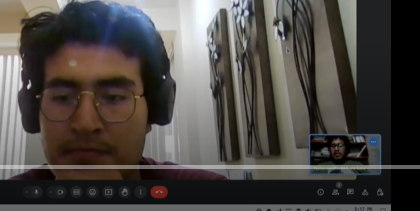

**Entrevista 3:**

**Entrevistador:** Natanael David Soto Salis

**Entrevistado:** Diego Rafael Cisneros

**Duración:** 3:41

**Link: [Entrevista - Diego Cisneros - Segmento 2](https://upcedupe-my.sharepoint.com/:v:/g/personal/u20201c607_upc_edu_pe/Ee922foWWb5HrnfCZN7R6o8BGmKg_zMlYrQyYo1OUST4Gg?e=rwZKCo)** 

1. ` `**Análisis de entrevistas**

**Segmento #1 clientes:**

**Nombre: Luis Espejo**

**Edad: 19 años**

**Residencia: Surco**

**Educación: Estudiante de derecho en la universidad UPC**

Luis ha personalizado su vehículo anteriormente, haciendo cambios específicos como la suspensión, el color y los rines. Su motivación para personalizar su vehículo parece centrarse en el uso personal y la comodidad, además de reflejar sus gustos y preferencias actuales.

**Preferencias y Herramientas Digitales**

Dispositivos Utilizados: Luis utiliza principalmente su smartphone y computadora para buscar información sobre personalización de vehículos.

Canales Digitales: Usa internet y menciona específicamente a Facebook y el Marketplace como medios para obtener ideas y realizar modificaciones en su vehículo.

**Desafíos y Problemas Encarados**

Luis ha enfrentado problemas con la calidad de los materiales y servicios recibidos, mencionando una experiencia negativa con la suspensión, el color y los rines que no cumplían sus expectativas.

Además, señala problemas con una aplicación de personalización de vehículos que se trabaja frecuentemente y no le brinda la confianza deseada.

**Expectativas y Sugerencias**

Luis espera que las plataformas de personalización de vehículos sean más fluidas, sin trabas, y que ofrezcan una variedad de accesorios claramente categorizados.

**Reflexión**

Luis es un joven estudiante interesado en la personalización de vehículos como una forma de expresión personal y mejora de la comodidad. Sus experiencias anteriores le han enseñado la importancia de la calidad y la confiabilidad, tanto en los productos como en las plataformas utilizadas para la personalización. Él resalta la necesidad de plataformas intuitivas y eficientes que puedan manejar información y transacciones sin errores.

.

**Perfil del Entrevistado**

**Nombre: Sebastián Escobar**

**Edad: 19 años**

**Residencia: Lima, en ATE**

**Educación: Estudiante de ingeniería de software**

**Experiencia con la Personalización de Automóviles**

Sebastián describe su experiencia de personalización de automóviles como emocionante y divertida, destacando que realizó modificaciones estéticas y añadió accesorios que mejoran tanto la apariencia como el rendimiento de su vehículo.

M**otivaciones para la Personalización**

La motivación principal de Sebastián para personalizar su auto es hacerlo único y reflejar su personalidad. Además, busca mejorar el rendimiento y la funcionalidad del vehículo para adaptarlo a sus gustos personales.

**Herramientas y Canales Digitales Utilizados**

Sebastián utiliza principalmente su ordenador y, en ocasiones, su teléfono móvil.

Fuentes de información: Consulta revistas, periódicos y participa en foros en línea con especialistas y la comunidad que comparten ideas sobre personalización.También utiliza YouTube para encontrar tutoriales detallados y videos sobre personalización de automóviles, y sigue cuentas en redes sociales como Instagram para inspiración y nuevas ideas.

**Experiencias Negativas y Desafíos**

Aunque Sebastián no ha tenido experiencias negativas personales significativas en la personalización de su auto, es consciente de los problemas que otros han enfrentado, como piezas de baja calidad o instalaciones deficientes. Esto lo motiva a investigar y seleccionar cuidadosamente los productos y servicios.

Expectativas de una Plataforma de Personalización

Sebastián desea que una plataforma de personalización de automóviles ofrezca una amplia gama de productos de calidad y servicios confiables. Valora la idea de una comunidad activa donde los usuarios puedan compartir experiencias y consejos, así como herramientas interactivas para visualizar posibles modificaciones en el vehículo antes de realizarlas.

**Preferencias de Marcas**

Prefiere marcas como Toyota, destacando la calidad de rendimiento y las opciones de prevención que ofrecen.

**Reflexión**

La entrevista revela que Sebastián es un joven apasionado por la personalización de automóviles, enfocado en la calidad y la individualización. Sus comentarios proporcionan insights valiosos para el proyecto, subrayando la importancia de la calidad, la personalización y el soporte.

**Perfil del Entrevistado**

**Nombre: Melanie Ramos**

**Edad: 27 años**

**Residencia: Villa María del Triunfo**

**Profesión: Ingeniera de software**

**Experiencia y Motivación para la Personalización**

Aunque Melanie aún no ha personalizado su automóvil, muestra un fuerte interés en hacer modificaciones visuales, como cambiar el color y agregar imágenes, así como mejoras internas.

Su motivación para personalizar el auto proviene de un deseo de que el vehículo refleje su personalidad y gustos personales. 

**Herramientas y Canales Digitales Utilizados**

Dispositivos: Melanie utiliza principalmente su celular, computadora y, raramente, su iPad para buscar información sobre personalización.

Fuentes de información: Usa Google y TikTok para obtener ideas y también consulta con su mecánico para obtener asesoramiento técnico.

**Experiencias y Desafíos**

Melanie menciona no haber personalizado su auto todavía pero ha tenido problemas con la reparación del vehículo debido a la falta de un mecánico de confianza en el pasado. Esto subraya la importancia de la fiabilidad y la confianza en los servicios relacionados con su vehículo.

Expectativas de una Plataforma de Personalización

Espera que una plataforma de personalización de automóviles le ofrezca sugerencias personalizadas, como mostrar una variedad de colores y cómo estos podrían lucir en su vehículo. También le gustaría ver comparativas sobre mejoras internas y sugerencias sobre qué podría añadir o mejorar en su auto.

**Preferencias de Marcas de Vehículos**

Posee un Suzuki y expresa preferencia por marcas como Toyota y Hyundai, valorando la disponibilidad y facilidad de encontrar repuestos. También menciona a Nissan como una marca de interés.

**Reflexión**

Melanie busca una experiencia de personalización que combine la estética con mejoras funcionales, reflejando su enfoque práctico como ingeniera de software. Su enfoque en la fiabilidad y el soporte técnico destaca la necesidad de una plataforma que ofrezca no solo opciones de personalización, sino también información confiable y accesible sobre el mantenimiento y la mejora de vehículos.

**Segmento #2 Staf mecanico:**

**Perfil del Entrevistado**

**Nombre: Alex Martinez**

**Edad: 20 años**

**Residencia: Santa Anita**

**Profesión: Técnico especialista en Automotriz**

Servicios Ofrecidos

El técnico ofrece personalización de autos, incluyendo kits de carrocería, sistemas de escape de alto rendimiento, y alerones. Se enfoca en mejorar tanto la estética como el rendimiento del motor de los vehículos.

Experiencia con Clientes

La experiencia del técnico con los clientes ha sido positiva, trabajando en proyectos que varían desde modificaciones menores hasta transformaciones completas de vehículos. Esto implica cambios significativos en la apariencia y el rendimiento del automóvil.

Canales de Promoción y Comunicación

Promoción: Utiliza principalmente redes sociales como Facebook y WhatsApp para promocionar sus productos y servicios.

Interacción con Clientes: Prefiere interactuar directamente con los clientes, ya sea en persona, por teléfono o mediante mensajes directos a través de las redes sociales.

Experiencia con Plataformas de Personalización

A pesar de su experiencia en personalización, no ha utilizado plataformas de personalización de autos en línea; siempre ha trabajado en locales y talleres físicos.

Expectativas de una Plataforma de Personalización de Autos

El técnico estaría interesado en una aplicación que permita a los usuarios explorar diferentes modificaciones y acceder a una comunidad de profesionales y entusiastas del automovilismo para intercambiar ideas y conocimientos.

Marcas de Automóviles con Mayor Experiencia

Ha trabajado principalmente con marcas como Nissan, Toyota y Kia, personalizando modelos como sedanes y corolas.

Reflexión

Este técnico especialista representa una perspectiva práctica y directa en el campo de la personalización de automóviles. Su enfoque en la interacción personal y el uso limitado de plataformas digitales sugiere una preferencia por métodos tradicionales de trabajo, aunque muestra interés en las posibilidades que una plataforma digital podría ofrecer para la colaboración y el intercambio de ideas. Esto indica una posible área de oportunidad para desarrollar herramientas que faciliten la conexión entre profesionales del sector automotriz y entusiastas de la personalización de vehículos.

**Perfil del Entrevistado**

**Nombre: Eduardo Guimarães**

**Edad: 23 años**

**Residencia: Lima, en el distrito de Surco**

**Profesión: Mecánico automotriz**

**Servicios de Personalización**

Eduardo menciona que la personalización más popular entre sus clientes es la variedad de colores para los autos, que es el producto más vendido. Además, ofrece servicios para cambiar repuestos según las necesidades específicas de cada vehículo.

**Herramientas y Canales de Comunicación**

Dispositivos Utilizados: Utiliza principalmente su teléfono Android para comunicarse con sus clientes.

Navegador de Preferencia: Prefiere usar Google Chrome por su confiabilidad y popularidad.

Comunicación con Clientes: Utiliza WhatsApp y redes sociales, destacando que maneja un catálogo en WhatsApp y promociona sus servicios en Facebook.

**Experiencia con Clientes**

Eduardo describe que ha tenido experiencias variadas con los clientes, con algunos que aprecian su trabajo y otros que no quedan completamente satisfechos. Sin embargo, indica que generalmente logra que los clientes estén contentos con el resultado final.

**Promoción y Interacción con Clientes**

Promueve sus productos y servicios a través de WhatsApp y Facebook, y está abierto a explorar otras soluciones tecnológicas que puedan mejorar la interacción con los clientes y acortar los tiempos de respuesta.

**Plataformas de Personalización**

Hasta ahora, Eduardo no ha utilizado plataformas específicas de personalización de automóviles más allá de WhatsApp para la comunicación. Muestra interés en una aplicación que permita a los clientes seguir el estado de la personalización de sus vehículos, lo que podría aumentar la satisfacción del cliente al reducir la incertidumbre y mejorar la experiencia general.

**Preferencias y Expectativas Futuras**

Eduardo busca una aplicación que ofrezca seguimiento en tiempo real del estado de la personalización, lo que sugiere que valora la transparencia y la eficiencia en el servicio al cliente. Esto indica una oportunidad para el desarrollo de herramientas digitales que mejoren la gestión y el seguimiento de los proyectos de personalización.

En resumen, Eduardo es un mecánico que combina técnicas tradicionales con el uso de herramientas digitales modernas para comunicarse y gestionar sus servicios de personalización de automóviles. Está interesado en adoptar nuevas tecnologías que mejoren la interacción con los clientes y la gestión de sus proyectos.

**Perfil del Entrevistado**

**Nombre: Diego Rafael**

**Edad: 25 años**

**Residencia: Chorrillos**

**Profesión: Mecánica automotriz**

**Herramientas y Dispositivos Utilizados**

Diego utiliza un dispositivo especializado para diagnosticar el estado de los automóviles, lo cual le permite detectar problemas mecánicos de forma precisa.

También usa su celular para la gestión de clientes y comunicación.

**Navegador de Preferencia**

Prefiere utilizar Microsoft Edge para sus necesidades de navegación en internet.

**Servicios de Personalización**

Ofrece una variedad de productos para personalizar autos, incluyendo partes de carrocería y neumáticos. También trabaja con motores, aunque indica que estos son pedidos más complejos.

**Experiencia con Clientes**

La mayoría de sus experiencias con clientes han sido positivas, especialmente porque estos clientes suelen estar entusiasmados con la personalización de sus autos y tienen ideas claras de lo que quieren.

**Canales de Promoción**

Diego promociona sus productos y servicios principalmente a través de anuncios en Facebook e Instagram, y ocasionalmente usa WhatsApp para contactar clientes activos.

Interacción con Clientes

Prefiere interactuar con los clientes a través de llamadas de voz o mensajes de WhatsApp, destacando la rapidez y eficiencia de este último.

**Plataformas de Personalización**

Hasta ahora, Diego no ha trabajado con plataformas digitales específicas de personalización de automóviles.

**Expectativas de una Aplicación de Personalización**

Está interesado en una aplicación que ofrezca una amplia selección de partes que puedan ser filtradas por tipo de auto, modelo y tipo de partes, facilitando así la personalización según las especificaciones del cliente.

**Marcas de Automóviles con Mayor Experiencia**

Ha trabajado con muchas marcas, pero menciona específicamente que algunas, como Subaru y Honda , son más fáciles de manipular.

**Reflexión**

Diego Rafael es un profesional apasionado por la mecánica y personalización de automóviles, que utiliza tanto herramientas modernas de diagnóstico como métodos de comunicación avanzados para mejorar la interacción con sus clientes y eficientizar su trabajo. La entrevista destaca su adaptabilidad y su enfoque en proporcionar servicios personalizados que cumplan con las expectativas claras y entusiastas de sus clientes.

**Tabla de porcentajes con los 2 segmentos objetivos:**

1. **Needfinding**

Con el propósito de desarrollar una app que satisfaga las necesidades particulares de los usuarios, CarTunn llevará a cabo la identificación del User persona, User Task Matrix, User Journey Maps y Empathy Mapping.

1. **User Personas**

   Para esta sección se presentan personajes ficticios, uno de acuerdo a cada segmento objetivo. La información que se ha utilizado para elaborar los User personas se obtuvo de las entrevistas realizadas previamente a cada segmento objetivo. La intención de las entrevistas era conocer un poco más a las personas a las que la aplicación está dirigida. Entre la información de las entrevistas que fue utilizada tenemos demografía, metas, motivaciones, frustraciones, marcas relacionadas con el tema que envuelve a la aplicación, canales digitales que más utiliza, etc. Para la creación de esta sección se utilizó la plataforma UXPressia.

   **Segmento objetivo: Clientes que buscan customizar sus autos**

   [**https://uxpressia.com/w/DeRZM/p/7vFyy](https://uxpressia.com/w/DeRZM/p/7vFyy)** 

**Segmento objetivo: Staff mecánico**

[**https://uxpressia.com/w/DeRZM/p/h3zhF](https://uxpressia.com/w/DeRZM/p/h3zhF)** 

1. **User Task Matrix**

"En esta sección se presenta el user task matrix, herramienta centrada en los segmentos objetivos (cliente y staff mecánico), que nos permitirá identificar las tareas y objetivos claves de los usuarios. Además, nos permitirá priorizar características y funcionalidades al momento de realizar el product backlog. Para la frecuencia se han considerado cinco opciones:nunca ,casi nunca, a veces, a menudo ,siempre; y para la importancia tres opciones: bajo, medio, alto"

<table><tr><th rowspan="2" valign="top"><b><i>User task Matrix</i></b></th><th colspan="2" valign="top"><b><i>Juan Velasquez</i></b></th><th colspan="2" valign="top"><b><i>Esteban Dominguez</i></b></th></tr>
<tr><td valign="top"><b><i>Frecuencia</i></b></td><td valign="top"><b><i>Importancia</i></b></td><td valign="top"><b><i>Frecuencia</i></b> </td><td valign="top"><b><i>Importancia</i></b></td></tr>
<tr><td>Buscar un web site de taller de personalización de autos</td><td><b><i>A menudo</i></b></td><td><b><i>Alta</i></b></td><td><b><i>Casi nunca</i></b></td><td><b><i>Baja</i></b></td></tr>
<tr><td>Elegir y comprar las piezas a desear para la personalización de autos</td><td><b><i>Siempre</i></b></td><td><b><i>Alta</i></b></td><td><b><i>Nunca</i></b></td><td><b><i>Baja</i></b></td></tr>
<tr><td>Marcar como favorito las piezas deseadas</td><td><b><i>A veces</i></b></td><td><b><i>Baja</i></b></td><td><b><i>Nunca</i></b></td><td>` `<b><i>Baja</i></b></td></tr>
<tr><td>Realizar una orden para cambiar la pieza elegida</td><td><b><i>Siempre</i></b></td><td><b><i>Alta</i></b></td><td><b><i>Nunca</i></b></td><td><b><i>Baja</i></b></td></tr>
<tr><td>Enviar notificacion de estado de personalizacion</td><td><b><i>Nunca</i></b></td><td><b><i>Baja</i></b></td><td><b><i>Siempre</i></b></td><td><b><i>Alta</i></b></td></tr>
<tr><td>Ver la lista de autos y el estado de la personalización</td><td><b><i>Nunca</i></b></td><td><b><i>Baja</i></b></td><td><b><i>Siempre</i></b></td><td><b><i>Alta</i></b></td></tr>
<tr><td>Escribir una observación en cada servicio de tunning</td><td><b><i>Nunca</i></b></td><td><b><i>Baja</i></b></td><td><b><i>A veces</i></b></td><td><b><i>Baja</i></b></td></tr>
<tr><td>Cambiar estado (fecha de entrega) si hay inconvenientes al personalizar el auto</td><td><b><i>Nunca</i></b></td><td><b><i>Baja</i></b></td><td><b><i>Casi nunca</i></b></td><td><b><i>Baja</i></b></td></tr>
<tr><td>Insertar una nueva pieza de personalización a la aplicación</td><td><b><i>Nunca</i></b></td><td><b><i>Baja</i></b></td><td><b><i>Siempre</i></b></td><td><b><i>Alta</i></b></td></tr>
</table>

Las tareas brindan una visión clara sobre las prioridades y comportamientos de dos segmentos objetivos distintos dentro del contexto de un taller de personalización de autos: Juan Velásquez, representando al cliente, y Esteban Domínguez, representando al staff mecánico. Al analizar las tareas con mayor frecuencia y mayor importancia, es posible identificar puntos clave que pueden ayudar a dirigir el desarrollo del producto y la estrategia de servicio.

Esto sugiere que el proceso de selección y compra de piezas es fundamental para su experiencia como usuario. En contraste, para Esteban, las tareas con alta frecuencia y alta importancia son "Enviar notificación de estado de personalización" y "Ver la lista de autos y el estado de la personalización", además de "Insertar una nueva pieza de personalización a la aplicación". Esto indica un enfoque en la gestión y comunicación del progreso de la personalización, así como en la actualización del inventario de piezas disponibles.

Una coincidencia notable entre ambos usuarios es la alta valoración de tareas específicas, aunque para diferentes propósitos. Mientras Juan se concentra en el aspecto de selección y adquisición, Estebanse enfoca en la gestión interna y la comunicación con el cliente.

1. **User Journey Mapping**

En esta sección se presentarán los user journey mapping para cada user persona). El journey comienza en el momento en que el cliente busca una aplicación de personalización de autos, lo que lo lleva a través de este software a disposición. De esta manera, el cliente elige y compra la pieza a personalizar. Luego, realiza una orden de personalización y el staff le notifica  la fecha estimada del trabajo terminado. Por ende, el cliente lleva su auto al taller. Este journey finaliza cuando el staff mecánico notifica al cliente que el trabajo está terminado. Finalmente, el cliente recibe su auto con la personalización deseada y da una reseña y comentario al staff.

**User Journey Mapping: Cliente**

**User Journey Mapping: Staff**

1. **Empathy Mapping**

   En esta sección se presentarán los empathy mapping de acuerdo a los user persona que se realizaron, teniendo en cuenta los dos segmentos objetivos. El empathy mapping será de utilidad debido a que podemos conocer a mayor detalle a nuestros clientes, lo que nos permite mejorar algunos aspectos de la aplicación.

   **Segmento objetivo: Clientes que buscan customizar sus autos**

[**https://uxpressia.com/w/DeRZM/p/6tcWn](https://uxpressia.com/w/DeRZM/p/6tcWn)** 

**Segmento objetivo: Staff mecánico**

[**https://uxpressia.com/w/DeRZM/p/G0tpM](https://uxpressia.com/w/DeRZM/p/G0tpM)** 

1. **As-is Scenario Mapping**

En esta sección se presenta el As-Is Scenario Mapping para el segmento objetivo donde se identifican y comprenden los puntos de contacto del usuario. Para la elaboración se usó Miro.

**As-is scenario Mapping : Cliente**

[**https://miro.com/welcomeonboard/NDFUcUtZQU9SWkZ4SDhKUnNoR0RFVjhWTWZnTFNGd245YVBzZU1UQkxsR3E2WjFaMURtZXY3QjRDeG1DYW53cXwzNDU4NzY0NTUxNzYxNjYxMjg2fDI=?share_link_id=418419123921](https://miro.com/welcomeonboard/NDFUcUtZQU9SWkZ4SDhKUnNoR0RFVjhWTWZnTFNGd245YVBzZU1UQkxsR3E2WjFaMURtZXY3QjRDeG1DYW53cXwzNDU4NzY0NTUxNzYxNjYxMjg2fDI=?share_link_id=418419123921)** 
**

Áreas Positivas:

Anhela encontrar la aplicación con personalización de su gusto

Busca una aplicación para personalizar su auto.

Áreas Negativas:

Frustrado porque no hay aplicaciones de personalización de autos.

Se siente desconfiado y resignado.

Siente que está perdiendo el tiempo y arriesgándose a un mal servicio.

Blank Areas (Áreas que requieren aprender más):

es necesario ver porque los personalizadores ofrecen un servicio a medias.

**As-is scenario mapping : Staff mecanico**

[**https://miro.com/welcomeonboard/NDFUcUtZQU9SWkZ4SDhKUnNoR0RFVjhWTWZnTFNGd245YVBzZU1UQkxsR3E2WjFaMURtZXY3QjRDeG1DYW53cXwzNDU4NzY0NTUxNzYxNjYxMjg2fDI=?share_link_id=418419123921](https://miro.com/welcomeonboard/NDFUcUtZQU9SWkZ4SDhKUnNoR0RFVjhWTWZnTFNGd245YVBzZU1UQkxsR3E2WjFaMURtZXY3QjRDeG1DYW53cXwzNDU4NzY0NTUxNzYxNjYxMjg2fDI=?share_link_id=418419123921)** 

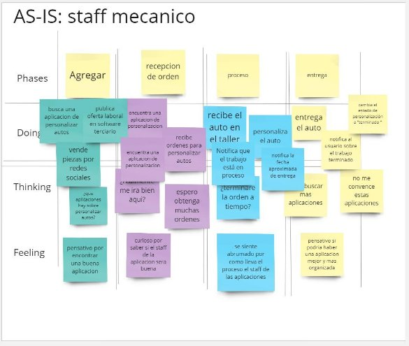

Áreas Positivas:

Anhela encontrar una aplicación para personalización de autos

Áreas Negativas:

abrumado por ver como los staff de las aplicaciones llevan el proceso de personalización de autos.

Blank Areas (Áreas que requieren aprender más):

Es necesario ver porque los personalizadores ofrecen un servicio con malos procesos.

**2.4. Ubiquitous Language**

En esta sección, nos enfocaremos en definir los términos que serán utilizados a lo largo del proyecto. El propósito es asegurar que todos los miembros del equipo y las partes interesadas comprendan de manera uniforme estos términos.

- Automotive customization (Personalización automotriz): El proceso de modificar, mejorar o cambiar aspectos de un vehículo para adaptarlo a las preferencias y necesidades del propietario.
- Accessories (Accesorios): Componentes adicionales que se pueden instalar en un vehículo para mejorar su aspecto, rendimiento o funcionalidad.
- Customization services (Servicios de personalización): Actividades realizadas por staffs mecánicos para modificar o mejorar aspectos específicos de un vehículo según las preferencias del cliente.
- Mechanical staff (Staff mecánico): Profesionales especializados en la personalización automotriz, que ofrecen sus servicios a través de la plataforma.
- Expert advice (Asesoramiento experto): Orientación proporcionada por profesionales de la personalización automotriz dentro de la plataforma, para ayudar a los usuarios a tomar decisiones informadas sobre sus opciones de personalización.
- Notify suppliers (Informar a los proveedores): El proceso de comunicar a los proveedores sobre las necesidades de productos o servicios para la personalización de vehículos dentro de la plataforma CarTunn.
- Report (Reporte): Documento que proporciona información detallada sobre transacciones, actividades o problemas dentro de la plataforma CarTunn, utilizado para análisis y toma de decisiones.
- Orders (Órdenes): Solicitudes realizadas por los usuarios dentro de la plataforma CarTunn para adquirir productos o servicios de personalización automotriz.
- Tuning (Ajuste): Proceso de mejorar el rendimiento, la apariencia o las características de un vehículo mediante modificaciones dentro de la plataforma.
- Mechanical workshop (Taller mecánico): Establecimiento donde se realizan actividades de personalización y mantenimiento automotriz, asociado a la plataforma para ofrecer servicios a los usuarios.
- Customization (Customización): Proceso de cambiar aspectos específicos de un vehículo para adaptarlo a las preferencias del propietario, realizado a través de la plataforma.
- Car (Carro): Medio de transporte terrestre que puede ser modificado o personalizado mediante la plataforma CarTunn para satisfacer las necesidades y preferencias del propietario.

1. **Capítulo III: Requirements Specification** 
   1. **To-Be Scenario Mapping.**

En esta seccion se presentan los To-Be Scenario Mapping para el segmento objetivo donde se reflejaran a partir de los As-Is Scenario Mapping. la experiencia de usuario ideal si se resuelven los puntos de dolor y necesidades. La herramienta usada fue Miro:

**To-be scenario mapping: Cliente que quiere customizar su auto**

<https://miro.com/welcomeonboard/NDFUcUtZQU9SWkZ4SDhKUnNoR0RFVjhWTWZnTFNGd245YVBzZU1UQkxsR3E2WjFaMURtZXY3QjRDeG1DYW53cXwzNDU4NzY0NTUxNzYxNjYxMjg2fDI=?share_link_id=418419123921> 

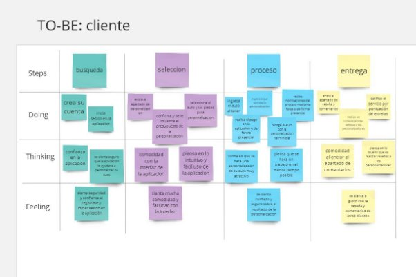

**To-be scenario mapping: staff mecanico**

<https://miro.com/welcomeonboard/NDFUcUtZQU9SWkZ4SDhKUnNoR0RFVjhWTWZnTFNGd245YVBzZU1UQkxsR3E2WjFaMURtZXY3QjRDeG1DYW53cXwzNDU4NzY0NTUxNzYxNjYxMjg2fDI=?share_link_id=418419123921> 

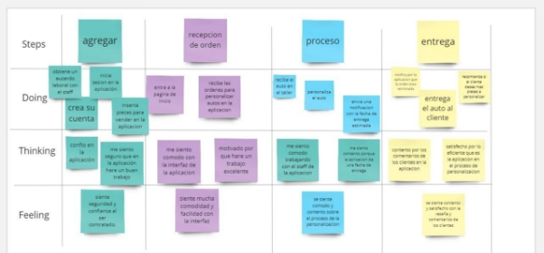

1. **User Stories**

|**Epic/StoryID**|**Título**|**Descripción**|**Criterios de aceptación**|**Epic ID**|
| :-: | :-: | :-: | :-: | :-: |
|
**Epic 1: Landing page**

**Como** cliente

**Quiero** visualizar una página

**Para** saber acerca de la aplicación e ingresar a la aplicación
|||||
|**E1-US01**|**Barra de navegación en la landing page**|
**Como** cliente o staff mecanico

**Quiero** una barra de navegación en la landing page

**Para** tener acceso directo a la aplicación
|
**Escenario 1: El cliente o staff mecánico se encuentra en el navbar de navegación**

**Dado** que el usuario se encuentra en la landing page

**Cuando** se encuentre en la sección del navbar

**Entonces** visualiza enlaces de las secciones, botón de idiomas y el botón para redirigir a la aplicación

**Escenario 2: El cliente o staff mecánico quiere información acerca de nuestro producto**

**Dado** que el cliente o staff mecánico se encuentra en la landing page

**Y** este se encuentre en el navbar,

**Cuando** presione la opción de “Product” en el navbar

Entonces  será dirigido a esta sección y podrá observar la información de nuestro producto.

**Escenario 3: El cliente o staff mecánico quiere saber los testimonios de los usuarios que utilizaron la aplicación**

**Dado** que el cliente o staff mecánico se encuentra en la landing page

**Y** este se encuentre en el navbar,

**Cuando** presione la opción de “Customers” en el navbar

**Entonces**  será dirigido a esta sección y podrá observar los testimonios de los usuarios.

**Escenario 4: El cliente o staff mecánico quiere saber los precios del producto**

**Dado** que el cliente o staff mecánico se encuentra en la landing page

**Y** este se encuentre en el navbar,

**Cuando** presione la opción de “Pricing” en el navbar

**Entonces**  será dirigido a esta sección y podrá observar los planes disponibles del producto.

**Escenario 5: El cliente o staff mecánico quiere contactarse con nosotros**

**Dado** que el cliente o staff mecánico se encuentra en la landing page

**Y** este se encuentre en el navbar,

**Cuando** presione la opción de “Contact” en el navbar

**Entonces**  será dirigido a esta sección y podrá observar nuestro email, número telefónico, horario de atención y ubicación.
|**2**|
|**E1-US02**|**Dirigirse a la aplicación mediante el landing page**|
**Como** cliente o staff mecanico

**Quiero** dirigirme a la aplicación mediante el botón “Open App”

**Para** poder usarla.

|
**Escenario 1: Enlace directo a la aplicación a través de un botón**

**Dado que** el cliente o staff mecánico se encuentra en la landing page

**Y** este se dirige al navbar,

**Cuando** presione el botón “Open app”

**Entonces** es dirigido a la aplicación donde se podrá loguearse.
|**1**|
|**E1-US03**|**Seccion hero del landing page**|
**Como** cliente o staff mecanico

**Quiero** observar la sección hero del landing

**Para** poder tener información de lo que es y ofrece la aplicación.

|
**Escenario 1: El cliente o staff mecánico se encuentra en la sección de hero**

**Dado que** el cliente o staff mecánico se encuentra en la landing page

**Cuando** se encuentra en la sección hero 

**Entonces** observa una presentación de la aplicación.

**Escenario 2: El cliente o staff mecánico accede a la aplicación por el botón de Sign Up**

**Dado que** el cliente o staff mecánico se encuentra en la landing page

**Cuando** se encuentra en la sección hero 

**Y** presiona el botón “Sign up”

**Entonces** será redirigido al formulario de registro de cuentas.
|**1**|
|**E1-US04**|**Seccion “Product” del landing page**|
**Como** cliente o staff mecanico

**Quiero** observar la sección “Product” del landing

**Para** saber las características de la aplicación.
|
**Escenario 1: El cliente o staff mecánico se encuentra en la sección “Product”**

**Dado que** el cliente o staff mecánico se encuentra en la landing page

**Cuando** se encuentra en la sección “Product” 

**Entonces** observa las características de la aplicación.
|**1**|
|**E1-US05**|**Sección “Costumers” del landing page**|
**Como** cliente o staff mecanico

**Quiero** observar la sección “Costumers” del landing

**Para** saber las experiencias de los usuarios al usar nuestra aplicación.
|
**Escenario 1: El cliente o staff mecánico se encuentra en la sección “Customers”**

**Dado que** el cliente o staff mecánico se encuentra en la landing page

**Cuando** se encuentra en la sección “Customers” 

**Entonces** observa las experiencias de los usuarios al usar nuestra aplicación.
|**1**|
|**E1-US06**|**Sección “Princing” del landing page**|
**Como** cliente o staff mecanico

**Quiero** observar la sección “Pricing” del landing

**Para** conocer los planes disponibles que ofrece la aplicacion
|
**Escenario 1: El cliente o staff mecánico se encuentra en la sección “Customers”**

**Dado que** el cliente o staff mecánico se encuentra en la landing page

**Cuando** se encuentra en la sección “Pricing” 

**Entonces** podra saber los planes disponibles.
|**1**|
|**E1-US07**|**Sección “Contact” del landing page**|
**Como** cliente o staff mecanico

**Quiero** observar la sección “Contact” del landing

**Para** contactarme con la empresa.
|
**Escenario 1: El cliente o staff mecánico se encuentra en la sección “Customers”**

**Dado que** el cliente o staff mecánico se encuentra en la landing page

**Cuando** se encuentra en la sección “Contact” 

**Entonces** podrá observar los datos de contacto como: número telefónico, horario de atención, ubicación y correo electrónico.
|**1**|
|**E1-US08**|**Sección del footer del landing page**|
**Como** cliente o staff mecanico

**Quiero** observar la sección del footer del landing

**Para** acceder a las redes sociales
|
**Escenario 1: El cliente o staff mecánico se encuentra en la sección “Customers”**

**Dado que** el cliente o staff mecánico se encuentra en la landing page

**Cuando** se encuentra en la sección del footer

**Entonces** podrá observar el nombre de nuestra aplicacion y nuestras redes sociales.
|**1**|
|**E1-US09**|**Versión en español de landing page**|
**Como** cliente y staff mecanico

**Quiero** tener al alcance una versión en español del landing page

**Para** tener accesibilidad en cuanto a opciones de idioma

|
**Escenario 1: El cliente entra a la landing page**

**Dado que** el usuario se encuentra en el landing page

**Cuando** sea su primera vez

**Entonces** el idioma predeterminado de la landing page será ingles

**Escenario 2: El cliente quiere cambiar de idioma**

**Dado que** el usuario se encuentra en la landing page

**Y** desea cambiar de idioma a español,

**Cuando** presione el botón para cambiar de ingles a español

**Entonces** la landing page se mostrará en el idioma de preferencia seleccionado.
|**1**|
|
**Epic 2: Autentificación y perfil de usuario**

**Como  cliente o miembro del staff**

**Quiero autentificar y configurar mi perfil de usuario**

**Para ingresar a la aplicación**
|||||
|**E2-US01**|**Registro de cuentas**|
**Como cliente o miembro del staff**

**Quiero poder registrar una cuenta**

**Para acceder a los servicios que ofrece**
|
**Escenario 1: El cliente quiere crear una cuenta**

**Dado que el usuario se encuentra en la pantalla de inicio**

**Cuando escoja el tipo de usuario entre cliente o personal del staff mecánico** 

**Y ingrese los datos correctos**

**Entonces la cuenta se creará satisfactoriamente** 

**Escenario 2:El cliente recibe un mensaje de confirmación**

**Dado que todos los datos se hayan completado correctamente**

**Cuando se seleccione la opción de “Confirmar registro”**

**Entonces se desplegará un mensaje de confirmación de cuenta creada satisfactoriamente en la pantalla.**

**Escenario 3: Registro incorrecto**

**Dado que el usuario ha completado el formulario de registro** 

**Cuando intenta registrarse con información incorrecta o incompleta**

**Entonces recibe un mensaje de error indicando los campos que deben corregirse o completarse.**
|**1**|
|**E2-US02**|**Inicio de sesión**|
**Como cliente o integrante del staff mecánico**

**Quiero iniciar sesión en mi cuenta**

**Para acceder a las funciones de la aplicación**
|
**Escenario 1: Inicio de sesión satisfactorio**

**Dado que el usuario se encuentra en el inicio de sesión**

**Cuando ingrese sus credenciales correctas**

**Entonces inicia sesión en su cuenta** 

**Escenario 2: Inicio de sesión con Google**

**Dado que el usuario se encuentre en el inicio de sesión**

**Cuando selecciona inicio de sesión con Google**

**Y valide la cuenta de Google**

**Entonces inicia sesión en su cuenta**

**Escenario 3: Inicio de sesión sin registrar**

**Dado que el usuario se encuentra en la pantalla de inicio de sesión**

**Cuando intenta iniciar sesión sin tener una cuenta previamente registrada**

**Entonces recibe un mensaje de error indicando que no tiene una cuenta registrada**

**Y se le proporciona la opción de redirigirse a la pantalla de registro para crear una cuenta nueva**
|**1**|
|**E2-US03**|**Recuperación de contraseña**|
**Como cliente o integrante del staff mecánico**

**Quiero recuperar la contraseña de mi cuenta**

**Para poder iniciar sesión**
|
**Escenario 1: Solicitud de cambio de contraseña**

**Dado que el usuario acceda a la aplicación y se encuentre en la sección de recuperación de contraseña,**

**Cuando ingrese el correo asociado a su cuenta para recuperar la contraseña,**

**Y dicho correo exista en la base de datos,**

**Entonces se enviará un mensaje de recuperación de contraseña a su dirección de correo electrónico.**

**Escenario 2:Cuenta de correo no existe**

**Dado que el usuario entre a la aplicación y acceda a la sección de recuperación de contraseña,**

**Cuando ingrese el correo asociado a su cuenta para recuperar la contraseña,**

**Y dicho correo no exista en la base de datos,**

**Entonces no se enviará un correo de recuperación de contraseña.**

**Escenario 3: Enlace de recuperación de contraseña**

**Dado que el usuario revise su correo electrónico después de haber solicitado la recuperación de contraseña,**

**Y haya recibido un enlace para restablecer su contraseña,**

**Cuando el usuario haga clic en el enlace y establezca una nueva contraseña,**

**Entonces la contraseña será actualizada a la que el usuario ha ingresado.**
|**2**|
|**E2-US04**|**Cerrar sesión**|
**Como cliente o integrante del staff mecánico**

**Quiero cerrar mi sesión**

**Para no dejar mi sesión abierta en un dispositivo**
|
**Escenario 1: Cerrar sesión**

**Dado que el usuario se encuentre dentro de la aplicación,**

**Y seleccione el menú de la barra de navegación,**

**Cuando presione la opción "Sign out",**

**Y confirme la acción,**

**Entonces será redirigido automáticamente al landing page.**
|**1**|
|
**Epic 3: Paneles de usuario**

**Como cliente** 

**Quiero visualizar un panel**

**Para cada opción de navegación**
|||||
|**E3-US01**|**Barra de navegación**|
**Como cliente**

**Quiero visualizar un sidebar con links de navegación**

**Para navegar por la aplicación**
|
**Escenario 1: El cliente quiere navegar por la aplicación**

**Dado que el cliente ha observado las interfaces de la aplicación.**

**Cuando inicie sesión con su usuario y contraseña.**

**Y vea la barra de navegación**

**Entonces podrá interactuar con la aplicación con facilidad.**

**Escenario 2: El cliente quiere acceder a las secciones principales**

**Dado que el cliente ha iniciado sesión en la aplicación.**

**Cuando el cliente hace clic en el ícono de sidebar de navegación.**

**Entonces el cliente ve la lista desplegable con los links principales.**

**Y el cliente debe poder acceder rápidamente a las secciones principales al hacer clic en los links correspondientes**
|**3**|
|**E3-US02**|**Configuración de perfil**|
**Como cliente**

**Quiero configurar mi perfil**

**Para visualizar o modificar mis datos**
|
**Escenario 1:El cliente quiere acceder a la configuración de su perfil**

**Dado que el cliente ha iniciado sesión y se encuentra en la pantalla de inicio.**

**Cuando el cliente se dirija a la sección “Configuración de perfil”.**

**Entonces el cliente podrá observar sus datos personales actuales.**

**Escenario 2: El cliente quiere modificar sus datos personales**

**Dado que el cliente se encuentra en la pantalla de inicio.**

**Cuando el cliente accede a la sección de “Configuración de perfil”.**

**Y el cliente modifica sus datos personales.**

**Entonces el cliente debe poder editar sus datos y guardar los cambios realizados.**

**Y el cliente recibe una confirmación de que los cambios se han guardado correctamente.**
|**3**|
|**E3-US03**|**Ajustes de aplicación**|
**Como cliente**

**Quiero realizar ajustes y preferencias de aplicación**

**Para tener una experiencia personalizada en la aplicación**
|
**Escenario 1: El cliente quiere visualizar ajustes de la aplicación**

**Dado que el cliente quiere visualizar los ajustes de la aplicación.**

**Cuando el cliente accede a la sección de “Ajustes de la aplicación”.**

**Entonces el cliente debe poder ver una lista de ajustes disponibles.**

**Y cada ajuste debe tener una descripción**

**Escenario 2: El cliente quiere realizar ajustes en la aplicación**

**Dado que el cliente está en la pantalla de inicio.**

**Cuando el cliente accede a la sección de ajustes de la aplicación.**

**Y el cliente selecciona un ajuste para poder modificarlo.**

**Y el cliente debe poder guardar los cambios realizados en los ajustes.**

**Entonces el cliente debe poder guardar los cambios realizados.**
|**3**|
|**E3-US04**|**Recibir notificaciones**|
**Como cliente**

**Quiero recibir notificaciones relevantes**

**Para estar informado sobre las novedades en la aplicación**
|
**Escenario 1: Activar notificaciones en la aplicación**

**Dado que el cliente está en la pantalla de inicio.**

**Cuando el cliente accede a la sección de “Ajustes de la aplicación”.**

**Y el cliente busca la opción para activar las notificaciones.**

**Entonces el cliente podrá activar la opción “Recibir notificaciones”**

**Escenario 2: El cliente quiere desactivar las notificaciones en la aplicación**

**Dado se encuentra en la pantalla de inicio.**

**Cuando el cliente accede a la sección “Ajustes de la aplicación”.**

**Y el cliente busca la opción para desactivar las notificaciones**

**Entonces el cliente podrá desactivar la opción “Recibir notificaciones”.**
|**3**|
|
**Epic 4: Control de usuario**

**Como** cliente

**Quiero** crear, configurar o editar

**Para** realizar mejores procesos en la aplicación
|||||
|**E4-US01**|**Afiliar tarjeta para pagos**|
**Como cliente**

**Quiero afiliar una tarjeta en la aplicación**

**Para poder pagar la personalización del auto**
|
**Escenario 1: El usuario afilia una tarjeta válida a su cuenta**

**Dado que el cliente cuenta con una cuenta en la aplicación Y está en la sección de afiliar una tarjeta,**

**Y rellene los formularios con sus datos**

**Cuando haga clic en el botón de afiliar,**

**Entonces el sistema le mostrará un mensaje “afiliación exitosa”.**

**Escenario 2: El cliente trata de afiliar una tarjeta no válida**

**Dado que el cliente se encuentra en la sección de afiliar tarjeta**

**Y llena todos los datos, pero con una tarjeta inválida,**

**Cuando presione el botón de afiliar,**

**Entonces el sistema le mostrará un mensaje indicando que “los datos de la tarjeta son erróneos”.**

**Escenario 3: El cliente no rellena de forma adecuada o deja en blanco algunos datos requeridos**

**Dado que el cliente se encuentre en la sección de afiliar tarjeta**

**Y no rellena de forma adecuada o deja casilleros en blanco, Cuando oprima el botón de afiliar,**

**Entonces el sistema le devolverá el mensaje “debe rellenar los datos adecuadamente**

**Y no dejar casilleros en blanco”.**

|**5**|
|**E4-US02**|**Eliminar datos de la cuenta**|
**Como cliente**

**Quiero eliminar mis datos de la cuenta**

**Para cuando decida retirarme permanentemente de la aplicación**
|
**Escenario 1: Usuario quiere eliminar datos de su cuenta**

**Dado que el cliente se encuentra dentro de la aplicación**

**Y esté seleccione el menú de la barra de navegación,**

**Cuando presione la opción “Settings”**

**Y se dirige a dicho apartado**

**Y se presiona la opción de eliminar datos**

**Entonces le pedirá “confirmar” para eliminar permanentemente sus datos de la aplicación**
|**2**|
|
**Epic 5: Participación de usuarios**

**Como cliente**

**Quiero usar la aplicación**

**Para tener mayor interacción con la misma**

|||||
|**E5-US01**|**Contacto Directo con Personalizadores de autos**|
**Como cliente**

**Quiero tener contacto directo con los personalizadores de autos**

**Para consultar sobre las personalizaciones de autos presentadas en la plataforma**
|
**Escenario 1: El cliente busca asesoría**

**Dado que el usuario registrado navega por la plataforma en una sección dedicada a los personalizadores de autos asociados,**

**Cuando se encuentre con las opciones de contacto de la aplicación**

**Y las selecciones,**

**Entonces desplegará tanto el correo como el número telefónico de los mismos.**
|**2**|
|**E5-US02**|**Interacción de usuario**|
**Como cliente**

**Quiero interactuar con reseñas, comentarios o calificaciones sobre las personalizaciones de autos**

**Para ayudarnos entre nosotros mediante las recomendaciones**
|
**Escenario 1: El cliente coloca una reseña sobre la personalización de su auto** 

**Dado que el cliente se encuentre en el proceso de personalización de su auto,**

**Cuando se termina su personalización de su auto**

**Entonces desplegará una opción para comentar sobre la personalización de su auto terminada**

**Escenario 2: El cliente coloca una calificación sobre la personalización de su auto**

**Dado que el cliente se encuentre en proceso de personalización de su auto,**

**Cuando se termina la personalización de su auto**

**Entonces desplegará una opción para calificar sobre la personalización de su auto**
|**1**|
|
**Epic 6: Preferencias en la aplicación**

**Como cliente** 

` `**Quiero visualizar una página**

**Para saber acerca de las preferencias del cliente**
|||||
|**E6-US01**|**Preferencia de idioma**|
**Como cliente**

**Quiero configurar preferencias de idioma**

**Para utilizar la aplicación según mi preferencia de idioma**

|
**Escenario 1: Modo predeterminado de idioma**

**Dado que el usuario no haya realizado cambios en la preferencia de idioma,**

**Cuando ingrese a la aplicación,**

**Entonces el idioma predeterminado es ingles**

**Escenario 2: Cambio de idioma en la aplicación**

**Dado que el usuario se encuentre en sección de configuración de idioma,**

**Cuando seleccione un idioma,**

**Entonces el idioma de la aplicación se cambiará al idioma seleccionado**
|**2**|
|**E6-US02**|**Preferencia de tema oscuro**|
**Como cliente**

**Quiero cambiar el tipo de tema claro a oscuro**

**Para utilizar la aplicación de acuerdo con mi preferencia**

|
**Escenario 1: Modo predeterminado del tema de la aplicación**

**Dado que el usuario no haya realizado cambios en la preferencia de temas,**

**Cuando ingrese a la aplicación,**

**Entonces el tema predeterminado es el modo claro.**

**Escenario 2: Cambio de tema en la aplicación**

**Dado que el usuario se encuentre en sección de configuración de tema,**

**Cuando seleccione un tema,**

**Entonces el tema de la aplicación se cambiará al modo seleccionado.**
|**1**|
|
**Epic 7: Backend API**

**Como** desarrollador

` `**Quiero** utilizar la API de un servicio backend

**Para** que el usuario pueda usar la aplicación
|||||
|**E7-US01**|Registro de usuario |
**Como** desarrollador 

**Quiero** realizar el proceso de registro de los datos de los usuarios a  través del backend

**Para** que los clientes pueden autenticarse en la aplicación 

|
**Escenario 1: Guardar data de un usuario**

**Dado que** el desarrollador  quiere guardar la data

**Cuando** utilice el método POST en el endpoint “/login” 

**Entonces** la api responderá con un código 201 

**Y** se** guardará los datos del nuevo cliente en la base de datos

**Escenario 2: Guardar data de un usuario existente**

**Dado que** el desarrollador  quiere guardar la data de un usuario que ya existe

**Cuando** utilice el método POST en el endpoint “/login” 

**Entonces** la api responderá con un código 400 

**Y** se **NO** guardará los datos del nuevo cliente en la base de datos

**Escenario 3: Actualizar data de un usuario por su id**

**Dado que** el desarrollador  quiere actualizar la data de un usuario en específico

**Cuando** utilice el método POST en el endpoint “/data/user:id” 

**Entonces** la api responderá con un código 201 

**Y** se** actualizará los datos del nuevo cliente en la base de datos

**Escenario 4: Actualizar data de un usuario inexistente por su id**

**Dado que** el desarrollador  quiere actualizar la data de un usuario en específico inexistente

**Cuando** utilice el método POST en el endpoint “/data/user:id” 

**Entonces** la api responderá con un código 400 

**Y** se **NO se** actualizará nada

**Escenario 4: Validar data de un usuario** 

**Dado que** el desarrollador  quiere validar la data de un usuario para que pueda acceder a la aplicación

**Cuando** utilice el método GET en el endpoint “/user:id” 

**Entonces** la api responderá con un código 201 

**Y** se** obtendrá todos los datos de todos los clientes para poder proceder con las validaciones necesarias

|**7**|
|**E7-US02**|Traer toda la data de las modificaciones que ofreceremos a los clientes|
**Como** desarrollador 

**Quiero** obtener toda la data de las modificaciones que ofreceremos a los clientes a  través del backend

**Para** que los clientes puedan visualizarlas

 

|
**Escenario 1: Obtener todas las modificaciones**

**Dado que** el desarrollador  quiere visualizar la lista de modificaciones disponibles

**Cuando** utilice el método GET en el endpoint “/modifications” 

**Entonces** la api responderá con un código 201 

**Y** se** obtendrá todas las modificaciones disponibles

**Escenario 2: Obtener una modificación mediante su id**

**Dado que** el desarrollador  quiere visualizar una modificación disponible

**Cuando** utilice el método GET en el endpoint “/modification:id” 

**Entonces** la api responderá con un código 201 

**Y** se** obtendrá la modificación en específico

**Escenario 3: Obtener una modificación inexistente mediante su id**

**Dado que** el desarrollador  quiere visualizar una modificación inexistente 

**Cuando** utilice el método GET en el endpoint “/modification:id” 

**Entonces** la api responderá con un código 400

Y **NO** se mostrará nada
|**7**|
|**E7-US03**|Traer toda la data de las órdenes para los miembros staff|
**Como** desarrollador 

**Quiero** obtener toda la data de todas las órdenes a  través del backend

**Para** que los usuarios de tipo staff puedan visualizarlas
|
**Escenario 1: Obtener todas las órdenes**

**Dado que** el desarrollador  quiere visualizar la lista de órdenes disponibles

**Cuando** utilice el método GET en el endpoint “/orders” 

**Entonces** la api responderá con un código 201 

**Y** se** obtendrá todas las órdenes disponibles

**Escenario 2: Obtener una orden mediante su id**

**Dado que** el desarrollador  quiere visualizar una orden disponible

**Cuando** utilice el método GET en el endpoint “/order:id” 

**Entonces** la api responderá con un código 201 

**Y** se** obtendrá la orden en específico

**Escenario 3: Obtener una orden inexistente mediante su id**

**Dado que** el desarrollador  quiere visualizar una orden inexistente 

**Cuando** utilice el método GET en el endpoint “/orden:id” 

**Entonces** la api responderá con un código 400

Y **NO** se mostrará nada
||

1. **Impact Mapping.** 

   En la presente sección se elaboró el impact mapping partiendo desde las metas de negocio para cada user persona, los impactos, entregables y unirlos a las historias de usuario adecuadas.

   Segmento Objetivo: Cliente

   <https://uxpressia.com/w/DeRZM/i/cXXoH> 

   ![ref1]

   ![ref2]

   Segmento Objetivo: Staff de taller mecánico

   <https://uxpressia.com/w/DeRZM/i/3kJuF> 

   ![ref3]

![ref4]

1. **Product Backlog.**

**Link del trello: [https://trello.com/invite/b/c7wBt54Y/ATTI10dc05b4716e2b5ca0de129e90564f0eCE69B89C/product-backlog**](https://trello.com/invite/b/c7wBt54Y/ATTI10dc05b4716e2b5ca0de129e90564f0eCE69B89C/product-backlog)**

|**#Orden**|**User Story Id**|**Título**|**Description**|**Story Points (1/2/3/5/8)** |
| :-: | :-: | :-: | :-: | :-: |
|**1**|**E1-US01**|**Barra de navegación en la landing page**|
**Como cliente o staff mecanico**

**Quiero una barra de navegación en la landing page**

**Para tener acceso directo a la aplicación**
|**2**|
|**2**|**E1-US02**|**Dirigirse a la aplicación mediante el landing page**|
**Como cliente o staff mecanico**

**Quiero dirigirme a la aplicación mediante el botón “Open app”**

**Para poder usarla.**
|**1**|
|**3**|**E1-US03**|**Seccion hero del landing page**|
**Como cliente o staff mecanico**

**Quiero observar la sección hero del landing**

**Para poder tener información de lo que es y ofrece la aplicación.**
|**1**|
|**4**|**E1-US04**|**Seccion “Product” del landing page**|
**Como cliente o staff mecanico**

**Quiero observar la sección “Product” del landing**

**Para saber las características de la aplicación.**
|**1**|
|**5**|**E1-US05**|**Sección “Costumers” del landing page**|
**Como cliente o staff mecanico**

**Quiero observar la sección “Costumers” del landing**

**Para saber las experiencias de los usuarios al usar nuestra aplicación.**
|**1**|
|**6**|**E1-US06**|**Sección “Princing” del landing page**|
**Como cliente o staff mecanico**

**Quiero observar la sección “Pricing” del landing**

**Para conocer los planes disponibles que ofrece la aplicacion**
|**1**|
|**7**|**E1-US07**|**Sección “Contact” del landing page**|
**Como cliente o staff mecanico**

**Quiero observar la sección “Contact” del landing**

**Para contactarme con la empresa.**
|**1**|
|**8**|**E1-US08**|**Sección del footer del landing page**|
**Como cliente o staff mecanico**

**Quiero observar la sección del footer del landing**

**Para acceder a las redes sociales**
|**1**|
|**9**|**E1-US09**|**Versión en español de landing page**|
**Como cliente y staff mecanico**

**Quiero tener al alcance una versión en español del landing page**

**Para tener accesibilidad en cuanto a opciones de idioma**

|**1**|
|**10**|**E2-US01**|**Registro de cuentas**|
**Como cliente o miembro del staff**

**Quiero poder registrar una cuenta**

**Para acceder a los servicios que ofrece**
|**1**|
|**11**|**E2-US02**|**Inicio de sesión**|
**Como cliente o integrante del staff mecánico**

**Quiero iniciar sesión en mi cuenta**

**Para acceder a las funciones de la aplicación**
|**1**|
|**12**|**E2-US03**|**Recuperación de contraseña**|
**Como cliente o integrante del staff mecánico**

**Quiero recuperar la contraseña de mi cuenta**

**Para poder iniciar sesión**
|**2**|
|**13**|**E2-US04**|**Cerrar sesión**|
**Como cliente o integrante del staff mecánico**

**Quiero cerrar mi sesión**

**Para no dejar mi sesión abierta en un dispositivo**
|**1**|
|**14**|**E3-US01**|**Barra de navegación**|
**Como cliente**

**Quiero visualizar un sidebar con links de navegación**

**Para navegar por la aplicación**
|**3**|
|**15**|**E3-US02**|**Configuración de perfil**|
**Como cliente**

**Quiero configurar mi perfil**

**Para visualizar o modificar mis datos**
|**3**|
|**16**|**E3-US03**|**Ajustes de aplicación**|
**Como cliente**

**Quiero realizar ajustes y preferencias de aplicación**

**Para tener una experiencia personalizada en la aplicación**
|**3**|
|**17**|**E3-US04**|**Recibir notificaciones**|
**Como cliente**

**Quiero recibir notificaciones relevantes**

**Para estar informado sobre las novedades en la aplicación**
|**3**|
|**18**|**E4-US01**|**Afiliar tarjeta para pagos**|
**Como cliente**

**Quiero afiliar una tarjeta en la aplicación**

**Para poder pagar la personalización del auto**
|**5**|
|**19**|**E4-US02**|**Eliminar datos de la cuenta**|
**Como cliente**

**Quiero eliminar mis datos de la cuenta**

**Para cuando decida retirarme permanentemente de la aplicación**
|**2**|
|**20**|**E5-US01**|**Contacto Directo con Personalizadores de autos**|
**Como cliente**

**Quiero tener contacto directo con los personalizadores de autos**

**Para consultar sobre las personalizaciones de autos presentadas en la plataforma**
|**2**|
|**21**|**E5-US02**|**Interacción de usuario**|
**Como cliente**

**Quiero interactuar con reseñas, comentarios o calificaciones sobre las personalizaciones de autos**

**Para ayudarnos entre nosotros mediante las recomendaciones**
|**1**|
|**22**|**E6-US01**|**Preferencia de idioma**|
**Como cliente**

**Quiero configurar preferencias de idioma**

**Para utilizar la aplicación según mi preferencia de idioma**

|**2**|
|**23**|**E6-US02**|**Preferencia de tema oscuro**|
**Como cliente**

**Quiero cambiar el tipo de tema claro a oscuro**

**Para utilizar la aplicación de acuerdo con mi preferencia**

|**1**|
|**24**|**E7-US01**|**Registro de usuario** |
**Como desarrollador** 

**Quiero realizar el proceso de registro de los datos de los usuarios a  través del backend**

**Para que los clientes pueden autenticarse en la aplicación** 

|**7**|
|**25**|**E7-US02**|**Traer toda la data de las modificaciones que ofreceremos a los clientes**|
**Como desarrollador** 

**Quiero obtener toda la data de las modificaciones que ofreceremos a los clientes a  través del backend**

**Para que los clientes puedan visualizarlas**
|**7**|
|**26**|**E7-US03**|**Traer toda la data de las órdenes para los miembros staff**|
**Como desarrollador** 

**Quiero obtener toda la data de todas las órdenes a  través del backend**

**Para que los usuarios de tipo staff puedan visualizarlas**
|**7**|

[ref1]: Aspose.Words.392522b7-4c62-459c-9302-b51d1f775096.030.png
[ref2]: Aspose.Words.392522b7-4c62-459c-9302-b51d1f775096.031.png
[ref3]: Aspose.Words.392522b7-4c62-459c-9302-b51d1f775096.032.png
[ref4]: Aspose.Words.392522b7-4c62-459c-9302-b51d1f775096.033.png

1. **Capítulo IV: Product UX/UI Design** 
   1. **Style Guidelines**
      1. **General Style Guidelines**

**Branding:** 

Aunque en un principio optamos por la creación de un imagotipo, sentimos que saturaba la esencia de la aplicación, por lo que la final optamos por un diseño minimalista y moderno en representado en un logotipo con los colores representativos de nuestra marca.

**Tipografías:**

Para las tipografías optamos por usar 3 variaciones de roboto(regular, italic semibold, black) y 2 variaciones de Plus Jakarta Sans(light, regular).

**Colores:**

En cuanto a nuestra paleta de colores, esta consta únicamente de 2, los cuales son un azul(#5766F5) y un negro con un matiz claro(#595959).

**Margin:**

Se optó por hacer uso de margin de elementos pequeños: verticalmente: 24px, horizontalmente 32px y para elementos grandes: verticalmente: 24px, horizontalmente 48px.

1. **Web Style Guidelines.**

**Enlace del figma: <https://www.figma.com/file/3puKCQI9HpY36ICGlYihgc/CarTunn-vFinal?type=design&node-id=224%3A2416&mode=design&t=w8OvXgMIblMERzsm-1>** 

Como se mencionó anteriormente se buscó que la landing fuese mucho más limpia por lo que el navbar no tiene iconos y el margin de 40px entre elementos ul y li mejora la UI.

Se tiene a su vez un section con algunas marcas de vehículos que ya hemos personalizado anteriormente, así como un article con algunas características acerca de nuestro producto.

En la sección de Costumers presentamos un article con las opiniones de algunos de nuestros clientes con los que ya hayamos trabajado.

Y finalmente se puede ver un article en la sección de pricing pues al trabajar dependiendo el vehículo, no existe un costo fijo pero se puede realizar una cotización. Sin olvidar otro article con información acerca de donde nos encontramos e información de contacto y el footer.

Importante: la web está diseñada a su vez para ser responsive, con plena compatibilidad con Android y IOS.

1. **Information Architecture.**
   1. **Organization Systems.** 

En lo que concierne a la organización visual del contenido de nuestro proyecto, se aplicará el patrón visual hierarchy para organizar la información en las distintas secciones de la aplicación. Esto significa que la relevancia de las oraciones será determinada por el tamaño de la fuente, donde aquellas de mayor importancia se mostrarán con un tamaño de fuente de 48px (equivalente a 3rem), mientras que otras se presentarán con tamaños de fuente más pequeños. Además, se utilizará un formato de organización matricial ordenada para exhibir las características del producto, asegurando una presentación estructurada y fácil de seguir.

En cuanto a los métodos de categorización del contenido, se empleará la categorización basada en la audiencia, dado que nuestro proyecto tiene dos segmentos objetivos: clientes interesados en personalizar sus autos y staff mecánico. Cada segmento contará con secciones específicas y funciones adaptadas a sus necesidades particulares. Adicionalmente, se utilizará la categorización cronológica para el registro de entradas, especialmente cuando los usuarios accedan a bases de datos con información temporal. En este caso, las entradas más recientes tendrán prioridad y se mostrarán al principio para facilitar la visualización del contenido en orden temporal.

1. **Labeling Systems.**

En el landing page, hemos optado por reducir el uso de iconos representativos en los enlaces y, en su lugar, dar prioridad al texto con botones destacados. Esto nos permite mantener la estética minimalista del landing page. Además, hemos incluido iconos de colores para identificar nuestras redes sociales y otros elementos.

En relación con nuestra aplicación, también hemos implementado botones de acceso rápido uno de muchos como a modo de call-to-action, para que los usuarios puedan ordenar accesorios de manera directa y sencilla.

1. **SEO Tags and Meta Tags.** 

**Landing Page:** 

<meta charset= UTF-8 > 

<meta http-equiv="X-UA-Compatible" content="IE=edge"> 

<meta name= "viewport" content="width=device-width, initial-scale=1.0"> 

<meta name="agriculture" content="index, follow"> 

<link rel="shortcut icon" href="\*./images/favicon.png" type="image/x-icon"/> 

<title>CarTunn</title> 

<meta name="keywords" content="cartunn, tunning, mechanical staff, report, Customization, orders, automotive customization , software, accessories, customization services"> 

<meta name="description" content="Start now customizing your car now, There are already dozens of car lovers who have trusted us, you be one more"> 

**Web Application:** 

<meta charset= UTF-8 > 

<meta http-equiv="X-UA-Compatible" content="IE=edge"> 

<meta name= "viewport" content="width=device-width, initial-scale=1.0"> 

<meta name="customization" content="index, follow"> 

<link rel="shortcut icon" href="\*./images/favicon.png" type="image/x-icon"/> 

<title>CarTunn</title> 

<meta name="keywords" content="CarTunn,CarTunn Log In, CarTunn Sing Up, CarTunn app, CarTunn register, customization software,"> 

<meta name="description" content="CarTunn Log In.Start now customizing your car now.Collaborative platform between mechanical staff and clients who want to customize their cars."> 

1. **Searching Systems.** 

En lo que respecta a los sistemas de búsqueda en nuestra aplicación, se implementará un sistema de filtros en los registros de entradas por fecha, lo que permitirá a los usuarios buscar y visualizar información según fechas específicas.

Además, se utilizarán filtros por pestañas en las siguientes ocasiones:

- Cuando el cliente, interesado en personalizar su automóvil, desee buscar sus procesos de personalización según su estado, como "en proceso" y "finalizado". Esto permitirá a los usuarios visualizar rápidamente el estado de sus solicitudes de personalización y realizar un seguimiento de su progreso.
- Cuando el staff mecánico revise, dentro de un proceso de personalización de vehículos, el estado de los vehículos en cada etapa, como "en revisión", "en proceso de instalación", "completado", entre otros según sea necesario. Esta función proporcionará una visión clara del progreso de cada proyecto de personalización y ayudará al personal mecánico a gestionar eficientemente las tareas pendientes.

1. **Navigation Systems.**

La estructura de navegación de nuestra aplicación se fundamentará en un componente de interfaz de usuario ampliamente utilizado: el sidebar. Este sidebar contendrá todas las opciones disponibles en la aplicación, organizadas de manera jerárquica. Es importante destacar que el contenido del sidebar variará según el tipo de usuario que acceda a la aplicación.

1. **Landing Page UI Design.** 
   1. **Landing Page Wireframe.** 

**Enlace del figma web:** 

[**https://www.figma.com/file/mTtYszxtJt7r9ctlNzccEK/Wireframe-Landingpage?type=design&node-id=0%3A1&mode=design&t=SDb42Y1oTtVkd5Go-1]** 

![ref1]

![ref2]

**Enlace del figma móvil:**

[**https://www.figma.com/file/Ra8FhHb46JMhkNThyLmwbU/Mobile-wireframe?type=design&node-id=0%3A1&mode=design&t=4IPCw13uV4ZLjkE0-1]** 

![ref3]

![ref4]

1. **Landing Page Mock-up.**

**Enlace del figma: <https://www.figma.com/file/3puKCQI9HpY36ICGlYihgc/CarTunn-vFinal?type=design&node-id=224%3A2416&mode=design&t=wOoV1LZs3RIcch1q-1>** 

1. **Web Applications UX/UI Design.** 
   1. **Web Applications Wireframes.** 
      User goal: El usuario se registra, restablece su contraseña o inicia sesión en la aplicación

      Inicio de sesión

      

Registro de nueva cuenta

Reestablecer la contraseña

Aplicación para clientes

User goal: Presentación del home de la aplicación

Descripción detallada del elemento automovilístico a ordenar para poder ser reemplazado por el antiguo 

Modal que muestra los elementos guardados como favoritos por el cliente

User goal: Status report del vehículo(muestra el estado de tuning en el que se encuentra el vehículo)

- In process: En proceso de tuning
- Finished: Modificación terminada

![ref5]

User goal: Notificaciones que llegarán al usuario inmediatamente al haber ordenado sus modificaciones indicando la fecha de entrega del vehículo 

![ref6]

User goal: Pasarela de pagos

![ref7]

User goal: Settings del perfil del usuario

![ref8]

User goal: apartado con las preguntas frecuentes

![ref9]

User goal: Aplicación para miembros de staff:

Modal para escribir una observación en caso de haberla por cada servicio de tuning.

En caso de haber problemas en la modificación del vehículo, el staff manualmente puede cambiar la fecha de entrega del vehículo al cliente y este será notificado.

Toogle manual que el staff puede modificar para indicar el estado en el que se encuentra el vehículo 

In process: En proceso de tuning

Finished: Modificación terminada

Manejo de reembolsos

![ref10]

Subir nuevo item a la aplicación

![ref11]

Actualizar nuevo item a la aplicación

![ref12]

Notificar al cliente

![ref13]

Notificar a los proveedores

![ref14]

**Enlace de figma:**

[**https://www.figma.com/file/Ra8FhHb46JMhkNThyLmwbU/Mobile-wireframe?type=design&node-id=10%3A2763&mode=design&t=uEXRlWCPVG53IytA-1]** 

1. **Web Applications Wireflow Diagrams.** 

**User goal: usuario se registra ,cambia contraseña o inicia sesión en la aplicación con credenciales**

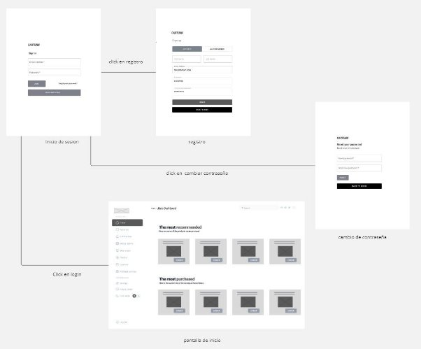

"Descripción:

Al iniciar la aplicación, el usuario se encuentra en el formulario de inicio de sesión, donde tiene tres opciones: iniciar sesión con credenciales correctas, registrarse al darle click al apartado de registros o cambiar contraseña. Una vez que el usuario ingresa con sus credenciales correctas en el inicio de sesión, podrá visualizar su dashboard correspondiente si es un cliente o del staff"

**User goal: Presentación del home de la aplicación**

Se dirige a la pantalla de inicio y selecciona clic en un item, por lo cual le da una descripción detallada del elemento automovilístico a ordenar para poder ser reemplazado por el antiguo y se abre con un clic la sección de los elementos guardados como favoritos por el cliente.

**User goal: Status report del vehículo(muestra el estado de tuning en el que se encuentra el vehículo)**

- In process: En proceso de tuning
- Finished: Modificación terminada

![ref6]**User goal: Notificaciones que llegarán al usuario inmediatamente al haber ordenado sus modificaciones indicando la fecha de entrega del vehículo** 

![ref5]

**                               

**User goal: Pasarela de pagos**

![ref7]

User goal: Settings del perfil del usuario

![ref8]

**User goal: apartado con las preguntas frecuentes**

![ref9]

**User goal: Aplicación para miembros de staff:**

U**ser goal: Reembolsos**

![ref10]

**user goal: subir piezas**

![ref11]

**user goal: remover item**

![ref12]

**user goal: solicitar piezas a proveedores**

![ref14]

**user goal: notificar piezas a clientes**

![ref13]

1. **Web Applications Mock Ups**

User goal: El usuario se registra, restablece su contraseña o inicia sesión en la aplicación

Inicio de sesión

Registro de nueva cuenta

Reestablecer la contraseña

Aplicación para clientes

User goal: Presentación del home de la aplicación

Descripción detallada del elemento automovilístico a ordenar para poder ser reemplazado por el antiguo 

Modal que muestra los elementos guardados como favoritos por el cliente

User goal: Status report del vehículo(muestra el estado de tuning en el que se encuentra el vehículo)

- In process: En proceso de tuning
- Finished: Modificación terminada

User goal: Notificaciones que llegarán al usuario inmediatamente al haber ordenado sus modificaciones indicando la fecha de entrega del vehículo 

User goal: Pasarela de pagos

![ref15]

User goal: Settings del perfil del usuario

![ref16]

User goal: apartado con las preguntas frecuentes

![ref17]

User goal: Aplicación para miembros de staff:

Modal para escribir una observación en caso de haberla por cada servicio de tuning.

En caso de haber problemas en la modificación del vehículo, el staff manualmente puede cambiar la fecha de entrega del vehículo al cliente y este será notificado.

Toogle manual que el staff puede modificar para indicar el estado en el que se encuentra el vehículo 

- In process: En proceso de tuning
- Finished: Modificación terminada

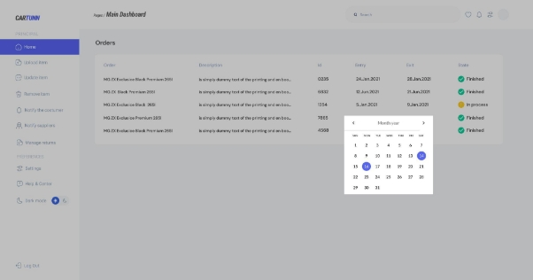

Manejo de reembolsos

Subir nuevo item a la aplicación

![ref18]

Actualizar nuevo item a la aplicación

![ref19]

Eliminar nuevo item a la aplicación

![ref20]

Notificar al cliente

Notificar a los proveedores

1. **Web Applications User Flow Diagrams**

` `**User goal: El usuario se registra, restablece su contraseña o inicia sesión en la aplicación**

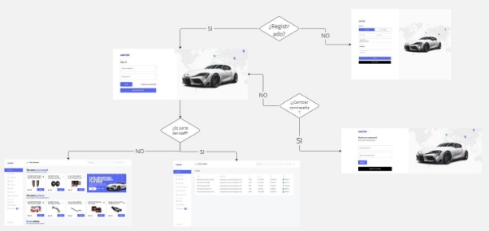

Al iniciar la aplicación, el usuario se encuentra en el formulario de inicio de sesión, donde tiene tres opciones: iniciar sesión con credenciales correctas, registrarse al darle click al apartado de registros o cambiar contraseña. Una vez que el usuario ingresa con sus credenciales correctas en el inicio de sesión, podrá visualizar su dashboard correspondiente si es un cliente o del staff".

**User goal: Presentación del home de la aplicación para clientes:**

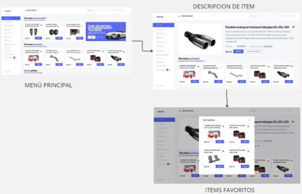

**Descripción:** el cliente entra al menu principal y puede seleccionar un ítem y se le muestra la descripción y detalle de lo elegido y también podrá marcarlo como favorito

**User goal: Status report del vehículo(muestra el estado de tuning en el que se encuentra el vehículo)**

**User goal: Notificaciones que llegarán al usuario**

Descripción: El cliente recibirá una notificación y el reporte del estado de personalización de su vehículo y la fecha de entrega.

**User goal: Pasarela de pagos**

![ref15]

**User goal: Settings del perfil del usuario:**

![ref16]

Descripción: el cliente puede configurar sus datos y contraseña

**User goal: apartado con las preguntas frecuentes:**

![ref17]

**User goal: Aplicación para miembros de staff:**

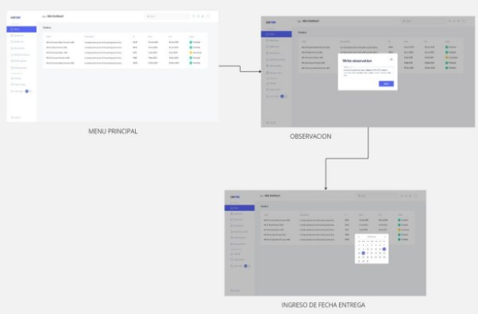

**Descripción:** Como miembro de staff ingresa a la página principal y puede visualizar las órdenes de los clientes y dar sus observaciones y programar una fecha de entrega

User goal: Reembolsos

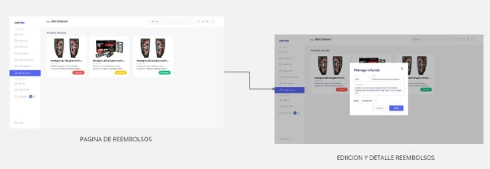

**Descripción**: el miembro del staff accede a la página de reembolsos y selecciona el ítem a reembolsar y escribe el detalle del reembolso y el estado del objeto.

**user goal: subir item a la aplicación**

**user goal: actualizar ítem de la aplicación**

**user goal: remover item de la aplicación**

**user goal: solicitar piezas a proveedores**

![ref18]

![ref19]

![ref20]

**user goal:  notificar** 

**Descripción:** el miembro del staff ingresa desde la página principal a la sección de notificación y notificará al cliente y también al apartado de proveedores.

1. **Web Applications Prototyping**

**Link: [web-applications-prototyping-video.mp4**](https://upcedupe-my.sharepoint.com/:v:/g/personal/u202218475_upc_edu_pe/EYGlhhSe3SRMpcAYXnC-JjMB_sHeALjhl19QUBri7tNWkQ?e=Zolbor&nav=eyJyZWZlcnJhbEluZm8iOnsicmVmZXJyYWxBcHAiOiJTdHJlYW1XZWJBcHAiLCJyZWZlcnJhbFZpZXciOiJTaGFyZURpYWxvZy1MaW5rIiwicmVmZXJyYWxBcHBQbGF0Zm9ybSI6IldlYiIsInJlZmVycmFsTW9kZSI6InZpZXcifX0%3D "https://upcedupe-my.sharepoint.com/:v:/g/personal/u202218475_upc_edu_pe/EYGlhhSe3SRMpcAYXnC-JjMB_sHeALjhl19QUBri7tNWkQ?e=Zolbor&nav=eyJyZWZlcnJhbEluZm8iOnsicmVmZXJyYWxBcHAiOiJTdHJlYW1XZWJBcHAiLCJyZWZlcnJhbFZpZXciOiJTaGFyZURpYWxvZy1MaW5rIiwicmVmZXJyYWxBcHBQbGF0Zm9ybSI6IldlYiIsInJlZmVycmFsTW9kZSI6InZpZXcifX0%3D")**

1. **Domain-Driven Software Architecture.**
   1. **Software Architecture Context Diagram.**

1. **Software Architecture Container Diagrams.**

1. **Software Architecture Components Diagrams.**

**Componentes de Staff context:**

**Componentes de User Profile context:**

**Componentes de Payment context:**

**Componentes de User Order context:**

1. **Software Object-Oriented Design**
   1. **Class Diagrams.**

[**https://lucid.app/lucidchart/55f20bcf-91d1-4928-801a-d53797c9fc39/edit?viewport_loc=-4412%2C-608%2C4258%2C1591%2C0_0&invitationId=inv_a31265b7-905c-470d-885d-17abae1c4fcc]** 

1. **Class Dictionary**

A continuación, se detallan exhaustivamente las clases más relevantes junto con sus atributos y métodos correspondientes en el contexto del sistema de gestión agrícola. Estas clases forman la estructura fundamental del sistema, permitiendo un seguimiento integral de los procesos agrícolas y la gestión de los recursos agrícolas.

|**User**||
| :- | :- |
|La clase User es la clase fundamental que representa a un usuario dentro de la plataforma.||
|**Atributo**|**Descripción**|
|string name|Almacena el nombre del usuario.|
|string last\_name|Almacena el apellido del usuario.|
|int age|Almacena la edad del usuario.|
|char sex|` `Almacena el género del usuario |
|**Método**|**Descripción**|
|Created\_Accountt(): void|Este método registra la creación de la cuenta del usuario en la plataforma.|

|**Account**||
| :- | :- |
|La clase Account amplía los detalles proporcionados por el usuario en la plataforma||
|**Atributo**|**Descripción**|
|string email|Almacena la dirección de correo electrónico asociada a la cuenta del usuario.|
|string password|Almacena la contraseña de la cuenta del usuario.|
|string contacct\_numbet|Almacena el número de contacto o teléfono asociado a la cuenta del usuario.|
|bool active|Indica si la cuenta del usuario está activa o no (true para activa, false para inactiva).|
|**Método**|**Descripción**|
|EditAccount(): void|` `Método para editar los detalles de la cuenta del usuario|
|OpenAccount(): void|Método para abrir la cuenta del usuario.|
|CloseAccount(): void|Método para cerrar la cuenta del usuario.|
|IsActive(): void|Método para verificar si la cuenta del usuario está activa o inactiva.|

|**Subscription**||
| :- | :- |
|La clase Subscription encapsula los detalles esenciales de una suscripción||
|**Atributo**|**Descripción**|
|string start\_date|Representa la fecha y hora en que comenzó la suscripción|
|string end\_date|Representa la fecha y hora en que finaliza la suscripción|
|bool active|Indica si la suscripción está activa o no|
|**Método**|**Descripción**|
|set\_start\_date(): void|Método para establecer la fecha de inicio de la suscripción.|
|set\_end\_date(): void|Método para establecer la fecha de finalización de la suscripción.|
|get\_end\_date(): void|Método para obtener la fecha de finalización de la suscripción.|
|IsActive(): void|Método para verificar si la suscripción está activa o inactiva.|

|**Plan**||
| :- | :- |
|La clase Plan será una clase padre que puede ser extendida para crear suscripciones más específicas, como PlanBásic, PlanPremium y PlanExpert. ||
|**Atributo**|**Descripción**|
|getItem|Este atributo almacena una cadena de texto que describe los beneficios y características de la suscripción.|
|**Método**|**Descripción**|
||Este método devuelve una descripción detallada del plan de suscripción. |

|**CustomerOperation**||
| :- | :- |
|La clase CustomerOperation actúa como una controladora que gestiona las operaciones relacionadas con los clientes||
|**Atributo**|**Descripción**|
|Account account()|Este atributo representa la cuenta del usuario|
|**Método**|**Descripción**|
|createFunction(): void|Este método es responsable de proporcionar una descripción detallada del plan de suscripción|

|**StaffOperations**||
| :- | :- |
|La clase StaffOperation proporciona un entorno seguro y restringido para que el personal del staff pueda realizar tareas administrativas y operativas sin comprometer la seguridad de los datos del sistema. ||
|**Atributo**|**Descripción**|
|
Account account()

createFuntcion()
|Este atributo representa la cuenta del usuario|
|**Método**|**Descripción**|
|
void upload\_item(): void

void remove\_item(): void
|Este método es responsable de proporcionar una descripción detallada del plan de suscripción|

|**ClienteOperations**||
| :- | :- |
|Proporciona una interfaz para que los usuarios realicen operaciones específicas relacionadas con los elementos o artículos en su cuenta.||
|**Atributo**|**Descripción**|
|getItem()|Este atributo representa la cuenta del usuario|
|**Método**|**Descripción**|
|
void upload\_item(): void

void remove\_item(): void
|Este método es responsable de proporcionar una descripción detallada del plan de suscripción|

|**Validations**||
| :- | :- |
|La clase Validations proporciona un conjunto de métodos para verificar y validar datos, condiciones o estados dentro de un sistema||
|**Método**|**Descripción**|
|
bool find\_Problem(): void

|este método realiza una búsqueda de posibles problemas o inconsistencias en los datos o en el estado actual del sistema|

1. **Database Design.** 

   **4.8.1. Database Diagram.**

[**https://lucid.app/lucidchart/55f20bcf-91d1-4928-801a-d53797c9fc39/edit?viewport_loc=-4412%2C-608%2C4258%2C1591%2C0_0&invitationId=inv_a31265b7-905c-470d-885d-17abae1c4fcc]** 

1. **Capítulo V: Product Implementation**
   1. **Software Configuration Management.**
      1. **Software Development Environment Configuration**

         A continuación, describiremos los productos de software que hemos empleado durante el desarrollo del proyecto. 

         **Project Management**

- WhatsApp: <https://web.whatsapp.com/> 

  La plataforma WhatsApp se empleó para realizar las coordinaciones para las reuniones en equipo y para hacer seguimiento de nuestros avances en el proyecto. Esto nos permitió avanzar con anticipación y poder realizar las correcciones correspondientes antes de la entrega.

- Discord: <https://discord.com/> 

  La plataforma de Discord fue utilizada para las reuniones grupales de manera virtual. Esta plataforma fue de utilidad para poder trabajar a tiempo real en equipo. Además, nos ofreció diversas herramientas como compartir pantalla, comunicación a través del micrófono, compartir archivos y documentos.

**Requirements Management**

- Trello: <https://trello.com/> 

  Empleamos Trello para organizar los requisitos de la aplicación. En el que tenemos al product backlog el cual ordenamos según la prioridad aplicando Fibonacci para enumerar las historias de usuario y en otra sección organizándolas según las épicas.

**Product UX/UI Design**

- Figma: <https://www.figma.com/> 

  La plataforma de Figma nos ayudó a desarrollar los wireframes, mockups y prototyping del mobile applications.

- Miro: <https://miro.com/es/> 

  Miro nos fue de utilidad para poder realizar los As-Is Scenario Mapping y  To-Be Scenraio Mapping para cada uno de los segmentos objetivos.

- UXPressia: <https://uxpressia.com/> 

  La plataforma UXPressia se empleó para la creación de los User Personas, Empathy Maps, Journey Maps e Impact Maps. Hemos hecho uso de las plantillas que UXPressia nos ofrece para elaborar cada una de ellas. Nos permitió exportar lo que se realizó para incluirlo en el trabajo.

**Software Development**

- Landing Page

  Para el desarrollo de la landing page se hará empleó de HTML5, CSS y JavaScript.

- Frontend Web Application

  Para desarrollar la aplicación web frontend, es esencial tener una comprensión sólida de los fundamentos de HTML, CSS y JavaScript. En nuestro caso, optamos por utilizar Angular como framework de JavaScript. Además, para facilitar la creación de componentes reutilizables y accesibles, decidimos emplear PrimeNG como biblioteca de componentes UI. Nuestro stack tecnológico incluye el uso del lenguaje Java con el framework Spring Boot, junto con HTML, Angular, JavaScript, CSS y una base de datos MySQL.

**Software Testing**

Para las pruebas funcionales del software, tanto como de la Landing page y de la aplicación web, hemos utilizado las herramientas de desarrollo de los navegadores web siguientes: Google Chrome (<https://www.google.com/chrome/>), Microsoft Edge (<https://www.microsoft.com/en-us/edge>) y Mozilla Firefox (<https://www.mozilla.org/en-US/firefox/browsers/>).

**Software Deployment**

- Netlify: <https://www.netlify.com/> 

  Para implementar el despliegue de la Landing Page, se llevó a cabo la conexión entre el repositorio de Github y Netlify. Esto permite que Netlify maneje automáticamente la implementación de la Landing Page cada vez que se realice una actualización en el repositorio.

**Software Documentation**

- Google Drive: <https://www.google.com/intl/es-419_pe/drive/> 

  Esta plataforma fue empleada para crear documentos mediante Google Docs, el cual nos permite trabajar de manera colaborativa los informes de las entregas.

- Structurizr: <https://structurizr.com/> 

  Herramienta utilizada para la creación de diagramas C4 (diagrama de contexto, diagrama de contenedor y diagrama de componentes). Para elaborar los diagramas fue necesario utilizar una sintaxis parecida a un lenguaje de programación.

- GitHub: <https://github.com/> 

  Plataforma empleada tanto como para la creación de la documentación y de la Landing page. Nuestro eligió esta plataforma debido a que nos permite trabajar de manera colaborativa. 

  1. **Source Code Management**

     La administración y estructuración de las múltiples modificaciones se realizaron mediante la creación de un repositorio en GitHub para el proyecto. Nuestra organización se estructuró de la siguiente manera:

     Organización: <https://github.com/upc-pre-202401-si729-sw51-the-coders> 

     Repositorio de la Landing page: <https://github.com/upc-pre-202401-si729-sw51-the-coders/upc-pre202401-si729-sw51-the-coders-landing-page> 

     Además, con el objetivo de mejorar el control sobre la creación de ramas y la implementación de cambios en el código fuente, se procedió a utilizar Gitflow.

     De esta forma, se establecieron 2 ramas principales: main y develop.

     **Ramas principales:**

     Rama “main”: En esta rama se almacenan las versiones oficiales de nuestro repositorio para pasarlas a producción.

     Rama “develop”: Esta rama se utilizará como punto de integración para las ramas de “feature”. Una vez que el  “head” sea estable y el equipo lo considere listo para el lanzamiento, se fusionará con la rama “release”.

     **Ramas auxiliares:**

     Rama “release”: La rama “release” se emplea para la preparación del lanzamiento de una nueva versión en la rama “main” ayudando a controlar las versiones de código. Aquí se pueden solucionar errores menores y preparar los datos para la versión. Esta rama permitirá liberar a la rama “develop” de estas tareas preparatorias y evita demoras en el desarrollo mientras se prepara para el lanzamiento. 

     Rama “feature”: En las ramas “feature” se desarrollan las características generales que se integrarán en la rama “develop”. Estas características son aquellas funcionalidades solicitadas por los usuarios tanto en la página de inicio como en la aplicación web. Por ejemplo, la rama feature/navbar.

     Rama “hotfix”: Esta rama se utiliza para corregir urgentemente errores en la última versión de la rama “main” que no pueden esperar hasta el próximo lanzamiento para ser solucionados.

1. **Source Code Style Guide & Conventions**

`        `Utilizaremos el lenguaje de etiquetas HTML para el desarrollo principal de nuestra Landing page.

●        Utilizaremos el lenguaje CSS, que nos permitirá realizar los estilos de la estructura de nuestra Landing Page

●        Implementaremos el lenguaje de JavaScript para brindar las funcionalidades a nuestra Landing page. 

●        Utilizaremos el lenguaje Gherkin que se usará para realizar los diseños de prueba de cada historia de usuario, contando con su estructura básica. 

**Convenciones de Commits:**

Nuestro equipo de desarrollo sigue las Convenciones de Commits, adoptando el formato de los “Conventional Commits” en su versión 1.0.0 (disponible en <https://www.conventionalcommits.org/en/v1.0.0/>) para garantizar una fácil comprensión de nuestros registros. Por lo tanto, nos regimos por la siguiente estructura:

**Donde:**

**<type>[scope opcional]: <description>**

- type: Indica el tipo de modificación realizada, limitado a opciones como feat, fix, docs, etc.
- scope: Define el alcance del cambio realizado en nuestro código.
- descripción: Ofrece un resumen conciso de los cambios implementados.

—-

**Convenciones de versionado de lanzamientos**

Para la gestión de versiones, seguimos el estándar “Semantic Versioning 2.0.0”. En este formato las versiones se presentan como (X.Y.Z), con las siguientes interpretaciones: 

- X: Indica una versión principal que incorpora cambios incompatibles con versiones anteriores. Iniciamos en 0 durante la etapa de desarrollo inicial y transicionamos a 1 cuando la versión esté lista para su lanzamiento público. Por convención, Y y Z se reinician a 0 cuando X aumenta.
- Y: Representa una versión secundaria, que abarca cambios compatibles con versiones anteriores. Además, esta incluye los commits provenientes de las “release branches” cada vez que se agregan nuevas funcionalidades. Convencionalmente, Z se reinicia a 0 cuando Y aumenta.
- Z: Refleja parches y correcciones de errores menores, integrando commits realizados en la “rama de corrección” y fusionados con la rama principal.
  1. **Software Deployment Configuration.**

Entrar a Netlify y presionar la opción de “Import an existing project”

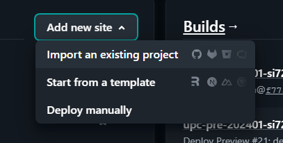

Después seleccionar la opcion de “Deploy con github”

Tras haber hecho eso tenemos que seleccionar nuestra organización y dentro de ella buscar el repositorio del proyecto que deseamos subir a producción

Para finalmente agregar la data necesaria para el despliegue

Y final solo presionar el botón con el nombre de proyecto a desplegar

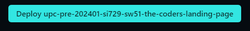

\-       Link de la Landing page:[**https://upc-pre-202401-si729-sw51-cartunn.netlify.app**](https://upc-pre-202401-si729-sw51-cartunn.netlify.app "https://upc-pre-202401-si729-sw51-cartunn.netlify.app")

1. **Product Implementation & Deployment**
   1. **Sprint 1**
      1. **Sprint planning 1**

         En este sprint planning 1 se presenta la evidencia de la planificación e implementación del landing page. Además, se evidenciaron los avances del proyecto e insights de colaboración en el equipo a través de GitHub.

|**Sprint #**|Sprint 1|
| :- | :- |
|**Sprint Planning Background**||
|**Date**|7 de abril de 2024|
|**Time**|12:00 horas (GMT-5)|
|**Location**|Modalidad remota por Discord|
|**Prepared By**|TheCoders|
|**Attendees (to planning meeting)**|Todos los miembros de TheCoders|
|**Sprint n - 0 Review Summary**|Debido a que es el primer sprint, no hay review summary de un sprint anterior|
|**Sprint n - 1 Retrospective Summary**|En este Sprint se planea desarrollar el landing page con HTML y CSS3. Previamente, el landing page se diseñó en Figma. El grupo discutió cómo diseñar el landing, implementación de imágenes y todo lo referente a la interfaz. Al finalizar este sprint, el landing page estará desplegado en Netlify y entonces cualquier usuario podrá acceder al landing a través del link.|

|**Sprint Goal & User Stories**||
| :- | :- |
|**Sprint Velocity 1**|8|
|**Sum of Story Points**|8|

1. **Sprint Backlog 1**

   En esta parte mostramos las tareas que se realizaron en este sprint.

   Link del Trello: <https://trello.com/b/BaYjwdz9/sprint-backlog-1-cartunn> 

   Vista del Sprint Backlog en Trello

<table><tr><th colspan="2" valign="top"><b>Sprint #</b></th><th colspan="6" valign="top"><b>Sprint 1</b></th></tr>
<tr><td colspan="2" valign="top"><b>User Story</b></td><td colspan="6" valign="top"><b>Work-item / Task</b></td></tr>
<tr><td>ID</td><td>Title</td><td>Id</td><td></td><td>Descripción</td><td>Estimación (horas)</td><td>Asignado a:</td><td>Status (pendiente/en proceso/en revisión/hecho)</td></tr>
<tr><td rowspan="2">
E1-US01

E1-US02
</td><td rowspan="2">
Barra de navegación en la landing page

Dirigirse a la aplicación mediante el landing page
</td><td>T1</td><td>Navbar section</td><td valign="top">
Implementar navbar

con botón (redirige a la aplicación) y responsive design, 
</td><td>1h</td><td>David Soto</td><td>Done</td></tr>
<tr><td>T2</td><td>Navbar section responsive</td><td valign="top">Aplicar diseño responsive a las opciones del navbar</td><td>1h</td><td>David Soto</td><td>Done</td></tr>
<tr><td rowspan="2">E1-US03</td><td rowspan="2">Sección hero del landing page</td><td>T3</td><td>hero section</td><td valign="top">Implementar un hero secion</td><td>1h</td><td>Abraham Ayquipa</td><td>Done</td></tr>
<tr><td>T4</td><td>
responsive

design

hero

section
</td><td valign="top">aplicar design responsive al hero section</td><td>x</td><td>Abraham Ayquipa</td><td>Done</td></tr>
<tr><td rowspan="2">E1-US04</td><td rowspan="2">Sección “Product” del landing page</td><td>T5</td><td>
Product section

and items
</td><td valign="top">Implementar Product section y los ítems característicos en orden grid</td><td>1h</td><td>Franky Mallma</td><td>Done</td></tr>
<tr><td>T6</td><td>
reponsive

dessign

Product section

</td><td valign="top">Implementar design responsive a Product section</td><td>1h</td><td>Franky Mallma</td><td>Done</td></tr>
<tr><td rowspan="2">E1-US05</td><td rowspan="2">Sección “Costumers” del landing page</td><td>T7</td><td>
Costumers section

and items
</td><td valign="top">Implementar Costumers section y los ítems característicos en orden grid y aplicar animaciones</td><td>1\.5h</td><td>David Soto</td><td>Done</td></tr>
<tr><td>T8</td><td>
reponsive

dessign

Costumers section

</td><td valign="top">Implementar diseño responsive a Costumers section</td><td>1h</td><td>David Soto</td><td>Done</td></tr>
<tr><td rowspan="2">E1-US06</td><td rowspan="2">Sección “Princing” del landing page</td><td>T9</td><td>Princing section</td><td valign="top">Implementar Princing section y los ítems característicos en orden grid </td><td>1h</td><td>Belen Ramos</td><td>Done</td></tr>
<tr><td>T10</td><td>
reponsive

dessign

Princing section

</td><td valign="top">Implementar diseño responsive a Princing section</td><td>1h</td><td>Belen Ramos</td><td>Done</td></tr>
<tr><td rowspan="2">E1-US07</td><td rowspan="2">Sección “contact”del landing page</td><td>T11</td><td>Contact section</td><td valign="top">Implementar Contact section y los ítems característicos en orden grid </td><td>1h</td><td>Mariana Chambi</td><td>Done</td></tr>
<tr><td>T12</td><td>
reponsive

dessign

Contact section

</td><td valign="top">Implementar diseño responsive a Contact section</td><td>1h</td><td>Mariana Chambi</td><td>Done</td></tr>
<tr><td rowspan="3">E1-US08</td><td rowspan="3">Sección del footer del landing page</td><td>T13</td><td>footer section</td><td valign="top">Implementar footer section</td><td>1h</td><td>Abraham Ayquipa</td><td>Done</td></tr>
<tr><td>T14</td><td>Social media section</td><td valign="top">implementar icons para las redes sociales y tambien links</td><td>0\.5h</td><td>Abraham Ayquipa</td><td>Done</td></tr>
<tr><td>T15</td><td>
Reponsive

dessign

footer section

</td><td valign="top">Aplicar diseño responsive</td><td>1h</td><td>Abraham Ayquipa</td><td>Done</td></tr>
</table>

1. **Development Evidence for Sprint Review**

<table><tr><th valign="top"><b>Repository</b></th><th valign="top"><b>Branch</b></th><th valign="top"><b>Commit Id</b></th><th valign="top"><b>Commit Message</b></th><th valign="top"><b>Commit Message Body</b></th><th valign="top"><b>Committed on (Date)</b></th></tr>
<tr><td rowspan="17" valign="top">
[<b>upc-pre202401-si729-sw51-the-coders-landing-page</b>](https://github.com/upc-pre-202401-si729-sw51-the-coders/upc-pre202401-si729-sw51-the-coders-landing-page)

</td><td rowspan="17" valign="top"><b>main</b></td><td valign="top"><b>53c0c9e0717da4c5a070fd8379b9c640ca3134e7</b></td><td valign="top">[<b>Merge pull request] <b>[#3](https://github.com/upc-pre-202401-si729-sw51-the-coders/upc-pre-202401-si729-sw51-the-coders-landing-page/pull/3 "https://github.com/upc-pre-202401-si729-sw51-the-coders/upc-pre-202401-si729-sw51-the-coders-landing-page/pull/3") [from upc-pre-202401-si729-sw51-the-coders/develop</b>][<b>Merge pull request]</b></td><td valign="top"><b>-</b></td><td valign="top">
<h3><b>Apr 11, 2024</b></h3>

</td></tr>
<tr><td valign="top"><b>6ba407ecc0bfc5d9a274fbe073f28df2192fdd69</b></td><td valign="top">[<b>feat: add the footer</b>](https://github.com/upc-pre-202401-si729-sw51-the-coders/upc-pre-202401-si729-sw51-the-coders-landing-page/commit/6ba407ecc0bfc5d9a274fbe073f28df2192fdd69 "https://github.com/upc-pre-202401-si729-sw51-the-coders/upc-pre-202401-si729-sw51-the-coders-landing-page/commit/6ba407ecc0bfc5d9a274fbe073f28df2192fdd69")</td><td valign="top"><b>-</b></td><td valign="top"><h3><b>Apr 11, 2024</b></h3></td></tr>
<tr><td valign="top">
<b>236a53a872fe7561ce46082c0ddcfda1a5f77a61</b>

<h4></h4>

</td><td valign="top">[<b>Merge pull request] <b>[#2](https://github.com/upc-pre-202401-si729-sw51-the-coders/upc-pre-202401-si729-sw51-the-coders-landing-page/pull/2 "https://github.com/upc-pre-202401-si729-sw51-the-coders/upc-pre-202401-si729-sw51-the-coders-landing-page/pull/2") [from upc-pre-202401-si729-sw51-the-coders/feature/contact-section</b>][<b>Merge pull request]</b></td><td valign="top"><b>-</b></td><td valign="top"><h3><b>Apr 11, 2024</b></h3></td></tr>
<tr><td valign="top"><b>581556d90f615484076fa5f6231af17bbb5460e3</b></td><td valign="top">[<b>feat: add the contact styles</b>](https://github.com/upc-pre-202401-si729-sw51-the-coders/upc-pre-202401-si729-sw51-the-coders-landing-page/commit/581556d90f615484076fa5f6231af17bbb5460e3 "https://github.com/upc-pre-202401-si729-sw51-the-coders/upc-pre-202401-si729-sw51-the-coders-landing-page/commit/581556d90f615484076fa5f6231af17bbb5460e3")</td><td valign="top"><b>-</b></td><td valign="top"><h3><b>Apr 11, 2024</b></h3></td></tr>
<tr><td valign="top"><b>91590cb7349d480e1e356b48a30a920cde6ba50f</b></td><td valign="top">[<b>feat: add the contact section</b>](https://github.com/upc-pre-202401-si729-sw51-the-coders/upc-pre-202401-si729-sw51-the-coders-landing-page/commit/91590cb7349d480e1e356b48a30a920cde6ba50f "https://github.com/upc-pre-202401-si729-sw51-the-coders/upc-pre-202401-si729-sw51-the-coders-landing-page/commit/91590cb7349d480e1e356b48a30a920cde6ba50f")</td><td valign="top"><b>-</b></td><td valign="top"><h3><b>Apr 11, 2024</b></h3></td></tr>
<tr><td valign="top"><b>f9990aa0fa2b381d93152ea59c26431cbbee9a04</b></td><td valign="top">[<b>Merge pull request] <b>[#1](https://github.com/upc-pre-202401-si729-sw51-the-coders/upc-pre-202401-si729-sw51-the-coders-landing-page/pull/1 "https://github.com/upc-pre-202401-si729-sw51-the-coders/upc-pre-202401-si729-sw51-the-coders-landing-page/pull/1") [from upc-pre-202401-si729-sw51-the-coders/feature/pricing-section</b>][<b>Merge pull request]</b></td><td valign="top"><b>-</b></td><td valign="top"><h3><b>Apr 11, 2024</b></h3></td></tr>
<tr><td valign="top"><b>60681f8ce06921a1bfb606f2956c3ab7d28418a1</b></td><td valign="top">[<b>feat: add the pricing styles</b>](https://github.com/upc-pre-202401-si729-sw51-the-coders/upc-pre-202401-si729-sw51-the-coders-landing-page/commit/60681f8ce06921a1bfb606f2956c3ab7d28418a1 "https://github.com/upc-pre-202401-si729-sw51-the-coders/upc-pre-202401-si729-sw51-the-coders-landing-page/commit/60681f8ce06921a1bfb606f2956c3ab7d28418a1")</td><td valign="top"><b>-</b></td><td valign="top"><h3><b>Apr 11, 2024</b></h3></td></tr>
<tr><td valign="top"><b>c1ca89a363f2b17d72d8d1613f67910df058251a</b></td><td valign="top">[<b>feat: add the pricing section</b>](https://github.com/upc-pre-202401-si729-sw51-the-coders/upc-pre-202401-si729-sw51-the-coders-landing-page/commit/c1ca89a363f2b17d72d8d1613f67910df058251a "https://github.com/upc-pre-202401-si729-sw51-the-coders/upc-pre-202401-si729-sw51-the-coders-landing-page/commit/c1ca89a363f2b17d72d8d1613f67910df058251a")</td><td valign="top"><b>-</b></td><td valign="top"><h3><b>Apr 11, 2024</b></h3></td></tr>
<tr><td valign="top"><b>48edcefbe42adf44f4966d61c9469fd5e0476e26</b></td><td valign="top">[<b>feat: add the costumers section</b>](https://github.com/upc-pre-202401-si729-sw51-the-coders/upc-pre-202401-si729-sw51-the-coders-landing-page/commit/48edcefbe42adf44f4966d61c9469fd5e0476e26 "https://github.com/upc-pre-202401-si729-sw51-the-coders/upc-pre-202401-si729-sw51-the-coders-landing-page/commit/48edcefbe42adf44f4966d61c9469fd5e0476e26")</td><td valign="top"><b>-</b></td><td valign="top"><h3><b>Apr 11, 2024</b></h3></td></tr>
<tr><td valign="top"><b>1dc460bd1c12d6693a9122065210e5b5d9af45ec</b></td><td valign="top">[<b>feat: add the costumer section</b>](https://github.com/upc-pre-202401-si729-sw51-the-coders/upc-pre-202401-si729-sw51-the-coders-landing-page/commit/1dc460bd1c12d6693a9122065210e5b5d9af45ec "https://github.com/upc-pre-202401-si729-sw51-the-coders/upc-pre-202401-si729-sw51-the-coders-landing-page/commit/1dc460bd1c12d6693a9122065210e5b5d9af45ec")</td><td valign="top"><b>-</b></td><td valign="top"><h3><b>Apr 11, 2024</b></h3></td></tr>
<tr><td valign="top"><b>27441fc50d9dc51d47658d5886ee5ae3326847b9</b></td><td valign="top">[<b>feat: add the product section</b>](https://github.com/upc-pre-202401-si729-sw51-the-coders/upc-pre-202401-si729-sw51-the-coders-landing-page/commit/27441fc50d9dc51d47658d5886ee5ae3326847b9 "https://github.com/upc-pre-202401-si729-sw51-the-coders/upc-pre-202401-si729-sw51-the-coders-landing-page/commit/27441fc50d9dc51d47658d5886ee5ae3326847b9")</td><td valign="top"><b>-</b></td><td valign="top"><h3><b>Apr 11, 2024</b></h3></td></tr>
<tr><td valign="top"><b>5bd87558ecb5d241fb2bf1afc434171ce36e32b6</b></td><td valign="top">[<b>feat: add the product styles</b>](https://github.com/upc-pre-202401-si729-sw51-the-coders/upc-pre-202401-si729-sw51-the-coders-landing-page/commit/5bd87558ecb5d241fb2bf1afc434171ce36e32b6 "https://github.com/upc-pre-202401-si729-sw51-the-coders/upc-pre-202401-si729-sw51-the-coders-landing-page/commit/5bd87558ecb5d241fb2bf1afc434171ce36e32b6")</td><td valign="top"><b>-</b></td><td valign="top"><h3><b>Apr 11, 2024</b></h3></td></tr>
<tr><td valign="top"><b>0af349eb7982ae9510b99b869e079c2a983fe54c</b></td><td valign="top">[<b>feat: add the product section</b>](https://github.com/upc-pre-202401-si729-sw51-the-coders/upc-pre-202401-si729-sw51-the-coders-landing-page/commit/0af349eb7982ae9510b99b869e079c2a983fe54c "https://github.com/upc-pre-202401-si729-sw51-the-coders/upc-pre-202401-si729-sw51-the-coders-landing-page/commit/0af349eb7982ae9510b99b869e079c2a983fe54c")</td><td valign="top"><b>-</b></td><td valign="top"><h3><b>Apr 11, 2024</b></h3></td></tr>
<tr><td valign="top"><b>f574d140d5d2c710a5a76310413f74c0822d1d95</b></td><td valign="top">[<b>feat: add the navbar</b>](https://github.com/upc-pre-202401-si729-sw51-the-coders/upc-pre-202401-si729-sw51-the-coders-landing-page/commit/f574d140d5d2c710a5a76310413f74c0822d1d95 "https://github.com/upc-pre-202401-si729-sw51-the-coders/upc-pre-202401-si729-sw51-the-coders-landing-page/commit/f574d140d5d2c710a5a76310413f74c0822d1d95")</td><td valign="top"><b>-</b></td><td valign="top"><h3><b>Apr 11, 2024</b></h3></td></tr>
<tr><td valign="top"><b>cde689db4cde22597915df332f86e82e37ba582e</b></td><td valign="top">[<b>feat: add the hero section</b>](https://github.com/upc-pre-202401-si729-sw51-the-coders/upc-pre-202401-si729-sw51-the-coders-landing-page/commit/cde689db4cde22597915df332f86e82e37ba582e "https://github.com/upc-pre-202401-si729-sw51-the-coders/upc-pre-202401-si729-sw51-the-coders-landing-page/commit/cde689db4cde22597915df332f86e82e37ba582e")</td><td valign="top"><b>-</b></td><td valign="top"><h3><b>Apr 11, 2024</b></h3></td></tr>
<tr><td valign="top"><b>5d392ca46cbae26c6c1af0c7f0b3ee3b7d6733cf</b></td><td valign="top">[<b>feat: add the navbar</b>](https://github.com/upc-pre-202401-si729-sw51-the-coders/upc-pre-202401-si729-sw51-the-coders-landing-page/commit/5d392ca46cbae26c6c1af0c7f0b3ee3b7d6733cf "https://github.com/upc-pre-202401-si729-sw51-the-coders/upc-pre-202401-si729-sw51-the-coders-landing-page/commit/5d392ca46cbae26c6c1af0c7f0b3ee3b7d6733cf")</td><td valign="top"><b>-</b></td><td valign="top"><h3><b>Apr 11, 2024</b></h3></td></tr>
<tr><td valign="top"><b>7107cede24f274f3c0de6ea437d92eb5c47a5c04</b></td><td valign="top">[<b>chore: initial commit</b>](https://github.com/upc-pre-202401-si729-sw51-the-coders/upc-pre-202401-si729-sw51-the-coders-landing-page/commit/7107cede24f274f3c0de6ea437d92eb5c47a5c04 "https://github.com/upc-pre-202401-si729-sw51-the-coders/upc-pre-202401-si729-sw51-the-coders-landing-page/commit/7107cede24f274f3c0de6ea437d92eb5c47a5c04")</td><td valign="top"><b>-</b></td><td valign="top"><h3><b>Apr 11, 2024</b></h3></td></tr>
</table>

1. **Testing Suite Evidence for Sprint Review**

<table><tr><th valign="top"><b>Repository</b></th><th valign="top"><b>Branch</b></th><th valign="top"><b>Commit Id</b></th><th valign="top"><b>Commit Message</b></th><th valign="top"><b>Commit Message Body</b></th><th valign="top"><b>Commited on (Date)</b></th></tr>
<tr><td rowspan="5" valign="top">
[<b>upc-pre202401-si729-sw51-the-coders-acceptance-tests</b>](https://github.com/upc-pre-202401-si729-sw51-the-coders/upc-pre202401-si729-sw51-the-coders-acceptance-tests)

</td><td rowspan="5" valign="top"><b>main</b></td><td valign="top"><b>a571cd6c5c30a97bdf55086df2256f8e543ce0bd</b></td><td valign="top">[<b>chore: add AT01.feature file</b>]</td><td valign="top"><b>-</b></td><td valign="top">
<h3><b>Apr 11, 2024</b></h3>

</td></tr>
<tr><td valign="top"><b>b38f24bb4f70ae31ffdfc21e47149af91c033fd8</b></td><td valign="top">[<b>chore: add AT02.feature file</b>][<b>chore: add AT01.feature file</b>]</td><td valign="top"><b>-</b></td><td valign="top"><h3><b>Apr 11, 2024</b></h3></td></tr>
<tr><td valign="top"><b>2822407798d69e79059a55296cdd82b14257381e</b></td><td valign="top">[<b>chore: add AT03.feature file</b>][<b>chore: add AT01.feature file</b>]</td><td valign="top"><b>-</b></td><td valign="top"><h3><b>Apr 11, 2024</b></h3></td></tr>
<tr><td valign="top"><b>e62e30e01e229f7dfda1939f96278bf7d1a6ec16</b></td><td valign="top">[<b>chore: add AT04..feature file</b>][<b>chore: add AT01.feature file</b>]</td><td valign="top"><b>-</b></td><td valign="top"><h3><b>Apr 11, 2024</b></h3></td></tr>
<tr><td valign="top"><b>26897e7664a9f74ac2109178c74c8835f4081031</b></td><td valign="top">[<b>chore: add AT5..feature file</b>][<b>chore: add AT01.feature file</b>]</td><td valign="top"><b>-</b></td><td valign="top"><h3><b>Apr 11, 2024</b></h3></td></tr>
</table>

1. **Execution Evidence for Sprint Review**

Esta sección inicia con un resumen que explique lo alcanzado en este Sprint y presenta screenshots de las principales vistas implementadas, junto con un enlace a un video que ilustre y explique la visualización y navegación logrado en este Sprint.

1. **Services Documentation Evidence for Sprint Review**

En el alcance del sprint 1 se logró desarrollar la landing page, por lo que no se evidencia el empleo de web services.

1. **Software Deployment Evidence for Sprint Review**

Para el primer sprint hicimos la landing page. Para su respectivo despliegue utilizamos:

- Git: Sistema de control de versiones para trabajar de forma colaborativa entre los integrantes de nuestro grupo.
- Gitflow: flujo de las ramas de nuestro repositorio en github.
- Conventional commits: estándar textual de los commits.
- Github: plataforma en el que almacenamos todos los repositorios de nuestro proyecto.
- Netlify: plataforma en la que se aloja la landing page.

1. **Team Collaboration Insights during Sprint**

Durante este sprint para proteger la rama “main” creamos una rama “develop” de la que cada integrante de nuestro grupo creó su propia sub-rama “feature“ para subir un capítulo del reporte siguiendo las convenciones antes señaladas(conventional commit y git flow).

**Conclusiones**

Hasta la fecha,  "CarTunn" ha avanzado significativamente en las fases de conceptualización, diseño y planificación. Nosotros como  equipo hemos logrado establecer una base sólida a través de un extenso trabajo de investigación y análisis que ha incluido la identificación de necesidades específicas de los usuarios. Se ha definido con claridad los perfiles de los usuarios y se ha elaborado una propuesta de diseño UX/UI que promete mejorar  la experiencia de personalización de vehículos.

Aunque solo  hemos implementado la landing page con todo lo aprendido hasta el momento, la preparación en las etapas previas asegura que el equipo está bien equipado para abordar la implementación con un entendimiento profundo del problema y una solución bien definida. La aplicación no solo pretende satisfacer las necesidades identificadas, sino también superar las expectativas del usuario a través de una interfaz intuitiva y una experiencia de usuario optimizada.

El progreso hasta ahora muestra un compromiso firme con la excelencia técnica y la innovación, estableciendo un  futuro satisfactorio del proyecto. Estamos en una posición favorable para iniciar la próxima fase de desarrollo, anticipando desafíos pero confiados en nuestra preparación y estrategia.

**Anexos**

Link de Microsoft Steam : 

Landing Page Wireframe y Mock-up:  

<https://www.figma.com/file/3puKCQI9HpY36ICGlYihgc/CarTunn-vFinal?type=design&node-id=224%3A2416&mode=design&t=wOoV1LZs3RIcch1q-1> 

<https://www.figma.com/file/Ra8FhHb46JMhkNThyLmwbU/Mobile-wireframe?type=design&node-id=0%3A1&mode=design&t=4IPCw13uV4ZLjkE0-1> 

<https://www.figma.com/file/mTtYszxtJt7r9ctlNzccEK/Wireframe-Landingpage?type=design&node-id=0%3A1&mode=design&t=SDb42Y1oTtVkd5Go-1> 

Web Applications Wireframes y Mock-up: [**https://www.figma.com/file/Ra8FhHb46JMhkNThyLmwbU/Mobile-wireframe?type=design&node-id=10%3A2763&mode=design&t=uEXRlWCPVG53IytA-1]**  

User personas

segmento 1: <https://uxpressia.com/w/DeRZM/p/7vFyy> 

segmento 2: <https://uxpressia.com/w/DeRZM/p/h3zhF> 

As-Is scenario mapping y To-be scenario mapping: <https://miro.com/welcomeonboard/NDFUcUtZQU9SWkZ4SDhKUnNoR0RFVjhWTWZnTFNGd245YVBzZU1UQkxsR3E2WjFaMURtZXY3QjRDeG1DYW53cXwzNDU4NzY0NTUxNzYxNjYxMjg2fDI=?share_link_id=418419123921> 

<https://miro.com/welcomeonboard/NDFUcUtZQU9SWkZ4SDhKUnNoR0RFVjhWTWZnTFNGd245YVBzZU1UQkxsR3E2WjFaMURtZXY3QjRDeG1DYW53cXwzNDU4NzY0NTUxNzYxNjYxMjg2fDI=?share_link_id=418419123921> 

to be 

<https://miro.com/welcomeonboard/NDFUcUtZQU9SWkZ4SDhKUnNoR0RFVjhWTWZnTFNGd245YVBzZU1UQkxsR3E2WjFaMURtZXY3QjRDeG1DYW53cXwzNDU4NzY0NTUxNzYxNjYxMjg2fDI=?share_link_id=418419123921> 

<https://miro.com/welcomeonboard/NDFUcUtZQU9SWkZ4SDhKUnNoR0RFVjhWTWZnTFNGd245YVBzZU1UQkxsR3E2WjFaMURtZXY3QjRDeG1DYW53cXwzNDU4NzY0NTUxNzYxNjYxMjg2fDI=?share_link_id=418419123921> 

Repositorio Github: <https://github.com/upc-pre-202401-si729-sw51-the-coders/upc-pre202401-si729-sw51-the-coders-acceptance-tests> 

**Bibliografía**

- *Peru, N. (2023, junio 24). Aumentan las estafas cibernéticas de repuestos y accesorios de autos. Peru21. <https://peru21.pe/lima/estafas-sector-automotriz-ventas-electronicas-renusa-aumentan-las-estafas-ciberneticas-de-repuestos-y-accesorios-de-autos-noticia/>* 