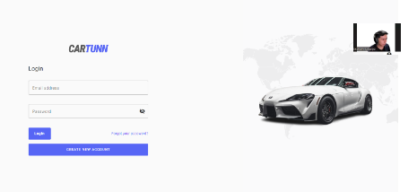

**5.	Capítulo V: Product Implementation**

**5.1.	Software Configuration Management.**

**5.1.1.	Software Development Environment Configuration**

A continuación, describiremos los productos de software que hemos empleado durante el desarrollo del proyecto. 

**Project Management**

- Trello: <https://trello.com/>

  La plataforma de Trello se empleó para la gestión de las tareas y la organización del flujo del trabajo en el proyecto. Presentándose las tareas dentro de las tarjetas en listas con el integrante encargado de realizarla. Además, utilizamos las funcionalidades como agregar las etiquetas de colores y marcar el proceso de las tareas. De esta manera pudimos hacer seguimiento a nuestros avances en el proyecto.

- Notion: <https://www.notion.so/>  

  La plataforma de Notion fue utilizada para la colaboración de los integrantes con el proyecto. Se crearon calendarios y listas con las fechas de las reuniones del equipo. Además, se hizo uso de herramientas como comentarios y menciones para fomentar el trabajo y colaboración en equipo.

**Requirements Management**

- Trello: <https://trello.com/> 

  Empleamos Trello para organizar los requisitos de la aplicación. En el que tenemos al product backlog el cual ordenamos según la prioridad aplicando Fibonacci para enumerar las historias de usuario y en otra sección organizándolas según las épicas.

**Product UX/UI Design**

- Figma: <https://www.figma.com/> 

  La plataforma de Figma nos ayudó a desarrollar los wireframes, mockups y prototyping del mobile applications.

- Miro: <https://miro.com/es/> 

  Miro nos fue de utilidad para poder realizar los As-Is Scenario Mapping y  To-Be Scenraio Mapping para cada uno de los segmentos objetivos.

- UXPressia: <https://uxpressia.com/> 

  La plataforma UXPressia se empleó para la creación de los User Personas, Empathy Maps, Journey Maps e Impact Maps. Hemos hecho uso de las plantillas que UXPressia nos ofrece para elaborar cada una de ellas. Nos permitió exportar lo que se realizó para incluirlo en el trabajo.

**Software Development**

- Landing Page

  Para el desarrollo de la landing page se hará empleó de HTML5, CSS y JavaScript.

- Frontend Web Application

  Para desarrollar la aplicación web frontend, es esencial tener una comprensión sólida de los fundamentos de HTML, CSS y JavaScript. En nuestro caso, optamos por utilizar Angular como framework de JavaScript. Además, para facilitar la creación de componentes reutilizables y accesibles, decidimos emplear PrimeNG como biblioteca de componentes UI. Nuestro stack tecnológico incluye el uso del lenguaje Java con el framework Spring Boot, junto con HTML, Angular, JavaScript, CSS y una base de datos MySQL.

**Software Testing**

Para las pruebas funcionales del software, tanto como de la Landing page y de la aplicación web, hemos utilizado las herramientas de desarrollo de los navegadores web siguientes: Google Chrome (<https://www.google.com/chrome/>), Microsoft Edge (<https://www.microsoft.com/en-us/edge>) y Mozilla Firefox (<https://www.mozilla.org/en-US/firefox/browsers/>).

**Software Deployment**

- Netlify: <https://www.netlify.com/> 

  Para implementar el despliegue de la Landing Page, se llevó a cabo la conexión entre el repositorio de Github y Netlify. Esto permite que Netlify maneje automáticamente la implementación de la Landing Page cada vez que se realice una actualización en el repositorio.

**Software Documentation**

- Google Drive: <https://www.google.com/intl/es-419_pe/drive/> 

  Esta plataforma fue empleada para crear documentos mediante Google Docs, el cual nos permite trabajar de manera colaborativa los informes de las entregas.

- Structurizr: <https://structurizr.com/> 

  Herramienta utilizada para la creación de diagramas C4 (diagrama de contexto, diagrama de contenedor y diagrama de componentes). Para elaborar los diagramas fue necesario utilizar una sintaxis parecida a un lenguaje de programación.

- GitHub: <https://github.com/> 

  Plataforma empleada tanto como para la creación de la documentación y de la Landing page. Nuestro eligió esta plataforma debido a que nos permite trabajar de manera colaborativa. 

**5.1.2.	Source Code Management**

La administración y estructuración de las múltiples modificaciones se realizaron mediante la creación de un repositorio en GitHub para el proyecto. Nuestra organización se estructuró de la siguiente manera:

Organización: <https://github.com/upc-pre-202401-si729-sw51-the-coders> 

Repositorio de la Landing page: <https://github.com/upc-pre-202401-si729-sw51-the-coders/upc-pre-202401-si729-sw51-the-coders-landing-page> 

Además, con el objetivo de mejorar el control sobre la creación de ramas y la implementación de cambios en el código fuente, se procedió a utilizar Gitflow.

De esta forma, se establecieron 2 ramas principales: main y develop.

**Ramas principales:**

Rama “main”: En esta rama se almacenan las versiones oficiales de nuestro repositorio para pasarlas a producción.

Rama “develop”: Esta rama se utilizará como punto de integración para las ramas de “feature”. Una vez que el  “head” sea estable y el equipo lo considere listo para el lanzamiento, se fusionará con la rama “release”.

**Ramas auxiliares:**

Rama “release”: La rama “release” se emplea para la preparación del lanzamiento de una nueva versión en la rama “main” ayudando a controlar las versiones de código. Aquí se pueden solucionar errores menores y preparar los datos para la versión. Esta rama permitirá liberar a la rama “develop” de estas tareas preparatorias y evita demoras en el desarrollo mientras se prepara para el lanzamiento. 

Rama “feature”: En las ramas “feature” se desarrollan las características generales que se integrarán en la rama “develop”. Estas características son aquellas funcionalidades solicitadas por los usuarios tanto en la página de inicio como en la aplicación web. Por ejemplo, la rama feature/navbar.

Rama “hotfix”: Esta rama se utiliza para corregir urgentemente errores en la última versión de la rama “main” que no pueden esperar hasta el próximo lanzamiento para ser solucionados.

**5.1.3.	Source Code Style Guide & Conventions**

`        `Utilizaremos el lenguaje de etiquetas HTML para el desarrollo principal de nuestra Landing page.

●        Utilizaremos el lenguaje CSS, que nos permitirá realizar los estilos de la estructura de nuestra Landing Page

●        Implementaremos el lenguaje de JavaScript para brindar las funcionalidades a nuestra Landing page. 

●        Utilizaremos el lenguaje Gherkin que se usará para realizar los diseños de prueba de cada historia de usuario, contando con su estructura básica. 

**Convenciones de Commits:**

Nuestro equipo de desarrollo sigue las Convenciones de Commits, adoptando el formato de los “Conventional Commits” en su versión 1.0.0 (disponible en <https://www.conventionalcommits.org/en/v1.0.0/>) para garantizar una fácil comprensión de nuestros registros. Por lo tanto, nos regimos por la siguiente estructura:

**Donde:**

**<type>[scope opcional]: <description>**

- type: Indica el tipo de modificación realizada, limitado a opciones como feat, fix, docs, etc.
- scope: Define el alcance del cambio realizado en nuestro código.
- descripción: Ofrece un resumen conciso de los cambios implementados.

**Convenciones de versionado de lanzamientos**

Para la gestión de versiones, seguimos el estándar “Semantic Versioning 2.0.0”. En este formato las versiones se presentan como (X.Y.Z), con las siguientes interpretaciones: 

- X: Indica una versión principal que incorpora cambios incompatibles con versiones anteriores. Iniciamos en 0 durante la etapa de desarrollo inicial y transicionamos a 1 cuando la versión esté lista para su lanzamiento público. Por convención, Y y Z se reinician a 0 cuando X aumenta.
- Y: Representa una versión secundaria, que abarca cambios compatibles con versiones anteriores. Además, esta incluye los commits provenientes de las “release branches” cada vez que se agregan nuevas funcionalidades. Convencionalmente, Z se reinicia a 0 cuando Y aumenta.
- Z: Refleja parches y correcciones de errores menores, integrando commits realizados en la “rama de corrección” y fusionados con la rama principal.

**5.1.4.	Software Deployment Configuration.**

Entrar a Netlify y presionar la opción de “Import an existing project”

![ref1]

Después seleccionar la opcion de “Deploy con github”

![ref2]

Tras haber hecho eso tenemos que seleccionar nuestra organización y dentro de ella buscar el repositorio del proyecto que deseamos subir a producción

Para finalmente agregar la data necesaria para el despliegue

![ref3]

Y final solo presionar el botón con el nombre de proyecto a desplegar

\-       Link de la Landing page:[**https://upc-pre-202401-si729-sw51-cartunn.netlify.app**](https://upc-pre-202401-si729-sw51-cartunn.netlify.app)

**5.2.	Product Implementation & Deployment**

**5.2.1.	Sprint 1**

En esta sección se registra y explica el avance en términos de producto y trabajo colaborativo para el Sprint 1, enfocado en el desarrollo de la landing page. Se detalla el progreso tangible y funcional de la landing page, incluyendo su diseño, desarrollo y funcionalidades implementadas, así como la colaboración del equipo, los métodos de comunicación utilizados y las herramientas empleadas para garantizar una cooperación efectiva. Incluye secciones sobre la planificación del sprint, el backlog de tareas, evidencia del desarrollo y ejecución, documentación de servicios utilizados y reflexiones sobre la colaboración del equipo, proporcionando una visión completa del progreso alcanzado.

**5.2.2.1.	Sprint planning 1**

En este sprint planning 1 se presenta la evidencia de la planificación e implementación de la landing page. Además, se evidenciaron los avances del proyecto e insights de colaboración en el equipo a través de GitHub.

|**Sprint #**|Sprint 1|
| :- | :- |
|**Sprint Planning Background**||
|**Date**|7 de abril de 2024|
|**Time**|12:00 horas (GMT-5)|
|**Location**|Modalidad remota|
|**Prepared By**|TheCoders|
|**Attendees (to planning meeting)**|Todos los miembros de TheCoders|
|**Sprint 0 Review Summary**|Debido a que es el primer sprint, no hay review summary de un sprint anterior|
|**Sprint 1 Retrospective Summary**|En este Sprint se planea desarrollar el landing page con HTML y CSS3. Previamente, el landing page se diseñó en Figma. El grupo discutió cómo diseñar el landing, implementación de imágenes y todo lo referente a la interfaz. Al finalizar este sprint, el landing page estará desplegado en Netlify y entonces cualquier usuario podrá acceder al landing a través del link.|
|**Sprint Goal & User Stories**||
|**Sprint Goal 1**|El goal de este sprint se basa únicamente en el desarrollo y despliegue de la aplicación frontend.|
|**Sprint Velocity 1**|8|
|**Sum of Story Points**|36|

**5.2.1.2.	Sprint Backlog 1**

En esta parte mostramos las tareas que se realizaron en este sprint.

Link del Trello: <https://trello.com/b/BaYjwdz9/sprint-backlog-1-cartunn> 

Vista del Sprint Backlog en Trello

|**Sprint #**|**Sprint 1**|||||||
| :- | :- | :- | :- | :- | :- | :- | :- |
|**User Story**|**Work-item / Task**|||||||
|ID|Title|Id|Title|Description|Estimation(hours)|Assigned To|Status (To-do/in-Process/To-Review/Done)|
|E1-US01|Barra de navegación en la landing page|T1|Navbar section|
Implementar navbar

con botón (redirige a la aplicación) y responsive design, 
|1h|David Soto|Done|
|E1-US02|Dirigirse a la aplicación mediante el landing page|T2|Button Call to Action|

Implementar el button Call to Action del navbar
|0\.1h|David Soto|Done|
|E1-US03|Sección hero del landing page|T3|Navbar section responsive|Aplicar diseño responsive a las opciones del navbar|1h|David Soto|Done|
|E1-US03|Sección hero del landing page|T4|hero section|Implementar un hero seccion|1h|Abraham Ayquipa|Done|
|E1-US03|Sección hero del landing page|T5|
responsive

design

hero

section
|aplicar design responsive al hero section|x|Abraham Ayquipa|Done|
|E1-US03|Sección hero del landing page|T6|
Product section

and items
|Implementar Product section y los ítems característicos en orden grid|1h|Franky Mallma|Done|
|E1-US03|Sección hero del landing page|T7|
responsive

design

Product section

|Implementar design responsive a Product section|1h|Franky Mallma|Done|
|E1-US03|Sección hero del landing page|T8|
Customers section

and items
|Implementar Customers section y los ítems característicos en orden grid y aplicar animaciones|1\.5h|David Soto|Done|
|E1-US03|Sección hero del landing page|T9|
responsive

design

Customers section

|Implementar diseño responsive a Costumers section|1h|David Soto|Done|
|E1-US03|Sección hero del landing page|T10|Pricing section|Implementar Pricing section y los ítems característicos en orden grid |1h|Alexandra Ramos|Done|
|E1-US03|Sección hero del landing page|T11|
responsive

design

Pricing section

|Implementar diseño responsive a Pricing section|1h|Alexandra Ramos|Done|
|E1-US03|Sección hero del landing page|T12|Contact section|Implementar Contact section y los ítems característicos en orden grid |1h|Mariana Chambi|Done|
|E1-US03|Sección hero del landing page|T13|
responsive

design

Contact section

|Implementar diseño responsive a Contact section|1h|Mariana Chambi|Done|
|E1-US03|Sección hero del landing page|T14|footer section|Implementar footer section|1h|Abraham Ayquipa|Done|
|E1-US03|Sección hero del landing page|T15|Social media section|implementar icons para las redes sociales y tambien links|0\.5h|Abraham Ayquipa|Done|
|E1-US03|Sección hero del landing page|T16|
Responsive

design

footer section

|Aplicar diseño responsive|1h|Mariana Chambi|Done|
|E1-US04|Versión en español de landing page|T17|Switch que activa I18n|Button de tipo switch que permite cambiar de idioma  a la landing|0\.5h|Alexandra Ramos|Done|

**5.2.1.3.	Development Evidence for Sprint Review**

En esta sección, se presentan los commits realizados en el repositorio de la landing page en GitHub.Estos commits reflejan el progreso y las mejoras implementadas durante el sprint 1, proporcionando una visión detallada de las actividades de desarrollo y las contribuciones del equipo : <https://github.com/upc-pre-202401-si729-sw51-the-coders/cartunn-landing-page> 

<table><tr><th valign="top"><b>Repository</b></th><th valign="top"><b>Branch</b></th><th valign="top"><b>Commit Id</b></th><th valign="top"><b>Commit Message</b></th><th valign="top"><b>Commit Message Body</b></th><th valign="top"><b>Committed on (Date)</b></th></tr>
<tr><td rowspan="17" valign="top">
[<b>upc-pre202401-si729-sw51-the-coders-landing-page</b>](https://github.com/upc-pre-202401-si729-sw51-the-coders/upc-pre202401-si729-sw51-the-coders-landing-page)

</td><td rowspan="17" valign="top"><b>main</b></td><td valign="top"><b>53c0c9e0717da4c5a070fd8379b9c640ca3134e7</b></td><td valign="top">[<b>Merge pull request](https://github.com/upc-pre-202401-si729-sw51-the-coders/upc-pre-202401-si729-sw51-the-coders-landing-page/commit/53c0c9e0717da4c5a070fd8379b9c640ca3134e7) <b>[#3](https://github.com/upc-pre-202401-si729-sw51-the-coders/upc-pre-202401-si729-sw51-the-coders-landing-page/pull/3) [from upc-pre-202401-si729-sw51-the-coders/develop</b>](https://github.com/upc-pre-202401-si729-sw51-the-coders/upc-pre-202401-si729-sw51-the-coders-landing-page/commit/53c0c9e0717da4c5a070fd8379b9c640ca3134e7)</b></td><td valign="top"><b>-</b></td><td valign="top">
<h3><b>Apr 11, 2024</b></h3>

</td></tr>
<tr><td valign="top"><b>6ba407ecc0bfc5d9a274fbe073f28df2192fdd69</b></td><td valign="top">[<b>feat: add the footer</b>](https://github.com/upc-pre-202401-si729-sw51-the-coders/upc-pre-202401-si729-sw51-the-coders-landing-page/commit/6ba407ecc0bfc5d9a274fbe073f28df2192fdd69)</td><td valign="top"><b>-</b></td><td valign="top"><h3><b>Apr 11, 2024</b></h3></td></tr>
<tr><td valign="top">
<b>236a53a872fe7561ce46082c0ddcfda1a5f77a61</b>

<h4></h4>

</td><td valign="top">[<b>Merge pull request](https://github.com/upc-pre-202401-si729-sw51-the-coders/upc-pre-202401-si729-sw51-the-coders-landing-page/commit/236a53a872fe7561ce46082c0ddcfda1a5f77a61) <b>[#2](https://github.com/upc-pre-202401-si729-sw51-the-coders/upc-pre-202401-si729-sw51-the-coders-landing-page/pull/2) [from upc-pre-202401-si729-sw51-the-coders/feature/contact-section</b>](https://github.com/upc-pre-202401-si729-sw51-the-coders/upc-pre-202401-si729-sw51-the-coders-landing-page/commit/236a53a872fe7561ce46082c0ddcfda1a5f77a61)</b></td><td valign="top"><b>-</b></td><td valign="top"><h3><b>Apr 11, 2024</b></h3></td></tr>
<tr><td valign="top"><b>581556d90f615484076fa5f6231af17bbb5460e3</b></td><td valign="top">[<b>feat: add the contact styles</b>](https://github.com/upc-pre-202401-si729-sw51-the-coders/upc-pre-202401-si729-sw51-the-coders-landing-page/commit/581556d90f615484076fa5f6231af17bbb5460e3)</td><td valign="top"><b>-</b></td><td valign="top"><h3><b>Apr 11, 2024</b></h3></td></tr>
<tr><td valign="top"><b>91590cb7349d480e1e356b48a30a920cde6ba50f</b></td><td valign="top">[<b>feat: add the contact section</b>](https://github.com/upc-pre-202401-si729-sw51-the-coders/upc-pre-202401-si729-sw51-the-coders-landing-page/commit/91590cb7349d480e1e356b48a30a920cde6ba50f)</td><td valign="top"><b>-</b></td><td valign="top"><h3><b>Apr 11, 2024</b></h3></td></tr>
<tr><td valign="top"><b>f9990aa0fa2b381d93152ea59c26431cbbee9a04</b></td><td valign="top">[<b>Merge pull request](https://github.com/upc-pre-202401-si729-sw51-the-coders/upc-pre-202401-si729-sw51-the-coders-landing-page/commit/f9990aa0fa2b381d93152ea59c26431cbbee9a04) <b>[#1](https://github.com/upc-pre-202401-si729-sw51-the-coders/upc-pre-202401-si729-sw51-the-coders-landing-page/pull/1) [from upc-pre-202401-si729-sw51-the-coders/feature/pricing-section</b>](https://github.com/upc-pre-202401-si729-sw51-the-coders/upc-pre-202401-si729-sw51-the-coders-landing-page/commit/f9990aa0fa2b381d93152ea59c26431cbbee9a04)</b></td><td valign="top"><b>-</b></td><td valign="top"><h3><b>Apr 11, 2024</b></h3></td></tr>
<tr><td valign="top"><b>60681f8ce06921a1bfb606f2956c3ab7d28418a1</b></td><td valign="top">[<b>feat: add the pricing styles</b>](https://github.com/upc-pre-202401-si729-sw51-the-coders/upc-pre-202401-si729-sw51-the-coders-landing-page/commit/60681f8ce06921a1bfb606f2956c3ab7d28418a1)</td><td valign="top"><b>-</b></td><td valign="top"><h3><b>Apr 11, 2024</b></h3></td></tr>
<tr><td valign="top"><b>c1ca89a363f2b17d72d8d1613f67910df058251a</b></td><td valign="top">[<b>feat: add the pricing section</b>](https://github.com/upc-pre-202401-si729-sw51-the-coders/upc-pre-202401-si729-sw51-the-coders-landing-page/commit/c1ca89a363f2b17d72d8d1613f67910df058251a)</td><td valign="top"><b>-</b></td><td valign="top"><h3><b>Apr 11, 2024</b></h3></td></tr>
<tr><td valign="top"><b>48edcefbe42adf44f4966d61c9469fd5e0476e26</b></td><td valign="top">[<b>feat: add the costumers section</b>](https://github.com/upc-pre-202401-si729-sw51-the-coders/upc-pre-202401-si729-sw51-the-coders-landing-page/commit/48edcefbe42adf44f4966d61c9469fd5e0476e26)</td><td valign="top"><b>-</b></td><td valign="top"><h3><b>Apr 11, 2024</b></h3></td></tr>
<tr><td valign="top"><b>1dc460bd1c12d6693a9122065210e5b5d9af45ec</b></td><td valign="top">[<b>feat: add the costumer section</b>](https://github.com/upc-pre-202401-si729-sw51-the-coders/upc-pre-202401-si729-sw51-the-coders-landing-page/commit/1dc460bd1c12d6693a9122065210e5b5d9af45ec)</td><td valign="top"><b>-</b></td><td valign="top"><h3><b>Apr 11, 2024</b></h3></td></tr>
<tr><td valign="top"><b>27441fc50d9dc51d47658d5886ee5ae3326847b9</b></td><td valign="top">[<b>feat: add the product section</b>](https://github.com/upc-pre-202401-si729-sw51-the-coders/upc-pre-202401-si729-sw51-the-coders-landing-page/commit/27441fc50d9dc51d47658d5886ee5ae3326847b9)</td><td valign="top"><b>-</b></td><td valign="top"><h3><b>Apr 11, 2024</b></h3></td></tr>
<tr><td valign="top"><b>5bd87558ecb5d241fb2bf1afc434171ce36e32b6</b></td><td valign="top">[<b>feat: add the product styles</b>](https://github.com/upc-pre-202401-si729-sw51-the-coders/upc-pre-202401-si729-sw51-the-coders-landing-page/commit/5bd87558ecb5d241fb2bf1afc434171ce36e32b6)</td><td valign="top"><b>-</b></td><td valign="top"><h3><b>Apr 11, 2024</b></h3></td></tr>
<tr><td valign="top"><b>0af349eb7982ae9510b99b869e079c2a983fe54c</b></td><td valign="top">[<b>feat: add the product section</b>](https://github.com/upc-pre-202401-si729-sw51-the-coders/upc-pre-202401-si729-sw51-the-coders-landing-page/commit/0af349eb7982ae9510b99b869e079c2a983fe54c)</td><td valign="top"><b>-</b></td><td valign="top"><h3><b>Apr 11, 2024</b></h3></td></tr>
<tr><td valign="top"><b>f574d140d5d2c710a5a76310413f74c0822d1d95</b></td><td valign="top">[<b>feat: add the navbar</b>](https://github.com/upc-pre-202401-si729-sw51-the-coders/upc-pre-202401-si729-sw51-the-coders-landing-page/commit/f574d140d5d2c710a5a76310413f74c0822d1d95)</td><td valign="top"><b>-</b></td><td valign="top"><h3><b>Apr 11, 2024</b></h3></td></tr>
<tr><td valign="top"><b>cde689db4cde22597915df332f86e82e37ba582e</b></td><td valign="top">[<b>feat: add the hero section</b>](https://github.com/upc-pre-202401-si729-sw51-the-coders/upc-pre-202401-si729-sw51-the-coders-landing-page/commit/cde689db4cde22597915df332f86e82e37ba582e)</td><td valign="top"><b>-</b></td><td valign="top"><h3><b>Apr 11, 2024</b></h3></td></tr>
<tr><td valign="top"><b>5d392ca46cbae26c6c1af0c7f0b3ee3b7d6733cf</b></td><td valign="top">[<b>feat: add the navbar</b>](https://github.com/upc-pre-202401-si729-sw51-the-coders/upc-pre-202401-si729-sw51-the-coders-landing-page/commit/5d392ca46cbae26c6c1af0c7f0b3ee3b7d6733cf)</td><td valign="top"><b>-</b></td><td valign="top"><h3><b>Apr 11, 2024</b></h3></td></tr>
<tr><td valign="top"><b>7107cede24f274f3c0de6ea437d92eb5c47a5c04</b></td><td valign="top">[<b>chore: initial commit</b>](https://github.com/upc-pre-202401-si729-sw51-the-coders/upc-pre-202401-si729-sw51-the-coders-landing-page/commit/7107cede24f274f3c0de6ea437d92eb5c47a5c04)</td><td valign="top"><b>-</b></td><td valign="top"><h3><b>Apr 11, 2024</b></h3></td></tr>
</table>

**5.2.1.4.	Testing Suite Evidence for Sprint Review**

En este sprint, se han incorporado pruebas de aceptación escritas en Gherkin, asegurando que los requisitos del usuario se validen de manera efectiva. A continuación, se proporciona el enlace al repositorio de las pruebas de aceptación, donde se puede encontrar una descripción detallada de los escenarios de prueba y su implementación:

<https://github.com/upc-pre-202401-si729-sw51-the-coders/cartunn-acceptance-tests> 

<table><tr><th valign="top"><b>Repository</b></th><th valign="top"><b>Branch</b></th><th valign="top"><b>Commit Id</b></th><th valign="top"><b>Commit Message</b></th><th valign="top"><b>Commit Message Body</b></th><th valign="top"><b>Commited on (Date)</b></th></tr>
<tr><td rowspan="5" valign="top">
[<b>upc-pre202401-si729-sw51-the-coders-acceptance-tests</b>](https://github.com/upc-pre-202401-si729-sw51-the-coders/upc-pre202401-si729-sw51-the-coders-acceptance-tests)

</td><td rowspan="5" valign="top"><b>main</b></td><td valign="top"><b>a571cd6c5c30a97bdf55086df2256f8e543ce0bd</b></td><td valign="top">[<b>chore: add AT01.feature file</b>](https://github.com/upc-pre-202401-si729-sw51-the-coders/upc-pre202401-si729-sw51-the-coders-acceptance-tests/commit/a571cd6c5c30a97bdf55086df2256f8e543ce0bd)</td><td valign="top"><b>-</b></td><td valign="top">
<h3><b>Apr 11, 2024</b></h3>

</td></tr>
<tr><td valign="top"><b>b38f24bb4f70ae31ffdfc21e47149af91c033fd8</b></td><td valign="top">[<b>chore: add AT02.feature file</b>](https://github.com/upc-pre-202401-si729-sw51-the-coders/upc-pre202401-si729-sw51-the-coders-acceptance-tests/commit/a571cd6c5c30a97bdf55086df2256f8e543ce0bd)</td><td valign="top"><b>-</b></td><td valign="top"><h3><b>Apr 11, 2024</b></h3></td></tr>
<tr><td valign="top"><b>2822407798d69e79059a55296cdd82b14257381e</b></td><td valign="top">[<b>chore: add AT03.feature file</b>](https://github.com/upc-pre-202401-si729-sw51-the-coders/upc-pre202401-si729-sw51-the-coders-acceptance-tests/commit/a571cd6c5c30a97bdf55086df2256f8e543ce0bd)</td><td valign="top"><b>-</b></td><td valign="top"><h3><b>Apr 11, 2024</b></h3></td></tr>
<tr><td valign="top"><b>e62e30e01e229f7dfda1939f96278bf7d1a6ec16</b></td><td valign="top">[<b>chore: add AT04..feature file</b>](https://github.com/upc-pre-202401-si729-sw51-the-coders/upc-pre202401-si729-sw51-the-coders-acceptance-tests/commit/a571cd6c5c30a97bdf55086df2256f8e543ce0bd)</td><td valign="top"><b>-</b></td><td valign="top"><h3><b>Apr 11, 2024</b></h3></td></tr>
<tr><td valign="top"><b>26897e7664a9f74ac2109178c74c8835f4081031</b></td><td valign="top">[<b>chore: add AT5..feature file</b>](https://github.com/upc-pre-202401-si729-sw51-the-coders/upc-pre202401-si729-sw51-the-coders-acceptance-tests/commit/a571cd6c5c30a97bdf55086df2256f8e543ce0bd)</td><td valign="top"><b>-</b></td><td valign="top"><h3><b>Apr 11, 2024</b></h3></td></tr>
</table>

**5.2.1.5.	Execution Evidence for Sprint Review**

En este sprint logramos como primera fase de nuestro producto final  desarrollar nuestra landing page usando HTML y CSS, teniendo en cuenta también el desarrollo responsive para dispositivos tanto android como IOS y su respectivo despliegue en el Netlify. 

video que ilustra y explica la visualización y navegación logrados en este Sprint

Link del video: 

<https://upcedupe-my.sharepoint.com/personal/u202218475_upc_edu_pe/_layouts/15/stream.aspx?id=%2Fpersonal%2Fu202218475_upc_edu_pe%2FDocuments%2Fweb-applications-prototyping-video%2Emp4&nav=eyJyZWZlcnJhbEluZm8iOnsicmVmZXJyYWxBcHAiOiJTdHJlYW1XZWJBcHAiLCJyZWZlcnJhbFZpZXciOiJTaGFyZURpYWxvZy1MaW5rIiwicmVmZXJyYWxBcHBQbGF0Zm9ybSI6IldlYiIsInJlZmVycmFsTW9kZSI6InZpZXcifX0&ga=1&referrer=StreamWebApp%2EWeb&referrerScenario=AddressBarCopied%2Eview%2Ed93e3ab8-9945-48ee-a498-fcb783c15a7e>

**5.2.1.6.	Services Documentation Evidence for Sprint Review**

En el alcance del sprint 1 se logró desarrollar la landing page, por lo que no se evidencia el empleo de web services.

**5.2.1.7.	Software Deployment Evidence for Sprint Review**

Durante el primer sprint, desarrollamos la landing page del proyecto. El despliegue de esta página lo llevó a cabo uno de nuestros integrantes(Abraham), ya que el proceso no tomaba más de 5 minutos. Utilizamos la plataforma de Netlify para el despliegue, lo cual implicó crear una cuenta e iniciar sesión en dicha plataforma. Antes de proceder con el despliegue, realizamos varias pruebas en la rama "develop" para asegurarnos de que no surgieran problemas al desplegar la rama "main".

`		`**Pasos para este sprint:**

1. Creación de cuenta en netlify

1. Selección de  la opción de “add new website” para elegir el proyecto que queremos deplegar

   

1. Finalmente, elegimos nuestra rama a desplegar y hacemos click en “Desploy”

   

**5.2.1.8.	Team Collaboration Insights during Sprint**

`		`**Distribución de aportes en el informe:**

**URL del repositorio para el Project Report en la organización de GitHub del equipo:** <https://github.com/upc-pre-202401-si729-sw51-the-coders/cartunn-report>

**¿Cómo se han desarrollado las actividades de elaboración del informe?**

Para el desarrollo del informe en este sprint optamos por dividir el repositorio del informe por capítulos y cada integrante realizó los siguientes aportes representados en la siguiente tabla y la siguiente captura:

![ref4]

|Integrante|Aporte en el informe|
| :- | :- |
|Mariana|
Startup Profile,Descripción de la Startup,Solution Profile, Antecedentes y problemática, Lean UX Process, Lean UX Problem Statements, Lean UX Assumptions, Segmentos objetivo, User Stories, Organization Systems, Labeling Systems, SEO Tags and Meta Tags, Searching Systems, Navigation Systems ,Landing Page Wireframe, Web Applications Wireframes,Software Architecture Context Diagram, Software Architecture Container Diagrams

Software Architecture Components Diagrams, Class Diagrams, Class Dictionary, Database Diagram, Development Evidence for Sprint Review.

|
|Abraham|Competidores, Análisis competitivo, Estrategias frente a competidores, Product backlog, Style guidelines, Web style guidelines, Information architecture, Landing page ui design, Landing page mockup, Web applications mockup, Software deployment configuration, Development Evidence for Sprint Review, Execution Evidence for Sprint Review, Services Documentation Evidence for Sprint Review, Software Deployment Evidence for Sprint Review|
|Franky|
User task matrix, User journey Mapping, As-is scenario mapping,To-be scenario mapping,Wireflow diagrams,Diseño de entrevistas, Análisis de entrevistas,DDD architecture

|
|Natanael|
Registro de entrevistas,Analisis de entrevistas, Software deployment configuration, Development Evidence for Sprint Review, Execution Evidence for Sprint Review, Services Documentation Evidence for Sprint Review, Software Deployment Evidence for Sprint Review

|
|Alexandra|
Lean UX Hypothesis Statements, Lean UX Canvas, Diseño de entrevistas, User Personas, Empathy Mapping, Impact Mapping, Domain-Driven Software Architecture, Software Development Environment Configuration, Source Code Management, Source Code Style Guide & Conventions

![ref5]
|

**Evidencia de los commit:**

Durante este sprint para proteger la rama “main” creamos una rama “develop” de la que cada integrante de nuestro grupo creó su propia sub-rama “feature“ para subir un capítulo del reporte siguiendo las convenciones antes señaladas(conventional commit y git flow).

**Github analytics de nuestro primer sprint:** 

![ref6]

**5.2.2.	Sprint 2**

En esta sección se registra y explica el avance en términos de producto y trabajo colaborativo para el Sprint 2, enfocado en el desarrollo de la aplicación web. Se detalla el progreso tangible y funcional de la aplicación, incluyendo su diseño, desarrollo y funcionalidades implementadas, así como la colaboración del equipo, los métodos de comunicación utilizados y las herramientas empleadas para garantizar una cooperación efectiva. Incluye secciones sobre la planificación del sprint, el backlog de tareas, evidencia del desarrollo y ejecución, documentación de servicios utilizados y reflexiones sobre la colaboración del equipo, proporcionando una visión completa del progreso alcanzado.

**5.2.2.1.	Sprint Planning 2.**

En este sprint planning 2 se presenta la evidencia de la planificación y desarrollo de la aplicación web. Además, se evidenciaron los avances del proyecto e insights de colaboración en el equipo a través de GitHub.

|**Sprint #**|Sprint 2|
| :- | :- |
|**Sprint Planning Background**||
|**Date**|7 de abril de 2024|
|**Time**|12:00 horas (GMT-5)|
|**Location**|Modalidad remota|
|**Prepared By**|TheCoders|
|**Attendees (to planning meeting)**|Todos los miembros de TheCoders|
|**Sprint 2 Review Summary**|
Corregir: 

- Problem Statement

- As-Is y To-be

- Product Backlog

- Sprint Backlog

- Class Diagram

- DataBase Diagram

- Landing Page (ids)
|
|**Sprint 2 Retrospective Summary**|En este Sprint se planea desarrollar la aplicación web con Angular y Angular Material. Previamente a su respectivo diseñó en Figma. El grupo discutió que mockups haría de la landing para crear su respectiva rama que después se uniría al main branch. Al finalizar este sprint, la aplicación web estará desplegada y entonces cualquier usuario podrá acceder a través de su dominio.|
|**Sprint Goal & User Stories**||
|**Sprint Goal 2**|El goal de este sprint se basa en el desarrollo y despliegue de la aplicación backend.|
|**Sprint Velocity 2**|5|
|**Sum of Story Points**|36|

**5.2.2.2.	Sprint Backlog 2.**

En esta parte mostramos las tareas que se realizaron en este sprint.

Link del Trello: <https://trello.com/b/AxO4wcPY/sprint-backlog-2-cartunn> 

Vista del Sprint Backlog 2 en Trello

|**Sprint #**|**Sprint 2**|||||||
| :- | :- | :- | :- | :- | :- | :- | :- |
|**User Story**|**Work-item / Task**|||||||
|ID|Title|Id|Title|Description|Estimation(hours)|Assigned To|Status (To-do/in-Process/To-Review/Done)|
|**E2-US01**|

Registro de cuentas

|
T1

|Interfaz de usuario del inicio de registro de cuentas|Implementar interfaz de los formularios para el registro de cuentas para ambos segmentos como cliente y staff|4|David Soto|Done|
|**E2-US02**|Inicio de sesión|T2|Interfaz de usuario de inicio de sesión|Implementar interfaz de formularios para el inicio de sesión de las cuentas de ambos segmentos como cliente y staff|2|David Soto|Done|
|**E2-US03**|Recuperación de contraseña|T3|Interfaz de usuario de recuperación de contraseña|Implementar interfaz de formularios para la recuperación de contraseña de ambos segmentos objetivos|1|David Soto|Done|
|**E3-US01**|Barra de navegación|T4|Componente de usuario de barra de navegación|Implementar el componente de barra de navegación|2|Abraham Ayquipa|Done|
|**E3-US04**|Recibir notificaciones|T5|Interfaz de usuario para recibir notificaciones |Implementar interfaz de para que el segmento cliente pueda recibir notificaciones|1|Franky Mallma|Done|
|**E3-U05**|Pasarela de pagos|T6|Interfaz de usuario para observar lista de productos y total a pagar|Implementar interfaz para la visualización de productos, total a pagar, formularios que permitan llenar la información requerida para el pago y opciones de pago|3|Alexandra Ramos|Done|
|

**E3-U06**

|

Visualización de Productos 

|T7|Interfaz del usuario principal para poder ver los productos|Implementar interfaz para la sección de home(pantalla principal) |4|Mariana Chambi|Done|

**5.2.2.3.	Development Evidence for Sprint Review.**

En esta sección, se presentan los commits realizados en el repositorio de la landing page en GitHub.Estos commits reflejan el progreso y las mejoras implementadas durante el sprint 2, proporcionando una visión detallada de las actividades de desarrollo y las contribuciones del equipo : <https://github.com/upc-pre-202401-si729-sw51-the-coders/cartunn-frontend> 

<table><tr><th valign="top"><b>Repository</b></th><th valign="top"><b>Branch</b></th><th valign="top"><b>Commit Id</b></th><th valign="top"><b>Commit Message</b></th><th valign="top"><b>Commit Message Body</b></th><th valign="top"><b>Commited on (Date)</b></th></tr>
<tr><td rowspan="5" valign="top">
[<b>cartunn-frontend</b>](https://github.com/upc-pre-202401-si729-sw51-the-coders/cartunn-frontend)

</td><td rowspan="30" valign="top"><b>main</b></td><td valign="top"><b>5ef9da4ba657c108d7379ff0b4d8c80ed5113c00</b></td><td valign="top">[<b>chore: add the main structure</b>](https://github.com/upc-pre-202401-si729-sw51-the-coders/cartunn-frontend/commit/5ef9da4ba657c108d7379ff0b4d8c80ed5113c00)</td><td valign="top"><b>-</b></td><td valign="top">
<h3><b>Apr 20, 2024</b></h3>

</td></tr>
<tr><td valign="top"><b>9c08d45cf23d7e39d7d5755e098cbc9b7d61ccb1</b></td><td valign="top">[<b>feat: add the sidebar</b>](https://github.com/upc-pre-202401-si729-sw51-the-coders/cartunn-frontend/commit/9c08d45cf23d7e39d7d5755e098cbc9b7d61ccb1)</td><td valign="top"><b>-</b></td><td valign="top"><h3><b>Apr 21, 2024</b></h3></td></tr>
<tr><td valign="top"><b>a7d950b0dc5de805dd9ebaeff3baef23760a15da</b></td><td valign="top">[<b>Merge pull request](https://github.com/upc-pre-202401-si729-sw51-the-coders/cartunn-frontend/commit/a7d950b0dc5de805dd9ebaeff3baef23760a15da) <b>[#1](https://github.com/upc-pre-202401-si729-sw51-the-coders/cartunn-frontend/pull/1) [from upc-pre-202401-si729-sw51-the-coders/develop</b>](https://github.com/upc-pre-202401-si729-sw51-the-coders/cartunn-frontend/commit/a7d950b0dc5de805dd9ebaeff3baef23760a15da)</b></td><td valign="top"><b>-</b></td><td valign="top"><h3><b>Apr 21, 2024</b></h3></td></tr>
<tr><td valign="top"><b>dfd3ac6f732f4743e4acf9124bd95912aeb4f4be</b></td><td valign="top">[<b>feat: add the pages folder</b>](https://github.com/upc-pre-202401-si729-sw51-the-coders/cartunn-frontend/commit/dfd3ac6f732f4743e4acf9124bd95912aeb4f4be)</td><td valign="top"><b>-</b></td><td valign="top"><h3><b>Apr 21, 2024</b></h3></td></tr>
<tr><td valign="top"><b>0b2057a5522f79ccad99c7e3de585aa3d99d55d5</b></td><td valign="top">[<b>Merge pull request](https://github.com/upc-pre-202401-si729-sw51-the-coders/cartunn-frontend/commit/0b2057a5522f79ccad99c7e3de585aa3d99d55d5) <b>[#2](https://github.com/upc-pre-202401-si729-sw51-the-coders/cartunn-frontend/pull/2) [from upc-pre-202401-si729-sw51-the-coders/feature/routing</b>](https://github.com/upc-pre-202401-si729-sw51-the-coders/cartunn-frontend/commit/0b2057a5522f79ccad99c7e3de585aa3d99d55d5)</b></td><td valign="top"><b>-</b></td><td valign="top"><h3><b>Apr 21, 2024</b></h3></td></tr>
<tr><td rowspan="25" valign="top"></td><td valign="top"><b>ccd2dcf0e32241b8955cae3e6c1e460336393e60</b></td><td valign="top">
[<b>Merge pull request](https://github.com/upc-pre-202401-si729-sw51-the-coders/cartunn-frontend/commit/ccd2dcf0e32241b8955cae3e6c1e460336393e60) <b>[#3](https://github.com/upc-pre-202401-si729-sw51-the-coders/cartunn-frontend/pull/3) [from upc-pre-202401-si729-sw51-the-coders/develop</b>](https://github.com/upc-pre-202401-si729-sw51-the-coders/cartunn-frontend/commit/ccd2dcf0e32241b8955cae3e6c1e460336393e60)</b>

<h4></h4>

</td><td valign="top"><b>-</b></td><td valign="top"><h3><b>Apr 21, 2024</b></h3></td></tr>
<tr><td valign="top"><b>fb1970081041f00ad482138f66faf6ca52c51491</b></td><td valign="top">[<b>fix(app.module.ts): resolve the import bugs</b>](https://github.com/upc-pre-202401-si729-sw51-the-coders/cartunn-frontend/commit/fb1970081041f00ad482138f66faf6ca52c51491)</td><td valign="top"><b>-</b></td><td valign="top"><h3><b>Apr 25, 2024</b></h3></td></tr>
<tr><td valign="top"><b>4972fa11cee6bc04469599cc78292ff9266c767e</b></td><td valign="top">[<b>feat: add the base service</b>](https://github.com/upc-pre-202401-si729-sw51-the-coders/cartunn-frontend/commit/4972fa11cee6bc04469599cc78292ff9266c767e)</td><td valign="top"><b>-</b></td><td valign="top"><h3><b>Apr 26, 2024</b></h3></td></tr>
<tr><td valign="top"><b>7fecaa08437b03864bd693758e50b913a187fa14</b></td><td valign="top">
[<b>Merge pull request](https://github.com/upc-pre-202401-si729-sw51-the-coders/cartunn-frontend/commit/7fecaa08437b03864bd693758e50b913a187fa14) <b>[#4](https://github.com/upc-pre-202401-si729-sw51-the-coders/cartunn-frontend/pull/4) [from upc-pre-202401-si729-sw51-the-coders/feature/fake-api</b>](https://github.com/upc-pre-202401-si729-sw51-the-coders/cartunn-frontend/commit/7fecaa08437b03864bd693758e50b913a187fa14)</b>

<h4></h4>
</td><td valign="top"><b>-</b></td><td valign="top"><h3><b>Apr 26, 2024</b></h3></td></tr>
<tr><td valign="top"><b>71b0034770588c6e459758126d1041776df05536</b></td><td valign="top">[<b>fix: resolve the call of a component</b>](https://github.com/upc-pre-202401-si729-sw51-the-coders/cartunn-frontend/commit/71b0034770588c6e459758126d1041776df05536)</td><td valign="top"><b>-</b></td><td valign="top"><h3><b>Apr 28, 2024</b></h3></td></tr>
<tr><td valign="top"><b>466c0da7f57e5561b20b58a6a0a66da09445ac1b</b></td><td valign="top">[<b>Merge pull request](https://github.com/upc-pre-202401-si729-sw51-the-coders/cartunn-frontend/commit/466c0da7f57e5561b20b58a6a0a66da09445ac1b) <b>[#5](https://github.com/upc-pre-202401-si729-sw51-the-coders/cartunn-frontend/pull/5) [from upc-pre-202401-si729-sw51-the-coders/develop</b>](https://github.com/upc-pre-202401-si729-sw51-the-coders/cartunn-frontend/commit/466c0da7f57e5561b20b58a6a0a66da09445ac1b)</b></td><td valign="top"><b>-</b></td><td valign="top"><h3><b>Apr 28, 2024</b></h3></td></tr>
<tr><td valign="top"><b>e9ac61ab3f2c8b37596f5e7d2b29d6f454017b4a</b></td><td valign="top">[<b>fix: resolve the call of the components</b>](https://github.com/upc-pre-202401-si729-sw51-the-coders/cartunn-frontend/commit/e9ac61ab3f2c8b37596f5e7d2b29d6f454017b4a)</td><td valign="top"><b>-</b></td><td valign="top">
<h3><b>Apr 28, 2024</b></h3>

<h3></h3>
</td></tr>
<tr><td valign="top"><b>ed0339b18e172d41ebd8f19c913292a5b49b9db5</b></td><td valign="top">[<b>fix: resolve the routing problems</b>](https://github.com/upc-pre-202401-si729-sw51-the-coders/cartunn-frontend/commit/ed0339b18e172d41ebd8f19c913292a5b49b9db5)</td><td valign="top"><b>-</b></td><td valign="top"><h3><b>Apr 30, 2024</b></h3></td></tr>
<tr><td valign="top"><b>555efad472dcb371ba86014277c86812fa87897b</b></td><td valign="top">[<b>Merge pull request](https://github.com/upc-pre-202401-si729-sw51-the-coders/cartunn-frontend/commit/555efad472dcb371ba86014277c86812fa87897b) <b>[#6](https://github.com/upc-pre-202401-si729-sw51-the-coders/cartunn-frontend/pull/6) [from upc-pre-202401-si729-sw51-the-coders/develop</b>](https://github.com/upc-pre-202401-si729-sw51-the-coders/cartunn-frontend/commit/555efad472dcb371ba86014277c86812fa87897b)</b></td><td valign="top"><b>-</b></td><td valign="top">
<h3><b>Apr 30, 2024</b></h3>

<h3></h3>
</td></tr>
<tr><td valign="top"><b>ee0214358ffdc61a86f4adf536324d48e0be590a</b></td><td valign="top">[<b>feat: add the help and center page</b>](https://github.com/upc-pre-202401-si729-sw51-the-coders/cartunn-frontend/commit/ee0214358ffdc61a86f4adf536324d48e0be590a)</td><td valign="top"><b>-</b></td><td valign="top"><h3><b>Apr 30, 2024</b></h3></td></tr>
<tr><td valign="top"><b>ea223078bb347f657e0d0bc8ad206f6c0cfc136f</b></td><td valign="top">[<b>feat: add the notifications page</b>](https://github.com/upc-pre-202401-si729-sw51-the-coders/cartunn-frontend/commit/ea223078bb347f657e0d0bc8ad206f6c0cfc136f)</td><td valign="top"><b>-</b></td><td valign="top"><h3><b>Apr 30, 2024</b></h3></td></tr>
<tr><td valign="top"><b>e81fb79d43fdc78b57ceabe62e901ff8000b197c</b></td><td valign="top">[<b>feat: add the reports page</b>](https://github.com/upc-pre-202401-si729-sw51-the-coders/cartunn-frontend/commit/e81fb79d43fdc78b57ceabe62e901ff8000b197c)</td><td valign="top"><b>-</b></td><td valign="top"><h3><b>Apr 30, 2024</b></h3></td></tr>
<tr><td valign="top"><b>feb308544c397440425eca03a66c2c41be06638b</b></td><td valign="top">[<b>feat: add the notifications pages</b>](https://github.com/upc-pre-202401-si729-sw51-the-coders/cartunn-frontend/commit/feb308544c397440425eca03a66c2c41be06638b)</td><td valign="top"><b>-</b></td><td valign="top"><h3><b>Apr 30, 2024</b></h3></td></tr>
<tr><td valign="top"><b>117ce7af3d2d4f940afe5db1e8dd0e5a2e77ab1e</b></td><td valign="top">[<b>feat: add the reports pages</b>](https://github.com/upc-pre-202401-si729-sw51-the-coders/cartunn-frontend/commit/117ce7af3d2d4f940afe5db1e8dd0e5a2e77ab1e)</td><td valign="top"><b>-</b></td><td valign="top"><h3><b>Apr 30, 2024</b></h3></td></tr>
<tr><td valign="top"><b>132818c0df47ad8a46e77cbbf2f598348a1ada3b</b></td><td valign="top">[<b>feat: shopping-cart component</b>](https://github.com/upc-pre-202401-si729-sw51-the-coders/cartunn-frontend/commit/132818c0df47ad8a46e77cbbf2f598348a1ada3b)</td><td valign="top"><b>-</b></td><td valign="top"><h3><b>May 1, 2024</b></h3></td></tr>
<tr><td valign="top"><b>779c548907a8281e5809e2432514c00286aeb24c</b></td><td valign="top">[<b>feat: add secure image</b>](https://github.com/upc-pre-202401-si729-sw51-the-coders/cartunn-frontend/commit/779c548907a8281e5809e2432514c00286aeb24c)</td><td valign="top"><b>-</b></td><td valign="top">
<h3><b>May 1, 2024</b></h3>

<h3></h3>
</td></tr>
<tr><td valign="top"><b>a973e2e979b99581df944c2eeef020f0a28361e2</b></td><td valign="top">[<b>feat: add the settings page</b>](https://github.com/upc-pre-202401-si729-sw51-the-coders/cartunn-frontend/commit/a973e2e979b99581df944c2eeef020f0a28361e2)</td><td valign="top"><b>-</b></td><td valign="top"><h3><b>May 1, 2024</b></h3></td></tr>
<tr><td valign="top"><b>2ad7c1813f77fc872555a7a5d53a67aa478ad62d</b></td><td valign="top">[<b>feat: add the login pages</b>](https://github.com/upc-pre-202401-si729-sw51-the-coders/cartunn-frontend/commit/2ad7c1813f77fc872555a7a5d53a67aa478ad62d)</td><td valign="top"><b>-</b></td><td valign="top"><h3><b>May 1, 2024</b></h3></td></tr>
<tr><td valign="top"><b>bc010a9c7cbb81a09b45b7012d872f12f0cd3b79</b></td><td valign="top">[<b>feat: add the shopping cart page</b>](https://github.com/upc-pre-202401-si729-sw51-the-coders/cartunn-frontend/commit/bc010a9c7cbb81a09b45b7012d872f12f0cd3b79)</td><td valign="top"><b>-</b></td><td valign="top"><h3><b>May 1, 2024</b></h3></td></tr>
<tr><td valign="top"><b>02d56e2cd3e02acd54b2ef94df94c35fd321b2fc</b></td><td valign="top">[<b>feat: add the home page</b>](https://github.com/upc-pre-202401-si729-sw51-the-coders/cartunn-frontend/commit/02d56e2cd3e02acd54b2ef94df94c35fd321b2fc)</td><td valign="top"><b>-</b></td><td valign="top"><h3><b>May 1, 2024</b></h3></td></tr>
<tr><td valign="top"><b>da76b4c9430fefdb615bc365ea333a8631ee0f19</b></td><td valign="top">[<b>feat: update the shopping cart page</b>](https://github.com/upc-pre-202401-si729-sw51-the-coders/cartunn-frontend/commit/da76b4c9430fefdb615bc365ea333a8631ee0f19)</td><td valign="top"><b>-</b></td><td valign="top"><h3><b>May 1, 2024</b></h3></td></tr>
<tr><td valign="top"><b>c0852c4193ce243d484c923d5cd8d5c86715bf32</b></td><td valign="top">[<b>feat: add the favorites page</b>](https://github.com/upc-pre-202401-si729-sw51-the-coders/cartunn-frontend/commit/c0852c4193ce243d484c923d5cd8d5c86715bf32)</td><td valign="top"><b>-</b></td><td valign="top"><h3><b>May 1, 2024</b></h3></td></tr>
<tr><td valign="top"><b>174e69e4f90ac398593e9d4ccd87c872ce08e551</b></td><td valign="top">[<b>Merge pull request](https://github.com/upc-pre-202401-si729-sw51-the-coders/cartunn-frontend/commit/174e69e4f90ac398593e9d4ccd87c872ce08e551) <b>[#10](https://github.com/upc-pre-202401-si729-sw51-the-coders/cartunn-frontend/pull/10) [from upc-pre-202401-si729-sw51-the-coders/develop</b>](https://github.com/upc-pre-202401-si729-sw51-the-coders/cartunn-frontend/commit/174e69e4f90ac398593e9d4ccd87c872ce08e551)</b></td><td valign="top"><b>-</b></td><td valign="top"><h3><b>May 1, 2024</b></h3></td></tr>
<tr><td valign="top"><b>8d9f571f593a9a0fe991e73269fc08bc849b0849</b></td><td valign="top">
[<b>feat: add the environment variables</b>](https://github.com/upc-pre-202401-si729-sw51-the-coders/cartunn-frontend/commit/8d9f571f593a9a0fe991e73269fc08bc849b0849)

<h4></h4>
</td><td valign="top"><b>-</b></td><td valign="top"><h3><b>May 1, 2024</b></h3></td></tr>
<tr><td valign="top"><b>a8293ffba3c2abff3df5f5e4679288c6011f3afa</b></td><td valign="top">
[<b>Merge pull request](https://github.com/upc-pre-202401-si729-sw51-the-coders/cartunn-frontend/commit/a8293ffba3c2abff3df5f5e4679288c6011f3afa) <b>[#11](https://github.com/upc-pre-202401-si729-sw51-the-coders/cartunn-frontend/pull/11) [from upc-pre-202401-si729-sw51-the-coders/develop</b>](https://github.com/upc-pre-202401-si729-sw51-the-coders/cartunn-frontend/commit/a8293ffba3c2abff3df5f5e4679288c6011f3afa)</b>

<h4></h4>
</td><td valign="top"><b>-</b></td><td valign="top"><h3><b>May 1, 2024</b></h3></td></tr>
</table>

**5.2.2.4.	Testing Suite Evidence for Sprint Review.**

En el alcance del sprint 2 se ha desarrollado el frontend de la aplicación web por lo que no se evidencia testing.

|**Repository**|**Branch**|**Commit Id**|**Commit Message**|**Commit Message Body**|**Commited on (Date)**|
| :- | :- | :- | :- | :- | :- |
|||||||

**5.2.2.5.	Execution Evidence for Sprint Review.**

En este sprint logramos como primera fase de nuestro producto final, desarrollar nuestra aplicación web usando Angular y Angular Material, en conjunto con una API hecha con JSON server. 

Muestra de todas  vistas programadas en Angular para este sprint: 

- Pantalla de Login

- Pantalla de Sign up

- Pantalla de reset you password

- Dashboard

- Pantalla de favoritos

- Pantalla de notificaciones

- Pantalla de status report

- Pantalla de Carrito de compras

- Pantalla de configuraciones

- Pantalla de Help and center

Muestra de la respuesta de nuestra API hecha con JSON server: 

video que ilustra y explica la visualización y navegación logrados en este Sprint

video:<https://upcedupe-my.sharepoint.com/:v:/g/personal/u202218475_upc_edu_pe/EYGlhhSe3SRMpcAYXnC-JjMB_sHeALjhl19QUBri7tNWkQ?e=Zolbor&nav=eyJyZWZlcnJhbEluZm8iOnsicmVmZXJyYWxBcHAiOiJTdHJlYW1XZWJBcHAiLCJyZWZlcnJhbFZpZXciOiJTaGFyZURpYWxvZy1MaW5rIiwicmVmZXJyYWxBcHBQbGF0Zm9ybSI6IldlYiIsInJlZmVycmFsTW9kZSI6InZpZXcifX0%3D> 

**5.2.2.6.	Services Documentation Evidence for Sprint Review.**

Para este sprint utilizamos los servicios básicos Http en conjunto con Json server que facilitó la construcción de nuestra fake api.

Nuestras variable de entorno serverBasePath que apuntará al puerto 3000:

Nuestra clase BaseService

Un ejemplo usando un endpoint:

**5.2.2.7.	Software Deployment Evidence for Sprint Review.**

En este sprint 2, continuamos utilizando el servicio de auto despliegue de Netlify para garantizar una implementación continua y eficiente de la aplicación web. El proceso de despliegue se mantiene consistente con los pasos previamente establecidos, asegurando una integración fluida y sin interrupciones en el flujo de trabajo. Esto permite que las actualizaciones y mejoras se reflejen de inmediato en la aplicación web, ofreciendo una experiencia optimizada para los usuarios finales:

Entrar a Netlify y presionar la opción de “Import an existing project”

![ref7]

Después seleccionar la opcion de “Deploy con github”

![ref2]

Tras haber hecho eso tenemos que seleccionar nuestra organización y dentro de ella buscar el repositorio del proyecto “**cartunn-frontend**” que deseamos subir a producción

Para finalmente agregar la data necesaria para el despliegue

![ref3]

Y final solo presionar el botón con el nombre de proyecto a desplegar

\-       Link de la Landing page:<https://cartunn-frontend.netlify.app>Nota: Al hacer click sobre el link por alguna extraña razón la ruta adquiere la siguiente forma: <https://cartunn-frontend.netlify.app/home> pero es necesario borrar la palabra “home” para que se pueda visualizar toda la aplicación y la ruta seria: <https://cartunn-frontend.netlify.app>. Pendiente que pensamos arreglar para el siguiente sprint.

**5.2.2.8.	Team Collaboration Insights for Sprint Review**

A continuación, se presenta una descripción detallada de cómo el equipo ha trabajado de manera colaborativa durante este sprint. Esta sección destaca las herramientas y métodos utilizados para fomentar una comunicación efectiva, la coordinación de tareas y la resolución de problemas, asegurando que todos los miembros del equipo estuvieran alineados y comprometidos con los objetivos del sprint.

`		`**Distribución de aportes en el informe:**

**URL del repositorio para el Project Report en la organización de GitHub del equipo:** <https://github.com/upc-pre-202401-si729-sw51-the-coders/cartunn-report>

**¿Cómo se han desarrollado las actividades de elaboración del informe?**

Para el desarrollo del informe en este sprint optamos por dividir el repositorio del informe por capítulos y cada integrante realizó los siguientes aportes representados en la siguiente tabla y la siguiente captura:

![ref4]

|Integrante|Aporte en el informe|
| :- | :- |
|Mariana|
Mejora continua del Problem Statement, Mejora continua del Diagrama de Clases por bounded context, Mejora continua de, user stories, Mejora continua de Class Dictionary

|
|Abraham|
Mejora continua de user stories, Mejora continua del product backlog, Mejora continua de Software deployment configuration, Mejora continua de Development Evidence for Sprint Review, Mejora continua de Execution Evidence for Sprint Review, Mejora continua Services Documentation Evidence for Sprint Review, Mejora continua Software Deployment Evidence for Sprint Review.

|
|Franky|
Mejora continua de user task matrix, Mejora continua de scenario as-is y to-be,Mejora continua en User Journey Mapping, Mejora continua en wireframe mockup.

|
|Natanael|
Mejora continua de user stories

Mejora continua del análisis de entrevistas

Mejora del Software deployment configuration

Mejora del Development Evidence for Sprint Review

Mejora del Execution Evidence for Sprint Review

Mejora del Services Documentation Evidence for Sprint Review

Mejora del Software Deployment Evidence for Sprint Review

|
|Alexandra|
Mejora continua de Lean UX Hypotheses Statement, Mejora continua de user stories, Mejora continua de empathy map, Mejora continua Software Architecture Context Diagram, Mejora continua Software Architecture Container Diagrams, Mejora continua Software Architecture Components Diagrams, Mejora continua de Software Configuration Management

![ref5]
|

**Evidencia de los commit:**

Durante este sprint, al igual que para el desarrollo de la landing page, para proteger la rama “main” creamos una rama “develop” de la que cada integrante de nuestro grupo creó su propia sub-rama “feature“ para subir un capítulo del reporte siguiendo las convenciones antes señaladas(conventional commit y git flow).

**Github analytics de nuestro segundo sprint:** 

![ref8]

**5.2.3.	Sprint 3**

En esta sección se registra y explica el avance en términos de producto y trabajo colaborativo para el Sprint 3, enfocado principalmente en el desarrollo de la API RESTful y los Web Services. Además, se implementaron algunos nuevos desarrollos en la aplicación web. Se detalla el progreso tangible y funcional de la API y los servicios web, incluyendo su diseño, desarrollo y funcionalidades, así como las mejoras adicionales en la aplicación web. También se documenta la colaboración del equipo, los métodos de comunicación utilizados y las herramientas empleadas para garantizar una cooperación efectiva. Incluye secciones sobre la planificación del sprint, el backlog de tareas, evidencia del desarrollo y ejecución, documentación de servicios utilizados y reflexiones sobre la colaboración del equipo, proporcionando una visión completa del progreso alcanzado.

**5.2.3.1.	Sprint Planning 3.**

En este sprint planning 3 se presenta la evidencia de la planificación y desarrollo de la RESTful Web Services (backend). Además, se evidenciaron los avances del proyecto e insights de colaboración en el equipo a través de GitHub.

|**Sprint #**|Sprint 3|
| :- | :- |
|**Sprint Planning Background**||
|**Date**|16 de mayo de 2024|
|**Time**|12:00 horas (GMT-5)|
|**Location**|Modalidad remota|
|**Prepared By**|TheCoders|
|**Attendees (to planning meeting)**|Todos los miembros de TheCoders|
|**Sprint 3 Review Summary**|Se desarrolló la mitad de vistas de nuestra aplicación web que faltaban, sin olvidar que tuvimos que reestructurar algunas partes del informe.|
|**Sprint 3 Retrospective Summary**|Se planea terminar de desarrollar todo el frontend de la aplicación, mejorar algunos features mediante el uso de params y queries, empezar con el proceso de construcción de la aplicación de la API hecha con Java en Spring Boot y finalmente implementar un CRUD.|
|**Sprint Goal & User Stories**||
|**Sprint Goal 3**|El goal de este sprint se basa en el desarrollo y despliegue de la aplicación frontend y backend.|
|**Sprint Velocity 3**|5|
|**Sum of Story Points**|40|

**5.2.3.2.	Sprint Backlog 3.**

En esta parte mostramos las tareas que se realizaron en este sprint.

Link del Trello: <https://trello.com/invite/b/zePVROvF/ATTI499b4e4bd2c47988cac171315884a3ed90457DCB/sprint-backlog-3-cartunn>  

Vista del Sprint Backlog 3 en Trello

|**Sprint #**|**Sprint 3**|||||||
| :- | :- | :- | :- | :- | :- | :- | :- |
|**User Story**|**Work-item / Task**|||||||
|ID|Title|Id|Title|Description|Estimation(hours)|Assigned To|Status (To-do/in-Process/To-Review/Done)|
|

E4-US01
|

Dashboard del staff
|T1|Dashboard de órdenes para la visualización del staff |Agregar una tabla con información de las órdenes, agregar modal para agregar una observación, agregar date-picker para modificar las fechas de entrada y salida |3|Alexandra Ramos|Done|
|

E4-US02
|Sección de manage returns|T1|Sección de los products refunds|Agregar los products refunds en la sección al igual que el dialog en el cual habrá un formulario para editar el product refund|3|Natanael Soto|Done|
|

E4-US03
|Secciones de Items|T1|Secciones de items para la interfaz del staff|Agregar formularios para agregar, actualizar o eliminar items|5|Mariana Chambi|Done|
|

E4-US04
|Sección de Notificaciones|T1|Interfaz de staff para enviar notificaciones |Implementar formularios para que el staff pueda enviar notificaciones al cliente y proveedor |5|Mariana Chambi|Done|
|E6-US04|Información de los productos|T1|API Endpoint para el manejo y demostración de información de los productos|Implementar bounded context de Products para la información de los productos|6|Mariana Chambi|Done|
|E6-US07|Información de los reportes|T1|
API Endpoint para el manejo y demostración de información de los reportes

|
Implementar bounded context de Tunning para la información de los reportes

|6|Mariana Chambi|Done|
|E6-US03|Información de las órdenes de compra|T1|API Endpoint para el manejo y demostración de información de los órdenes de compra|Implementar el bounded context Purchasing donde aparecen las órdenes de compra del cliente|7|Abraham Ayquipa|Done|
|E6-US06|Sección Profiles|T1|Api Endpoint para el ingresar información y actualización de profiles|Implementar el bounded context de Profiles para ingresar información de usuario|6|Franky|Done|
|

E6-US05

|

Data de los productos o servicios a pagar por los clientes, así como el precio total.

|T1|API Endpoint para el manejo y demostración de información de los productos o servicios a pagar con el precio total.|Implementar el bounded context de Payments, donde aparece la información de los productos elegidos por el cliente para su compra|8|Alexandra Ramos|Done|
|EP1-US05|Sección about the product y about the team|T1|Agregar el video de about the product y about the team|
Agregar el video de about the product y about the team reemplazando los placeholders

|5|Natanael|Done|

**5.2.3.3.	Development Evidence for Sprint Review.**

En esta sección, se presentan los commits realizados en el repositorio de la landing page en GitHub. Estos commits reflejan el progreso y las mejoras implementadas durante el sprint 2 con respecto a los avances tanto del frontend como backend, proporcionando una visión detallada de las actividades de desarrollo y las contribuciones del equipo:

<https://github.com/upc-pre-202401-si729-sw51-the-coders/cartunn-frontend> <https://github.com/upc-pre-202401-si729-sw51-the-coders/cartunn-backend>  
**

|**Repository**|**Branch**|**Commit Id**|**Commit Message**|**Commit Message Body**|**Committed on (Date)**|
| :- | :- | :- | :- | :- | :- |
|[**cartunn-backend**](https://github.com/upc-pre-202401-si729-sw51-the-coders/cartunn-frontend)|**main**|**5ef9da4ba657c108d7379ff0b4d8c80ed5113c00**|**Merge pull request #4 from upc-pre-202401-si729-sw51-the-coders/develop**|**-**|<h3>**Jun 4, 2024**</h3>|
|[**cartunn-backend**](https://github.com/upc-pre-202401-si729-sw51-the-coders/cartunn-frontend)|**main**|**9c08d45cf23d7e39d7d5755e098cbc9b7d61ccb1**|**feat: update ProfilesController file**|**-**|<h3>**Jun 4, 2024**</h3>|
|[**cartunn-backend**](https://github.com/upc-pre-202401-si729-sw51-the-coders/cartunn-frontend)|**main**|**a7d950b0dc5de805dd9ebaeff3baef23760a15da**|**feat: update de aplication properties and pom.xml**|**-**|<h3>**Jun 4, 2024**</h3>|
|[**cartunn-backend**](https://github.com/upc-pre-202401-si729-sw51-the-coders/cartunn-frontend)|**main**|**dfd3ac6f732f4743e4acf9124bd95912aeb4f4be**|**Merge pull request #3 from upc-pre-202401-si729-sw51-the-coders/develop**|**-**|<h3>**Jun 3, 2024**</h3>|
|[**cartunn-backend**](https://github.com/upc-pre-202401-si729-sw51-the-coders/cartunn-frontend)|**main**|**0b2057a5522f79ccad99c7e3de585aa3d99d55d5**|**Merge branch 'feature/payments' into develop**|**-**|<h3>**Jun 3, 2024**</h3>|
|[**cartunn-backend**](https://github.com/upc-pre-202401-si729-sw51-the-coders/cartunn-frontend)|**main**|**5ef9da4ba657c108d7379ff0b4d8c80ed5113c00**|**feat: add the profile bounded**|**-**|<h3>**Jun 3, 2024**</h3>|
|[**cartunn-backend**](https://github.com/upc-pre-202401-si729-sw51-the-coders/cartunn-frontend)|**main**|**9c08d45cf23d7e39d7d5755e098cbc9b7d61ccb1**|**feat: add the purchasing bounded**|**-**|<h3>**Jun 3, 2024**</h3>|
|[**cartunn-backend**](https://github.com/upc-pre-202401-si729-sw51-the-coders/cartunn-frontend)|**main**|**a7d950b0dc5de805dd9ebaeff3baef23760a15da**|**feat: add the tunning bounded**|**-**|<h3>**Jun 3, 2024**</h3>|
|[**cartunn-backend**](https://github.com/upc-pre-202401-si729-sw51-the-coders/cartunn-frontend)|**main**|**dfd3ac6f732f4743e4acf9124bd95912aeb4f4be**|**feat: add the profile bounded**|**-**|<h3>**Jun 3, 2024**</h3>|
|[**cartunn-backend**](https://github.com/upc-pre-202401-si729-sw51-the-coders/cartunn-frontend)|**main**|**0b2057a5522f79ccad99c7e3de585aa3d99d55d5**|**feat: fix CartCommandServiceImpl**|**-**|<h3>**Jun 3, 2024**</h3>|
|[**cartunn-backend**](https://github.com/upc-pre-202401-si729-sw51-the-coders/cartunn-frontend)|**main**|**5ef9da4ba657c108d7379ff0b4d8c80ed5113c00**|**feat(tunning): add interfaces layer with REST resources and controller**|**-**|<h3>**Jun 3, 2024**</h3>|
|[**cartunn-backend**](https://github.com/upc-pre-202401-si729-sw51-the-coders/cartunn-frontend)|**main**|**a7d950b0dc5de805dd9ebaeff3baef23760a15da**|**feat(tunning): add infrastructure layer with JPA repositories**|**-**|<h3>**Jun 2, 2024**</h3>|
|[**cartunn-backend**](https://github.com/upc-pre-202401-si729-sw51-the-coders/cartunn-frontend)|**main**|**dfd3ac6f732f4743e4acf9124bd95912aeb4f4be**|**feat(tunning): add domain layer with model,exception and services**|**-**|<h3>**Jun 2, 2024**</h3>|
|[**cartunn](https://github.com/upc-pre-202401-si729-sw51-the-coders/cartunn-frontend)**-frontend**|**main**|**581556d90f615484076fa5f6231af17bbb5460e3**|[**feat: add the contact styles**](https://github.com/upc-pre-202401-si729-sw51-the-coders/upc-pre-202401-si729-sw51-the-coders-landing-page/commit/581556d90f615484076fa5f6231af17bbb5460e3)|**-**|<h3>**Jun 3, 2024**</h3>|
|[**cartunn](https://github.com/upc-pre-202401-si729-sw51-the-coders/cartunn-frontend)**-frontend**|**main**|**91590cb7349d480e1e356b48a30a920cde6ba50f**|[**feat: add the contact section**](https://github.com/upc-pre-202401-si729-sw51-the-coders/upc-pre-202401-si729-sw51-the-coders-landing-page/commit/91590cb7349d480e1e356b48a30a920cde6ba50f)|**-**|<h3>**Jun 3, 2024**</h3>|
|[**cartunn](https://github.com/upc-pre-202401-si729-sw51-the-coders/cartunn-frontend)**-frontend**|**main**|**f9990aa0fa2b381d93152ea59c26431cbbee9a04**|[**Merge pull request](https://github.com/upc-pre-202401-si729-sw51-the-coders/upc-pre-202401-si729-sw51-the-coders-landing-page/commit/f9990aa0fa2b381d93152ea59c26431cbbee9a04) **[#1](https://github.com/upc-pre-202401-si729-sw51-the-coders/upc-pre-202401-si729-sw51-the-coders-landing-page/pull/1) [from upc-pre-202401-si729-sw51-the-coders/feature/pricing-section**](https://github.com/upc-pre-202401-si729-sw51-the-coders/upc-pre-202401-si729-sw51-the-coders-landing-page/commit/f9990aa0fa2b381d93152ea59c26431cbbee9a04)**|**-**|<h3>**Jun 3, 2024**</h3>|
|[**cartunn](https://github.com/upc-pre-202401-si729-sw51-the-coders/cartunn-frontend)**-frontend**|**main**|**60681f8ce06921a1bfb606f2956c3ab7d28418a1**|[**feat: ](https://github.com/upc-pre-202401-si729-sw51-the-coders/upc-pre-202401-si729-sw51-the-coders-landing-page/commit/60681f8ce06921a1bfb606f2956c3ab7d28418a1)[update ](https://github.com/upc-pre-202401-si729-sw51-the-coders/upc-pre-202401-si729-sw51-the-coders-landing-page/commit/48edcefbe42adf44f4966d61c9469fd5e0476e26)[the pricing styles**](https://github.com/upc-pre-202401-si729-sw51-the-coders/upc-pre-202401-si729-sw51-the-coders-landing-page/commit/60681f8ce06921a1bfb606f2956c3ab7d28418a1)|**-**|<h3>**Jun 3, 2024**</h3>|
|[**cartunn](https://github.com/upc-pre-202401-si729-sw51-the-coders/cartunn-frontend)**-frontend**|**main**|**c1ca89a363f2b17d72d8d1613f67910df058251a**|[**feat: ](https://github.com/upc-pre-202401-si729-sw51-the-coders/upc-pre-202401-si729-sw51-the-coders-landing-page/commit/c1ca89a363f2b17d72d8d1613f67910df058251a)[update ](https://github.com/upc-pre-202401-si729-sw51-the-coders/upc-pre-202401-si729-sw51-the-coders-landing-page/commit/48edcefbe42adf44f4966d61c9469fd5e0476e26)[the pricing section**](https://github.com/upc-pre-202401-si729-sw51-the-coders/upc-pre-202401-si729-sw51-the-coders-landing-page/commit/c1ca89a363f2b17d72d8d1613f67910df058251a)|**-**|<h3>**Jun 3, 2024**</h3>|
|[**cartunn](https://github.com/upc-pre-202401-si729-sw51-the-coders/cartunn-frontend)**-frontend**|**main**|**48edcefbe42adf44f4966d61c9469fd5e0476e26**|[**feat: update the costumers section**](https://github.com/upc-pre-202401-si729-sw51-the-coders/upc-pre-202401-si729-sw51-the-coders-landing-page/commit/48edcefbe42adf44f4966d61c9469fd5e0476e26)|**-**|<h3>**Jun 3, 2024**</h3>|
|[**cartunn](https://github.com/upc-pre-202401-si729-sw51-the-coders/cartunn-frontend)**-frontend**|**main**|**1dc460bd1c12d6693a9122065210e5b5d9af45ec**|[**feat: ](https://github.com/upc-pre-202401-si729-sw51-the-coders/upc-pre-202401-si729-sw51-the-coders-landing-page/commit/1dc460bd1c12d6693a9122065210e5b5d9af45ec)[update ](https://github.com/upc-pre-202401-si729-sw51-the-coders/upc-pre-202401-si729-sw51-the-coders-landing-page/commit/48edcefbe42adf44f4966d61c9469fd5e0476e26)[the costumer section**](https://github.com/upc-pre-202401-si729-sw51-the-coders/upc-pre-202401-si729-sw51-the-coders-landing-page/commit/1dc460bd1c12d6693a9122065210e5b5d9af45ec)|**-**|<h3>**Jun 3, 2024**</h3>|

**5.2.3.4.	Testing Suite Evidence for Sprint Review.**

En el alcance del sprint 3 se ha desarrollado el frontend de la aplicación web por lo que haremos algunas pruebas de aceptación con respecto al alcance:
<https://github.com/upc-pre-202401-si729-sw51-the-coders/cartunn-acceptance-tests/> 

<table><tr><th valign="top"><b>Repository</b></th><th valign="top"><b>Branch</b></th><th valign="top"><b>Commit Id</b></th><th valign="top"><b>Commit Message</b></th><th valign="top"><b>Commit Message Body</b></th><th valign="top"><b>Commited on (Date)</b></th></tr>
<tr><td rowspan="5" valign="top">
[<b>upc-pre202401-si729-sw51-the-coders-acceptance-tests</b>](https://github.com/upc-pre-202401-si729-sw51-the-coders/upc-pre202401-si729-sw51-the-coders-acceptance-tests)

</td><td rowspan="5" valign="top"><b>main</b></td><td valign="top"><b>8dd7eb9d2461cca406f91f37ffb447fa2fea5b51</b></td><td valign="top">

<b>chore: add AT06.feature file</b>
</td><td valign="top"><b>-</b></td><td valign="top">
<b>Jun 24,</b>

<b>2024</b>
</td></tr>
<tr><td valign="top"><b>00587f54c28eae7f4882515d303ea24f2e99b406</b></td><td valign="top"><b>chore: add AT07.feature file</b></td><td valign="top"><b>-</b></td><td valign="top">
<b>Jun 24,</b>

<b>2024</b>
</td></tr>
<tr><td valign="top"><b>233d78ac8e319fff09873f6f29771eee1425bb76</b></td><td valign="top"><b>chore: add AT08.feature file</b></td><td valign="top"><b>-</b></td><td valign="top">
<b>Jun 24,</b>

<b>2024</b>
</td></tr>
<tr><td valign="top"><b>b69af7a0bb8622cae9d60fc9cb46e7bc0b691e31</b></td><td valign="top"><b>chore: add AT09.feature file</b></td><td valign="top"><b>-</b></td><td valign="top">
<b>Jun 24,</b>

<b>2024</b>
</td></tr>
<tr><td valign="top"><b>c4675a99fdc0adaf5c9948a8eae94dc7a8e032a3</b></td><td valign="top"><b>chore: add AT10.feature file</b></td><td valign="top"><b>-</b></td><td valign="top">
<b>Jun 24,</b>

<b>2024</b>
</td></tr>
</table>
**

**5.2.3.5.	Execution Evidence for Sprint Review.** 

En este sprint logramos como tercera fase de nuestro producto final, desarrollar la API hecha con Java en Spring Boot. 

`		`Muestra de nuestra API hecha con Spring Boot: 

video que ilustra y explica la visualización y navegación logrados en este Sprint

Link del video: <https://1drv.ms/v/s!AnVZzWI6-mVbghC4v7FqJcKHhEys?e=q1CdLC>

**5.2.3.6.	Services Documentation Evidence for Sprint Review.**

Para este sprint utilizamos los servicios de la API que nosotros mismos hicimos con con Java en Spring Boot. A continuación, mostramos todos los endpoints realizados por nuestro equipo por cada Bounded Context correctamente documentado en Swagger.

Repositorio del backend en github: <https://github.com/upc-pre-202401-si729-sw51-the-coders/cartunn-backend>

|**Bounded Context**|Tunning||
| :- | :- | :- |
|**Entity**|**Endpoint URL**|**Swagger**|
|Tunning\_Task|api/v1/tunning-task||

|**Bounded Context**|Products||
| :- | :- | :- |
|**Entity**|**Endpoint URL**|**Swagger**|
|Product|api/v1/products||

|**Bounded Context**|Profile||
| :- | :- | :- |
|**Entity**|**Endpoint URL**|**Swagger**|
|Profile|api/v1/profiles||

|**Bounded Context**|Purchasing||
| :- | :- | :- |
|**Entity**|**Endpoint URL**|**Swagger**|
|Orders|api/v1/orders||

|**Bounded Context**|Payments||
| :- | :- | :- |
|**Entity**|**Endpoint URL**|**Swagger**|
|Cart|api/v1/carts||

**5.2.3.7.	Software Deployment Evidence for Sprint Review.** 

Primero ingresamos a railway.com y nos logueamos para después poder llegar a esta sección en la que haremos click en start a new project.

Después en la siguiente pantalla presionaremos en la opción “Deploy MySQL”.

En la siguiente sección nos saldrán una serie de opciones de configuración para nuestro archivo appsettings.json que tendremos que actualizar.

Tras haber hecho eso solo presionaremos en “Run Code” en Intellij Idea  y se desplegará la base de datos y la lógica de backend en 2 servicios que estarán interconectados.

Cabe recalcar que llegados a este punto como resultado obtendremos una URL que nos servirá para poder usarla desde el frontend y así poder interactuar con la data que necesitemos.

**5.2.3.8.	Team Collaboration Insights during Sprint.**

**Distribución de aportes en el informe:**

**URL del repositorio para el Project Report en la organización de GitHub del equipo:** <https://github.com/upc-pre-202401-si729-sw51-the-coders/cartunn-report>

**¿Cómo se han desarrollado las actividades de elaboración del informe?**

Para el desarrollo del informe en este sprint optamos por dividirnos el capítulo de la siguiente manera:

|Integrante|Aporte en el informe|
| :- | :- |
|Mariana|
Sprint 3,Development Evidence for Sprint Review,Validation Interviews.

|
|Abraham|
Sprint planning 3, Deployment Evidence for Sprint Review, Testing Suite Evidence for Sprint Review, Software Deployment Evidence for Sprint Review, Team Collaboration Insights during Sprint

|
|Franky|
Sprint 3,Development Evidence for Sprint Review,Validation Interviews,Mejora continua en Domain Driven Design Architecture, Heuristics evaluation

|
|Natanael|
Validation Interviews

Development Evidence for Sprint Review

|
|Alexandra|
Sprint 3, Validation Interviews, Video About-the-product

|

**Evidencia del commit:**

![ref9]

Durante este sprint, al igual que para el desarrollo de la landing page, para proteger la rama “main” creamos una rama “develop” de la que cada integrante de nuestro grupo creó su propia sub-rama “feature” para subir un capítulo del reporte siguiendo las convenciones antes señaladas(conventional commit y git flow).

**Distribución de aportes en nuestra aplicación:**

**Github analytics de nuestro tercer sprint - frontend:** 

![ref10]

**Github analytics de nuestro tercer sprint - backend:** 

![ref11]

**5.2.4.	Sprint 4**

En esta sección se registra y explica el avance en términos de producto y trabajo colaborativo para el Sprint 4, enfocado en la implementación completa de la aplicación web, la API RESTful, los Web Services y la landing page. Además, se finalizó el desarrollo de todo el backend de los Web Services. Se detalla el progreso tangible y funcional de cada componente, incluyendo su diseño, desarrollo y funcionalidades implementadas. También se documenta la colaboración del equipo, los métodos de comunicación utilizados y las herramientas empleadas para garantizar una cooperación efectiva. Incluye secciones sobre la planificación del sprint, el backlog de tareas, evidencia del desarrollo y ejecución, documentación de servicios utilizados y reflexiones sobre la colaboración del equipo, proporcionando una visión completa del progreso alcanzado.

**5.2.4.1.	Sprint Planning 4.**

En este sprint planning 4 se presenta la evidencia de la planificación para la implementación de la Application Web, RESTful API  y landing page. Además, se evidenciaron los avances del proyecto e insights de colaboración en el equipo a través de GitHub.

|**Sprint #**|Sprint 4|
| :- | :- |
|**Sprint Planning Background**||
|**Date**|23 de Junio de 2024|
|**Time**|12:00 horas (GMT-5)|
|**Location**|Modalidad remota|
|**Prepared By**|TheCoders|
|**Attendees (to planning meeting)**|Todos los miembros de TheCoders|
|**Sprint 4 Review Summary**|
Pendientes: 

- Agregar sprint goals a cada uno de los sprints

- Corrección de la distribución del cuadro de registro de commits

- Mejorar la redacción de los insights
|
|**Sprint 4 Retrospective Summary**|Se planea terminar con el proceso de construcción de la aplicación de la API hecha con Java en Spring Boot, conectar frontend con backend y realizar el testeo general de la aplicación. Además, se planea realizar las correcciones respectivas de la TB2.|
|**Sprint Goal & User Stories**||
|**Sprint Goal 4**|El goal de este sprint se basa únicamente en la unión total del frontend y del backend de la aplicación frontend y testeo general de la aplicación.|
|**Sprint Velocity 4**|8|
|**Sum of Story Points**|36|

**5.2.4.2.	Sprint Backlog 4.**

En esta parte mostramos las tareas que se realizaron en este sprint.

Link del Trello: <https://trello.com/b/836qH3mj/sprint-backlog-4-cartunn> 

Vista del Sprint Backlog 4 en Trello

|**Sprint #**|**Sprint 4**|||||||
| :- | :- | :- | :- | :- | :- | :- | :- |
|**User Story**|**Work-item / Task**|||||||
|ID|Title|Id|Title|Description|Estimation(hours)|Assigned To|Status (To-do/in-Process/To-Review/Done)|
|E6-US07|Traer la información de los productos hacia la sección de productos-favoritos|
T1

|API Endpoint para el manejo y demostración de información de los productos-favoritos|Implementar en el bounded context Products un nuevo aggregate que referencia a Favorites|5|Mariana Chambi|Done|
|E6-US08|
Traer la información de las notificaciones

|T1|API Endpoint para el manejo y demostración de información de las notificaciones|
Implementar bounded context de Notifications para la información de las notificaciones

|5|Abraham Ayquipa|Done|
|E6-US10|Traer la información de los productos de reembolso|T1|API Endpoint para el manejo y demostración de información de los productos de reembolso|Implementar en el bounded context Product Refund un nuevo aggregate que referencia a Orders|5|Franky Mallma|Done|
|E6-US09|Traer la información de pagos|T1|API Endpoint para el manejo y demostración de los pagos|Implementar el bounded context de Payment para la información de los pagos del carrito de compras|6|Alexandra Ramos|Done|
|E6-US11|Autenticaciónde usuario|T1|API Endpoint para el manejo de información de los usuarios|Implementar endpoint para obtener la información de los usuarios|8|Natanael  Soto|Done|
|E3-US07|

Visualización del producto a ordenar 
|T1|Interacción con los productos|Implementar un botón de orden hacia el producto de su elección|4|Franky Mallma|Done|

**5.2.4.3.	Development Evidence for Sprint Review.** 

En esta sección incluiremos el registro los últimos commits realizados en las ramas main y develop respectivamente de los repositorios de nuestra landing page, web application y API en Github.

**Nuestros repositorios:**

- **Landing page: <https://github.com/upc-pre-202401-si729-sw51-the-coders/cartunn-landing-page>** 
- **Web application: <https://github.com/upc-pre-202401-si729-sw51-the-coders/cartunn-frontend>** 
- RESTful API: <https://github.com/upc-pre-202401-si729-sw51-the-coders/cartunn-backend>

|**Repository**|**Branch**|**Commit Id**|**Commit Message**|**Commit Message Body**|**Commited on (Date)**|
| :- | :- | :- | :- | :- | :- |
|**https://github.com/upc-pre-202401-si729-sw51-the-coders/cartunn-landing-page**|**main**|**43a9b7c5def474f865e5a76d8152a005d7a96874**|**feat: add the section about the team**|**-**|<h3>**Jun 19, 2024**</h3>|
|**https://github.com/upc-pre-202401-si729-sw51-the-coders/cartunn-landing-page**|**develop**|**a155eadf72fa67fa43d58eb230e3ef9f4675aed7**|**feat: update the index.html file**|**-**|<h3>**Jun 19, 2024**</h3>|
|**https://github.com/upc-pre-202401-si729-sw51-the-coders/cartunn-frontend**|**main**|**d53010623e0b1405369370d4268623690041f488**|**feat: update the staff order table**|**-**|<h3>**Jun 21, 2024**</h3>|
|**https://github.com/upc-pre-202401-si729-sw51-the-coders/cartunn-frontend**|**develop**|**47918c4baaa24e496ecce1a1b05a0acfeac745a8**|**feat: add the funtions crud**|**-**|<h3>**Jun 21, 2024**</h3>|
|**https://github.com/upc-pre-202401-si729-sw51-the-coders/cartunn-backend**|**main**|**7dd06973b1d752fddcb27d6c7b11ed18fefbb2ae**|**feat: add the endpoint favorites**|**-**|<h3>**Jun 19, 2024**</h3>|
|**https://github.com/upc-pre-202401-si729-sw51-the-coders/cartunn-backend**|**develop**|**d2b38a5bda3e788fd3c001924355806d9d4acdcc**|**feat: add the order-notification connection**|**-**|<h3>**Jun 19, 2024**</h3>|

**5.2.4.4.	Testing Suite Evidence for Sprint Review.**

En el alcance del sprint 4, se han incorporado pruebas de aceptación escritas en Gherkin, asegurando que los requisitos del usuario se validen de manera efectiva. A continuación, se proporciona el enlace al repositorio de las pruebas de aceptación, donde se puede encontrar una descripción detallada de los escenarios de prueba y su implementación:

<https://github.com/upc-pre-202401-si729-sw51-the-coders/cartunn-acceptance-tests>   

<table><tr><th valign="top"><b>Repository</b></th><th valign="top"><b>Branch</b></th><th valign="top"><b>Commit Id</b></th><th valign="top"><b>Commit Message</b></th><th valign="top"><b>Commit Message Body</b></th><th valign="top"><b>Commited on (Date)</b></th></tr>
<tr><td rowspan="5" valign="top">
[<b>upc-pre202401-si729-sw51-the-coders-acceptance-tests</b>](https://github.com/upc-pre-202401-si729-sw51-the-coders/upc-pre202401-si729-sw51-the-coders-acceptance-tests)

</td><td rowspan="5" valign="top"><b>main</b></td><td valign="top"><b>02b6b58e5ebe2955f639ee25c91e07dc153a83e3</b></td><td valign="top"><b>chore: add AT11.feature file</b></td><td valign="top"><b>-</b></td><td valign="top">
<b>Jun 24,</b>

<b>2024</b>
</td></tr>
<tr><td valign="top"><b>fb2458fdb73b0a3a8f0298dc22afad14f50d030f</b></td><td valign="top">
<b>chore: add AT12.feature file</b>

</td><td valign="top"><b>-</b></td><td valign="top">
<b>Jun 24,</b>

<b>2024</b>
</td></tr>
<tr><td valign="top"><b>4283b957594ad9bff72f8543d9bd1156aa4160b3</b></td><td valign="top">
<b>chore: add AT13.feature file</b>

</td><td valign="top"><b>-</b></td><td valign="top">
<b>Jun 24,</b>

<b>2024</b>
</td></tr>
<tr><td valign="top"><b>322bda5847d9a87b4184fbaefe0ac39f797bfbce</b></td><td valign="top">
<b>chore: add AT14.feature file</b>

</td><td valign="top"><b>-</b></td><td valign="top">
<b>Jun 24,</b>

<b>2024</b>
</td></tr>
<tr><td valign="top"><b>c9b2d9779f4b22388e1065d2f0850678e888188a</b></td><td valign="top">
<b>chore: add AT15.feature file</b>

</td><td valign="top"><b>-</b></td><td valign="top">
<b>Jun 24,</b>

<b>2024</b>
</td></tr>
</table>
**

**5.2.4.5.	Execution Evidence for Sprint Review.** 

Para esta entrega, se realizaron algunos cambios en el frontend según las vistas pendientes. Se puede acceder a la aplicación web mediante el siguiente enlace:  <https://legendary-banoffee-4f9ca1.netlify.app/>. Además, se ha avanzado con el desarrollo final del backend de la aplicación web.

En la landing page se agregaron los videos de About-the-product y About-the-team, para que los visitantes puedan conocer mejor nuestro producto mostrando un video promocional y un video de equipo.

Muestra de los nuevas secciones en la landing page:

Finalmente, se evidencia con una captura la muestra de nuestra API en Swagger de los endpoints de la aplicación backend:
<https://cartunnbackend.up.railway.app/swagger-ui/index.html#/> 

Video que ilustra y explica la visualización y navegación logrados en este Sprint

Link del video: <https://1drv.ms/v/s!AnVZzWI6-mVbghC4v7FqJcKHhEys?e=q1CdLC>

**5.2.4.6.	Services Documentation Evidence for Sprint Review.**

Para el desarrollo de este sprint tuvimos que arreglar la forma como estaban llamados 2 de nuestros endpoints, pues estos no representaban buenas prácticas de desarrollo.Así como también se implementaron nuevos bounded contexts y endpoints. Se adjunta el link de nuestro backend correctamente desplegado usando el servicio gratuito Railway: <https://cartunnbackend.up.railway.app/swagger-ui/index.html#>

<table><tr><th valign="top"><b>Bounded Context</b></th><th colspan="2" valign="top">IAM</th></tr>
<tr><td valign="top"><b>Entity</b></td><td valign="top"><b>Endpoint URL</b></td><td valign="top"><b>Swagger</b></td></tr>
<tr><td rowspan="2" valign="top">User</td><td rowspan="2" valign="top">
api/v1/authentication/sign-in

api/v1/authentication/sign-up
</td><td rowspan="2" valign="top"></td></tr>
<tr></tr>
</table>

|**Bounded Context**|Favorites||
| :- | :- | :- |
|**Entity**|**Endpoint URL**|**Swagger**|
|Favorite|api/v1/favorites||

|**Bounded Context**|Products Refunds||
| :- | :- | :- |
|**Entity**|**Endpoint URL**|**Swagger**|
|ProductRefund|api/v1/product-refund||

|**Bounded Context**|Notifications||
| :- | :- | :- |
|**Entity**|**Endpoint URL**|**Swagger**|
|Notification|api/v1/notifications||

|**Bounded Context**|Payment||
| :- | :- | :- |
|**Entity**|**Endpoint URL**|**Swagger**|
|Payment|api/v1/payment||

**5.2.4.7.	Software Deployment Evidence for Sprint Review.** 

Primero ingresamos a railway.com y nos logueamos para después poder llegar a esta sección en la que haremos click en start a new project.

Después en la siguiente pantalla presionaremos en la opción “Deploy MySQL”.

En la siguiente sección nos saldrán una serie de opciones de configuración para nuestro archivo appsettings.json que tendremos que actualizar.

Tras haber hecho eso solo presionaremos en “Run Code” en Intellij Idea  y se desplegará la base de datos y la lógica de backend en 2 servicios que estarán interconectados.

Por tanto nuestros productos finales son:

`	`**Landing page:** 

<https://legendary-banoffee-4f9ca1.netlify.app/>   

**Web application:** 

<https://cartunn-frontend.netlify.app/> 

**RESTful API:** 

<https://cartunnbackend.up.railway.app/swagger-ui/index.html#/> 

**5.2.4.8.	Team Collaboration Insights during Sprint.**

Durante este sprint, implementamos un enfoque estructurado para proteger la rama "main" y facilitar la colaboración eficiente del equipo. Creamos una rama "develop" de la que cada integrante del grupo derivó su propia sub-rama "feature" para subir capítulos del reporte, siguiendo las convenciones establecidas (conventional commit y git flow).

En cuanto a las últimas modificaciones en la landing page, se añadieron las secciones "About the Product" y "About the Team". En el frontend, se realizaron varias mejoras y correcciones en las vistas. Para el backend, se añadieron endpoints cruciales, incluyendo los de autenticación, favoritos, etc. Estos esfuerzos conjuntos reflejan el trabajo colaborativo del equipo y el compromiso con la calidad del proyecto, como se demuestra en los insights obtenidos.

|Integrante|Aporte en el informe|
| :- | :- |
|Mariana|
Mejoras en Database Diagram

Mejoras en User Stories

Sprint Backlog 4

Services Documentation Evidence for Sprint Review.

Team Collaboration Insights during Sprint.

Video About the Team

 
|
|Abraham|
Sprint planning 4, Deployment Evidence for Sprint Review, Testing Suite Evidence for Sprint Review, Software Deployment Evidence for Sprint Review, Team Collaboration Insights during Sprint

|
|Franky|
Sprint planning 4

Mejora continua User histories

Testing Suite Evidence for Sprint Review.

Mejora continua DDD architecture

Evaluación heurísticas

![ref12]

|
|Natanael|
Mejoras en User Stories

Sprint Backlog 4

Services Documentation Evidence for Sprint Review.

Team Collaboration Insights during Sprint. 
|
|Alexandra|
- Mejoras en User Stories 

- Sprint Backlog 4

- Team Collaboration Insights during Sprint

- Mejora continua Software Architecture Context Diagram.

- Mejora continua Software, Architecture Container Diagrams y Software Architecture Components 

![ref12]

|

**Evidencia del commit:**

![ref9]

**Distribución de aportes en nuestra aplicación:**

**Github analytics de nuestro último sprint - landing page:**

** 

**Github analytics de nuestro último sprint - frontend:** 

![ref10]

**Github analytics de nuestro tercer sprint - backend:** 

![ref11]

**5.3.	Validation Interviews.** 

Después de avanzar en el desarrollo de la landing page, la aplicación web (frontend) y la API RESTful (backend) del producto CarTunn, realizamos entrevistas de validación. Estas entrevistas permitieron a los usuarios de ambos segmentos objetivos obtener una primera impresión del software.

**5.3.1.	Diseño de Entrevistas.**

Para realizar los componentes elaboramos las preguntas para obtener información de nuestros segmentos objetivos mediante las entrevistas.

***Preguntas principales:***

1. ¿Cómo te llamas?
1. ¿Qué edad tienes?
1. ¿Dónde vives?
1. ¿Cuál es tu profesión?
1. ¿Cuál es tu estado civil?

`          `**Segmento objetivo:** Personas que buscan customizar sus autos

`          `***Preguntas sobre preferencias y personalidad [en caso de ser un nuevo entrevistado que no participó en la anterior entrevista]:***

1. ¿Has tenido la oportunidad de personalizar tu carro anteriormente? Coméntanos sobre tu experiencia
1. ¿Qué te motiva a personalizar tu auto?
1. ¿Qué dispositivos prefieres utilizar para buscar información sobre la personalización de automóviles?
1. ¿Qué canales digitales usualmente utilizas para obtener ideas para mejorar tu carro?
1. ¿Has presentado alguna mala experiencia al personalizar tu auto en el pasado?
1. ¿Qué es lo que te gustaría que una plataforma de personalización de automóviles solucionara?
1. ¿Qué marcas de vehículos son de tu preferencia?

***Preguntas principales:***

1. ¿Qué te parece el diseño de la landing page? ¿Te motiva a ingresar a la aplicación y registrarte?
1. ¿Consideras que la aplicación dispone de una interfaz fácil e intuitiva de utilizar?

   a. Si la respuesta es **SÍ,** ¿Por qué lo considera así?

`               `b. Si la respuesta es **NO ,** ¿Qué funcionalidad crees que falta o sobra en la                 aplicación para que tengas más interés en usarla?

1. ¿Consideras que la sección de lista de favoritos puede ayudarte a marcar tus gustos y planear tus compras futuras? ¿Cómo crees que esta función podría mejorar tu experiencia de compra?
1. ¿Consideras útil que los mensajes de notificación te mantengan informado sobre las piezas y el estado de la personalización? ¿De qué manera estos mensajes podrían mejorar tu experiencia?

***Preguntas complementarias:***

1. ¿Qué tipo de dispositivo (celular, tablet, laptop, etc.) has utilizado al momento de probar la landing page y la aplicación web?
1. ¿Cuál fue el navegador que utilizaste en esta ocasión para visualizar el contenido?
1. ¿Hubo algún aspecto visual como el posicionamiento de los elementos que no te terminó de agradar?

\***                  

**Segmento objetivo:** Staff mecánico

` `***Preguntas sobre preferencias y personalidad [en caso de ser un nuevo entrevistado que no participó en la anterior entrevista]:***

1. ¿Qué productos brindas para la personalización de autos?
1. ¿Cuál ha sido tu experiencia trabajando con clientes que buscan personalizar sus autos?
1. ¿Qué canales utilizas para promocionar tus productos?
1. ¿Cómo prefieres interactuar con los clientes interesados en los productos?
1. ¿Has trabajado anteriormente con plataformas de personalización de automóviles?
1. ¿Qué buscas en una aplicación de personalización de carros?
1. ¿Cuáles son las marcas de automóviles con las que tienes mayor experiencia?

***Preguntas principales:***

1. ¿Qué te parece el diseño de la landing page? ¿Te motiva a ingresar a la aplicación y registrarte?
1. ¿Consideras que la aplicación dispone de una interfaz fácil e intuitiva de utilizar?

   `  `a. Si la respuesta es **SÍ,** ¿Por qué lo considera así?

`                   `b. Si la respuesta es **NO ,** ¿Qué funcionalidad crees que falta en la           aplicación para que tengas más interés en usarla?

1. ¿Consideras útil que los mensajes de error en la aplicación te ayuden a entender qué está pasando o qué estás haciendo mal? ¿Te resultan incómodos este tipo de mensajes?
1. ¿Consideras útil que las notificaciones a los proveedores dentro de la aplicación te faciliten obtener las piezas necesarias para tu trabajo? ¿Cómo crees que esta función podría mejorar tu proceso de trabajo?

***Preguntas complementarias:***

1. ¿Qué tipo de dispositivo (celular, tablet, laptop, etc.) has utilizado al momento de probar la landing page y la aplicación web?
1. ¿Cuál fue el navegador que utilizaste en esta ocasión para visualizar el contenido?
1. ¿Hubo algún aspecto visual como el posicionamiento de los elementos que no te terminó de agradar?

**5.3.2.	Registro de Entrevistas.** 

En esta sección se registrarán detalladamente las entrevistas de validación realizadas a los dos segmentos objetivos. Se adjunta el link del video completo: [**https://upcedupe-my.sharepoint.com/:v:/g/personal/u202217389_upc_edu_pe/Ect1bWGo7yJPtDOKZW4EUfYBeygg8CR7z1yD4elWaXEjLw?e=Re0HgZ](https://upcedupe-my.sharepoint.com/:v:/g/personal/u202217389_upc_edu_pe/Ect1bWGo7yJPtDOKZW4EUfYBeygg8CR7z1yD4elWaXEjLw?e=Re0HgZ)** 

**Segmento 1: Clientes que desean customizar sus carros**

**Entrevista 1:**

**Nombre  Completo del entrevistado: Sebastian Silva**

**Edad: 20 años**

**Distrito: Lince**

**URL:<https://upcedupe-my.sharepoint.com/:v:/g/personal/u202217389_upc_edu_pe/EQsGKu58x5FJtZOeU99QbN4BaUB9fwruL4YCBuoDP8N2zg?nav=eyJyZWZlcnJhbEluZm8iOnsicmVmZXJyYWxBcHAiOiJPbmVEcml2ZUZvckJ1c2luZXNzIiwicmVmZXJyYWxBcHBQbGF0Zm9ybSI6IldlYiIsInJlZmVycmFsTW9kZSI6InZpZXciLCJyZWZlcnJhbFZpZXciOiJNeUZpbGVzTGlua0NvcHkifX0&e=IGWLRA>** 

**Inicio de entrevista: 00:20**

**Duración: 05:20**

**Resumen:** 

Durante la entrevista, Sebastián proporcionó comentarios detallados sobre el diseño y la funcionalidad de la landing page y la aplicación. En cuanto a la landing page, expresó que le gustó mucho el diseño y la paleta de colores utilizada. En particular, destacó las secciones dedicadas a las marcas de autos con las que trabajamos y la sección de comentarios de nuestros clientes. También mencionó que encontró el landing page intuitivo y fácil de navegar, especialmente el botón de call to action. Además, probó la página usando el navegador Opera en su laptop y destacó que tanto el landing page como la aplicación funcionaron bien en términos de responsividad.

En relación con la aplicación, la encontró muy interactiva y fácil de usar. Sin embargo, sugirió que se debería agregar una sección más para mejorar su funcionalidad. También notó que el botón de modo oscuro aún no estaba disponible, pero se implementará en el próximo sprint. Comentó que utiliza principalmente su computadora para acceder a la aplicación, aunque también considera su teléfono móvil como una herramienta común para buscar información detallada y especificaciones de productos.

Sebastián mencionó que utiliza foros y plataformas como Instagram para obtener ideas sobre cómo mejorar su auto. Aunque no ha tenido mucha experiencia personalizando su auto debido a que no ha encontrado plataformas suficientemente amigables y fáciles de usar, desea una plataforma que lo anime a personalizar su auto, que sea sencilla y dinámica, y que ofrezca guías rápidas, avanzadas y ejemplos. En términos de preferencias de marca, expresó su interés en vehículos de las marcas Hyundai y Toyota.

Además, el entrevistado comentó que le gusta la interfaz blanca de la aplicación, considerándola clara y atractiva. Aprecia la opción de cambiar el idioma entre inglés y español, así como las referencias a descargas, comentarios y calificaciones de otros usuarios. Valora la sección de favoritos, ya que le permite marcar sus preferencias y planificar futuras compras. También considera útiles las notificaciones sobre la disponibilidad de piezas y sugerencias, ya que mejoran su experiencia al hacerle sentir que la plataforma se preocupa por ayudarlo.

Por último, probó la aplicación usando Opera como navegador predeterminado y encontró que funcionaba bien. Sugirió agregar una o dos pestañas más en el landing page principal para complementar la información sobre productos, especialmente mostrando los productos más vendidos. Con estos comentarios, Sebastián proporcionó una visión clara y constructiva sobre cómo mejorar tanto el landing page como la aplicación, destacando aspectos positivos y áreas para futuras mejoras.

**Entrevista 2:**

**Nombre  Completo del entrevistado: Melany Milagros Ramos Argüelles**

**Edad: 27**

**Distrito: Villa Maria del Triunfo**

**URL:[https://upcedupe-my.sharepoint.com/:v:/g/personal/u202215164_upc_edu_pe/EWtNQZ4u089Pr4doiPwpF8EBDvKq_KGj4iervcuqB2SzGA?e=hT5Dkf&nav=eyJyZWZlcnJhbEluZm8iOnsicmVmZXJyYWxBcHAiOiJTdHJlYW1XZWJBcHAiLCJyZWZlcnJhbFZpZXciOiJTaGFyZURpYWxvZy1MaW5rIiwicmVmZXJyYWxBcHBQbGF0Zm9ybSI6IldlYiIsInJlZmVycmFsTW9kZSI6InZpZXcifX0%3D**](https://upcedupe-my.sharepoint.com/:v:/g/personal/u202215164_upc_edu_pe/EWtNQZ4u089Pr4doiPwpF8EBDvKq_KGj4iervcuqB2SzGA?e=hT5Dkf&nav=eyJyZWZlcnJhbEluZm8iOnsicmVmZXJyYWxBcHAiOiJTdHJlYW1XZWJBcHAiLCJyZWZlcnJhbFZpZXciOiJTaGFyZURpYWxvZy1MaW5rIiwicmVmZXJyYWxBcHBQbGF0Zm9ybSI6IldlYiIsInJlZmVycmFsTW9kZSI6InZpZXcifX0%3D)** 

**Inicio de entrevista: 0:01**

**Duración: 5:13**

**Resumen:** En la entrevista realizada a Melany Ramos 

Para el landing page, a la entrevistada Melany le agradó el diseño, dónde indicó que le parecía que el contenido era bueno y estaba bien seccionado y los colores ayudaban a que la página luzca amigable y atractiva visualmente.

En cuanto, a la aplicación, Melany indicó que el diseño era intuitivo y los colores y el contenido le parecía útil. Así mismo, le agradó la sección de favoritos, dónde le pareció que era una sección útil para el lado del cliente, ya que le permitía saber qué productos eran sus favoritos para futuras compras y poder administrar oportunamente su dinero para poder adquirirlos. Así mismo, como punto de mejora mencionó que la sección de reports sería conveniente cambiar el nombre y el ícono para que sea más entendible para el usuario final.

Finalmente, entre los dispositivos que suele utilizar para buscar información o comprar este tipo de productos suele utilizar su laptop para hacer las compras y para la búsqueda de información utiliza su celular, iPad y su computadora. Además, el navegador que utiliza para esta acción, suele utilizar Chrome.

**Entrevista 3:**

**Nombre  Completo del entrevistado:** Luis Jean Piere Espejo

**Edad:** 19 años

**Distrito:** Surco

**URL: [https://1drv.ms/v/s!AnVZzWI6-mVbgg8OkcN_xvpGnSzJ?e=mHYiDp**](https://1drv.ms/v/s!AnVZzWI6-mVbgg8OkcN_xvpGnSzJ?e=mHYiDp)**

**Inicio de entrevista:00:23**

**Duración: 04:30**

**Resumen:**

Durante la entrevista, Luis señala que una de las principales características que presenta la web que le gustó mucho fue el hecho de que estuviera en inglés, pues menciona que esto permite llegar a más personas, ya que, no nos limitamos únicamente al mercado hispanohablante.

Una vez dentro de la aplicación, Luis nos menciona que los colores le parecen bastante agradables y que la carga es lo suficientemente rápida como para mantenerlo a él dentro de la aplicación, más menciona algunos aspectos de la misma que no lo terminan de convencer.

En el apartado de favoritos, por ejemplo, menciona que la distribución de botones no lo termina de convencer y cree que posicionarlos en la parte inferior derecha y también que se debería de tener en cuenta un padding inferior para separar el botón de la card.

También, en el apartado de Shopping Cart nos dice que le gustaría que el precio total sea de un tamaño mucho más grande y que las cards de los productos guarden más cohesión entre sí.

Además en el apartado de búsqueda que se encuentra en nuestro navbar menciona que no funciona como debería de hacerlo.

Finalmente señala que no encuentra más observaciones y que le parece interesante el hecho de que esté adaptado para dispositivos móviles.

**Segmento 2: Staff Mecánico**

**Entrevista 1:**

**Nombre Completo del entrevistado:**

**Edad:Alex Martines Guzman**

**Distrito:Santa Anita**

**URL: <https://upcedupe-my.sharepoint.com/:v:/g/personal/u20211c250_upc_edu_pe/EUxIUT8s_VhPlrNhg6KM6nMB5RjEhXZUK3nLkEfRgaDiqg?e=fm7tAJ&nav=eyJyZWZlcnJhbEluZm8iOnsicmVmZXJyYWxBcHAiOiJTdHJlYW1XZWJBcHAiLCJyZWZlcnJhbFZpZXciOiJTaGFyZURpYWxvZy1MaW5rIiwicmVmZXJyYWxBcHBQbGF0Zm9ybSI6IldlYiIsInJlZmVycmFsTW9kZSI6InZpZXcifX0%3D>** 

**Inicio de entrevista: 02:03**

**Duración: 04:00**

**Resumen: E**n la entrevista realizada a Álex Martínez, se discutieron diversos aspectos de una aplicación desarrollada exclusivamente para el staff, abordando desde la página de inicio hasta las funcionalidades específicas como el registro y gestión de productos. Álex destacó que el diseño de la landing page era atractivo, especialmente los colores y los detalles de los botones, lo que lo motivaba a registrarse y usar la aplicación. Consideró que la interfaz era fácil e interactiva de usar y encontró útiles los mensajes de error proporcionados por la aplicación, ya que le informaban sobre errores que él estaba causando.

Durante la entrevista, también se discutió la funcionalidad de notificar a los proveedores a través de la aplicación, lo cual Álex encontró particularmente útil para solicitar piezas personalizadas o urgentes necesarias para su trabajo. Utilizó un ordenador portátil con Google Chrome para acceder a la aplicación y no mencionó ningún aspecto visual que le desagradara. En general, Álex se mostró satisfecho con todas las características de la aplicación.

**Entrevista 2:**

**Nombre Completo del entrevistado:** Luis Canales

**Edad:** 32 años

**Distrito:** San Juan de Miraflores

**URL:<https://upcedupe-my.sharepoint.com/:v:/g/personal/u202215164_upc_edu_pe/Ed1m2ddByqZBkI9PH7bDepYBkuK4qzbok3iLC6IUxHvjng?e=XtHNu3&nav=eyJyZWZlcnJhbEluZm8iOnsicmVmZXJyYWxBcHAiOiJTdHJlYW1XZWJBcHAiLCJyZWZlcnJhbFZpZXciOiJTaGFyZURpYWxvZy1MaW5rIiwicmVmZXJyYWxBcHBQbGF0Zm9ybSI6IldlYiIsInJlZmVycmFsTW9kZSI6InZpZXcifX0%3D>** 

**Inicio de entrevista: 0:00**

**Duración: 5:39**

**Resumen:**

Para la landing, al Luis le agradó el diseño, dónde indicó que le llamaba mucho la atención la frase que aparece en la primera aparte de la landing page y los colores ayudaban a que la página luzca atractiva visualmente.

En cuanto, a la aplicación, Luis indicó que el diseño era intuitivo y los colores. Así mismo, le agradó que en la sección de staff home, se pueda agregar observaciones en cada pedido y se pueda editar la fecha de entrada y salida. Sin embargo, mencionó que no pudo entender los colores de la columna de Status de dicha sección.

Finalmente, entre los dispositivos que suele utilizar mencionó que usaría para hacer uso de la aplicación serían su computadora y celular. Además, el navegador que utilizaría para esta acción, sería Chrome.

**Entrevista 3:**

**Nombre  Completo del entrevistado: Eduardo Guimaraes**

**Edad: 23 años**

**Distrito: Surco**

**URL:<https://upcedupe-my.sharepoint.com/:v:/g/personal/u20201c607_upc_edu_pe/EcGHUaa2EsVKvmEHV16GtD0B9VG1UHLW2d4m1vzBlsOZgA?e=hR5fZ0>** 

**Inicio de entrevista: 19:32**

**Duración: 6 minutos**

**Resumen:**

` `Eduardo, un mecánico automotriz de 23 años, compartió sus opiniones sobre una landing page y una aplicación web. Eduardo considera que el diseño de la landing page es muy atractivo, con colores llamativos que le resultan agradables. Aprecia que la página esté bien estructurada, ofreciendo información clara sobre precios, contacto y marcas reconocidas, lo que le parece completo y amigable para el usuario. Destacó la facilidad de navegación gracias a la disposición de los botones para ir a las diferentes secciones. Eduardo navegó por la aplicación y encontró que es intuitiva y fácil de usar. Le gustó cómo están nombradas y organizadas las diferentes secciones y funciones. Considera que las funciones de notificaciones para clientes y proveedores son muy útiles, ya que facilitan el proceso de obtención de piezas necesarias para su trabajo. Mencionó que la aplicación proporciona opciones que no solo le benefician a él, sino también a los usuarios finales, facilitándoles el acceso a la información sobre el estado de sus vehículos y resolviendo sus dudas a través del Help Center. Eduardo utilizó su laptop con Google Chrome para revisar la aplicación y comentó que, en general, el diseño es bueno. Sin embargo, sugirió que implementar un modo oscuro podría mejorar la experiencia para aquellos que prefieren esa opción. Apreció la claridad en la nomenclatura de los elementos y la disposición visual de la aplicación, indicando que le parece bien organizada y fácil de usar.

**5.3.3.	Evaluaciones según heurísticas.** 

Basándonos en la información recopilada a través de las entrevistas y un análisis de nuestras experiencias personales, realizaremos una evaluación exhaustiva de las heurísticas de diseño de nuestra aplicación :

**UX Heuristics & Principles Evaluation**

Usability – Inclusive Design – Information Architecture

**CARRERA :** Ingeniería de Software

**CURSO :** Desarrollo de Aplicaciones Open Source

**SECCIÓN :** SW51

**PROFESORES :** Todos

**AUDITOR :** CarTunn

**CLIENTE(S) :** Todos

**SITE o APP A EVALUAR:** CarTunn

**TAREAS A EVALUAR:**

El alcance de esta evaluación incluye la revisión de la usabilidad de las siguientes tareas:

**Desktop landing page**

Información y descripción de la aplicación y sus funcionalidad

Información y breve descripción sobre el equipo de trabajo

Visualización de testimonios

Header y footer funcionales

**Desktop Web Applications**

Registro de nuevo usuario

Inicio de sesión de usuario existente

Header y footer funcionales

Pestañas de navegación dentro de la aplicación

Botones interactivos y de uso intuitivo

Visualización de ítems relacionados

**No están incluidas en esta versión de la evaluación las siguientes tareas:**

**Desktop landing page**

Formulario para crear cuenta o cambiar contraseña

Política de privacidad y condiciones de uso

**Desktop Web Applications**

Visualización de Perfil de usuario

Descripción detallada de productos al seleccionar

Dark Mode

Política de privacidad y condiciones de uso

ESCALA DE SEVERIDAD:

Los errores serán puntuados tomando en cuenta la siguiente escala de severidad:

|Nivel|Descripción|
| :- | :- |
|1|Problema superficial: puede ser fácilmente superado por el usuario u ocurre con muy poca frecuencia. No necesita ser arreglado a no ser que exista disponibilidad de tiempo.|
|2|Problema menor: puede ocurrir un poco más frecuentemente o es un poco más difícil de superar para el usuario. Se le debería asignar una prioridad baja resolverlo de cara al siguiente release.|
|3|Problema mayor: ocurre frecuentemente o los usuarios no son capaces de resolverlos. Es importante que sean corregidos y se les debe asignar una prioridad alta.|
|4|Problema muy grave: un error de gran impacto que impide al usuario continuar con el uso de la herramienta. Es imperativo que sea corregido antes del lanzamiento.|

**TABLA RESUMEN SEGMENTO OBJETIVO 1 (CLIENTE):**

**Web Application**

|#|Problema|Escala de severidad|Heurística/Principio violado|
| :- | :- | :- | :- |
|1|Las cards de la sección shopping cart presentan tamaños distintos|1|IA - Is it clear?|
|2|Las etiquetas de la sección Client home carecen de funcionalidad|2|IA - Is it findable?|
|3|La tipografía en la vista Notifications no coincide con el resto de la aplicación|1|Usability - Consistency and standards|

**Landing Page**

|#|Problema|Escala de severidad|Heurística/Principio violado|
| :- | :- | :- | :- |
|1|Los botones del toolbar se encuentran desalineados|1|IA - Is it clear?|
|2|El botón de la sección  Recibir presupuesto no funciona|1|IA - Is it usable?|
|3|Los botones de footer de contacto no funcionan|1|IA - Is it usable?|

**DESCRIPCIÓN DE PROBLEMAS:**

**1. Web Application**

**PROBLEMA #1: Las cards de la sección shopping cart presentan tamaños distintos**

Severidad: 1

Heurística violada: IA - Is it clear?

**Problema:**

En la sección shopping cart, los items que seleccionó el usuario para comprar, sus respectivas cards se ven desordenadas y en tamaños distintos, por lo que el usuario no puede asociar de forma adecuada las características visuales del proyecto.

**Recomendación:**

Arreglar el tamaño de las cards de los ítems, para que el usuario no pueda desorientarse.

**PROBLEMA #2: Las etiquetas de la sección Client home carecen de funcionalidad**

**Severidad: 2**

Heurística violada: IA - Is it usable?

Problema:

Se presentan etiquetas para realizar una orden de los ítems de personalización de autos, sin embargo estas etiquetas no realizan ninguna funcionalidad para proceder con la compra.

Recomendación:

Desarrollar la funcionalidad de las etiquetas para que al seleccionarlo lleve al cliente a la vista de shopping cart y proceda con la compra.

**PROBLEMA #3: La tipografía en la vista Notifications no coincide con el resto de la aplicación.**

Severidad: 1

Heurística violada: Usability - Consistency and standards

Problema:

La fuente utilizada en el texto de la vista Cursos no sigue el patrón de las demás vistas, lo que puede llegar a generar incomodidad en los usuarios al no presentar uniformidad.

Recomendación:

Adaptar la tipografía utilizada en la vista Notifications para que sea del mismo tipo que el resto de la aplicación.

**2. Landing Page**

**PROBLEMA #1: Los botones del toolbar se encuentran desalineados**

Severidad: 1

Heurística violada: IA - Is it clear?

Problema:

En la parte superior del toolbar, se encuentran los botones para visualizar cada sección del landing page y  para ingresar a la aplicación, sin embargo, los botones no se pueden apreciar de forma ordenada y clara.

![ref13]

Recomendación: 

Ajustar el tamaño y ordenar de los botones de forma alineada

**PROBLEMA #2: El botón de la sección  Recibir presupuesto no funciona.**

Severidad: 1

Heurística violada: Usability - Consistency and standards

Problema:

Dentro de la sección Recibir presupuesto se presenta un cuadro para ingresar correo para solicitar un presupuesto en la aplicación, pero no tiene ninguna funcionalidad, lo cual puede generar disconformidad en el usuario. 

![ref6]

Recomendación: 

Ingresar una funcionalidad para poder enviar al cliente un correo para poder coordinar un presupuesto en nuestra aplicación.

**PROBLEMA #3: Los botones de footer de contacto no funcionan**

Severidad: 1

Heurística violada: IA - Is it usable?

Problema:

En el footer, existen botones para ver las redes sociales, pero no se dirigen a lo que el cliente desea ver de la startup de la aplicación.

![ref7]

Recomendación:

Añadir una dirección de link de cada red social de la startup.

**TABLA RESUMEN SEGMENTO OBJETIVO 2 (STAFF):**

**Web Application**

|#|Problema|Escala de severidad|Heurística/Principio violado|
| :- | :- | :- | :- |
|1|El buscador del toolbar carece de funcionalidad|2|IA - Is it usable?|
|2|El botón del sidebar Dark Mode carece de funcionalidad|1|IA - Is it usable?|
|3|El botón de perfil de usuario presenta contenido distorsionado|1|IA - Is it usable?|

**Landing Page**

|#|Problema|Escala de severidad|Heurística/Principio violado|
| :- | :- | :- | :- |
|1|Los botones del toolbar se encuentran desalineados|1|IA - Is it clear?|
|2|El botón de la sección  Recibir presupuesto no funciona|1|IA - Is it usable?|
|3|Los botones de footer de contacto no funcionan|1|IA - Is it usable?|

**DESCRIPCIÓN DE PROBLEMAS:**

**1. Web Application**

**PROBLEMA #1: El buscador del toolbar carece de funcionalidad**

Severidad: 2

Heurística violada: IA - Is it usable?

Problema:

En la parte superior izquierda del toolbar se encuentra el buscador de items, sin embargo al ingresar el nombre de un ítem  no tiene ninguna funcionalidad, por lo que el usuario no puede buscar de forma apropiada el ítem a preferencia.

Recomendación:

Agregar una funcionalidad para que el usuario ingrese el nombre del item y reciba resultados para elegir.

**PROBLEMA #2: El botón del sidebar Dark Mode carece de funcionalidad**

Severidad: 1

Heurística violada: IA - Is it usable?

Problema:

Se presenta en el side el botón de Dark Mode  para poner en modo oscuro todas las vistas de la aplicación , sin embargo al querer usar el botón no presenta ninguna funcionalidad,por lo que el usuario no puede personalizar su visualización de la aplicación.

Recomendación:

Desarrollar la funcionalidad que agregue el modo oscuro en todas las vistas del usuario y poder volver a cambiar al color predeterminado al volver a pulsar el boton.

**PROBLEMA #3: El botón de perfil de usuario presenta contenido distorsionado.**

Severidad: 1

Heurística violada: IA- it is clear?

Problema:

Al ingresar a la vista de perfil de usuario,presenta la información que no tiene nada que ver con la vista, por lo que el usuario estará desorientado al ingresar .

Recomendación:

Ajustar el contenido a presentar en la vista con informacion solo relacionada a perfil de usuario.

**2. Landing Page**

**PROBLEMA #1: Los botones del toolbar se encuentran desalineados**

Severidad: 1

Heurística violada: IA - Is it clear?

Problema:

En la parte superior del toolbar, se encuentran los botones para visualizar cada sección del landing page y  para ingresar a la aplicación, sin embargo, los botones no se pueden apreciar de forma ordenada y clara.

![ref13]

Recomendación: 

Ajustar el tamaño y ordenar de los botones de forma alineada

**PROBLEMA #2: El botón de la sección  Recibir presupuesto no funciona.**

Severidad: 1

Heurística violada: Usability - Consistency and standards

Problema:

Dentro de la sección Recibir presupuesto se presenta un cuadro para ingresar correo para solicitar un presupuesto en la aplicación, pero no tiene ninguna funcionalidad, lo cual puede generar disconformidad en el usuario. 

![ref14]

Recomendación: 

Ingresar una funcionalidad para poder enviar al cliente un correo para poder coordinar un presupuesto en nuestra aplicación.

**PROBLEMA #3: Los botones de footer de contacto no funcionan**

Severidad: 1

Heurística violada: IA - Is it usable?

Problema:

En el footer, existen botones para ver las redes sociales, pero no se dirigen a lo que el cliente desea ver de la startup de la aplicación.

![ref15]

Recomendación:

Añadir una dirección de link de cada red social de la startup.

**5.4.	Video About-the-Product.**

En esta sección, introducimos y describimos el contenido del Video About-the-Product, el cual está dirigido a los visitantes de la Landing Page que desean conocer un poco más acerca de Cartunn.

El video presenta tanto la Landing Page como la aplicación web de Cartunn, permitiendo a los usuarios apreciar sus funcionalidades. El tono utilizado en el video es consistente con el tono adoptado para el producto, asegurando una comunicación coherente y efectiva.

Incluimos un testimonio positivo de un usuario por cada segmento objetivo que participó en las entrevistas de validación, destacando la satisfacción y los beneficios experimentados al utilizar la plataforma.

Link del video en Microsoft Stream: <https://upcedupe-my.sharepoint.com/personal/u202215164_upc_edu_pe/_layouts/15/stream.aspx?id=%2Fpersonal%2Fu202215164%5Fupc%5Fedu%5Fpe%2FDocuments%2Fupc%2Dpre%2D202401%2Dsi729%2Dsw51%2DTheCoders%2Dabout%2Dthe%2Dproduct%2Dsprint%2D3%2Emp4&referrer=StreamWebApp%2EWeb&referrerScenario=AddressBarCopied%2Eview%2E70656a86%2D8171%2D43d0%2Dad17%2Dfd94793b8c48> 

Link del video en YouTube: <https://youtu.be/Ku1E-IZoP_k>  

Duración del video: 2:47

**5.5.	Video-About-the-Team**

En esta sección se incluye un video titulado "About the Team", en el cual se explica el proceso de trabajo realizado a lo largo de todos los sprints desarrollados para el trabajo final. Se detallan los métodos de comunicación utilizados por el equipo y las herramientas empleadas. Además, cada miembro del equipo presenta un testimonio sobre sus actividades, su rol en el equipo y los logros obtenidos durante el proyecto.

Timings:

- Ayquipa Abraham:01:49
- Mallma Frank: 03:35
- Soto Natanael: 05:14
- Ramos Alexandra: 06:53
- Chambi Mariana: 08:08

  Link del video en Microsoft Stream: <https://upcedupe-my.sharepoint.com/:v:/g/personal/u202217389_upc_edu_pe/EZeJzW_dD9lFv7vfAx06LTcBnHEJ1B6KLkg37136DRVogQ?nav=eyJyZWZlcnJhbEluZm8iOnsicmVmZXJyYWxBcHAiOiJTdHJlYW1XZWJBcHAiLCJyZWZlcnJhbFZpZXciOiJTaGFyZURpYWxvZy1MaW5rIiwicmVmZXJyYWxBcHBQbGF0Zm9ybSI6IldlYiIsInJlZmVycmFsTW9kZSI6InZpZXcifX0%3D&e=1HhR7X> 

  Link del video en YouTube: <https://youtu.be/Xi0IXKwBwPo?si=1lg5YVSbE5L5CTfI> 

**Conclusiones**

Hasta la fecha, “CarTunn” ha avanzado significativamente en las fases de conceptualización, diseño y planificación. Nosotros como equipo hemos logrado establecer una base sólida a través de un extenso trabajo de investigación y análisis que ha incluido la identificación de necesidades específicas de los usuarios. Se ha definido con claridad los perfiles de los usuarios y se ha elaborado una propuesta de diseño UX/UI que promete mejorar la experiencia de personalización de vehículos.

Aunque solo hemos implementado la landing page con todo lo aprendido hasta el momento, la preparación en las etapas previas asegura que el equipo está bien equipado para abordar la implementación con un entendimiento profundo del problema y una solución bien definida. La aplicación no solo pretende satisfacer las necesidades identificadas, sino también superar las expectativas del usuario a través de una interfaz intuitiva y una experiencia de usuario optimizada.

El progreso hasta ahora muestra un compromiso firme con la excelencia técnica y la innovación, estableciendo un futuro satisfactorio del proyecto. Estamos en una posición favorable para iniciar la próxima fase de desarrollo, anticipando desafíos pero confiados en nuestra preparación y estrategia.

Luego de haber culminado con el frontend, nos hemos percatado de que el proceso desarrollo fue una experiencia enriquecedora. Nos permitió emplear Angular de manera eficiente, asegurando que la aplicación web sea responsivo y se adapte a diversos dispositivos y tamaños de pantalla. Además, nos centramos en crear una interfaz atractiva y funcional tanto para el segmento de clientes como para el personal del taller mecánico, garantizando que la navegación sea intuitiva y que las funcionalidades sean de fácil acceso. Este esfuerzo ha resultado en una plataforma que no solo cumple con los estándares técnicos y estéticos actuales, sino que también mejora la experiencia de los usuarios de ambos segmentos.

El proceso de desarrollo del backend de la aplicación web de Cartoon, aunque un tanto tediosa, resultó ser una experiencia de aprendizaje profundamente enriquecedora. Trabajamos con lo aprendido que fue el lenguaje de Java utilizando el framework Spring Boot, lo que nos permitió adquirir conocimiento sólido y práctico en estas tecnologías. Utilizando Domain-Driven Design para el orden de las carpetas de proyecto. A pesar de los desafíos, logramos integrar el frontend con el backend, asegurando una comunicación fluida y eficiente entre ambos. Este logro resultó en la creación de una aplicación web robusta y bien estructurada, capaz de satisfacer las necesidades tanto para clientes como staff de taller mecánico.

**Anexos**

entrevistas:<https://upcedupe-my.sharepoint.com/:v:/g/personal/u20201c607_upc_edu_pe/ETkXbFSbZatDpAEvHzTPTJMB-mXrG_XL1xe922soG6czhQ?nav=eyJyZWZlcnJhbEluZm8iOnsicmVmZXJyYWxBcHAiOiJTdHJlYW1XZWJBcHAiLCJyZWZlcnJhbFZpZXciOiJTaGFyZURpYWxvZy1MaW5rIiwicmVmZXJyYWxBcHBQbGF0Zm9ybSI6IldlYiIsInJlZmVycmFsTW9kZSI6InZpZXcifX0%3D&e=fIFERB> 

User personas

segmento 1: <https://uxpressia.com/w/DeRZM/p/7vFyy> 

segmento 2: <https://uxpressia.com/w/DeRZM/p/h3zhF> 

As-Is scenario mapping y To-be scenario mapping: <https://miro.com/welcomeonboard/NDFUcUtZQU9SWkZ4SDhKUnNoR0RFVjhWTWZnTFNGd245YVBzZU1UQkxsR3E2WjFaMURtZXY3QjRDeG1DYW53cXwzNDU4NzY0NTUxNzYxNjYxMjg2fDI=?share_link_id=418419123921> 

<https://miro.com/welcomeonboard/NDFUcUtZQU9SWkZ4SDhKUnNoR0RFVjhWTWZnTFNGd245YVBzZU1UQkxsR3E2WjFaMURtZXY3QjRDeG1DYW53cXwzNDU4NzY0NTUxNzYxNjYxMjg2fDI=?share_link_id=418419123921> 

to be 

<https://miro.com/welcomeonboard/NDFUcUtZQU9SWkZ4SDhKUnNoR0RFVjhWTWZnTFNGd245YVBzZU1UQkxsR3E2WjFaMURtZXY3QjRDeG1DYW53cXwzNDU4NzY0NTUxNzYxNjYxMjg2fDI=?share_link_id=418419123921> 

<https://miro.com/welcomeonboard/NDFUcUtZQU9SWkZ4SDhKUnNoR0RFVjhWTWZnTFNGd245YVBzZU1UQkxsR3E2WjFaMURtZXY3QjRDeG1DYW53cXwzNDU4NzY0NTUxNzYxNjYxMjg2fDI=?share_link_id=418419123921> 

Landing Page Wireframe y Mock-up:  

<https://www.figma.com/file/3puKCQI9HpY36ICGlYihgc/CarTunn-vFinal?type=design&node-id=224%3A2416&mode=design&t=wOoV1LZs3RIcch1q-1> 

<https://www.figma.com/file/Ra8FhHb46JMhkNThyLmwbU/Mobile-wireframe?type=design&node-id=0%3A1&mode=design&t=4IPCw13uV4ZLjkE0-1> 

<https://www.figma.com/file/mTtYszxtJt7r9ctlNzccEK/Wireframe-Landingpage?type=design&node-id=0%3A1&mode=design&t=SDb42Y1oTtVkd5Go-1> 

Web Applications Wireframes y Mock-up: [**https://www.figma.com/file/Ra8FhHb46JMhkNThyLmwbU/Mobile-wireframe?type=design&node-id=10%3A2763&mode=design&t=uEXRlWCPVG53IytA-1](https://www.figma.com/file/Ra8FhHb46JMhkNThyLmwbU/Mobile-wireframe?type=design&node-id=10%3A2763&mode=design&t=uEXRlWCPVG53IytA-1)**  

Repositorio Github: <https://github.com/upc-pre-202401-si729-sw51-the-coders/upc-pre202401-si729-sw51-the-coders-acceptance-tests> 

exposición-tb1:<https://upcedupe-my.sharepoint.com/:v:/g/personal/u20201c607_upc_edu_pe/ERHF5u8IUTxHne5kc_G-4MgBYx9g1BkBvoXTWiNv0B_E_A?nav=eyJyZWZlcnJhbEluZm8iOnsicmVmZXJyYWxBcHAiOiJTdHJlYW1XZWJBcHAiLCJyZWZlcnJhbFZpZXciOiJTaGFyZURpYWxvZy1MaW5rIiwicmVmZXJyYWxBcHBQbGF0Zm9ybSI6IldlYiIsInJlZmVycmFsTW9kZSI6InZpZXcifX0%3D&e=xC9b5p>

Exposición TP1: <https://drive.google.com/drive/folders/1SaxNImy54J9fxv-FcQINSlEvtmiTIIMK?usp=sharing> 

Exposición TB2: <https://drive.google.com/drive/folders/1SaxNImy54J9fxv-FcQINSlEvtmiTIIMK?usp=sharing> 

Exposición TF1:
<https://upcedupe-my.sharepoint.com/:f:/g/personal/u202217389_upc_edu_pe/EhTdBh8rf_pPt2R8IEF37u4B2B4PP9v0UE1KqgycmumN1Q?e=RefDIS> 
<https://drive.google.com/drive/folders/1SaxNImy54J9fxv-FcQINSlEvtmiTIIMK?usp=sharing> 

<https://upcedupe-my.sharepoint.com/:v:/g/personal/u202217389_upc_edu_pe/EX5zaoDFuRBJt_tUdqoU3ngBvKZCo3-7s7Ho9WS6KLhgDA?nav=eyJyZWZlcnJhbEluZm8iOnsicmVmZXJyYWxBcHAiOiJPbmVEcml2ZUZvckJ1c2luZXNzIiwicmVmZXJyYWxBcHBQbGF0Zm9ybSI6IldlYiIsInJlZmVycmFsTW9kZSI6InZpZXciLCJyZWZlcnJhbFZpZXciOiJNeUZpbGVzTGlua0NvcHkifX0&e=0w1agz> 

<https://drive.google.com/drive/folders/12mSX7v5O2zFpa8-51SlcxaZFkSVJyw7X?usp=sharing> 

Validation Interviews: <https://upcedupe-my.sharepoint.com/:v:/g/personal/u202217389_upc_edu_pe/Ect1bWGo7yJPtDOKZW4EUfYBeygg8CR7z1yD4elWaXEjLw?e=Re0HgZ> 

Video About-the -product:

<https://upcedupe-my.sharepoint.com/personal/u20201c607_upc_edu_pe/_layouts/15/stream.aspx?id=%2Fpersonal%2Fu20201c607%5Fupc%5Fedu%5Fpe%2FDocuments%2Fentrevistas%2Emp4&nav=eyJyZWZlcnJhbEluZm8iOnsicmVmZXJyYWxBcHAiOiJTdHJlYW1XZWJBcHAiLCJyZWZlcnJhbFZpZXciOiJTaGFyZURpYWxvZy1MaW5rIiwicmVmZXJyYWxBcHBQbGF0Zm9ybSI6IldlYiIsInJlZmVycmFsTW9kZSI6InZpZXcifX0&ga=1&referrer=StreamWebApp%2EWeb&referrerScenario=AddressBarCopied%2Eview%2Eaad1891c%2Dcc89%2D4212%2Dbd1f%2Db6efb21e2dd7> 

Video About-the-team:

<https://upcedupe-my.sharepoint.com/:v:/g/personal/u202217389_upc_edu_pe/EbSt8iVl4DFBlFUlKdjyyAQBVDJKl_2e1hJA5lFJoJn4YQ?e=RalnjT&nav=eyJyZWZlcnJhbEluZm8iOnsicmVmZXJyYWxBcHAiOiJTdHJlYW1XZWJBcHAiLCJyZWZlcnJhbFZpZXciOiJTaGFyZURpYWxvZy1MaW5rIiwicmVmZXJyYWxBcHBQbGF0Zm9ybSI6IldlYiIsInJlZmVycmFsTW9kZSI6InZpZXcifX0%3D> 

**Bibliografía**

- *Peru, N. (2023, junio 24). Aumentan las estafas cibernéticas de repuestos y accesorios de autos. Peru21. <https://peru21.pe/lima/estafas-sector-automotriz-ventas-electronicas-renusa-aumentan-las-estafas-ciberneticas-de-repuestos-y-accesorios-de-autos-noticia/>* 
- Loscalzo, J. (21 de abril de 2018). *Domain Driven Design: principios, beneficios y elementos — Primera Parte*. Medium. <https://medium.com/@jonathanloscalzo/domain-driven-design-principios-beneficios-y-elementos-primera-parte-aad90f30aa35> 
- Vetukuri, J. (17 de octubre de 2023). *Getting Started with Angular Front-End Development: A Step-by-Step Guide.* Medium. <https://medium.com/@jahnavivetukuri/getting-started-with-angular-front-end-development-a-step-by-step-guide-e61186308ac7> 

[ref1]: Aspose.Words.2a149b7d-26eb-42f0-9564-145a9b431210.001.png
[ref2]: Aspose.Words.2a149b7d-26eb-42f0-9564-145a9b431210.002.png
[ref3]: Aspose.Words.2a149b7d-26eb-42f0-9564-145a9b431210.003.png
[ref4]: Aspose.Words.2a149b7d-26eb-42f0-9564-145a9b431210.011.png
[ref5]: Aspose.Words.2a149b7d-26eb-42f0-9564-145a9b431210.016.png
[ref6]: Aspose.Words.2a149b7d-26eb-42f0-9564-145a9b431210.019.png
[ref7]: Aspose.Words.2a149b7d-26eb-42f0-9564-145a9b431210.036.png
[ref8]: Aspose.Words.2a149b7d-26eb-42f0-9564-145a9b431210.044.png

[ref9]: Aspose.Words.eefbd72a-a492-4959-9775-2b9a191d3913.007.png
[ref10]: Aspose.Words.eefbd72a-a492-4959-9775-2b9a191d3913.008.png
[ref11]: Aspose.Words.eefbd72a-a492-4959-9775-2b9a191d3913.009.png
[ref12]: Aspose.Words.eefbd72a-a492-4959-9775-2b9a191d3913.029.png
[ref13]: Aspose.Words.eefbd72a-a492-4959-9775-2b9a191d3913.041.png
[ref14]: Aspose.Words.eefbd72a-a492-4959-9775-2b9a191d3913.042.png
[ref15]: Aspose.Words.eefbd72a-a492-4959-9775-2b9a191d3913.043.png
