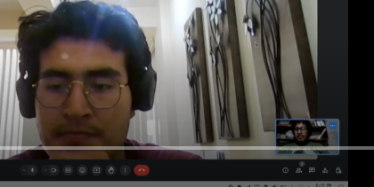

**2. CAPÍTULO II: REQUIREMENTS ELICITATION & ANALYSIS**

**2.1 Competidores**

1. **Vorsteiner:** Líder en personalización digital para exteriores de automóviles. Ofrece una completa suite de herramientas 3D para diseñar y visualizar accesorios como alerones, faldones, estribos y más en la carrocería. Gran reconocimiento de marca.
1. **Vossen Wheels:** Plataforma especializada en personalización digital de llantas/rines. Amplio catálogo de modelos 3D para customizar totalmente el diseño, color y materiales. Compatible con las principales marcas de vehículos.
1. **Forgiato:** Solución innovadora para customizar virtualmente cada detalle interior y exterior de un vehículo. Integra inteligencia artificial para ofrecer recomendaciones en tendencias y diseños populares.

**Análisis FODA:**

|
**Fortalezas:**

- Ofrecemos una solución menos costosa en comparación con nuestros competidores.

- Contamos con un equipo comprometido para llevar a cabo la solución.

- Nuestra solución es fácil e intuitiva de usar.

&emsp;
|
**Debilidades:**

- - Marca nueva sin posicionamiento aún en el mercado

- - Recursos limitados para marketing e innovación tecnológica 

- - Catálogo inicial de opciones de personalización más reducido que competidores
|
| :- | :- |
|
**Oportunidades:**

- Rápido crecimiento del segmento de customización digital de vehículos

- Nichos por explorar como mercado de entusiastas y propietarios de vehículos clásicos  

- Posibilidad de alianzas con fabricantes y tiendas de accesorios 

- Desarrollo de aplicaciones móviles integradas y realidad aumentada

|
**Amenazas:**

- Competidores establecidos con mayores recursos y clientes cautivos

- Rápidos avances tecnológicos que pueden hacer obsoleta la plataforma

- Barreras de entrada bajas que facilitan el ingreso de nuevos competidores

- Potenciales problemas legales por derechos de autor y patentes en la industria
|

**2.1.1. 	Análisis competitivo**

<table><tr><th colspan="6" valign="top"><b>Competitive Analysis Landscape</b></th></tr>
<tr><td rowspan="2" valign="top"><b>¿Por qué llevar a cabo este análisis?</b></td><td colspan="5" valign="top">¿De qué manera podríamos ser una opción preferencial para nuestro público objetivo en comparación a los competidores?</td></tr>
<tr><td colspan="5" valign="top">Para comparar las características tanto internas como externas de los productos que compiten con nosotros.</td></tr>
<tr><td colspan="2"></td><td valign="top">Cartunn</td><td valign="top">Vorsteiner</td><td valign="top">Vossen Wheels</td><td valign="top">Forgiato</td></tr>
<tr><td rowspan="2"><b>Perfil</b></td><td><b>Overview</b></td><td valign="top">Cartunn ofrece servicios de diseño y personalización de interiores y exteriores de vehículos, adaptados a los gustos individuales de cada cliente.</td><td valign="top">Se destaca como una plataforma especializada en la mejora de los aspectos exteriores de los automóviles, elevando su estética y rendimiento</td><td valign="top">Ofrece a los usuarios la oportunidad de personalizar las llantas de sus vehículos con una amplia variedad de opciones de diseño y acabados</td><td valign="top">Con su enfoque especializado en la personalización de rines, proporciona a los clientes una selección diversa de diseños y materiales de alta calidad</td></tr>
<tr><td><b>Ventaja competitiva ¿Qué valor ofrece a los clientes?</b></td><td valign="top">Plataforma intuitiva y fácil de usar, diseñada para satisfacer las necesidades de una amplia gama de usuarios, con precios sorprendentemente accesibles que hacen que la personalización de tu vehículo sea aún más atractiva y accesible para todos los entusiastas del automóvil.</td><td valign="top">La plataforma ofrece una amplia gama de opciones que permiten a los usuarios customizar virtualmente su automóvil de manera completa y detallada, desde el diseño exterior hasta los detalles más íntimos del interior, brindando una experiencia de personalización sin límites y totalmente única.</td><td colspan="2" valign="top">

Dirigidas a un público altamente específico compuesto por verdaderos amantes de los rines y su personalización, estas dos plataformas emergen como los puntos de referencia en el mundo del rin custom y la mejora vehicular. Con un enfoque meticuloso en cada detalle y una comprensión profunda de las aspiraciones de sus usuarios, estas plataformas están meticulosamente diseñadas para satisfacer las demandas más exigentes y los gustos más refinados de aquellos que buscan no solo un automóvil, sino una expresión auténtica de su estilo y personalidad.

</td></tr>
<tr><td rowspan="2">
<b>Perfil</b>

` `<b>de Marketing</b>
</td><td><b>Mercado objetivo</b></td><td colspan="4" valign="top">Amantes de los automóviles que están dispuestos a querer mejorar estéticamente sus vehículos.</td></tr>
<tr><td><b>Estrategias de marketing</b></td><td valign="top">Crecimiento por recomendación, campañas de ads y sponsorización de eventos como coffe&cars</td><td colspan="3" valign="top">La recomendación de anteriores clientes con buenas reseñas del producto/servicio es un testimonio valioso que respalda la calidad y la satisfacción que otros han experimentado. Estas reseñas positivas no solo son un reflejo del compromiso de la empresa con la excelencia y el servicio al cliente, sino que también brindan una tranquilidad adicional a los nuevos clientes que están considerando utilizar el producto o servicio.</td></tr>
<tr><td rowspan="3"><b>Perfil de Producto</b></td><td><b>Productos & Servicios</b></td><td valign="top">
Customización de autopartes,

Reparación de autopartes únicamente customizadas

</td><td valign="top">
Venta de autopartes, Customización de autopartes

</td><td valign="top">
Venta de rines,

Personalización de rines,.

Reparación de rines.
</td><td valign="top">
Venta de rines,

Personalización de rines,.

Reparación de rines.
</td></tr>
<tr><td><b>Precios & Costos</b></td><td valign="top">La elección puede variar considerablemente según una serie de factores que incluyen el estilo personal, las necesidades específicas del vehículo y las preferencias individuales del cliente.</td><td valign="top">Los precios pueden fluctuar dentro de un rango amplio, generalmente entre $1,000 y $4,000, dependiendo de la marca, el diseño y los materiales seleccionados.</td><td valign="top">La decisión final sobre el costo estará influenciada por el modelo del vehículo, así como por el tipo de rin deseado, ya sea deportivo, clásico o de alto rendimiento</td><td valign="top">La decisión final sobre el costo estará influenciada por el modelo del vehículo, así como por el tipo de rin deseado, ya sea deportivo, clásico o de alto rendimiento</td></tr>
<tr><td><b>Canales de distribución (Web y/o Móvil)</b></td><td colspan="4" valign="top">En la actualidad, estas plataformas se enfocan exclusivamente en ofrecer una experiencia a través de su aplicación web, proporcionando a los usuarios un acceso fácil y conveniente desde sus dispositivos de escritorio o portátiles.</td></tr>
<tr><td rowspan="4"><b>Análisis SWOT</b></td><td><b>Fortalezas</b> </td><td valign="top">Producto de alta calidad que cuenta con precios accesibles</td><td valign="top">Uso de fibra de carbono para la creación de las autopartes customizadas</td><td valign="top">

Interfaz visualmente atractiva

</td><td valign="top">Interfaz visualmente atractiva</td></tr>
<tr><td><b>Debilidades</b> </td><td valign="top">Limitado conocimiento del mercado</td><td colspan="3" valign="top">Sus plataformas web tienen un tiempo considerable de carga por la falta de optimización de la misma</td></tr>
<tr><td><b>Oportunidades</b> </td><td valign="top">Demanda en el mercado por precios más accesibles.</td><td colspan="3" valign="top">

Al ser los competidores con más experiencia, podrían aprovechar la misma para ganar más clientela.
</td></tr>
<tr><td><b>Amenazas</b></td><td colspan="4" valign="top">La aparición constante de nuevos competidores cada año puede afectar nuestra participación en el mercado.</td></tr>
</table>

**2.1.2.	Estrategias y tácticas frente a competidores**

Revisando nuestra propuesta inicial de estrategias llegamos en grupo a las siguientes tácticas que pondremos en marcha frente a nuestros competidores:

- Optimización en el tiempo de carga de las imágenes dentro la plataforma a través del uso de imágenes en formato .*webp* con el fin de mejorar la experiencia de usuario.
- Implementación de componentes *skeleton* dentro de todas las *pages* de la aplicación con el fin de no sobrecargar el *DOM* con procesos de renderización innecesarios.
- Trabajar en el SEO de la plataforma para así lograr posicionarla entre los principales resultados de búsqueda de forma orgánica.
- Implementación de Lazy Loading para cargar contenido a medida que el usuario lo necesite, lo que puede mejorar significativamente los tiempos de carga de la página inicial y reducir la carga inicial de recursos.
- Auditorías de rendimiento regulares para monitorear el rendimiento de la plataforma y así lograr identificar posibles cuellos de botella y áreas de mejora continua con herramientas como *Lighthouse*.
- Optimización de archivos CSS y JavaScript, con el fin de reducir el tamaño de los mismo para mejorar los tiempos de carga de la página y la velocidad general del sitio. Por lo que sería necesario verificar clases tanto en CSS y en Javascript que no se estén utilizando.
- Integración de ARIA para mejorar la accesibilidad en los elementos HTML de la plataforma para usuarios con discapacidades. 
- Ofrecer asistencia 24/7 al cliente a través de canales como chatbots programados con las preguntas más frecuentes y sus respectivas respuestas.

**2.2.		Entrevistas**

**2.2.1	Diseño de entrevistas**

Para realizar los componentes elaboramos las preguntas para obtener información de nuestros segmentos objetivos mediante las entrevistas.

1. ***Preguntas principales:***
   1. ¿Cómo te llamas?
   1. ¿Qué edad tienes?
   1. ¿Dónde vives?
   1. ¿Cuál es tu profesión?
   1. ¿Cuál es tu estado civil?

1. ***Preguntas específicas y complementarias:***

**Segmento objetivo:** Personas que buscan customizar sus autos

1. ¿Has tenido la oportunidad de personalizar tu carro anteriormente? Coméntanos sobre tu experiencia
1. ¿Qué te motiva a personalizar tu auto?
1. ¿Qué dispositivos prefieres utilizar para buscar información sobre la personalización de automóviles?
1. ¿Qué canales digitales usualmente utilizas para obtener ideas para mejorar tu carro?
1. ¿Has presentado alguna mala experiencia al personalizar tu auto en el pasado?
1. ¿Qué es lo que te gustaría que una plataforma de personalización de automóviles solucionara?
1. ¿Qué marcas de vehículos son de tu preferencia?

**Segmento objetivo:** Staff mecánico

1. ¿Qué productos brindas para la personalización de autos?
1. ¿Cuál ha sido tu experiencia trabajando con clientes que buscan personalizar sus autos?
1. ¿Qué canales utilizas para promocionar tus productos?
1. ¿Cómo prefieres interactuar con los clientes interesados en los productos?
1. ¿Has trabajado anteriormente con plataformas de personalización de automóviles?
1. ¿Qué buscas en una aplicación de personalización de carros?
1. ¿Cuáles son las marcas de automóviles con las que tienes mayor experiencia?

**2.2.2.	Registro de entrevistas**

**Segmento objetivo: Clientes que buscan customizar sus autos**

**Entrevista 1:**

**Entrevistador:** Abraham Israel Ayquipa

**Datos del entrevistado:**

- Nombre: Luis Jean 
- Apellidos: Piere Espejo
- Edad: 19 años
- Distrito: Surco
- Educación: Estudiante de derecho en la universidad UPC

**Duración de la entrevista:** 3 minutos

**Inicio de de la entrevista:** 00:00

**Link: [*https://upcedupe-my.sharepoint.com/:v:/g/personal/u20201c607_upc_edu_pe/ETkXbFSbZatDpAEvHzTPTJMB-mXrG_XL1xe922soG6czhQ?nav=eyJyZWZlcnJhbEluZm8iOnsicmVmZXJyYWxBcHAiOiJTdHJlYW1XZWJBcHAiLCJyZWZlcnJhbFZpZXciOiJTaGFyZURpYWxvZy1MaW5rIiwicmVmZXJyYWxBcHBQbGF0Zm9ybSI6IldlYiIsInJlZmVycmFsTW9kZSI6InZpZXcifX0%3D&e=fIFERB*](https://upcedupe-my.sharepoint.com/:v:/g/personal/u20201c607_upc_edu_pe/ETkXbFSbZatDpAEvHzTPTJMB-mXrG_XL1xe922soG6czhQ?nav=eyJyZWZlcnJhbEluZm8iOnsicmVmZXJyYWxBcHAiOiJTdHJlYW1XZWJBcHAiLCJyZWZlcnJhbFZpZXciOiJTaGFyZURpYWxvZy1MaW5rIiwicmVmZXJyYWxBcHBQbGF0Zm9ybSI6IldlYiIsInJlZmVycmFsTW9kZSI6InZpZXcifX0%3D&e=fIFERB)**

**Resumen de la entrevista:** Luis ha personalizado su vehículo anteriormente, haciendo cambios específicos como la suspensión, el color y los rines. Su motivación para personalizar su vehículo parece centrarse en el uso personal y la comodidad, además de reflejar sus gustos y preferencias actuales. Luis utiliza principalmente su smartphone y computadora para buscar información sobre personalización de vehículos. Usa internet y menciona específicamente a Facebook Marketplace como medios para obtener ideas y realizar modificaciones en su vehículo. Luis ha enfrentado problemas con la calidad de los materiales y servicios recibidos, mencionando una experiencia negativa con la suspensión, el color y los rines que no cumplían sus expectativas.

Además, señala problemas con una aplicación de personalización de vehículos que se trabaja frecuentemente y no le brinda la confianza deseada. Luis espera que las plataformas de personalización de vehículos sean más fluidas, sin trabas, y que ofrezcan una variedad de accesorios claramente categorizados. Luis es un joven estudiante interesado en la personalización de vehículos como una forma de expresión personal y mejora de la comodidad. Sus experiencias anteriores le han enseñado la importancia de la calidad y la confiabilidad, tanto en los productos como en las plataformas utilizadas para la personalización. Él resalta la necesidad de plataformas intuitivas y eficientes que puedan manejar información y transacciones sin errores.

**Entrevista 2:**

**Entrevistador:** Mariana Alexandra Chambi Mendoza

**Entrevistado:** 

**Datos del entrevistado:**

- Nombre: Sebastian
- Apellidos: Escobar 
- Edad: 19 años
- Distrito: Surco
- Educación: Estudiante de ingeniería de software

**Duración de la entrevista:** 4 minutos con 18 segundos

**Inicio de de la entrevista:** 0:30

**Link: [*https://upcedupe-my.sharepoint.com/:v:/g/personal/u20201c607_upc_edu_pe/ETkXbFSbZatDpAEvHzTPTJMB-mXrG_XL1xe922soG6czhQ?nav=eyJyZWZlcnJhbEluZm8iOnsicmVmZXJyYWxBcHAiOiJTdHJlYW1XZWJBcHAiLCJyZWZlcnJhbFZpZXciOiJTaGFyZURpYWxvZy1MaW5rIiwicmVmZXJyYWxBcHBQbGF0Zm9ybSI6IldlYiIsInJlZmVycmFsTW9kZSI6InZpZXcifX0%3D&e=fIFERB*](https://upcedupe-my.sharepoint.com/:v:/g/personal/u20201c607_upc_edu_pe/ETkXbFSbZatDpAEvHzTPTJMB-mXrG_XL1xe922soG6czhQ?nav=eyJyZWZlcnJhbEluZm8iOnsicmVmZXJyYWxBcHAiOiJTdHJlYW1XZWJBcHAiLCJyZWZlcnJhbFZpZXciOiJTaGFyZURpYWxvZy1MaW5rIiwicmVmZXJyYWxBcHBQbGF0Zm9ybSI6IldlYiIsInJlZmVycmFsTW9kZSI6InZpZXcifX0%3D&e=fIFERB)**

**Resumen de la entrevista:** Sebastián describe su experiencia de personalización de automóviles como emocionante y divertida, destacando que realizó modificaciones estéticas y añadió accesorios que mejoran tanto la apariencia como el rendimiento de su vehículo. La motivación principal de Sebastián para personalizar su auto es hacerlo único y reflejar su personalidad. Además, busca mejorar el rendimiento y la funcionalidad del vehículo para adaptarlo a sus gustos personales. Sebastián utiliza principalmente su ordenador y, en ocasiones, su teléfono móvil. Consulta revistas, periódicos y participa en foros en línea con especialistas y la comunidad que comparten ideas sobre personalización. También utiliza YouTube para encontrar tutoriales detallados y videos sobre personalización de automóviles, y sigue cuentas en redes sociales como Instagram para inspiración y nuevas ideas. Aunque Sebastián no ha tenido experiencias negativas personales significativas en la personalización de su auto, es consciente de los problemas que otros han enfrentado, como piezas de baja calidad o instalaciones deficientes. Esto lo motiva a investigar y seleccionar cuidadosamente los productos y servicios. Sebastián desea que una plataforma de personalización de automóviles ofrezca una amplia gama de productos de calidad y servicios confiables. Valora la idea de una comunidad activa donde los usuarios puedan compartir experiencias y consejos, así como herramientas interactivas para visualizar posibles modificaciones en el vehículo antes de realizarlas. Prefiere marcas como Toyota, destacando la calidad de rendimiento y las opciones de prevención que ofrecen. La entrevista revela que Sebastián es un joven apasionado por la personalización de automóviles, enfocado en la calidad y la individualización. Sus comentarios proporcionan insights valiosos para el proyecto, subrayando la importancia de la calidad, la personalización y el soporte.

**Entrevista 3:**

**Entrevistador:** Alexandra Alexandra Ramos Argüelles

**Entrevistado:** 

**Datos del entrevistado:**

- Nombres: Melany 
- Apellidos: Ramos Argüelles
- Edad**:** 27 años
- Distrito**:** Villa María del Triunfo
- Profesión: Ingeniera de software

**Duración de la entrevista:** 4 minutos con 37 segundos

**Inicio de la entrevista:** 01:19

**Link: [*https://upcedupe-my.sharepoint.com/:v:/g/personal/u20201c607_upc_edu_pe/ETkXbFSbZatDpAEvHzTPTJMB-mXrG_XL1xe922soG6czhQ?nav=eyJyZWZlcnJhbEluZm8iOnsicmVmZXJyYWxBcHAiOiJTdHJlYW1XZWJBcHAiLCJyZWZlcnJhbFZpZXciOiJTaGFyZURpYWxvZy1MaW5rIiwicmVmZXJyYWxBcHBQbGF0Zm9ybSI6IldlYiIsInJlZmVycmFsTW9kZSI6InZpZXcifX0%3D&e=fIFERB*](https://upcedupe-my.sharepoint.com/:v:/g/personal/u20201c607_upc_edu_pe/ETkXbFSbZatDpAEvHzTPTJMB-mXrG_XL1xe922soG6czhQ?nav=eyJyZWZlcnJhbEluZm8iOnsicmVmZXJyYWxBcHAiOiJTdHJlYW1XZWJBcHAiLCJyZWZlcnJhbFZpZXciOiJTaGFyZURpYWxvZy1MaW5rIiwicmVmZXJyYWxBcHBQbGF0Zm9ybSI6IldlYiIsInJlZmVycmFsTW9kZSI6InZpZXcifX0%3D&e=fIFERB)**

**Resumen de la entrevista:** Aunque Melany aún no ha personalizado su automóvil, muestra un fuerte interés en hacer modificaciones visuales, como cambiar el color y agregar imágenes, así como mejoras internas. Su motivación para personalizar el auto proviene de un deseo de que el vehículo refleje su personalidad y gustos personales. Melany utiliza principalmente su celular, computadora y, raramente, su iPad para buscar información sobre personalización. Usa Google y TikTok para obtener ideas y también consulta con su mecánico para obtener asesoramiento técnico. Melany menciona no haber personalizado su auto todavía, pero ha tenido problemas con la reparación del vehículo debido a la falta de un mecánico de confianza en el pasado. Esto subraya la importancia de la fiabilidad y la confianza en los servicios relacionados con su vehículo. Espera que una plataforma de personalización de automóviles le ofrezca sugerencias personalizadas, como mostrar una variedad de colores y cómo estos podrían lucir en su vehículo. También le gustaría ver comparativas sobre mejoras internas y sugerencias sobre qué podría añadir o mejorar en su auto. Posee un Suzuki y expresa preferencia por marcas como Toyota y Hyundai, valorando la disponibilidad y facilidad de encontrar repuestos. También menciona a Nissan como una marca de interés. Melany busca una experiencia de personalización que combine la estética con mejoras funcionales, reflejando su enfoque práctico como ingeniera de software. Su enfoque en la fiabilidad y el soporte técnico destaca la necesidad de una plataforma que ofrezca no solo opciones de personalización, sino también información confiable y accesible sobre el mantenimiento y la mejora de vehículos.

**Segmento objetivo: Staff mecánico**

**Entrevista 1:**

**Entrevistador: Franky Mallma Espiritu**

**Datos del entrevistado:**

- Nombres: Alex
- Apellidos: Martinez Guzman
- Edad: 20 años
- Distrito: Santa Anita
- Profesión: Técnico especialista en Automotriz

**Duración:** 3 minutos con 8 segundos

**Inicio de la entrevista:** 0:30

**Link: [*https://upcedupe-my.sharepoint.com/:v:/g/personal/u20201c607_upc_edu_pe/ETkXbFSbZatDpAEvHzTPTJMB-mXrG_XL1xe922soG6czhQ?nav=eyJyZWZlcnJhbEluZm8iOnsicmVmZXJyYWxBcHAiOiJTdHJlYW1XZWJBcHAiLCJyZWZlcnJhbFZpZXciOiJTaGFyZURpYWxvZy1MaW5rIiwicmVmZXJyYWxBcHBQbGF0Zm9ybSI6IldlYiIsInJlZmVycmFsTW9kZSI6InZpZXcifX0%3D&e=fIFERB*](https://upcedupe-my.sharepoint.com/:v:/g/personal/u20201c607_upc_edu_pe/ETkXbFSbZatDpAEvHzTPTJMB-mXrG_XL1xe922soG6czhQ?nav=eyJyZWZlcnJhbEluZm8iOnsicmVmZXJyYWxBcHAiOiJTdHJlYW1XZWJBcHAiLCJyZWZlcnJhbFZpZXciOiJTaGFyZURpYWxvZy1MaW5rIiwicmVmZXJyYWxBcHBQbGF0Zm9ybSI6IldlYiIsInJlZmVycmFsTW9kZSI6InZpZXcifX0%3D&e=fIFERB)**

**Resumen de la entrevista:** El técnico ofrece personalización de autos, incluyendo kits de carrocería, sistemas de escape de alto rendimiento, y alerones. Se enfoca en mejorar tanto la estética como el rendimiento del motor de los vehículos. La experiencia del técnico con los clientes ha sido positiva, trabajando en proyectos que varían desde modificaciones menores hasta transformaciones completas de vehículos. Esto implica cambios significativos en la apariencia y el rendimiento del automóvil. Utiliza principalmente redes sociales como Facebook y WhatsApp para promocionar sus productos y servicios. Prefiere interactuar directamente con los clientes, ya sea en persona, por teléfono o mediante mensajes directos a través de las redes sociales. A pesar de su experiencia en personalización, no ha utilizado plataformas de personalización de autos en línea; siempre ha trabajado en locales y talleres físicos. El técnico estaría interesado en una aplicación que permita a los usuarios explorar diferentes modificaciones y acceder a una comunidad de profesionales y entusiastas del automovilismo para intercambiar ideas y conocimientos. Ha trabajado principalmente con marcas como Nissan, Toyota y Kia, personalizando modelos como Sedanes y Corolas. Este técnico especialista representa una perspectiva práctica y directa en el campo de la personalización de automóviles. Su enfoque en la interacción personal y el uso limitado de plataformas digitales sugiere una preferencia por métodos tradicionales de trabajo, aunque muestra interés en las posibilidades que una plataforma digital podría ofrecer para la colaboración y el intercambio de ideas. Esto indica una posible área de oportunidad para desarrollar herramientas que faciliten la conexión entre profesionales del sector automotriz y entusiastas de la personalización de vehículos.

**Entrevista 2:**

**Entrevistador:** Natanael David Soto Salis

**Datos del entrevistado:**

- Nombres: Eduardo 
- Apellidos: Guimaraes
- Edad: 23 años
- Distrito: Surco
- Profesión: Mecánico automotriz

**Duración:** 5 minutos con 28 segundos

**Inicio de de la entrevista:** 01:00

**Link: [*https://upcedupe-my.sharepoint.com/:v:/g/personal/u20201c607_upc_edu_pe/ETkXbFSbZatDpAEvHzTPTJMB-mXrG_XL1xe922soG6czhQ?nav=eyJyZWZlcnJhbEluZm8iOnsicmVmZXJyYWxBcHAiOiJTdHJlYW1XZWJBcHAiLCJyZWZlcnJhbFZpZXciOiJTaGFyZURpYWxvZy1MaW5rIiwicmVmZXJyYWxBcHBQbGF0Zm9ybSI6IldlYiIsInJlZmVycmFsTW9kZSI6InZpZXcifX0%3D&e=fIFERB*](https://upcedupe-my.sharepoint.com/:v:/g/personal/u20201c607_upc_edu_pe/ETkXbFSbZatDpAEvHzTPTJMB-mXrG_XL1xe922soG6czhQ?nav=eyJyZWZlcnJhbEluZm8iOnsicmVmZXJyYWxBcHAiOiJTdHJlYW1XZWJBcHAiLCJyZWZlcnJhbFZpZXciOiJTaGFyZURpYWxvZy1MaW5rIiwicmVmZXJyYWxBcHBQbGF0Zm9ybSI6IldlYiIsInJlZmVycmFsTW9kZSI6InZpZXcifX0%3D&e=fIFERB)**

**Resumen de la entrevista:** Eduardo menciona que la personalización más popular entre sus clientes es la variedad de colores para los autos, que es el producto más vendido. Además, ofrece servicios para cambiar repuestos según las necesidades específicas de cada vehículo. Utiliza principalmente su teléfono Android para comunicarse con sus clientes. Prefiere usar Google Chrome por su confiabilidad y popularidad. Utiliza WhatsApp y redes sociales, destacando que maneja un catálogo en WhatsApp y promociona sus servicios en Facebook. Eduardo describe que ha tenido experiencias variadas con los clientes, con algunos que aprecian su trabajo y otros que no quedan completamente satisfechos. Sin embargo, indica que generalmente logra que los clientes estén contentos con el resultado final. Promueve sus productos y servicios a través de WhatsApp y Facebook, y está abierto a explorar otras soluciones tecnológicas que puedan mejorar la interacción con los clientes y acortar los tiempos de respuesta. Hasta ahora, Eduardo no ha utilizado plataformas específicas de personalización de automóviles más allá de WhatsApp para la comunicación. Muestra interés en una aplicación que permita a los clientes seguir el estado de la personalización de sus vehículos, lo que podría aumentar la satisfacción del cliente al reducir la incertidumbre y mejorar la experiencia general. Eduardo busca una aplicación que ofrezca seguimiento en tiempo real del estado de la personalización, lo que sugiere que valora la transparencia y la eficiencia en el servicio al cliente. Esto indica una oportunidad para el desarrollo de herramientas digitales que mejoren la gestión y el seguimiento de los proyectos de personalización. En resumen, Eduardo es un mecánico que combina técnicas tradicionales con el uso de herramientas digitales modernas para comunicarse y gestionar sus servicios de personalización de automóviles. Está interesado en adoptar nuevas tecnologías que mejoren la interacción con los clientes y la gestión de sus proyectos.

**Entrevista 3:**

**Entrevistador:** Natanael David Soto Salis

**Datos del entrevistado:**

- Nombres: Diego Rafael
- Apellidos: Cisneros
- Edad: 25  años
- Distrito: Chorrillos
- Profesión: Mecánica automotriz

**Duración:** 3 minutos con 41 segundos

**Inicio de de la entrevista:** 17:26

**Link: [*https://upcedupe-my.sharepoint.com/:v:/g/personal/u20201c607_upc_edu_pe/ETkXbFSbZatDpAEvHzTPTJMB-mXrG_XL1xe922soG6czhQ?nav=eyJyZWZlcnJhbEluZm8iOnsicmVmZXJyYWxBcHAiOiJTdHJlYW1XZWJBcHAiLCJyZWZlcnJhbFZpZXciOiJTaGFyZURpYWxvZy1MaW5rIiwicmVmZXJyYWxBcHBQbGF0Zm9ybSI6IldlYiIsInJlZmVycmFsTW9kZSI6InZpZXcifX0%3D&e=fIFERB*](https://upcedupe-my.sharepoint.com/:v:/g/personal/u20201c607_upc_edu_pe/ETkXbFSbZatDpAEvHzTPTJMB-mXrG_XL1xe922soG6czhQ?nav=eyJyZWZlcnJhbEluZm8iOnsicmVmZXJyYWxBcHAiOiJTdHJlYW1XZWJBcHAiLCJyZWZlcnJhbFZpZXciOiJTaGFyZURpYWxvZy1MaW5rIiwicmVmZXJyYWxBcHBQbGF0Zm9ybSI6IldlYiIsInJlZmVycmFsTW9kZSI6InZpZXcifX0%3D&e=fIFERB)**

**Resumen de la entrevista:** Diego utiliza un dispositivo especializado para diagnosticar el estado de los automóviles, lo cual le permite detectar problemas mecánicos de forma precisa. También usa su celular para la gestión de clientes y comunicación. Prefiere utilizar Microsoft Edge para sus necesidades de navegación en internet. Ofrece una variedad de productos para personalizar autos, incluyendo partes de carrocería y neumáticos. También trabaja con motores, aunque indica que estos son pedidos más complejos. La mayoría de sus experiencias con clientes han sido positivas, especialmente porque estos clientes suelen estar entusiasmados con la personalización de sus autos y tienen ideas claras de lo que quieren. Diego promociona sus productos y servicios principalmente a través de anuncios en Facebook e Instagram, y ocasionalmente usa WhatsApp para contactar clientes activos. Prefiere interactuar con los clientes a través de llamadas de voz o mensajes de WhatsApp, destacando la rapidez y eficiencia de este último. Hasta ahora, Diego no ha trabajado con plataformas digitales específicas de personalización de automóviles. Está interesado en una aplicación que ofrezca una amplia selección de partes que puedan ser filtradas por tipo de auto, modelo y tipo de partes, facilitando así la personalización según las especificaciones del cliente. Ha trabajado con muchas marcas, pero menciona específicamente que algunas, como Subaru y Honda , son más fáciles de manipular. Diego Rafael es un profesional apasionado por la mecánica y personalización de automóviles, que utiliza tanto herramientas modernas de diagnóstico como métodos de comunicación avanzados para mejorar la interacción con sus clientes y eficientizar su trabajo. La entrevista destaca su adaptabilidad y su enfoque en proporcionar servicios personalizados que cumplan con las expectativas claras y entusiastas de sus clientes.

clientes:

1\.- <https://upcedupe-my.sharepoint.com/:v:/g/personal/u202218475_upc_edu_pe/EZp1DzZM6DZOr8j0VWxJ1cgB8xB14s-o7sRNNm-0kVtLmQ?e=JERfdg&nav=eyJyZWZlcnJhbEluZm8iOnsicmVmZXJyYWxBcHAiOiJTdHJlYW1XZWJBcHAiLCJyZWZlcnJhbFZpZXciOiJTaGFyZURpYWxvZy1MaW5rIiwicmVmZXJyYWxBcHBQbGF0Zm9ybSI6IldlYiIsInJlZmVycmFsTW9kZSI6InZpZXcifX0%3D> 

2\.- <https://upcedupe-my.sharepoint.com/:v:/g/personal/u202217389_upc_edu_pe/ESfS-tEn1itPtPKBoOREscYBFqkD7V0P7QnoYYEYew7_cA?nav=eyJyZWZlcnJhbEluZm8iOnsicmVmZXJyYWxBcHAiOiJTdHJlYW1XZWJBcHAiLCJyZWZlcnJhbFZpZXciOiJTaGFyZURpYWxvZy1MaW5rIiwicmVmZXJyYWxBcHBQbGF0Zm9ybSI6IldlYiIsInJlZmVycmFsTW9kZSI6InZpZXcifX0%3D&e=Sz2OjQ> 

3\.-  <https://youtu.be/LxC_n2O_fNA>  

staff:

1\.- <https://youtu.be/BGKFJ98RtPE>  

2\.- <https://upcedupe-my.sharepoint.com/:v:/g/personal/u20201c607_upc_edu_pe/ETUukYhBm0RFggzWS9SpNroBNNuvJ4E0MvytyLczJxHYzA?e=XAaWrh&nav=eyJyZWZlcnJhbEluZm8iOnsicmVmZXJyYWxBcHAiOiJTdHJlYW1XZWJBcHAiLCJyZWZlcnJhbFZpZXciOiJTaGFyZURpYWxvZy1MaW5rIiwicmVmZXJyYWxBcHBQbGF0Zm9ybSI6IldlYiIsInJlZmVycmFsTW9kZSI6InZpZXcifX0%3D> 

3\.- <https://upcedupe-my.sharepoint.com/:v:/g/personal/u20201c607_upc_edu_pe/Ee922foWWb5HrnfCZN7R6o8BGmKg_zMlYrQyYo1OUST4Gg?e=rwZKCo> 

**2.2.3.	 Análisis de entrevistas**

**Segmento objetivo: Clientes que buscan customizar sus autos**

**Características Objetivas:**

**1. Uso de Tecnología:**

- Todos los entrevistados utilizan principalmente dispositivos tecnológicos para buscar información sobre personalización de vehículos, con una preferencia por smartphones y computadoras.
- Luis utiliza principalmente su smartphone y computadora.
- Sebastián utiliza principalmente su ordenador y ocasionalmente su teléfono móvil.
- Melany utiliza su celular, computadora y, ocasionalmente, su iPad.

**2. Canales de Interacción:**

- Luis menciona específicamente Facebook Marketplace como un medio para obtener ideas y realizar modificaciones en su vehículo.
- Sebastián consulta revistas, periódicos, foros en línea, YouTube y redes sociales como Instagram para obtener inspiración y nuevas ideas.
- Melany utiliza Google y TikTok para obtener ideas y también consulta con su mecánico para obtener asesoramiento técnico.

**3. Marcas de Interés:**

- Luis no menciona preferencias específicas de marca.
- Sebastián prefiere marcas como Toyota.
- Melany posee un Suzuki y expresa preferencia por marcas como Toyota, Hyundai y Nissan. 

**Características Subjetivas:**

**1. Motivaciones para Personalizar:**

- Luis está motivado por el uso personal y la comodidad, así como por reflejar sus gustos y preferencias.
- Sebastián busca hacer su vehículo único y reflejar su personalidad, además de mejorar su rendimiento y funcionalidad.
- Melany desea que su vehículo refleje su personalidad y gustos personales.

**2. Experiencias Pasadas:**

- Luis ha enfrentado problemas con la calidad de los materiales y servicios recibidos en el pasado.
- Sebastián no ha tenido experiencias negativas significativas, pero es consciente de los problemas que otros han enfrentado.
- Melany ha tenido problemas con la reparación del vehículo debido a la falta de un mecánico de confianza en el pasado.

**3. Intereses y Preferencias:**

- Luis es un joven estudiante interesado en la personalización de vehículos como una forma de expresión personal y mejora de la comodidad.
- Sebastián es un joven apasionado por la personalización de automóviles, enfocado en la calidad y la individualización.
- Melany tiene un enfoque práctico como ingeniera de software y busca una experiencia de personalización que combine la estética con mejoras funcionales.

**Tecnología:**

**Dispositivos:**

Se observa una preferencia generalizada por el uso de smartphones y computadoras para la búsqueda de información sobre personalización de vehículos.

**Browser:**

Se observa que se usa Google Chrome como navegador favorito.6

**Segmento objetivo: Staff mecánico**

- Los técnicos ofrecen una variedad de servicios de personalización, con un enfoque en la modificación estética y de rendimiento de los autos.
- La experiencia con los clientes es mayormente positiva, con un enfoque en satisfacer las expectativas y deseos claros de personalización.
- WhatsApp y redes sociales son los principales canales utilizados para promocionar productos y servicios.
- La interacción preferida con los clientes es directa, ya sea en persona o a través de medios de comunicación digital.
- Ningún técnico ha trabajado con plataformas de personalización en línea hasta el momento.
- Buscan una aplicación que ofrezca seguimiento en tiempo real del estado de la personalización y una amplia selección de partes filtradas.
- Tienen experiencia con una variedad de marcas de automóviles, destacando Nissan, Toyota, Kia, Subaru y Honda.

**2.3.		Needfinding**

Con el propósito de desarrollar una app que satisfaga las necesidades particulares de los usuarios, CarTunn llevará a cabo la identificación del User persona, User Task Matrix, User Journey Maps y Empathy Mapping.

**2.3.1.	User Personas**

Para esta sección se presentan personajes ficticios, uno de acuerdo a cada segmento objetivo. La información que se ha utilizado para elaborar los User personas se obtuvo de las entrevistas realizadas previamente a cada segmento objetivo. La intención de las entrevistas era conocer un poco más a las personas a las que la aplicación está dirigida. Entre la información de las entrevistas que fue utilizada tenemos demografía, metas, motivaciones, frustraciones, marcas relacionadas con el tema que envuelve a la aplicación, canales digitales que más utiliza, etc. Para la creación de esta sección se utilizó la plataforma UXPressia.

**Segmento objetivo: Clientes que buscan customizar sus autos**

[**https://uxpressia.com/w/DeRZM/p/7vFyy](https://uxpressia.com/w/DeRZM/p/7vFyy)** 

**Segmento objetivo: Staff mecánico**

[**https://uxpressia.com/w/DeRZM/p/h3zhF](https://uxpressia.com/w/DeRZM/p/h3zhF)** 

**2.3.2.	User Task Matrix**

"En esta sección se presenta el user task matrix, herramienta centrada en los segmentos objetivos (cliente y staff mecánico), que nos permitirá identificar las tareas y objetivos claves de los usuarios. Además, nos permitirá priorizar características y funcionalidades al momento de realizar el product backlog. Para la frecuencia se han considerado cinco opciones:nunca ,casi nunca, a veces, a menudo ,siempre; y para la importancia tres opciones: bajo, medio, alto"

<table><tr><th rowspan="2" valign="top"><b><i>User task Matrix</i></b></th><th colspan="2" valign="top"><b><i>Juan Velasquez</i></b></th><th colspan="2" valign="top"><b><i>Esteban Dominguez</i></b></th></tr>
<tr><td valign="top"><b><i>Frecuencia</i></b></td><td valign="top"><b><i>Importancia</i></b></td><td valign="top"><b><i>Frecuencia</i></b> </td><td valign="top"><b><i>Importancia</i></b></td></tr>
<tr><td>Buscar un web site de taller de personalización de autos</td><td><b><i>A menudo</i></b></td><td><b><i>Alta</i></b></td><td><b><i>Casi nunca</i></b></td><td><b><i>Baja</i></b></td></tr>
<tr><td>Buscar piezas de personalización</td><td><b><i>Siempre</i></b></td><td><b><i>Alta</i></b></td><td><b><i>Casi nunca</i></b></td><td><b><i>Baja</i></b></td></tr>
<tr><td>Comprar  piezas de personalización</td><td><b><i>Siempre</i></b></td><td><b><i>Alta</i></b></td><td><b><i>Nunca</i></b></td><td><b><i>Baja</i></b></td></tr>
<tr><td>Realizar una orden </td><td><b><i>Siempre</i></b></td><td><b><i>Alta</i></b></td><td><b><i>Nunca</i></b></td><td><b><i>Baja</i></b></td></tr>
<tr><td>Dar fecha de entrega de trabajo</td><td><b><i>Nunca</i></b></td><td><b><i>Baja</i></b></td><td><b><i>Siempre</i></b></td><td><b><i>Alta</i></b></td></tr>
<tr><td>Realizar pago</td><td><b><i>Siempre</i></b></td><td><b><i>Alta</i></b></td><td><b><i>Nunca</i></b></td><td><b><i>Baja</i></b></td></tr>
<tr><td>Comunicar  trabajo terminado</td><td><b><i>Nunca</i></b></td><td><b><i>Baja</i></b></td><td><b><i>Siempre</i></b></td><td><b><i>Alta</i></b></td></tr>
<tr><td>Hacer una observación </td><td><b><i>A menudo</i></b></td><td><b><i>Media</i></b></td><td><b><i>A veces</i></b></td><td><b><i>Baja</i></b></td></tr>
<tr><td>entregar auto a personalizar</td><td><b><i>Siempre</i></b></td><td><b><i>Alta</i></b></td><td><b><i>Nunca</i></b></td><td><b><i>Baja</i></b></td></tr>
<tr><td>Solicitar piezas a proveedores</td><td><b><i>Nunca</i></b></td><td><b><i>Baja</i></b></td><td><b><i>Siempre</i></b></td><td><b><i>Alta</i></b></td></tr>
<tr><td>Recibir pago</td><td><b><i>Nunca</i></b></td><td><b><i>Baja</i></b></td><td><b><i>Siempre</i></b></td><td><b><i>Alta</i></b></td></tr>
</table>

**Juan Velásquez (Cliente)**

Tareas críticas: Comprar piezas de personalización y realizar una orden, ambas con alta frecuencia e importancia. Esto implica que la interfaz de usuario para estas acciones debe ser prioritaria, eficiente y fácil de usar.

Tarea habitual pero menos crítica: Buscar un sitio web de taller de personalización, indicando la importancia de un buen posicionamiento en buscadores y accesibilidad.

**Esteban Domínguez (Staff Mecánico)**

Tareas críticas: Dar la fecha de entrega de trabajo y comunicar el trabajo terminado, ambas con alta frecuencia e importancia. Esto sugiere la necesidad de una funcionalidad robusta para la gestión de tareas y notificaciones dentro del sistema.

Tarea regular: Hacer una observación sobre el trabajo, que requiere un sistema de comentarios o notas dentro de las órdenes de trabajo.

**General**

Las tareas del cliente están enfocadas en la interacción inicial y compra, mientras que las del staff se centran en la gestión y comunicación de los procesos de trabajo.

Este análisis subraya la necesidad de un sistema que facilite tanto la compra eficiente para el cliente como la comunicación y gestión eficaz de órdenes y personalizaciones para el staff.

**2.3.3.	User Journey Mapping**

En esta sección se presentarán los user journey mapping para cada user persona.

**User Journey Mapping: Cliente** 

**link uxpressia : <https://uxpressia.com/w/DeRZM/m/NSHLe>** 

**User Journey Mapping: Staff:** 

**link uxpressia: <https://uxpressia.com/w/DeRZM/m/vPaXH>** 

**2.3.4.	Empathy Mapping**

En esta sección se presentarán los empathy mapping de acuerdo a los user persona que se realizaron, teniendo en cuenta los dos segmentos objetivos. El empathy mapping será de utilidad debido a que podemos conocer a mayor detalle a nuestros clientes, lo que nos permite mejorar algunos aspectos de la aplicación.

**Segmento objetivo: Clientes que buscan customizar sus autos**

[**https://uxpressia.com/w/DeRZM/p/6tcWn](https://uxpressia.com/w/DeRZM/p/6tcWn)** 

**Segmento objetivo: Staff mecánico**

[**https://uxpressia.com/w/DeRZM/p/G0tpM](https://uxpressia.com/w/DeRZM/p/G0tpM)** 

**2.3.5.	As-is Scenario Mapping**

En esta sección se presenta el As-Is Scenario Mapping para el segmento objetivo donde se identifican y comprenden los puntos de contacto del usuario. Para la elaboración se usó Miro.

**As-is scenario Mapping : Cliente**

[**https://miro.com/welcomeonboard/NDFUcUtZQU9SWkZ4SDhKUnNoR0RFVjhWTWZnTFNGd245YVBzZU1UQkxsR3E2WjFaMURtZXY3QjRDeG1DYW53cXwzNDU4NzY0NTUxNzYxNjYxMjg2fDI=?share_link_id=418419123921](https://miro.com/welcomeonboard/NDFUcUtZQU9SWkZ4SDhKUnNoR0RFVjhWTWZnTFNGd245YVBzZU1UQkxsR3E2WjFaMURtZXY3QjRDeG1DYW53cXwzNDU4NzY0NTUxNzYxNjYxMjg2fDI=?share_link_id=418419123921)** 
**

**Brainstorm individually:** 

**identify the highs and lows:** 

Áreas Positivas:

Compra las piezas por internet y espera la fecha de recepción de piezas..

Áreas Negativas:

Se siente frustrado al no lograr cambiar la pieza y al darse cuenta de que en redes sociales no hay muchas soluciones.

Se resigna y se siente frustrado por no hallar soluciones.

Blank Areas (Áreas que requieren aprender más):

Cómo retirar la pieza y cambiarla.

Cómo encontrar ayuda y soluciones cuando las redes sociales no proveen respuestas satisfactorias.

**As-is scenario mapping : Staff mecanico**

[**https://miro.com/welcomeonboard/NDFUcUtZQU9SWkZ4SDhKUnNoR0RFVjhWTWZnTFNGd245YVBzZU1UQkxsR3E2WjFaMURtZXY3QjRDeG1DYW53cXwzNDU4NzY0NTUxNzYxNjYxMjg2fDI=?share_link_id=418419123921](https://miro.com/welcomeonboard/NDFUcUtZQU9SWkZ4SDhKUnNoR0RFVjhWTWZnTFNGd245YVBzZU1UQkxsR3E2WjFaMURtZXY3QjRDeG1DYW53cXwzNDU4NzY0NTUxNzYxNjYxMjg2fDI=?share_link_id=418419123921)** 

**Brainstorm individually:**

**identify the highs and lows:**

Áreas Positivas:

\- Se busca una aplicación para personalizar autos y se publica oferta laboral en software terciario.

\- Se consigue un pedido de personalización en redes.

\- Se entrega el auto personalizado.

\- Se comunica al cliente la finalización.

Áreas Negativas:

\- No se encuentra una aplicación para personalizar.

\- No se encuentran piezas para vender por redes sociales.

\- Se tarda mucho en terminar el trabajo.

\- Hay frustración por no ofrecer un mejor servicio.

Blank Areas (Áreas que requieren aprender más):

\- ¿Qué hacer cuando un pedido no está terminado y cómo mejorar el tiempo de entrega?

Estas son las áreas que pueden identificarse en cada categoría según el flujo de trabajo actual del taller mecánico presentado en el diagrama AS-IS.

**2.4. Ubiquitous Language**

En esta sección, nos enfocaremos en definir los términos que serán utilizados a lo largo del proyecto. El propósito es asegurar que todos los miembros del equipo y las partes interesadas comprendan de manera uniforme estos términos.

- Automotive customization (Personalización automotriz): El proceso de modificar, mejorar o cambiar aspectos de un vehículo para adaptarlo a las preferencias y necesidades del propietario.
- Accessories (Accesorios): Componentes adicionales que se pueden instalar en un vehículo para mejorar su aspecto, rendimiento o funcionalidad.
- Customization services (Servicios de personalización): Actividades realizadas por staffs mecánicos para modificar o mejorar aspectos específicos de un vehículo según las preferencias del cliente.
- Mechanical staff (Staff mecánico): Profesionales especializados en la personalización automotriz, que ofrecen sus servicios a través de la plataforma.
- Expert advice (Asesoramiento experto): Orientación proporcionada por profesionales de la personalización automotriz dentro de la plataforma, para ayudar a los usuarios a tomar decisiones informadas sobre sus opciones de personalización.
- Notify suppliers (Informar a los proveedores): El proceso de comunicar a los proveedores sobre las necesidades de productos o servicios para la personalización de vehículos dentro de la plataforma CarTunn.
- Report (Reporte): Documento que proporciona información detallada sobre transacciones, actividades o problemas dentro de la plataforma CarTunn, utilizado para análisis y toma de decisiones.
- Orders (Órdenes): Solicitudes realizadas por los usuarios dentro de la plataforma CarTunn para adquirir productos o servicios de personalización automotriz.
- Tuning (Ajuste): Proceso de mejorar el rendimiento, la apariencia o las características de un vehículo mediante modificaciones dentro de la plataforma.
- Mechanical workshop (Taller mecánico): Establecimiento donde se realizan actividades de personalización y mantenimiento automotriz, asociado a la plataforma para ofrecer servicios a los usuarios.
- Customization (Customización): Proceso de cambiar aspectos específicos de un vehículo para adaptarlo a las preferencias del propietario, realizado a través de la plataforma.
- Car (Carro): Medio de transporte terrestre que puede ser modificado o personalizado mediante la plataforma CarTunn para satisfacer las necesidades y preferencias del propietario.
