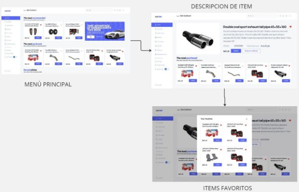
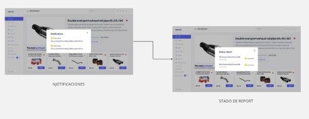
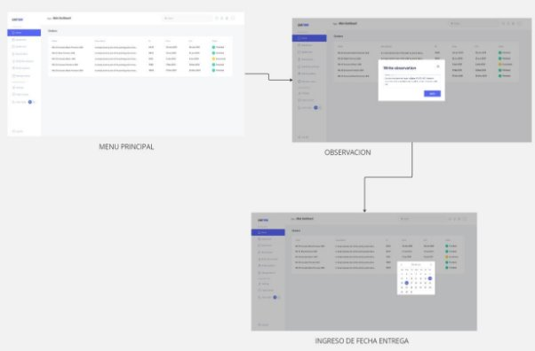
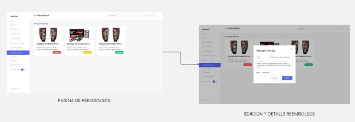
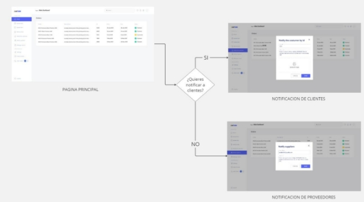
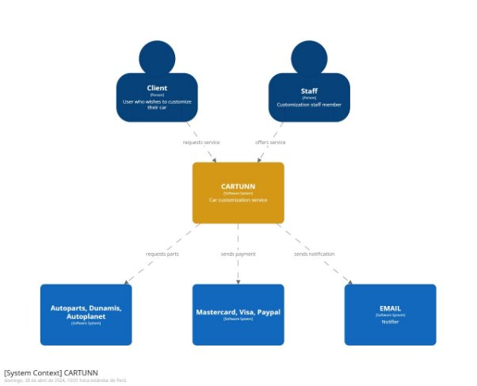

**4.	Capítulo IV: Product UX/UI Design** 

**4.1	Style Guidelines**

**4.1.1.	General Style Guidelines**

**Branding:** 

Aunque en un principio optamos por la creación de un imagotipo, sentimos que saturaba la esencia de la aplicación, por lo que la final optamos por un diseño minimalista y moderno en representado en un logotipo con los colores representativos de nuestra marca.

**Tipografías:**

**

Para las tipografías optamos por usar 3 variaciones de roboto(regular, italic semibold, black) y 2 variaciones de Plus Jakarta Sans(light, regular).

**Colores:**

En cuanto a nuestra paleta de colores, esta consta únicamente de 2, los cuales son un azul(#5766F5) y un negro con un matiz claro(#595959).

**Margin:**

Se optó por hacer uso de margin de elementos pequeños: verticalmente: 24px, horizontalmente 32px y para elementos grandes: verticalmente: 24px, horizontalmente 48px.

**Responsive y breakpoints:**

Teniendo en cuenta que todos los diseños tienen que ser responsive nosotros optamos por definir los siguiente breakpoints, mimos que los podrias etiquetar como:

- sm: pantallas menores a 640px.
- lg: pantallas menores a 1024px.
- xl: pantallas menores a 1280px.

**4.1.2.	Web Style Guidelines.**

**Enlace del figma: <https://www.figma.com/file/3puKCQI9HpY36ICGlYihgc/CarTunn-vFinal?type=design&node-id=224%3A2416&mode=design&t=w8OvXgMIblMERzsm-1>** 

Como se mencionó anteriormente se buscó que la landing fuese mucho más limpia por lo que el navbar no tiene iconos y el margin de 40px entre elementos ul y li mejora la UI.

Se tiene a su vez un section con algunas marcas de vehículos que ya hemos personalizado anteriormente, así como un article con algunas características acerca de nuestro producto.

En la sección de Costumers presentamos un article con las opiniones de algunos de nuestros clientes con los que ya hayamos trabajado.

Y finalmente se puede ver un article en la sección de pricing pues al trabajar dependiendo el vehículo, no existe un costo fijo pero se puede realizar una cotización. Sin olvidar otro article con información acerca de donde nos encontramos e información de contacto y el footer.

Importante: la web está diseñada a su vez para ser responsive, con plena compatibilidad con Android y IOS.

**4.2.	Information Architecture.**

**4.2.1.	Organization Systems.** 

En lo que concierne a la organización visual del contenido de nuestro proyecto, se aplicará el patrón visual hierarchy para organizar la información en las distintas secciones de la aplicación. Esto significa que la relevancia de las oraciones será determinada por el tamaño de la fuente, donde aquellas de mayor importancia se mostrarán con un tamaño de fuente de 48px (equivalente a 3rem), mientras que otras se presentarán con tamaños de fuente más pequeños. Además, se utilizará un formato de organización matricial ordenada para exhibir las características del producto, asegurando una presentación estructurada y fácil de seguir.

En cuanto a los métodos de categorización del contenido, se empleará la categorización basada en la audiencia, dado que nuestro proyecto tiene dos segmentos objetivos: clientes interesados en personalizar sus autos y staff mecánico. Cada segmento contará con secciones específicas y funciones adaptadas a sus necesidades particulares. Adicionalmente, se utilizará la categorización cronológica para el registro de entradas, especialmente cuando los usuarios accedan a bases de datos con información temporal. En este caso, las entradas más recientes tendrán prioridad y se mostrarán al principio para facilitar la visualización del contenido en orden temporal.

**4.2.2.	Labeling Systems.**

En el landing page, hemos optado por reducir el uso de iconos representativos en los enlaces y, en su lugar, dar prioridad al texto con botones destacados. Esto nos permite mantener la estética minimalista del landing page. Además, hemos incluido iconos de colores para identificar nuestras redes sociales y otros elementos.

En relación con nuestra aplicación, también hemos implementado botones de acceso rápido uno de muchos como a modo de call-to-action, para que los usuarios puedan ordenar accesorios de manera directa y sencilla.

**4.2.3.	SEO Tags and Meta Tags.** 

**Landing Page:** 

<meta charset= UTF-8 > 

<meta http-equiv="X-UA-Compatible" content="IE=edge"> 

<meta name= "viewport" content="width=device-width, initial-scale=1.0"> 

<meta name="agriculture" content="index, follow"> 

<link rel="shortcut icon" href="\*./images/favicon.png" type="image/x-icon"/> 

<title>CarTunn</title> 

<meta name="keywords" content="cartunn, tunning, mechanical staff, report, Customization, orders, automotive customization , software, accessories, customization services"> 

<meta name="description" content="Start now customizing your car now, There are already dozens of car lovers who have trusted us, you be one more"> 

**Web Application:** 

<meta charset= UTF-8 > 

<meta http-equiv="X-UA-Compatible" content="IE=edge"> 

<meta name= "viewport" content="width=device-width, initial-scale=1.0"> 

<meta name="customization" content="index, follow"> 

<link rel="shortcut icon" href="\*./images/favicon.png" type="image/x-icon"/> 

<title>CarTunn</title> 

<meta name="keywords" content="CarTunn,CarTunn Log In, CarTunn Sing Up, CarTunn app, CarTunn register, customization software,"> 

<meta name="description" content="CarTunn Log In.Start now customizing your car now.Collaborative platform between mechanical staff and clients who want to customize their cars."> 

**4.2.4.	Searching Systems.** 

En lo que respecta a los sistemas de búsqueda en nuestra aplicación, se implementará un sistema de filtros en los registros de entradas por fecha, lo que permitirá a los usuarios buscar y visualizar información según fechas específicas.

Además, se utilizarán filtros por pestañas en las siguientes ocasiones:

- Cuando el cliente, interesado en personalizar su automóvil, desee buscar sus procesos de personalización según su estado, como "en proceso" y "finalizado". Esto permitirá a los usuarios visualizar rápidamente el estado de sus solicitudes de personalización y realizar un seguimiento de su progreso.
- Cuando el staff mecánico revise, dentro de un proceso de personalización de vehículos, el estado de los vehículos en cada etapa, como "en revisión", "en proceso de instalación", "completado", entre otros según sea necesario. Esta función proporcionará una visión clara del progreso de cada proyecto de personalización y ayudará al personal mecánico a gestionar eficientemente las tareas pendientes.

**4.2.5.	Navigation Systems.**

La estructura de navegación de nuestra aplicación se fundamentará en un componente de interfaz de usuario ampliamente utilizado: el sidebar. Este sidebar contendrá todas las opciones disponibles en la aplicación, organizadas de manera jerárquica. Es importante destacar que el contenido del sidebar variará según el tipo de usuario que acceda a la aplicación.

**4.3	Landing Page UI Design.** 

En esta sección, presentamos nuestra propuesta de diseño de interfaz de usuario (UI) para el Landing Page. Explicamos cómo traducimos nuestras decisiones de diseño y arquitectura de información en una experiencia visualmente atractiva y funcional. El Landing Page es la primera impresión de nuestro sitio web, por lo que es crucial que refleje nuestra marca, comunique claramente nuestros mensajes clave y guíe a los usuarios hacia las acciones deseadas. Destacaremos los principios de diseño y consideraciones estratégicas que hemos utilizado para crear una experiencia de usuario efectiva y memorable.

**4.3.1.	Landing Page Wireframe.** 

**Enlace del figma web:** 

[**https://www.figma.com/file/mTtYszxtJt7r9ctlNzccEK/Wireframe-Landingpage?type=design&node-id=0%3A1&mode=design&t=SDb42Y1oTtVkd5Go-1](https://www.figma.com/file/mTtYszxtJt7r9ctlNzccEK/Wireframe-Landingpage?type=design&node-id=0%3A1&mode=design&t=SDb42Y1oTtVkd5Go-1)** 

A continuación diseñamos el cómo sería el wireframe de nuestra landing page usando Figma

![ref1]

![ref2]

**Enlace del figma móvil:**

[**https://www.figma.com/file/Ra8FhHb46JMhkNThyLmwbU/Mobile-wireframe?type=design&node-id=0%3A1&mode=design&t=4IPCw13uV4ZLjkE0-1](https://www.figma.com/file/Ra8FhHb46JMhkNThyLmwbU/Mobile-wireframe?type=design&node-id=0%3A1&mode=design&t=4IPCw13uV4ZLjkE0-1)** 

![ref3]

![ref4]

**4.3.2.	Landing Page Mock-up.**

**Enlace del figma: <https://www.figma.com/file/3puKCQI9HpY36ICGlYihgc/CarTunn-vFinal?type=design&node-id=224%3A2416&mode=design&t=wOoV1LZs3RIcch1q-1>** 

**4.4.	Web Applications UX/UI Design.** 

**4.4.1.	Web Applications Wireframes.** 
User goal: El usuario se registra, restablece su contraseña o inicia sesión en la aplicación

Inicio de sesión

Registro de nueva cuenta

Reestablecer la contraseña

Aplicación para clientes

User goal: Presentación del home de la aplicación

Descripción detallada del elemento automovilístico a ordenar para poder ser reemplazado por el antiguo 

Modal que muestra los elementos guardados como favoritos por el cliente

User goal: Status report del vehículo(muestra el estado de tuning en el que se encuentra el vehículo)

- In process: En proceso de tuning
- Finished: Modificación terminada

![ref5]

User goal: Notificaciones que llegarán al usuario inmediatamente al haber ordenado sus modificaciones indicando la fecha de entrega del vehículo 

![ref6]

User goal: Pasarela de pagos

![ref7]

User goal: Settings del perfil del usuario

![ref8]

User goal: apartado con las preguntas frecuentes

![ref9]

User goal: Aplicación para miembros de staff:

Modal para escribir una observación en caso de haberla por cada servicio de tuning.

En caso de haber problemas en la modificación del vehículo, el staff manualmente puede cambiar la fecha de entrega del vehículo al cliente y este será notificado.

Toogle manual que el staff puede modificar para indicar el estado en el que se encuentra el vehículo 

In process: En proceso de tuning

Finished: Modificación terminada

Manejo de reembolsos

![ref10]

Subir nuevo item a la aplicación

![ref11]

Actualizar nuevo item a la aplicación

![ref12]

Notificar al cliente

![ref13]

Notificar a los proveedores

![ref14]

**Enlace de figma:**

[**https://www.figma.com/file/Ra8FhHb46JMhkNThyLmwbU/Mobile-wireframe?type=design&node-id=10%3A2763&mode=design&t=uEXRlWCPVG53IytA-1](https://www.figma.com/file/Ra8FhHb46JMhkNThyLmwbU/Mobile-wireframe?type=design&node-id=10%3A2763&mode=design&t=uEXRlWCPVG53IytA-1)** 

**4.4.2.	Web Applications Wireflow Diagrams.** 

**User goal: usuario se registra ,cambia contraseña o inicia sesión en la aplicación con credenciales**

"Descripción:

Al iniciar la aplicación, el usuario se encuentra en el formulario de inicio de sesión, donde tiene tres opciones: iniciar sesión con credenciales correctas, registrarse al darle click al apartado de registros o cambiar contraseña. Una vez que el usuario ingresa con sus credenciales correctas en el inicio de sesión, podrá visualizar su dashboard correspondiente si es un cliente o del staff"

**User goal: Presentación del home de la aplicación**

Se dirige a la pantalla de inicio y selecciona clic en un item, por lo cual le da una descripción detallada del elemento automovilístico a ordenar para poder ser reemplazado por el antiguo y se abre con un clic la sección de los elementos guardados como favoritos por el cliente.

**User goal: Status report del vehículo(muestra el estado de tuning en el que se encuentra el vehículo)**

- In process: En proceso de tuning
- Finished: Modificación terminada

![ref6]**User goal: Notificaciones que llegarán al usuario inmediatamente al haber ordenado sus modificaciones indicando la fecha de entrega del vehículo** 

![ref5]

**                               

**User goal: Pasarela de pagos**

![ref7]

User goal: Settings del perfil del usuario

![ref8]

**User goal: apartado con las preguntas frecuentes**

![ref9]

**User goal: Aplicación para miembros de staff:**

U**ser goal: Reembolsos**

![ref10]

**user goal: subir piezas**

![ref11]

**user goal: remover item**

![ref12]

**user goal: solicitar piezas a proveedores**

![ref14]

**user goal: notificar piezas a clientes**

![ref13]

**4.4.3.	Web Applications Mock Ups**

User goal: El usuario se registra, restablece su contraseña o inicia sesión en la aplicación

Inicio de sesión

Registro de nueva cuenta

Reestablecer la contraseña

Aplicación para clientes

User goal: Presentación del home de la aplicación

Descripción detallada del elemento automovilístico a ordenar para poder ser reemplazado por el antiguo 

Modal que muestra los elementos guardados como favoritos por el cliente

User goal: Status report del vehículo(muestra el estado de tuning en el que se encuentra el vehículo)

- In process: En proceso de tuning
- Finished: Modificación terminada

User goal: Notificaciones que llegarán al usuario inmediatamente al haber ordenado sus modificaciones indicando la fecha de entrega del vehículo 

User goal: Pasarela de pagos

![ref15]

User goal: Settings del perfil del usuario

![ref16]

User goal: apartado con las preguntas frecuentes

![ref17]

User goal: Aplicación para miembros de staff:

Modal para escribir una observación en caso de haberla por cada servicio de tuning.

En caso de haber problemas en la modificación del vehículo, el staff manualmente puede cambiar la fecha de entrega del vehículo al cliente y este será notificado.

Toogle manual que el staff puede modificar para indicar el estado en el que se encuentra el vehículo 

- In process: En proceso de tuning
- Finished: Modificación terminada

Manejo de reembolsos

Subir nuevo item a la aplicación

![ref18]

Actualizar nuevo item a la aplicación

![ref19]

Eliminar nuevo item a la aplicación

![ref20]

Notificar al cliente

Notificar a los proveedores

**4.4.4.	Web Applications User Flow Diagrams**

` `**User goal: El usuario se registra, restablece su contraseña o inicia sesión en la aplicación**

Al iniciar la aplicación, el usuario se encuentra en el formulario de inicio de sesión, donde tiene tres opciones: iniciar sesión con credenciales correctas, registrarse al darle click al apartado de registros o cambiar contraseña. Una vez que el usuario ingresa con sus credenciales correctas en el inicio de sesión, podrá visualizar su dashboard correspondiente si es un cliente o del staff".

**User goal: Presentación del home de la aplicación para clientes:**

**Descripción:** el cliente entra al menu principal y puede seleccionar un ítem y se le muestra la descripción y detalle de lo elegido y también podrá marcarlo como favorito

**User goal: Status report del vehículo(muestra el estado de tuning en el que se encuentra el vehículo)**

**User goal: Notificaciones que llegarán al usuario**

Descripción: El cliente recibirá una notificación y el reporte del estado de personalización de su vehículo y la fecha de entrega.

**User goal: Pasarela de pagos**

![ref15]

**User goal: Settings del perfil del usuario:**

![ref16]

Descripción: el cliente puede configurar sus datos y contraseña

**User goal: apartado con las preguntas frecuentes:**

![ref17]

**User goal: Aplicación para miembros de staff:**

**Descripción:** Como miembro de staff ingresa a la página principal y puede visualizar las órdenes de los clientes y dar sus observaciones y programar una fecha de entrega

User goal: Reembolsos

**Descripción**: el miembro del staff accede a la página de reembolsos y selecciona el ítem a reembolsar y escribe el detalle del reembolso y el estado del objeto.

**user goal: subir item a la aplicación**

**user goal: actualizar ítem de la aplicación**

**user goal: remover item de la aplicación**

**user goal: solicitar piezas a proveedores**

![ref18]

![ref19]

![ref20]

**user goal:  notificar** 

**Descripción:** el miembro del staff ingresa desde la página principal a la sección de notificación y notificará al cliente y también al apartado de proveedores.

**4.5.	Web Applications Prototyping**

**Link: <https://upcedupe-my.sharepoint.com/:v:/g/personal/u202218475_upc_edu_pe/EYGlhhSe3SRMpcAYXnC-JjMB_sHeALjhl19QUBri7tNWkQ?e=Zolbor&nav=eyJyZWZlcnJhbEluZm8iOnsicmVmZXJyYWxBcHAiOiJTdHJlYW1XZWJBcHAiLCJyZWZlcnJhbFZpZXciOiJTaGFyZURpYWxvZy1MaW5rIiwicmVmZXJyYWxBcHBQbGF0Zm9ybSI6IldlYiIsInJlZmVycmFsTW9kZSI6InZpZXcifX0%3D>** 

**4.6.	Domain-Driven Software Architecture.**

**4.6.1.	Software Architecture Context Diagram.**

**4.6.2.	Software Architecture Container s.**

**4.6.3.	Software Architecture Components Diagrams.**

**4.7.	Software Object-Oriented Design**

**4.7.1		Class Diagrams.**

**Enlace:<https://lucid.app/lucidchart/55f20bcf-91d1-4928-801a-d53797c9fc39/edit?viewport_loc=-4412%2C-608%2C4258%2C1591%2C0_0&invitationId=inv_a31265b7-905c-470d-885d-17abae1c4fcc>** 

**Purchasing Bounded Context**

**Products Bounded Context**

**Profile Bounded Context**

**Payment Bounded Context**

**Tunning Bounded Context**

**4.7.2.	Class Dictionary**

A continuación, se detallan exhaustivamente las clases más relevantes junto con sus atributos y métodos correspondientes en el contexto del sistema de gestión agrícola. Estas clases forman la estructura fundamental del sistema, permitiendo un seguimiento integral de los procesos agrícolas y la gestión de los recursos agrícolas.

|**User**||
| :- | :- |
|La clase User es la clase fundamental que representa a un usuario dentro de la plataforma.||
|**Atributo**|**Descripción**|
|- name: String|Almacena el nombre del usuario.|
|- lastName: String|Almacena el apellido del usuario.|
|- age: int|Almacena la edad del usuario.|
|- sex: char|` `Almacena el género del usuario |
|**Método**|**Descripción**|
|+ createdAccount(): void|Este método registra la creación de la cuenta del usuario en la plataforma.|

|**Account**||
| :- | :- |
|La clase Account amplía los detalles proporcionados por el usuario en la plataforma||
|**Atributo**|**Descripción**|
|
- email: String

|Almacena la dirección de correo electrónico asociada a la cuenta del usuario.|
|
- password: String

|Almacena la contraseña de la cuenta del usuario.|
|- contactNumber: String|Almacena el número de contacto o teléfono asociado a la cuenta del usuario.|
|
- active: boolean

|Indica si la cuenta del usuario está activa o no (true para activa, false para inactiva).|
|**Método**|**Descripción**|
|+EditAccount(): void|` `Método para editar los detalles de la cuenta del usuario|
|+OpenAccount(): void|Método para abrir la cuenta del usuario.|
|+CloseAccount(): void|Método para cerrar la cuenta del usuario.|
|+IsActive(): void|Método para verificar si la cuenta del usuario está activa o inactiva.|

|**Subscription**||
| :- | :- |
|La clase Subscription encapsula los detalles esenciales de una suscripción||
|**Atributo**|**Descripción**|
|
- startDate: String

|Representa la fecha y hora en que comenzó la suscripción|
|
- endDate: String

|Representa la fecha y hora en que finaliza la suscripción|
|
- active: boolean

|Indica si la suscripción está activa o no|
|**Método**|**Descripción**|
|+ setStartDate(startDate: String): void|Método para establecer la fecha de inicio de la suscripción.|
|+ setEndDate(endDate: String): void|Método para establecer la fecha de finalización de la suscripción.|
|+ getEndDate(): String|Método para obtener la fecha de finalización de la suscripción.|
|+ isActive(): boolean|Método para verificar si la suscripción está activa o inactiva.|

|**Plan**||
| :- | :- |
|La clase Plan será una clase padre que puede ser extendida para crear suscripciones más específicas, como PlanBásic, PlanPremium y PlanExpert. ||
|**Atributo**|**Descripción**|
|-item:string|Este atributo almacena una cadena de texto que describe los beneficios y características de la suscripción.|
|**Método**|**Descripción**|
|+getPlan()|Este método devuelve una descripción detallada del plan de suscripción. |

|**CustomerOperation**||
| :- | :- |
|La clase CustomerOperation actúa como una controladora que gestiona las operaciones relacionadas con los clientes||
|**Atributo**|**Descripción**|
|-Account account()|Este atributo representa la cuenta del usuario|
|**Método**|**Descripción**|
|+createFunction(): void|Este método es responsable de proporcionar una descripción detallada del plan de suscripción|

|**StaffOperation**||
| :- | :- |
|La clase StaffOperation proporciona un entorno seguro y restringido para que el personal del staff pueda realizar tareas administrativas y operativas sin comprometer la seguridad de los datos del sistema. ||
|**Atributo**|**Descripción**|
|
-Account account()

|Este atributo representa la cuenta del usuario|
|**Método**|**Descripción**|
|
+upload\_item(): void

+remove\_item(): void
|Este método es responsable de proporcionar una descripción detallada del plan de suscripción|

|**ClienteOperation**||
| :- | :- |
|Proporciona una interfaz para que los usuarios realicen operaciones específicas relacionadas con los elementos o artículos en su cuenta.||
|**Atributo**|**Descripción**|
|-Account account()|Este atributo representa la cuenta del usuario|
|**Método**|**Descripción**|
|
+uploadItem(): void

+removeItem(): void
|Este método es responsable de actualizar y borrar items.|

|**Validations**||
| :- | :- |
|La clase Validations proporciona un conjunto de métodos para verificar y validar datos, condiciones o estados dentro de un sistema||
|**Método**|**Descripción**|
|
+find\_Problem(): void

|este método realiza una búsqueda de posibles problemas o inconsistencias en los datos o en el estado actual del sistema|

**4.8.	Database Design.** 

**4.8.1.	Database Diagram.**

[**https://lucid.app/lucidchart/55f20bcf-91d1-4928-801a-d53797c9fc39/edit?viewport_loc=-4412%2C-608%2C4258%2C1591%2C0_0&invitationId=inv_a31265b7-905c-470d-885d-17abae1c4fcc](https://lucid.app/lucidchart/55f20bcf-91d1-4928-801a-d53797c9fc39/edit?viewport_loc=-4412%2C-608%2C4258%2C1591%2C0_0&invitationId=inv_a31265b7-905c-470d-885d-17abae1c4fcc)** 

[**https://my.vertabelo.com/public-model-view/YaEZlcHTCtQjs1gwfSjY6bwzibMdosX2Q0IJE3iK3RiGEP1Oebzkz143pRiTaUBz?x=1347&y=2534&zoom=0.3632](https://my.vertabelo.com/public-model-view/YaEZlcHTCtQjs1gwfSjY6bwzibMdosX2Q0IJE3iK3RiGEP1Oebzkz143pRiTaUBz?x=1347&y=2534&zoom=0.3632)** 

[ref1]: Aspose.Words.626709c5-72c8-45cb-b6ad-ad4ffdffad24.018.png
[ref2]: Aspose.Words.626709c5-72c8-45cb-b6ad-ad4ffdffad24.019.png
[ref3]: Aspose.Words.626709c5-72c8-45cb-b6ad-ad4ffdffad24.020.png
[ref4]: Aspose.Words.626709c5-72c8-45cb-b6ad-ad4ffdffad24.021.png
[ref5]: Aspose.Words.626709c5-72c8-45cb-b6ad-ad4ffdffad24.030.png
[ref6]: Aspose.Words.626709c5-72c8-45cb-b6ad-ad4ffdffad24.031.png
[ref7]: Aspose.Words.626709c5-72c8-45cb-b6ad-ad4ffdffad24.032.png
[ref8]: Aspose.Words.626709c5-72c8-45cb-b6ad-ad4ffdffad24.033.png
[ref9]: Aspose.Words.626709c5-72c8-45cb-b6ad-ad4ffdffad24.034.png
[ref10]: Aspose.Words.626709c5-72c8-45cb-b6ad-ad4ffdffad24.039.png
[ref11]: Aspose.Words.626709c5-72c8-45cb-b6ad-ad4ffdffad24.040.png
[ref12]: Aspose.Words.626709c5-72c8-45cb-b6ad-ad4ffdffad24.042.png
[ref13]: Aspose.Words.626709c5-72c8-45cb-b6ad-ad4ffdffad24.043.png
[ref14]: Aspose.Words.626709c5-72c8-45cb-b6ad-ad4ffdffad24.044.png
[ref15]: Aspose.Words.626709c5-72c8-45cb-b6ad-ad4ffdffad24.056.png
[ref16]: Aspose.Words.626709c5-72c8-45cb-b6ad-ad4ffdffad24.057.png
[ref17]: Aspose.Words.626709c5-72c8-45cb-b6ad-ad4ffdffad24.058.png
[ref18]: Aspose.Words.626709c5-72c8-45cb-b6ad-ad4ffdffad24.064.png
[ref19]: Aspose.Words.626709c5-72c8-45cb-b6ad-ad4ffdffad24.065.png
[ref20]: Aspose.Words.626709c5-72c8-45cb-b6ad-ad4ffdffad24.066.png
