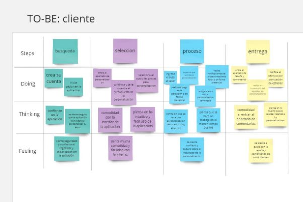
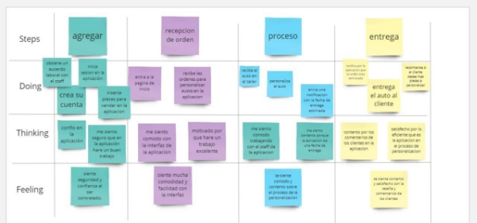

# 3. Capítulo III: Requirements Specification 
# 3.1. To-Be Scenario Mapping.

En esta seccion se presentan los To-Be Scenario Mapping para el segmento objetivo donde se reflejaran a partir de los As-Is Scenario Mapping. la experiencia de usuario ideal si se resuelven los puntos de dolor y necesidades. La herramienta usada fue Miro:

**To-be scenario mapping: Cliente que quiere customizar su auto**

<https://miro.com/welcomeonboard/NDFUcUtZQU9SWkZ4SDhKUnNoR0RFVjhWTWZnTFNGd245YVBzZU1UQkxsR3E2WjFaMURtZXY3QjRDeG1DYW53cXwzNDU4NzY0NTUxNzYxNjYxMjg2fDI=?share_link_id=418419123921> 

**To-be scenario mapping: Staff mecanico**

<https://miro.com/welcomeonboard/NDFUcUtZQU9SWkZ4SDhKUnNoR0RFVjhWTWZnTFNGd245YVBzZU1UQkxsR3E2WjFaMURtZXY3QjRDeG1DYW53cXwzNDU4NzY0NTUxNzYxNjYxMjg2fDI=?share_link_id=418419123921> 

# 3.2. User Stories

|**Epic/StoryID**|**Título**|**Descripción**|**Criterios de aceptación**|**Epic ID**|
| :-: | :-: | :-: | :-: | :-: |
|
**Epic 1: Landing page**

**Como** cliente

**Quiero** visualizar una página

**Para** saber acerca de la aplicación e ingresar a la aplicación
|||||
|**E1-US01**|**Barra de navegación en la landing page**|
**Como** cliente o staff mecanico

**Quiero** una barra de navegación en la landing page

**Para** tener acceso directo a la aplicación
|
**Escenario 1: El cliente o staff mecánico se encuentra en el navbar de navegación**

**Dado** que el usuario se encuentra en la landing page

**Cuando** se encuentre en la sección del navbar

**Entonces** visualiza enlaces de las secciones, botón de idiomas y el botón para redirigir a la aplicación

**Escenario 2: El cliente o staff mecánico quiere información acerca de nuestro producto**

**Dado** que el cliente o staff mecánico se encuentra en la landing page

**Y** este se encuentre en el navbar,

**Cuando** presione la opción de “Product” en el navbar

Entonces  será dirigido a esta sección y podrá observar la información de nuestro producto.

**Escenario 3: El cliente o staff mecánico quiere saber los testimonios de los usuarios que utilizaron la aplicación**

**Dado** que el cliente o staff mecánico se encuentra en la landing page

**Y** este se encuentre en el navbar,

**Cuando** presione la opción de “Customers” en el navbar

**Entonces**  será dirigido a esta sección y podrá observar los testimonios de los usuarios.

**Escenario 4: El cliente o staff mecánico quiere saber los precios del producto**

**Dado** que el cliente o staff mecánico se encuentra en la landing page

**Y** este se encuentre en el navbar,

**Cuando** presione la opción de “Pricing” en el navbar

**Entonces**  será dirigido a esta sección y podrá observar los planes disponibles del producto.

**Escenario 5: El cliente o staff mecánico quiere contactarse con nosotros**

**Dado** que el cliente o staff mecánico se encuentra en la landing page

**Y** este se encuentre en el navbar,

**Cuando** presione la opción de “Contact” en el navbar

**Entonces**  será dirigido a esta sección y podrá observar nuestro email, número telefónico, horario de atención y ubicación.
|**2**|
|**E1-US02**|**Dirigirse a la aplicación mediante el landing page**|
**Como** cliente o staff mecanico

**Quiero** dirigirme a la aplicación mediante el botón “Open App”

**Para** poder usarla.

|
**Escenario 1: Enlace directo a la aplicación a través de un botón**

**Dado que** el cliente o staff mecánico se encuentra en la landing page

**Y** este se dirige al navbar,

**Cuando** presione el botón “Open app”

**Entonces** es dirigido a la aplicación donde se podrá loguearse.
|**1**|
|**E1-US03**|**Seccion hero del landing page**|
**Como** cliente o staff mecanico

**Quiero** observar la sección hero del landing

**Para** poder tener información de lo que es y ofrece la aplicación.

|
**Escenario 1: El cliente o staff mecánico se encuentra en la sección de hero**

**Dado que** el cliente o staff mecánico se encuentra en la landing page

**Cuando** se encuentra en la sección hero 

**Entonces** observa una presentación de la aplicación.

**Escenario 2: El cliente o staff mecánico accede a la aplicación por el botón de Sign Up**

**Dado que** el cliente o staff mecánico se encuentra en la landing page

**Cuando** se encuentra en la sección hero 

**Y** presiona el botón “Sign up”

**Entonces** será redirigido al formulario de registro de cuentas.
|**1**|
|**E1-US04**|**Seccion “Product” del landing page**|
**Como** cliente o staff mecanico

**Quiero** observar la sección “Product” del landing

**Para** saber las características de la aplicación.
|
**Escenario 1: El cliente o staff mecánico se encuentra en la sección “Product”**

**Dado que** el cliente o staff mecánico se encuentra en la landing page

**Cuando** se encuentra en la sección “Product” 

**Entonces** observa las características de la aplicación.
|**1**|
|**E1-US05**|**Sección “Costumers” del landing page**|
**Como** cliente o staff mecanico

**Quiero** observar la sección “Costumers” del landing

**Para** saber las experiencias de los usuarios al usar nuestra aplicación.
|
**Escenario 1: El cliente o staff mecánico se encuentra en la sección “Customers”**

**Dado que** el cliente o staff mecánico se encuentra en la landing page

**Cuando** se encuentra en la sección “Customers” 

**Entonces** observa las experiencias de los usuarios al usar nuestra aplicación.
|**1**|
|**E1-US06**|**Sección “Princing” del landing page**|
**Como** cliente o staff mecanico

**Quiero** observar la sección “Pricing” del landing

**Para** conocer los planes disponibles que ofrece la aplicacion
|
**Escenario 1: El cliente o staff mecánico se encuentra en la sección “Customers”**

**Dado que** el cliente o staff mecánico se encuentra en la landing page

**Cuando** se encuentra en la sección “Pricing” 

**Entonces** podra saber los planes disponibles.
|**1**|
|**E1-US07**|**Sección “Contact” del landing page**|
**Como** cliente o staff mecanico

**Quiero** observar la sección “Contact” del landing

**Para** contactarme con la empresa.
|
**Escenario 1: El cliente o staff mecánico se encuentra en la sección “Customers”**

**Dado que** el cliente o staff mecánico se encuentra en la landing page

**Cuando** se encuentra en la sección “Contact” 

**Entonces** podrá observar los datos de contacto como: número telefónico, horario de atención, ubicación y correo electrónico.
|**1**|
|**E1-US08**|**Sección del footer del landing page**|
**Como** cliente o staff mecanico

**Quiero** observar la sección del footer del landing

**Para** acceder a las redes sociales
|
**Escenario 1: El cliente o staff mecánico se encuentra en la sección “Customers”**

**Dado que** el cliente o staff mecánico se encuentra en la landing page

**Cuando** se encuentra en la sección del footer

**Entonces** podrá observar el nombre de nuestra aplicacion y nuestras redes sociales.
|**1**|
|**E1-US09**|**Versión en español de landing page**|
**Como** cliente y staff mecanico

**Quiero** tener al alcance una versión en español del landing page

**Para** tener accesibilidad en cuanto a opciones de idioma

|
**Escenario 1: El cliente entra a la landing page**

**Dado que** el usuario se encuentra en el landing page

**Cuando** sea su primera vez

**Entonces** el idioma predeterminado de la landing page será ingles

**Escenario 2: El cliente quiere cambiar de idioma**

**Dado que** el usuario se encuentra en la landing page

**Y** desea cambiar de idioma a español,

**Cuando** presione el botón para cambiar de ingles a español

**Entonces** la landing page se mostrará en el idioma de preferencia seleccionado.
|**1**|
|
**Epic 2: Autentificación y perfil de usuario**

**Como  cliente o miembro del staff**

**Quiero autentificar y configurar mi perfil de usuario**

**Para ingresar a la aplicación**
|||||
|**E2-US01**|**Registro de cuentas**|
**Como cliente o miembro del staff**

**Quiero poder registrar una cuenta**

**Para acceder a los servicios que ofrece**
|
**Escenario 1: El cliente quiere crear una cuenta**

**Dado que el usuario se encuentra en la pantalla de inicio**

**Cuando escoja el tipo de usuario entre cliente o personal del staff mecánico** 

**Y ingrese los datos correctos**

**Entonces la cuenta se creará satisfactoriamente** 

**Escenario 2:El cliente recibe un mensaje de confirmación**

**Dado que todos los datos se hayan completado correctamente**

**Cuando se seleccione la opción de “Confirmar registro”**

**Entonces se desplegará un mensaje de confirmación de cuenta creada satisfactoriamente en la pantalla.**

**Escenario 3: Registro incorrecto**

**Dado que el usuario ha completado el formulario de registro** 

**Cuando intenta registrarse con información incorrecta o incompleta**

**Entonces recibe un mensaje de error indicando los campos que deben corregirse o completarse.**
|**1**|
|**E2-US02**|**Inicio de sesión**|
**Como cliente o integrante del staff mecánico**

**Quiero iniciar sesión en mi cuenta**

**Para acceder a las funciones de la aplicación**
|
**Escenario 1: Inicio de sesión satisfactorio**

**Dado que el usuario se encuentra en el inicio de sesión**

**Cuando ingrese sus credenciales correctas**

**Entonces inicia sesión en su cuenta** 

**Escenario 2: Inicio de sesión con Google**

**Dado que el usuario se encuentre en el inicio de sesión**

**Cuando selecciona inicio de sesión con Google**

**Y valide la cuenta de Google**

**Entonces inicia sesión en su cuenta**

**Escenario 3: Inicio de sesión sin registrar**

**Dado que el usuario se encuentra en la pantalla de inicio de sesión**

**Cuando intenta iniciar sesión sin tener una cuenta previamente registrada**

**Entonces recibe un mensaje de error indicando que no tiene una cuenta registrada**

**Y se le proporciona la opción de redirigirse a la pantalla de registro para crear una cuenta nueva**
|**1**|
|**E2-US03**|**Recuperación de contraseña**|
**Como cliente o integrante del staff mecánico**

**Quiero recuperar la contraseña de mi cuenta**

**Para poder iniciar sesión**
|
**Escenario 1: Solicitud de cambio de contraseña**

**Dado que el usuario acceda a la aplicación y se encuentre en la sección de recuperación de contraseña,**

**Cuando ingrese el correo asociado a su cuenta para recuperar la contraseña,**

**Y dicho correo exista en la base de datos,**

**Entonces se enviará un mensaje de recuperación de contraseña a su dirección de correo electrónico.**

**Escenario 2:Cuenta de correo no existe**

**Dado que el usuario entre a la aplicación y acceda a la sección de recuperación de contraseña,**

**Cuando ingrese el correo asociado a su cuenta para recuperar la contraseña,**

**Y dicho correo no exista en la base de datos,**

**Entonces no se enviará un correo de recuperación de contraseña.**

**Escenario 3: Enlace de recuperación de contraseña**

**Dado que el usuario revise su correo electrónico después de haber solicitado la recuperación de contraseña,**

**Y haya recibido un enlace para restablecer su contraseña,**

**Cuando el usuario haga clic en el enlace y establezca una nueva contraseña,**

**Entonces la contraseña será actualizada a la que el usuario ha ingresado.**
|**2**|
|**E2-US04**|**Cerrar sesión**|
**Como cliente o integrante del staff mecánico**

**Quiero cerrar mi sesión**

**Para no dejar mi sesión abierta en un dispositivo**
|
**Escenario 1: Cerrar sesión**

**Dado que el usuario se encuentre dentro de la aplicación,**

**Y seleccione el menú de la barra de navegación,**

**Cuando presione la opción "Sign out",**

**Y confirme la acción,**

**Entonces será redirigido automáticamente al landing page.**
|**1**|
|
**Epic 3: Paneles de usuario**

**Como cliente** 

**Quiero visualizar un panel**

**Para cada opción de navegación**
|||||
|**E3-US01**|**Barra de navegación**|
**Como cliente**

**Quiero visualizar un sidebar con links de navegación**

**Para navegar por la aplicación**
|
**Escenario 1: El cliente quiere navegar por la aplicación**

**Dado que el cliente ha observado las interfaces de la aplicación.**

**Cuando inicie sesión con su usuario y contraseña.**

**Y vea la barra de navegación**

**Entonces podrá interactuar con la aplicación con facilidad.**

**Escenario 2: El cliente quiere acceder a las secciones principales**

**Dado que el cliente ha iniciado sesión en la aplicación.**

**Cuando el cliente hace clic en el ícono de sidebar de navegación.**

**Entonces el cliente ve la lista desplegable con los links principales.**

**Y el cliente debe poder acceder rápidamente a las secciones principales al hacer clic en los links correspondientes**
|**3**|
|**E3-US02**|**Configuración de perfil**|
**Como cliente**

**Quiero configurar mi perfil**

**Para visualizar o modificar mis datos**
|
**Escenario 1:El cliente quiere acceder a la configuración de su perfil**

**Dado que el cliente ha iniciado sesión y se encuentra en la pantalla de inicio.**

**Cuando el cliente se dirija a la sección “Configuración de perfil”.**

**Entonces el cliente podrá observar sus datos personales actuales.**

**Escenario 2: El cliente quiere modificar sus datos personales**

**Dado que el cliente se encuentra en la pantalla de inicio.**

**Cuando el cliente accede a la sección de “Configuración de perfil”.**

**Y el cliente modifica sus datos personales.**

**Entonces el cliente debe poder editar sus datos y guardar los cambios realizados.**

**Y el cliente recibe una confirmación de que los cambios se han guardado correctamente.**
|**3**|
|**E3-US03**|**Ajustes de aplicación**|
**Como cliente**

**Quiero realizar ajustes y preferencias de aplicación**

**Para tener una experiencia personalizada en la aplicación**
|
**Escenario 1: El cliente quiere visualizar ajustes de la aplicación**

**Dado que el cliente quiere visualizar los ajustes de la aplicación.**

**Cuando el cliente accede a la sección de “Ajustes de la aplicación”.**

**Entonces el cliente debe poder ver una lista de ajustes disponibles.**

**Y cada ajuste debe tener una descripción**

**Escenario 2: El cliente quiere realizar ajustes en la aplicación**

**Dado que el cliente está en la pantalla de inicio.**

**Cuando el cliente accede a la sección de ajustes de la aplicación.**

**Y el cliente selecciona un ajuste para poder modificarlo.**

**Y el cliente debe poder guardar los cambios realizados en los ajustes.**

**Entonces el cliente debe poder guardar los cambios realizados.**
|**3**|
|**E3-US04**|**Recibir notificaciones**|
**Como cliente**

**Quiero recibir notificaciones relevantes**

**Para estar informado sobre las novedades en la aplicación**
|
**Escenario 1: Activar notificaciones en la aplicación**

**Dado que el cliente está en la pantalla de inicio.**

**Cuando el cliente accede a la sección de “Ajustes de la aplicación”.**

**Y el cliente busca la opción para activar las notificaciones.**

**Entonces el cliente podrá activar la opción “Recibir notificaciones”**

**Escenario 2: El cliente quiere desactivar las notificaciones en la aplicación**

**Dado se encuentra en la pantalla de inicio.**

**Cuando el cliente accede a la sección “Ajustes de la aplicación”.**

**Y el cliente busca la opción para desactivar las notificaciones**

**Entonces el cliente podrá desactivar la opción “Recibir notificaciones”.**
|**3**|
|
**Epic 4: Control de usuario**

**Como** cliente

**Quiero** crear, configurar o editar

**Para** realizar mejores procesos en la aplicación
|||||
|**E4-US01**|**Afiliar tarjeta para pagos**|
**Como cliente**

**Quiero afiliar una tarjeta en la aplicación**

**Para poder pagar la personalización del auto**
|
**Escenario 1: El usuario afilia una tarjeta válida a su cuenta**

**Dado que el cliente cuenta con una cuenta en la aplicación Y está en la sección de afiliar una tarjeta,**

**Y rellene los formularios con sus datos**

**Cuando haga clic en el botón de afiliar,**

**Entonces el sistema le mostrará un mensaje “afiliación exitosa”.**

**Escenario 2: El cliente trata de afiliar una tarjeta no válida**

**Dado que el cliente se encuentra en la sección de afiliar tarjeta**

**Y llena todos los datos, pero con una tarjeta inválida,**

**Cuando presione el botón de afiliar,**

**Entonces el sistema le mostrará un mensaje indicando que “los datos de la tarjeta son erróneos”.**

**Escenario 3: El cliente no rellena de forma adecuada o deja en blanco algunos datos requeridos**

**Dado que el cliente se encuentre en la sección de afiliar tarjeta**

**Y no rellena de forma adecuada o deja casilleros en blanco, Cuando oprima el botón de afiliar,**

**Entonces el sistema le devolverá el mensaje “debe rellenar los datos adecuadamente**

**Y no dejar casilleros en blanco”.**

|**5**|
|**E4-US02**|**Eliminar datos de la cuenta**|
**Como cliente**

**Quiero eliminar mis datos de la cuenta**

**Para cuando decida retirarme permanentemente de la aplicación**
|
**Escenario 1: Usuario quiere eliminar datos de su cuenta**

**Dado que el cliente se encuentra dentro de la aplicación**

**Y esté seleccione el menú de la barra de navegación,**

**Cuando presione la opción “Settings”**

**Y se dirige a dicho apartado**

**Y se presiona la opción de eliminar datos**

**Entonces le pedirá “confirmar” para eliminar permanentemente sus datos de la aplicación**
|**2**|
|
**Epic 5: Participación de usuarios**

**Como cliente**

**Quiero usar la aplicación**

**Para tener mayor interacción con la misma**

|||||
|**E5-US01**|**Contacto Directo con Personalizadores de autos**|
**Como cliente**

**Quiero tener contacto directo con los personalizadores de autos**

**Para consultar sobre las personalizaciones de autos presentadas en la plataforma**
|
**Escenario 1: El cliente busca asesoría**

**Dado que el usuario registrado navega por la plataforma en una sección dedicada a los personalizadores de autos asociados,**

**Cuando se encuentre con las opciones de contacto de la aplicación**

**Y las selecciones,**

**Entonces desplegará tanto el correo como el número telefónico de los mismos.**
|**2**|
|**E5-US02**|**Interacción de usuario**|
**Como cliente**

**Quiero interactuar con reseñas, comentarios o calificaciones sobre las personalizaciones de autos**

**Para ayudarnos entre nosotros mediante las recomendaciones**
|
**Escenario 1: El cliente coloca una reseña sobre la personalización de su auto** 

**Dado que el cliente se encuentre en el proceso de personalización de su auto,**

**Cuando se termina su personalización de su auto**

**Entonces desplegará una opción para comentar sobre la personalización de su auto terminada**

**Escenario 2: El cliente coloca una calificación sobre la personalización de su auto**

**Dado que el cliente se encuentre en proceso de personalización de su auto,**

**Cuando se termina la personalización de su auto**

**Entonces desplegará una opción para calificar sobre la personalización de su auto**
|**1**|
|
**Epic 6: Preferencias en la aplicación**

**Como cliente** 

` `**Quiero visualizar una página**

**Para saber acerca de las preferencias del cliente**
|||||
|**E6-US01**|**Preferencia de idioma**|
**Como cliente**

**Quiero configurar preferencias de idioma**

**Para utilizar la aplicación según mi preferencia de idioma**

|
**Escenario 1: Modo predeterminado de idioma**

**Dado que el usuario no haya realizado cambios en la preferencia de idioma,**

**Cuando ingrese a la aplicación,**

**Entonces el idioma predeterminado es ingles**

**Escenario 2: Cambio de idioma en la aplicación**

**Dado que el usuario se encuentre en sección de configuración de idioma,**

**Cuando seleccione un idioma,**

**Entonces el idioma de la aplicación se cambiará al idioma seleccionado**
|**2**|
|**E6-US02**|**Preferencia de tema oscuro**|
**Como cliente**

**Quiero cambiar el tipo de tema claro a oscuro**

**Para utilizar la aplicación de acuerdo con mi preferencia**

|
**Escenario 1: Modo predeterminado del tema de la aplicación**

**Dado que el usuario no haya realizado cambios en la preferencia de temas,**

**Cuando ingrese a la aplicación,**

**Entonces el tema predeterminado es el modo claro.**

**Escenario 2: Cambio de tema en la aplicación**

**Dado que el usuario se encuentre en sección de configuración de tema,**

**Cuando seleccione un tema,**

**Entonces el tema de la aplicación se cambiará al modo seleccionado.**
|**1**|
|
**Epic 7: Backend API**

**Como** desarrollador

` `**Quiero** utilizar la API de un servicio backend

**Para** que el usuario pueda usar la aplicación
|||||
|**E7-US01**|Registro de usuario |
**Como** desarrollador 

**Quiero** realizar el proceso de registro de los datos de los usuarios a  través del backend

**Para** que los clientes pueden autenticarse en la aplicación 

|
**Escenario 1: Guardar data de un usuario**

**Dado que** el desarrollador  quiere guardar la data

**Cuando** utilice el método POST en el endpoint “/login” 

**Entonces** la api responderá con un código 201 

**Y** se** guardará los datos del nuevo cliente en la base de datos

**Escenario 2: Guardar data de un usuario existente**

**Dado que** el desarrollador  quiere guardar la data de un usuario que ya existe

**Cuando** utilice el método POST en el endpoint “/login” 

**Entonces** la api responderá con un código 400 

**Y** se **NO** guardará los datos del nuevo cliente en la base de datos

**Escenario 3: Actualizar data de un usuario por su id**

**Dado que** el desarrollador  quiere actualizar la data de un usuario en específico

**Cuando** utilice el método POST en el endpoint “/data/user:id” 

**Entonces** la api responderá con un código 201 

**Y** se** actualizará los datos del nuevo cliente en la base de datos

**Escenario 4: Actualizar data de un usuario inexistente por su id**

**Dado que** el desarrollador  quiere actualizar la data de un usuario en específico inexistente

**Cuando** utilice el método POST en el endpoint “/data/user:id” 

**Entonces** la api responderá con un código 400 

**Y** se **NO se** actualizará nada

**Escenario 4: Validar data de un usuario** 

**Dado que** el desarrollador  quiere validar la data de un usuario para que pueda acceder a la aplicación

**Cuando** utilice el método GET en el endpoint “/user:id” 

**Entonces** la api responderá con un código 201 

**Y** se** obtendrá todos los datos de todos los clientes para poder proceder con las validaciones necesarias

|**7**|
|**E7-US02**|Traer toda la data de las modificaciones que ofreceremos a los clientes|
**Como** desarrollador 

**Quiero** obtener toda la data de las modificaciones que ofreceremos a los clientes a  través del backend

**Para** que los clientes puedan visualizarlas

 

|
**Escenario 1: Obtener todas las modificaciones**

**Dado que** el desarrollador  quiere visualizar la lista de modificaciones disponibles

**Cuando** utilice el método GET en el endpoint “/modifications” 

**Entonces** la api responderá con un código 201 

**Y** se** obtendrá todas las modificaciones disponibles

**Escenario 2: Obtener una modificación mediante su id**

**Dado que** el desarrollador  quiere visualizar una modificación disponible

**Cuando** utilice el método GET en el endpoint “/modification:id” 

**Entonces** la api responderá con un código 201 

**Y** se** obtendrá la modificación en específico

**Escenario 3: Obtener una modificación inexistente mediante su id**

**Dado que** el desarrollador  quiere visualizar una modificación inexistente 

**Cuando** utilice el método GET en el endpoint “/modification:id” 

**Entonces** la api responderá con un código 400

Y **NO** se mostrará nada
|**7**|
|**E7-US03**|Traer toda la data de las órdenes para los miembros staff|
**Como** desarrollador 

**Quiero** obtener toda la data de todas las órdenes a  través del backend

**Para** que los usuarios de tipo staff puedan visualizarlas
|
**Escenario 1: Obtener todas las órdenes**

**Dado que** el desarrollador  quiere visualizar la lista de órdenes disponibles

**Cuando** utilice el método GET en el endpoint “/orders” 

**Entonces** la api responderá con un código 201 

**Y** se** obtendrá todas las órdenes disponibles

**Escenario 2: Obtener una orden mediante su id**

**Dado que** el desarrollador  quiere visualizar una orden disponible

**Cuando** utilice el método GET en el endpoint “/order:id” 

**Entonces** la api responderá con un código 201 

**Y** se** obtendrá la orden en específico

**Escenario 3: Obtener una orden inexistente mediante su id**

**Dado que** el desarrollador  quiere visualizar una orden inexistente 

**Cuando** utilice el método GET en el endpoint “/orden:id” 

**Entonces** la api responderá con un código 400

Y **NO** se mostrará nada
||

# 3.3. Impact Mapping

   En la presente sección se elaboró el impact mapping partiendo desde las metas de negocio para cada user persona, los impactos, entregables y unirlos a las historias de usuario adecuadas.

   Segmento Objetivo: Cliente que quiere customizar su auto

   <https://uxpressia.com/w/DeRZM/i/cXXoH> 

   ![ref1]

   ![ref2]

   Segmento Objetivo: Staff mecánico

   <https://uxpressia.com/w/DeRZM/i/3kJuF> 

   ![ref3]

   ![ref4]

# 3.4. Product Backlog 

**Link del trello: [https://trello.com/invite/b/c7wBt54Y/ATTI10dc05b4716e2b5ca0de129e90564f0eCE69B89C/product-backlog**](https://trello.com/invite/b/c7wBt54Y/ATTI10dc05b4716e2b5ca0de129e90564f0eCE69B89C/product-backlog)**

|**#Orden**|**User Story Id**|**Título**|**Description**|**Story Points (1/2/3/5/8)** |
| :-: | :-: | :-: | :-: | :-: |
|**1**|**E1-US01**|**Barra de navegación en la landing page**|
**Como cliente o staff mecanico**

**Quiero una barra de navegación en la landing page**

**Para tener acceso directo a la aplicación**
|**2**|
|**2**|**E1-US02**|**Dirigirse a la aplicación mediante el landing page**|
**Como cliente o staff mecanico**

**Quiero dirigirme a la aplicación mediante el botón “Open app”**

**Para poder usarla.**
|**1**|
|**3**|**E1-US03**|**Seccion hero del landing page**|
**Como cliente o staff mecanico**

**Quiero observar la sección hero del landing**

**Para poder tener información de lo que es y ofrece la aplicación.**
|**1**|
|**4**|**E1-US04**|**Seccion “Product” del landing page**|
**Como cliente o staff mecanico**

**Quiero observar la sección “Product” del landing**

**Para saber las características de la aplicación.**
|**1**|
|**5**|**E1-US05**|**Sección “Costumers” del landing page**|
**Como cliente o staff mecanico**

**Quiero observar la sección “Costumers” del landing**

**Para saber las experiencias de los usuarios al usar nuestra aplicación.**
|**1**|
|**6**|**E1-US06**|**Sección “Princing” del landing page**|
**Como cliente o staff mecanico**

**Quiero observar la sección “Pricing” del landing**

**Para conocer los planes disponibles que ofrece la aplicacion**
|**1**|
|**7**|**E1-US07**|**Sección “Contact” del landing page**|
**Como cliente o staff mecanico**

**Quiero observar la sección “Contact” del landing**

**Para contactarme con la empresa.**
|**1**|
|**8**|**E1-US08**|**Sección del footer del landing page**|
**Como cliente o staff mecanico**

**Quiero observar la sección del footer del landing**

**Para acceder a las redes sociales**
|**1**|
|**9**|**E1-US09**|**Versión en español de landing page**|
**Como cliente y staff mecanico**

**Quiero tener al alcance una versión en español del landing page**

**Para tener accesibilidad en cuanto a opciones de idioma**

|**1**|
|**10**|**E2-US01**|**Registro de cuentas**|
**Como cliente o miembro del staff**

**Quiero poder registrar una cuenta**

**Para acceder a los servicios que ofrece**
|**1**|
|**11**|**E2-US02**|**Inicio de sesión**|
**Como cliente o integrante del staff mecánico**

**Quiero iniciar sesión en mi cuenta**

**Para acceder a las funciones de la aplicación**
|**1**|
|**12**|**E2-US03**|**Recuperación de contraseña**|
**Como cliente o integrante del staff mecánico**

**Quiero recuperar la contraseña de mi cuenta**

**Para poder iniciar sesión**
|**2**|
|**13**|**E2-US04**|**Cerrar sesión**|
**Como cliente o integrante del staff mecánico**

**Quiero cerrar mi sesión**

**Para no dejar mi sesión abierta en un dispositivo**
|**1**|
|**14**|**E3-US01**|**Barra de navegación**|
**Como cliente**

**Quiero visualizar un sidebar con links de navegación**

**Para navegar por la aplicación**
|**3**|
|**15**|**E3-US02**|**Configuración de perfil**|
**Como cliente**

**Quiero configurar mi perfil**

**Para visualizar o modificar mis datos**
|**3**|
|**16**|**E3-US03**|**Ajustes de aplicación**|
**Como cliente**

**Quiero realizar ajustes y preferencias de aplicación**

**Para tener una experiencia personalizada en la aplicación**
|**3**|
|**17**|**E3-US04**|**Recibir notificaciones**|
**Como cliente**

**Quiero recibir notificaciones relevantes**

**Para estar informado sobre las novedades en la aplicación**
|**3**|
|**18**|**E4-US01**|**Afiliar tarjeta para pagos**|
**Como cliente**

**Quiero afiliar una tarjeta en la aplicación**

**Para poder pagar la personalización del auto**
|**5**|
|**19**|**E4-US02**|**Eliminar datos de la cuenta**|
**Como cliente**

**Quiero eliminar mis datos de la cuenta**

**Para cuando decida retirarme permanentemente de la aplicación**
|**2**|
|**20**|**E5-US01**|**Contacto Directo con Personalizadores de autos**|
**Como cliente**

**Quiero tener contacto directo con los personalizadores de autos**

**Para consultar sobre las personalizaciones de autos presentadas en la plataforma**
|**2**|
|**21**|**E5-US02**|**Interacción de usuario**|
**Como cliente**

**Quiero interactuar con reseñas, comentarios o calificaciones sobre las personalizaciones de autos**

**Para ayudarnos entre nosotros mediante las recomendaciones**
|**1**|
|**22**|**E6-US01**|**Preferencia de idioma**|
**Como cliente**

**Quiero configurar preferencias de idioma**

**Para utilizar la aplicación según mi preferencia de idioma**

|**2**|
|**23**|**E6-US02**|**Preferencia de tema oscuro**|
**Como cliente**

**Quiero cambiar el tipo de tema claro a oscuro**

**Para utilizar la aplicación de acuerdo con mi preferencia**

|**1**|
|**24**|**E7-US01**|**Registro de usuario** |
**Como desarrollador** 

**Quiero realizar el proceso de registro de los datos de los usuarios a  través del backend**

**Para que los clientes pueden autenticarse en la aplicación** 

|**7**|
|**25**|**E7-US02**|**Traer toda la data de las modificaciones que ofreceremos a los clientes**|
**Como desarrollador** 

**Quiero obtener toda la data de las modificaciones que ofreceremos a los clientes a  través del backend**

**Para que los clientes puedan visualizarlas**
|**7**|
|**26**|**E7-US03**|**Traer toda la data de las órdenes para los miembros staff**|
**Como desarrollador** 

**Quiero obtener toda la data de todas las órdenes a  través del backend**

**Para que los usuarios de tipo staff puedan visualizarlas**
|**7**|

[ref1]: Aspose.Words.ed611c21-1e20-4ebd-9319-73ebf9cadaf6.003.png
[ref2]: Aspose.Words.ed611c21-1e20-4ebd-9319-73ebf9cadaf6.004.png
[ref3]: Aspose.Words.ed611c21-1e20-4ebd-9319-73ebf9cadaf6.005.png
[ref4]: Aspose.Words.ed611c21-1e20-4ebd-9319-73ebf9cadaf6.006.png
